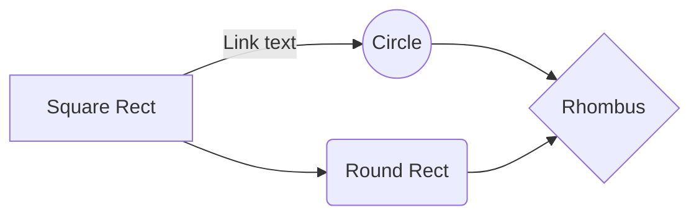

Dedicated especially to the women who fear being out there in the wild streets alone.

# Literature Study

LTE Cat M1 and NB-IoT are two similar new technologies geared for the internet-of-things sector in the world. They occupy licensed spectrum in the cellular bands, which does mean that they're not free. However, one has the benefits of avoiding interference and a higher power throughput. There appears to be many applications which use networks such as GSM, Wifi, Bluetooth, ZigBee, etc, but not as many when it comes to LTE Cat M1/NB-IoT. In fact, quite often GSM is used for connectivity, and GPS for localization. In this paper, the plan is to improve on the commonly used GSM. The goal is to investigate the optimum feasibility/usage of LTE Cat M1/NB-IoT, and a single application will be developed as a case study. There is no merit to adding GPS to 'yet another project', unless it can be proved that it has great symbiosis with the proposed technologies. What is more interesting is what kind of localization one can achieve. There are basically two categories of indoor localization: model-based and fingerprinting-based. Model based uses geometrics relative to several known anchors, like RSSI, OTDoA and AOA which are more suitable in the line-of-sight (LOS). Of the fingerprinting approach, two algorithms emerge namely predictive and deterministic, which are more suited to multipath propagation in non line-of-sight (NLOS) environments. CSI fingerprinting is a pre-processing technique, but much better than the easiest and most common form -- RSSI trilateration. 

(insert (spider) diagram comparing network technologies weighted by coverage, throughput etc.)

NB-IoT is on par with SigFox in terms of coverage (no outage at 20 dBm indoor penetration loss), except that it has higher indoor penetration (8% outage at 30 dBm indoor penetration loss vs 13% and 20% for SigFox and LoRa respectively) and bandwidth [@Lauridsen2017]. It has a maximum-coupling-loss (MCL) of 164 dBm. Because it is a licensed frequency, it significantly exceeds LoRa's population coverage when it comes to rural and deep indoor areas [@Persia2017]. Current NB-IoT modules do not meet the battery lifetime target[^longevity_target] although several optimizations are recommended by [@Yeoh2018a].

It can be a rather utopian idea that there will be worldwide coverage of a LPWAN. 

[^longevity_target]: 10 years

## Localization

In the case of LoRaWAN, current hardware and software implementations limit timestamp resolution of time-of-flight (ToF) and time-difference-of-arrival (TDoA) schemes to 1 µsec, which limits localization accuracy to worse than 300 m [@Dongare2017].

There are a number of localized applications beneficial to health and safety. A GPS solar powered GSM wearable which monitors autism in children is proposed in [@Ahmed2017c], but lacks details on extending battery life, coverage etc. A thorough investigation in elderly assistance, including fall detection (also in @Chavan2017a), heartrate and movement activity, is proposed in [@Bizjak2017a].

PPG sensor to detect heart attacks as in [@Valliappan2017], also uses GSM. ZigBee to base station monitors chronic diseases for elderly patients [@Jian2010]. Vital signs are monitored and sent via bluetooth in [@Wu2008a], [@Kale2017a], [@Rathi2017] and in the form of jewellery in [@Patel2018].

Kalman filters in [@Wu2016]. Sarsat 406 MHz life jacket in [@Serra2011]. GSM and GPS Telemedicine in [@Suganthi.2012a] and [@Tewary2016b]. 

Autonomous emergency bracelet for women proposed in [@Harikiran2016]. 

NB-FI seems like an interesting UNB alternative to SigFox as it's bi-directional. There's a nice range calculator on http://waviot.com/technology/what-is-nb-fi. The main market of NB-Fi is the US and Russia where duty-cycle doesn't apply as in https://www.thethingsnetwork.org/forum/t/waviot-nb-fi-protocol-and-the-radio-transciever/5151.

## Table

| Paper           | Objective                                                    | Method                                                       | Result                                       | Challenges                                                   |
| --------------- | ------------------------------------------------------------ | ------------------------------------------------------------ | -------------------------------------------- | ------------------------------------------------------------ |
| @Ahmed2017c     | Localization and monitoring of children with **autism**.     | **Hat / cap.** Threshold alerts. GSM / GPS                   | None / unclear                               | Solar                                                        |
| @Bizjak2017a    | Elderly assistance                                           | **Smartwatch.** Survey. GSM. Wifi. GPS.                      | Of risks, fear falls and accidents the most. | Waterproofing                                                |
| @Valliappan2017 | Elderly heart patient monitoring                             | **Headset.** Cheap arduino parts. 433 MHz. GPS. SMS (GSM)    | Not 100% accurate.                           | Accuracy. Measuring all cardiovascular diseases.             |
| @Jian2010       |                                                              | Zigbee.                                                      |                                              |                                                              |
| @Sierra2017     | Follow up on January tests amongst industry players. Point out deep coverage conditions at 164 MCL with at least 160 bps. | Device waking up from Power Saving Mode (PSM) using the Radio Resource Control (RRC) Resume procedure to resume a suspended RRC connection.Message sequence |                                              | Congestion on network delaying response to protocol control messages from the device. Often 50 ms for commercially deployed networks.Time for modem to boot up (hundreds of milliseconds) |
| @LinkLabs2016   | Comprehensive look at LPWAN technologies                     | LPWAN use cases, 9 fundamental concepts, 5 main technologies. | Pros and Cons.                               | Revolutionary -- monitor and control devices more economically than before. More investment in future. |
| @Ratasuk2016    | Targets and preliminary system design                        | Coverage, capacity, latency, battery life analysis           |                                              |                                                              |
| @Doherty2018    | Digital Doherty power amplifier proposed                     | Parallel-combining-transformer for dual-band coverage        |                                              | PA to be efficient not only at peak power but also at power back-off (PBO) to extend battery life. |
|                 |                                                              |                                                              |                                              |                                                              |
|                 |                                                              |                                                              |                                              |                                                              |

When measuring differential temperature variations, if spikes in temperature variation were suppressed, one could use a rolling average instead.


# System Overview


# Testing

NB-IoT downloading was tested  on the Sierra Wireless 7702 using the following script.

```bash
while [ 1 ]; do	
    # wget --retry-connrefused --waitretry=1 
    # 	--read-timeout=20 --timeout=15 -t 0 --continue
    wget -t 0 -c http://speedtest.ftp.otenet.gr/files/test100k.db
    # check return value, break if not successful (0)
    if [ $? != 0 ]; then break; fi;
    sleep 1s;
done;
```

A 100 kb file is downloaded at a rate of around 3kB/s. The script continues download if stalled or other errors occur. Since it is a `Yocto` installation[^yocto], the other `wget` arguments were not available.

[^yocto]: It's not an embedded solution. Rather, it creates a custom one for you, regardless of hardware architecture [@yocto1]. 

After many failed attempts with the Ublox N200 version 01B and 02B on the ZTE eNodeB in Stellenbosch, not a single log was reported by Tektronix' NSA (Network & Service Analyzer / Network Spectrum Analyzer / Non-Standalone) Protocol Analyzer when attempting to register manually with the eNodeB's standalone NB-IoT cell.

There is an interesting problem where only one of the two sims provisioned for the B06009 eNodeB / Test Plant will register to MTN (65510). According to Michael, the one sim is probably out of the IMSI range. (NSA shows `network registration failed`)

The Sierra Wireless 7702 has a Qualcomm 9206 modem which supports LTE Cat M1, NB1 and EC-GSM.

Whenever any node in the network like UE/SGW/PGW fails to respond back for any of the request messages sent by MME, then MME will be rejecting the attach procedure with cause "network failure" after maximum retries of the request message.

When Mubanga Nsofu (from Qualcomm, sent by Arun Handoo and Hardik Shah) came in this morning, he connected the DM Port of the Sierra Wireless 7702 which has a Qualcomm 9206 modem to QPST which acts as an intermediary for QXDM. We were able to decode all RF logs. Strangely, the modem didn't want to connect to in-band NB-IoT this morning, but we could tell through the logs that it registers 5 times before being rejected by the MME (rejection cause 17: “Network failure” [(Causes related to PLMN specific network failures and congestion / Authentication Failures) This cause is sent to the MS if the MSC cannot service an MS generated request because of PLMN failures, e.g. problems in MAP](https://stupidcaterpillar.wordpress.com/2011/07/20/cause-codes-from-network/)), and thus attempting via GSM as a fallback (which did still work).

His time was limited, so we left it at that, but he will be in Phase 1 tomorrow, and we can now do the tests properly. For example, attach latency under different conditions, cell-selection vs **re**selection etc.  NB-IoT (standalone, in-band), Cat M1 and GSM all still work again, since Michael and I reset the cells on the eNodeB.

Anyway, it would be nice to get cell-**re**selection working between NB1, M1 and GSM by adding `pr relationships` between neighbouring cells. Michael is trying to get some info from Ericsson, because he didn't find what he was looking for in the docs.

So far, cell-selection seems to work between NB1 in-band @953.36MHz and stand-alone @953.41MHz. It only takes about 10 seconds to switch between cells. There is also a little bit of interference there, which is noticeable when the ping tests stop at around -63dBm. I do struggle to get even just cell-selection to work between NB1 (in either mode), Cat M1 and GSM. According to Phillip New from Sierra Wireless, it does work. But I still think it's UE side problems. Furthermore, cell-**re**selection would be awesome on the live network, considering the dynamic localization use-case for my masters.

The eNodeB can read RF logs, but as Michael says, it crashes the server whenever they try to get it working (and this for the last few months). So yes, I will meet with Mubanga again tomorrow, and do some more tests, as well as seeing what is the problem when it comes to at least cell-selection.

P3 Communications https://mybroadband.co.za/news/broadband/250759-confirmed-mtn-has-the-best-network-in-south-africa.html

Nice https://mybroadband.co.za/news/cellular/255991-how-mtn-became-the-best-network-in-south-africa.html

ICASA is crap https://mybroadband.co.za/news/broadcasting/256005-icasa-looking-to-move-digital-radio-forward-in-south-africa.html

end-2016, Vodacom was best. http://www.vodacom.com/news-article.php?articleID=4338

The QXDM Professional software is also known as the Qualcomm eXtensible Diagnostic Monitor. It is a utility for those who have devices using Qualcomm ASICs and trial hardware, and allows them to test, evaluate and potentially diagnose issues in the RF performance of their mobile devices. It is often used in order to facilitate product development of these devices.

Using the software, users can see all the signaling messages made by their mobile devices, as the software generates a log of them. These logs can be annotated through the software as well. Any mix of network and phone parameters can be added to the screens, and users are allowed to use complex formulae when working with their parameters. Myriad statistical data is also generated by the program in real-time so that users can better identify potential performance issues. Users can access Markov statistics, Mux statistics, RLP statistics, the block error rate, mobility management data, paging and access statistics, forward and reverse link statistics, and more. The program also gives users a graphic display of the portable device’s signals. The program is compatible with Windows operating systems.


# Internal doc

## New

### Topic

Localization NB-IoT Dash7 LoRa

### Abstract

Emergency response mesh network.

Combine Namola and HayTag.

blockchain it possibly.

use stm32 2x2mm

Design a wearable with improved indoor positioning by using Dash7 RSSI trilateration engines and with NB-IoT/EC-GSM--assisted--satellite localization as a fallback. Physiological signals are monitored before and during emergency events to improve false positive detection.

* Is multi-modal localization necessary?
* Do mist-computing end-nodes have to be synchronized in, for example: critical events, multi-modal locations, and individual connection pairings? If so, a block-chain based approach can enhance the authenticity?

Bite-sized. Basically, the idea is to extend indoor positioning by using Dash7 RSSI trilateration engines with NB-IoT/EC-GSM--assisted--satellite localization as a fallback. Physiological signals are monitored before and during emergency events to improve false positive detection.


Need anchors which can be cellphones? Based

Unique direction finding?

### System Overview

* The system will use star or tree topologies, and mesh in edge cases.
* NB-IoT is used for assisted GNSS/GPS/Galileo and as a fallback for Dash7.

## Ideas

Ryan spoke to me. We had a great discussion. I need to paint my mind on a whiteboard, but for now I'll type here. NB-IoT not so good for emergency response. Better for monitoring. There are so many other things I can do, though. But in the end it's all about just passing the masters hey. So I do have a bunch of inside information, which could potentially be to my advantage. I'm stuck at a crossroads 3 months early says Ryan. He's looking at virtualization / SDN of MTN and 5G etc by 2022.

80 references.

Use Fog/mist computing and DASH7.

https://medium.com/@patburns/how-to-make-better-smart-contracts-with-dash7-and-pol-cf3ca3e5a0da
https://medium.com/@patburns/now-this-is-the-way-to-make-gps-way-better-for-lpwans-ddad647784cd
https://medium.com/@patburns/the-indoor-outdoor-iot-2544d1026cae

Capitalize on periodic nature of satellites. https://www.u-blox.com/en/assistnow

https://www.mbed.com/en/

http://www.st.com/en/wireless-connectivity/spirit1.html
http://www.st.com/content/ccc/resource/sales_and_marketing/promotional_material/brochure/6c/48/c0/f1/bb/35/4a/b4/brstm32ulp.pdf/files/brstm32ulp.pdf/jcr:content/translations/en.brstm32ulp.pdf

P-L496G-CELL02, based on Quectel’s BG96 modem for emerging LTE Cat M1/ NB1+2G networks. Each Pack combines an STM32L496 Discovery board and an STMod+ Cellular add-on board. 

Thinus at Kamstrup always collects GPS info.

The overall IDLab [research areas](https://www.uantwerpen.be/en/research-groups/idlab/research) are machine learning and data mining; semantic intelligence; distributed intelligence for IoT; cloud and big data infrastructures; multimedia coding and delivery; wireless and fixed networking;  electromagnetics, RF and high-speed circuits and systems. Within Antwerp, IDLab specifically focuses on wireless networking (in collaboration with Ghent), distributed embedded systems and stochastic modelling. 


https://www.uantwerpen.be/en/research-groups/idlab/research/wireless-networking/

IoT stacks:  IPSO-LWM2M/CoAP/UDP/6LoWPAN/6top/TSCH stack

- Wireless communications is a catalyst for **new intelligent applications such as localization and tracking**, providing real-time insights for contextual enablers. However,  current localization methods are either inaccurate, too costly, too energy hungry or not applicable for large-scale and challenging environments.
- **Resource constrained IoT devices & networks**: investigating ubiquitous solutions that transparently support a plethora of technologies (e.g., LoRa, DASH7, BLE, IEEE 802.15.4g), targeting co-creation of hardware prototyping and embedded protocol stack design as well as improved interactions with embedded devices.
- **Localisation & tracking:** localizing people and things in challenging environmental conditions by leveraging on off the shelf wireless technologies (a.o. UWB, Wi-Fi, Zigbee, BLE, Sigfox, DASH7) & through large-scale validations in testbeds.

GPS on a unidirectional LPWAN device with no ability to receive A-GPS ephemeris data means a cold start *of several minutes* for *each* acquisition of GPS coordinates. 

http://haystacktechnologies.com/technology/ is an important resource

http://www.sun.ac.za/english/Lists/news/DispForm.aspx?ID=4595 Maties ER24

JP Meyers says that LoRa is meant for outdoors https://www.youtube.com/watch?v=Y9lMvyTYI3E

https://en.wikipedia.org/wiki/Enhanced_9-1-1

https://en.wikipedia.org/wiki/Radio_resource_location_services_protocol

https://artes.esa.int/projects/m2m-iot-maker-space-satellite-communications


# **DASH7 Was Designed for the Internet of Things!**

DASH7 is unlike any other wireless technology standard on the planet today. https://www.indiegogo.com/projects/haytag-the-world-s-smartest-pet-tag#/

**• Long range.**   DASH7’s range is many times greater than its next competitors, but also works so well indoors it makes meshing obsolete. DASH7’s range in the USA is between 200 meters and 1 kilometer, but in Europe, Australia, China, and many other markets, multi-kilometer ranges are easily achievable.

**• Low power.**   DASH7 uses less than 1 milliwatt of power on average. No other low power wireless standard can offer full two-way, long range communications using a solar cell like DASH7.

**• Instant-on.** DASH7 was designed to “lock on” to fast moving things or people in ways that other wireless technologies cannot match. DASH7’s low latency is enabled through a unique query architecture that minimizes the elaborate hand-shaking typical in wireline-based protocols like IEEE 802.15.4, Bluetooth, or WiFi.

**• Inexpensive.** DASH7 tags can be built very inexpensively using off-the-shelf components. DASH7‘s firmware stack compiles into less than 20KB, enabling the use of lower cost silicon and minimal memory. DASH7 uses a license-free, globally available frequency, 433 MHz, which reduces the need for multiple SKU’s and simplifies interoperability across vendors.

**• Open source.** There is nothing proprietary about DASH7, which is a complete open standard with open source firmware. No other wireless IoT technology in the world offers this same level of openness. There is even an industry consortium, the DASH7 Alliance, to ensure interoperability across DASH7 vendors. DASH7 was also built with interoperability at the forefront of our minds.


https://www.uantwerpen.be/en/research-groups/idlab/teaching/internships-and-mast/faculteit-wetenschap/

## **Heterogeneous wireless networks (ORCHESTRA, MUSCLE-IoT)**

**Thesis topics**

*Distributed SDN controller for heterogeneous wireless networks.* Implementation of a distributed controller to manage a plethora of wireless and wired devices.

*Implementation and evaluation of 60GHz handovers.* The implementation and evaluation of handovers to and from the novel 60GHz Wi-Fi technology in the NS-3 network simulator.

*MAC protocol analysis on IEEE 802.11 networks.* Analysis of the impact of different versions/configurations of MAC protocols for IEEE 802.11 networks. 

**Internship topics**

*Distributed SDN controller for heterogeneous wireless networks.* Implementation of a distributed controller to manage a plethora of wireless and wired devices.

*Implementation of ORCHESTRA in NS-3 network simulator.* The implementation and evaluation of the ORCHESTRA multi-technology management framework in the NS-3 network simulator.

*MAC protocol analysis on IEEE 802.11 networks.* Analysis of the impact of different versions/configurations of MAC protocols for IEEE 802.11 networks. 

*Multipath TCP in NS-3 network simulator.* Implementation and evaluation of Multipath TCP. 

*Reverse engineer Google Wi-Fi.* You will get access to the Google Wi-Fi product and your goal is to reverse engineer it, in order to explain how the different features of Google Wi-Fi are implemented and accomplished.

## **5G (5Guards, Smart Highway, CRAN)**

**Thesis topics**

*Implementation of Next Generation Interfaces for 5G system functional split.*Implementation of gNB functional split on SDR platforms.

**Internship topics**

*Implementation of Next Generation Interfaces for 5G system functional split.*Implementation of gNB functional split on SDR platforms.

## **Low power & IoT (WiFi Halow, Battery less sensor networks, NB-IoT)**

**Thesis topics**

*Design and implement YANG/COMI models for 6LoWPAN networks.* Study and implement YANG/COMI-based models for 6LoWPAN.

*Enabling battery-less IoT devices.* Comparing different energy harvesting sources and optimizing the performance to enable battery-less communication.

*Enabling SDN capabilities in heterogeneous 6LoWPAN networks.* Study and Develop a fibbing-based approach for controlling meticulously the QoS of an heterogeneous IoT network. 

*Managing flexible multimodal IoT devices.* Combining multiple emerging wireless technologies into a single multimodal device for a more flexible Internet of Things.

*Modelling a fibbing-based API for 6LoWPAN networks.* Develop a fibbing-based interface for controlling meticulously the QoS of a network.

*Optimizing and 6LoWPAN networks.* Develop a platform for monitor and control 6LoWPAN networks in order to offer optimized QoS. 

*Optimizing 6TiSCH performance in the subGHZ band.* Study, implement and test different improvements to 6TiSCH in subGHZ band using the IEEE 802.15.4g PHY layer.

*Optimizing mobile networks for IoT devices using NB-IoT.* Propose algorithm for small data transmission (UL/DL) in sleep mode UE and implement it in NS3 simulator.

*Optimizing the energy efficiency of Wi-Fi HaLow for the IoT.* Make future Wi-Fi technology energy efficient to allow thousands of IoT devices to connect to a single access point.

*Over-the-air firmware updates for IoT devices over cellular networks.* Propose method to perform over-the-air firmware updates and demonstrate it with real NB-IoT hardware.

*Policy-based TSCH scheduling.* Research and development of state-of-the-art policy-based TSCH scheduling in power-constrained sensor networks.

*TSCH scheduling in industrial areas.* Development of a TSCH scheduling function that guarantees QoS in an industrial setting with increased interference levels.

**Internship topics**

*Design and implement YANG/COMI models for 6LoWPAN networks.* Study and implement YANG/COMI-based models for 6LoWPAN.

*Enabling battery-less IoT devices.* Comparing different energy harvesting sources and optimizing the performance to enable battery-less communication.

*Enabling SDN capabilities in heterogeneous 6LoWPAN networks.* Study and Develop a fibbing-based approach for controlling meticulously the QoS of an heterogeneous IoT network. 

*Managing flexible multimodal IoT devices.* Combining multiple emerging wireless technologies into a single multimodal device for a more flexible Internet of Things.

*Modelling a fibbing-based API for 6LoWPAN networks.* Develop a fibbing-based interface for controlling meticulously the QoS of a network.

*Optimizing and 6LoWPAN networks.* Develop a platform for monitor and control 6LoWPAN networks in order to offer optimized QoS. 

*Optimizing 6TiSCH performance in the subGHZ band.* Study, implement and test different improvements to 6TiSCH in subGHZ band using the IEEE 802.15.4g PHY layer.

*Optimizing mobile networks for IoT devices using NB-IoT.* Propose algorithm for small data transmission (UL/DL) in sleep mode UE and implement it in NS3 simulator.

*Optimizing the energy efficiency of Wi-Fi HaLow for the IoT.* Make future Wi-Fi technology energy efficient to allow thousands of IoT devices to connect to a single access point.

*Over-the-air firmware updates for IoT devices over cellular networks.* Propose method to perform over-the-air firmware updates and demonstrate it with real NB-IoT hardware.

*Policy-based TSCH scheduling.* Research and development of state-of-the-art policy-based TSCH scheduling in power-constrained sensor networks.

## **Nanoscale and Terrahertz communications**

**Thesis topics**

*Nanoscale communications for wirelessly programmable robotic materials.*Comparing wireless communication protocols that enable communication between sensors and actuators smaller than a speck of dust. 

**Internship topics**

*Nanoscale communications for wirelessly programmable robotic materials.*Comparing wireless communication protocols that enable communication between sensors and actuators smaller than a speck of dust. 

## **Deep learning for networks**

**Thesis topics**

*Create a RL agent for flow scheduling in an MF-TDMA network.* Create a RL agent that will optimize flow scheduling in MF-TDMA networks to reach given mandates.

*Creating resilient networks using machine learning.* Create a deep learning algorithm that allows a network manager detects failures before they happen. 

*Creating resilient networks using machine learning.* Create a deep learning algorithm that allows a network manager detects failures before they happen.  

*Deep learning to classify data flows in Wi-Fi and LTE networks.* Create a model using neural networks to classify different flow types like VoIP, HTTP, control, Video, …).

*Evaluating and comparing state-of-art reinforcement learning algorithms.* There are many reinforcement learning algorithms but, given a problem, how do we know which is the right one? 

*Predicting latency in heavily interfered wireless networks.* Using machine learning to predict the latency in a wireless network that has external interference.

**Internship topics**

*Create a RL agent for flow scheduling in an MF-TDMA network.* Create a RL agent that will optimize flow scheduling in MF-TDMA networks to reach given mandates.

*Creating resilient networks using machine learning.* Create a deep learning algorithm that allows a network manager detects failures before they happen. 

*Creating resilient networks using machine learning.* Create a deep learning algorithm that allows a network manager detects failures before they happen.  

*Deep learning to classify data flows in Wi-Fi and LTE networks.* Create a model using neural networks to classify different flow types like VoIP, HTTP, control, Video, …).

*Evaluating and comparing state-of-art reinforcement learning algorithms.* There are many reinforcement learning algorithms but, given a problem, how do we know which is the right one? 

## **Distributed intelligence**

**Thesis topics**

*Efficient Generative Adversarial Nets (GANs)*

*Evaluating and comparing state-of-art reinforcement learning algorithms.* There are many reinforcement learning algorithms but, given a problem, how do we know which is the right one? 

*Flexible auto-encoder for semi-supervised deep learning*

*Hierarchical Sequence Memory.* Analysis and experimental evaluation of neural networks based on Hierarchical Temporal Memory.

*Multi-technology and multi-technique wireless indoor localization.* Evaluation of different techniques for wireless indoor localization using multiple wireless technologies.

*Target Propagation for Deep Neural Networks.*

**Internship topics**

*Distributed Hierarchical Temporal Memory in NuPIC.* Distributing the existing reference implementation of the Hierarchical Temporal Memory machine learning algorithm across multiple cores or machines. 

*Efficient Generative Adversarial Nets (GANs)*

*Evaluating and comparing state-of-art reinforcement learning algorithms.* There are many reinforcement learning algorithms but, given a problem, how do we know which is the right one? 

*Flexible auto-encoder for semi-supervised deep learning*

*Hierarchical Sequence Memory.* Analysis and experimental evaluation of neural networks based on Hierarchical Temporal Memory.

*Multi-technology and multi-technique wireless indoor localization.* Evaluation of different techniques for wireless indoor localization using multiple wireless technologies.

*Target Propagation for Deep Neural Networks.*

## **City of Things**

**Thesis topics**

*Design and implement YANG/COMI models for 6LoWPAN networks.* Study and implement YANG/COMI-based models for 6LoWPAN.

*Modelling a fibbing-based API for 6LoWPAN networks.* Develop a fibbing-based interface for controlling meticulously the QoS of a network.

*Optimizing and 6LoWPAN networks.* Develop a platform for monitor and control 6LoWPAN networks in order to offer optimized QoS. 

*Optimizing 6TiSCH performance in the subGHZ band.* Study, implement and test different improvements to 6TiSCH in subGHZ band using the IEEE 802.15.4g PHY layer.

**Internship topics**

*Design and implement YANG/COMI models for 6LoWPAN networks.* Study and implement YANG/COMI-based models for 6LoWPAN.

*Modelling a fibbing-based API for 6LoWPAN networks.* Develop a fibbing-based interface for controlling meticulously the QoS of a network.

*Optimizing and 6LoWPAN networks.* Develop a platform for monitor and control 6LoWPAN networks in order to offer optimized QoS. 

*Optimizing 6TiSCH performance in the subGHZ band.* Study, implement and test different improvements to 6TiSCH in subGHZ band using the IEEE 802.15.4g PHY layer.

## Internships in cooperation with firms

*Advanced NFC communication with nurse call devices.* We want to optimize the NFC communication and range between a smartphone and nurse call devices. 

[*IoT sensor network for passenger counting on trains.*](http://www.esp.win.ua.ac.be/projects/show/id:1085) On-board railway IoT wireless sensor design and PoC for passenger counting and seat occupancy.

*Secure BLE connectivity for patient monitoring system.* You will investigated what it takes to interface to a medical device/telemetry device using BLE. 

*Linking Identity Server 4 to External Authentication services.* 

*Wireless but reliable connectivity for nurse call.* You will investigate WiFi mesh technology for communication between room terminals in a hospital nurse call system. 


## Title ideas

* Investigation into the effectiveness of NB-IoT as an emergency response wearable
  * Localization
  * Battery life
  * Global reach
  * Base station complexities
  * rel13 vs rel14
  * This is basically very much based on just NB-IoT and **all** it's features and limitations. How interesting is that really? Not unless I can extract something very useful out of it. Right?

*  Energy-efficiency optimization of LTE NB-IoT.
  * Current usage
  * Simulations
  * On-chip development
  * SDR
  * proprietary
  * fokkit

* Investigating the development of a life-saving wearable.
* Cat-M truck tyre.
* NB-IoT pedestrian safety device. fuckin' yeah. 

## Papers (to be processed)

## Secondary Research formation

### Bigger picture
~~~mermaid
graph LR
IoT --> Wireless-Networks
IoT --> Applications
Wireless-Networks --> LPWAN
Wireless-Networks --> Wifi
Wireless-Networks --> Bluetooth
Wireless-Networks --> ZigBee
Applications --> Monitoring
Monitoring --> Localization
Monitoring --> Physiological-signals
Monitoring --> Dead-reckoning
LPWAN --> GSM
GSM -- GSM Discontinued--> EC-GSM
LPWAN --> UNB
UNB --> SigFox
UNB --> NB-Fi
LPWAN --> LoRa
LPWAN --> Satellite
LPWAN --> Comparisons/survey
LPWAN --> LTE
LTE --> Cat-M
LTE --> NB-IoT
M2M-system --> NB-IoT
SDR --> NB-IoT
LPWAN --> Localization
Fields --> IoT
Fields --> Medical
Fields --> Industrial
Fields --> Educational
Fields --> g
IoT --> Smart-Grid/Cities
Smart-Grid/Cities --> Vehicle/Parking
Applications --> Vehicle/Parking
Localization -- Inter-cell-reselection --> Mobility
Localization --> CSI-fingerprinting
Localization --> RSSI-trilateration
Localization --> GPS/GNSS
Primary-Research --> Secondary-Research
~~~

~~~mermaid
graph LR

Everybody --> GV
GV --> Twilio
Twilio --> South_Africa
GVCallback --> GV
GV --> Everybody
South_Africa --> GVCallback
~~~


### NB-IoT

~~~mermaid
graph LR
NB-IoT --> Group-comms
NB-IoT --> Evaluation/analysis/overview/simulation
NB-IoT --> Performance
NB-IoT --> Optimization
NB-IoT --> Present
NB-IoT --> Future
NB-IoT --> Localization
Localization --> Mobility
Localization --> NPRS
Performance --> Energy-efficiency
Performance --> RF
RF --> Co-existence
RF --> Band
Performance --> Throughput
Performance --> Coverage
Performance --> Capacity
Performance --> Deployment
Performance --> Power
Optimization --> Data
Optimization --> Battery
Present -- 3GPP --> Rel13
Future -- 3GPP --> Rel14
Rel14 --> Rel15
Rel14 --> NPRS
Rel15 --> 5G
Rel14 --> Mobility
~~~

## Thoughts 

I'm still not sure what topic I'd like to investigate regarding NB-IoT. I like embedded development. My idea at the moment is to research and develop a localized wearable for emergency response purposes using LTE-NB2 or LTE-Cat-M2. It could potentially measure physiological signals such as heartrate and respiration, and/or dead reckoning using 9-axis measurements etc. But it feels more like an application that people out in business / in the field can do i.e. it doesn't feel very academic? I'd like something within Secondary research, not Primary, and not an application as it seems that I'm leaning towards. There is NB-IoT coverage in the area, and release 14 (NB2/M2) will be tested soon within a month or two. Release 13 (NB1/M1) is currently in place, which doesn't really allow for mobility / cell reselection.


# Appendix

## Applications

~~~mermaid
graph LR

Healthcare --> Sleep-Apnea-Monitoring
Healthcare --> Glucose-Monitoring
Healthcare --> AED-Monitoring
Healthcare --> Patient-Monitoring
Healthcare --> PERS/mPERS
Healthcare --> Sport-&-Fitness

Automotive --> TCU
Automotive --> Head-Unit
Automotive --> Smart-Antenna
Automotive --> Connected-Gateway
Automotive --> Commercial-Vehicle-TCU

Transport --> UBI
Transport --> Stolen-Vehicle-Tracking
Transport --> Toll-Collection
Transport --> Fleet-Management
Transport --> Railway
Transport --> Transit
Transport --> Container-Tracking
Transport --> Aviation

Public-Safety --> Police
Public-Safety --> Fire
Public-Safety --> Ambulance

Energy --> Smart-Meter
Smart-Meter --> Electricity
Smart-Meter --> Gas
Smart-Meter --> Water
Energy --> Smart-Grid
Smart-Grid --> Generation
Smart-Grid  --> Transformer
Smart-Grid  --> IED:Cap,Bank,etc

Industrial-&-Infrastructure --> Industrial-Heavy-Equipment
Industrial-&-Infrastructure --> Industrial-Gateway
Industrial-&-Infrastructure --> Tank-Monitoring
Industrial-&-Infrastructure --> Drones/UAV/UAS/Robot
Industrial-&-Infrastructure --> Factory-Automation
Industrial-&-Infrastructure --> Industrial-Equipment
Industrial-&-Infrastructure --> Infra
Infra --> EV-Charging-station
Infra --> Traffic-light
Infra --> Waste-Management
Infra --> Pipeline-Management
Infra --> Public-Lighting
Infra --> Video-Surveillance
Infra --> Parking-Management
Infra --> Infrastructure

Field-service-&-Logistics --> Personel-Tracking/Monitoring
Field-service-&-Logistics --> Offender-Tracking
Field-service-&-Logistics --> Goods-Tracking
Field-service-&-Logistics --> Tracking-&-Logistics

Mobile-Computing --> Laptop
Mobile-Computing --> Tablet
Mobile-Computing --> Rugged-Laptop/Tablet

Networking-Gateways-and-Routers --> Network-failover
Networking-Gateways-and-Routers --> Routers
Networking-Gateways-and-Routers --> Enterprise-Gateway

Sales-&-Payment --> POS
Sales-&-Payment --> Cashier
Sales-&-Payment --> Vending/Kiosks/Ticketing
Sales-&-Payment --> ATM
Sales-&-Payment --> Footfall-measurement
Sales-&-Payment --> Digital-Signage
Sales-&-Payment --> Retail

Wearables --> Camera
Wearables --> Kid/Pet-tracker
Wearables --> Appliances
Wearables --> Consumer

Home-&-Security --> Alarm
Home-&-Security --> Gateway
Home-&-Security --> Home-Automation
Home-&-Security --> Set-box
Home-&-Security --> Home

~~~




\newpage

---

# References
