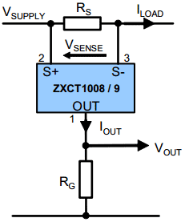

# Results

## Power Profiling

### Ublox + ZTE

The following tests measure current for a Ublox SARA N200 connected to a ZTE base station.


The digital multimeter in the figure is replaced with a ZXCT1008 high-side current monitor in series with the modem. 



Rs is set to a 1 ohm resistor and Rg is set as a 1k ohm resistor such that 100mA supplied to the modem makes 1V.

$V_{out} = I_{load} [mA] * 10 [\frac{V}{mA}]$


An initial test was performed with AT+COPS=0 network registration until T3412 timeout of 270 seconds.


Peak current is approximately 70mA.


Extended Discontinuous Reception (eDRX) mode means that paging windows can be scheduled such that the modem can be contacted by the server.


With a paging time window interval of 2.54s and 4 hyper-frames making up 40.96s, the following output is obtained.

```c
AT+NPTWEDRXS=2,5,"0001","0011"
+CEREG: 5,1,"8CA7","28C464",7,,,"00011000","00101010"
```

AT+CEREG says that the T3324 active time is 48 seconds, or 2 seconds * 24 binary coded timer value. This is not the expected outcome, even according to Table 10.5.5.32/3GPP
TS 24.008: Extended DRX parameters information as referenced in Ublox documentation, which expects 40.96s. Besides, the paging time interval is also not working as expected.


The T3324 active timer value is modified to 5.12s.

```c
AT+NPTWEDRXS=2,5,"0001","0000"
```

AT+CEREG says that the timer is 32s, or 2 seconds * 16 binary coded timer value.

```c
+CEREG: 5,1,"8CA7","28C465",7,,,"00010000","00101010"
```

In the debug logs we see the timer expires after exactly 30 seconds.

```c
1400,00:07.952393,NAS_DBG_TIMER
	action=TIMER_START
	prim_id=USIM_STATUS_TIMER_EXPIRY
	duration=30
2092,00:37.952728,USIM_STATUS_TIMER_EXPIRY
	timer_handle=16871576
```


Increasing the T3324 active timer value to 10.24s, the following results are obtained. It is exactly the same as before.

```c
AT+NPTWEDRXS=2,5,"0001","0001"
```

AT+CEREG says that the timer is 32s, or 2 seconds * 16 binary coded timer value.

```c
+CEREG: 5,1,"8CA7","28C465",7,,,"00010000","00101010"
```

In the debug logs we see the timer expires after exactly 32 seconds.

```c
2409,+00:00.400757,NAS_DBG_TIMER
	action=TIMER_START
	prim_id=USIM_STATUS_TIMER_EXPIRY
	duration=30
5981,+00:33.283905,USIM_STATUS_TIMER_EXPIRY
	timer_handle=16871576
```


(These tests should continue until an eDRX value of 2621,44s, or 43.69 minutes and repeated for Quectel, Nordic, SimCom and on Nokia, Ericsson and Huawei basestations)

Also, what is the current usage of running a specific command? Is it negligible or is, for example, polling AT+CSQ constantly detrimental on battery life?

## ping

### Quectel + ZTE

The following tests were taken on the roof outside the HF RF lab on the 5th floor of the Electrical & Electronic Engineering building. The base station it connected to is on the General Building, and is just over 150m away at the same elevation with a single building blocking line-of-sight. The base station is situated on the bottom left if the picture at an altitude of approximately 138m.


The tests involve sending a set of 10 pings multiple times at a certain attenuation and resulting RSSI measurement.

With an antenna and the attenuator set to 0dB, we find most of the values around the mean of 185.2ms, except for the tail at around 500ms which is the time of the first ping in a set of 10.


Setting the attenuator to the max of 110dB, we see no change in the ping measurements which have a mean of 185.9ms. The tail has increased to a max of just over 600ms.


Removing the antenna from the attenuator, we find that the data has a slightly thicker tail, and averages around 207.1ms.


Lastly, having no attenuator nor antenna we still have a connection at -107dBm with a mean of 190.6ms.


To be able to attenuate the signal until disconnection, one must increase the range from the base station such that leakage transmission from traces, soldering and attenuator connectors do not interfere with the test.

There must not be a connection to the base station at all if the antenna or attenuator is disconnected or connected at maximum attenuation.

A test was performed from 10pm onwards at Technopark on 14 March 2019. A connection was made at a range of 4.8 km at -93dBm and an altitude of 132m. This is a relative elevation of -6m. At a point just below technopark and slightly closer, the altitude is -13m relative to the base station.


At 0dB attenuation the data has a mean of 196.7ms and a tail just above 500ms.


At 10dB the data is more spread out from 200 - 500ms with a mean of 396.4ms and a tail at just under 1000ms.


At 20dB attenuation, the data is more spread across 350 - 1000ms with a mean of 793.4ms and a tail that extends to over 4500ms.


Any more attenuation and the signal is lost.

The greatest distance measured was 5.5km from the intersection of the R44 and the turn-off to Stellenbosch Square at an altitude of 106m. This is a relative elevation of -32m to the base station.


At this point, the signal strength increased to -89dBm and resumed a mean of around 209.6ms with a tail around 500ms.


A similar pattern was seen at Parmalat, but driving closer there were a few spots where connection was lost or many retries were needed such that the tail extended up to almost 3000ms for the ICMP ping time.


Adding the previous test data together we see the following shape and form.


Lastly, all the test data including raw data on the way to Technopark, we see a similar form.


Looking at the ICMP ping response according to different RSSI values, we see high jitter of a few seconds from -80dBm or less.

