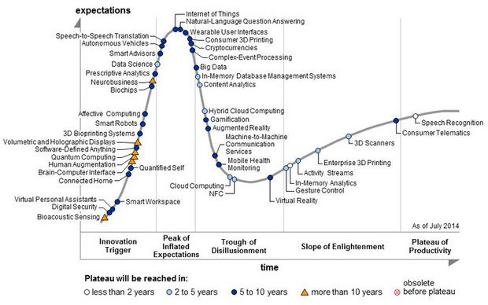

# LTE Cat-NB Network and UE Characterization in IoT

# Acronyms

**OTDOA** -

# Intro

Although NB-IoT joined LPWANs circa 2016-2017, demand uptake among consumer and industry in South Africais still slow as well as national coverage rollout. Worldwide it has 30% (rough estimate?) population coverage with most in Europe, China and lately America (mid-2019).

In South Africa, NB-IoT has most of its coverage in the Gauteng province as well as a few sites in other towns and cities. Although Gauteng only covers 1.49% of the land mass in South Africa, it holds ~22% of its ~57 million people so it is great as a live trial run before pushing for national coverage.

It is based off of LTE, making integration and upgrading of existing infrastructure more seamless than an entirely separate technology. As a whole, it inherits the same characteristics with the benefit of low power, and the trade off of low bandwidth which is suitable for smart devices and IoT.

An application developer in IoT is interested in a hands-on approach with the technology they will use, with the aim of scaling up production such that volumes of 1000 devices or more can be reached. Thus an empirical evaluation of the technology is focused on in this thesis, especially when considering that much of the research is analytical or simulation bound.

Martinez [@Martinez2019] has explored NB-IoT from the perspective of the application developer. It is well thought out, and follows a similar path to this thesis. When evaluating performance, it would do well to find the limits of the technology as well as find the optimum 'sweet spot' or range for efficient operation.

A user would consider critical characteristics such as energy consumption, coverage, cost, network latency and behavior. Martinez looks at these except for cost, which is better looked at by Ali [@Ali2015]. A set of tests were devised and results showed that its energy consumption performed better than an LPWAN referenced technology such as LoRa, with the added benefit of guaranteeing delivery. However, the high variability in energy consumption and network latency call into question its reliability especially for mission-critical applications.

## IoT

In 2014, Gartner estimated that IoT had reached the height of inflated expectations, and the hype it generated has resulted in a rich ecosystem of technologies.

Hype yields investment, regardless whether the underlying innovation holds value. Cryptocurrencies are merely a decentralized form of monetary exchange that exists world-wide wide where its value is mainly speculative. Speculation can be volatile, and it can be deemed more ideal for an innovation to have stable growth. IoT holds value in connecting things to the internet, as in its namesake. This can be seen in the venture capital injection into companies and start-ups and the number of connected devices over time.

![Number of connected devices [@Ali2015]](../images/Expected-number-of-connected-devices-to-the-Internet-This-chart-is-obtained-from-recent.png)

As an aside, when forecasting time-series data it would be pragmatic to consider technical analysis, fundamental understanding and sentiment. Due to simplicity it can be considered safe to say that IoT shows exponential growth, and unless a technology disruption occurs which means we do not require connections or our devices, then there is undoubtedly an [uptrend](https://amarketresearchgazette.com/global-narrowband-iot-nb-iot-market-2019-2025-vodafone-china-unicom-china-telecom-att-etisalat-telstra-orange-telefonica-sk-telecom-deutsche-telekom/). As Gartner predicts, we should be in the plateau of productivity now, and this can be observed by looking at the current news regarding the technology.

A few months before publishing, [AT&T announces](https://blog.nordicsemi.com/getconnected/att-launches-nb-iot-network-in-usa) nation-wide coverage of NB-IoT in the USA, alongside its existing LTE Cat-M coverage. Deutsche Telekom and Vodafone cover Europe (news?) and China enables millions more IoT devices [@china2019].

## LPWANs

There are many wireless technologies out there, with some standardized (including Bluetooth, 6LowPan, RPMA, Weightless, IETF 6TiSCH, SigFox, LoRaWAN, Dash7 amongst others). Many are proprietary to retain company value and they try to meet application specific requirements also limited by technological constraints. Matching custom applications with a wireless technology is non-trivial as there is no silver bullet that matches all use-cases. On the contrary, many technologies overlap in their capabilities.

## Smart metering

One of the simplest use cases in IoT is smart metering. Periodically sending uplink data at regular intervals from a static location has the advantage of remote monitoring and reducing the need for physical readings. It also opened up new features for users (such as dynamic pricing and usage pattern analysis) and operators (such as load balancing a large number of clients). The clear value proposition and success is partially due to the belief that IoT should be low powered and low data transmissions which still exists today.

## NB-IoT

Formed by the 3GPP from LTE, NB-IoT was developed within that framework and its capabilities are particularly well suited to smart metering.

![IoT Market representation [@Martinez2019]](../images/1559246290186.png)

Taking it one step further, the 3GPP defined two device categories, namely Cat NB1 and NB2, with the latter adding support for:

- Support of Positioning of Device using OTDOA
  * seamless cell re-selection
- Push to talk voice messaging
- New Device Power Class (14 dBm)
- Multicast transmission

 OTDOA positioning, 

Compared to LTE

* devices are stationary

* intermittent burst transmissions

* low data bandwidth

* delay-tolerant applications

* support for huge number of devices

* deals with poor coverage (indoor penetration)

* battery lifetime of a few years

## Performance limitations

It would be useful for the application developer to know the boundaries resulting from this approach. Drawbacks and optimizations targeting IoT can be discussed. The application developer is a potential adopter of the technology and focuses on parameters that fall within end-user control.

Cellular operators would also benefit by knowing where they can improve upon their configurations and equipment.

To this end it would be beneficial to:

* Analyze critical metrics at the core of NB-IoT, such as energy consumption, coverage, cost and latency.
* Create a testing framework to characterize NB-IoT devices in actual operation and using various networks.
* Set optimal operating boundaries based on the obtained results. This should also re-evaluate suitability in certain use cases.
* Compare NB-IoT to Dash7, which can be considered a prominent bi-directional contender. It has the capability of using LoRa's physical layer (RF frontend) so has the added benefit of long range.

# Literature study

Several studies provide theoretical models not only for the energy consumption of NB-IoT networks [@Andres-Maldonado2017], but also for their latency and delay bound [@Feltrin2019], impact of coverage extensions [@Andres-Maldonado2018b], coverage performance [@Adhikary2016], battery lifetimes [@Yeoh2018d],[@Lauridsen2018], (theoretically) optimal configuration strategies [@Feltrin2018] and overall performance for particular verticals [@Soussi2018],[@Beyene2017b].

Only Martinez [@Martinez2019] focuses effort on the adopter and presents an operational and empirical analysis of the technology when it is deployed in a real network. 

Despite the unquestionable value of the theoretical models (for example, to understand orders of magnitude or to guess the theoretical upper and lower bounds), an empirical approach provides real insights into the variability that a UE experiences when deployed in real conditions. This work therefore goes in this direction as a complement to Martinez and related works, and it further provides empirical measurements for UEs that are deployed using a real-world NB-IoT network always while taking the perspective of an application developer.

GSM RF equipment testing and performance analysis [@Kasbah2005]

Analysis of NB-IoT Deployment in LTE Guard-Band [@Ratasuk2017c]

## MTN Lab / 14th Ave Phase 3: Test Plant

NB-IoT PoC MTN South Africa (Ericsson RAN Connectivity Tests only) [@Ssengonzi2017]

Industrial north Drive Test Requirements [@NorthDrive2017]

Evaluation of next-generation low-power communication technologies to replace GSM in IoT-applications [@Thomas2018]

## Manufacturers

Ublox ha NB-IoT Application Development Guide [@ubloxAppNote2018].

# References