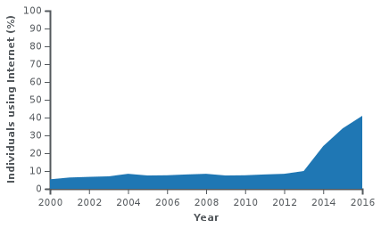

## Indoor positioning

Do I want to talk about all the ways there are to do this? No.

## Background to the Research Problem/Question

*Intro to the internet*

ARPANET adopted TCP/IP on January 1, 1983, and from there researchers began to assemble the “network of networks” that became the modern Internet. The online world then took on a more recognizable form in 1990, when computer scientist Tim Berners-Lee invented the World Wide Web. The first South African IP address was granted to Rhodes University in 1988. On 12 November 1991, the first IP connection was made between Rhodes' computing centre and the home of Randy Bush in Portland, Oregon. By November 1991, South African universities were connected through UNINET to the Internet. Commercial Internet access for businesses and private use began in June 1992 with the registration of the first .co.za subdomain.

In terms of Mobile broadband, we have multiple cellular ISPs. Both Vodacom and MTN Group Limited were founded in 1994, Cell C in 2001 and Telkom Mobile in 2010.

The most recent entrant is Rain LTE which commercially launched in June 2018.

In terms of M2M connectivity, many options. Of the LPWANs we have FastNet, SquidNet etc. In terms of cellular we have GPRS and in some cases 3G. Both are considered high power. The cellular industry came up with LTE-M, NB-IoT and EC-GSM-IoT.

LTE-M is still considered high power, and due to the high ICASA costs for spectrum, it is not considered in the case of South Africa. NB-IoT is only 200 kHz, so more manageable. EC-GSM-IoT is only in trial stages still, but there is a move to turn off sunsetting GSM technologies and towers, it should be considered to move away from this technology altogether. It is also not gaining as much traction as LTE-NB and LTE-M. This leaves NB-IoT, which both MTN and Vodacom are actively pursuing.

**LTE Cat-M**

MTN considered it but ICASA spectrum costs.

**NB-IoT**

MTN and Vodacom.

**EC-GSM-IoT**

Not in SA.

**SigFox**

SquidNet

**LoRaWAN**

FastNet. TTN

