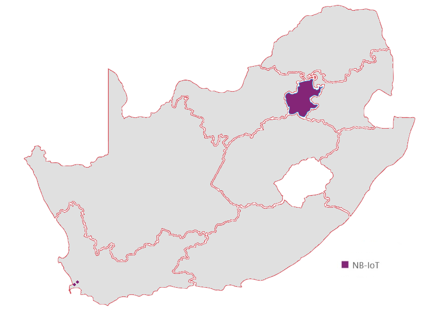

\newpage

# Declaration {-#declaration}

By submitting this report electronically, I declare that the entirety of the work contained therein is my own, original work, that I am the sole author thereof (save to the extent explicitly otherwise stated), that reproduction and publication thereof by Stellenbosch University will not infringe any third party rights and that I have not previously in its entirety or in part submitted it for obtaining any qualification.

\vspace{1cm}

Date: .......................................................

\vspace{15cm}

Copyright © 2020 Stellenbosch University 

All rights reserved.

\newpage

# Abstract {-#abstract}

A number of tests have been developed, performed and analyzed for multiple UEs (Ublox and Quectel) and MNOs (MTN and Vodacom) via ZTE and Nokia vendors. Power saving, latency, RF, packet and network metrics are evaluated using UDP, Echo, COPS (network registration), eDRX and PTAU tests.

# Uittreksel {-#uittreksel}

# Acknowledgements {-#acknowledgements}

* **Prof Thinus Booysen** - for his unrelenting care, innovative passion, inspiring belief in people and charming charisma.
* **Family** - for their love and dedication.
* **Friends** - for their wisdoms, experiencing the journey together and sharing moments in highs and lows.
* **MTN Mobile Intelligence Lab** - for providing funding, expertise and laboratory working environment.
* **Ryan van den Bergh** - for driving innovative ideas at MTN.
* **Michael Beetge** - for his expertise in the MTN Phase 3: Test Plant and extensive knowledge of LTE
* **Collin Mamdoo** - for his knowledge on IoT and helpful assistance at Vodacom
* **Helene  Lambrechts** - for her aid in coherence and cohesion.
* **RF Design** - for providing samples and development kits.

# Acronyms {-#acronyms}

|      |      |
| ---- | ---- |
| **3GPP** |    Third Generation Partnership Project |
| **AMQP** |    Advanced Message Queue Protocol |
| **AMOS** | Advanced Managed Object Script |
| **AT** |      Attention |
| **BPSK** | Binary Phase-Shift Keying |
| **BTS** | Base Transceiver Station |
| **CDP** | Connected Device Platform |
| **COPS** | Cellular Operator Selection |
| **CoAP** | Constrained Application Protocol |
| **D2D** | Device to Device |
| **DCE** | Data Communications Equipment |
| **DL** | Downlink |
| **DTE** | Data Terminal Equipment |
| **E-UTRAN** | Evolved-UMTS Terrestrial Radio Access Network) |
| **EARFCN** | E-UTRA Absolute Radio Frequency Channel Number |
| **EARFCN** | Extended Absolute Radio-Frequency Channel Number |
| **ECL** | Enhanced Coverage Level |
| **eDRX** | Extended Discontinuous Receive |
| **eNB - eNodeB** | E-UTRAN Node B |
| **GPRS** | General Packet Radio Service |
| **ICT** | Information and Communications Technology |
| **IMEI** | International Mobile Equipment Identity |
| **IMSI** | International Mobile Station Identity |
| **IP** | Internet Protocol |
| **LBT** | Listen Before Talk |
| **LPWAN** | Low-Power Wide-Area-Network |
| **LTE Cat-NB1/2** | Long Term Evolution Narrow-Band Category 1/2 |
| **MCL** | Maximum Coupling Link |
| **MCS** | Message Coding Scheme |
| **MNO** | Mobile Network Operator |
| **MO** | Mobile Originated |
| **MO** | Managed Object |
| **MQTT** | Message Queuing Telemetry Transport |
| **MT** | Mobile Terminated |
| **MTC** | Machine Type Communications |
| **MTN** | Mobile Telephone Network |
| **NW** | Network |
| **OTDOA** | Observed Time Difference Of Arrival |
| **PCI** | Physical Channel ID |
| **PDR** | Packet Delivery Ratio |
| **PS** | Packet Switched |
| **PTAU** | Periodic Tracking Area Update |
| **PTAU** | Periodic Tracking Area Update |
| **QXDM** | QUALCOMM eXtensible Diagnostic Monitor |
| **RRC** | Radio Resource Control |
| **SIM** | Subscriber Identity Module |
| **SMS** | Short Message Service |
| **SNR** | Signal to Noise Ratio |
| **TCP** | Transmission Control Protocol |
| **TE** | Terminal Equipment |
| **UDP** | User Datagram Protocol |
| **UE** | User Equipment |
| **UL** | Uplink |
| **UMTS** | Universal Mobile Telecommunications System |
| **URC** | Unsolicited Result Code |
| **USSD** | Unstructured Supplementary Service Data |
| **UUID** | Unique User Identification |
| **WAP** | Wireless Application Protocol |

## SI Units {-#siunits}

- **kB, MB** - kilobyte, megabyte
- **kbps** - kilobits per second
- **mJ or J** - millijoules or joules
- **s, ms, us** - second, millisecond, microsecond
- **mWh** - average power in milliwatt-hours

\newpage

# Introduction {#intro}

Narrowing the spectrum bandwidth for LTE results in a low data-throughput, low energy technology which matches the requirements for wireless IoT, hence NB-IoT.

This chapter introduces the reader to various concepts relating to NB-IoT and the performance characteristics thereof. It begins with the question "Why NB-IoT?" before developing the research question, objectives, scope, terminology, background and other various related concepts to fully orient the reader with regards to NB-IoT.

## Why NB-IoT? {#why}

NB-IoT is an LTE technology developed by the 3GPP as a response to the growing need for an LPWAN to fill the role 2G/GPRS leaves behind as countries around the world schedule its departure. The technology shows performance benefits over alternative LPWANS in terms of up and downlink throughput, range and longevity, yet current research shows that variation in energy consumption leaves battery longevity in question. Nevertheless, according to 3GPP specifications and manufacturer claims, highlights include:

* ~ 10 year battery-lifetime.
* Under 10 second transmission acknowledgement for latency-tolerant applications
* \+ 20 dB improvement over 2G/GPRS via enhanced coverage levels (ECL).

It would be useful to further investigate variation in energy consumption in the technology.

## Problem Statement {#probstat}

Knowing that NB-IoT (LTE Cat-NB) is a competitive alternative to LoRaWAN, SigFox and other LPWANs, it does not have strong uptake in South Africa yet. It offers energy efficient bidirectionality (as opposed to the uplink-centric norm) using extended discrete periodic reception (eDRX), yet variation in transmission energy and latency can affect battery lifetime drastically. Application developers require network coverage before they are interested in developing business cases, and cellular service providers require consumer and enterprise demand or business cases before rolling out national network coverage. This creates a paradoxical situation where neither party gives in unless they are both willing to come to a compromise. Such efforts can be limited by a lack of understanding in the technology, and this is not helped by the fact that although there is a great deal of theoretical analysis and simulations in research, the lack of empirical evidence may be contributing to a general uncertainty in the standing of the technology with respect to alternatives and thus a slower adoption. This thesis aims to bridge that divide in South Africa by evaluating NB-IoT's performance empirically using a set of metrics and estimate optimal use.

## Research Objectives {#resobj}

* The aim of this study is to evaluate latency and power efficiency of NB-IoT with a set of metric tests comparing user equipment (UE) devices against multiple mobile network operator (MNO) vendors exposing the change in variability due to proprietary LTE complexities.

* Whilst theoretical models provide value in showing how factors affect an approximation, the boundless underlying complexities of LTE architecture make it hard to predict the variability induced by unpredictable network conditions. Thus, an empirical approach is proposed. Since the energy efficiency of a single network is questionable in Durand [@Durand2019], Martinez [@Martinez2019] and affected by latency, these will form the main metrics investigated in this study.

* Battery longevity and recommended telemetry intervals are estimated, and secondary metrics such as signal strength, throughput and data overhead are investigated. 

* In turn, the above objectives evaluate robustness, stability, capabilities, sources of variability and claimed versus actual core features.

* This thesis aims to highlight the challenges, advantages and disadvantages of the technology. By doing endpoint tests with multiple manufacturers and base station vendors, one can paint an accurate picture of the capabilities of the technology. [^bullets]

[^bullets]: ask Thinus if he's happy with objectives like so in sentences, or bulleted?

## Scope of Work {#scopework}

Although there exists a multitude of UE devices, LTE vendors, estimations and metrics, the study will be limited to the following as seen in Table \ref{tbl:metric_summary} and \ref{tbl:telemetry_ue_lte}.

Table: Metrics and Estimations {#tbl:metric_summary}

| Main Metrics     | Secondary Metrics | Estimations        |
| ---------------- | ----------------- | ------------------ |
| Power Efficiency | Signal Strength   | Battery Longevity  |
| Latency          | Throughput        | Telemetry Interval |
|                  | Data Overhead     |                    |
|                  | ECL               |                    |

Table: Telemetry Types, UE devices and LTE vendors {#tbl:telemetry_ue_lte}

| Telemetry Types | LTE Vendors | UE Manufacturers |
| --------------- | ----------- | ---------------- |
| UDP Packets     | ZTE         | Ublox            |
| eDRX and PTAU   | Nokia       | Quectel          |
| COPS            | Ericsson    | Nordic           |
| Data Echo       | Huawei      | SimCom           |

Considering Table  \ref{tbl:metric_summary} and metrics, a more comprehensive study has been performed on throughput, packet delivery ratio (PDR), maximum coupling link (MCL) and scalability by Durand [@Durand2019]. Martinez has investigated the performance boundaries of NB-IoT for a Vodafone network in Barcelona, Spain [@Martinez2019] including metrics such as energy consumption, transmission delay, enhanced coverage levels (ECLs) and different data sizes. Because power efficiency and latency is significantly affected by variability, important considerations have to be made in application development and thus it is of the main metrics this study is focused on. Between UE device and LTE basestation (BTS) both signal strength (RSRP) and coverage enhancement levels (ECL) can be causes of variability. 

In terms of estimations, variability affects battery lifetime and telemetry interval amongst others. Battery lifetime is defined as the length of time a device will last on an AA battery in years. Telemetry interval is defined as the time between different types of messages to last a year on an AA battery. These two estimations are necessary for developers to consider in battery-powered applications and form an important basis for this study.

The different types of telemetry messages in Table \ref{tbl:telemetry_ue_lte} include UDP datagram transmission, cellular operator selection (COPS), UDP Echo, extended discontinuous reception (eDRX) and periodic tracking area updates (PTAU). UE devices give the option of using the following main data transmission protocols: UDP, TCP, CoAP and MQTT. UDP is a connectionless protocol used for low latency applications and TCP is used to stream data orderly, reliably, but at a cost to data overhead.  CoAP and MQTT are lightweight message transfer protocols based off of UDP and TCP respectively. To measure the data overhead secondary metric caused by network repetitions and other mechanisms, it would be preferable to avoid overhead from other protocols and thus the simplest option is chosen, namely UDP. 

Table \ref{tbl:telemetry_ue_lte} also gives us the following LTE vendors which are among the top 5 in the world: Huawei, Ericsson, Nokia and ZTE. Since there are over a hundred MNOs across the world which also use these LTE vendors, performing this study on the main LTE vendors will also benefit the MNOs. With regard to NB-IoT connectivity on MNOs in South Africa, MTN will be used for ZTE and Ericsson, and Vodacom will be used for Nokia and Huawei. Finally, application developers are likely to use more popular NB-IoT module manufacturers such as Ublox, Quectel, Nordic and SimCom, besides lesser known ones such as Telit, Gemalto, akorIoT and so on. 

The capture method should be easily repeatable and expandable for new UE devices. On the basis that the AT command API is familiar to all UE devices, a framework will be built to extract data via this method. Although all UE devices are usually accessible through AT commands, there are alternative diagnostic methods such as Qualcomm QXDM, UEMonitor and an opensource decoder by LanternD which monitors the debug stream provided over UART at 921600 baud. QXDM is a proprietary diagnostic program built for UE devices with Qualcomm chipsets, yet it costs in excess of a few thousand USD. UEMonitor is free and can capture debug traces from both Ublox and Quectel. LanternD's decoder is still in beta and unstable. Since both Ublox and Quectel's debug messages can be accessed by UEMonitor and LanternD, these UE devices will be used to compare LTE Vendors. There is no support or alternative for Nordic or SimCom devices, however. 

## Terminology {#terminology}

Because the nature of this thesis provides many broad concepts and complex terms, this section briefly introduces to the reader various IoT, LPWAN, LTE related topics expanded upon in the rest of the thesis. The background of NB-IoT is discussed in Section \ref{background}.

The Internet of Things (IoT in Section \ref{iot}) is a blanket term for smart devices that connect to the internet. These devices are typically found in remote or urban areas where it would be more efficient for a device to control and monitor the status of the surrounding environment than human intervention. 

Smart devices or 'things' can connect to the internet by wire or wirelessly. Wired devices usually connect using ethernet, although it is not uncommon to use industry grade protocols such as RS232, CAN, ModBus, ProffiBus, and so on before data reaches a network hub and the internet. Wireless connections, on the other hand, have the benefit of easy installation and really shine in inaccessible areas. It is quite effective to connect Bluetooth and WiFi for short range applications, or using Low Powered Wide Area Networks (LPWANs in Section \ref{lpwans}) such as LoRaWAN, SigFox and NB-IoT for ranges exceeding a few kilometers and especially for limited sources of power.

Considering how LPWANs usually fill niche applications and just looking in terms of modulation differences, Long-Range Radio (LoRa or LoRaWAN in Section \ref{lorawan}) uses chirp-spread-spectrum (CSS) modulation to make it quite immune to doppler effect motion and SigFox (Section \ref{sigfox}) uses binary phase-shift keying (BPSK) in an ultra-narrow band which increases noise immunity, but devices cannot move more than 6 km/h. LPWANs enable many use cases (Section \ref{usecases}) such as remote sensing, actuator control and location tracking.

GSM and GPRS fall under 2G and 2.5G which started development in the early 90s. Data transmission (such as USSD, SMS, WAP, IP) is circuit-switched over GSM, and packet-switched over GPRS. Circuit switched data is billed per time interval such as seconds or minutes, and packet-switched is charged per number of bytes (kB, MB, etcetra). It evolved into 3G in Release 99 at the turn of the millenium and 4G/LTE in Release 8 (Q4 2008).

Long Term Evolution (LTE) is a cellular architecture which is a subset of an even more complex 3GPP body that guides its development. In LTE, the narrowband category is known as LTE Cat-NB or NB-IoT. LTE Cat-M is designated for M2M applications, and although it is quite similar to NB-IoT, it features VoIP, faster throughput and is more similar to the LTE protocol. There are two different versions of NB-IoT, with LTE Cat-NB1 being release 13 and LTE Cat-NB2 being release 14. Their specifications have been frozen in Q1 2016 and mid-2017, respectively. [^group_terms]

[^group_terms]: group terms and don't be disjointed

## Background of NB-IoT{#background}

In recent years, 3GPP have developed new LPWANs for the cellular industry on the roadmap towards 5G, namely LTE Cat-M, EC-GSM-IoT and NB-IoT to supersede the sun-setting 2G/GSM/GPRS networks. The beginnings of these new cellular LPWANs started when GSM was first deployed in 1991 and offered calls and SMS as circuit switched data. In 2000, 2G/GPRS added internet at speeds comparable to dialup as packet switched data. Circuit switched data is ideal for real-time connections and means that links have bandwidth pre-allocated. This also increases the QoS guarantee of information transferred timeously. Packet switched data is connectionless on the other hand, with higher bandwidths possible in shared channels. In Fig. \ref{fig:2G_LTE_transition}, we see how technologies using 2G/GSM/GPRS transitioned to LTE. With regard to 'internet', we used emails, WAP and other 'web-based' forms of messaging to keep in touch. Over time, we moved to a plethora of IMS platforms such as WhatsApp, Telegram and WeChat to name a few. Machine-to-machine (M2M) communications started off with SMS, USSD and 2G/GPRS but now with the advent of LPWANs we have many to choose from including LoRaWAN, SigFox and cellular-based forms such as NB-IoT.

{ width=50% }

In South Africa, there is a push by cellular service providers to adopt a cellular LPWAN to fill the void left behind by 2G/GPRS now and in the future. NB-IoT is being investigated by MTN South Africa, and since they are also funding this research, have also provided network coverage for testing to Stellenbosch University. Ideally, the technology can be rolled out to existing base stations as a software upgrade for national coverage, but it is limited by factors such as use case demand, expensive licensing and general uncertainty about the technology.

2G/GPRS has served as the gateway for smart devices and sensors in the M2M sphere for many years, but due to its high-powered nature it is not sustainable for applications which require battery longevity of up to 10 years or more. In lieu of its absence, although the spectrum it held can be re-farmed for cellular LPWANs, it also opens up opportunities for market entrants of unlicensed frequencies such as LoRaWAN and SigFox. Each LPWAN technology has its own unique flaws and benefits and there is yet to be a clear winner when it comes to connecting 'things' to the internet.

When considering rolling out more coverage, since NB-IoT is based off LTE it makes integration and upgrading of existing infrastructure more seamless than an entirely separate technology. Although it still retains the drawbacks and complexities of legacy LTE such as the vast array of sub-protocols, this still includes the low power, low bandwidth benefits and others which match the requirements for smart devices and IoT. It should be mentioned that much of the RF spectrum which can be used for digital communications is still used by analogue television broadcast by SABC. ICASA, who controls the spectrum, can solve this issue but over the years they have been a strong limiting factor as well since they are slow (if at all) to release new spectrum to MNOs. To increase demand for application developers in IoT, because they will be interested in a hands-on approach with the technology they will use, more network coverage is necessary to scale up production such that volumes of 1000 devices or more can be connected. [^background]

[^background]: **history** - from GSM in 90s to 5G NB-IoT. **SA and coverage** - how it "fits" in South Africa and LPWAN sphere. **IoT** - how relevent. **coverage** - ICASA. 3GPP - why they designed it. future. Uncertainty about NB-IoT. standing. uptake. optimal use

## Metrics {#metrics_intro}

* **MCL**: For IoT devices used in extended coverage situations,
  such as deep-indoor devices or remote locations, we recommend either Sigfox or NB-IoT, as they offer a maximum MCL of more than 158 dB. IoT devices for general use would benefit from the large-scale deployment of the GPRS network, which provides excellent coverage because of its legacy infrastructure. It is clear that the extra overhead available in Sigfox, LoRaWAN, and NB-IoT allows for better indoor coverage than GPRS, which means that the LPWAN devices can be used in less than optimal operating conditions. Measured MCL correlates with theoretical values.
* **Power consumption**: In applications where device battery life is
  a crucial factor we recommend, either LoRaWAN or Sigfox, because they are completely asynchronous. We found that the battery life of LoRaWAN SF 7 was five times that of LoRaWAN SF 12 and nearly 25 times that of Sigfox. This is mainly due to the extremely long time-on-air of LoRaWAN SF 12 and Sigfox. If NB- IoT worked with the mobile network operators to reduce its RRC- idle phase, it could develop a minimal power consumption to compare with that of LoRaWAN and Sigfox.
  * It is clear that LoRaWAN SF7 is the most power-efficient, due to the short transmission burst. NB-IoT displays the worst power-consumption, due to the extended RRC-idle state. This can be reduced using Release Assistance as in Section \ref{release_a}.
* **Throughput**: As throughput differs greatly between the four technologies, comparisons should rather be made in either the licensed (NB-IoT and GPRS) or unlicensed (Sigfox and LoRaWAN) spectrum categories. Applications that require huge amounts of data to be transmitted, such as real-time vehicle fleet monitoring, we recommend GPRS and NB-IoT as they are not duty cycle limited. The choice of GPRS or NB-IoT will be based on the battery life requirements of the IoT device, with NB-IoT having the advantage. In the case of extremely low-throughput applications, such as water meters, power meters, and weather stations, we recommend Sigfox, as it offers a scalable solution with no base station costs involved. Although it limits the 12 byte throughput per 24 h to 140 messages, this is more than the 20 messages offered by LoRaWAN SF12 (TTN).
  * As NB-IoT operates in the licensed spectrum, there are no
    throughput restrictions, other than the data-rate restriction. We measured the uplink and downlink data rates in different signal quality environments (distances from the gateway) by querying the modem. The measured downlink rate varied from 2250 to 14,193 bps. We could find no clear correlation between the downlink data rate and the signal quality environment.
* **Scalability**: 
  * Lower (sub-500 devices per gateway) scalability of LoRaWAN per base station compared to NB-IoT and GPRS. This low scalability is due to the limited number of channels and the lack of any scheduling between devices. To compensate for the low scalability, an increase in spatially diverse base stations would allow packets to be received by multiple base stations at varying received power levels.
  * This simulation showed that with 55,000 devices transmitting the base station would reach the 270 simultaneously transmitting devices that Sigfox claims is possible while still ensuring a 99.9% PDR.
* **Down link latency**: In applications where downlink latency is a
  critical component, only GPRS will suffice, as it is the only technology in this study that requires constant paging between the base station and the end device. 
* **Down link throughput**: Any applications requiring bi-directional communication of more than 120 bytes per 24 h, should use NB- IoT or GPRS, as Sigfox and LoRaWAN are limited by the duty- cycle limitations of the base station. 
* **FoTa**: GPRS and NB-IoT are able to offer FOTA upgrades to IoT devices, as Sigfox ha s limited bandwidth. This feature is supported by LoRaWAN, through the fragmentation of large payloads [22].

## LTE Vendors

In South Africa, there are two mobile network operators trialing NB-IoT and combined they use four of the top LTE vendors. Samsung has started using NB-IoT only as recently as May 2019, announcing a partnership with [KT to create a Public Safety](https://enterpriseiotinsights.com/20190506/nb-iot/samsung-kt-launch-nbiot-service-through-ps-lte-network-korea) (PS-LTE) network. They're also implementing device-to-device (D2D) communications to increase connectivity in unfavourable conditions.

Table: MNOs and their BTS Vendors {#tbl:mno_bts}

| BTS Vendors | Cellular operator (MNO) |
| ----------- | ----------------------- |
| Nokia       | Vodacom                 |
| ZTE         | MTN                     |
| Huawei      | Vodacom                 |
| Ericsson    | MTN                     |

Theoretically, one can assume that these manufacturers meet 3GPP's specifications and that they have set up an optimal environment.

With a testing framework, one can evaluate these capabilities in a transparent manner for both developers and cellular operators alike and work towards improving the quality thereof.

Cellular operators are in control of some things, and users of others.

Table: Cellular control {#tbl:cellular_control}

|                             | Cellular operators | Users       |
| --------------------------- | ------------------ | ----------- |
| NB-IoT Base stations (BTS)  | **X**              |             |
| NB-IoT User Equipment (UE)  |                    | **X**       |
| LoRaWAN Gateways            |                    | **X**       |
| LoRaWAN Devices             |                    | **X**       |
| NB-IoT licensed spectrum    |                    | billed      |
| LoRaWAN unlicensed spectrum |                    | duty-cycled |
|                             |                    |             |
|                             |                    |             |

MNO/BTS Vendors are open to all UE manufacturers.

Other Vendors include: Broadcom Corporation, Cisco Systems, Gemalto NV, Intel Corporation, KDDI Corporation, LG Electronics, MediaTek, Oberthur Technologies, Ooredoo, Orange, Samsung Electronics, Saudi Telecom Company, Sierra Wireless, Telit Communications and VimpelCom.

 

## UE Manufacturers

UE devices specifically used:

- Ublox Sara N200
- Quectel BC95

and the following recommended in future:

- Nordic nRF9160
- SimCom SIM7020E

### Ublox

### Quectel

### Nordic

### SimCom

These UEs all share AT commands as the API to control their capabilities.

## Network Coverage {#coverage}

Although NB-IoT joined LPWANs circa 2016-2017, world-wide coverage is still growing. This can be seen in Fig. \ref{fig:worldwide_coverage}.  [AT&T announced](https://blog.nordicsemi.com/getconnected/att-launches-nb-iot-network-in-usa) nation-wide coverage of NB-IoT in the USA, alongside its existing LTE Cat-M coverage. Deutsche Telekom and Vodafone cover Europe and China enables millions more IoT devices [@china2019].

 { width=90% } 

In South Africa, NB-IoT has most of its coverage in the Gauteng province as well as a few sites in other towns and cities. Although Gauteng only covers 1.49% of the land mass in South Africa, it holds ~22% of its ~57 million people so understandably it is great as a live trial run before pushing for national coverage.

 { width=50% }

### Connectivity in South Africa {#connectivity}

Table: NB-IoT connectivity in South Africa with regard to MNO, LTE vendor and location. 

| MNO     | LTE Vendor | Location                       |
| ------- | ---------- | ------------------------------ |
| MTN     | ZTE        | Stellenbosch                   |
| Vodacom | Nokia      | Vodacom Head Office, Cape Town |
| MTN     | Ericsson   | MTN Phase 3: Test Plant        |
| Vodacom | Huawei     | Gauteng Province               |

To connect via NB-IoT on the Vodacom network, sim cards must be purchased with a M2M contract over 24 months at 5.00 ZAR/month. At the time of registering in this study, data bundles range from 5 Mb for 7.50 ZAR to 30 Mb for 29.00 ZAR.

MTN NB-IoT sim cards can currently be obtained only for testing purposes, and it would be best to speak directly to MTN.

 {width=30%} 

  

## Thesis structure {#thesis-struct}

NB-IoT is introduced to the reader in Chapter \ref{intro}. A literature study reviews the current empirical research in Chapter \ref{litstudy}. Design and methodology shows the steps taken to capture different metrics and process the resulting dataset in Chapter \ref{design}. Results are analyzed in Chapter \ref{results} and discussed with recommendations in Chapter \ref{#discussion}. Lastly, a conclusion is made in Chapter \ref{conclusion}.

\newpage

# References