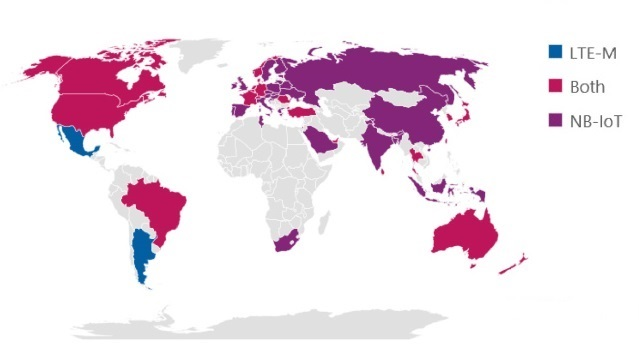
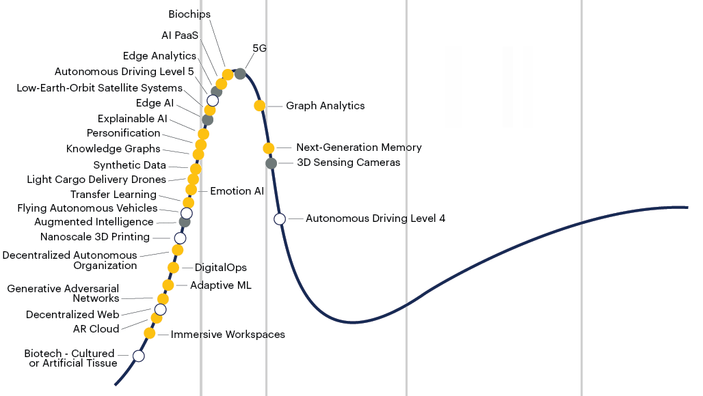
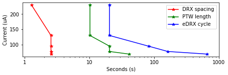
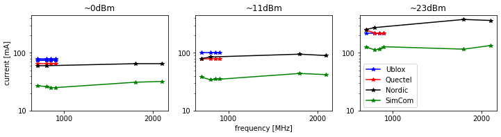
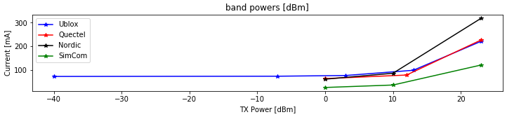

<!-- TODO: check protect\hyperlink -->

{width=25%}

 \pagenumbering{gobble}

\begin{minipage}{\linewidth}
\begin{center}
\includegraphics[width=10cm]{../images/USlogo-top.pdf}
\end{center}
\end{minipage}

\begin{center}
\vspace{1cm}
\huge{NB-IoT (LTE Cat-NB1 / Narrow-band IoT) Performance Evaluation of Variability in Multiple LTE Vendors, UE devices and MNOs}\\
\vspace{0.5cm}
\Large{by}\\
\vspace{0.5cm}
\LARGE{Daniel Robinson}\\18361137
\vspace{1cm}

\begin{minipage}{\linewidth}
\begin{center}
\includegraphics[width=0.25\linewidth]{../images/UScrest.pdf}
\end{center}
\end{minipage}

\vspace{1.5cm}
\Large{Thesis presented in partial fulfillment of the requirements for the degree of Masters of Engineering (Research) in the Department of Electrical and Electronic Engineering at Stellenbosch University}\\
\vspace{1cm}
\Large{Supervisor: Prof. M.J. Booysen}\\
\vspace{0.5cm}
\Large{November 2019}\\
\end{center}

\normalsize
\newpage

\pagenumbering{roman}

# Declaration {-#declaration}

By submitting this report electronically, I declare that the entirety of the work contained therein is my own, original work, that I am the sole author thereof (save to the extent explicitly otherwise stated), that reproduction and publication thereof by Stellenbosch University will not infringe any third party rights and that I have not previously in its entirety or in part submitted it for obtaining any qualification.

\vspace{1cm}

Date: ................. 25/11/2019 ...........

\vspace{15cm}

Copyright © 2020 Stellenbosch University 

All rights reserved.

\newpage

# Abstract {-#abstract}

Cellular 2G/GPRS is a sun-setting technology worldwide leaving behind a void for wireless low-power wide-area-networks (LPWANs) such as LoRaWAN, SigFox and NB-IoT to fill. With NB-IoT on the roadmap towards 5G New Radio (NR), it is a promising contender due to its bidirectionality, power-saving mechanisms and ease of integration with existing equipment, yet there still exists a general uncertainty with regard to adoption. Research shows that most literature on NB-IoT is based on precise mathematical models, analysis or simulations, except for a few empirical performance evaluations which find variability in devices connected to a single network. The study theorizes that networks are responsible for the variation found in metrics and estimations, due to the high underlying complexity of Long-Term Evolution (LTE) architecture on which NB-IoT is based. Thus, the study proposes an empirical investigation using mobile-network operators (MNOs) in South Africa by comparing multiple top LTE vendors including Ericsson and ZTE on MTN's network, and on Vodacom's network Huawei and Nokia. Furthermore, similar user equipment (UE) devices such as Ublox and Quectel are used as a control to observe network changes via RF attenuation. A set of telemetry tests are developed to capture various metrics and estimations into datasets for comparison, which include differently sized UDP packet datagrams, cellular operator selection (COPS), extended discontinuous reception (eDRX) and periodic tracking-area-updates (PTAU). Data is measured using an external energy capture device or reported by the UE device for post-processing and analysis in plots, mean distribution tables and boxplots. Metrics such as latency, power efficiency, signal strength, enhanced coverage level (ECL) classes, throughput and data overhead are included, as well as estimates for telemetry interval periodicity and battery longevity. K-means clustering is applied to the datasets to reduce the skewness induced by the increased number of low-latency values during captures to normalize the number of unique features for comparison.

Most clearly visible in the tests is how MTN leads Vodacom in NB-IoT performance due to Nokia’s subpar results. Power efficiency and latency metrics show that when connected to Vodacom-Nokia, results can factor up 20 and 10 times worse, respectively. Otherwise, ZTE, Ericsson and Huawei show satisfactory latency under the 10 second 3GPP standard. Although LTE vendors meet the 164 dBm MCL requirement, Vodacom-Nokia has 10 dB less receive sensitivity, with the rest at -130 dBm. Transmit power increases at 10 dBm per RSRP decade until its maximum at 23 dBm, except for Nokia which remains at full power. ECL classes overlap with respect to RSRP, yet partially correlate, which suggests an unknown network factor or hysteresis of a few seconds in the test captures. Nevertheless, Nokia is mostly in ECL class 1, while others are a mix of ECL class 0 and 1. This has an impact on the number of dynamic repetitions of messages between UE devices and cell-tower eNodeBs. Throughput is under 10 kbps, which is half or less than UE device claims by manufacturers. A quarter of datagrams in the telemetry test set show protocol overhead extending over 512 bytes in uplink and 200 bytes in downlink, except for Nokia extending up to 10,000 bytes. Telemetry interval and battery longevity estimates on a 9.36 Wh AA battery suggest that ZTE, Ericsson and Huawei can transmit 16-512 bytes between every 5 to 30 minutes to last at least a year, or hourly to last up to 10 years, however, a device that transmits hourly on the Vodacom-Nokia network will only last 2 months. The study provides recommendations based on these results.

Finally, South Africa is ready for mobile network operators to deploy national NB-IoT coverage using ZTE, Ericsson and Huawei, but not using Nokia. With a satisfactory inter-cell tower distance, UE devices avoid having to use dynamic repetitions in higher ECL classes, thus keeping the variability that affects many of the metrics and estimates in the study to a minimum.

<!--\vspace{5cm}-->

\newpage

# Uittreksel {-#uittreksel}

<!--\vspace{10cm}-->

Sellulêre 2G/GPRS is 'n einde-van-leeftyd tegnologie wat wêreldwyd 'n leemte agterlaat, wat deur draadlose lae-krag-wye-netwerke (LPWAN's) soos LoRaWAN, SigFox en NB-IoT gevul sal word. NB-IoT se prominensie op die padkaart na 5G New Radio (NR), maak dit 'n belowende aanspraakmaker vanweë die tweerigtingkommunikasie, kragbesparingsmeganismes en die gemak van integrasie met bestaande toerusting, maar daar bestaan steeds 'n algemene onsekerheid oor die aanvaarbaarheid daarvan. Navorsing toon dat die meeste literatuur oor NB-IoT gebaseer is op presiese wiskundige modelle, analise of simulasies, behalwe vir 'n paar empiriese prestasiebeoordelings wat wisselvalligheid vind in toestelle wat aan 'n enkele netwerk gekoppel is. Hierdie studie stel voor dat netwerke verantwoordelik is vir die variasie in statistieke en beramings as gevolg van die hoë onderliggende kompleksiteit van die Long-Term Evolution (LTE) argitektuur waarop NB-IoT gebaseer is. Die studie stel dus 'n empiriese ondersoek in Suid-Afrika voor, wat gebruik maak van mobiele netwerkoperateurs (MNO's) en deur verskeie top-LTE-verkopers, waaronder Ericsson en ZTE, op MTN se netwerk en op Vodacom se netwerk Huawei en Nokia te vergelyk. Verder word soortgelyke toestelle vir gebruiker-toerusting (UE) soos Ublox en Quectel gebruik om 'n netwerkverandering via RF-demping te waarneem. 'n Stel telemetrie-toetse word ontwikkel om verskillende statistieke en beramings op te stel in datastelle vir vergelyking, wat verskillende grootte UDP-pakkedatagramme, seleksie van sellulêre operateurs (COPS), uitgebreide diskontinue ontvangs (eDRX) en periodieke opdaterings vir opsporing van gebiede (PTAU) insluit. Data word gemeet met behulp van 'n eksterne energie metingstoestel of deur die UE-apparaat gerapporteer vir na-verwerking en ontleding en analises. Maatstawwe soos latensie, drywingseffektiwiteit, seinsterkte, verbeterde dekkingvlakklasse (ECL), deurset data en oorhoofse data is gebruik, sowel as skattings van telemetrie-intervalperiode en batteryleeftyd. K-gemiddelde-groepering word op die datastelle toegepas om die skeefheid wat veroorsaak word deur die verhoogde aantal lae-latenstydwaardes tydens opnames te verminder, om die aantal unieke eienskappe te vergelyk.

Die toetse dui duidelik aan aan hoe MTN se NB-IoT beter vaar as Vodacom sʼn, as gevolg van Nokia se ondergeskikte resultate. Kragdoeltreffendheids- en latenstatistieke toon dat die resultate, as dit met Vodacom-Nokia gekoppel is, onderskeidelik 20 en 10 keer erger kan wees. Andersins vertoon ZTE, Ericsson en Huawei bevredigende vertraging onder die 10 sekonde 3GPP-standaard. Alhoewel LTE-verkopers aan die MCL-vereiste van 164 dBm voldoen, het Vodacom-Nokia 10 dB minder sensitiwiteit, met die ander op -130 dBm. Transmissiedrwying neem toe met 10 dBm per RSRP dekade tot die maksimum op 23 dBm, behalwe vir Nokia wat op volle krag bly. ECL-klasse oorvleuel ten opsigte van RSRP, maar korreleer tog gedeeltelik, wat dui op 'n onbekende netwerk eienskap of histerese van enkele sekondes in die toetsopnames. Nietemin, is Nokia meestal in ECL-klas 1, terwyl die ander 'n mengsel van ECL-klasse 0 en 1 is. Dit het 'n invloed op die aantal dinamiese herhalings van boodskappe tussen UE-toestelle en eNodeBs. Die deurset is minder as 10 kbps, wat die helfte of minder is as wat UE-toestelle se vervaardigers beweer. 'n Kwart van die diagramme in die telemetrie-toetsstel toon die oorhoofse protokol wat strek oor 512 bytes in oplaaikanaal en 200 bytes in aflaaikanaal, behalwe vir Nokia wat tot 10.000 grepe strek. Telemetrie-interval- en batteryleeftydberamings dui daarop dat ZTE, Ericsson en Huawei 16-512 byte tussen elke 5 tot 30 minute kan oordra met 'n 9.36 Wh AA-battery wat minstens 'n jaar sal hou, of uurlikse transmissie wat tot tien jaar sal duur. ʼn Toestel wat uurliks op die Vodacom-Nokia-netwerk uitstuur, sal slegs 2 maande duur. Die studie bied aanbevelings gebaseer op hierdie resultate.

Ten slotte, is Suid-Afrika gereed vir mobiele netwerkoperateurs om die nasionale NB-IoT-dekking te gebruik met behulp van ZTE, Ericsson en Huawei, maar nie Nokia nie. Met 'n bevredigende afstand tussen die toring van die sel, vermy UE-toestelle om dinamiese herhalings in hoër ECL-klasse te gebruik, en sodoende word die veranderlikheid wat baie van die statistieke en ramings in die studie beïnvloed tot 'n minimum beperk.

\newpage

# Acknowledgements {-#acknowledgements}

* **Prof Thinus Booysen** - for unrelenting care, innovative passion, inspiring belief in people and charming charisma.

* **Family** - for love and dedication.

* **Friends** - for wisdoms, experiencing the journey together and sharing moments in highs and lows.

* **MTN Mobile Intelligence Lab** - for providing funding, expertise and laboratory working environment.

* **Ryan van den Bergh** - for driving innovative ideas at MTN.

* **Michael Beetge** - for his expertise in the MTN Phase 3: Test Plant and extensive knowledge of LTE

* **Collin Mamdoo** - for his knowledge on IoT and helpful assistance at Vodacom

* **Helene  Lambrechts** - for her aid in coherence and cohesion.

* **RF Design** - for providing samples and development kits.

* **You, the reader** - for reading this thesis. Hopefully it may be of benefit to you, the research community, science, technology, society and beyond!

\newpage

\tableofcontents

\listoftables  

\listoffigures

\newpage

# Nomenclature {-#acronyms}

|      |      |
| ---- | ---- |
| **3GPP** |    Third Generation Partnership Project |
| **AMQP** |    Advanced Message Queue Protocol |
| **AMOS** | Advanced Managed Object Script |
| **AT** |      Attention |
| **BPSK** | Binary Phase-Shift Keying |
| **BTS** | Base Transceiver Station |
| **CDP** | Connected Device Platform |
| **COPS** | Cellular Operator Selection |
| **CoAP** | Constrained Application Protocol |
| **D2D** | Device to Device |
| **DCE** | Data Communications Equipment |
| **DL** | Downlink |
| **DTE** | Data Terminal Equipment |
| **E-UTRAN** | Evolved-UMTS Terrestrial Radio Access Network) |
| **EARFCN** | E-UTRA Absolute Radio Frequency Channel Number |
| **EARFCN** | Extended Absolute Radio-Frequency Channel Number |
| **ECL** | Enhanced Coverage Level |
| **eDRX** | Extended Discontinuous Receive |
| **eNB - eNodeB** | E-UTRAN Node B |
| **GPRS** | General Packet Radio Service |
| **ICT** | Information and Communications Technology |
| **IoT** | Internet of Things |
| **ITS** | Intelligent Transportation Systems |
| **IMEI** | International Mobile Equipment Identity |
| **IMSI** | International Mobile Station Identity |
| **IP** | Internet Protocol |
| **LBT** | Listen Before Talk |
| **LPWAN** | Low-Power Wide-Area-Network |
| **LTE** | Long Term Evolution |
| **LTE Cat-NB1/2** | Long Term Evolution Narrow-Band Category 1/2 |
| **MCL** | Maximum Coupling Link |
| **MCS** | Message Coding Scheme |
| **MME** | Mobile Management Entity |
| **MNO** | Mobile Network Operator |
| **MO** | Mobile Originated |
| **MO** | Managed Object |
| **MQTT** | Message Queuing Telemetry Transport |
| **MT** | Mobile Terminated |
| **MTC** | Machine Type Communications |
| **MTN** | Mobile Telephone Network |
| **NLOS** | Non-Line-of-Sight |
| **NW** | Network |
| **OTDOA** | Observed Time Difference Of Arrival |
| **PCI** | Physical Channel ID |
| **PDR** | Packet Delivery Ratio |
| **PS** | Packet Switched |
| **PTAU** | Periodic Tracking Area Update |
| **PTAU** | Periodic Tracking Area Update |
| **QXDM** | QUALCOMM eXtensible Diagnostic Monitor |
| **RAN** | Radio Access Network |
| **RRC** | Radio Resource Control |
| **SF** | Spreading Factor |
| **SIM** | Subscriber Identity Module |
| **SMS** | Short Message Service |
| **SNR** | Signal to Noise Ratio |
| **TCP** | Transmission Control Protocol |
| **TE** | Terminal Equipment |
| **UDP** | User Datagram Protocol |
| **UE** | User Equipment |
| **UL** | Uplink |
| **UMTS** | Universal Mobile Telecommunications System |
| **URC** | Unsolicited Result Code |
| **USSD** | Unstructured Supplementary Service Data |
| **UUID** | Unique User Identification |
| **WAP** | Wireless Application Protocol |

## SI Units {-#siunits}

- **kB, MB** - kilobyte, megabyte
- **kbps** - kilobits per second
- **mJ or J** - millijoules or joules
- **s, ms, us** - second, millisecond, microsecond
- **uWh, mWh** - average power in micro/milliwatt-hours
- **dB** - decibel
- **dBm** - decibel milliwatt
- **MHz, GHz** - megahertz, gigahertz

\newpage

\pagenumbering{arabic}

\pagestyle{fancy}
\fancyhead[LE,LO]{\large\leftmark}
\fancyhead[RE,RO]{\normalsize\rightmark}
\fancyfoot[CE,CO]{Page \thepage \hspace{1pt} of \pageref{LastPage}}

# Introduction {#intro}

Narrowing the spectrum bandwidth for cellular Long Term Evolution (LTE) used in everyday life results in a low data-throughput and low energy technology which matches the requirements for wireless Internet of Things (IoT), hence the name "Narrow-band IoT" (NB-IoT).

This chapter introduces various concepts relating to NB-IoT and the performance characteristics thereof. It begins with the question "Why NB-IoT?" before developing the research question, objectives, scope, terminology, background and other various related concepts to fully orientate the reader with regards to NB-IoT.

## Background {#background}

In recent years, the 3rd Generation Partnership Project (3GPP) developed new low-powered wide-area networks (LPWANs) for the cellular industry on the roadmap towards 5G, namely LTE Cat-M, EC-GSM-IoT and NB-IoT to supersede the sun-setting 2G/GSM/GPRS networks.

### Why NB-IoT? {#why}

As aforementioned, NB-IoT fills the role 2G/GPRS leaves behind as countries around the world schedule its departure. The LTE-based technology shows performance benefits over alternative LPWANS in terms of up and downlink throughput, range and longevity, yet current research shows that variation in energy consumption leaves battery longevity in question. Nevertheless, according to 3GPP specifications and manufacturer claims, highlights include:

* ~ 10 year battery-lifetime.
* Under 10 second transmission acknowledgement for latency-tolerant applications
* \+ 20 dB improvement over 2G/GPRS via enhanced coverage levels (ECL).

Despite these highlights, it would nevertheless be significant to further investigate variation in energy consumption, latency, signal strength and battery longevity of the technology to solidify the robustness of these claims both on the sides of user equipment (UE) and network vendors. Other metrics such as throughput, data overhead and estimated telemetry interval would show the effect of network characteristics on the technology.

### History and Development

The beginnings of these new cellular LPWANs started when GSM was first deployed in 1991 and offered calls and SMS as circuit switched data. In 2000, 2G/GPRS added internet at speeds comparable to dialup as packet switched data. Circuit switched data is ideal for real-time connections and means that links have bandwidth pre-allocated. This also increases the QoS guarantee of information transferred timeously. Packet switched data is connectionless on the other hand, with higher bandwidths possible in shared channels. In Fig. \ref{fig:2G_LTE_transition}, we see how technologies using 2G/GSM/GPRS transitioned to LTE. With regard to using the 'internet' for communication, emails, WAP and other 'web-based' forms of messaging were used to keep in touch. Over time, we moved to a plethora of IMS platforms such as WhatsApp, Telegram and WeChat to name a few. Machine-to-machine (M2M) is the direct exchange of information without human intervention, both wired and wirelessly. Whilst the world has come a long way from its analog roots such as the telephone, cellular M2M emerged in 1995 with Siemens creating a GSM module for machines to use wireless networks. Even to this day, SMS, USSD and 2G/GPRS is still used, but with the advent of LPWANs we have even more to choose from including LoRaWAN, SigFox and cellular-based forms such as NB-IoT.

{ width=50% }

\begin{figure}
\centering
\includegraphics[width=0.5\textwidth,height=\textheight]{C:/GIT/masters/thesis/images/ims voip.jpg}
\caption[A simplified representation of the transition from 2G to LTE]{A simplified representation of the transition from 2G to LTE with regard to technologies that keep people and `things' in contact.
Red-orange-blue-green indicates the path that M2M took through the
cellular industry linking it to LPWANs. Grey for internet-based
communications and white for circuit-switched.
\label{fig:2G_LTE_transition}}
\end{figure}

In South Africa, there is a push by cellular service providers to adopt a cellular LPWAN to fill the void that 2G/GPRS leaves behind now and in the future. NB-IoT is being investigated by MTN South Africa, and since they are also funding this research, have also provided network coverage for testing to Stellenbosch University. Ideally, the technology can be rolled out to existing base stations as a software upgrade for national coverage, but it is limited by factors such as use case demand, expensive licensing and general uncertainty about the technology.

2G/GPRS has served as the gateway for smart devices and sensors in the M2M sphere for many years, but due to its high-powered usage it is not sustainable for applications which require battery longevity of up to 10 years or more. In lieu of its absence, although the spectrum it held can be re-farmed for cellular LPWANs, it also opens up opportunities for market entrants of unlicensed frequencies such as LoRaWAN and SigFox. Each LPWAN technology has its own unique flaws and benefits and there is yet to be a clear winner when it comes to connecting 'things' to the internet [@Durand2019].

When considering rolling out more coverage, since NB-IoT is based on LTE, it makes integration and upgrading of existing infrastructure more seamless than an entirely separate technology. Although NB-IoT still retains the drawbacks and complexities of legacy LTE such as the vast array of sub-protocols and communication overhead, this still includes the low power, low bandwidth benefits and others which match the requirements for smart devices and IoT. It should be mentioned that much of the RF spectrum which can be used for digital communications is still used by analogue television broadcast in South Africa by the SABC. ICASA, who controls the spectrum, can solve this issue but over the years they have been a strong limiting factor in the slow release of new spectrum to large mobile-network-operators (MNOs). This has been the case for approximately 14 years to date, and ICASA has instead released spectrum to smaller players such as Rain Ltd, Liquid Telecom and Telkom. To increase demand for application developers in IoT, because they will be interested in a hands-on approach with the technology they will use, more network coverage is necessary to scale up production such that volumes of 1000 devices or more can be connected.

### Terminology {#terminology}

Because the nature of this thesis provides many broad concepts and complex terms, this section briefly introduces to the reader various IoT, LPWAN and LTE related topics expanded upon in the rest of the thesis. The background of NB-IoT is discussed in \S\ref{background}.

The Internet of Things (IoT in \S\ref{iot}) is a blanket term for smart devices that connect to the internet. These devices are typically found in remote or urban areas where it would be more efficient for a device to control and monitor the status of the surrounding environment than human intervention. 

Smart devices or 'things' can connect to the internet by wire or wirelessly. Wired devices usually connect using ethernet, although it is not uncommon to use industry grade protocols such as RS232, CAN, ModBus, ProffiBus, and so on before data reaches a network hub and the internet. Wireless connections, on the other hand, have the benefit of easy installation and really shine in inaccessible areas. It is quite effective to connect Bluetooth and WiFi for short range applications, or using Low Powered Wide Area Networks (LPWANs in \S\ref{lpwans}) such as LoRaWAN, SigFox and NB-IoT for ranges exceeding a few kilometers and especially for limited sources of power.

Considering how LPWANs usually fill niche applications and just looking in terms of modulation differences, Long-Range Radio (LoRa or LoRaWAN in \S\ref{unidirectional_lpwans}) uses chirp-spread-spectrum (CSS) modulation to make it quite immune to doppler effect motion and SigFox (\S\ref{unidirectional_lpwans}) uses binary phase-shift keying (BPSK) in an ultra-narrow band, which increases noise immunity, but devices cannot move more than 6 km/h. LPWANs enable many use cases (\S\ref{usecases}) such as remote sensing, actuator control and asset/location tracking.

GSM and GPRS fall under 2G and 2.5G which started development in the early 90s. Data transmission (such as USSD, SMS, WAP, IP) is circuit-switched over GSM, and packet-switched over GPRS. Circuit switched data is billed per time interval such as seconds or minutes, and packet-switched is charged per number of bytes (kB, MB, etc.). It evolved into 3G in Release 99 at the turn of the millenium and 4G/LTE in Release 8 (Q4 2008).

Long Term Evolution (LTE) is a cellular broadband technology that is a subset of an even more complex 3GPP governing body that guides its development. In LTE, the narrowband category is known as LTE Cat-NB or NB-IoT. LTE Cat-M is designated for M2M applications, and although it is quite similar to NB-IoT, it features VoIP, faster throughput and is more similar to the LTE protocol. Unfortunatly it is not considered in South Africa. There are two different versions of NB-IoT, with LTE Cat-NB1 being release 13 and LTE Cat-NB2 being release 14. Their specifications have been frozen in Q1 2016 and mid-2017, respectively, with LTE Cat-NB1 in South Africa.

## Project Description {#proj_descr}

### Problem Statement {#probstat}

NB-IoT has unique features that hold a competitive advantage over alternatives such as LoRaWAN, SigFox and other LPWANs, however it does not have a strong uptake in South Africa yet. Most notably, NB-IoT offers energy efficient bidirectionality (as opposed to the uplink-centric norm) using extended discrete periodic reception (eDRX), yet variation in transmission energy and latency can affect battery lifetime drastically. Application developers require network coverage before they are interested in developing business cases, and cellular service providers require consumer and enterprise demand or business cases before rolling out national network coverage. This creates a paradoxical situation where neither party gives in unless they are both willing to come to a compromise. Such efforts can be limited by a lack of understanding in the technology, and this is not helped by the fact that although there is a great deal of theoretical analysis and simulations in research, the lack of empirical evidence may be contributing to a general uncertainty in the standing of the technology with respect to alternatives and thus a slower adoption. This thesis aims to bridge that divide in South Africa by evaluating NB-IoT's performance empirically using a set of metrics and estimate optimal use.

### Research Objectives {#resobj}

This study has the following aims:

* Latency, power efficiency and other metrics of NB-IoT are to be evaluated using a set of telemetry tests.

  

* User equipment (UE) devices will be compared against multiple LTE vendors used by mobile network operators (MNOs) exposing the change in variability due to proprietary LTE complexities.

  

* Battery longevity and recommended telemetry intervals are estimated, and other secondary metrics such as signal strength, throughput and data overhead are investigated.

  

In turn, the above objectives evaluate the robustness, stability, capabilities, sources of variability and claimed versus actual core features of NB-IoT.

This thesis aims to highlight the advantages, disadvantages and challenges of NB-IoT. By doing endpoint tests between UE devices and multiple LTE base station vendors, one can paint an accurate picture of the capabilities of the technology as rolled out in South Africa.

### Scope of Work {#scopework}

Although there exists a multitude of UE devices, LTE vendors, estimations and metrics, the study will be limited to the following as seen in Table \ref{tbl:metric_summary} and \ref{tbl:telemetry_ue_lte}.

While theoretical models provide value in showing how factors affect an approximation, the boundless underlying complexities of LTE architecture make it hard to predict the variability induced by unpredictable network conditions. Thus, an empirical approach is proposed. Since the energy efficiency of a single network is already in question by the results generated by Durand [@Durand2019], Martinez [@Martinez2019] and affected by latency, these will form the main metrics investigated in this study.

Table: Metrics and Estimations {#tbl:metric_summary}

| Main Metrics     | Secondary Metrics      | Estimations         |
| ---------------- | ---------------------- | ------------------- |
| Power Efficiency | Signal Strength        | Battery Longevity   |
| Latency          | Throughput             | Telemetry Intervals |
|                  | Data Overhead          |                     |
|                  | Coverage Levels (ECLs) |                     |

Table: Telemetry Types, UE devices and LTE vendors {#tbl:telemetry_ue_lte}

| Telemetry Types | LTE Vendors | UE Manufacturers |
| --------------- | ----------- | ---------------- |
| UDP Packets     | ZTE         | Ublox            |
| eDRX and PTAU   | Nokia       | Quectel          |
| COPS            | Ericsson    | (Nordic)         |
| Data Echo       | Huawei      | (SimCom)         |

The capture method should be easily repeatable and expandable for new UE devices. On the basis that the AT command API is familiar to all UE devices, a framework will be built to extract data via this method. Although all UE devices are usually accessible through AT commands, there are alternative diagnostic methods such as Qualcomm QXDM, UEMonitor and an opensource decoder by LanternD which monitors the debug stream provided over UART at 921600 baud. QXDM is a proprietary diagnostic program built for UE devices with Qualcomm chipsets, yet it costs in excess of a few thousand USD. UEMonitor is free and can capture debug traces from both Ublox and Quectel. LanternD's decoder is still in beta and thus unstable. Since both Ublox and Quectel's debug messages can be accessed by UEMonitor and LanternD, these UE devices will be used to compare LTE Vendors. There is no support or alternative for Nordic or SimCom devices, however.

## Project Overview {#overview}

This section looks at how user equipment (UE devices in \S\ref{ue_devices}) is compared against multiple LTE vendors (\S\ref{lte-vendors}) operated by mobile network operators (MNOs in \S\ref{MNOs}) which expose the change in variability due to proprietary LTE complexities. These comparisons are made according to a set of metrics, estimations (\S\ref{metrics_est}) and telemetry tests (\S\ref{telemetry_tests}).

\hypertarget{MNOs}{%
\subsubsection[MNOs: MTN and Vodacom]{Mobile Network Operators}\label{MNOs}}  

<!--### MNOs: MTN and Vodacom {#MNOs}-->  

The following MNOs have NB-IoT coverage in South Africa which will be expanded upon in \S\ref{coverage}, namely MTN and Vodacom. NB-IoT uses their LTE infrastructure, and this will be expanded upon in \S\ref{lte-vendors}.

MTN Group Limited and Vodacom Group Limited are both mobile telecommunication companies trialing the use of NB-IoT in South Africa. While they are both based in South Africa with headquarters in Johannesburg, MTN operates in many African countries and the Middle East, and Vodacom is part of the International Vodafone Group with over 55 million customers.

\hypertarget{lte-vendors}{%
\subsubsection[LTE Vendors: ZTE, Nokia, Ericsson, Huawei]{Long Term Evolution (LTE) Vendors}\label{lte-vendors}}  

<!--### LTE Vendors: ZTE, Nokia, Ericsson, Huawei {#lte-vendors -->

Table \ref{tbl:telemetry_ue_lte} gives the following LTE vendors which are among the top 5 in the world: Huawei, Ericsson, Nokia and ZTE. Since there are over a hundred MNOs across the world which also use these LTE vendors, performing this study on the main LTE vendors will also benefit the MNOs. With regard to NB-IoT connectivity on MNOs in South Africa, MTN will be used for ZTE and Ericsson, and Vodacom will be used for Nokia and Huawei.

In South Africa, there are two mobile network operators trialing NB-IoT and combined they use four of these top LTE vendors. Samsung has started using NB-IoT only as recently as May 2019, announcing a partnership with [KT to create a Public Safety](https://enterpriseiotinsights.com/20190506/nb-iot/samsung-kt-launch-nbiot-service-through-ps-lte-network-korea) (PS-LTE) network. They're also implementing device-to-device (D2D) communications to increase connectivity in unfavourable conditions.

Table: MNOs and their LTE base station (BTS) vendors in South Africa {#tbl:mno_bts}

| BTS Vendors | Cellular operator (MNO) |
| ----------- | ----------------------- |
| Nokia       | Vodacom                 |
| ZTE         | MTN                     |
| Huawei      | Vodacom                 |
| Ericsson    | MTN                     |

{width=80%}

ZTE, Nokia, Ericsson and Huawei are all multinational telecommunication, equipment, systems and consumer electronics companies, with:

* ZTE Corporation and Huawei Technologies Co. Ltd. were founded in 1985 and 1987 respectively, and are both headquartered in Shenzhen, Guangdong province, China.
* Nokia Corporation, founded in 1865, is headquartered in Espoo, Helsinki, Finland.
* Telefonaktiebolaget LM Ericsson, founded in 1876, is headquartered in Stockholm, Sweden.

Theoretically, one can assume that these manufacturers meet 3GPP's specifications. With a more rigorous testing framework, one can evaluate these capabilities in a transparent manner for both developers and cellular operators alike and work towards improving the quality thereof.

Other vendors include: Cisco Systems, Sierra Wireless, Intel Corporation, Samsung Electronics, Telit Communications, Saudi Telecom Company, Oberthur Technologies, Broadcom Corporation KDDI Corporation, LG Electronics, Gemalto NV, VimpelCom, MediaTek, Ooredoo, and Orange.

\hypertarget{ue_devices}{%
\subsubsection[UE Device Manufacturers: Ublox, Quectel, Nordic, SimCom]{UE Device Manufacturers}\label{ue_devices}}  

<!--### UE Device Manufacturers: Ublox, Quectel, Nordic, SimCom {#ue_devices}-->

Finally, with regard to the UE devices in \ref{tbl:telemetry_ue_lte}, application developers are likely to use more popular NB-IoT module manufacturers such as Ublox, Quectel, Nordic and SimCom, besides lesser known ones such as Telit, Sierra Wireless, Gemalto, and akorIoT. 

UE devices specifically used:

- Ublox Sara N200
- Quectel BC95

and the following recommended in future:

- Nordic nRF9160
- SimCom SIM7020E
- Mediatek MT2625
- Sierra Wireless 7702

Although LTE vendors are open to all UE manufacturers, mobile network operators (MNOs) are still in control of LTE vendor equipment and some aspects of UE devices via RF signalling. Thus it is important for MNOs to recognize the effect they have on the technologies they use, especially when it differs from theory. UEs devices typically use AT commands as the API to control their capabilities.

These UE device manufacturers are considered:

* Ublox, founded in Switzerland, 1997, is a fabless semiconductor company that creates user equipment for telecommunications in consumer, automotive and industrial markets, and leads in GNSS.
* Quectel, founded in China, 2010, is a comprehensive supplier of user equipment for the cellular industry, with a wide range of modems covering 5G, LTE, NB-IoT/LTE-M, UMTS/HSPA+, GSM/GPRS and GNSS; it leads in production of UE modems, but not GNSS.
* Nordic Semiconductor, founded in Norway, 1983, is a fabless semiconductor company specializing in ultra-low power bluetooth low energy (BLE) and 2.4 GHz devices, as well as the low-powered cellular industry (NB-IoT/LTE-M).
* SIMCom Wireless Solutions, founded in China, 2002, is a wireless M2M company offering a variety of wireless modems based on GSM/GPRS, WCDMA/HSDPA, TD-SCDMA and NB-IoT/LTE-M.

\hypertarget{metrics_est}{%
\subsubsection[Metrics and Estimations: Power, Latency, Secondary and Interval, Longevity]{Metrics and Estimations}\label{metrics_est}} 

<!--### Metrics and Estimations: Power, Latency, Secondary and Interval, Longevity {#metrics_est}-->

Considering metrics and estimations in Table  \ref{tbl:metric_summary} above, a more comprehensive study has been performed on throughput, packet delivery ratio (PDR), maximum coupling link (MCL) and scalability by Durand [@Durand2019]. Martinez has investigated the performance boundaries of NB-IoT for a Vodafone network in Barcelona, Spain [@Martinez2019] including metrics such as energy consumption, transmission delay, enhanced coverage levels (ECLs) and different data sizes. Because power efficiency and latency is significantly affected by variability, important considerations have to be made in application development and thus it is of the main metrics this study is focused on. Between UE devices and LTE basestations (BTS) both signal strength (RSRP) and coverage enhancement levels (ECL) can be causes of variability. 

In terms of estimations, variability affects battery lifetime and telemetry interval amongst others. Battery lifetime is defined as the length of time a device will last on an AA battery in years. Telemetry interval is defined as the periodicity time between different types of messages to last a year on an AA battery. These two estimations are necessary for developers to consider in battery-powered applications and form an important basis for this study.

\hypertarget{telemetry_tests}{%
\subsubsection[Telemetry Tests: UDP, Echo, COPS, eDRX, PTAU]{Telemetry Tests}\label{telemetry_tests}}

<!--### Telemetry Tests: UDP, Echo, COPS, eDRX, PTAU {#telemetry_tests}-->

The different types of telemetry messages in Table \ref{tbl:telemetry_ue_lte} include UDP datagram transmission, cellular operator selection (COPS), UDP Echo, extended discontinuous reception (eDRX) and periodic tracking area updates (PTAU). UE devices usually give the option of using the following main data transmission protocols: UDP, TCP, CoAP and MQTT. UDP is a connectionless protocol used for low latency applications and TCP is used to stream data orderly, reliably, but at a cost to data overhead.  CoAP and MQTT are lightweight message transfer protocols based off of UDP and TCP respectively. To measure the data overhead secondary metric caused by network repetitions and other mechanisms, it would be preferable to avoid overhead from other protocols and thus the simplest option is chosen, namely UDP. 

## Network Coverage Worldwide {#coverage}

Although NB-IoT joined LPWANs circa 2016-2017, world-wide coverage is still growing. This can be seen in Fig. \ref{fig:worldwide_coverage}.  [AT&T announced](https://blog.nordicsemi.com/getconnected/att-launches-nb-iot-network-in-usa) nation-wide coverage of NB-IoT in the USA, alongside its existing LTE Cat-M coverage. Deutsche Telekom and Vodafone cover Europe and China enables millions more IoT devices [@china2019].

 { width=80% } 

### Connectivity in South Africa {#connectivity}

In South Africa, NB-IoT has most of its coverage in the Gauteng province as well as a few sites in other towns and cities. Although Gauteng only covers 1.49% of the land mass in South Africa, it holds ~22% of its ~57 million people so understandably it is great as a live trial run before pushing for national coverage.

 { width=50% }

Table: NB-IoT connectivity in South Africa with regard to MNO, LTE vendor and location. {#tbl:nbiot_connectivity}

| MNO     | LTE Vendor | Location                       |
| ------- | ---------- | ------------------------------ |
| MTN     | ZTE        | Stellenbosch                   |
| Vodacom | Nokia      | Vodacom Head Office, Cape Town |
| MTN     | Ericsson   | MTN Phase 3: Test Plant        |
| Vodacom | Huawei     | Gauteng Province               |

To connect via NB-IoT on the Vodacom network, sim cards must be purchased with a M2M contract over 24 months at 5.00 ZAR/month. At the time of registering in this study, data bundles range from 5 Mb for 7.50 ZAR to 30 Mb for 29.00 ZAR.

MTN NB-IoT sim cards can currently be obtained only for testing purposes, and it would be best to speak directly to MTN.

 {width=30%} 

  

## Thesis structure {#thesis-struct}

NB-IoT is introduced to the reader in Chapter \ref{intro}. A literature study reviews the current empirical research in Chapter \ref{litstudy}. Design and methodology shows the steps taken to capture different metrics and process the resulting dataset in Chapter \ref{design}. Results are analyzed and discussed in Chapter \ref{results}. Lastly, a conclusion is made in Chapter \ref{conclusion} with recommendations.

\newpage

# Literature Study {#litstudy}

This chapter will look at NB-IoT performance-related literature, IoT, LPWANs, use cases, and a deeper look into NB-IoT itself.

## Related Literature

Considering current literature in NB-IoT, several studies investigate mathematic models and theoretical analysis in terms of energy consumption[@Andres-Maldonado2017], latency [@Feltrin2019], impact of ECL classes [@Andres-Maldonado2018b], coverage performance [@Adhikary2016], battery lifetimes [@Yeoh2018d],[@Lauridsen2018], theoretically optimized configurations [@Feltrin2018] and general performance in particular applications [@Soussi2018],[@Beyene2017b].

Only Martinez [@Martinez2019] focuses efforts on the application developer and presents an empirical evaluation of the technology when it is deployed on a single network (Vodafone in the Metropolitan area of Barcelona). Durand [@Durand2019] compares different LPWANs empirically including NB-IoT. Although theoretical models help to understand the inner workings of a technology with an attempt to predict the behavior, an empirical approach shows hands-on how a technology behaves in real conditions, and ultimately the variability in UE devices. Thus, this work complements Martinez and related works by investigating variability with respect to various LTE vendors and providing empirical measurements and estimates, always while taking the perspective of an adopter in the technology.

Whilst this research is funded by MTN and being aware of internal documentation, this is an independent study which should aid any potential adopters of the technology.

## Internet of Things{#iot}

The Internet of Things (IoT), as briefly outlined in \S\ref{terminology}, is an ecosystem of smart devices that connect to the internet/cloud in various ways. Although IoT's requirements (\S\ref{iot_requirements}) are loosely defined due to the large variety of use cases (\S\ref{usecases}), it is still important to see how well NB-IoT performs and facilitates these connections for IoT (discussion in \S\ref{conclusion}). This section looks at these requirements and other facets of IoT relevant to NB-IoT.

Since IoT is advancing in popularity (\S\ref{iot_requirements}), stakeholders in NB-IoT can be rest assured that the technology will be useful for years to come.

Although the simplest type of use case is smart metering (\S\ref{smartmetering}), useful for LPWANs which send data unidirectionally, NB-IoT shows its bidirectional strength in Push-Pull models (\S\ref{pushpull}). In fact, this makes NB-IoT well suited for edge computing (\S\ref{pushpull}) too.

Finally, although satellite IoT has the benefit of worldwide coverage, by rolling out national NB-IoT coverage in South Africa, for example, it defeats the purpose of satellite IoT by being affordable and energy efficient (see \S\ref{satellite_iot}).

### Requirements and Advancement {#iot_requirements}

IoT requires scalable smart devices to collect data and interact with the physical world using wireless connectivity. Thus, wireless communication must be energy efficient, have low latency, low data overhead and long range for optimal cloud processing. To be sure that LPWANs can be well scaled, they require a cloud platform well suited to the large number of connections such as Cisco-Jasper and ThingsBoard [@Hejazi2018a].

---

<!-- ### Advancement {#iot_advancement} -->

IoT has surged in popularity over recent years as an interconnected system of devices that transfer data over a network without requiring human interaction.

Looking at Gartner's analysis of technology expectations with regards to NB-IoT and related technologies, in 2014 Gartner estimated that Internet of Things (IoT) had reached the height of inflated expectations, and the hype it generated lives on in a rich ecosystem of emerging technologies. As of July 2018, NB-IoT and IoT has falling interest (and hype) in Fig. \ref{fig:gartner_ictAfrica}, yet it will reach productivity in 2-10 years time. Since new coverage has not been rolled out for almost two years to date, we believe there is a strong chance for renewed NB-IoT interest in Africa. Although predictions vary, Gartner estimates there will be over 21 billion smart devices connected to the internet by 2020, whereas the worldwide number of devices was under 7 billion in 2016 [@Ayoub2018c].

. NB-IoT is high on the list of expectations. \label{fig:gartner_ictAfrica}](../images/42881085945_739bbdc8e9_c.jpg){ width=90% }

As of August 2019, Gartner has high expectations for 5G and other emerging technologies which can make use of what [IoT has to offer](https://blogs.sas.com/content/hiddeninsights/2016/07/06/long-live-the-iot-hype/). This can be seen in Fig. \ref{fig:gartner_emergingTech}.

{ width=85% }

On the other hand, this does not slow the growth in number of devices connected as in Fig. \ref{fig:iot_growth}. IoT merely manifests itself in other uses and forms such as we have already seen in Fig. \ref{fig:gartner_emergingTech}. NB-IoT can be integral to aid this growth.

![Exponential growth of IoT is estimated [@Ali2015]. \label{fig:iot_growth}](../images/Expected-number-of-connected-devices-to-the-Internet-This-chart-is-obtained-from-recent.png){ width=80% }

New and emerging applications in IoT are challenged by the number of existing technologies to choose from, and vice versa for existing applications when new wireless technologies appear. Massive IoT is the deployment of an immense number of low-powered devices with infrequent reporting and both NB-IoT and LTE Cat-M fulfill the requirements of 5G massive MTC/IoT.

<!--### Push-Pull Model and Edge/Fog Computing {#pushpull}-->

\hypertarget{pushpull}{%
\subsubsection{Push-Pull Model and Edge/Fog Computing}\label{pushpull}}

Traditionally, IoT devices push data to the internet at regular intervals. This push model can be considered quite energy inefficient, especially when the data is only occasionally actionable. For example, in asset tracking or remote monitoring.

A pull model is ideal for dynamic rule engines, pulling data only when necessary and ultimately edge computing, where building an application around this idea can greatly enhance battery life.

Most LPWANs are unidirectional, meaning they transmit data in one direction only. This is especially true in the case of LoRaWAN and SigFox and means they use a push model. A push model is bad for the battery when periodically sending data. It does help to make the data transmissions event-based, however. NB-IoT and Dash7 for example, are bidirectional which means they can stay quiet for longer and only send data on-demand ~ when it is needed. This would make it a pull model and is useful for critical use cases as well [@Mekki2018a].

Table: Unidirectional and bidirectional LPWANs {#tbl:unibidirectional_lpwans}

| Unidirectional | Bidirectional  |
| -------------- | -------------- |
| SigFox         | NB-IoT         |
| LoRaWAN        | EC-GSM-IoT     |
| NB-Fi          | RPMA           |
|                | Weightless SIG |
|                | Dash7          |
|                | WiFi HaLow     |

Most importantly when looking at bidirectionality vs unidirectionality is that transmit current is usually much more than the receive current required. By limiting TX transmissions such that the user only requests data on-demand when it is required, battery savings ensue. There are many LPWANs out there, but we can split them up into two groups as in Table \ref{tbl:unibidirectional_lpwans}. Later, we look at a few of these directional LPWANs in \S\ref{unidirectional_lpwans}-\ref{bidirectional_lpwans} and draw comparisons in \S\ref{lpwan_comparison}.

####  Edge/Fog Computing {#edge_computing}

Edge/Fog computing is the practice of offloading cloud processes to the endpoint. It saves on data overhead, especially when there are data charges involved and battery longevity is desired.

Since NB-IoT is optimized for downlink communications, it can be the ideal candidate. Downlink communications use much less energy than uplink, and at higher throughput too. Usually data has to be periodically sent to the cloud in unidirectional networks and processing done thereafter, but with the push-pull model, one can send a specialized request to devices on the edge of the cloud and devices can send back processed data, saving energy and lowering data costs, hence edge/fog computing [@Chang2017].

### Satellite IoT {#satellite_iot}

Compared to LPWANs, Satellite IoT has global coverage and is of growing interesting for connecting 'things' to the internet due to its ease of connectivity [@Qu2017c]. In terms of packet payload size, a typical system such as the Iridium 9602/9603 will transmit up to 270 bytes or receive 340 bytes via AT commands. A supercapacitor is necessary for the initial 7.5W burst for 10ms which opens a session, and with an open sky messages can be sent every 10 seconds. It even features a 'Ring Alert' feature, similar to eDRX in NB-IoT in that modems listen for when incoming messages are available, for satellites to page a modem when a mobile terminated (MT) message is available from an internet-facing endpoint. Although Ring Alerts are sent to the position of the last known transmission, an Iridium satellite spot beam is about 400km in diameter meaning devices would have to travel quite far before requiring a simple re-registration transmission. The greatest drawback is the upfront, rental and per byte costs looking at \pounds159, \pounds12/month and \pounds0.14 per 50 byte credit respectively on Rock Seven Mobile Services Ltd, and the high power draw compared to NB-IoT. Furthermore, NB-IoT is not the only network that can replace satellite IoT or 2G/GPRS with coverage in broad areas (ideally nationally), and this will be explored further in \ref{lpwans}.

## Low-Powered Wide-Area Networks {#lpwans}

A low-power wide-area network (LPWAN) allows long range communications at low bit rates for sensors and other devices operating on battery power. This section will compare a few prominent cellular and unlicensed frequency LPWANs against NB-IoT besides the following alternatives:

* EC-GSM-IoT is a form of eGPRS optimized for the IoT. It is still in the trial stages of development, however [@Bergman2017].
* RPMA by Ingenu is a 2.4GHz technology for M2M communications. It is primarily used in North America for the oil & gas industry, amongst others [@Ingenu2016]. It is equivalent to cellular standard but expensive.
* Weightless SIG reuses TV whitespace, and NB-IoT is actually formed off this protocol [@Weightless2015], [@Raza2017].
* NB-Fi Protocol is an open standard, operating in unlicensed ISM frequencies. The NB-Fi Protocol ensures up to 10 km range of data transmission in urban areas, 30 km in rural areas and up to 10 years battery lifetime [@Ikpehai2018b].
* HaLow is a long range and low power version of the IEEE 802.11 Wi-Fi standard, specified by WiFi Alliance 802.11ah. Although it has great potential in IoT, at this stage it has low market traction.

<!--Unidirectional: LoRaWAN and SigFox {#unidirectional_lpwans}-->

\hypertarget{unidirectional_lpwans}{%
\subsubsection[Unidirectional: LoRaWAN and SigFox]{Unidirectional LPWANs}\label{unidirectional_lpwans}}

#### LoRaWAN {#lorawan}

LoRa is a low-power wide-area network technology. It is based on spread spectrum modulation techniques derived from chirp spread spectrum technology. 

LoRa is an LPWAN based on chirp spread spectrum modulation techniques developed in France by Cycleo, founded in 2009, and acquired by Semtech which founded the LoRa Alliance. Although it is a contender for NB-IoT, it lacks bidirectionality and data rate.

* Although LoRaWAN performs better for brief messages, it incurs high energy usage when multiple messages are required.
* Secondly, LoRaWAN messages are not guaranteed, and ensuring reliability on a hier level consumes even more energy in the use of user-defined acknowledgements.
* LoRaWAN is only scalable to under 500 devices per gateway compared to NB-IoT and GPRS which can handle 100 times more. This is due the lack of scheduling between devices, duty-cycle limits and few channels. A suggestion is to increase the number of base stations in an area.

LoRaWAN uses chirp-spread-spectrum (CSS) and is publically accessible from networks such as The Things Network (TTN). Unfortunately, although that has the best coverage, it only uses class A which means it cannot listen for asynchronous downlink messages except after an uplink (which defeats the purpose of avoid unnecessary uplink transmissions which draw large current) [@Adelantado2017].

#### SigFox {#sigfox}

Sigfox, headquarted in France and founded in 2009, is a global network operator that has over 375 employees. In South Africa, its subsidiary is known as SquidNet. Briefly, SigFox is an ultra-narrow-band wireless technology that one can send 140 12-byte messages per day due to the duty cycle limitation of unlicensed frequencies. One can also receive 4 downlink ack messages, but this is not good enough when looking to optimize the sending of GPS/GNSS updates [@SigFox2016]. SigFox is a contender for NB-IoT, but it lacks bidirectionality and datarate.

Simulations show that with the random transmissions of 55k devices, a base station can still receive and process 270 simultaneous messages while still ensuring a 99.9% PDR [@Durand2019].

Localization can be useful for asset tracking as discussed in \S\ref{asset_tracking}. Of the prominent LPWANs, SigFox is the only one that offers a simple localization service. NB-IoT will offer one when upgraded to 3GPP Release 14. Unfortunately SigFox has poor accuracy as can be seen in Fig. \ref{fig:sigfox_map}.

{width=80%}

<!--Bidirectional: NB-IoT and Dash7 {#bidirectional_lpwans}-->

\hypertarget{bidirectional_lpwans}{%
\subsubsection[Bidirectional: NB-IoT and Dash7]{Bidirectional LPWANs}\label{bidirectional_lpwans}}

#### NB-IoT {#nbiot_lit}

Narrowband Internet of Things is an LPWAN radio technology standard developed by the 3GPP to enable a wide range of low-power devices and user applications in the cellular industry. The specification of LTE Cat-NB1 was frozen in June 2016 with 3GPP Release 13. Other IoT technologies developed by the 3GPP include LTE-M/eMTC and EC-GSM-IoT.

NB-IoT is LTE's replacement for the power hungry GSM that some IoT devices still use. GSM is an aging technology which is being turned off in some parts of the world. It has 7 times better range and coverage, and power saving which can let a device last 10+ years on a single charge [@Wang2017c].

#### Dash7 {#dash7_lit}

DASH7 Alliance Protocol (D7AP) is a patented, bidirectional, full-stack and open source protocol which operates in unlicensed frequencies. It was developed from a military RFID standard into a medium range LPWAN [@noraird7],[@Weyn2015] useful in the indoor and outdoor realm. D7AP communication is modelled after "BLAST" (Burst, Light, Asynchronous, Stealth, and Transitional) systems which enables it to be a LPWAN competitor. D7AP uses the 2-GFSK modulation schemes, yet itcan also re-use the PHY layer (radio frontend) of other LPWANs such as LoRa. Also, according to Cortus it should be possible to reuse the RF PHY layer (MSK downlink, OFDM uplink) of NB-IoT for Dash7's OSI stack, and in asset tracking, for example, it results in a compressed tracking solution that works well both indoors and outdoors. Dash7 claims 1m indoor accuracy by using vertex data from reference nodes for RSSI & RF fingerprinting.

Wizzilab is one of three main developers of Dash7. It offers the only full-kit open to development (at least in the form of an application processor). Haystack is another Dash7 developer with [https://github.com/jpnorair/OpenTag](https://github.com/jpnorair/OpenTag), and have developed a Dash7-over-LoRa implementation that expects ranges of over a few kilometers and can be considered in future research. Finally, the developer community with [https://github.com/MOSAIC-LoPoW/dash7-ap-open-source-stack](https://github.com/MOSAIC-LoPoW/dash7-ap-open-source-stack).

### LPWAN Comparison {#lpwan_comparison}

There are many wireless technologies out there, with some standardized, including but not limited to SigFox, LoRaWAN, Dash7, Bluetooth, 6LowPan, RPMA, Weightless, and IETF 6TiSCH. A brief comparison is drawn on NB-IoT against prominent unlicensed frequency LPWANs in Table \ref{tbl:lpwan_comparison}, and cellular LPWANs in Table \ref{tbl:cellular_comparison}.

Table: Brief comparison of NB-IoT against wireless LPWANs {#tbl:lpwan_comparison}

|                         | NB-IoT       | LoRaWAN           | SigFox   | Dash7             |
| ----------------------- | ------------ | ----------------- | -------- | ----------------- |
| Frequency               | 450-2200 MHz | 433, 868, 915 MHz | 868 MHz  | 433, 868, 915 MHz |
| Bandwidth               | 200 kHz      | 125-500 kHz       | 200 kHz  | 25, 200 kHz       |
| Throughput              | 250 kbps     | 27 kbps           | 0.1 kbps | 167 kbps          |
| Duty cycle limitation   | 0%           | 90-99%            | 99%      | LBT ~ 0-99%       |
| Messages per day (12 B) | 14 million   | 10-243            | 140      | 86400+            |
| Bytes per message       | 512          | 255               | 12       | 256               |
| Uplink Latency          | 0.1 - 10 s   | < 3 s             | ~ 6 s    | < 0.015 s         |
| Battery Lifetime        | 10 years     | 10 years          | 16 years | 3-5 years         |
| MCL                     | 164 dBm      | 157 dBm           | 160 dBm  | -                 |
| Scalability             | 55,000       | ~500              | > 50,000 | -                 |
| Outage                  | 1%           | > 2%              | 1%       | -                 |
| Average Power           | 550 uWh      | 15-66 uWh         | 144 uWh  | -                 |
| Range                   | 2.5 - 5 km   | 5km (85% PDR)     | 3-10 km  | 2 km              |

Table: Brief comparison of NB-IoT against cellular technologies [@Finnegan2018] {#tbl:cellular_comparison}

|                  | NB-IoT       | 2G/GSM/GPRS  | EC-GSM-IoT[^ec_gsm_available] | LTE Cat-M    |
| ---------------- | ------------ | ------------ | ----------------------------- | ------------ |
| Frequencies      | 450-2200 MHz | 850-1900 MHz | 850 - 1900 MHz                | 450-2600 MHz |
| Bandwidth        | 180 kHz      | 200 kHz      | 200 kHz                       | 1.4MHz       |
| Throughput       | 250 kbps     | 56–114 kbps  | 70-240 kpbs                   | 375 kbps     |
| Packet size      | 512          | ~ 1400       | -                             | ~ 1024       |
| Uplink Latency   | 0.1 - 10 s   | 0.3 - 1 s    | 0.7 - 2 s                     | 0.1 - 10 s   |
| Battery Lifetime | 10 years     | 3 months     | 10 years                      | 10 years     |
| MCL              | 164 dBm      | 148 dBm      | 154 - 164 dBm                 | 164 dBm      |
| Scalability      | 55,000       | 52,000       | 50,000                        | 55,000       |
| Range (urban)    | 2.5 - 5 km   | 1 - 2 km     | -                             | 2.5 - 5 km   |

[^ec_gsm_available]: eGPRS/EDGE-based EC-GSM-IoT is not available anywhere in the world yet.

To meet application specific requirements, the uniqueness of each technology gives each its advantages and disadvantages. Matching custom applications with a wireless technology is non-trivial as there is no silver bullet that matches all use-cases. In terms of a few metric capabilities, a best-and-worst case matrix is shown in Table \ref{tbl:lpwan_strengths}. NB-IoT is shown to be closest to being an all-round winner, with battery life the exception. This is another reason why battery life is investigated in this study.

Table: LPWAN strengths with \checkmark,  $\times$  denoting best and worst case respectively. {#tbl:lpwan_strengths}

| Technology   | MCL                             | Scalability | Battery life                    | Throughput |
| ------------ | ------------------------------- | ----------- | ------------------------------- | ---------- |
| NB-IoT       | \checkmark                      | \checkmark  |                                 | \checkmark |
| GPRS         | $\times$ | \checkmark  | $\times$ | \checkmark |
| LoRaWAN SF7  |                                 |             | \checkmark                      |            |
| LoRaWAN SF12 | \checkmark                      | $\times$ |                                 | $\times$ |
| SigFox       | \checkmark                      | \checkmark  |                                 |            |

The competitive nature of LPWANs, IoT demand, various use cases and expansion into other territories will ensure that various wireless technologies will continue to grow and increase network coverage. Selected uptake of LPWANs is expected in specific use cases due to the uniqueness of each technology. Despite this, NB-IoT outperforms SigFox and LoRaWAN in UL/DL throughput, scalability, MCL range and FoTA updates and is only superseded by LoRaWAN in battery life for SF7. Durand suggests that if the RRC-idle phase could be reduced, it could develop a minimal power consumption comparable to SigFox and LoRaWAN [@Durand2019], and this is possible true using Release Assistance in \S\ref{#release_a}. By finding ways to increase battery life, it may just be the 'silver bullet' for all IoT use cases.

In places requiring deep indoor penetration with 30 dBm path loss, NB-IoT performs well with 8\% outage, while SigFox, LoRaWAN, GPRS are unable to cover 13\%, 20\% and 60\% of locations, respectively, in a 7800 km\textsuperscript{2} area simulated by Lauridsen [@Lauridsen2017].

NB-IoT's mean energy values are similar to LoRaWAN devices transmitting in SF12 configuration. However, best case results (in 5th percentile) are comparable to LoRaWAN in SF8. NB-IoT has peak transmission at 220 mA, whilst LoRaWAN at 40 mA [@Martinez2019]. Although LoRaWAN has the predictable chirp spread spectrum (CSS) modulated signal, NB-IoT only uses this peak power in it's initial physical random access channel (PRACH) [@Durand2019]. This shows that with further investigation into the variation, NB-IoT can certainly be on par with LoRaWAN in terms of energy consumption. Nevertheless, NB-IoT does guarantee packet delivery if within range while LoRaWAN has a variable packet delivery ratio (PDR). The mean achievable lifespan for NB-IoT is on the order of 2.5 years, depending on datagram size. Nevertheless, the transmission of larger datagram payloads (up to 512 bytes) had almost no impact on NB-IoT [@Martinez2019]. Finally, simple periodic-reporting applications can model the average power approximately by Eq. \ref{eq:avgpower}:

$$P = \frac{E_{msg}}{T_{msg}}$$ {#eq:avgpower}

If downlink latency is a critical component without battery life constraints, GPRS would be better suited as it requires constant signaling between BTS and UE device. Otherwise, applications requiring bidirectional communications of more than 120 bytes per day should use GPRS or NB-IoT, as LoRaWAN and SigFox are limited by duty-cycle since they use unlicensed frequencies. In deep coverage situations, SigFox and NB-IoT is recommended as it offers an MCL of more than 158 dBm [@Durand2019]. In South Africa, GPRS and SigFox have similar levels of coverage, and the choice in wireless technology depends on data throughput. Low bandwidth wireless technologies typically have more range than their high data throughput counterparts. That's why SigFox requires few sites to cover vast areas, compared to GPRS or LTE networks. NB-IoT should be similar to SigFox in this regard, as they share similar MCLs.

In South Africa, IoT devices in deep coverage situations are recommended to use either SigFox or NB-IoT as they offer a maximum MCL more than 158 dB. For general use, GPRS provides wide area coverage due to its matured infrastructure. In terms of throughput, it's important to note that unlicensed spectrum LPWANs such as SigFox and LoRaWAN are heavily duty cycled, unlike cellular technologies such as NB-IoT or GPRS.

## Use Cases {#usecases}

IoT has use case requirements in uplink and downlink transmission, throughput, battery longevity and scalability. Two types of use cases are looked at here for their unidirectional and bidirectional behaviors, namely smart metering and actuator control, and a novel way of using downlink control in asset tracking is presented before a list of use cases.

### Smart Metering {#smartmetering}

One of the simplest and most popular use cases in IoT is smart metering. Periodically sending uplink data at regular intervals from a static location has the advantage of remote monitoring and reducing the need for physical readings. It also opened up new features for users (such as dynamic pricing and usage pattern analysis) and operators (such as load balancing a large number of clients). The clear value proposition and success is partially due to the belief that IoT should be low powered and low data transmissions which still exists today and has made it the traditional IoT model.

Smart metering can be easily applied to most LPWANs, but only a few have synchronous downlink capabilities, and NB-IoT can be considered well suited for bidirectional uses cases such as actuator control.

### Actuator Control {#actuatorcontrol}

An actuator is a machine component that controls a mechanism or element, such as a valve. In this use case, actuator control requires bidirectionality for its downlink controllability. Suprisingly, this bidirectionality can be applied to many fields as in Table \ref{tbl:use_cases_list}.

Table: List of Use Cases {#tbl:use_cases_list}

|      |      |
| ---- | ---- |
| Public Safety & Security | Smart bicycles  |
| Agriculture | Parking |
| Smart Metering | Garbage bins |
| Actuator Control | Intelligent buildings |
| Real-time Monitoring | Pet tracking, Smart Lost and Found |
| Asset Tracking | Point-of-sale terminals |
| ITS, Automotive & Logistics | predictive maintenance |
| Health Care | Mobile Advertising |
| Industrial Production | Environmental Control Systems |
| Energy, Utilities | Industrial Automation Systems |
| Retail | Wearables |

### Asset tracking {#asset_tracking}

Many use cases in IoT benefit from the location whereabouts of a device, making positioning a vital aspect. 3GPP has dedicated a significant effort during its Release 14 to enhance location support for LPWAN technologies, such as NB-IoT and LTE-M. Although there are still design challenges that need to be taken into consideration, the 3GPP is working on enhancing location support such as the downlink-based OTDOA positioning method. OTDOA positioning reference signals can also be simulated to illustrate positioning performance [@Lin2017],[@Miao2018].

TDoA, ToF, Aoa, RSSI, are all land-based techniques for pinpointing the location of an endpoint. They require real-time clocks accurate to the millionth of a second as well as expensive gateway hardware. Depending on the frequencies, wireless network and modulation, one can get different ranges. This is useful for the indoors. Unfortunately, range is sacrificed for accuracy.

Satellites, on the other hand are in stable LEO or geostationary orbits and a constellation of satellites can keep in constant synchronization using atom clocks . One retains accuracy, even over long distances due to the ultra high precision of the clocks. This is useful for the outdoors.

Besides having the ability to measure RSSI which seems quite standard in wireless networks, NB-IoT is also lucky to have the benefits re-using the Timing-Advance (TDoA) hardware when upgrading cellphone towers with the capability. This means that one can reasonably approximate the position of an endpoint to within a 1000m.

Consider a unidirectional wireless network that, although it has many kilometers of range, has limited capability in receiving downlink messages from gateways. Adding a GPS/GNSS module is increasingly trivial and inexpensive these days [@Allan2013], although one still has to deal with the occasional cold start and periodic receive windows to determine the whereabouts of the device in question [@Bulusu2000]. To avoid using the receive windows unless necessary, one can easily know when a device is static by observing movement via an accelerometer or similar [@Bujari2012], but purposefully locomotive devices require more computationally expensive means such as dead reckoning to determine if the endpoint has moved significantly to require another GPS/GNSS location update [@Goyal2011]. 

One of the benefits of bidirectional LPWANs over satellite localization is the fact that towers have the capability of beaconing a positioning reference signal [@Lin2017]. A more effective alternative to determining location besides satellite localization can be periodically observing the receive signal strength indicator (RSSI) for changes which directly translate to movement in meters which warrant a GPS/GNSS location update. RSSI has been used in fingerprinting localization for GSM-based devices [@Ibrahim2012]. Listening for a terrestrial tower certainly doesn't require a lower receive sensitivity than for a satellite a few hundred kilometers in the sky, and with a much higher throughput than the typical 50 bit/s of GPS/GNSS. GPS/GNSS signals can also be relayed indoors using an outdoor and indoor antenna [@Haddrell2001].

Durand [@Durand2019] suggests NB-IoT is poor for asset tracking and utility metering due to its high energy transmissions. By using the push-pull model as in \ref{pushpull} and only pulling data when a device's data/location is desired or pushing data when out of a geofence, one can save energy so much so that it can be considered better than LoRaWAN or SigFox, even though they may use less energy per transmission.

## A Deeper Look into NB-IoT {#nbiot}

This section describes NB-IoT in more detail and the setup procedures involved.

### Development and Present Standing {#lit_standing}

Formed by the 3GPP from LTE, NB-IoT was developed within that framework and its capabilities are particularly well suited to smart metering.

Compared to LTE, NB-IoT devices are usually stationary with intermittent burst transmissions, low data bandwidth, delay-tolerant applications, support for huge number of devices, dealing with poor coverage (indoor penetration) and having a battery lifetime of at least a few years.

Taking it one step further, the 3GPP defined two device categories, namely Cat NB1 and NB2, with the latter adding support for:

- Device positioning/location using OTDOA
- Seamless intra-and-inter-cellular cell-reselection for improved mobility.
- Push-to-talk voice messaging
- Multicast transmission to multiple devices simultaneously.

NB-IoT devices are seen as static, delay tolerant with periodic reporting of small chunks of data. The technology is designed such that it can be used in areas which extend beyond the reach of standard cellular networks and last up to 10 years on a battery. Devices will generally send small amounts of data infrequently; with a typical usage scenario sending 100 to 200 bytes twice per day for battery powered devices. For mains powered devices the limit is not based on battery size, but cost and network bandwidth/resources.

![IoT Wireless Technology Representation [@Martinez2019] \label{fig:nbiot_positioning}](../images/1559246290186.png){width=85%}

The system operation is analogous to SMS in that it is a datagram-oriented, stored-and-forward
system, rather than a GPRS-like IP pipe. This is because NB-IoT devices spend most of their time
asleep, making possible the required long battery life. The system implements extended DRX cycles
for paging, but as this window will be limited to save battery life, the delivery of downlink messages
occurs mainly when the system detects that uplink messages have been received from a device
(indicating that it is awake). Here a store-and-forward system, an “IoT Platform”, is useful.

NB-IoT has a certain standing in IoT and LPWANs, and this can be seen in Fig. \ref{fig:nbiot_positioning}. It would be on a par with LPWANs except for variable energy consumption.

Low Power Wide Area Networks (LPWANs) include SigFox, LoRaWAN, NB-IoT, Dash7, Weightless, N-Wave, NB-Fi, Thread and others. Some of these, like SigFox and LoRaWAN are unidirectional, which make them unsuitable for critical applications which require downlink acknowledgement or more. These have ranges from 2 - 20 km and can be considered outdoor technologies along with cellular IoT [@Ikpehai2018b].

Low Power Local Area Networks (LPLANs) include BLE, 6LoPAN, Thread, ZigBee, WiFi and others. 
Unfortunately, due to country regulations the output power is limited especially for unlicensed frequencies. They may not even be suited for long range on the PHY layer, but they can essentially be considered indoor technologies with ranges of 10-100m [@Lee2007].

Cellular-IoT includes LTE Cat-M, LTE Cat-NB or NB-IoT and EC-GSM-IoT. GSM has high battery usage due to constant synchronization in active mode, and un-optimized transmission of data. It is generally not considered in this thesis because it is a sunsetting technology. LTE-M is also considered a high-power technology and is not as suited for IoT as NB-IoT is [@EricssonAB2016a], although there is evidence that it is quite similar [@realDiffs2016].  Maximum coupling loss (MCL), discussed more in \S\ref{lit_mcl}, is defined in different scenarios (3GPP 36.888, RP-150492 and 45.820 7A) giving NB-IoT a significant 8 dBm edge over LTE Cat-M, at 164 dBm. By using the same  assumptions, LTE Cat-M actually performs slightly better. In terms of power, LTE Cat-M uses 50% less power, except for deep penetration cases where NB-IoT's uplink fares better (LTE Cat-M will match this in Release 14). Finally, in terms of cost, NB-IoT is only marginally cheaper than LTE Cat-M by < 2\% [@realDiffs2016].

Martinez [@Martinez2019] has explored NB-IoT from the perspective of the application developer. When evaluating performance, it would do well to find the limits of the technology as well as find the optimum 'sweet spot' or range for efficient operation. This decent study on the operational trade-offs of NB-IoT over LTE proves NB-IoT to be competitive in terms of energy consumption amongst other LPWANs. Although there are many complexities such as signalling, dynamic adjustments triggered by network conditions and  timings, its competitive energy consumption is due to 3GPP efforts to match LPWANs. By using proprietary spectrum over unlicensed ISM bands, NB-IoT avoids external interference and mandatory duty cycling. Even though employing increased repeatability due to the ECL mechanism increases unpredictability in device behavior, it ensures reliability by guaranteeing delivery unless outside the maximum range or signal strength bounds that a device can communicate with a tower. This variability in delivery time can be a deal-breaker for some critical applications, but on the whole it is suitable for delay-tolerant applications, and under 10 seconds will cater for most use cases. The ownership model is a connectivity service or contract, and is charged per byte. Coverage depends on deployed infrastructure.

A user would consider critical characteristics such as energy consumption, coverage, cost, network latency and behavior. Martinez looks at these except for cost, which is better looked at by Ali [@Ali2015]. A set of tests were devised and results showed that in some cases its energy consumption performed better than an LPWAN referenced technology such as LoRa, with the added benefit of guaranteeing delivery. However, the high variability in energy consumption and network latency call into question its reliability especially for mission-critical applications.

In future NB-IoT will have the capability of D2D communications as outlined in 3GPP future release specifications.

\hypertarget{lte-architecture}{%
\subsubsection[LTE Architecture and SIBs]{LTE Architecture}\label{lte-architecture}}

<!--### LTE Architecture-->

Although most users interact only with the UE device which runs its own proprietary firmware stack, NB-IoT also has a complex backend architecture.

The complexities of LTE architecture further increases the chance of performance degradation with respect to 3GPP specifications due to the vast array of setup parameters. It would be beneficial to analyze the performance of multiple UE devices against various MNO vendors. It is important to note that MNOs may use various vendors in their architecture, and thus this study is mainly focused on the eNodeB vendor which is also UE device facing and has the greatest chance of performance degradation due network quality, RF interference and so forth.

#### System Information Blocks (SIBs) {#sib}

System Information Blocks define configurations for UE device to follow, such as the method of attachment and number of transmission repetitions. Once an RRC connection is made, the eNodeB uses the perceived SNR to allocate uplink throughput the UE device can use to transmit messages. Because of dynamic allocation, predicting power consumption of a single message in the field is difficult. Example SIBs can be found in Appendix \ref{appendix_sibs}. The most important one is known as the Master Information Block (MIB).

Since UE devices must follow NW settings broadcast inside the SIB, the UE device is to a large extent controlled by the network/eNodeB.

### UE Device Hardware {#lit_hardware}

This subsection looks at hardware specific to the UE device.

{width=45%}

{width=60%}

{width=100%}

As seen in Figure \ref{fig:current_band}, \ref{fig:current_txpower}, Ublox and Quectel share similar traits, unlike Nordic and SimCom. Since Ublox and Quectel share similar traits, it is suitable for a comparison of LTE vendors.

### Network Registration, RRC Connection and Inactivity Timer {#rrc_inactivity}

By default, NB-IoT modules usually try to register with the network defined by the current SIM card in the UE device at the time, and use the default APN from the network. During the registration process, an RRC connection is made to the base station. If the IMEI and IMSI of the module is not allowed on the network, the module will disconnect. This can be seen after the "1" then "0" response of the `+CSCON` AT command URC (provides signalling connection status) without `+CEREG` (network registration status) showing a "1" (registered) or "5" (registered and roaming), which means the module was not able to register on the network. It will also contain an EMM reject cause value, with more information in 3GPP TS 24.301. See [@ubloxAppNote2018] for a connection status compatibility matrix.

At the first registration or when the module wakes from the power save mode (PSM), it performs a
Random Access CHannel (RACH) procedure to attach to the base station. This establishes a Radio
Resource Control (RRC) connection to the base station. Once established only the base station can
release this connection. The module cannot drop the RRC connection other than turning off the
radio using the AT+CFUN=0 command.

After network registration or transmission of a data packet, the device usually enters RRC connected (C-DRX) for a network-specified `inactivity timeout` and receives all the base station (BTS) signalling. Sending and receiving messages in this mode is immediate, otherwise with no activity average power is typically ~50mA. If the RRC connection is left for 20 s of inactivity before the RRC is released, then this will consume about 1 mWh @ 3.6V. At the end of this period, if no messages are being transmitted from the module, the +CSCON response will be “0” to show the RRC connection has been released by the eNodeB.

\hypertarget{power-saving-mechanisms}{%
\subsubsection[Power-Saving Mechanisms: T3324 Active, T3412 PTAU, eDRX,PTW, Release-A]{Power-Saving Mechanisms}\label{power-saving-mechanisms}}  

<!--### Power-Saving Mechanisms: T3324 Active, T3412 PTAU, eDRX, PTW, Release-A-->

NB-IoT allows for various power saving mechanisms design to prolong the lifetime of battery-powered devices. Except for release assistance, the module automatically enters the different states depending on defined configuration. Release assistance, as explained in \S\ref{release_a}, terminates the network defined `inactivty timer` such that it enters into the states shown in Fig. \ref{fig:power_saving_mechanisms}.

{width=80%}

It is recommended to order the network configuration values of the following from smallest to largest for proper operation:

1. Paging Time Window (PTW)
2. eDRX cycle value
3. T3324 Active Timer
4. T3412 PTAU Timer

#### T3412 PTAU Timer {#lit_ptau}

During the RRC-connected phase (C-DRX), the eNodeB knows exactly in which cell/sector/antenna the UE device is on a relatively precise level. Outside of this it assigns a tracking area code (TAC) and broadcasts to all UEs in the area with the aim to wake it up if there is an incoming message. This is especially useful if the devices is semi-mobile and moves to a different area. The periodic tracking area update timer (PTAU) updates the network and UE devices with the tracking area that the residing device is currently connected at the end of the power saving mode (PSM) as in fig. \ref{fig:power_saving_mechanisms}.

Timers can be configured using AT commands.

Table: Configuring the T3412 PTAU Timer. Bits 5 to 1 represent the binary coded timer value. Bits 6 to 8 define the timer value unit for the PTAU timer as follows. See more in 3GPP TS 24.008 [4], figure 10.5.147a and table 10.5.163a. {#tbl:ptau} 

| 8 7 6 | Description                                             |
| ----- | ------------------------------------------------------- |
| 0 0 0 | value is incremented in multiples of 10 minutes         |
| 0 0 1 | value is incremented in multiples of 1 hour             |
| 0 1 0 | value is incremented in multiples of 10 hours           |
| 0 1 1 | value is incremented in multiples of 2 seconds          |
| 1 0 0 | value is incremented in multiples of 30 seconds         |
| 1 0 1 | value is incremented in multiples of 1 minute           |
| 1 1 0 | value is incremented in multiples of 320 hours[^NOTE_1] |
| 1 1 1 | value indicates that the timer is deactivated[^NOTE_2]  |

* Example: "000 00111" = 7 x 10 minutes = 70 minutes

[^NOTE_1]: This timer value unit is only applicable to the T3312 and T3412 extended value (see 3GPP TS 24.301 [5]). If received in an integrity protected message, the value shall be interpreted as multiples of 320 hours, otherwise 1 hour.
[^NOTE_2]: This timer value unit is not applicable to the T3412 extended value. If received, the T3412 extended value shall be considered as not included in the message (see 3GPP TS 24.301 [5]).

#### T3324 Active Timer

The T3324 Active Timer controls the time period during which the UE device can be paged by the network in RRC Idle, and the number of eDRX cycles. The inactivity and active timer is reset after a downlink message is received. Fragmented downlink data has a negative impact on energy savings which should be taken into account.

Table: Configuring the T3324 Active Timer. Bits 5 to 1 represent the binary coded timer value. Bits 6 to 8 define the timer value unit for the Active timer as follows. See more in 3GPP TS 24.008 [4], figure 10.5.147a and table 10.5.163a. {#tbl:active}

| 8 7 6 | Description                                     |
| ----- | ----------------------------------------------- |
| 0 0 0 | value is incremented in multiples of 2 seconds  |
| 0 0 1 | value is incremented in multiples of 1 minute   |
| 0 1 0 | value is incremented in multiples of deci-hours |
| 1 1 1 | value indicates that the timer is deactivated   |

* Example: "001 00101" = 5 x 1 minute = 5 minutes

#### eDRX Cycles and PTW {#lit_edrx_ptw}

Extended Discontinuous Reception (eDRX) mode means that paging windows can be scheduled such that the modem can be contacted by the server. A single eDRX cycle is composed of an active and sleep phase. The active phase is controlled by a Paging Time Window (PTW) timer, followed by a sleep phase until the end of the eDRX cycle, ranging from 10.24 seconds to 2621.44 seconds (43.69 minutes). Standard LTE paging is observed within Paging Time Windows (PTW), ranging from 2.56 s to 40.96 s, and control the number of DRX intervals within the window. DRX intervals are network controlled, and are usualyl set to every 1.28, 2.56, 5.12 or 10.24 seconds.

#### Release Assistance {#release_a}

Release assistance requests the eNodeB to release the RRC connection immediately. By avoiding 20 seconds of idle RRC in C-DRX mode, there is a 93% improvement in power consumption for a 200 byte transmission in ECL 1 [@ubloxAppNote2018]. This can also be done for data  transmissions by sending a flag with the data packet. This flag is noticed by the MME on the network and the eNodeB releases the connection immediately thereafter. It remains within T3324 Active Time for a period of time where the eNodeB could be paging the device in eDRX intervals before going into deep sleep mode until the T3412 PTAU Timer expires. Unfortunately there is no support for release assistance for downlink data.

### Repetitions and Enhanced Coverage Levels {#ECLs}

Enhanced Coverage Levels determine the number of repetitions in the uplink channel. Coverage levels range from 0 for normal operation and 2 for the worst case scenario, and repetitions range from 2 to 128 in uplink, and up to 2048 in downlink. Although the network determines the ECL for the UE device, it is factors such as RF network conditions interference that influence the number of repetitions. Network operators should provide enough coverage to allow devices to be mostly in coverage class 0 or 1. Depending on the NB-IoT deployment, the network could have large areas, or devices located in deep locations which unfortunately mean they operate in Coverage Class 2. It would be best to minimize ECL 2 except for deep indoor penetration use cases due to the high energy usage since it uses high repetitions for the RACH process and also higher coding schemes when transmitting data.

An example of sending a 200 byte message in ECL 2 with good SNR can include 5 RACH transmission bursts, a Transmission Block Size ~43 bytes, one repetition and taking just over 1 second, consuming 200uWh. For the same example in bad SNR, the TBS allocated 32 bytes per chunk, with a repetition of 8 and 4. It took 5.5 seconds and consumed 1.07mWh -- fives times as much as before.

### RF Characteristics, MCL and monitoring network behavior {#rf_characteristics}

Path loss can be high if many LTE cells exist in an area. This causes interference, and devices cannot register on the best cell if it does not support NB-IoT [@Mangalvedhe2016a]. In the uplink, there are two physical layer channels. The random access channel connects to the base station and the uplink channel contains the data and control information. In downlink there are four channels. Synchronization is used by the endpoint to estimate symbol timing and carrier frequency and obtain the cell identity and frame boundary. The broadcast channel contains the master information block (MIB). The control channel carries downlink control information and can be repeated 2048 times, as well as the data channel which contains the payload, paging, system information and the random access response. [@Adhikary2016].

Nb-IoT requires at minimum bandwidth of 180 kHz to operate, which is equal to the size of the smallest Physical Resource Block (PRB) in 3GPP. It has three modes of operation, "in-band", "guard-band" or "standalone", with operation within, between or separate from LTE carrier signals, respectively. To support this, NB-IoT uses legacy LTE design such as the OFDM modulation (Orthogonal Frequency Division Multiplexing) in downlink, SC-FDMA (Single Carrier Frequency Division Multiple Access) in uplink, dynamic throughput, interleaving and channel codes. Major design changes from LTE include synchronization, broadcast, the random access preamble and the control channel. Although these design changes take into account the limited bandwidth offered unlike legacy LTE, they achieve the IoT requirements with decent co-existence entire system [@Adhikary2016].

#### MCL {#lit_mcl}

Maximum coupling loss (MCL) is defined as the maximal total channel loss between UE devices and eNodeB cell antenna ports at which operation is still possible. In practice, it includes antenna gains, shadowing, path loss, noise and any other sources of signal deterioration. Robust links are associated with high MCLs.

$$MCL\ ( dB) \ =\ P_{TX} \ -\ ( Noise\ figure\ +\ SINR\ +\ Thermal\ Noise\ floor)$$ {#eq:mcl}

$$Thermal\ Noise\ floor\ =\ -174\ +\ 10log_{10}( Bandwidth)$$ {#eq:noise_floor}

#### UE Device and Network Behavior

Users can monitor the status of the module’s connection, registration and PSM state by
polling or configuring URCs. By monitoring the module status, it can behave more efficiently for various applications. The `+CEREG` AT command can be used to check the network registration status, including registered, not registered, in the process of registering, denied registration, unknown and roaming. During this process, when the module is searching for a network, the `+NUESTATS` AT command can be polled to view receive and transmit time-on-air. Increasing receive time means the module scanning for a base station, and increase transmit time indicates an attempt to register with a base station. If the Total Power (RSSI) and Signal Power (RSRP) values are different than -32767 (invalid) then the module has
read the MIB and SIB signals from the base station. With the `+CSCON` URC enabled to indicate each RRC connection change, it will show a "1" when connected and "0" when not.

International SIMs (roaming SIM) can make the registration process take many minutes for the first time. Once registered, the network PLMN should be stored in the SIM for faster registration next time.

The `+NUESTATS` AT command provides many other details, such as RF radio, network, throughput and data size characteristics.

Registration EMM reject cause values, as mentioned in \S\ref{rrc_inactivity}, are described in the 3GPP TS 24.008 [4] with typical causes including:

* #5 IMEI not accepted
* #11 PLMN not allowed
* #12 Location Area not allowed
* #13 Roaming not allowed in this location area
* #22 Congestion

\hypertarget{atcommands}{%
\subsubsection[AT Commands and Application Architecture]{AT Commands}\label{atcommands}}  

<!--### AT Commands and Application Architecture {#atcommands}-->  

This section outlines how applications use the AT command API to access the capabilities of the UE device.

Table: Useful AT commands for Ublox, Quectel {#tbl:atcommands}

| Command       | Description                                                  |
| ------------- | ------------------------------------------------------------ |
| AT+NCONFIG    | *Set configuration.* Customize configuration for SI_AVOID, Scrambling etc. |
| AT+CFUN       | *Enable modem functionality*, turns on radio or flight mode. |
| AT+COPS       | *Network Registration.* This command initiates search for cell towers to connect to depending on MNO-related SIM-card and registers/deregisters accordingly. |
| AT+CEREG      | *Network status.* Provides the status of network registration. |
| AT+CGDCONT    | *Sets the APN* for the relevant MNO.                         |
| AT+NUESTATS   | *Read status.* The UE device provides various parameters to read such as RF characteristics, network information and data metrics |
| AT+UTEST      | *Test in non-signalling mode* transmit and receive.          |
| AT+CPSMS      | *Configure PSM modes* T3324 Active and T3412 PTAU timer      |
| AT+NPTWEDRXS  | Configure eDRX cycle value and paging time window (PTW)      |
| AT+NPING      | *Ping remote host* such as google's DNS server 8.8.8.8       |
| AT+NSOSF      | *Send UDP packet* up to 512 bytes with release assistance flags |

Unsolicited result codes (URCs) are asynchronous messages output by the UE device to inform at any time of specific events or status changes such as the following in Table \ref{tbl:URCs}.

Table: Useful URCs for Ublox, Quectel {#tbl:URCs}

| URCs       | Description                  |
| ---------- | ---------------------------- |
| AT+CMEE=2  | Error result code            |
| AT+NPSMR=1 | Power saving mode changes    |
| AT+CSCON=1 | RRC connected changes        |
| AT+CEREG=5 | Network registration changes |

In the setup stage, it is important to use `AT+NCONFIG="CR_0859_SI_AVOID","TRUE"` and \newline`AT+NCONFIG="CR_0354_0338_SCRAMBLING","TRUE"` in South Africa as this is not documented in the application manual [@ubloxAppNote2018].

When it comes to base stations, the user does not have control over the inactivity timer. Release assistance can request the eNB/network to disconnect the modem from Radio Resource Control (RRC) connected mode.

When the module is synchronized to the base station, the +NUESTATS AT command is able to describe the radio, cell, BLER, throughput statistics and other signaling info received. The most useful statistic is the "RADIO" type.

Manufacturers usually provide application examples useful to test each command in development [@ubloxAppNote2018].

#### Application Architecture

Users of NB-IoT modules include customers in industry, government enterprise and consumers and in essence they have the simple goal of reaching the internet. In Fig. \ref{fig:app_ex_ublox}, a typical customer's device communicates with a cell tower that supports NB-IoT. From there it propagates through the LTE infrastructure of the cellular network before it reaches the internet, usually in the form of an IoT platform and the customer's server. NB-IoT modules offer a few IoT layers to communicate, from simple UDP, TCP sockets to MQTT and CoAP messaging. Developers with a GPRS type background may expect a session-oriented always-on connection, however, NB-IoT has higher latencies which need to be considered, especially when setting up eDRX and PSM modes for the extended battery life lasting up to many years. 

UDP sockets are connection-less, and packets may be lost. If the application doesn't provide its own acknowledgements, CoAP does take this into account when used over UDP.

For devices that stay dormant for long periods of time, the server will know when they are active when devices send an outbound message. It will be in RRC-connected mode until the inactivity timer expires, and it can still be paged within the T3324 Active period, so servers should respond timeously.

Martinez et al. [@Martinez2019] did empirical tests within the Vodafone Network in Barcelona. They observed UE device and NW behavior, measured current traces, and did various tests in different modes. Martinez suggested the following modes in Table \ref{tbl:nw_config}.

Table: Suggested application power saving modes [@Martinez2019]. It should be noted that the network default for the Inactivity timer remains when registering and on downlink messages. {#tbl:nw_config}

| Mode       | NW Configuration                                             |
| ---------- | ------------------------------------------------------------ |
| **Mode 1** | Inactivity timer = 20s (network default)\newline T3324 = 0s (disabled)\newline C-DRX = 2.048s (network default) |
| **Mode 2** | Inactivity timer = Immediate Release\newline T3324 = 8s\newline I-DRX = 2.56s\newline eDRX/PTW = Disabled |
| **Mode 3** | Inactivity timer = Immediate Release\newline T3324 = 0s (disabled) |

With AT commands, UE devices can be controlled to an extent on the client-side except for LTE network-side settings, transmit power and message latency. This loss of control comes at the cost of energy consumption, yet guarantee of message acknowledgement. Luckily, server-side applications can be aware of devices too and send updated configurations and firmware-over-the-air (FoTA) updates for adaptability to devices due to their bidirectionality.

## Summary

With a deeper understanding of NB-IoT in this chapter, we can see how it exhibits variable characteristics as opposed to what theoretical analysis or simulations can provide due to the complexities of the underlying legacy LTE architecture and most notably in the energy consumption of datagram packets, besides other metrics. NB-IoT has a strong footprint in IoT due to its low-power bidirectionality which gives it an edge over other LPWANs, and this enables a broad variety of use cases. Since we can now better understand the different facets of NB-IoT, related concepts and literature as stated above, we can further investigate the change in variability across different UE devices and LTE vendors in Chapter \ref{design}.