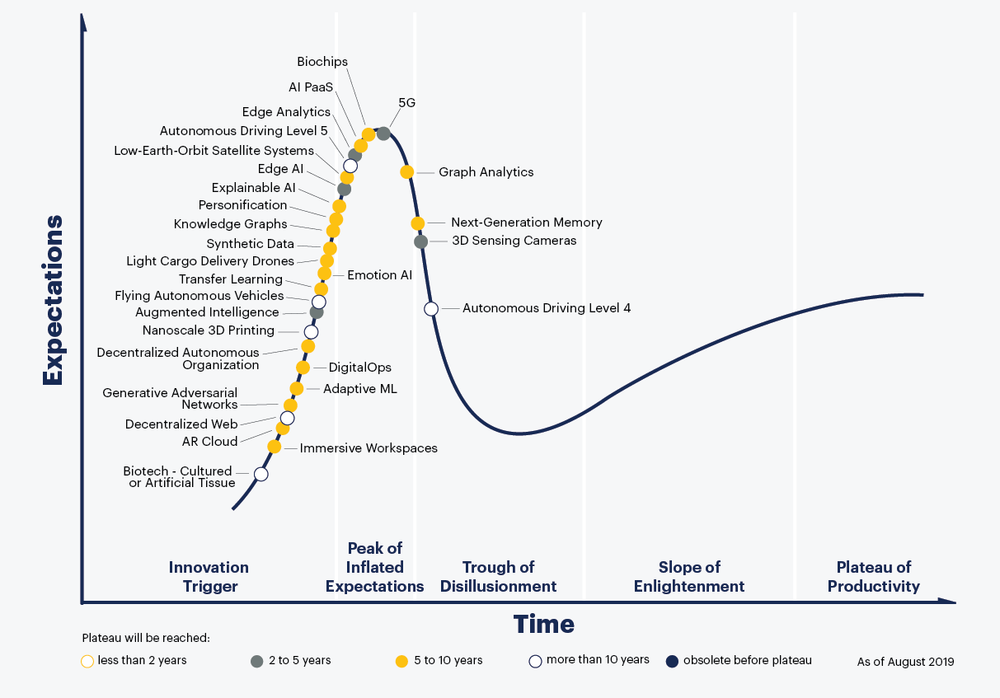
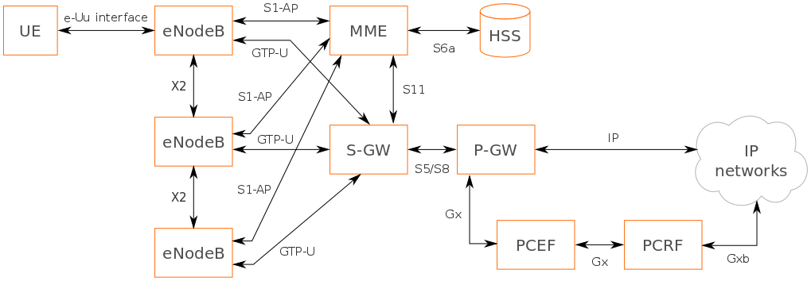
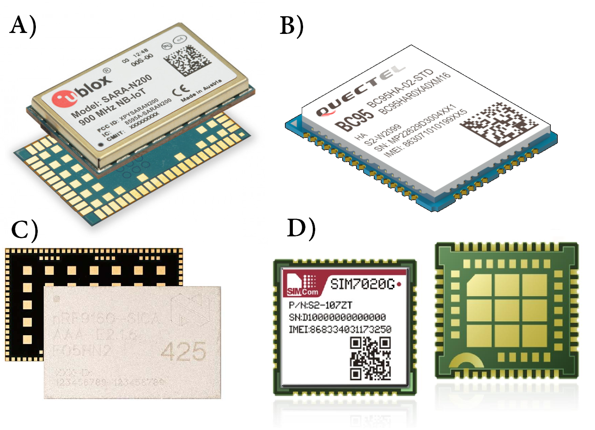
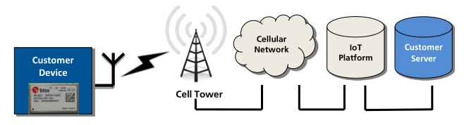

\pagestyle{fancy}
\fancyfoot[CE,CO]{Page \thepage \hspace{1pt} of \pageref{LastPage}}

# Literature Study {#litstudy}

This chapter will look at NB-IoT performance-related literature, IoT, LPWANs, use cases, and a deeper look into NB-IoT itself.

## Related Literature

Considering current literature, several studies provide theoretical models not only for the energy consumption of NB-IoT networks [@Andres-Maldonado2017], but also for their latency and delay bounds [@Feltrin2019], impact of coverage extensions [@Andres-Maldonado2018b], coverage performance [@Adhikary2016], battery lifetimes [@Yeoh2018d],[@Lauridsen2018], theoretically optimal configuration strategies [@Feltrin2018] and overall performance for particular verticals [@Soussi2018],[@Beyene2017b].

Only Martinez [@Martinez2019] focuses effort on the adopter and presents an operational and empirical analysis of the technology when it is deployed in a real network (such as Vodafone in the Metropolitan area of Barcelona). Durand [@Thomas2018] compares different LPWANs empirically including NB-IoT. Despite the unquestionable value of the theoretical models (for example, to understand orders of magnitude or to guess the theoretical upper and lower bounds), an empirical approach provides real insights into the variability that a UE device experiences when deployed in real conditions. This work therefore complements Martinez and related works, and it further provides empirical measurements for UEs that are deployed using a real-world NB-IoT network always while taking the perspective of an application developer.

Whilst this research is funded by MTN and being aware of internal documentation, this is an independent study which should aid any potential adopters of the technology.

## Internet of Things{#iot}

The Internet of Things (IoT), as briefly outlined in Section \ref{terminology}, is an ecosystem of smart devices that connect to the internet/cloud in various ways. Although IoT's requirements (Section \ref{iot_requirements}) are loosely defined due to the large variety of use cases (Section \ref{usecases}), it is still important to see how well NB-IoT performs and facilitates these connections for IoT (discussion in Section \ref{discussion}). This section looks at these requirements and other facets of IoT relevant to NB-IoT.

Since IoT is advancing in popularity (Section \ref{iot_advancement}), stakeholders in NB-IoT can be rest assured that the technology will be useful for years to come.

Although the simplest type of use case is smart metering (Section \ref{smartmetering}), useful for LPWANs which send data unidirectionally, NB-IoT shows its bidirectional strength in Push-Pull models (Section \ref{pushpull}). In fact, this makes NB-IoT well suited for edge computing (Section \ref{edge_computing}) too.

Finally, although satellite IoT has the benefit of worldwide coverage, by rolling out national NB-IoT coverage in South Africa, for example, it defeats the purpose of satellite IoT by being affordable and energy efficient (see Section \ref{satellite_iot}).

### Requirements {#iot_requirements}

IoT requires scalable smart devices to collect data and interact with the physical world using wireless connectivity. Thus, wireless communication must be energy efficient, have low latency, low data overhead and long range for optimal cloud processing.

To be sure that LPWANs can be well scaled, they require a cloud platform well suited to the large number of connections such as Cisco-Jasper and ThingsBoard [@Hejazi2018a].

### Advancement {#iot_advancement}

IoT has surged in popularity over recent years as an interconnected system of devices that transfer data over a network without requiring human interaction.

Looking at Gartner's analysis of technology expectations with regards to NB-IoT and related technologies, in 2014 Gartner estimated that Internet of Things (IoT) had reached the height of inflated expectations, and the hype it generated lives on in a rich ecosystem of emerging technologies. As of July 2018, NB-IoT and IoT has falling interest (and hype) in Fig. \ref{fig:gartner_ictAfrica}, yet it will reach productivity in 2-10 years time. Since new coverage has not been rolled out for almost two years to date, we believe there is a strong chance for renewed NB-IoT interest in Africa. Gartner predicts that there will be more than 20.8 billions of smart things that will be connected to Internet by 2020, whereas the worldwide number of devices was 6.4 billions in 2016 [@Ayoub2018c].

](../images/42881085945_739bbdc8e9_c.jpg){ width=90% }

As of August 2019, Gartner has high expectations for 5G and other emerging technologies which can make use of what [IoT has to offer](https://blogs.sas.com/content/hiddeninsights/2016/07/06/long-live-the-iot-hype/). This can be seen in Fig. \ref{fig:gartner_emergingTech}.

{ width=90% }

On the other hand, this does not slow the growth in number of devices connected as in Fig. \ref{fig:iot_growth}. IoT merely manifests itself in other uses and forms such as we have already seen in Fig. \ref{fig:gartner_emergingTech}. NB-IoT can be integral to aid this growth.

![Exponential growth of IoT is estimated [@Ali2015]. \label{fig:iot_growth}](../images/Expected-number-of-connected-devices-to-the-Internet-This-chart-is-obtained-from-recent.png){ width=80% }

Matching emerging applications with existing technologies has become one of the
main challenges for IoT initiatives, especially when a new technology appears in the landscape and the map must be redrawn. Massive IoT is the deployment of an immense number of low-powered devices with infrequent reporting and both NB-IoT and LTE Cat-M fulfill the requirements of 5G massive MTC/IoT.

### Push-Pull Model {#pushpull}

Traditionally, IoT devices push data to the internet at regular intervals. This push model can be considered quite energy inefficient, especially when the data is only occasionally actionable. For example, in asset tracking or remote monitoring.

A pull model is ideal for dynamic rule engines, pulling data only when necessary and ultimately edge computing, where building an application around this idea can greatly enhance battery life.

Most LPWANs are unidirectional, meaning they transmit data in one direction only. This is especially true in the case of LoRaWAN and SigFox and means they use a push model. A push model is bad for the battery when periodically sending data. It does help to make the data transmissions event-based, however. NB-IoT and Dash7 for example, are bidirectional which means they can stay quiet for longer and only send data on-demand ~ when it is needed. This would make it a pull model and is useful for critical use cases as well [@Mekki2018a].

Most importantly when looking at bidirectionality vs unidirectionality is that transmit current is usually much more than the receive current required. By limiting TX transmissions such that the user only requests data on-demand when it is required, battery savings ensue.

There are many LPWANs out there, but we can split them up into two groups as in Table \ref{tbl:unibidirectional_lpwans}.

Table: Unidirectional and bidirectional LPWANs {#tbl:unibidirectional_lpwans}

| Unidirectional | Bidirectional  |
| -------------- | -------------- |
| SigFox         | NB-IoT         |
| LoRaWAN        | EC-GSM-IoT     |
| NB-Fi          | RPMA           |
|                | Weightless SIG |
|                | Dash7          |
|                | WiFi HaLow     |

### Edge/Fog Computing {#edge_computing}

Edge computing is the practice of offloading cloud processes to the endpoint. It saves on data overhead, especially when there are data charges involved and battery longevity is desired.

Since NB-IoT is optimized for downlink communications, it can be the ideal candidate. Downlink communications use much less energy than uplink, and at higher throughput too. Usually data has to be periodically sent to the cloud in unidirectional networks and processing done thereafter, but with the push-pull model, one can send a specialized request and devices can send back processed data, saving energy and lowering data costs, hence edge computing.

Fog computing is considered a good solution to address the demand for massive connections and low-latency applications by pushing some computing or processing tasks from the cloud servers to the Fog nodes, or close to the mobile edge. A Fog node can be viewed as a reduced capability of a cloud server and/or integrated with a small cell for handling the telecommunication services. There are several potential applications of the Fog computing node technology associated with NB-IoT small cell and the cloud services for smart parking, smart home, and smart retail and delivery services [@Chang2017].

### Satellite IoT {#satellite_iot}

The potential use of constellations of satellites for IoT applications is of growing interest. With booming development in the IoT sector and as a powerful supplement to terrestrial systems, LEO constellation-based IoT is worth being focused and studied. To make this topic become a reliable cost-benefit solution, further research is required in transmission scheme, system security and low power consumption design. [@Qu2017c]

Compared to LPWANs, Satellite IoT has global coverage. In terms of packet payload size, a typical system such as the Iridium 9602/9603 will transmit up to 270 bytes or receive 340 bytes via AT commands. A supercapacitor is necessary for the initial 7.5W burst for 10ms which opens a session, and with an open sky messages can be sent every 10 seconds. It even features a 'Ring Alert' feature, similar to eDRX in NB-IoT in that modems listen for when incoming messages are available, for satellites to page a modem when a mobile terminated (MT) message is available from an internet-facing endpoint. Although Ring Alerts are sent to the position of the last known transmission, an Iridium satellite spot beam is about 400km in diameter meaning devices would have to travel quite far before requiring a simple re-registration transmission. The greatest drawback is the upfront, rental and per byte costs looking at \pounds159, \pounds12/month and \pounds0.14 per 50 byte credit respectively on Rock Seven Mobile Services Ltd, and the high power draw compared to NB-IoT.

NB-IoT is not the only network that can replace satellite IoT or 2G/GPRS with coverage in broad areas (ideally nationally), and this will be explored further in \ref{lpwans}.

## Low-Powered Wide-Area Networks {#lpwans}

A low-power wide-area network is a type of wireless telecommunication designed to allow long-range communications at a low bit rate among things, such as sensors operated on a battery. This section will compare a few prominent cellular and unlicensed frequency LPWANs against NB-IoT.

EC-GSM-IoT is a form of eGPRS optimized for the IoT. It is still in the trial stages of development, however [@Bergman2017].

RPMA by Ingenu is a 2.4GHz technology for M2M communications. It is primarily used in North America for the oil & gas industry, amongst others [@Ingenu2016]. It is equivalent to cellular standard but expensive.

Weightless SIG reuses TV whitespace, and NB-IoT is actually formed off this protocol [@Weightless2015], [@Raza2017].

NB-Fi Protocol is an open LPWAN protocol, which operates in unlicensed ISM radio band. Using the NB-Fi Protocol in devices ensures stable data transmission range of up to 10 km in dense urban conditions, and up to 30 km in rural areas with up to 10 years on battery power [@Ikpehai2018b].

HaLow (pronounced halo) is a low-power, long-range version of the IEEE 802.11 Wi-Fi standard. HaLow is based on the Wi-Fi Alliance 802.11ah specification and is expected to play an important part in IoT. At this stage it has low market traction.

### LoRaWAN {#lorawan}

LoRa is a low-power wide-area network technology. It is based on spread spectrum modulation techniques derived from chirp spread spectrum technology. It was developed by Cycleo of Grenoble, France and acquired by Semtech the founding member of the LoRa Alliance. 

LoRaWAN is a contender for NB-IoT. It lacks bidirectionality and data rate.

* LoRaWAN performs better for short messages, but it is subjected to a very high penalty when
  more than one message per data block is required.
* Second, the LoRaWAN reliability mechanism must be ensured at the
  upper layers, and thus may incur higher energy costs.
* Lower (sub-500 devices per gateway) scalability of LoRaWAN per base station compared to NB-IoT and GPRS. This low scalability is due to the limited number of channels and the lack of any scheduling between devices. To compensate for the low scalability, an increase in spatially diverse base stations would allow packets to be received by multiple base stations at varying received power levels.

LoRaWAN uses chirp-spread-spectrum (CSS) and is publically accessible from networks such as The Things Network (TTN). Unfortunately, although that has the best coverage, it only uses class A which means it cannot listen for asynchronous downlink messages except after an uplink (which defeats the purpose of avoid unnecessary uplink transmissions which draw large current) [@Adelantado2017].

### Dash7

DASH7 Alliance Protocol is an open source Wireless Sensor and Actuator Network protocol, which operates in the 433 MHz, 868 MHz and 915 MHz unlicensed ISM band/SRD band. 

* Bidirectional

Dash7 is a military RFID standard that has also grown into a medium range LPWAN [@noraird7].

Dash7 is considered a medium range LPWAN and is made for the full networking stack. It delivers an open standard for ultra low power mid-range sensor and actuator communication known as DASH7 Alliance Protocol (D7AP). D7AP is based on active RFID standards ISO 18000-7 for 433 MHz communication, however it has been significantly extended. It was originally intended by the US Department of Defense for container inventory and grew to become a medium range bidirectional wireless network system [@Weyn2015] useful in the indoor-outdoor realm. D7AP is modelled after a BLAST (Burst, Light, Asynchronous, Stealth, and Transitional) communication system which enables it to be a LPWAN competitor. D7AP is a full-stack protocol defining the complete OSI model, with support for three sub-GHz ISM bands, and three data rates (9.6 kbps, 55.55 kbps, and 166.67 kbps), as discussed above. D7AP uses 2-GFSK, the modulation schemes. D7AP can also re-use the PHY layer (radio frontend) of other LPWANs. Also, it should be possible to reuse the RF PHY layer of NB-IoT for Dash7's OSI stack, and in asset tracking, for example, it results in a compressed tracking solution that works well both indoors and outdoors.

Wizzilab is one of three main developers of Dash7. It offers the only full-kit open to development (at least in the form of an application processor). Haystack is another Dash7 developer with [https://github.com/jpnorair/OpenTag](https://github.com/jpnorair/OpenTag). Finally, the developer community with [https://github.com/MOSAIC-LoPoW/dash7-ap-open-source-stack](https://github.com/MOSAIC-LoPoW/dash7-ap-open-source-stack).

### SigFox {#sigfox}

Sigfox is a French global network operator founded in 2009 that builds wireless networks to connect low-power objects such as electricity meters and smartwatches, which need to be continuously on and emitting small amounts of data. Sigfox is based in Labège near Toulouse, France, and has over 375 employees.

Briefly, SigFox is an ultra-narrow-band wireless technology that one can send 140 12-byte messages per day due to the duty cycle limitation of unlicensed frequencies. One can also receive 4 downlink ack messages, but this is not good enough when looking to optimize the sending of GPS/GNSS updates [@SigFox2016]. SigFox is a contender for NB-IoT, but it lacks bidirectionality and datarate.

Simulations show that with 55,000 devices transmitting the base station would reach the 270 simultaneously transmitting devices that Sigfox claims is possible while still ensuring a 99.9% PDR [@Thomas2018].

{width=80%}

### NB-IoT {#nbiot_lit}

Narrowband Internet of Things is a Low Power Wide Area Network radio technology standard developed by 3GPP to enable a wide range of cellular devices and services. The specification was frozen in 3GPP Release 13, in June 2016. Other 3GPP IoT technologies include eMTC and EC-GSM-IoT. 

NB-IoT is LTE's replacement for the power hungry GSM that some IoT devices still use. GSM is an aging technology which is being turned off in some parts of the world. It has 7 times better range and coverage, and power saving which can let a device last 10+ years on a single charge [@Wang2017c].

### LPWAN Comparison {#lpwan_comparison}

There are many wireless technologies out there, with some standardized, including but not limited to SigFox, LoRaWAN, Dash7, Bluetooth, 6LowPan, RPMA, Weightless, and IETF 6TiSCH. A brief comparison is drawn on NB-IoT against prominent unlicensed frequency LPWANs in Table \ref{tbl:lpwan_comparison}, and cellular LPWANs in Table \ref{tbl:cellular_comparison}.

Table: Brief comparison of NB-IoT against wireless LPWANs {#tbl:lpwan_comparison}

|                         | NB-IoT       | LoRaWAN           | SigFox   | Dash7             |
| ----------------------- | ------------ | ----------------- | -------- | ----------------- |
| Frequency               | 450-2200 MHz | 433, 868, 915 MHz | 868 MHz  | 433, 868, 915 MHz |
| Bandwidth               | 200 kHz      | 125-500 kHz       | 200 kHz  | 25, 200 kHz       |
| Throughput              | 250 kbps     | 27 kbps           | 0.1 kbps | 167 kbps          |
| Duty cycle limitation   | 0%           | 90-99%            | 99%      | LBT ~ 0-99%       |
| Messages per day (12 B) | 14 million   | 10-243            | 140      | 86400+            |
| Bytes per message       | 512          | 255               | 12       | 256               |
| Uplink Latency          | 0.1 - 10 s   | < 3 s             | ~ 6 s    | < 0.015 s         |
| Battery Lifetime        | 10 years     | 10 years          | 16 years | 3-5 years         |
| MCL                     | 164 dBm      | 157 dBm           | 160 dBm  | -                 |
| Scalability             | 55,000       | ~500              | > 50,000 | -                 |
| Outage                  | 1%           | > 2%              | 1%       | -                 |
| Average Power           | 550 uWh      | 15-66 uWh         | 144 uWh  | -                 |
| Range                   | 2.5 - 5 km   | 5km (85% PDR)     | 3-10 km  | 2 km              |

Table: Brief comparison of NB-IoT against cellular technologies {#tbl:cellular_comparison}

|                  | NB-IoT       | 2G/GSM/GPRS  | EC-GSM-IoT[^ec_gsm_available] | LTE Cat-M    |
| ---------------- | ------------ | ------------ | ----------------------------- | ------------ |
| Frequencies      | 450-2200 MHz | 850-1900 MHz | 850 - 1900 MHz                | 450-2600 MHz |
| Bandwidth        | 180 kHz      | 200 kHz      | 200 kHz                       | 1.4MHz       |
| Throughput       | 250 kbps     | 56–114 kbps  | 70-240 kpbs                   | 375 kbps     |
| Packet size      | 512          | ~ 1400       | -                             | ~ 1024       |
| Uplink Latency   | 0.1 - 10 s   | 0.3 - 1 s    | 0.7 - 2 s                     | 0.1 - 10 s   |
| Battery Lifetime | 10 years     | 3 months     | 10 years                      | 10 years     |
| MCL              | 164 dBm      | 148 dBm      | 154 - 164 dBm                 | 164 dBm      |
| Scalability      | 55,000       | 52,000       | 50,000                        | 55,000       |
| Range (urban)    | 2.5 - 5 km   | 1 - 2 km     | -                             | 2.5 - 5 km   |

[^ec_gsm_available]: eGPRS/EDGE-based EC-GSM-IoT is not available anywhere in the world yet.

To meet application specific requirements, the uniqueness of each technology gives each its advantages and disadvantages. Matching custom applications with a wireless technology is non-trivial as there is no silver bullet that matches all use-cases. In terms of a few metric capabilities, a best-and-worst case matrix is shown in Table \ref{tbl:lpwan_strengths}. NB-IoT is shown to be closest to being an all-round winner, with battery life the exception. This is another reason why battery life is investigated in this study.

Table: LPWAN strengths with \checkmark,  $\times$  denoting best and worst case respectively. {#tbl:lpwan_strengths}

| Technology   | MCL        | Scalability | Battery life | Throughput |
| ------------ | ---------- | ----------- | ------------ | ---------- |
| NB-IoT       | \checkmark | \checkmark  |              | \checkmark |
| GPRS         | $\times$   | \checkmark  | $\times$     | \checkmark |
| LoRaWAN SF7  |            |             | \checkmark   |            |
| LoRaWAN SF12 | \checkmark | $\times$    |              | $\times$   |
| SigFox       | \checkmark | \checkmark  |              |            |

Competition in the LPWAN space, regional momentum and IoT demand will ensure that the various technologies will continue to develop and improve to support more features and expand the network coverage.

Selected uptake of LPWANs is expected in specific use cases and results show that each technology is better suited to specific applications and their accompanying requirements. Sigfox, NB-IoT, and LoraWAN SF12 performed equally well for applications where MCL (range) is paramount, with LoraWAN SF7 doing slightly worse. In applications where the main consideration is scalability, Sigfox, and NB-IoT substantially outperformed the LoraWAN varieties. However, if battery life is the most important consideration, LoraWAN SF7 seems to have the edge, with NB-IoT performing worse. NB-IoT performed the best for uplink throughput, with LoraWAN SF7 coming in second. For the downlink throughput and firmware upgradability metric, NB-IoT performs substantially better than the other technologies. All in all, NB-IoT outperforms SigFox and LoRaWAN in UL/DL throughput, scalability, MCL range and FoTA updates. It is superseded by LoRaWAN in battery life for SF7. If NB-IoT worked with the mobile network operators to reduce its RRC-idle phase, it could develop a minimal power consumption to compare with that of LoRaWAN and Sigfox [@Thomas2018]. By finding ways to increase battery life, it may just be the 'silver bullet' for all IoT use cases.

*Todo: add 'A Comparative Survey of LPWA Networking' [@Finnegan2018]*

[^catm_nbiot]: Todo: find the reference.

## Use Cases {#usecases}

IoT has use case requirements in uplink and downlink transmission, throughput, battery longevity and scalability. Two types of use cases are looked at here for their unidirectional and bidirectional behaviors, namely smart metering and actuator control, and a novel way of using downlink control in asset tracking is presented before a list of use cases.

### Smart Metering {#smartmetering}

One of the simplest and most popular use cases in IoT is smart metering. Periodically sending uplink data at regular intervals from a static location has the advantage of remote monitoring and reducing the need for physical readings. It also opened up new features for users (such as dynamic pricing and usage pattern analysis) and operators (such as load balancing a large number of clients). The clear value proposition and success is partially due to the belief that IoT should be low powered and low data transmissions which still exists today and has made it the traditional IoT model.

Smart metering can be easily applied to most LPWANs, but only a few have synchronous downlink capabilities, and NB-IoT can be considered well suited for bidirectional uses cases such as actuator control.

### Actuator Control

An *actuator* is a component of a machine that is responsible for moving and *controlling* a mechanism or system, for example by opening a valve. In this use case, actuator control requires bidirectionality for its downlink controllability.

### Asset tracking

Many use cases in the Internet of Things (IoT) require or benefit from location information, making positioning a vital dimension in the IoT. The 3GPP has dedicated a significant effort during its Release 14 to enhance positioning support for its IoT technologies. There are still design challenges with regard to positioning support in LTE-M and NB-IoT that need to be taken into consideration. Nevertheless, the 3GPP is working on enhancing position support such as OTDOA, which is a downlink based positioning method. The OTDOA positioning reference signals can also be simulated to illustrate the positioning performance [@Lin2017],[@Miao2018].

TDoA, ToF, Aoa, RSSI, are all land-based techniques for pinpointing the location of an endpoint. They require real-time clocks accurate to the millionth of a second as well as expensive gateway hardware. Depending on the frequencies, wireless network and modulation, one can get different ranges. This is useful for the indoors. Unfortunately, range is sacrificed for accuracy.

Satellites, on the other hand are in stable LEO or geostationary orbits and a constellation of satellites can keep in constant synchronization using atom clocks . One retains accuracy, even over long distances due to the ultra high precision of the clocks. This is useful for the outdoors.

Besides having the ability to measure RSSI which seems quite standard in wireless networks, NB-IoT is also lucky to have the benefits re-using the Timing-Advance (TDoA) hardware when upgrading cellphone towers with the capability. This means that one can reasonably approximate the position of an endpoint to within a 1000m.

Consider a unidirectional wireless network that, although it has many kilometers of range, has limited capability in receiving downlink messages from gateways. Adding a GPS/GNSS module is increasingly trivial and inexpensive these days [@Allan2013], although one still has to deal with the occasional cold start and periodic receive windows to determine the whereabouts of the device in question [@Bulusu2000]. To avoid using the receive windows unless necessary, one can easily know when a device is static by observing movement via an accelerometer or similar [@Bujari2012], but purposefully locomotive devices require more computationally expensive means such as dead reckoning to determine if the endpoint has moved significantly to require another GPS/GNSS location update [@Goyal2011]. 

One of the benefits of bidirectional LPWANs over satellite localization is the fact that towers have the capability of beaconing a positioning reference signal [@Lin2017]. A more effective alternative to determining location besides satellite localization can be periodically observing the receive signal strength indicator (RSSI) for changes which directly translate to movement in meters which warrant a GPS/GNSS location update. RSSI has been used in fingerprinting localization for GSM-based devices [@Ibrahim2012]. Listening for a terrestrial tower certainly doesn't require a lower receive sensitivity than for a satellite a few hundred kilometers in the sky, and with a much higher throughput than the typical 50 bit/s of GPS/GNSS. GPS/GNSS signals can also be relayed indoors using an outdoor and indoor antenna [@Haddrell2001].

Durand [@Thomas2018] suggests NB-IoT is poor for asset tracking and utility metering due to its high energy transmissions. By using the push-pull model as in \ref{pushpull} and only pulling data when a device's data/location is desired or pushing data when out of a geofence, one can save energy so much so that it can be considered better than LoRaWAN or SigFox, even though they may use less energy per transmission.

### List of Use Cases

|      |      |
| ---- | ---- |
| Public Safety | Smart bicycles  |
| Agriculture | Parking |
| Smart Metering | Garbage bins |
| Actuator Control | Intelligent buildings |
| Real-time Monitoring | Pet tracking, Smart Lost and Found |
| Asset Tracking | Point-of-sale terminals |
| ITS - Logistics | predictive maintenance |
| Health Care | Mobile Advertising |
| Industrial Production | Environmental Control Systems |
| Energy, Utilities | Industrial Automation Systems |
| Retail |      |

## A deeper look into NB-IoT {#nbiot}

This section describes NB-IoT in more detail and the setup procedures involved.

### Development {#development}

Formed by the 3GPP from LTE, NB-IoT was developed within that framework and its capabilities are particularly well suited to smart metering.

Compared to LTE, NB-IoT devices are usually stationary with intermittent burst transmissions, low data bandwidth, delay-tolerant applications, support for huge number of devices, dealing with poor coverage (indoor penetration) and having a battery lifetime of at least a few years.

Taking it one step further, the 3GPP defined two device categories, namely Cat NB1 and NB2, with the latter adding support for:

- Device positioning/location using OTDOA
- Seamless intra-and-inter-cellular cell-reselection for improved mobility.
- Push-to-talk voice messaging
- Multicast transmission to multiple devices simultaneously.

NB-IoT devices are seen as stationary, only small chunks of data are intermittently transmitted and applications are envisaged as delay-tolerant. NB-IoT technology is designed such that it can be used in areas beyond the radio coverage of current cellular standards and in devices which must run from battery power for many years. The devices will generally send small amounts of data infrequently; a typical usage scenario might be 100 to 200 bytes sent twice per day for battery powered devices. For mains powered devices the limit is not based on battery size, but cost and network bandwidth/resources.

The system operation is analogous to SMS in that it is a datagram-oriented, stored-and-forward
system, rather than a GPRS-like IP pipe. This is because NB-IoT devices spend most of their time
asleep, making possible the required long battery life. The system implements extended DRX cycles
for paging, but as this window will be limited to save battery life, the delivery of downlink messages
occurs mainly when the system detects that uplink messages have been received from a device
(indicating that it is awake). Here a store-and-forward system, an “IoT Platform”, is useful.

### Standing {#lit_standing}

NB-IoT has a certain standing in IoT and LPWANs, and this can be seen in Fig. \ref{fig:nbiot_positioning}.

![IoT Wireless Technology Representation [@Martinez2019] \label{fig:nbiot_positioning}](../images/1559246290186.png){width=85%}

Low Power Wide Area Networks (LPWANs) include SigFox, LoRaWAN, NB-IoT, Dash7, Weightless, N-Wave, NB-Fi, Thread and others. Some of these, like SigFox and LoRaWAN are unidirectional, which make them unsuitable for critical applications which require downlink acknowledgement or more. These have ranges from 2 - 20 km and can be considered outdoor technologies along with cellular IoT [@Ikpehai2018b].

Low Power Local Area Networks (LPLANs) include BLE, 6LoPAN, Thread, ZigBee, WiFi and others. 
Unfortunately, due to country regulations the output power is limited especially for unlicensed frequencies. They may not even be suited for long range on the PHY layer, but they can essentially be considered indoor technologies with ranges of 10-100m [@Lee2007].

Cellular-IoT includes LTE Cat-M, LTE Cat-NB or NB-IoT and EC-GSM-IoT. GSM has high battery usage due to constant synchronization in active mode, and un-optimized transmission of data. It is generally not considered in this thesis because it is a sunsetting technology. LTE-M is also considered a high-power technology and is not as suited for IoT as NB-IoT is [@EricssonAB2016a], although there is evidence that it is quite similar [^catm_nbiot].

Martinez [@Martinez2019] has explored NB-IoT from the perspective of the application developer. When evaluating performance, it would do well to find the limits of the technology as well as find the optimum 'sweet spot' or range for efficient operation. This decent study on the operational trade-offs of NB-IoT over LTE proves NB-IoT to be competitive in terms of energy consumption amongst other LPWANs. Although there are many complexities such as signalling, dynamic adjustments triggered by network conditions and  timings, its competitive energy consumption is due to 3GPP efforts to match LPWANs. By using proprietary spectrum over unlicensed ISM bands, NB-IoT avoids external interference and mandatory duty cycling. Even though employing increased repeatability due to the ECL mechanism increases unpredictability in device behavior, it ensures reliability by guaranteeing delivery unless outside the maximum range or signal strength bounds that a device can communicate with a tower. This variability in delivery time can be a deal-breaker for some critical applications, but on the whole it is suitable for delay-tolerant applications, and under 10 seconds will cater for most use cases. The ownership model is a connectivity service or contract, and is charged per byte. Coverage depends on deployed infrastructure.

A user would consider critical characteristics such as energy consumption, coverage, cost, network latency and behavior. Martinez looks at these except for cost, which is better looked at by Ali [@Ali2015]. A set of tests were devised and results showed that in some cases its energy consumption performed better than an LPWAN referenced technology such as LoRa, with the added benefit of guaranteeing delivery. However, the high variability in energy consumption and network latency call into question its reliability especially for mission-critical applications.

### LTE Architecture

Although most users interact only with the UE device which runs its own proprietary firmware stack, NB-IoT also has a complex backend architecture.

The complexities of LTE architecture further increases the chance of performance degradation with respect to 3GPP specifications due to the vast array of setup parameters. It would be beneficial to analyze the performance of multiple UE devices against various MNO vendors. It is important to note that MNOs may use various vendors in their architecture, and thus this study is mainly focused on the eNodeB vendor which is also UE device facing and has the greatest chance of performance degradation due network quality, RF interference and so forth.

Both UDP socket commands and datagram commands use the IP data transport through the SGi.

### Hardware {#lit_hardware}

This subsection looks at hardware specific to the UE device.

{width=55%} 

### Setup Procedure {#lit_setup}

* There exist application development manuals.
* AT+NCONFIG
  * AUTOCONNECT
  * CR_0859_SI_AVOID
  * CR_0354_0338_SCRAMBLING
* URCs
* APN

### Network Registration and Info {#nw_reg_info}

- By default the SARA-N2 series modules will automatically try and connect to the network. This
  feature will read the SIM for the PLMN and attempt to register with the network. The device will use
  the default APN from the network. The auto-connect feature can be enabled by the +NCONFIG AT
  command. Reset the module to save these settings to the non-volatile memory.
- If the application requires more control over the registration process set the SARA-N2 series
  modules into the manual registration mode. With the auto-connect feature turned off the module is
  able to manually connect to a specific PLMN and specify an APN.
- After a RRC connection is made to the base station the module will try and register with the
  network. If the module IMEI or IMSI is not allowed on the network, the module will disconnect from
  that base station and continue scanning for other base stations. This can be seen if the <mode>
  parameter of the +CSCON AT command shows the “1” and then “0” response without +CEREG
  changing to 1 or 5 means that the module was not able to register on that network.
  In case the module is registered to the network, the <status> parameter of the +CEREG AT
  command will be 1 (registered) or 5 (registered & roaming).
- See [@ubloxAppNote2018]] for a connection status compatibility matrix.

* PCI value is assigned.

The **PCI** value is created from two components - PSS and SSS. The PSS, Primary Synchronization Signal, has the value 0, 1, or 2. The SSS, Secondary Synchronization Signal, can have a value between 0 and 167.

### RRC Connection and Inactivity Timer {#rrc_inactivity}

After network registration or transmitting a data packet, the device usually enters RRC connected (C-DRX) mode for a specified inactivity timeout specified by the network.

- When the module is in RRC connected mode it will be receiving all the base station signaling. The
  average power consumed in this mode is about 48 mA. If the RRC connection is left for 20 s of
  inactivity before the RRC is released, then this will consume about 1 mWh @ 3.6V.
- 48 mA in this mode
- 20 seconds is about 1mWh @ 3.6V
- AT+CSCON
- After a short period, if no messages are being sent from the module, the +CSCON response will be
  “0” to show the RRC connection has been released by the eNodeB.
- At the first registration or when the module wakes from the power save mode (PSM), it performs a
  Random Access CHannel (RACH) procedure to attach to the base station. This establishes a Radio
  Resource Control (RRC) connection to the base station. Once established only the base station can
  release this connection. The module cannot drop the RRC connection other than turning off the
  radio using the AT+CFUN=0 command.
- The base station has an “inactivity” timer for each module and if there is no activity the base station
  will send a RRC release message to the module. The module should respond back to the base station
  with an acknowledgment. The inactivity timer is nominally 20 s.
- The module will be able to receive and send messages immediately when in connected mode.
- During a RRC connection, the +CSCON AT command provide the signalling connection status. It is
  also possible to enable the +CSCON URC.
- When a MO message is sent from the module, the module must first create a RRC connection if
  there is not already established with the base station. This status can be checked using the
  AT+CSCON command.
  To check the signalling connection status issue the +CSCON read command. The second parameter
  of the information text response (+CSCON: <n>,<state>) provides the interested information:
  * 0: idle mode (no RRC connection)
  * 1: connected mode (RRC connection)
- To configure a URC for this command, issue the AT+CSCON=1 command. A URC will be issued at
  each RRC connection status change. 

### Release Assistance {#release_a}

Release assistance requests the eNodeB to release the RRC connection immediately. By avoiding 20 seconds of idle RRC in C-DRX mode, there is a 93% improvement in power consumption for a 200 byte transmission in ECL 1.

[@ubloxAppNote2018]

An example of sending a 200 byte message in ECL 2 with good SNR can include 5 RACH transmission bursts, a Transmission Block Size ~43 bytes, one repetition and taking just over 1 second, consuming 200uWh.

For the same example in bad SNR, the TBS allocated 32 bytes per chunk, with a repetition of 8 and 4. It took 5.5 seconds and consumed 1.07mWh -- fives times as much as before.

- Some applications may not want to wait for the base station’s inactivity timer to expire after 20 s as
  this wastes power from the battery. In Release-13 the “Release Assistance” feature allows the
  module to request for the RRC connection to be dropped as soon as the message has been received
  by the network.
- The flag is noticed by the MME on the network and sends a message back to the eNodeB base
  station to drop the RRC connection. The network must support Release Assistance for this feature.
- After the RRC connection has been released the module then goes in to a period where it could be
  paging the base station. The timer for this period is called T3324. After T3324 has expired the
  module goes into Power Save Mode (PSM). See section 11 for further information

### Power Saving Mechanisms

The NB-IoT protocol allows for power save mode (PSM), and the SARA-N2 series modules also
support a Deep Sleep mode where the module is running at very low current, ~3 $uA$. The module
automatically enters various states depending on the device activity. Here below are listed the
common activities and the various states it will be in after registration.

* T3324 / T3412 timer values

#### T3412 PTAU Timer

* (GPRS timer 3)
*  3GPP TS 24.008 [4], figure 10.5.147a and table 10.5.163a.

* Bits 5 to 1 represent the binary coded timer value. Bits 6 to 8 define the timer value unit for the GPRS
  timer as follows
* 8 7 6
  0 0 0 value is incremented in multiples of 10 minutes
  0 0 1 value is incremented in multiples of 1 hour
  0 1 0 value is incremented in multiples of 10 hours
  0 1 1 value is incremented in multiples of 2 seconds
  1 0 0 value is incremented in multiples of 30 seconds
  1 0 1 value is incremented in multiples of 1 minute
  1 1 0 value is incremented in multiples of 320 hours (Note 1)
  1 1 1 value indicates that the timer is deactivated (Note 2)
* Example: "01000111" = 7 x10 hours = 70 hours
* NOTE 1: This timer value unit is only applicable to the T3312 extended value IE and the T3412
  extended value IE (see 3GPP TS 24.301 [5]). If it is received in an integrity protected message, the
  value shall be interpreted as multiples of 320 hours. Otherwise the value shall be interpreted as
  multiples of 1 hour.
* NOTE 2: This timer value unit is not applicable to the T3412 extended value IE. If this timer value
  is received, the T3412 extended value IE shall be considered as not included in the message (see
  3GPP TS 24.301 [5]).

#### T3324 Active Timer

* The T3324 Timer is reset after a downlink message is received. The negative impact on energy savings should be taken into account if downlink data is fragmented.
* the Active Timer (T3324) controls the time lapse during which the UE device is reachable by the network in RRC Idle, i.e., the number of eDRX cycles.

* Bits 5 to 1 represent the binary coded timer value. Bits 6 to 8 define the timer value unit for the GPRS
  timer as follows
* 8 7 6
  0 0 0 value is incremented in multiples of 2 seconds
  0 0 1 value is incremented in multiples of 1 minute
  0 1 0 value is incremented in multiples of deci-hours
  1 1 1 value indicates that the timer is deactivated
* Example: "00100100" = 4 x1 minute = 4 minutes

#### eDRX Cycles and PTW

* An eDRX cycle is composed of an active phase, controlled by a Paging Time Window (PTW) timer, which ranges from 2.56 s to 40.96 s followed by a sleep phase until the end of the eDRX cycle. Within the PTW, the standard LTE paging is observed.

Extended Discontinuous Reception (eDRX) mode means that paging windows can be scheduled such that the modem can be contacted by the server.

{width=80%}

### System Information Blocks (SIB) {#sib}

The SIB describes the method of attachment and what repetitions the UE device must use to first transmit
to the base station. Once a RRC connection is made, the base station then uses the perceived SNR
to configure the uplink allocations the UE device will use to transmit the messages.
Because allocations for each uplink/downlink are dynamically set by the base station it is difficult to
calculate the power consumption of a single message deployed in the field.

* example SIB

The UE device is to a large extent/entirely controlled by the network/eNodeB. UE devices must follow NW settings broadcast inside the SIB and allocations for UL/DL data.

### Repetitions and Extended Coverage Level (ECL)

* ECL
* Module interference increases the number of repetitions
* Minimize ECL 2.
* Network operators should provide enough coverage to allow devices to be mostly in coverage class 0
  or 1. Depending on the NB-IoT deployment, the network could have large areas, or devices located in
  deep locations which unfortunately mean they operate in Coverage Class 2.
* Coverage Class 2 uses high repetitions for the RACH process and also higher coding schemes when
  transmitting data and therefore fundamentally consumes more power than it would in the other
  coverage classes.

* 

### UE Device and Network Behavior

* The application can monitor the status of the module’s connection, registration and PSM state by
  polling or configuring URCs. By monitoring the module status the application can behave more
  efficiently, depending on the application type. For example, the application may want to know when
  the module goes into Power Save Mode (PSM).

Register the module to the NB-IoT network before to send or receive any messages. Without being
registered the module will not be able to send or receive any messages.
To check the network registration status issue the +CEREG read command. The second parameter
of the information text response (+CEREG: <mode>,<state>) provides the interested information
* 0: not registered, not registering
* 1: registered
* 2: not registered, but currently in the process to
* 3: registration denied. The application should have a re-try mechanism which does not simply try registration immediately, but has some back-off process
* 4: unknown
* 5: registered, roaming

When the module has started the network search process, poll the +NUESTATS AT command and
view the Rx and Tx Time:

* If Rx Time is increasing then the module is trying to scan for a base station.
* If Tx Time is increasing then the module has found a base station and is trying to communicate
  with it.
* If the Total Power and Signal Power values are different than -32767 (invalid) then the module has
  read the MIB and SIB signals from the base station.
* Once an RRC connection is made, the +CSCON read command will return 1. Turn on the +CSCON
  URC which will be output at each RRC connection change.

If the SIM used is an international SIM (roaming SIM) then the registration process can take many
minutes for the first time. Once the module is registered on that network the PLMN should be
stored in the SIM so that registration is quicker next time. The application can tell if it is using
roaming SIM by the state being “5”.

* The +CEREG URC can be enabled to provide the network registration status. Depending on the
  <mode> parameter it is possible to configure the interested URC parameters (i.e. <mode>=4 or 5 to
  see the provided network timers). See SARA-N2 AT Commands Manual [2] for more details.
* Properly setting the +CEREG AT command (<modem>=3, 4 or 5) it is possible to see the
  registration EMM cause value. These values are described in the 3GPP TS 24.008 [4]. Typical
  causes:
  * #5 IMEI not accepted
  * #11 PLMN not allowed
  * #12 Location Area not allowed
  * #13 Roaming not allowed in this location area
  * #22 Congestion

### AT Commands {#atcommands}

This section outlines the capabilities of the UEs.

Table: Summary AT Command set for Ublox {tbl:atcommands}

|                      | Command    | Description                                                  |
| -------------------- | ---------- | ------------------------------------------------------------ |
| Set configuration    | AT+NCONFIG | Change configuration for SI_AVOID, Scrambling etc.           |
| Network Registration | AT+COPS    | This command initiates search for cell towers to connect to depending on MNO-related SIM-card and registers/deregisters accordingly. |
| Set APN              | AT+CGDCONT | Sets the relevant APN for the MNO.                           |
|                      |            |                                                              |

* SARA-N2 series modules implement a FOTA solution based on CoAP. It is possible to configure the
  module’s poll timer for when the module checks the FOTA CoAP server for new firmware. When the
  feature is enabled and a new package is available, the module will automatically download the FOTA
  update and provide URCs about its progress. The module’s firmware is not updated automatically
  when the download has completed and so the application must start the upgrade process step.
* The +UTEST AT command allows the user to set the module in non-signaling (or test) mode, or
  returns to the signaling (or normal) mode. In test/non-signaling mode, the module switches off the
  protocol stack for performing single tests which could not be performed during the signaling mode.
* MO Datagrams sent and received by IoT platform has these commands wrapped internally in a Constrained Application Protocol (CoAP) message and sent over UDP sockets. Once the module accepted a datagram it cannot be removed and will be transmitted to the network as soon as radio conditions permit. The only way to clear the module’s transmit queue is to reboot it. In good radio conditions, the transmission might take a few seconds. In bad radio conditions a transmission opportunity may not occur for minutes, days or weeks but the datagram will be transmitted once radio conditions are good enough. When a MO message is queued, the module will try to send the message to the base station. It will only send the next message once the previous message has been sent. If there is a radio link failure (RLF), the device will re-scan the channel ranges and try to reconnect to a base station. There may be a back off time where the device goes into deep-sleep mode before trying again.
* An unsolicited result code (URC) is a string message (provided by the DCE) that is not a response to
  a previous AT command. It can be output, when enabled, at any time to inform the DTE of a specific
  event or status change.

When it comes to base stations, the user does not have control over the inactivity timer. Release assistance can request the eNB/network to disconnect the modem from Radio Resource Control (RRC) connected mode.

When the module is synchronized to the base station, the +NUESTATS AT command is able to describe the radio, cell, BLER, throughput statistics and other signaling info received.
The most useful statistic is the "RADIO" type.

### Application Architecture

* 
* At the far left the customer’s device contains a u-blox NB-IoT module that communicates over the radio network with a cell tower that supports the NB-IoT network. The cellular network links the cell tower with an IoT platform. This IoT platform stores uplink datagrams from the NB-IoT module. The customer server communicates with the IoT platform to retrieve uplink datagrams and to send downlink datagrams to the NB-IoT. The IoT platform holds downlink datagrams until the NB-IoT module is awake to receive them.
* The SARA-N2 series modules implement basic UDP socket commands for directly communicating with an external service. With these commands the customer can build a simple IoT platform. With an external processor other IoT layers could be implemented to aid this system design. SARA-N2 series modules support AT commands for general CoAP messaging. This allows the customer to not require CoAP in their external processor.
* Many developers coming from a GPRS type background may expect an always on type connection, normally using TCP. NB-IoT is not session oriented, latencies are much higher and the device will enter a power save mode. This is very different to always-on modems with “chatty” protocols like TCP.
* UDP sockets do not create connections to servers; UDP is a connection-less datagram protocol. Because of this MO messages may not be received by the server and lost. The application should take this in to consideration and provide its own acknowledgements between the UE device and server. CoAP is one protocol which can be used on top of UDP to provide this.
* For resolving the issue of sending MT messages to a very sleepy module, when a MO message is sent to the cloud server, the cloud server will know the module is active and connected to the network. As seen in section 7 the connection is alive until the RRC connection is released by the network and then still contactable when paging inside the T3324 period. If there are MT messages to be sent to the module, the cloud server should send this message in this time.\

Martinez et al. [@Martinez2019] did empirical tests within the Vodafone Network in Barcelona. They observed UE device and NW behavior, measured current traces, and did various tests in different modes.

Table: NW Config {#tbl:nw_config}

| Mode       | NW Configuration                                             |
| ---------- | ------------------------------------------------------------ |
| **Mode 1** | Inactivity timer = 20s (network default) T3324 = 0s (disabled) C-DRX = 2.048s (network default) |
| **Mode 2** | Inactivity timer = Immediate Release T3324 = 8s I-DRX = 2.56s eDRX/PTW = Disabled |
| **Mode 3** | Inactivity timer = Immediate Release T3324 = 0s (disabled) |

### RF

When only a fraction of the existing LTE cell sites support NB-IoT, devices cannot attach to the best cell if that cell does not support NB-IoT. As a result, the path loss can be very high. In addition, they also suffer from high interference from non-NB-IoT cells [@Mangalvedhe2016a].

### Specifics

In the uplink, there are two physical layer channels. The random access channel connects to the base station and the uplink channel contains the data and control information. In downlink there are four channels. Synchronization is used by the endpoint to estimate symbol timing and carrier frequency and obtain the cell identity and frame boundary. The broadcast channel contains the master information block (MIB). The control channel carries downlink control information and can be repeated 2048 times, as well as the data channel which contains the payload, paging, system information and the random access response. [@Adhikary2016].

NB-IoT operation requires a minimum bandwidth of 180 kHz, which is equal to the size of the smallest LTE Physical Resource Block (PRB). Depending on the availability of spectrum, NB-IoT can be either deployed on its own (“standalone operation”), in the guard carriers of existing LTE/UMTS spectrum (“guardband operation”) or within an existing LTE carrier by replacing one or more PRBs (“inband operation”). In order to support such flexible deployment scenarios, NB- IoT reuses the LTE design extensively, such as the OFDM (Orthogonal Frequency Division Multiplexing) type of modulation in downlink, SC-FDMA (Single Carrier Frequency Division Multiple Access) in uplink, channel coding, rate matching and interleaving. In addition, a host of new features are added to ensure the demands of IoT based applications. Key design changes from LTE include the synchronization sequences, the random access preamble, the broadcast channel and the control channel. These changes are primarily motivated by the fact that NB-IoT is required to operate on a minimum bandwidth of 180 kHz (1 PRB), whereas many channels in LTE were designed to span multiple PRBs occupying greater bandwidth compared to 180 kHz. These design changes achieve the IoT requirements while ensuring best co-existence performance with the existing LTE system [@Adhikary2016].

## Notes

**MTN Lab / 14th Ave Phase 3: Test Plant**

NB-IoT PoC MTN South Africa (Ericsson RAN Connectivity Tests only) [@Ssengonzi2017]

Industrial north Drive Test Requirements [@NorthDrive2017]

**Stellenbosch**

Evaluation of next-generation low-power communication technologies to replace GSM in IoT-applications [@Thomas2018]

**Manufacturers**

Ublox has an NB-IoT Application Development Guide [@ubloxAppNote2018] which details many of the capabilities of the UE.