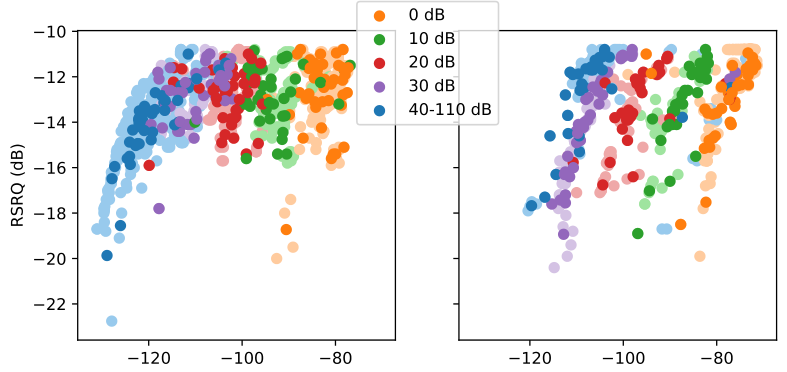

\pagestyle{fancy}
\fancyfoot[CE,CO]{Page \thepage \hspace{1pt} of \pageref{LastPage}}

\newpage

# Design and Methodology {#design}

As stated in \S\ref{resobj}, the aim of this study is to compare user equipment (UE) against mobile network operators (MNOs) with a set of tests that evaluate NB-IoT's performance according to a set of metrics which highlight striking differences due to the underlying complexities of LTE architecture.

Four mobile network operators (MNOs) are compared in South Africa according to the underlying vendor
infrastructure used, namely Nokia and ZTE in the Cape/coastal regions and Ericsson and Huawei based in Gauteng/inland regions.

More than one UE is used to improve the accuracy of the result, namely Ublox and Quectel. A unit testing framework has been carefully prepared in Python in combination with a Hewlett Packard rotary RF attenuator in 10dBm steps. The results can be applied to multiple application use cases.

## Preliminary Tests

These tests better orient the reader to the behavior of UE devices and LTE network.

### Network Info and Behavior

This section looks at certain informative aspects and behavior of LTE networks.

#### System Information Blocks (SIB)

SIBs carry relevant information for the UE, which helps UE to access a cell, perform cell re-selection, information related to INTRA-frequency, INTER-frequency and INTER-RAT cell selections. In LTE there are 13 types of SIBs as can be seen in Table \ref{tbl:sib_descr}.

See Appendix \ref{appendix_sibs} for examples of NB-IoT SIB blocks.

* Downlink `systemInformationBlockType1`
* Downlink `systemInformation`
* Uplink `rrcConnectionRequest`
* Downlink `rrcConnectionSetup`

Table: System Information Blocks description {#tbl:sib_descr}

| SIB    | Description                                                  |
| ------ | ------------------------------------------------------------ |
| SIB-1  | Cell access related parameters and scheduling of other SIBs  |
| SIB-2  | Common and shared channel configuration, RACH related configuration are present |
| SIB-3  | Parameters required for intra-frequency, inter-frequency and I-RAT cell re-selections |
| SIB-4  | Information regarding INTRA-frequency neighboring cells (E-UTRA) |
| SIB-5  | Information regarding INTER-frequency neighboring cells (E-UTRA) |
| SIB-6  | Information for re-selection to INTER-RAT (UTRAN cells)      |
| SIB-7  | Information for re-selection to INTER-RAT (GERAN cells)      |
| SIB-8  | Information for re-selection to INTER-RAT (CDMA2000)         |
| SIB-9  | Information related to Home eNodeB (FEMTOCELL)               |
| SIB-10 | ETWS (Earthquake and Tsunami Warning System) information (Primary notification) |
| SIB-11 | ETWS (Earthquake and Tsunami Warning System) information (Secondary notification) |
| SIB-12 | Commercial Mobile Alert Service (CMAS) information.          |
| SIB-13 | Contains the information required to acquire the MBMS control information associated with one or more MBSFN areas. |

It is important to realize how intricate the underlying architecture of LTE is. For example, considering the singalling between UE and eNodeB using SIBs, we see this in action. This complexity hints that the probably cause of variation is due to the LTE network configuration.

#### Extended Coverage Level (ECL) {#pre_ECL}

Extended Coverage Levels increase the amount of repetitions between UE and eNodeB to increase range. Henceforth, this should mean that a weaker signal strength increases the ECL level. There are 3 levels, with level 0 being the least repetitions, and 2 being the most.

\begin{minipage}{\linewidth}
\begin{center}
\includegraphics[width=1.0\linewidth]{../../../masters/code/tests/plotterk/Signal_power_ECL_plot.pdf}
\captionof{figure}[ECL vs RSRP.]{ECL levels shown against RSRP for Ubloxa and Quectel on ZTE-MTN and Nokia-Vodacom networks.}
\label{fig:ecl_example}
\end{center}
\end{minipage}

In this Fig. \ref{fig:ecl_example}, ECL is shown as an example against two networks and it seems apparent that it is not determined by attenuation. Further investigation is necessary.

[](../../../masters/code/tests/plotterk/Signal_power_ECL_plot.png)

[](../../../masters/code/tests/plotterk/ECL_histogram.png)

#### Cell ID, EARFCN, PCI

These identifiers are related to the specific cell towers the UE is connected to.

The Cell ID is the physical network cell ID. EARFCN uniquely identifies the LTE band and carrier frequency. PCIs, or Physical Cell Identifiers provide a psuedo-unique value for identifying eNodeBs and is a unique identifier for serving cells. The PCI value is created from two components - PSS and SSS. The PSS, Primary Synchronization Signal, has the value 0, 1, or 2. The SSS, Secondary Synchronization Signal, can have a value between 0 and 167.

Table: PCI, Cell ID and EARFCN count as a result of registrations with LTE networks. Tuples are in (Ublox, Quectel) format. {#tbl:nw_parameters}

| PCI  | Cell ID   |      | ZTE-MTN  | Nokia-Vodacom |
| ---- | --------- | ---- | -------- | ------------- |
| 123  | 239882509 |      | (34, 26) |               |
| 14   | 2671716   |      | (13, 29) |               |
| 11   | 2672484   |      | (1, 4)   |               |
| 2    | 484196    |      |          | (34, 32)      |
|      |           |      |          |               |
|      | EARFCN    |      |          |               |
|      | 3712      |      | (48, 59) |               |
|      | 3564      |      |          | (34, 32)      |

In Table \ref{tbl:nw_parameters} we see three cell towers on the MTN-ZTE network. More than one tower at the same frequency or EARFCN proves that Intra-Frequency Cellular Reselection works as expected.

[](../../../masters/code/tests/plotterk/Signal_power_Cell_ID_plot.png)

[](../../../masters/code/tests/plotterk/Cell_ID_histogram.png)

[](../../../masters/code/tests/plotterk/Signal_power_PCI_plot.png)

[](../../../masters/code/tests/plotterk/PCI_histogram.png)

#### C-DRX mode

On the Vodafone network in connected-DRX (C-DRX) mode, the UE is observed to show peaks spaced at regular 2.048s intervals [@Martinez2019]. On both Vodacom and MTN networks, these peaks are not visible and instead a steady stream of peaks can be seen as on the following images.

\begin{figure}[ht]
  \subfloat[C-DRX timing on MTN-ZTE-Ublox]{
	\begin{minipage}[c][1\width]{
	   0.5\textwidth}
	   \centering
	   \includegraphics[width=1.0\linewidth]{../../code/tests/logs/zte_mtn/rf_shield/ublox/scope/12_8ms.jpg}
	\label{fig:cdrx1}
	\end{minipage}}
 \hfill 	
  \subfloat[C-DRX timing on MTN-ZTE-Quectel]{
	\begin{minipage}[c][1\width]{
	   0.5\textwidth}
	   \centering
	   \includegraphics[width=1.0\linewidth]{../../code/tests/logs/zte_mtn/rf_shield/quectel/scope/12ms.jpg}
	\label{fig:cdrx2}
	\end{minipage}}
\captionof{figure}[C-DRX timing measurement]{Timing measurement of two UEs on MTN-ZTE during C-DRX. Although the duty cycles vary in C-DRX mode, it can be estimated that pulses are roughly 12ms in length with 4ms idle between. This means that ~75\% of the time the UE device is drawing current.}
\end{figure}

[](../../code/tests/logs/zte_mtn/rf_shield/ublox/scope/12_8ms.jpg)

[](../../code/tests/logs/zte_mtn/rf_shield/quectel/scope/12ms.jpg)

[](../../code/tests/logs/zte_mtn/rf_shield/ublox/scope/73.6mA.jpg_110dB_slightly_open.jpg)

[](../../code/tests/logs/zte_mtn/rf_shield/ublox/scope/cdrx73_6mA_110dB.jpg)

[](../../code/tests/logs/zte_mtn/rf_shield/quectel/scope/70.4mA_ant_0dB.jpg)

In Fig. \ref{fig:cdrx1}, the Ublox UE uses 73.6mA at 110dB attenuation with the RF shield enclosure door slightly open and in Fig. \ref{fig:cdrx2}, with the same environment the Quectel UE uses 73.6mA. Observing C-DRX on the Nokia-Vodacom network, we have slightly different results as can be seen summarized in Table \ref{tbl:cdrx_vals}. It seems that on ZTE-MTN and Nokia-Vodacom that cycles are of length 16ms and 256ms respectively.

Table: C-DRX values {#tbl:cdrx_vals}

|               | MTN-ZTE | Nokia-Vodacom |
| ------------- | ------- | ------------- |
| **Ublox**     |         |               |
| Peak current  | 73.6 mA | 72 mA         |
| Transmit time | 12.8 ms | 56 ms         |
| Idle time     | 4 ms    | 200 ms        |
|               |         |               |
| **Quectel**   |         |               |
| Peak current  | 70.4 mA | 66.4 mA       |
| Transmit time | 12 ms   | 80 ms         |
| Idle time     | 4 ms    | 180 ms        |

[](../../code/tests/logs/nokia_vodacom/centurycity/ublox/cops/scope/cops_idle_56ms.jpg)

[](../../code/tests/logs/nokia_vodacom/centurycity/ublox/cops/scope/cops_tx_200ms.jpg)

[](../../code/tests/logs/nokia_vodacom/centurycity/ublox/cops/scope/cops_72mA.jpg)

[](../../code/tests/logs/nokia_vodacom/centurycity/quectel/cops/scope/cops_80ms_idle.jpg)

[](../../code/tests/logs/nokia_vodacom/centurycity/quectel/cops/scope/cops_66.4mA.jpg)

[](../../code/tests/logs/nokia_vodacom/centurycity/quectel/cops/scope/cops_180ms_tx.jpg)

On the MTN-ZTE network the peaks indicate an on time of roughly 12ms and idle of 4 seconds. With a cycle of 16ms, it fits the LTE requirements of between 10ms and 2560ms in terms of 1ms subframes. However, NB-IoT has a minimum requirement of 256ms to 9216ms for the interval length between C-DRX transmissions and Vodacom-Nokia is using this minimum value. MTN-ZTE is utilizing vastly more time on air than permitted by the 3GPP and it is having a detrimental effect on the estimated battery life. Vodacom-Nokia is using the minimum, but it is recommended to increase this value. Lastly, this does not bode well for the scaling up of devices due to the interference, especially on the shared uplink (NPUSCH) channel.

####  E-UTRAN Node B (eNB/eNodeB)

Ericsson eNodeBs run Linux and their commands are accessible via MOShell, or the scripting language AMOS.

To get an idea of the complexity of a node (eNodeB) in a base station (BTS), running `$ get .` in the terminal of B06009-TESTPLANT returned 7037 `Managed Objects` (MOs) with 27989 parameters. See Appendix \ref{appendix_eNB} for an example code snippet of the first two `Managed Objects`. This highlights how easy it is for a BTS to produce different results in this study depending on the network configuration and environment.

### Range Field Test

This gives a good idea as to the range expected according to RSRP, with more information in \S\ref{ping}.

#### NB-IoT

Using a Quectel BG96, the following tests were taken on the rooftop described in Fig. \ref{fig:rooftop}[^zte_tests].

{width=60%}

[^zte_tests]: The MTN-ZTE test dataset \S\ref{dataset} was captured inside the RF enclosure inside the HF RF lab.

The tests involve sending a set of 10 pings multiple times at a certain attenuation and resulting RSSI measurement using a Quectel BG96 modem.

[](C:\GIT\masters\thesis\images\rooftest1.png)

[](C:\GIT\masters\thesis\images\rooftest2.png)

\begin{figure}[ht]
  \subfloat[With an antenna and the attenuator set to 0dB, we find most of the values around the mean of 185.2ms, except for the tail at around 500ms which is the time of the first ping in a set of 10. ECL 0, RSRP -51 dBm.]{
	\begin{minipage}[c][1\width]{
	   0.48\textwidth}
	   \centering
	   \includegraphics[width=1.0\linewidth]{../images/rooftest1.png}
	\label{fig:ping1}
	\end{minipage}}
 \hfill 	
  \subfloat[Setting the attenuator to the max of 110dB, we see no change in the ping measurements which have a mean of 185.9ms. The tail has increased to a max of just over 600ms. ECL 0, RSRP -85 dBm.]{
	\begin{minipage}[c][1\width]{
	   0.48\textwidth}
	   \centering
	   \includegraphics[width=1.0\linewidth]{../images/rooftest2.png}
	\label{fig:ping2}
	\end{minipage}}
\vspace{1mm}
  \subfloat[Removing the antenna from the attenuator, we find that the data has a slightly thicker tail, and averages around 207.1ms. ECL 0, RSRP -91 dBm.]{
	\begin{minipage}[c][1\width]{
	   0.48\textwidth}
	   \centering
	   \includegraphics[width=1.0\linewidth]{../images/rooftest3.png}
	\label{fig:ping3}
	\end{minipage}}
 \hfill 	
  \subfloat[Lastly, having no attenuator nor antenna we still have a connection at -107dBm with a mean of 190.6ms. ECL 1, RSRP -107 dBm.]{
	\begin{minipage}[c][1\width]{
	   0.48\textwidth}
	   \centering
	   \includegraphics[width=1.0\linewidth]{../images/rooftest4.png}
	\label{fig:ping4}
	\end{minipage}}
\captionof{figure}[Ping tests]{Ping tests on Engineering rooftop}
\end{figure}

[](C:\GIT\masters\thesis\images\rooftest3.png)

[](C:\GIT\masters\thesis\images\rooftest4.png)

To be able to attenuate the signal until disconnection, one must increase the range from the base station such that leakage transmission from traces, soldering and attenuator connectors do not interfere with the test. As such, there must not be a connection to the base station at all if the antenna or attenuator is disconnected or connected at maximum attenuation.

\begin{figure}[ht]
  \subfloat[A test was performed from 10pm onwards at Technopark on 14 March 2019. A connection was made at a range of 4.8 km at -93dBm and an altitude of 132m. This is a relative elevation of -6m to the base station.]{
	\begin{minipage}[c][1\width]{
	   0.48\textwidth}
	   \centering
	   \includegraphics[width=1.0\linewidth]{../images/techno_map.PNG}
	\label{fig:map_techno}
	\end{minipage}}
 \hfill 	
  \subfloat[The greatest distance measured was 5.5km from the intersection of the R44 and the turn-off to Stellenbosch Square or Jamestown at an altitude of 106m. This is a relative elevation of -32m to the base station and at an RSRP of -89dBm.]{
	\begin{minipage}[c][1\width]{
	   0.48\textwidth}
	   \centering
	   \includegraphics[width=1.0\linewidth]{../images/jamestown_map.PNG}
	\label{fig:map_jamestown}
	\end{minipage}}
\captionof{figure}[Long-range tests map]{Long-range tests map}
\end{figure}

[](C:\GIT\masters\thesis\images\techno_map4.8km.JPG){width=50%}

\begin{figure}[ht]
  \subfloat[In Technopark, at 0dB attenuation the data has a mean of 196.7ms and a tail just above 500ms in ECL 0, RSRP -93 dBm.]{
	\begin{minipage}[c][1\width]{
	   0.48\textwidth}
	   \centering
	   \includegraphics[width=1.0\linewidth]{../images/techno1.png}
	\label{fig:ping5}
	\end{minipage}}
 \hfill 	
  \subfloat[In Technopark, at 10dB the data is more spread out from 200 - 500ms with a mean of 396.4ms and a tail at just under 1000ms in ECL 1, RSRP -101 dBm.]{
	\begin{minipage}[c][1\width]{
	   0.48\textwidth}
	   \centering
	   \includegraphics[width=1.0\linewidth]{../images/techno2.png}
	\label{fig:ping6}
	\end{minipage}}
\captionof{figure}[Long-range ping tests]{Long-range ping tests}
\end{figure}


[](C:\GIT\masters\thesis\images\techno1.png)

[](C:\GIT\masters\thesis\images\techno2.png)

\begin{figure}[ht]
  \subfloat[In Technopark, at 20dB attenuation, the data is more spread across 350 - 1000ms with a mean of 793.4ms and a tail that extends to over 4500ms in ECL 2, RSRP -107 dBm. Any more attenuation and the signal is lost.]{
	\begin{minipage}[c][1\width]{
	   0.48\textwidth}
	   \centering
	   \includegraphics[width=1.0\linewidth]{../images/techno3.png}
	\label{fig:ping7}
	\end{minipage}}
 \hfill 	
  \subfloat[At the furthest point in Fig. \ref{fig:map_jamestown}, the signal strength increased to -89dBm and resumed a mean of around 209.6ms with a tail around 500ms. ECL 0]{
	\begin{minipage}[c][1\width]{
	   0.48\textwidth}
	   \centering
	   \includegraphics[width=1.0\linewidth]{../images/stelliesquare.png}
	\label{fig:ping8}
	\end{minipage}}
\captionof{figure}[Long-range ping tests]{Long-range ping tests}
\end{figure}

[](C:\GIT\masters\thesis\images\techno3.png)

[](C:\GIT\masters\thesis\images\jamestownmap.JPG)

[](C:\GIT\masters\thesis\images\stelliesquare.png)

\begin{figure}[ht]
  \subfloat[A similar pattern was seen 3.0 km away at Parmalat, although driving closer there were a few spots where connection was lost or many retries were needed such that the tail extended up to almost 3000ms for the ICMP ping time.]{
	\begin{minipage}[c][1\width]{
	   0.48\textwidth}
	   \centering
	   \includegraphics[width=1.0\linewidth]{../images/parmalat.png}
	\label{fig:ping9}
	\end{minipage}}
 \hfill 	
  \subfloat[Lastly, all the test data (including on the way to Technopark and back), we see a similar form except with a tail extending to almost 10 seconds, which is within 3GPP specifications.]{
	\begin{minipage}[c][1\width]{
	   0.48\textwidth}
	   \centering
	   \includegraphics[width=1.0\linewidth]{../images/alltests2.png}
	\label{fig:ping10}
	\end{minipage}}
\captionof{figure}[Long-range ping tests]{Long-range ping tests}
\end{figure}

[](C:\GIT\masters\thesis\images\parmalat.png)

[](C:\GIT\masters\thesis\images\alltests2.png)

{width=50%}

This means that in an urban area, NB-IoT satisfies the 2-5 km range specification.

#### Dash7

Since Dash7 was a curiosity at the time, a Dash7 field test was performed using a Murata CMWX1ZZABZ-091, but due to 10dBm transmit power it limited range to about 300m.

{width=65%}

Although Dash7 is considered a viable alternative, it fell short on range expectations.

Haystack Technologies has developed a Dash7-over-LoRa implementation that expects ranges of over a few kilometers and can be considered in future research.

### RF Spectrum Tests

Using an RTL2832 SDR dongle, we can capture RF signals. At the very least we can visualise how the signal propogates through the airspace.


{width=30%}

Each technology has their own modulation scheme and unique features, and with that their own set of advantages and disadvantages. More can be found in \S\ref{lpwans}.

### Terrestrial Localization

Localization can be useful for asset tracking as discussed in \S\ref{asset_tracking}. Of the prominent LPWANs, SigFox is the only one that offers a simple localization service. NB-IoT will offer one when upgraded to 3GPP Release 14. Unfortunately SigFox has poor accuracy as can be seen in Fig. \ref{fig:sigfox_map}.

{width=80%}

### Power Saving Mechanisms

This section shows a brief investigation into the power saving mechanisms of NB-IoT as mentioned in \S\ref{power-saving-mechanisms}.

With a paging time window interval of 2.54s and 4 hyper-frames making up 40.96s, the following output is obtained.

```c
AT+NPTWEDRXS=2,5,"0001","0011"
+CEREG: 5,1,"8CA7","28C464",7,,,"00011000","00101010"
```

AT+CEREG says that the T3324 active time is 48 seconds, or 2 seconds * 24 binary coded timer value. This is not the expected outcome, even according to "Table 10.5.5.32/3GPP TS 24.008: Extended DRX parameters informatio" as referenced in Ublox documentation, which expects 40.96s. Besides, the paging time interval is also not working as expected as in Figure \ref{fig:edrx1}.

\begin{figure}[ht]
  \subfloat[Initial attempt at setting eDRX mode failed.]{
	\begin{minipage}[c][0.7\width]{
	   0.48\textwidth}
	   \centering
	   \includegraphics[width=1.0\linewidth]{../images/image-20191120231120824.png}
	\label{fig:edrx1}
	\end{minipage}}
 \hfill 	
  \subfloat[Successful attempt at setting eDRX mode.]{
	\begin{minipage}[c][0.7\width]{
	   0.48\textwidth}
	   \centering
	   \includegraphics[width=1.0\linewidth]{../images/image-20191120231245349.png}
	\label{fig:edrx2}
	\end{minipage}}
\captionof{figure}{eDRX tests}
\end{figure}

[](../images/image-20191120231120824.png)

[](C:\Users\d7rob\AppData\Roaming\Typora\typora-user-images\1555567465123.png){width=50%}

[](C:\Users\d7rob\AppData\Roaming\Typora\typora-user-images\1555570254042.png){width=50%}

The T3324 active timer value is then modified to 5.12s as in Figure \ref{fig:edrx2}.

```c
AT+NPTWEDRXS=2,5,"0001","0000"
```

AT+CEREG says that the timer is 32s, or 2 seconds * 16 binary coded timer value.

```c
+CEREG: 5,1,"8CA7","28C465",7,,,"00010000","00101010"
```

In the debug logs we see the timer expires after exactly 30 seconds.

```c
1400,00:07.952393,NAS_DBG_TIMER
	action=TIMER_START
	prim_id=USIM_STATUS_TIMER_EXPIRY
	duration=30
2092,00:37.952728,USIM_STATUS_TIMER_EXPIRY
	timer_handle=16871576
```

[](../images/image-20191120231245349.png)

[](C:\Users\d7rob\AppData\Roaming\Typora\typora-user-images\1555568148322.png){width=50%}

[](C:\Users\d7rob\AppData\Roaming\Typora\typora-user-images\1555569320664.png){width=50%}

Increasing the T3324 active timer value to 10.24s, the following results are obtained. It is exactly the same as before.

```c
AT+NPTWEDRXS=2,5,"0001","0001"
```

AT+CEREG says that the timer is 32s, or 2 seconds * 16 binary coded timer value.

```c
+CEREG: 5,1,"8CA7","28C465",7,,,"00010000","00101010"
```

In the debug logs we see the timer expires after exactly 32 seconds.

```c
2409,+00:00.400757,NAS_DBG_TIMER
	action=TIMER_START
	prim_id=USIM_STATUS_TIMER_EXPIRY
	duration=30
5981,+00:33.283905,USIM_STATUS_TIMER_EXPIRY
	timer_handle=16871576
```

[](C:\Users\d7rob\AppData\Roaming\Typora\typora-user-images\1555569718434.png){width=50%}


It is important to note that if eDRX time is not configured properly, then the outcome does not show as expected as in Fig. \ref{fig:irregular_edrx}.

{width=65%}

Finally, an eDRX event has a typical current profile as shown in Fig. \ref{fig:edrx_pattern}. This shows how for the first few microseconds there is a large current spike.

The debug trace, every 2.56 seconds for ZTE-MTN, shows the following information. Besides logs showing time synchronization and other network information, the serving cell logs show signal strength metrics.

```c
102332,03:20.082306,LL1_EXIT_LOW_POWER_MODE
102334,03:20.082367,LL1_LOG_FAST_FORWARD_TIME_CALC
102360,03:20.165100,LL1_RESYNC
102362,03:20.165222,LL1_TIMING_ADJUST_LPM_WAKEUP
102364,03:20.165344,LL1_LOG_CURRENT_TIME_CALC
102370,03:20.205993,PROTO_LL1_SERVING_CELL_MEASUREMENT_IND
102372,03:20.206054,LL1_NRS_MEASUREMENT_LOG
102377,03:20.206573,LL1_LOG_CURRENT_TIME_CALC
102378,03:20.206665,LL1_CALC_PAGING_DATA
102381,03:20.207062,LL1_KV_CACHE_FLUSH
102382,03:20.207123,LL1_ENTER_LOW_POWER_MODE
102384,03:20.207336,LL1_SERVING_CELL_MEAS_IND
102385,03:20.207458,RRC_DBG_RESELECTION_MEASUREMENTS
```

*Todo: add Debug trace of PTAU*

### Ultra-low Current Sleep Measurements

During deep sleep, UE devices typically use only a couple of microamps.

Using an MX 58HD DMM, one can measure the microamp sleep currents of UE devices. Testing the accuracy of the DMM, 4.501 mA is measured through a 4615 ohm resistor at 21.15V. Theoretically it should be 4.582 mA so that gives an error tolerance of 1.82% or ~2%.

*Todo: measure sleep current of UE devices*

### Mobility Tests

The Sierra Wireless 7702 has a Qualcomm 9206 modem which supports LTE Cat M1, NB1 and EC-GSM.

Using a Sierra Wireless WP7702 on Ericsson Test BTS 'L06009A3' and EARFCN 3734/3752, the UE had to periodically ping an internet-facing server and the dead time was measured before it reconnected and received a response. The RSRP was in the range -50 to -80 dBm and in ECL 0.

The tests took place within a faraday cage to isolate the test network from the live RAN, else by opening the door of the faraday cage it deregistered from the network and MME.

Table: NB-IoT and LTE Cat-M handover. {#tbl:mobility}

| Mobility test         | Time   |
| --------------------- | ------ |
| Standalone to In-band | ~ 11 s |
| In-band to Standalone | ~ 11 s |

### Throughput

NB-IoT downloading was tested on the Sierra Wireless 7702 using the following script.

```bash
while [ 1 ]; do	
    # wget --retry-connrefused --waitretry=1 
    # 	--read-timeout=20 --timeout=15 -t 0 --continue
    wget -t 0 -c http://speedtest.ftp.otenet.gr/files/test100k.db
    # check return value, break if not successful (0)
    if [ $? != 0 ]; then break; fi;
    sleep 1s;
done;
```

A 100 kb file is downloaded at a rate of around 3kB/s. The script continues download if stalled or other errors occur. Since it is a `Yocto` installation[^yocto], the other `wget` arguments were not available.

[^yocto]: It's not an embedded solution. Rather, it creates a custom one for you, regardless of hardware architecture [@yocto1].

|        | Uplink         | Downlink       |
| ------ | -------------- | -------------- |
| GPRS   | 158 kbps       | 254 kbps       |
| NB-IoT | 56 / 65 kbps   | 24 / 27 kbps   |
| LTE-M1 | 293 / 375 kbps | 264 / 300 kbps |


## Example Application

An example application was built to test and understand NB-IoT. See schematic and board layout in Appendix \ref{appendix_SCH_BRD}. The board includes not just NB-IoT but also LTE Cat-M, GPRS/EDGE, SigFox, LoRa, and Dash7. Initally designed to compare LPWANs, it was decided to focus more purely on NB-IoT as there is a great deal of variance among UEs and LTE vendors already.

Notable components include:

* Quectel BG96 cellular modem
* Murata CMWX1ZZABZ-078 which includes STM32L072CZ microcontroller and SX1276 transceiver 
* Atmel SAMD21G18a microcontroller
* Microchip MIC29302WU 3A LDO Regulator @3.8V

[](../images/image-20191105153024907.png){width=75%}

 {width=75%} 

By adding a DHT22 temperature and humidity sensor, button and buzzer for and example application, we see the following dashboard result in Fig. \ref{fig:dashboard_thingsboard}.

{width=65%}

Luckily UE manufacturers usually provide a development kit with open source schemetics and board layouts. This study will use development kits so that tests are easily reproduceable.

## Setup Procedure

Each field test will make use of various UE hardware and telemetry tests and this section outlines the steps taken to perform these field tests.

### Hardware

This section outlines some of the hardware configurations required for field test captures.

#### Attenuator

Two of these will be used in series: the HP8494B and the HP8496A. One has a range of 11dB in 1dB steps, and the other has a range of 110dB in 10dB steps, so it is possible to get a full range of 110dB in 1dB steps.

 

The 1 dB attenuator is useful to attenuate the signal strength until the RSRP is on a decade multiple of 10. This way variation around the decade is more visible. 

#### Current Measurements {#current_measurements}

By measuring current, the field tests can measure the energy usage of each datagram packet.

{width=65%}


The digital multimeter in Fig. \ref{fig:current_setup} is replaced with a ZXCT1008 high-side current monitor in series with the modem. 

{width=25%}

Rs is set to a 1 ohm resistor and Rg is set as a 1k ohm resistor such that 100mA supplied to the modem makes 1V.

$$V_{out} = I_{load} [mA] * 10 [\frac{V}{mA}]$$ {#eq:iload_vout}


#### Energy Capture Device {#energy_capture_device}

The energy capture device measures the energy of each packet, and also returns the duration timings of each datagram packet for latency measurements.

`PlatformIO` compiles code for the microcontroller, and in this case it is a simple Atmel ATmega328P 8-bit microcontroller.

Code can be found on [https://github.com/daniel-leonard-robinson/masters/tree/master/code/edge/src](https://github.com/daniel-leonard-robinson/masters/tree/master/code/edge/src). It connects to the ZXCT1008 mentioned in \S\ref{current_measurements} and converts the results to energy measurements. It also returns via serial to the PyTest framework the timings of each datagram packet.

```c
void energyLoop(boolean pause) {
    uint8_t reading = analogRead(A0);
    if (reading > 60) {
        if (reading > maxReading) maxReading = reading;
        if (!readCount++) {
            tStart = millis();
            idleTime = tStart - tEnd;
        }
        tEnd = millis();
        zeroM = tEnd;
        zeroCounter = 0;
        sum += reading;
        tStepCount += micros() - tStep;
    }
    else if (pause) zeroM = millis();
    else if (millis() - zeroM < 1000);
    else if (readCount) {
        txTime = tEnd - tStart;
        tStepCount /= 1000;
        energy = sum * 500 / 1023.0 * tStepCount / 1000 / 1000;
        
        buf.flush(); tx[0] = '\0'; // energyFlush();
        buf.print(idleTime); buf.print(",");
        buf.print(txTime); buf.print(",");
        buf.print(tStepCount); buf.print(",");
        buf.print(energy); buf.print(",");
        buf.println(maxReading/2);
        Serial.print(buf); // energyPrint();
        
        sum=idleTime=txTime=readCount=maxReading=energy=tStepCount= 0; // energySetup();
    }
    tStep = micros();
}
```

### Network Registration

As mentioned in \S\ref{connectivity}, the right SIM cards are necessary. It may even be possible to use e-SIMs as in Fig. \ref{fig:hologram_esim}.

{width=40%}

Finally, the right APNs are necessary. To use MTN's test network, the APN `rflab` is used. On Vodacom's network, the APN `nbiot.vodacom.za` is used.

### PyTest Framework

PyTest is a unit testing framework used to setup the UE for each test using AT commands and can be found on  [https://github.com/daniel-leonard-robinson/masters/tree/master/code/tests](https://github.com/daniel-leonard-robinson/masters/tree/master/code/tests). Although the testing framework is quite extensive, a few snippets of code will be discussed in this section to at least give an idea to the reader how this was developed.


Every test fixture includes the following setup and teardown code to open a serial connection to the UE. It automatically detects the COM port based on the USB vid.

```python
def serialOpen():
    # setup for each test fixture
    global serAT, serTIM, serGPS, AT_PORT, uC_PORT
    ATcount = 0
    ports = serial.tools.list_ports.comports()
    for port, desc, hwid in sorted(ports):
        vid_pid = hwid.split('=')[1].split()[0]
        if vid_pid == '2341:8036':
            uC_PORT = port
        if vid_pid == '0403:6010' and not ATcount:
            AT_PORT = port
            ATcount += 1
            pytest.vendor = 'ublox'
        if vid_pid == '04E2:1414' and ATcount < 3:
            AT_PORT = port
            ATcount += 1
            pytest.vendor = 'quectel'
        if vid_pid == '0403:6001':
            AT_PORT = port
            pytest.vendor = 'simcom'
    try:
        serAT = serial.Serial(AT_PORT, 115200, timeout=1)
        serTIM = serial.Serial(uC_PORT, 115200, timeout=1)
        serGPS = serial.Serial(GPS_PORT, 9600, timeout=1)
    except serial.serialutil.SerialException as e:
        print(e)

def serialClose():
    # tear down for each test fixture
    global serAT, serTIM, serGPS
    serAT.close()
    serTIM.close()
    serGPS.close()
```

The setup and teardown functions are defined in a global file that is imported into each file of test fixtures. The location for new data in the database depends on chosen manufacturer (LTE vendor), location, file description and connected UE. The file description is the current RF attenuation and ranges from 0 to 110.

```python
def setup_module(module):
    serialOpen()
    pytest.manufacturer = 'huawei' # 'ericsson', 'nokia', 'zte'
    pytest.loc = 'mtn/testplant_14th/'
    pytest.descr = '110'
    # pytest.lock = threading.Lock()
 
def teardown_module(module):
    serialClose()
```

See Appendix \ref{appendix_pytest} to see how a Quectel or Ublox modem is set up. Running the following commands in Table \ref{tbl:pytest_setup} will set the device up.

Table: PyTest setup commands to be run in terminal {#tbl:pytest_setup}

|                      |                             |
| -------------------- | --------------------------- |
| `pytest -svm apn`    | Runs set APN fixture        |
| `pytest -svm setup`  | Runs all the setup fixtures |
| `pytest -svm reboot` | Reboots device if necessary |

The following commands are wrappers for sending and receiving AT commands:

```python
def OK(cmd, t=0):
    reply = sendAT(cmd, t)
    assert 'OK' in reply
    return reply

def expect(cmd, reply, t=1, output=True):
    replies = reply
    if str(type(reply)) == "<class 'str'>":
        replies = [reply]
    data = sendAT(cmd, t, replies, output)
    if not len(replies[0]):
        return data
    check = False
    for r in replies:
        if len(r):
            if True in [r in i for i in data]:
                check = True
                break
    if not check:
        print(magenta + str(replies), data)
    assert check
    return data

def sendAT(cmd, t=0, expect=['OK'], output=True):
    if output:
        print(yellow + cmd)
    serAT.write(bytes(cmd + '\r', 'utf-8'))
    return receiveAT(t, expect, output)

def receiveAT(t=0, expect=['OK'], output=True):
    if str(type(expect)) == "<class 'str'>":
        expect = [expect]
    c = 0
    data = []
    exp = expect[:]
    exp.append('ERROR')
    exp.append('FAILED')
    while True:
        d = serAT.readline().decode('utf-8')
        if not len(d):
            c += 1
        d = d.strip()
        if len(d) > 0:
            if output:
                print(cyan + d)
            out = converter(d)
            if out:
                print(magenta + out)
            data.append(d)
        if t > 0:
            if c >= t:
                data.append('timeout')
                return data
        for e in exp:
            if e in d:
                return data
```

Finally, the testing framework has a `capture` command which is blocking until an energy capture event. In this event the energy is sent via serial from the energy capture device (\S\ref{energy_capture_device}) and triggers the testing framework to extract information from the `AT+NUESTATS="RADIO"` command.

```python
def receiveTIM():
    data = {}
    serTIM.flush()
    d = serTIM.readline().decode('utf-8') # d = '2300,260,2560,10.0,100,'
    if len(d):
        try:
            d = d.strip() # print(magenta + d)
            data['idleTime'] = int(d.split(',')[0])
            data['txTime'] = int(d.split(',')[1])
            data['totalTime'] = int(d.split(',')[2])
            data['energy'] = float(d.split(',')[3])
            data['maxCurrent'] = float(d.split(',')[4])
        except (ValueError, IndexError) as e:
            print(red + d)
            raise e
    return data
```

### Telemetry Tests

Telemetry tests measure various aspects of the required metrics. Running the following commands in Table \ref{tbl:pytest_run} will run through the desired telemetry test.

Table: PyTest telemetry test commands to be run in terminal {#tbl:pytest_run}

|                     |                                     |
| ------------------- | ----------------------------------- |
| pytest -svm release | UDP test for multiple payload sizes |
| pytest -svk ptau    | Run PTAU test                       |
| pytest -svk drx     | Run eDRX test                       |
| pytest -svm reg     | Run COPS test                       |
| pytest -svk echo    | Runs echo test                      |


#### UDP {#udp}

UDP is used primarily for establishing low-latency and loss-tolerating connections between applications on the internet.

To test the capability of sending to the internet for multiple UEs, a simple protocol is necessary. TCP, MQTT, CoAP and other protocols are all based on the same IP infrastructure that UDP uses, yet not all UEs have this capability. UDP will be used and other protocols can be tested against it.

This test sends a UDP packet to an internet accessible IP address. The IP is 1.1.1.1 and it belongs to Warp which claims to be the fastest DNS resolver in the world, with OpenDNS, Google and Verisign taking the next respective rankings.

As an alternative, data can be sent to the u-blox echo server at echo.u-blox.com. Because there is no DNS lookup function in the SARA-N2 module series, the server IP address that must be used is 195.34.89.241.

UDP datagrams are sent with payloads of size 1, 16, 64, 128, 256 and 512 bytes.

Here is a snippet of one of the test fixtures for Ublox sending a 16 byte UDP payload with Release Assistance flags set.

```python
@pytest.fixture(autouse=True)
def _config(request):
    pytest.test = 'release/'

...
@pytest.mark.release
def test_release_release16(request):
    pytest.subtest = request.node.name.split('_')[-1] + '/'
    if pytest.vendor == 'ublox':
        expect('at+nsocl=0', '')
        receiveAT(1)
        for i in range(5):
            OK('AT+NSOCR="DGRAM",17,14000,1')
            expect('AT+NSOSTF=0,"1.1.1.1",7,0x200,16,"FFFFFFFFFFFFFFFFFFFFFFFFFFFFFFFF"',
                   '+CSCON: 0', 300)
            OK('at+nsocl=0')
            capture(1)
    ...
```

#### Periodic Tracking Area Update (PTAU)

This snippet sets up the eNodeB to schedule a PTAU event every 4 seconds (roughly ~5.5 seconds actual).

```python
...
@pytest.fixture(autouse=True)
def _config(request):
    pytest.test = 'ptau/'

def test_ptau_set(request):
    pytest.subtest = request.node.name.split('_')[-1] + '/'
    setEDRX(4, 1, 0, 0, 3, 2) # 5.5 sec ptau
    capture(1)

def test_ptau_capture(request):
    pytest.subtest = request.node.name.split('_')[-1] + '/'
    capture(10)
```

#### Extended Discrete Reception (eDRX)

This snippet sets up the eNodeB to schedule a DRX event every 2.56 seconds.

```python
...
@pytest.fixture(autouse=True)
def _config(request):
    pytest.test = 'drx/'

def test_drx_set(request):
    pytest.subtest = request.node.name.split('_')[-1] + '/'
    setEDRX(4, 1, 2, 5, 6, 2) # 2.56 continuous
    capture(1)

def test_drx_cap(request):
    pytest.subtest = request.node.name.split('_')[-1] + '/'
    capture(10000)
```

#### Cellular Operator Selection (COPS)

Network Registration is necessary when the device is not yet connected. In Figure \ref{fig:lengthy_inactive}, An initial test was performed with AT+COPS=0 network registration until T3412 timeout of 270 seconds and peak current approximately 70mA.

[](C:\GIT\masters\thesis\images\active_time.JPG)


{width=50%}

This snippet registers the UE device on the network and as a workaround to shorten a long C-DRX inactivity timer of 10, 20 seconds or more (even up to ~265 seconds) it sends a UDP packet with a flag which tells the eNodeB that it would like to release the connection immediately, hence Release Assistance as mentioned in \S\ref{release_a}.

```python
...
@pytest.fixture(autouse=True)
def _config(request):
    pytest.test = 'cops/'

############## reg release ##############
@pytest.mark.reg
def test_cops_register2(request):
    pytest.subtest = request.node.name.split('_')[-1] + '/'
    flushTIM()
    expect('AT+CFUN=1', 'OK', 3)
    expect('AT+COPS=0', ['+CEREG: 1', '+CSCON: 0', '+CEREG:1', '+CSCON:0'], 300)

@pytest.mark.reg
def test_cops_release(request):
    pytest.subtest = request.node.name.split('_')[-1] + '/'
    fetchTIM()
    if pytest.vendor == 'ublox':
        expect('at+nsocl=0', '')
        receiveAT(1)
        OK('AT+NSOCR="DGRAM",17,14000,1')
        receiveAT(1)
        expect('AT+NSOSTF=0,"1.1.1.1",7,0x200,1,"FF"', '+CSCON: 0', 100)
        OK('at+nsocl=0')
    elif pytest.vendor == 'quectel':
        ...
        ...
    receiveAT(1)
    receiveAT(1)
    fetchTIM()
    capture(1, 3)

############## dereg release ##############
@pytest.mark.reg
def test_cops_deregister(request):
    pytest.subtest = request.node.name.split('_')[-1] + '/'
    OK('AT+COPS=2', 5)
    receiveAT(300, ['+NPSMR:'])
    flushTIM()
    capture(1, 20)
...
```

#### Echo

This test is designed to measure client and server initiated echo requests.

[](../../code/tests/logs/huawei_vodacom/quellerina/ublox/echo/3.bmp)

{width=50%}

The following snippet shows how the framework sends to a custom echo server which responds immediately and then the echo server responds again after a ten second delay.

```python
...
def test_echo_send(request):
    pytest.subtest = request.node.name.split('_')[-1] + ('512/' if big else '/')
    if pytest.vendor == 'ublox':
        expect('at+nsocl=0', '')
        receiveAT(1)
        OK('AT+NSOCR="DGRAM",17,4444')
        if big:
            expect('AT+NSOSTF=0,"34.74.25.60",5555,0x400,512,"33333333333333333333...
                   ... ... ... 3333333333333333333 ... ... ...
                   ...3333333"', '+NSONMI: 0', 300)
        else:
            expect('AT+NSOSTF=0,"34.74.25.60",5555,0x400,3,"313232"', '+NSONMI: 0', 300)
        receiveAT(1, '+CSCON: ')
        OK('AT+NSORF=0,512', 3)
    ...
    capture(1, 8)
...
```

The custom echo server has a static IP (34.74.25.60) and is open on port 5555.


```python
...
def receive_next(sock):
    "Repeatedly tries receiving on the given socket until some data comes in."
    logger.debug("Waiting to receive data...")
    while True:
        try:
            BUFFER_SIZE = 4096 # the buffer for receiving incoming messages
            return sock.recvfrom(BUFFER_SIZE)
        except socket.timeout:
            logger.debug("No data received yet: retrying.")
            pass

def receive_and_send_one(sock):
    "Waits for a single datagram over the socket and echoes it back."
    input_data, addr = receive_next(sock)
    message = input_data.decode()
    output_len = sock.sendto(input_data, addr)
    sleep(10) # 10 second delay before echoing back again
    output_len = sock.sendto(input_data, addr)

def start(args):
    "Runs the server."
    sock = socket.socket(socket.AF_INET, socket.SOCK_DGRAM)
    sock.settimeout(5) # seconds
    sock.bind((args.host, args.port))
    logger.info("Listening on %s:%s.", args.host, args.port)
    try:
        for i in itertools.count(1):
            receive_and_send_one(sock)
    ...
```

#### Ping {#ping}

The +NPING AT command can be issued to check if the module is able to send and receive data via the internet, or an internal network location.
To ping Google’s DNS server:
AT+NPING="8.8.8.8"

The information text response to the +NPING AT command will be issued after a few seconds. If the
information text response is +NPINGERR: 1, the ping has timed out (usually within 10 seconds). The first ping might fail because it can take a few seconds to connect to the base station. Use
the +CSCON URC to show when the module is connected.

Whilst the simple `Ping` command is useful to measure connectivity and latency, it unfortunately has no way to release the inactivity timer by itself, which means the modem continues to consume current in receive-mode/C-DRX. That is why the `Echo` telemetry test was designed.

## Primary Metrics

Primary metrics power efficiency and latency are investigated as mentioned in \S\ref{proj_descr}. Primary and secondary metrics have a few preliminary tests performed using Ublox and Quectel devices on MTN-ZTE and Vodacom-Nokia networks.

### Power Efficiency

Power efficiency is one of the main metrics focused on in this study. This section outlines a few preliminary tests and the design for the final field tests comparing UEs and MNOs. Low power consumption is vital for battery longevity up to ~10 years or more. Power consumption is affect by various factors. In the hardware design, PCB layout, antenna matching and location will have an effect on the overall interference received by the module, SINR and ultimately transmit power. Transmit power also depends on the range and path loss to the UE device. With a weak signal, more repetitions are required, hence ECLs in \S\\ref{ECLs}. Other power saving mechanisms such as release assistance, PSM and eDRX mode work together to extend battery life as in \S\\ref{power-saving-mechanisms}.

![Ublox (blue) and Quectel (red) energy (J) per datagram as a function of the SINR (dB) as reported by the UE on the MTN-ZTE network limited to 1500 mJ. With the fading colour scheme and range just as in Martinez [@Martinez2019], Fig. \ref{fig:energy_sinr1400} shows the impact of SNR on energy consumption. As observed in the figure, there is a trend of increasing energy with respect to lower SNR levels and high variability. Unfortunately, the effect of different ECLs is unclear. \label{fig:energy_sinr1400}](../images/1571781182963.png){width=65%}


{width=65%}


[](../images/1571785381395.png)

[](../../code/tests/datagrams/mtn_ublox_energy.png)

[](../../code/tests/datagrams/quectel_sizes.png){width=65%}

\begin{figure}[ht]
  \subfloat[Datagram sizes of MTN-Ublox pair up to 1500 mJ.]{
	\begin{minipage}[c][0.65\width]{
	   0.48\textwidth}
	   \centering
	   \includegraphics[width=1.0\linewidth]{../../code/tests/datagrams/mtn_ublox_energy.pdf}
	\label{fig:udpsize1}
	\end{minipage}}
 \hfill 	
  \subfloat[Datagram sizes of MTN-Quectel pair up to 10 J]{
	\begin{minipage}[c][0.65\width]{
	   0.48\textwidth}
	   \centering
	   \includegraphics[width=1.0\linewidth]{../../code/tests/datagrams/quectel_sizes.png}
	\label{fig:udpsize2}
	\end{minipage}}
\captionof{figure}[UDP Datagram energy-sizes]{UDP Datagram energy for different datagram packet sizes. Note the steady increase in energy consumption on the baseline, and the high variation. Although there is a slight trend in Fig. \ref{fig:udpsize}, it is not significant compared to the total variation for each datagram packet size.}
\label{fig:udpsize}
\end{figure}

[](../images/1568090120083.png){width=45%}

[](../images/1568090147760.png){width=50%}

\begin{figure}[ht]
  \subfloat[MTN-ZTE Ublox]{
	\begin{minipage}[c][0.4\width]{
	   0.48\textwidth}
	   \centering
	   \includegraphics[width=0.85\linewidth]{../images/1568090120083.png}
	\end{minipage}}
\hfill 	
  \subfloat[MTN-ZTE Quectel]{
	\begin{minipage}[c][0.4\width]{
	   0.48\textwidth}
	   \centering
	   \includegraphics[width=0.85\linewidth]{../images/1568090147760.png}
	\end{minipage}}
\vspace{1mm}
  \subfloat[Vodacom-Nokia Ublox]{
	\begin{minipage}[c][0.4\width]{
	   0.48\textwidth}
	   \centering
	   \includegraphics[width=0.85\linewidth]{../images/1568090173885.png}
	\end{minipage}}
\hfill 	
  \subfloat[Vodacom-Nokia Quectel]{
	\begin{minipage}[c][0.4\width]{
	   0.48\textwidth}
	   \centering
	   \includegraphics[width=0.85\linewidth]{../images/1568090209468.png}
	\end{minipage}}
\captionof{figure}[eDRX Energy histogram]{eDRX histograms of the energy produced by listening for paging occassions with respect to RF attenuation in dBm as mentioned in \S\ref{lit_edrx_ptw}. Martinez {[}\protect\hyperlink{ref-Martinez2019}{3}{]} measured values under 10mJ for both Ublox and Quectel, yet on the MTN-ZTE and Vodacom-Nokia networks it is up to 5 times more. Thus, it is apparent that network configuration is the cause of these differences.}
\end{figure}

[](../images/1568090173885.png){width=65%}

[](../images/1568090209468.png){width=65%}

[](../images/1568089886942.png){width=65%}

[](../images/1568089931848.png){width=65%}

\begin{figure}[ht]
  \subfloat[MTN-ZTE Ublox (mJ)]{
	\begin{minipage}[c][0.4\width]{
	   0.48\textwidth}
	   \centering
	   \includegraphics[width=0.85\linewidth]{../images/1568089886942.png}
	\end{minipage}}
\hfill 	
  \subfloat[MTN-ZTE Quectel (mJ)]{
	\begin{minipage}[c][0.4\width]{
	   0.48\textwidth}
	   \centering
	   \includegraphics[width=0.85\linewidth]{../images/1568089931848.png}
	\end{minipage}}
\vspace{1mm}
  \subfloat[Vodacom-Nokia Ublox (J)]{
	\begin{minipage}[c][0.4\width]{
	   0.48\textwidth}
	   \centering
	   \includegraphics[width=0.85\linewidth]{../images/1568090001158.png}
	\end{minipage}}
\hfill 	
  \subfloat[Vodacom-Nokia Quectel (J)]{
	\begin{minipage}[c][0.4\width]{
	   0.48\textwidth}
	   \centering
	   \includegraphics[width=0.85\linewidth]{../images/1568090070185.png}
	\end{minipage}}
\captionof{figure}[PTAU Energy]{PTAU histograms of the energy produced when periodically updating UE devices and networks with tracking area IDs as mentioned in \S\ref{lit_ptau}. PTAU uses about 20-100 times more power than eDRX for MTE-ZTE and up to 4000 times more energy on Vodacom-Nokia. Frequent PTAU updates should definitely be taken into consideration.}
\end{figure}

[](../images/1568090001158.png){width=65%}

[](../images/1568090070185.png){width=65%}

[](../../../masters/code/tests/plotterk/Signal_power_maxCurrent_plot.png)

\begin{minipage}{\linewidth}
\begin{center}
\includegraphics[width=1.0\linewidth]{../../../masters/code/tests/plotterk/maxCurrent_histogram.pdf}
\captionof{figure}[Histogram showing peak current corresponding to datagram packets]{Peak energy measurements from roughly 70mA and skewed towards 128mA. These high peak energies shouldn't affect the average power much as peak current occurs only during the first few microseconds of the random access preamble (PRACH).}
\label{fig:}
\end{center}
\end{minipage}

[](../../../masters/code/tests/plotterk/maxCurrent_histogram.png)

### Latency and Timing

Latency and timing is also one of the main metrics focused on in this study. This section outlines a few preliminary tests and the final design of field tests. Latency was measured externally using energy capture device (\S\ref{energy_capture_device}) and UE reported values. UE reported values are extracted from `AT+NUESTATS="RADIO"` and relevant variables include `TX Time` and `RX Time` which are expressed in milliseconds since boot. `TX Time` is the duration for which the modem has been transmitting RF signals. `RX Time` is the duration for which the modem's receiver has monitored the downlink channel for activity. Together these time values can be used to assess latency and estimate the power consumed by the module.

Initial network registration will show `RX Time` increasing as it scans for a BTS. Once found, `TX Time` will start to increase until successful registration.

{width=50%}


## Secondary Metrics

Secondary metrics, \S\ref{proj_descr}, are metrics of interest which have less of an impact than power or latency, namely signal strength, throughput and data overhead.

### Signal Strength {#sigstrength}

Signal strength is affected by range and path loss. It also affects the ECL class that the network chooses depending on the signal strength that UE devices report to the network. Therefore, it is important to observe characteristics across a range of values.


Signal strength can be measured or reported from the UE device and the following metrics are all related: MCL, RSRP, RSSI, RSRQ, SNR, TX Power and ECLs.

#### MCL {#des_mcl}

Maximum Coupling Link (MCL), as defined in \S\ref{lit_mcl} and by Eq. \ref{eq:mcl}, is the greatest link between UE device and eNodeB. This can be calculated by using the minimum values of RSRP and SINR obtained in the field capture datasets in \S\ref{dataset}.

$$MCL\ ( dB) \ =\ P_{TX} \ -\ ( Noise\ figure\ +\ SINR\ +\ Thermal\ Noise\ floor)$$ {#eq:mcl}

$Noise\ figure$ is defined as 5dB by 3GPP 45.820 7A [@realDiffs2016].

$$Thermal\ Noise\ floor\ =\ -174\ +\ 10log_{10}( Bandwidth)$$ {#eq:noise_floor}

With $Bandwidth$ in Eq. \ref{eq:noise_floor} set to 180 kHz as defined in \S\ref{lpwan_comparison}, $Thermal\ Noise\ floor$ is equal to a value of -121.45 dB.

#### RSRP

Reference Signal Receive Power (RSRP) or "Signal Power" is an average power measurement of the received power level in an LTE network, via a single reference signal in dBm.


#### RSSI

Received Signal Strength Indicator (RSSI) or "Total Power", is the radio signal strength within the receive bandwidth. It usually combines the value of transmit power in the index. From this the signal to noise ratio (SINR) can be calculated.

[](../images/image-20191121214503255.png)

{width=65%}

#### SINR {#design_sinr}

Signal-to-interference-plus-noise ratio (SINR) is a measure of signal quality. It is proprietary to LTE vendors since it is not defined in 3GPP specs, yet still widely used to better quantify the relationship between RF conditions and throughput.

{width=65%}


Unfortunately, it has been implemented in various different ways which aren't trivially comparable. For example, using a synchronization signal (based off a PCI assigned by eNodeB) instead of a reference signal in estimation already results in a different SINR [@lte_rsrq_sinr2019].

#### RSRQ

Reference Signal Received Quality (RSRQ) is a measure of the quality of received power and is defined by Eq. \ref{eq:RSRQ}.

$$RSRQ\ =\ N\ x\ \frac{RSRP}{RSSI}$$ {#eq:RSRQ}


In Eq. \ref{eq:RSRQ}, N is the number of Physical Resource Blocks (PRBs) over which the RSSI is measured, typically equal to system bandwidth, and RSSI is defined as above.

[](../../../masters/code/tests/plotterk/RSRQ_histogram.png)

{width=65%}

#### Transmit power

Transmit power is the RF power output from the modem. It should be a lower number if within good coverage. Modems would typically consume ~230 mA for +23 dBm.

#### ECLs

ECLs are equivalent to "PRACH coverage enhancement level" defined in 3GPP 36.321 [3] sub clause 5.1

As observed in \S\ref{pre_ECL}, ECLs seem unaffected by RSRP. Due to repetition, it should have an impact on energy consumption and latency.

### Throughput

Data can be extracted from UDP packet transmissions using latency and data size as in Eq. \ref{eq:thp}.

$${THP}\ =\ \frac{Datagram\ Size}{Latency}$$ {#eq:thp}

However, the UE reports RLC and MAC uplink and downlink separately, and therefore this will be used as these will be close to the theoretical maximum throughput of the UE device.

#### FOTA Upgrades

GPRS and NB-IoT are able to offer FOTA upgrades to IoT devices, as Sigfox has limited bandwidth. This feature is supported by LoRaWAN, through the fragmentation of large payloads [22]. Since no correlation was found by Durand [@Thomas2018] with repect to downlink throughput and received signal power, that downlink latency is much less due to the higher bandwidth the eNodeB can provide and that FoTA updates are insignificantly infrequent, they will not be investigated in this study, although it can be in future.

### Data Overhead

Variation in data overhead can be measured using TX, and RX byte counters. Usually the heavier the IoT protocol the more overhead, but we want to see the minimum overhead and therefore UDP is chosen out of TCP, CoAP and MQTT. UDP payloads are dynamic in size, but limited to 512 bytes. The UDP header is about 48-60 bytes in length, and so an application sending 100 bytes will actually send about 160 bytes. For devices in the extreme coverage class 2, this can be quite taxing on battery life and costly in terms of airtime. UDP sockets can remain open in PSM mode, so that the UE device may later resume the RRC connection with that context, thus saving considerable signaling overhead for the setup and transmission of infrequent small data packets.

## Estimations

Two metrics are estimated in this study, including telemetry interval and battery longevity.

### Telemetry Interval

The recommended telemetry interval or periodicity can be estimated for each telemetry type, including differently-sized UDP transmissions, Echo, COPS, eDRX and PTAU. In \S\ref{res_telem_int}, telemetry interval is estimated in hours using the mean measured and UE reported values obtained in Appendix \ref{appendix_telemetry_MT} and \ref{appendix_telemetry_RT}.

### Battery longevity

Similarily, the battery longevity can be estimated for each telemetry type, including differently-sized UDP transmissions, Echo, COPS, eDRX and PTAU. In \S\ref{res_battery}, battery longevity is estimated in years using the mean measured and UE reported values obtained in Appendix \ref{appendix_battery_MT} and \ref{appendix_battery_RT}.

## Field Test Captures

Ublox and Quectel data has been captured for:

* Nokia networks at Vodacom head office in Century City, Cape Town
* ZTE at the MTN Mobile Intelligence Lab, Stellenbosch inside an RF enclosure with the door slightly open (to ultimately reach the edge of received signal strength).
* Ericsson at MTN headquarters on 14th Avenue, Johannesburg
* Huawei on the Vodacom network in Quellerina, Randburg, Johannesburg

### Dataset {#dataset}

The total dataset can be better represented visually in Figures \ref{fig:dataset1} and \ref{fig:dataset2}.

{width=85%}


Every UE device and MNO pair (8 total) has 9 telemetry tests (of which 5 are differently-sized UDP datagrams) and each has its own attenuation zone decade (at least 5). The Cape Town dataset alone contains 424 files with 1811 trace entries, 40 possible submetrics (`AT+NUESTATS`, energy and timings combined in CSV files) and 79921 values. With the Johannesburg dataset included, there are 1390 CSV files in total.

The dataset is also heavily skewed towards lower latency entries in terms of a higher count. Multiple entries per test were captured, with the intent of increasing reliability, at a target of roughly 10 entries. Especially when entries takes a couple of seconds, but when an entry (unexpectedly) took up to 300 seconds it had a much lower chance of having 10 entries captured. Also considering that future dataset capture may be repeated in different locations, one does not necessarily want to spend more than a day on-site.

To solve for the skewness, each test can be normalized by taking a single mean of each of the associated trace entries and files. With a dataset of 140/1811 traces, it would make a minimum of 5600/79921 possible values. Unfortunately this created the problem of lost features when multiple means are concerned, such as in ECL reports. To solve this, k-means clustering is applied as in \S\ref{kmeans}.

### Post-processing

A method of post-processing the data for analysis is required for the dataset obtained in \S\ref{dataset}. Probability estimation was attempted, yet not considered as making histograms and kernel density estimations are two layers of manipulation on raw data before comparison. Instead, k-means clustering was performed on the dataset to lower low-latency skewedness and any other concentrated features to achieve a more normalized result with unique features for comparison. Finally, a plotting and extraction framework was developed in Jupyter with custom libraries developed in Microsoft Visual Studio Code (`vscode`). Plots are placed throughout this thesis, with "9-plots" that visualize the dataset in Appendix \ref{appendix_plots}, and measured or UE reported metrics and estimations in Appendix \ref{appendix_measured} and \ref{appendix_ue_reported}, respectively.

#### Probability estimation

Due to the large dataset and requiring a reasonable means of analysis, probability estimation is considered.

\begin{figure}[ht]
  \subfloat[The probability of the discrete data can be estimated in a continuous probability density function (PDF) with the kernel density estimation.]{
	\begin{minipage}[c][0.6\width]{
	   0.48\textwidth}
	   \centering
	   \includegraphics[width=\linewidth]{../../code/tests/old/img2/probability_density_function_seaborn.pdf}
	\end{minipage}}
\hfill
 \subfloat[Various types of kernel density estimation (KDE) all attempt to predict latency outcome with varying accuracy.]{
	\begin{minipage}[c][0.6\width]{
	   0.48\textwidth}
	   \centering
	   \includegraphics[width=\linewidth]{../../code/tests/old/img2/probability_density_function.pdf}
	\end{minipage}}
\captionof{figure}[Probability estimation on latency histogram sample]{Probability estimation on latency histogram sample}
\end{figure}

[](../../code/tests/old/img2/histogram_counts.png)

[](../../code/tests/old/img2/probability_density_function_seaborn.png)

[](../../code/tests/old/img2/probability_density_function.png)

[](../../code/tests/old/img2/probability_mass_function.png)

Good practice would be viewing the data as is and not trying to analyze it from what is essentially a modified new perspective. Considering how various methods and techniques are used to estimate probability, there will always be a degree of inaccuracy, and in future work machine learning models can be considered to predict UE device behavior. In this thesis, we offer a two-pronged approach where we would like to view the data as close as possible to its raw form, yet as simple as possible for comparison.

#### K-Means Clustering {#kmeans}

Instead of finding a single mean for all the entries and associated files, at least three means are specified (K=3) to take into account the outliers that some tests produce or more for isolated regions (K=4+).

\begin{minipage}{\linewidth}
\begin{center}
\includegraphics[width=0.65\linewidth]{../../../masters/code/tests/plots/dpoints.pdf}
\captionof{figure}[K-means clustering]{Trace entries per test (CSV file). In this example, the absolute maximum of 1811 traces has been filtered by removing duplicates and applying thresholds. K-means clustering achieves the desired effect of reducing dimensionality and skewness induced from low latency sampling on the dataset for different tests, yet keeps most of the features of the thresholded max. This allows for easier visualization and unbiased feature comparison.}
\label{fig:}
\end{center}
\end{minipage}

[](../../../masters/code/tests/plots/dpoints.png)

#### Plot Visualization: Jupyter {#plots}

Jupyter is a python framework which is used for post-processing, and the following code snippet shows an example of the `9-plot` format used in the results (Chapter \ref{results}):

```python
import jupyterlib as j
import plotter as p
import plotter4 as p4

import numpy as np
import matplotlib.pyplot as plt
import matplotlib.ticker as ticker

import importlib

def plot(*args, **kwargs):
    importlib.reload(j)
    importlib.reload(p)
    importlib.reload(p4)
    testl = ['1-16 B', '64-128 B', '256-512 B', 'Echo', 'COPS', 'eDRX', 'PTAU']
    K = kwargs.pop('K') if 'K' in kwargs else None
    p4.plot(db(), *args, **kwargs, K=K if K else 3, folder='plotterk', joburg=True,
    	testl=testl)
    
...
...
    
plot('SNR', 'txTime', 'SNR (dB)', 'Latency (s)', scale=[10,1000], K=5)
plot('Signal power', 'energy', 'RSRP (dBm)', 'Power (uWh)', [10,3.6], K=6, log=True)
```

As there are numerous Jupyter files, most code resides in custom libraries which can be imported into each file to maintain consistency in case of duplication errors, and this can also be found on  [https://github.com/daniel-leonard-robinson/masters/tree/master/code/tests](https://github.com/daniel-leonard-robinson/masters/tree/master/code/tests). During development on the custom libraries, Jupyter requires `importlib` to `reload` each library when a master function such as `plot(*args, **kwargs)` is called.

Table: Custom libraries imported by Jupyter and a description of their purpose {#tbl:jupyter_libs}

| Library    | Purpose                                                     |
| ---------- | ----------------------------------------------------------- |
| jupyterlib | processing CSV files, directories, tests, thresholds        |
| plotter    | gathering data into single dictionary database for plotting |
| plotter4   | plotting data in 9-plot format, K-means clustering          |

Other plots were more specialized and code was kept within the Jupyter file it was developed in.

The goal of plots in general is to investigate observations and comparisons.

