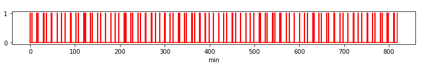
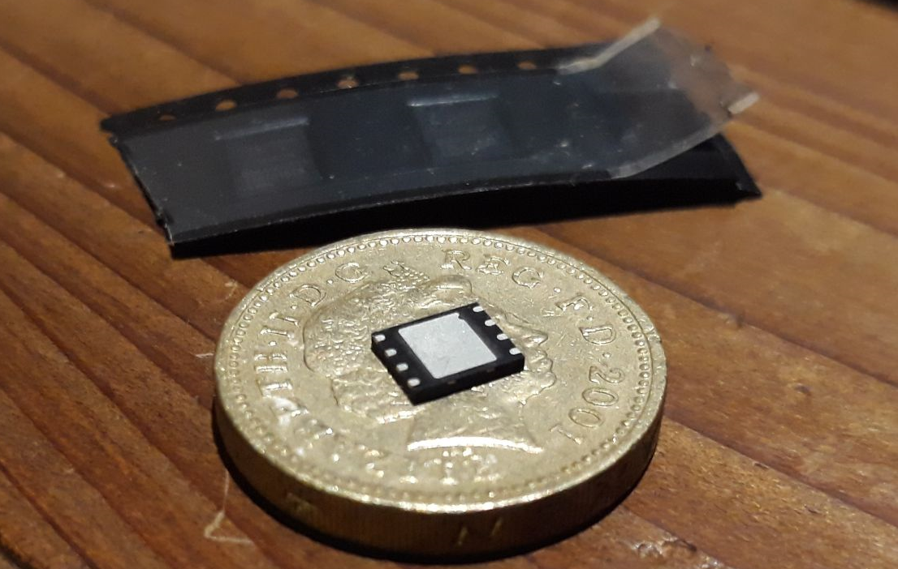

\pagestyle{fancy}
\fancyfoot[CE,CO]{Page \thepage \hspace{1pt} of \pageref{LastPage}}

# Design and Methodology {#design}

* Includes some preliminary results to analyze UE device and LTE network behavior.

As stated in Section \ref{resobj}, the aim of this study is to compare user equipment (UE) against mobile network operators (MNOs) with a set of tests that evaluate NB-IoT's performance according to a set of metrics which highlight striking differences due to the underlying complexities of LTE architecture.

Four mobile network operators (MNOs) are compared in South Africa according to the underlying vendor
infrastructure used, namely Nokia and ZTE in the Cape/coastal regions and Ericsson and Huawei based in Gauteng/inland regions.

More than one UE is used to improve the accuracy of the result, namely Ublox and Quectel. There is an open possibility to test SimCom and Nordic as well.

A unit testing framework has been carefully prepared in Python in combination with a Hewlett Packard rotary RF attenuator in 10dBm steps. 

However, due to the demonstrated energy variability of NB-IoT, an estimate of the energy per message EMSG must be chosen in accordance with the application requirements, rang- ing from very optimistic (best case) to the most pessimistic (worst case). For that purpose, we use the data recorded as a probabilistic
model, taking the 5th/95th-percentiles for the best/worst case scenarios, and the mean values as an estimate for the long- term behavior.

This information can be applied to multiple application use cases.


## Preliminary Tests

These tests better orient the reader to the behavior of UE devices and network.

### Network Info

#### System Information Blocks (SIB)

See Appendix \ref{appendixD}.


#### Extended Coverage Level (ECL)

The Cell ID in this response is the physical network cell ID.

\begin{minipage}{\linewidth}
\begin{center}
\includegraphics[width=1.0\linewidth]{../../../masters/code/tests/plotterk/Signal_power_ECL_plot.pdf}
\captionof{figure}[ECL vs RSRP.]{ECL not determined by attenuation.}
\label{fig:}
\end{center}
\end{minipage}

[](../../../masters/code/tests/plotterk/Signal_power_ECL_plot.png)

[](../../../masters/code/tests/plotterk/ECL_histogram.png)

#### Cell ID, EARFCN, PCI

Table: PCI, Cell ID count and EARFCN after K-means cluster filtering with tuples in (Ublox, Quectel) format. {#tbl:nw_parameters}

| PCI  | Cell ID   |      | ZTE      | Nokia    |
| ---- | --------- | ---- | -------- | -------- |
| 123  | 239882509 |      | (34, 26) |          |
| 14   | 2671716   |      | (13, 29) |          |
| 11   | 2672484   |      | (1, 4)   |          |
| 2    | 484196    |      |          | (34, 32) |
|      |           |      |          |          |
|      | EARFCN    |      |          |          |
|      | 3712      |      | (48, 59) |          |
|      | 3564      |      |          | (34, 32) |

More than one tower proves that Intra-Frequency Cellular Reselection works as expected.

[](../../../masters/code/tests/plotterk/Signal_power_Cell_ID_plot.png)

[](../../../masters/code/tests/plotterk/Cell_ID_histogram.png)

[](../../../masters/code/tests/plotterk/Signal_power_PCI_plot.png)

[](../../../masters/code/tests/plotterk/PCI_histogram.png)

Physical Cell ID (PCI) is the serving cell tower's unique identifier.

On the MTN network, the UE connected to three different towers.

Table: EARFCN for serving cell {#tbl:earfcn}

| EARFCN          | 3564 | 3712 |
| --------------- | ---- | ---- |
| Ublox-MTN       |      | 35   |
| Quectel-MTN     |      | 35   |
| Ublox-Vodacom   | 34   |      |
| Quectel-Vodacom | 32   |      |

[](../../../masters/code/tests/plotterk/Signal_power_EARFCN_plot.png)

[](../../../masters/code/tests/plotterk/EARFCN_histogram.png)

The E-UTRA Absolute Radio Frequency Channel Number (EARFCN) designates the carrier frequency in the uplink and downlink, and ranges between 0-65535.

Since the frequency of the three towers was the same on all three MTN towers, this shows that intra-cell reselection does indeed work.

#### C-DRX mode

On the Vodafone network in connected-DRX (C-DRX) mode, the UE is observed to show peaks spaced at regular 2.048s intervals [@Martinez2019]. On both Vodacom and MTN networks, these peaks are not visible and instead a steady stream of peaks can be seen as on the following images. The peaks indicate an on time of roughly 12ms and idle of 4 seconds. With a cycle of 16ms, it fits the LTE requirements of between 10ms and 2560ms in terms of 1ms subframes. However, NB-IoT has a minimum requirement of 256ms to 9216ms for the interval length between C-DRX transmissions. This means that NB-IoT is utilizing vastly more time on air than permitted by the 3GPP and it is having a detrimental effect on the estimated battery life. Lastly, this does not bode well for the scaling up of devices due to the interference, especially on the shared uplink (NPUSCH) channel.

\begin{figure}[ht]
  \subfloat[C-DRX timing on MTN-Ublox]{
	\begin{minipage}[c][1\width]{
	   0.5\textwidth}
	   \centering
	   \includegraphics[width=1.0\linewidth]{../../code/tests/logs/zte_mtn/rf_shield/ublox/scope/12_8ms.jpg}
	\label{fig:cdrx1}
	\end{minipage}}
 \hfill 	
  \subfloat[C-DRX timing on MTN-Quectel]{
	\begin{minipage}[c][1\width]{
	   0.5\textwidth}
	   \centering
	   \includegraphics[width=1.0\linewidth]{../../code/tests/logs/zte_mtn/rf_shield/quectel/scope/12ms.jpg}
	\label{fig:cdrx2}
	\end{minipage}}
\captionof{figure}[C-DRX timing measurement]{Timing measurement of two LTE vendors during C-DRX. Although the duty cycles vary in C-DRX mode, it can be estimated that pulses are roughly 12ms in length with 4ms idle between. This means that ~75\% of the time the UE device is drawing current.}
\end{figure}

In Fig. \ref{fig:cdrx1}, the Ublox UE uses 73.6mA at 110dB attenuation with the RF shield enclosure door slightly open and in Fig. \ref{fig:cdrx2}, with the same environment the Quectel UE uses 73.6mA.

[](../../code/tests/logs/zte_mtn/rf_shield/ublox/scope/12_8ms.jpg)

[](../../code/tests/logs/zte_mtn/rf_shield/quectel/scope/12ms.jpg)

[](../../code/tests/logs/zte_mtn/rf_shield/ublox/scope/73.6mA.jpg_110dB_slightly_open.jpg)

[](../../code/tests/logs/zte_mtn/rf_shield/ublox/scope/cdrx73_6mA_110dB.jpg)

[](../../code/tests/logs/zte_mtn/rf_shield/quectel/scope/70.4mA_ant_0dB.jpg)

Observing C-DRX on the Nokia-Vodacom network, we have slightly different results as can be seen summarized in Table \ref{tbl:cdrx_vals}. It seems that on ZTE-MTN and Nokia-Vodacom that cycles are of length 16ms and 256ms respectively.

Table: C-DRX values {#tbl:cdrx_vals}

|               | MTN-ZTE | Nokia-Vodacom |
| ------------- | ------- | ------------- |
| **Ublox**     |         |               |
| Peak current  | 73.6 mA | 72 mA         |
| Transmit time | 12.8 ms | 56 ms         |
| Idle time     | 4 ms    | 200 ms        |
|               |         |               |
| **Quectel**   |         |               |
| Peak current  | 70.4 mA | 66.4 mA       |
| Transmit time | 12 ms   | 80 ms         |
| Idle time     | 4 ms    | 180 ms        |

[](../../code/tests/logs/nokia_vodacom/centurycity/ublox/cops/scope/cops_idle_56ms.jpg)

[](../../code/tests/logs/nokia_vodacom/centurycity/ublox/cops/scope/cops_tx_200ms.jpg)

[](../../code/tests/logs/nokia_vodacom/centurycity/ublox/cops/scope/cops_72mA.jpg)

[](../../code/tests/logs/nokia_vodacom/centurycity/quectel/cops/scope/cops_80ms_idle.jpg)

[](../../code/tests/logs/nokia_vodacom/centurycity/quectel/cops/scope/cops_66.4mA.jpg)

[](../../code/tests/logs/nokia_vodacom/centurycity/quectel/cops/scope/cops_180ms_tx.jpg)

####  E-UTRAN Node B (eNB/eNodeB)

Ericsson eNodeBs run Linux and their commands are accessible via MOShell, or the scripting language AMOS.

To get an idea of the complexity of a node (eNodeB) in a base station (BTS), running `$ get .` in the terminal of B06009-TESTPLANT returned 7037 Managed Objects (MOs) with 27989 parameters. This highlights how easy it is for a BTS to produce different results in this study depending on the network configuration and environment.

### Range Field Test

This gives a good idea as to the range expected according to RSRP.

#### NB-IoT

Using a Quectel BG96, the following tests were taken on the rooftop described in Fig. \ref{fig:rooftop}.

{width=50%}

The tests involve sending a set of 10 pings multiple times at a certain attenuation and resulting RSSI measurement using a Quectel BG96 modem.

\begin{figure}[ht]
  \subfloat[With an antenna and the attenuator set to 0dB, we find most of the values around the mean of 185.2ms, except for the tail at around 500ms which is the time of the first ping in a set of 10.]{
	\begin{minipage}[c][1\width]{
	   0.48\textwidth}
	   \centering
	   \includegraphics[width=1.0\linewidth]{../images/rooftest1.png}
	\label{fig:ping1}
	\end{minipage}}
 \hfill 	
  \subfloat[Setting the attenuator to the max of 110dB, we see no change in the ping measurements which have a mean of 185.9ms. The tail has increased to a max of just over 600ms. ECL 0.]{
	\begin{minipage}[c][1\width]{
	   0.48\textwidth}
	   \centering
	   \includegraphics[width=1.0\linewidth]{../images/rooftest2.png}
	\label{fig:ping2}
	\end{minipage}}
\captionof{figure}[Ping tests]{Ping tests on Engineering rooftop}
\end{figure}

[](C:\GIT\masters\thesis\images\rooftest1.png)

[](C:\GIT\masters\thesis\images\rooftest2.png)

\begin{figure}[ht]
  \subfloat[Removing the antenna from the attenuator, we find that the data has a slightly thicker tail, and averages around 207.1ms. ECL 0.]{
	\begin{minipage}[c][1\width]{
	   0.48\textwidth}
	   \centering
	   \includegraphics[width=1.0\linewidth]{../images/rooftest3.png}
	\label{fig:ping3}
	\end{minipage}}
 \hfill 	
  \subfloat[Lastly, having no attenuator nor antenna we still have a connection at -107dBm with a mean of 190.6ms.]{
	\begin{minipage}[c][1\width]{
	   0.48\textwidth}
	   \centering
	   \includegraphics[width=1.0\linewidth]{../images/rooftest4.png}
	\label{fig:ping4}
	\end{minipage}}
\captionof{figure}[Ping tests]{Ping tests on Engineering rooftop}
\end{figure}

[](C:\GIT\masters\thesis\images\rooftest3.png)

[](C:\GIT\masters\thesis\images\rooftest4.png)

To be able to attenuate the signal until disconnection, one must increase the range from the base station such that leakage transmission from traces, soldering and attenuator connectors do not interfere with the test. As such, there must not be a connection to the base station at all if the antenna or attenuator is disconnected or connected at maximum attenuation.

\begin{figure}[ht]
  \subfloat[A test was performed from 10pm onwards at Technopark on 14 March 2019. A connection was made at a range of 4.8 km at -93dBm and an altitude of 132m. This is a relative elevation of -6m. The altitude is -13m relative to the base station.]{
	\begin{minipage}[c][1\width]{
	   0.48\textwidth}
	   \centering
	   \includegraphics[width=1.0\linewidth]{../images/techno_map.PNG}
	\label{fig:map_techno}
	\end{minipage}}
 \hfill 	
  \subfloat[The greatest distance measured was 5.5km from the intersection of the R44 and the turn-off to Stellenbosch Square or Jamestown at an altitude of 106m. This is a relative elevation of -32m to the base station.]{
	\begin{minipage}[c][1\width]{
	   0.48\textwidth}
	   \centering
	   \includegraphics[width=1.0\linewidth]{../images/jamestown_map.PNG}
	\label{fig:map_jamestown}
	\end{minipage}}
\captionof{figure}[Long-range tests map]{Long-range tests map}
\end{figure}

[](C:\GIT\masters\thesis\images\techno_map4.8km.JPG){width=50%}

\begin{figure}[ht]
  \subfloat[At 0dB attenuation the data has a mean of 196.7ms and a tail just above 500ms in ECL 0]{
	\begin{minipage}[c][1\width]{
	   0.48\textwidth}
	   \centering
	   \includegraphics[width=1.0\linewidth]{../images/techno1.png}
	\label{fig:ping5}
	\end{minipage}}
 \hfill 	
  \subfloat[At 10dB the data is more spread out from 200 - 500ms with a mean of 396.4ms and a tail at just under 1000ms in ECL 1.]{
	\begin{minipage}[c][1\width]{
	   0.48\textwidth}
	   \centering
	   \includegraphics[width=1.0\linewidth]{../images/techno2.png}
	\label{fig:ping6}
	\end{minipage}}
\captionof{figure}[Long-range ping tests]{Long-range ping tests}
\end{figure}


[](C:\GIT\masters\thesis\images\techno1.png)

[](C:\GIT\masters\thesis\images\techno2.png)

\begin{figure}[ht]
  \subfloat[At 20dB attenuation, the data is more spread across 350 - 1000ms with a mean of 793.4ms and a tail that extends to over 4500ms in ECL 2. Any more attenuation and the signal is lost.]{
	\begin{minipage}[c][1\width]{
	   0.48\textwidth}
	   \centering
	   \includegraphics[width=1.0\linewidth]{../images/techno3.png}
	\label{fig:ping7}
	\end{minipage}}
 \hfill 	
  \subfloat[At this point, the signal strength increased to -89dBm and resumed a mean of around 209.6ms with a tail around 500ms.]{
	\begin{minipage}[c][1\width]{
	   0.48\textwidth}
	   \centering
	   \includegraphics[width=1.0\linewidth]{../images/stelliesquare.png}
	\label{fig:ping8}
	\end{minipage}}
\captionof{figure}[Long-range ping tests]{Long-range ping tests}
\end{figure}

[](C:\GIT\masters\thesis\images\techno3.png)

[](C:\GIT\masters\thesis\images\jamestownmap.JPG)

[](C:\GIT\masters\thesis\images\stelliesquare.png)

\begin{figure}[ht]
  \subfloat[A similar pattern was seen at Parmalat, but driving closer there were a few spots where connection was lost or many retries were needed such that the tail extended up to almost 3000ms for the ICMP ping time.]{
	\begin{minipage}[c][1\width]{
	   0.48\textwidth}
	   \centering
	   \includegraphics[width=1.0\linewidth]{../images/parmalat.png}
	\label{fig:ping9}
	\end{minipage}}
 \hfill 	
  \subfloat[Lastly, all the test data including raw data on the way to Technopark, we see a similar form.]{
	\begin{minipage}[c][1\width]{
	   0.48\textwidth}
	   \centering
	   \includegraphics[width=1.0\linewidth]{../images/alltests2.png}
	\label{fig:ping10}
	\end{minipage}}
\captionof{figure}[Long-range ping tests]{Long-range ping tests}
\end{figure}

[](C:\GIT\masters\thesis\images\parmalat.png)

[](C:\GIT\masters\thesis\images\alltests2.png)

{width=50%}

#### Dash7

A Dash7 field test was performed using STM32L0, but due to 10dBm transmit power it limited range to about 300m.

{width=65%}

Although Dash7 is considered a viable alternative, it fell short on range expectations.

Haystack Technologies has developed a Dash7-over-LoRa implementation that expects ranges of over a few kilometers and can be considered in future research.

### RF Spectrum Tests


{width=30%}

### Terrestrial Localization

Localization can be useful for asset tracking as discussed in Section \ref{asset_tracking}. Of the prominent LPWANs, SigFox is the only one that offers a simple localization service. NB-IoT will offer one when upgraded to 3GPP Release 14. Unfortunately SigFox is has poor accuracy as can be seen in Fig. \ref{fig:sigfox_map}.

{width=80%}

### Power Saving Mechanisms

With a paging time window interval of 2.54s and 4 hyper-frames making up 40.96s, the following output is obtained.

```c
AT+NPTWEDRXS=2,5,"0001","0011"
+CEREG: 5,1,"8CA7","28C464",7,,,"00011000","00101010"
```

AT+CEREG says that the T3324 active time is 48 seconds, or 2 seconds * 24 binary coded timer value. This is not the expected outcome, even according to `Table 10.5.5.32/3GPP
TS 24.008: Extended DRX parameters information` as referenced in Ublox documentation, which expects 40.96s. Besides, the paging time interval is also not working as expected.

{width=50%}

[](C:\Users\d7rob\AppData\Roaming\Typora\typora-user-images\1555570254042.png){width=50%}

The T3324 active timer value is modified to 5.12s.

```c
AT+NPTWEDRXS=2,5,"0001","0000"
```

AT+CEREG says that the timer is 32s, or 2 seconds * 16 binary coded timer value.

```c
+CEREG: 5,1,"8CA7","28C465",7,,,"00010000","00101010"
```

In the debug logs we see the timer expires after exactly 30 seconds.

```c
1400,00:07.952393,NAS_DBG_TIMER
	action=TIMER_START
	prim_id=USIM_STATUS_TIMER_EXPIRY
	duration=30
2092,00:37.952728,USIM_STATUS_TIMER_EXPIRY
	timer_handle=16871576
```


[](C:\Users\d7rob\AppData\Roaming\Typora\typora-user-images\1555568148322.png){width=50%}

{width=50%}

Increasing the T3324 active timer value to 10.24s, the following results are obtained. It is exactly the same as before.

```c
AT+NPTWEDRXS=2,5,"0001","0001"
```

AT+CEREG says that the timer is 32s, or 2 seconds * 16 binary coded timer value.

```c
+CEREG: 5,1,"8CA7","28C465",7,,,"00010000","00101010"
```

In the debug logs we see the timer expires after exactly 32 seconds.

```c
2409,+00:00.400757,NAS_DBG_TIMER
	action=TIMER_START
	prim_id=USIM_STATUS_TIMER_EXPIRY
	duration=30
5981,+00:33.283905,USIM_STATUS_TIMER_EXPIRY
	timer_handle=16871576
```

[](C:\Users\d7rob\AppData\Roaming\Typora\typora-user-images\1555569718434.png){width=50%}

(These tests should continue until an eDRX value of 2621,44s, or 43.69 minutes and repeated for Quectel, Nordic, SimCom and on Nokia, Ericsson and Huawei basestations)

Also, what is the current usage of running a specific command? Is it negligible or is, for example, polling AT+CSQ constantly detrimental on battery life?




### Ultra-low Current Sleep Measurements

Using an MX 58HD DMM, one can measure 4.501 mA through a 4615 ohm resistor at 21.15V. Theoretically it should be 4.582 mA so that gives an error of 1.82% or ~2%.

*Todo: measure sleep current of devices*

### Mobility Tests

Using a Sierra Wireless WP7702 on Ericsson Test BTS 'L06009A3' and EARFCN 3734/3752, the UE had to periodically ping an internet-facing server and the dead time was measured before it reconnected and received a response. The RSRP was in the range -50 to -80 dBm and in ECL 0.

The tests took place within a faraday cage to isolate the test network from the live RAN, else by opening the door of the faraday cage it deregistered from the network and MME.

Table: NB-IoT and LTE Cat-M handover. {#tbl:mobility}

| Mobility test         | Time   |
| --------------------- | ------ |
| Standalone to In-band | ~ 11 s |
| In-band to Standalone | ~ 11 s |

### Throughput

|      | Uplink              | Downlink            |
| ---- | ------------------- | ------------------- |
| GPRS | 158 kbps or 20 kB/s | 254 kpbs or 31 kB/s |
|      |                     |                     |
|      |                     |                     |

## Example Application

An example application was built to test and understand NB-IoT. See schematic and board layout in Appendix \ref{appendix_SCH_BRD}. The board includes not just NB-IoT but also LTE Cat-M, GPRS/EDGE, SigFox, LoRa, and Dash7. Initally designed to compare LPWANs, we decided to focus more purely on NB-IoT as there is a great deal of variance among UEs and LTE vendors already.

Notable components include:

* Quectel BG96 cellular modem
* Murata CMWX1ZZABZ-078 which includes STM32L072CZ microcontroller and SX1276 transceiver 
* Atmel SAMD21G18a microcontroller
* Microchip MIC29302WU 3A LDO Regulator @3.8V

[](../images/image-20191105153024907.png){width=75%}

 {width=75%} 

By adding a DHT22 temperature and humidity sensor, button and buzzer for and example application, we see the following dashboard result in Fig. \ref{fig:dashboard_thingsboard}.

{width=65%}

## Setup Procedure

Each Field Test will make use of various subtests.

### Hardware

#### Attenuator

Two of these will be used in series: the HP8494B and the HP8496A. One has a range of 11dB in 1dB steps, and the other has a range of 110dB in 10dB steps, so it is possible to get a full range of 110dB in 1dB steps.

#### Current Measurements

The following tests measure current for a Ublox SARA N200 connected to a ZTE base station.

{width=65%}


The digital multimeter in the figure is replaced with a ZXCT1008 high-side current monitor in series with the modem. 

{width=25%}

Rs is set to a 1 ohm resistor and Rg is set as a 1k ohm resistor such that 100mA supplied to the modem makes 1V.

$V_{out} = I_{load} [mA] * 10 [\frac{V}{mA}]$


### Network Registration

#### e-SIMs

{width=40%}

### PyTest Framework

PyTest is a unit testing framework used to setup the UE for each test using AT commands and can be found on  [https://github.com/daniel-leonard-robinson/masters/tree/master/code/tests](https://github.com/daniel-leonard-robinson/masters/tree/master/code/tests).


### Telemetry Tests

Subtests measure various aspects of the required metrics.

The SARA-N2 series modules are able to send raw data through UDP sockets to an IP address. The
data sent over the socket AT commands is not wrapped in any other layer, and the data provided is
the data that is sent.

The Constrained Application Protocol (CoAP) is a datagram-based client/server application protocol
for devices on the constrained network (e.g. low overhead, low-power), designed to easily translate
to HTTP for simplified integration with the web. CoAP clients can use the GET, PUT, POST and
DELETE methods using requests and responses with a CoAP server.

The usage of the Non-IP method during the sending or receiving of messages saves the overhead of
needing to send a UDP IP header.

See [@ubloxAppNote2018] for an Application example.

#### UDP {#udp}

UDP is used primarily for establishing low-latency and loss-tolerating connections between applications on the internet.

To test the capability of sending to the internet for multiple UEs, a simple protocol is necessary. TCP, MQTT, CoAP and other protocols are all based on the same IP infrastructure that UDP uses, yet not all UEs have this capability. UDP will be used and other protocols can be tested against it.

This test sends a UDP packet to an internet accessible IP address. The IP is 1.1.1.1 and it belongs to Warp which claims to be the fastest DNS resolver in the world, with OpenDNS, Google and Verisign taking the next respective rankings.


For a more advanced check on sending data to an external server, send data to the u-blox echo
server at echo.u-blox.com.

* Because there is no DNS lookup function in the SARA-N2 module series, use the IP address
  server which is 195.34.89.241.

Command Response Description
AT+NSOCR="DGRAM",17,10000 0
OK
Create a UDP socket.
AT+NSOST=0,"195.34.89.241",7,5,"0102
030405"
0,5
OK
Send data on socket 0.
+NSONMI: 0,5
Receive data on socket 0.
AT+NSORF=0,5 +NSORF: 0,"195.34.89.241",7,5
,"0102030405",0
OK
Request data from socket 0.
Echo’d data received

#### Periodic Tracking Area Update (PTAU)

#### Extended Discrete Reception (eDRX)

#### Cellular Operator Selection (COPS)

Network Registration is necessary when the device is not yet connected.

An initial test was performed with AT+COPS=0 network registration until T3412 timeout of 270 seconds.

[](C:\GIT\masters\thesis\images\active_time.JPG)

Peak current is approximately 70mA.


#### Echo

This test is designed to measure client and server initiated echo requests.

[](../../code/tests/logs/huawei_vodacom/quellerina/ublox/echo/3.bmp)


#### Ping 

Issue the +NPING AT command to check if the module is able to send and receive data.
Check to see if the network can communicate to the internet, or it is needed another accessible
server’s IP address to ping.
To ping Google’s DNS server:
AT+NPING="8.8.8.8"
To ping OpenDNS DNS server:
AT+NPING="208.67.222.222"
The information text response to the +NPING AT command will be issued after a few seconds. If the
information text response is +NPINGERR: 1, the ping has timed out.

* The first ping might fail because it can take a few seconds to connect to the base station. Use
  the +CSCON URC to show when the module is connected.


## Power Efficiency

* ~ 10 years battery life

Low power consumption is vital for battery longevity.

* PCB layout, antenna matching and location will have an effect to the overall interference received by the module.
* PSM and eDRX
* On the other hand, although the average power is comparable, peaks in transmission of LoRaWAN’s radio are around 40 mA, while in NB-IoT they reach 220 mA. This causes additional stress on the battery, which has to be managed with care.
* As can be observed, mean values for NB-IoT are similar to the energy that a LoRaWAN device requires to transmit while using the SF12 configuration. The 5th percentile results for NB-IoT (best observed performance) are comparable to the best case performance of LoRaWAN when operating at SF8. This is in our opinion a relevant result, as NB-IoT guarantees packet delivery with similar power consumption.
* The expected achievable lifespan (on average) for a NB-IoT is on the order 2-3 years, depending on the datagram size.
* However, adopters may take into consideration some differences. First, sending larger messages (up to 512 bytes) has almost no impact on NB-IoT.
* In a simple periodic-reporting application with very limited computing requirements5, the average power can be modeled approximately by Eq. \ref{eq:avgpower}, as detailed in [21]:

$$P = \frac{E_{msg}}{T_{msg}}$$ {#eq:avgpower}

* **Power consumption**: In applications where device battery life is
  a crucial factor we recommend, either LoRaWAN or Sigfox, because they are completely asynchronous. We found that the battery life of LoRaWAN SF 7 was five times that of LoRaWAN SF 12 and nearly 25 times that of Sigfox. This is mainly due to the extremely long time-on-air of LoRaWAN SF 12 and Sigfox. If NB- IoT worked with the mobile network operators to reduce its RRC- idle phase, it could develop a minimal power consumption to compare with that of LoRaWAN and Sigfox.
  * It is clear that LoRaWAN SF7 is the most power-efficient, due to the short transmission burst. NB-IoT displays the worst power-consumption, due to the extended RRC-idle state. This can be reduced using Release Assistance as in Section \ref{release_a}.

### Energy vs SINR

{width=65%}

With the fading colour scheme and range just as in Martinez [@Martinez2019], Fig. \ref{fig:energy_sinr1400} shows the impact of SNR on energy consumption. As observed in the figure, there is a trend of increasing energy with respect to lower SNR levels and high variability. Unfortunately, the effect of different ECLs is unclear.

{width=65%}

Increasing the range fully and using logarithms in Fig. \ref{fig:energy_sinr_log}, one can see that there is significant overshoot on the MTN-ZTE network. The trend mentioned in Fig. \ref{fig:energy_sinr1400} continues.

[](../images/1571785381395.png)

### Energy vs Datagram Size

[](../../code/tests/datagrams/mtn_ublox_energy.png)

[](../../code/tests/datagrams/quectel_sizes.png){width=65%}

\begin{figure}[ht]
  \subfloat[Datagram sizes of MTN-Ublox pair up to 1500 mJ. Note the steady increase in Energy consumption on the baseline, and the high variation.]{
	\begin{minipage}[c][1\width]{
	   0.48\textwidth}
	   \centering
	   \includegraphics[width=1.0\linewidth]{../../code/tests/datagrams/mtn_ublox_energy.pdf}
	\label{fig:udpsize1}
	\end{minipage}}
 \hfill 	
  \subfloat[Datagram sizes of MTN-Quectel pair up to 10 J]{
	\begin{minipage}[c][1\width]{
	   0.48\textwidth}
	   \centering
	   \includegraphics[width=1.0\linewidth]{../../code/tests/datagrams/quectel_sizes.png}
	\label{fig:udpsize2}
	\end{minipage}}
\captionof{figure}[UDP Datagram energy-sizes]{UDP Datagram energy-sizes}
\end{figure}

Fig. \ref{fig:udpsize1} shows 

### eDRX Energy

\begin{figure}[ht]
  \subfloat[MTN-ZTE Ublox]{
	\begin{minipage}[c][1\width]{
	   0.48\textwidth}
	   \centering
	   \includegraphics[width=1.0\linewidth]{../images/1568090120083.png}
	\end{minipage}}
 \hfill 	
  \subfloat[MTN-ZTE Quectel]{
	\begin{minipage}[c][1\width]{
	   0.48\textwidth}
	   \centering
	   \includegraphics[width=1.0\linewidth]{../images/1568090147760.png}
	\end{minipage}}
\captionof{figure}[eDRX Energy]{eDRX Energy}
\end{figure}

[](../images/1568090120083.png){width=45%}

[](../images/1568090147760.png){width=50%}

\begin{figure}[ht]
  \subfloat[Vodacom-Nokia Ublox]{
	\begin{minipage}[c][1\width]{
	   0.48\textwidth}
	   \centering
	   \includegraphics[width=1.0\linewidth]{../images/1568090173885.png}
	\end{minipage}}
 \hfill 	
  \subfloat[Vodacom-Nokia Quectel]{
	\begin{minipage}[c][1\width]{
	   0.48\textwidth}
	   \centering
	   \includegraphics[width=1.0\linewidth]{../images/1568090209468.png}
	\end{minipage}}
\captionof{figure}[eDRX Energy]{eDRX Energy}
\end{figure}

[](../images/1568090173885.png){width=65%}

[](../images/1568090209468.png){width=65%}

### PTAU Energy

\begin{figure}[ht]
  \subfloat[MTN-ZTE Ublox (mJ)]{
	\begin{minipage}[c][1\width]{
	   0.48\textwidth}
	   \centering
	   \includegraphics[width=1.0\linewidth]{../images/1568089886942.png}
	\end{minipage}}
 \hfill 	
  \subfloat[MTN-ZTE Quectel (mJ)]{
	\begin{minipage}[c][1\width]{
	   0.48\textwidth}
	   \centering
	   \includegraphics[width=1.0\linewidth]{../images/1568089931848.png}
	\end{minipage}}
\captionof{figure}[PTAU Energy]{PTAU Energy}
\end{figure}

[](../images/1568089886942.png){width=65%}

[](../images/1568089931848.png){width=65%}

\begin{figure}[ht]
  \subfloat[Vodacom-Nokia Ublox (J)]{
	\begin{minipage}[c][1\width]{
	   0.48\textwidth}
	   \centering
	   \includegraphics[width=1.0\linewidth]{../images/1568090001158.png}
	\end{minipage}}
 \hfill 	
  \subfloat[Vodacom-Nokia Quectel (J)]{
	\begin{minipage}[c][1\width]{
	   0.48\textwidth}
	   \centering
	   \includegraphics[width=1.0\linewidth]{../images/1568090070185.png}
	\end{minipage}}
\captionof{figure}[PTAU Energy]{PTAU Energy}
\end{figure}

[](../images/1568090001158.png){width=65%}

[](../images/1568090070185.png){width=65%}

### Measured Max Current

\begin{minipage}{\linewidth}
\begin{center}
\includegraphics[width=1.0\linewidth]{../../../masters/code/tests/plotterk/Signal_power_energy_outliers.pdf}
\captionof{figure}[Max current of packets (372/1619) up to 128mA against RSRP.]{Max current of packets (372/1619) up to 128mA in comparison (AB) of UE, (C) MNOs, (DE) attenuation zones, (F) UE-MNO boxplots, (GH) test types, (I) and ECLs against RSRP.}
\label{fig:}
\end{center}
\end{minipage}

[](../../../masters/code/tests/plotterk/Signal_power_maxCurrent_plot.png)

roughly between 70 and 120mA, and skewed towards higher consumption. It is also clamped at 128mA due to measurement limitations. 

(A) Attenuation zones evident. (B) Both MTN and Vodacom share similar distributions of max current usage. (C) Tests are varied, yet UDP packet transmission tend to use more current. (D) ECL does not affect current usage.

\begin{minipage}{\linewidth}
\begin{center}
\includegraphics[width=1.0\linewidth]{../../../masters/code/tests/plotterk/maxCurrent_histogram.pdf}
\captionof{figure}[Max current of packets histogram]{The latency-energy measurement hardware is limited to 128mA, and therefore we can see some clamping here. It shouldn't affect the energy readings much however, as maximum current occurs only during the first few microseconds of the random access preamble.}
\label{fig:}
\end{center}
\end{minipage}

[](../../../masters/code/tests/plotterk/maxCurrent_histogram.png)

## Latency and Timing

* **Down link latency**: In applications where downlink latency is a
  critical component, only GPRS will suffice, as it is the only technology in this study that requires constant paging between the base station and the end device. 
* **Down link throughput**: Any applications requiring bi-directional communication of more than 120 bytes per 24 h, should use NB- IoT or GPRS, as Sigfox and LoRaWAN are limited by the duty- cycle limitations of the base station. 

#### TX, RX Time

TX Time is the duration for which the module’s transmitter has been switched on.

RX Time is the duration for which the module’s receiver has been monitored for downlink
activity (both expressed in milliseconds since the last reboot). Together these can be used to
assess the time the module spends in each state and hence estimate the power consumed by
the module.

When the module first tries to register with the network, the Tx time will be zero as it will not have
instantly found a base station. The Rx time will increase to show it is scanning for a base station.
Once a base station is found it is possible to see that it is attempting to transmit to the base station
as the Tx time will start to increase. If the base station does not respond to the module’s Tx, then
the +CSCON: 1 URC will not be issued.

### Latency vs SINR

{width=50%}

In Fig. \ref{fig:latency_sinr_comp}, there is a poor distinction between attenuation zones as the SINR varies throughout the reported RSRP range. Grouping the data according to attenuation decade is important to see the effect of network conditions clearly.

## Secondary Metrics

### 


Tests were completed in good, mid cell and cell edge RF conditions.

### Signal Strength

Signal strength can be measured using the following metrics:

* MCL
* RSRP
* RSSI
* RSRQ
* SNR
* TX Power

#### MCL

For IoT devices used in extended coverage situations,
such as deep-indoor devices or remote locations, we recommend either Sigfox or NB-IoT, as they offer a maximum MCL of more than 158 dB. IoT devices for general use would benefit from the large-scale deployment of the GPRS network, which provides excellent coverage because of its legacy infrastructure. It is clear that the extra overhead available in Sigfox, LoRaWAN, and NB-IoT allows for better indoor coverage than GPRS, which means that the LPWAN devices can be used in less than optimal operating conditions. Measured MCL correlates with theoretical values.

#### RSRP

RSRP or "Signal Power" is the power of the wanted part of the receive signal, the NB-IoT part.

#### SNR

Last SNR value.

#### "Total power" or RSSI

It is the radio signal strength within the receive bandwidth (both expressed in 10ths
of a decibel). From this the signal to noise ratio can be calculated.

#### Transmit power

* It is the RF power output from the module. It may be a low number if the
  received signal strength is good (and hence the module assumes that the base station is close
  by).
* Ideally the module
  should consume 230 mA for +23 dBm.

#### ECL

  It is equivalent to "PRACH coverage enhancement level" defined in 3GPP 36.321 [3] sub
  clause 5.1

  * As observed, the ECL has an impact on energy consumption, but not on the delay.

### Throughput

Data can be extracted from UDP packet transmissions using latency and data size

$THP = \frac{Datagram\ Size}{Latency}$

It also comes from RLC and MAC reporting.


**Throughput**: As throughput differs greatly between the four technologies, comparisons should rather be made in either the licensed (NB-IoT and GPRS) or unlicensed (Sigfox and LoRaWAN) spectrum categories. Applications that require huge amounts of data to be transmitted, such as real-time vehicle fleet monitoring, we recommend GPRS and NB-IoT as they are not duty cycle limited. The choice of GPRS or NB-IoT will be based on the battery life requirements of the IoT device, with NB-IoT having the advantage. In the case of extremely low-throughput applications, such as water meters, power meters, and weather stations, we recommend Sigfox, as it offers a scalable solution with no base station costs involved. Although it limits the 12 byte throughput per 24 h to 140 messages, this is more than the 20 messages offered by LoRaWAN SF12 (TTN).

* As NB-IoT operates in the licensed spectrum, there are no
  throughput restrictions, other than the data-rate restriction. We measured the uplink and downlink data rates in different signal quality environments (distances from the gateway) by querying the modem. The measured downlink rate varied from 2250 to 14,193 bps. We could find no clear correlation between the downlink data rate and the signal quality environment.

#### FOTA Upgrades

GPRS and NB-IoT are able to offer FOTA upgrades to IoT devices, as Sigfox has limited bandwidth. This feature is supported by LoRaWAN, through the fragmentation of large payloads [22].

### Data Overhead

Variation in data overhead can be measured using TX, and RX byte counters.

* The module has a limited dynamic message queue size. For IoT applications, the message size should be of the order of tens of bytes. UDP socket commands limit their payload size to 512 bytes.
* There is no indication when the UDP data has been sent.
* Downlink data from the cloud server must also be 512 bytes or less, because otherwise the messages will be lost.
* The module has an internal message buffer. If the module is unable to send the messages to the network before this buffer is full, because the application is queueing quicker than it can send them, then the UE device will return ERROR for the +NSOST/+NSOSTF commands.
* If a message cannot be sent because of communication issues between the module and eNB, the module will attempt to send the message a second time. If this fails, the message will be dropped. As +NSOST/+NSOSTF messages are UDP, there is no indication the message has been dropped.
* The UDP header is about 48-60 bytes in length, and so an application sending 100 bytes will actually send about 160 bytes. For devices in the extreme coverage class 2, this can be quite costly.
* The UE device may later resume the RRC Connected state with that context, thus avoiding the AS setup and saving considerable signaling overhead for the transmission of infrequent small data packets.

## Estimations

### Telemetry Interval

The recommended telemetry interval can be estimated for a subtest.

* Telemetry interval periodicity.

### Battery longevity

The battery longevity can be estimated for each subtest.

## Field Test Captures

Ublox and Quectel data has been captured for:

* Nokia networks at Vodacom head office in Century City, Cape Town
* ZTE at the MTN Mobile Intelligence Lab, Stellenbosch inside an RF enclosure with the door slightly open before being sealed.
* Ericsson at MTN headquarters on 14th Avenue, Johannesburg
* Huawei in Fairlands, JHB

## Post-processing

### Plots

- what aspect is the plot trying to cover, what is it telling me on that topic, shows? observances?
- purpose
- data in the plot saying / deduce / narrative / story
  - Example, Quectel, Vodacom is worse
- 4 sentences
- 4 sentences when comparing nw, and tehn again ues
- What is the take home?


* what aspect is the plot trying to cover

* what is it telling me on that topic
* purpose
* data in the plot saying / deduce / narrative / story
* 4 sentences
* 4 sentences when comparing nw, and tehn again ues

### Probability estimation

Due to the large dataset and requiring a reasonable means of visualization, we can consider a histogram.

\begin{figure}[ht]
  \subfloat[Example python histogram of a univariate latency distribution showing counts]{
	\begin{minipage}[c][1\width]{
	   0.48\textwidth}
	   \centering
	   \includegraphics[width=1.0\linewidth]{../../code/tests/old/img2/histogram_counts.pdf}
	\end{minipage}}
 \hfill 	
  \subfloat[Histogram counts vary among various datasets when their sizes differ, so it would be a good idea to normalize it such that the area under the graph makes 1.0. The probability of the discrete data can also be estimated in a continuous probability density function (PDF) with the kernel density estimation.]{
	\begin{minipage}[c][1\width]{
	   0.48\textwidth}
	   \centering
	   \includegraphics[width=\linewidth]{../../code/tests/old/img2/probability_density_function_seaborn.pdf}
	\end{minipage}}
\captionof{figure}[Probability estimation on histogram latency sample]{Probability estimation on histogram latency sample}
\end{figure}

[](../../code/tests/old/img2/histogram_counts.png)

[](../../code/tests/old/img2/probability_density_function_seaborn.png)

\begin{figure}[ht]
  \subfloat[Various types of kernel density estimation (KDE)]{
	\begin{minipage}[c][1\width]{
	   0.48\textwidth}
	   \centering
	   \includegraphics[width=\linewidth]{../../code/tests/old/img2/probability_density_function.pdf}
	\end{minipage}}
 \hfill 	
  \subfloat[Various types of kernel density estimation (KDE) with histogram and KDE normalized in attempted probability mass function]{
	\begin{minipage}[c][1\width]{
	   0.48\textwidth}
	   \centering
	   \includegraphics[width=\linewidth]{../../code/tests/old/img2/probability_mass_function.pdf}
	\end{minipage}}
\captionof{figure}[Probability estimation on histogram latency sample]{Probability estimation on histogram latency sample}
\end{figure}

[](../../code/tests/old/img2/probability_density_function.png)

If the histogram bin values are normalized by dividing by the bin count, adding the values makes 1 instead of integrating along the x-axis. Similarly, multiplying the PDF by its x-axis gives the following result. Although all the plotted values are now truly under 1, the KDE is shifted and doesn't seem usable.  The integration to 1 visualization typical in statistics has to be used.

[](../../code/tests/old/img2/probability_mass_function.png)

In fact, good practice would be viewing the data as is and not trying to analyze it from what is essentially an entirely new perspective. Thus, the data will be viewed as 2D plotted points and histograms. Colour will be used to group the data according to attenuation and packet size.

## Dataset

Every UE device and MNO pair (4 total) has 7 main tests and each has its own attenuation zone (5 total). 424 files create a dataset with 1811 trace entries, 40 possible metrics and 79921 values.

Looking at the dataset as a whole this makes 140 unique outcomes (7x4x5). There are 15 subtest types which can be delved into, too.

The dataset is also heavily skewed towards lower latency entries. Tests were repeated with the intent of increasing reliability, especially when it takes a couple of seconds, but when a test took up to 300 seconds it had a much lower chance of being repeated. Also considering that dataset capture may be repeated in different locations, one does not necessarily want to spend more than a day on-site.

To solve for the skewness, each test can be normalized by taking a single mean of each of the associated trace entries and files. Now with a dataset of 140/1811 traces, it makes a minimum of 5600/79921 possible values.

Unfortunately this created problems especially where only a few discrete values are concerned, such as in ECL, as multiple means exist. To solve this, k-means clustering is applied.

### K-Means Clustering

Instead of finding a single mean for all the entries and associated files, at least two means are specified (K=2) to take into account the outliers that some tests produce or more if discrete values are involved or isolated regions (K=3+).

\begin{minipage}{\linewidth}
\begin{center}
\includegraphics[width=0.8\linewidth]{../../../masters/code/tests/plots/dpoints.pdf}
\captionof{figure}[K-means clustering]{Trace entries per test. Absolute maximum of 1811 traces has been reduced by removing duplicates and applying thresholds. K-means clustering achieves the desired effect of reducing dimensionality and skewness induced from low latency sampling on the dataset for different tests, yet keeps most of the features of the thresholded max.}
\label{fig:}
\end{center}
\end{minipage}

[](../../../masters/code/tests/plots/dpoints.png)

## Visualization

Since it appears that ECL is the ultimate factor that should influence latency and energy usage, it is the metric used for battery life estimation as well.

## Notes

> at+natspeed=115200,30,1

> disables LPM. cannot do RSSI triangulation

https://www.etsi.org/deliver/etsi_TS/125100_125199/125133/13.00.00_60/ts_125133v130000p.pdf

> In idle mode, UE shall support DRX cycles lengths 0.64, 1.28, 2.56 and 5.12 s, according to [16] and UE shall, if it
> supports eDRX_IDLE, support eDRX_IDLE cycle lengths 10.24, 20.48, 40.96, 81.92, 163.84, 327.68, 55.36,1310.72,
> 1966.08 and 2621.44 seconds, according to TS 24.008 [32]. 

It would be a good idea to use Martinez' work and complement it.