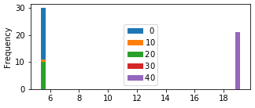
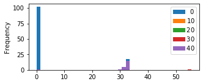
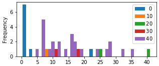

# Design and Methodology {#design}

* Includes some preliminary results to analyze UE device and LTE network behavior.

As stated in Section \ref{resobj}, the aim of this study is to compare user equipment (UE) against mobile network operators (MNOs) with a set of tests that evaluate NB-IoT's performance according to a set of metrics which highlight striking differences due to the underlying complexities of LTE architecture.

Four mobile network operators (MNOs) are compared in South Africa according to the underlying vendor
infrastructure used, namely Nokia and ZTE in the Cape/coastal regions and Ericsson and Huawei based in Gauteng/inland regions.

More than one UE is used to improve the accuracy of the result, namely Ublox and Quectel. There is an open possibility to test SimCom and Nordic as well.

A unit testing framework has been carefully prepared in Python in combination with a Hewlett Packard rotary RF attenuator in 10dBm steps. 

However, due to the demonstrated energy variability of NB-IoT, an estimate of the energy per message EMSG must be chosen in accordance with the application requirements, rang- ing from very optimistic (best case) to the most pessimistic (worst case). For that purpose, we use the data recorded as a probabilistic
model, taking the 5th/95th-percentiles for the best/worst case scenarios, and the mean values as an estimate for the long- term behavior.

This information can be applied to multiple application use cases.


## Preliminary Tests

These tests better orient the reader to the behavior of UE devices and network.

### Network Info

#### System Information Blocks (SIB)

Todo: get SIB block from UE monitor.

#### Extended Coverage Level (ECL)

The Cell ID in this response is the physical network cell ID.

The **PCI** value is created from two components - PSS and SSS. The PSS, Primary Synchronization Signal, has the value 0, 1, or 2. The SSS, Secondary Synchronization Signal, can have a value between 0 and 167.

\begin{minipage}{\linewidth}
\begin{center}
\includegraphics[width=1.0\linewidth]{../../../masters/code/tests/plotterk/Signal_power_ECL_plot.pdf}
\captionof{figure}[ECL vs RSRP.]{ECL not determined by attenuation.}
\label{fig:}
\end{center}
\end{minipage}

[](../../../masters/code/tests/plotterk/Signal_power_ECL_plot.png)

[](../../../masters/code/tests/plotterk/ECL_histogram.png)

#### Cell ID, EARFCN, PCI

Table: PCI, Cell ID count and EARFCN after K-means cluster filtering with tuples in (Ublox, Quectel) format. {#tbl:nw_parameters}

| PCI  | Cell ID   |      | ZTE      | Nokia    |
| ---- | --------- | ---- | -------- | -------- |
| 123  | 239882509 |      | (34, 26) |          |
| 14   | 2671716   |      | (13, 29) |          |
| 11   | 2672484   |      | (1, 4)   |          |
| 2    | 484196    |      |          | (34, 32) |
|      |           |      |          |          |
|      | EARFCN    |      |          |          |
|      | 3712      |      | (35, 35) |          |
|      | 3564      |      |          | (34, 32) |

More than one tower proves that Intra-Frequency Cellular Reselection works as expected.

[](../../../masters/code/tests/plotterk/Signal_power_Cell_ID_plot.png)

[](../../../masters/code/tests/plotterk/Cell_ID_histogram.png)

[](../../../masters/code/tests/plotterk/Signal_power_PCI_plot.png)

[](../../../masters/code/tests/plotterk/PCI_histogram.png)

Physical Cell ID (PCI) is the serving cell tower's unique identifier.

On the MTN network, the UE connected to three different towers.

Table: EARFCN for serving cell {#tbl:earfcn}

| EARFCN          | 3564 | 3712 |
| --------------- | ---- | ---- |
| Ublox-MTN       |      | 35   |
| Quectel-MTN     |      | 35   |
| Ublox-Vodacom   | 34   |      |
| Quectel-Vodacom | 32   |      |

[](../../../masters/code/tests/plotterk/Signal_power_EARFCN_plot.png)

[](../../../masters/code/tests/plotterk/EARFCN_histogram.png)

The E-UTRA Absolute Radio Frequency Channel Number (EARFCN) designates the carrier frequency in the uplink and downlink, and ranges between 0-65535.

Since the frequency of the three towers was the same on all three MTN towers, this shows that intra-cell reselection does indeed work.

#### C-DRX Duty Cycle

On the Vodafone network in connected-DRX (C-DRX) mode, the UE is observed to show peaks spaced at regular 2.048s intervals [@Martinez2019]. On both Vodacom and MTN networks, these peaks are not visible and instead a steady stream of peaks can be seen as on the following images. The peaks indicate an on time of roughly 12ms and idle of 4 seconds. With a cycle of 16ms, it fits the LTE requirements of between 10ms and 2560ms in terms of 1ms subframes. However, NB-IoT has a minimum requirement of 256ms to 9216ms for the interval length between C-DRX transmissions. This means that NB-IoT is utilizing vastly more time on air than permitted by the 3GPP and it is having a detrimental effect on the estimated battery life. Lastly, this does not bode well for the scaling up of devices due to the interference, especially on the shared uplink (NPUSCH) channel.

\begin{minipage}{1.0\linewidth}
\begin{center}
\includegraphics[width=1.0\linewidth]{../../code/tests/logs/zte_mtn/rf_shield/ublox/scope/12_8ms.jpg}
\captionof{figure}[C-DRX MTN-Ublox]{Timing measurement of MTN-Ublox during C-DRX. Although the duty cycles vary in C-DRX mode, it can be estimated that pulses are roughly 12.8ms in length with 4ms idle between. This means that 75\% of the time the UE device is drawing current.}
\label{fig:}
\end{center}
\end{minipage}

[](../../code/tests/logs/zte_mtn/rf_shield/ublox/scope/12_8ms.jpg)

\begin{minipage}{1.0\linewidth}
\begin{center}
\includegraphics[width=1.0\linewidth]{../../code/tests/logs/zte_mtn/rf_shield/quectel/scope/12ms.jpg}
\captionof{figure}[C-DRX MTN-Quectel]{Timing measurent of C-DRX mode for MTN-Quectel. Although the duty cycles vary in C-DRX mode, it can be estimated that pulses are roughly 12ms in length with 4ms idle between. This means that 75\% of the time the UE device is drawing current.}
\label{fig:}
\end{center}
\end{minipage}

[](../../code/tests/logs/zte_mtn/rf_shield/quectel/scope/12ms.jpg)

#### C-DRX Current Usage

\begin{minipage}{\linewidth}
\begin{center}
\includegraphics[width=1.0\linewidth]{../../code/tests/logs/zte_mtn/rf_shield/ublox/scope/cdrx73_6mA_110dB.jpg}
\captionof{figure}[C-DRX MTN-Ublox current measurement]{Current measurement of MTN-Ublox during connected DRX mode (C-DRX). The UE uses 73.6mA at 110dB attenuation with the RF shield enclosure door slightly open}
\label{fig:}
\end{center}
\end{minipage}

[](../../code/tests/logs/zte_mtn/rf_shield/ublox/scope/73.6mA.jpg_110dB_slightly_open.jpg)

[](../../code/tests/logs/zte_mtn/rf_shield/ublox/scope/cdrx73_6mA_110dB.jpg)

\begin{minipage}{\linewidth}
\begin{center}
\includegraphics[width=1.0\linewidth]{../../code/tests/logs/zte_mtn/rf_shield/quectel/scope/70.4mA_ant_0dB.jpg}
\captionof{figure}[C-DRX MTN-Quectel current measurement]{Current measurement of MTN-Ublox during connected DRX mode (C-DRX). The UE uses 70.4mA at 110dB attenuation with the RF shield enclosure door slightly open}
\label{fig:}
\end{center}
\end{minipage}

[](../../code/tests/logs/zte_mtn/rf_shield/quectel/scope/70.4mA_ant_0dB.jpg)

### Range Field Test

This gives a good idea as to the range expected according to RSRP.

Using a Quectel BG96, the following tests were taken on the roof outside the HF RF lab on the 5th floor of the Electrical & Electronic Engineering building. The base station it connected to is on the General Building, and is just over 150m away at the same elevation with a single building blocking line-of-sight. The base station is situated on the bottom left if the picture at an altitude of approximately 138m.


The tests involve sending a set of 10 pings multiple times at a certain attenuation and resulting RSSI measurement.

With an antenna and the attenuator set to 0dB, we find most of the values around the mean of 185.2ms, except for the tail at around 500ms which is the time of the first ping in a set of 10.


Setting the attenuator to the max of 110dB, we see no change in the ping measurements which have a mean of 185.9ms. The tail has increased to a max of just over 600ms. ECL 0.


Removing the antenna from the attenuator, we find that the data has a slightly thicker tail, and averages around 207.1ms. ECL 0.


Lastly, having no attenuator nor antenna we still have a connection at -107dBm with a mean of 190.6ms.


To be able to attenuate the signal until disconnection, one must increase the range from the base station such that leakage transmission from traces, soldering and attenuator connectors do not interfere with the test.

There must not be a connection to the base station at all if the antenna or attenuator is disconnected or connected at maximum attenuation.

A test was performed from 10pm onwards at Technopark on 14 March 2019. A connection was made at a range of 4.8 km at -93dBm and an altitude of 132m. This is a relative elevation of -6m. At a point just below technopark and slightly closer, the altitude is -13m relative to the base station.


At 0dB attenuation the data has a mean of 196.7ms and a tail just above 500ms.


At 10dB the data is more spread out from 200 - 500ms with a mean of 396.4ms and a tail at just under 1000ms in ECL 1.


At 20dB attenuation, the data is more spread across 350 - 1000ms with a mean of 793.4ms and a tail that extends to over 4500ms in ECL 2.


Any more attenuation and the signal is lost.

The greatest distance measured was 5.5km from the intersection of the R44 and the turn-off to Stellenbosch Square at an altitude of 106m. This is a relative elevation of -32m to the base station.


At this point, the signal strength increased to -89dBm and resumed a mean of around 209.6ms with a tail around 500ms.


A similar pattern was seen at Parmalat, but driving closer there were a few spots where connection was lost or many retries were needed such that the tail extended up to almost 3000ms for the ICMP ping time.


Adding the previous test data together we see the following shape and form.


Lastly, all the test data including raw data on the way to Technopark, we see a similar form.


Looking at the ICMP ping response according to different RSSI values, we see high jitter of a few seconds from -80dBm or less.


### Power Saving Mechanisms

With a paging time window interval of 2.54s and 4 hyper-frames making up 40.96s, the following output is obtained.

```c
AT+NPTWEDRXS=2,5,"0001","0011"
+CEREG: 5,1,"8CA7","28C464",7,,,"00011000","00101010"
```

AT+CEREG says that the T3324 active time is 48 seconds, or 2 seconds * 24 binary coded timer value. This is not the expected outcome, even according to Table 10.5.5.32/3GPP
TS 24.008: Extended DRX parameters information as referenced in Ublox documentation, which expects 40.96s. Besides, the paging time interval is also not working as expected.


The T3324 active timer value is modified to 5.12s.

```c
AT+NPTWEDRXS=2,5,"0001","0000"
```

AT+CEREG says that the timer is 32s, or 2 seconds * 16 binary coded timer value.

```c
+CEREG: 5,1,"8CA7","28C465",7,,,"00010000","00101010"
```

In the debug logs we see the timer expires after exactly 30 seconds.

```c
1400,00:07.952393,NAS_DBG_TIMER
	action=TIMER_START
	prim_id=USIM_STATUS_TIMER_EXPIRY
	duration=30
2092,00:37.952728,USIM_STATUS_TIMER_EXPIRY
	timer_handle=16871576
```


Increasing the T3324 active timer value to 10.24s, the following results are obtained. It is exactly the same as before.

```c
AT+NPTWEDRXS=2,5,"0001","0001"
```

AT+CEREG says that the timer is 32s, or 2 seconds * 16 binary coded timer value.

```c
+CEREG: 5,1,"8CA7","28C465",7,,,"00010000","00101010"
```

In the debug logs we see the timer expires after exactly 32 seconds.

```c
2409,+00:00.400757,NAS_DBG_TIMER
	action=TIMER_START
	prim_id=USIM_STATUS_TIMER_EXPIRY
	duration=30
5981,+00:33.283905,USIM_STATUS_TIMER_EXPIRY
	timer_handle=16871576
```


(These tests should continue until an eDRX value of 2621,44s, or 43.69 minutes and repeated for Quectel, Nordic, SimCom and on Nokia, Ericsson and Huawei basestations)

Also, what is the current usage of running a specific command? Is it negligible or is, for example, polling AT+CSQ constantly detrimental on battery life?


### Mobility Tests

Using a Sierra Wireless WP7702 on Ericsson Test BTS 'L06009A3' and EARFCN 3734, the UE had to periodically ping an internet-facing server and the dead time was measured before it reconnected received a response:

| Mobility test         | Time   |
| --------------------- | ------ |
| Standalone to In-band | ~ 11 s |
| In-band to Standalone | ~ 11 s |
|                       |        |

|      | Uplink              | Downlink            |
| ---- | ------------------- | ------------------- |
| GPRS | 158 kbps or 20 kB/s | 254 kpbs or 31 kB/s |
|      |                     |                     |
|      |                     |                     |

## Setup Procedure

Each Field Test will make use of various subtests.

### PyTest Framework

PyTest is a unit testing framework used to setup the UE for each test using AT commands.

### Subtest Types

Subtests measure various aspects of the required metrics.

#### UDP {#udp}

UDP is used primarily for establishing low-latency and loss-tolerating connections between applications on the internet.

To test the capability of sending to the internet for multiple UEs, a simple protocol is necessary. TCP, MQTT, CoAP and other protocols are all based on the same IP infrastructure that UDP uses, yet not all UEs have this capability. UDP will be used and other protocols can be tested against it.

This test sends a UDP packet to an internet accessible IP address. The IP is 1.1.1.1 and it belongs to Warp which claims to be the fastest DNS resolver in the world, with OpenDNS, Google and Verisign taking the next respective rankings.

#### Periodic Tracking Area Update (PTAU)


#### Extended Discrete Reception (eDRX)

#### Cellular Operator Selection (COPS)

Network Registration is necessary when the device is not yet connected.

An initial test was performed with AT+COPS=0 network registration until T3412 timeout of 270 seconds.

[](C:\GIT\masters\thesis\images\active_time.JPG)

Peak current is approximately 70mA.


#### Echo

This test is designed to measure client and server initiated echo requests.

## Main Metrics

### Energy vs SINR


### Energy vs Datagram Size

\begin{minipage}{\linewidth}
\begin{center}
\includegraphics[width=1.0\linewidth]{../../code/tests/datagrams/mtn_ublox_energy.pdf}
\captionof{figure}[UDP Datagram energy-sizes]{Datagram sizes of MTN-Ublox pair up to 1500mJ. Note the steady increase in Energy consumption on the baseline, and the high variation.}
\label{fig:udpsize}
\end{center}
\end{minipage}

[](../../code/tests/datagrams/mtn_ublox_energy.png)

### eDRX Energy







### PTAU Energy




### Measured Max Current

\begin{minipage}{\linewidth}
\begin{center}
\includegraphics[width=1.0\linewidth]{../../../masters/code/tests/plotterk/Signal_power_energy_outliers.pdf}
\captionof{figure}[Max current of packets (372/1619) up to 128mA against RSRP.]{Max current of packets (372/1619) up to 128mA in comparison (AB) of UE, (C) MNOs, (DE) attenuation zones, (F) UE-MNO boxplots, (GH) test types, (I) and ECLs against RSRP.}
\label{fig:}
\end{center}
\end{minipage}

[](../../../masters/code/tests/plotterk/Signal_power_maxCurrent_plot.png)

roughly between 70 and 120mA, and skewed towards higher consumption. It is also clamped at 128mA due to measurement limitations. 

(A) Attenuation zones evident. (B) Both MTN and Vodacom share similar distributions of max current usage. (C) Tests are varied, yet UDP packet transmission tend to use more current. (D) ECL does not affect current usage.

\begin{minipage}{\linewidth}
\begin{center}
\includegraphics[width=1.0\linewidth]{../../../masters/code/tests/plotterk/maxCurrent_histogram.pdf}
\captionof{figure}[Max current of packets histogram]{The latency-energy measurement hardware is limited to 128mA, and therefore we can see some clamping here. It shouldn't affect the energy readings much however, as maximum current occurs only during the first few microseconds of the random access preamble.}
\label{fig:}
\end{center}
\end{minipage}

[](../../../masters/code/tests/plotterk/maxCurrent_histogram.png)

## Secondary Metrics

### Signal Strength

Signal strength can be measured using the following metrics:

* MCL
* RSRP
* RSSI
* RSRQ
* SNR
* TX Power

### Throughput

Data can be extracted from UDP packet transmissions using latency and data size

$THP = \frac{Datagram\ Size}{Latency}$

### Data Overhead

Variation in data overhead can be measured using TX, and RX byte counters.

## Estimations

### Telemetry Interval

The recommended telemetry interval can be estimated for a subtest.

### Battery longevity

The battery longevity can be estimated for each subtest.

## Field Test Captures

Ublox and Quectel data has been captured for:

* Nokia networks at Vodacom head office in Century City, Cape Town
* ZTE at the MTN Mobile Intelligence Lab, Stellenbosch inside an RF enclosure with the door slightly open before being sealed.
* Ericsson at MTN headquarters on 14th Avenue, Johannesburg
* Huawei in Fairlands, JHB

## Post-processing

### Plots

- what aspect is the plot trying to cover, what is it telling me on that topic, shows? observances?
- purpose
- data in the plot saying / deduce / narrative / story
  - Example, Quectel, Vodacom is worse
- 4 sentences
- 4 sentences when comparing nw, and tehn again ues
- What is the take home?

### Probability estimation

Due to the large dataset and requiring a reasonable means of visualization, we can consider a histogram.

\begin{minipage}{\linewidth}
\begin{center}
\includegraphics[width=.6\linewidth]{../../code/tests/.old/img2/histogram_counts.pdf}
\captionof{figure}{Example python histogram of a univariate latency distribution showing counts}
\label{fig:}
\end{center}
\end{minipage}

[](../../code/tests/.old/img2/histogram_counts.png)

Histogram counts vary among various datasets when their sizes differ, so it would be a good idea to normalize it such that the area under the graph makes 1.0. The probability of the discrete data can also be estimated in a continuous probability density function (PDF) with the kernel density estimation.

\begin{minipage}{\linewidth}
\begin{center}
\includegraphics[width=.6\linewidth]{../../code/tests/.old/img2/probability_density_function_seaborn.pdf}
\captionof{figure}{Example python histogram of a univariate latency distribution with a normalized density and a gaussian kernel density estimate}
\label{fig:}
\end{center}
\end{minipage}

[](../../code/tests/.old/img2/probability_density_function_seaborn.png)

There are also various types of kernel density estimation, as can be seen here.

\begin{minipage}{\linewidth}
\begin{center}
\includegraphics[width=.6\linewidth]{../../code/tests/.old/img2/probability_density_function.pdf}
\captionof{figure}{Various types of kernel density estimation (KDE)}
\label{fig:}
\end{center}
\end{minipage}

[](../../code/tests/.old/img2/probability_density_function.png)

If the histogram bin values are normalized by dividing by the bin count, adding the values makes 1 instead of integrating along the x-axis. Similarly, multiplying the PDF by its x-axis gives the following result. Although all the plotted values are now truly under 1, the KDE is shifted and doesn't seem usable.  The integration to 1 visualization typical in statistics has to be used.

\begin{minipage}{\linewidth}
\begin{center}
\includegraphics[width=.6\linewidth]{../../code/tests/.old/img2/probability_mass_function.pdf}
\captionof{figure}{Various types of kernel density estimation (KDE) with histogram and KDE normalized in attempted probability mass function}
\label{fig:}
\end{center}
\end{minipage}

[](../../code/tests/.old/img2/probability_mass_function.png)

In fact, good practice would be viewing the data as is and not trying to analyze it from what is essentially an entirely new perspective. Thus, the data will be viewed as 2D plotted points and histograms. Colour will be used to group the data according to attenuation and packet size.

## Dataset

Every UE device and MNO pair (4 total) has 7 main tests and each has its own attenuation zone (5 total). 424 files create a dataset with 1811 trace entries, 40 possible metrics and 79921 values.

Looking at the dataset as a whole this makes 140 unique outcomes (7x4x5). There are 15 subtest types which can be delved into, too.

The dataset is also heavily skewed towards lower latency entries. Tests were repeated with the intent of increasing reliability, especially when it takes a couple of seconds, but when a test took up to 300 seconds it had a much lower chance of being repeated. Also considering that dataset capture may be repeated in different locations, one does not necessarily want to spend more than a day on-site.

To solve for the skewness, each test can be normalized by taking a single mean of each of the associated trace entries and files. Now with a dataset of 140/1811 traces, it makes a minimum of 5600/79921 possible values.

Unfortunately this created problems especially where only a few discrete values are concerned, such as in ECL, as multiple means exist. To solve this, k-means clustering is applied.

### K-Means Clustering

Instead of finding a single mean for all the entries and associated files, at least two means are specified (K=2) to take into account the outliers that some tests produce or more if discrete values are involved or isolated regions (K=3+).

\begin{minipage}{\linewidth}
\begin{center}
\includegraphics[width=1.0\linewidth]{../../../masters/code/tests/plots/dpoints.pdf}
\captionof{figure}[K-means clustering]{Trace entries per test. Absolute maximum of 1811 traces has been reduced by removing duplicates and applying thresholds. K-means clustering achieves the desired effect of reducing dimensionality and skewness induced from low latency sampling on the dataset for different tests, yet keeps most of the features of the thresholded max.}
\label{fig:}
\end{center}
\end{minipage}

[](../../../masters/code/tests/plots/dpoints.png)

## Visualization

Since it appears that ECL is the ultimate factor that should influence latency and energy usage, it is the metric used for battery life estimation as well.

## Preliminary results

## Hardware

The following tests measure current for a Ublox SARA N200 connected to a ZTE base station.


The digital multimeter in the figure is replaced with a ZXCT1008 high-side current monitor in series with the modem. 


Rs is set to a 1 ohm resistor and Rg is set as a 1k ohm resistor such that 100mA supplied to the modem makes 1V.

$V_{out} = I_{load} [mA] * 10 [\frac{V}{mA}]$


## Notes

> at+natspeed=115200,30,1

> disables LPM. cannot do RSSI triangulation

https://www.etsi.org/deliver/etsi_TS/125100_125199/125133/13.00.00_60/ts_125133v130000p.pdf

> In idle mode, UE shall support DRX cycles lengths 0.64, 1.28, 2.56 and 5.12 s, according to [16] and UE shall, if it
> supports eDRX_IDLE, support eDRX_IDLE cycle lengths 10.24, 20.48, 40.96, 81.92, 163.84, 327.68, 55.36,1310.72,
> 1966.08 and 2621.44 seconds, according to TS 24.008 [32]. 

It would be a good idea to use Martinez' work and complement it.