# Objective

Application developers and cellular service providers alike are interested in implementing NB-IoT (LTE Cat-NB) as an alternative to LoRaWAN, SigFox and other LPWANs. Application developers require network coverage, and cellular service providers require consumer and enterprise demand or reasonable motivation before rolling it out nationally. Although there is a great deal of theoretical analysis and simulations in research, the lack of empirical evidence may be contributing to the impasse of growth in the network technology. This thesis aims to bridge that divide.

## Approach

How is this performing according to the fundamental performance metrics.

The goal is to test four UE manufacturers against four network vendors with a set of RF metrics.

| NW Vendors | UE Manufacturers | RF Metrics         |
| ---------- | ---------------- | ------------------ |
| ZTE        | Ublox            | Energy Consumption |
| Nokia      | Quectel          | Latency            |
| Ericsson   | Nordic           | Behavior           |
| Huawei     | SimCom           | Cost               |

A unit testing framework has been carefully prepared in Python in combination with a Hewlett Packard rotary RF attenuator in 10dBm steps.

The UE devices are specifically the:

* Ublox Sara N200
* Quectel BC95
* Nordic nRF9160
* SimCom SIM7020E

# Design Methodology

## Probability estimation

Due to the large dataset and requiring a reasonable means of visualization, we can consider a histogram.

\begin{minipage}{\linewidth}
\begin{center}
\includegraphics[width=.6\linewidth]{../../code/tests/img2/histogram_counts.pdf}
\captionof{figure}{Example python histogram of a univariate latency distribution showing counts}
\end{center}
\end{minipage}

Histogram counts vary among various datasets when their sizes differ, so it would be a good idea to normalize it such that the area under the graph makes 1.0. The probability of the discrete data can also be estimated in a continuous probability density function (PDF) with the kernel density estimation.

\begin{minipage}{\linewidth}
\begin{center}
\includegraphics[width=.6\linewidth]{../../code/tests/img2/probability_density_function_seaborn.pdf}
\captionof{figure}{Example python histogram of a univariate latency distribution with a normalized density and a gaussian kernel density estimate}
\end{center}
\end{minipage}

There are also various types of kernel density estimation, as can be seen here.

\begin{minipage}{\linewidth}
\begin{center}
\includegraphics[width=.6\linewidth]{../../code/tests/img2/probability_density_function.pdf}
\captionof{figure}{Various types of kernel density estimation (KDE)}
\end{center}
\end{minipage}

If the histogram bin values are normalized by dividing by the bin count, adding the values makes 1 instead of integrating along the x-axis. Similarly, multiplying the PDF by its x-axis gives the following result. Although all the plotted values are now truly under 1, the KDE is shifted and doesn't seem usable.  The integration to 1 visualization typical in statistics has to be used.

\begin{minipage}{\linewidth}
\begin{center}
\includegraphics[width=.6\linewidth]{../../code/tests/img2/probability_mass_function.pdf}
\captionof{figure}{Various types of kernel density estimation (KDE) with histogram and KDE normalized in attempted probability mass function}
\end{center}
\end{minipage}

In fact, good practice would be viewing the data as is and not trying to analyze it from what is essentially an entirely new perspective. Thus, the data will be viewed as 2D plotted points and histograms. Colour will be used to group the data according to attenuation and packet size.

## DRX Tests

The UE is set to a specific eDRX network configuration.

# Results

Ublox and Quectel data has been captured for Nokia networks at Vodacom head office in Century City, Cape Town and for ZTE at the MTN Mobile Intelligence Lab, Stellenbosch inside an RF enclosure with the door slightly open before being sealed.

## Dataset

Looking at the dataset as a whole, it has

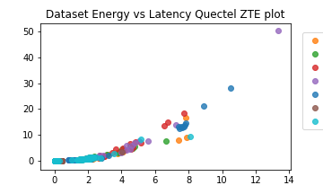

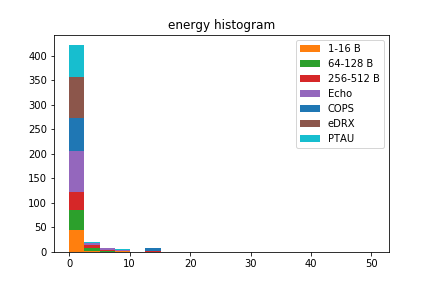

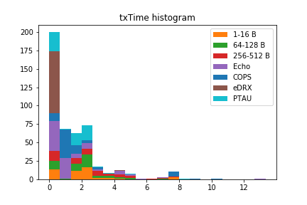

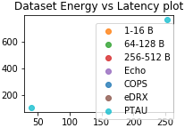

## DRX Tests

### UE/NW Behavior

The DRX values use much energy in connected DRX mode for both ZTE and Nokia. This contrasts with the Vodafone network in Barcelona [@Martinez2019].

In idle-DRX mode, MTN has an interval of 2.56 seconds and Vodacom 10.24 seconds.

### Latency

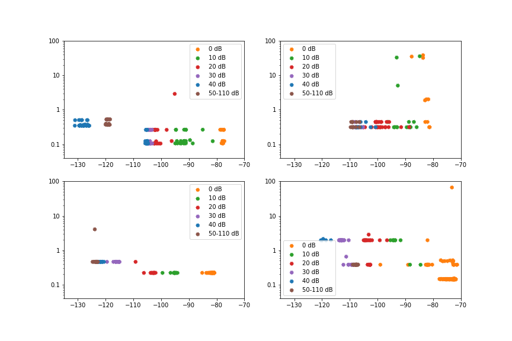

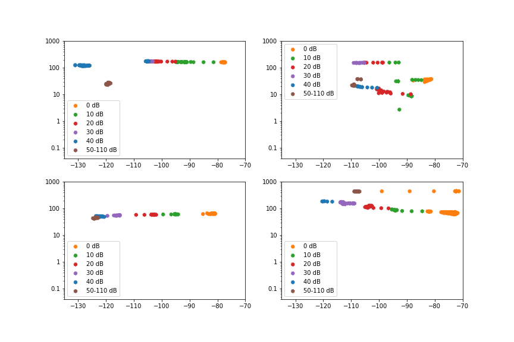

### Energy

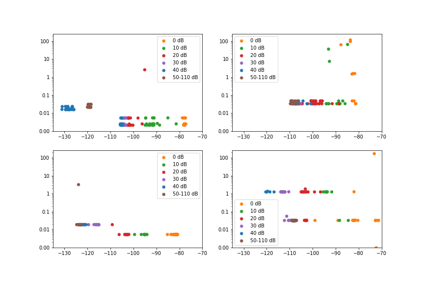

### Cost

NA

## PTAU Tests

### UE/NW Behavior

PTAU was longer for Vodacom than for MTN.

### Latency

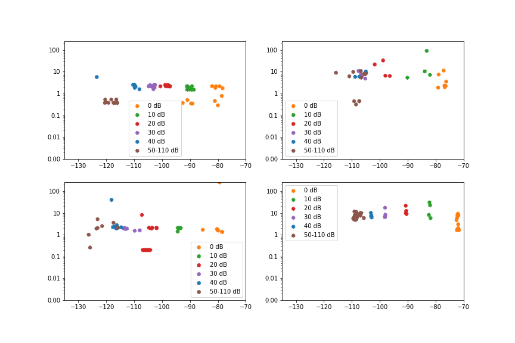

### Energy

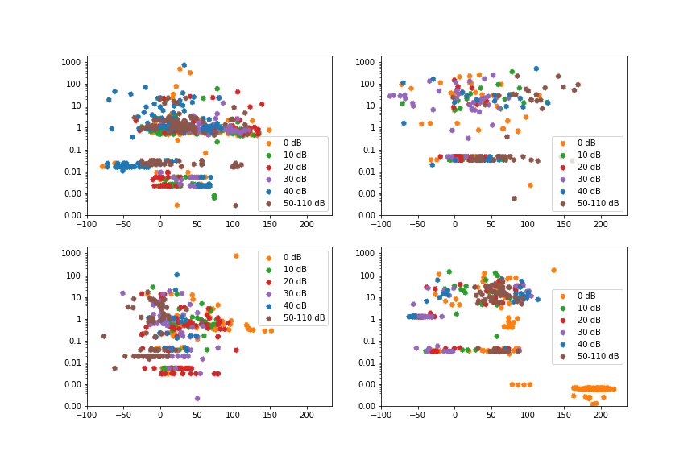

### Cost

NA

## Release Tests

UDP Packet tests

### UE/NW Behavior

RSRP (Reference Signal Received Power) is a measurement of the received signal power from a reference signal in an NB-IoT cell.

TX

RSSI

### Latency

\begin{minipage}{\linewidth}
\begin{center}
\includegraphics[width=1.0\linewidth]{../../code/tests/img/Vodacom_vs_MTN_ZTE_Nokia_Ublox_Quectel_log__UDP_packet_latency_vs_Received_Signal_power.pdf}
\captionof{figure}{Packet latency against RSRP. MTN has variation evenly distributed from -80 to -120 dBm, and vodacom a hotspot centered at 10 seconds and -100 to -110 dBm}
\end{center}
\end{minipage}

\begin{minipage}{\linewidth}
\begin{center}
\includegraphics[width=1.0\linewidth]{../../code/tests/img/Vodacom_vs_MTN_ZTE_Nokia_Ublox_Quectel_log__hist_UDP_packet_latency_histogram.pdf}
\captionof{figure}{MTN has a majority latency under 10 seconds, whilst Vodacom is between 10 and 100 seconds}
\end{center}
\end{minipage}

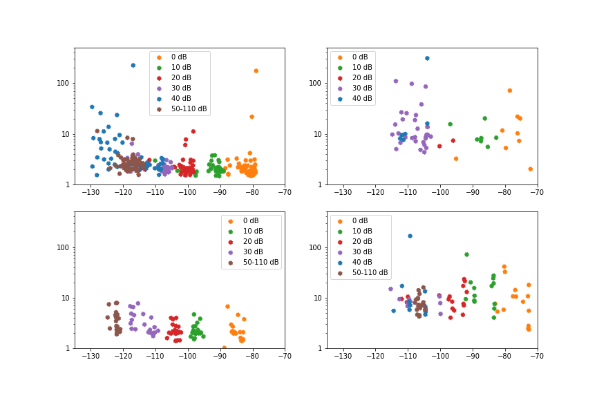

### Energy

\begin{minipage}{\linewidth}
\begin{center}
\includegraphics[width=1.0\linewidth]{../../code/tests/img/Vodacom_vs_MTN_ZTE_Nokia_Ublox_Quectel_log__UDP_packet_energy_vs_Received_Signal_power.pdf}
\captionof{figure}{Packet energy plotted against received signal power of the primary cell tower. Due to the large variation, there is no clear correlation between energy and RSRP}
\end{center}
\end{minipage}

\begin{minipage}{\linewidth}
\begin{center}
\includegraphics[width=1.0\linewidth]{../../code/tests/img/Vodacom_vs_MTN_ZTE_Nokia_Ublox_Quectel_log__hist_UDP_packet_energy_vs_Received_Signal_power.pdf}
\captionof{figure}{Packet energy histogram of the primary cell tower. MTN has a majority energy usage under 10 Joules, whilst Vodacom is between 10 and 100 Joules}
\end{center}
\end{minipage}

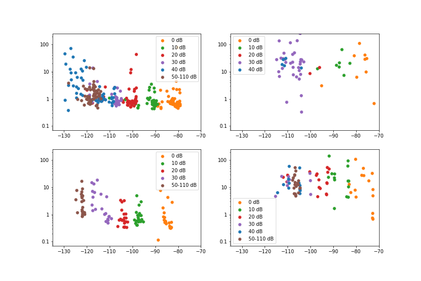

## Cops Tests

### UE/NW Behavior

### Latency

### Energy

### Cost

## Echo Tests

### UE/NW Behavior

### Latency

### Energy

### Cost

# Remaining work and plan

The current data is in the process of being processed and visualised, with results expected next week.

\begin{itemize}
    \item Addition of Nordic and SimCom to testing framework in progress
    \item Capture data from Huawei and Ericsson from Vodacom and MTN in Johannesburg early September.
    \item Write up thesis and complete end of September
\end{itemize}

<!---->

<!---->

<!--\begin{figure}[h!]
  \caption{Packet energy plotted against received signal power of the primary cell tower. Due to the large variation, there is no clear correlation between energy and RSRP}
  \includegraphics[width=1.0\textwidth]{../../code/tests/img/Vodacom_vs_MTN_ZTE_Nokia_Ublox_Quectel_log__UDP_packet_energy_vs_Received_Signal_power.png}
  \captionof{figure}{
\end{figure}-->

<!--\begin{figure}[h!]
  \caption{Packet energy histogram of the primary cell tower. MTN has a majority latency under 10 seconds, whilst Vodacom is between 10 and 100 seconds}
  \includegraphics[width=1.0\textwidth]{../../code/tests/img/Vodacom_vs_MTN_ZTE_Nokia_Ublox_Quectel_log__hist_UDP_packet_energy_vs_Received_Signal_power.png}
  \captionof{figure}{
\end{figure}-->

# References

