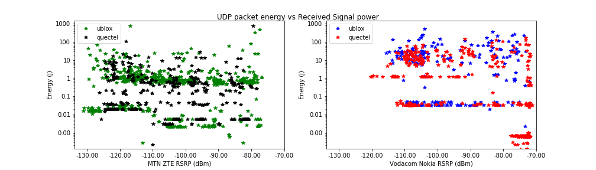
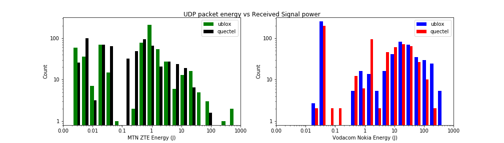
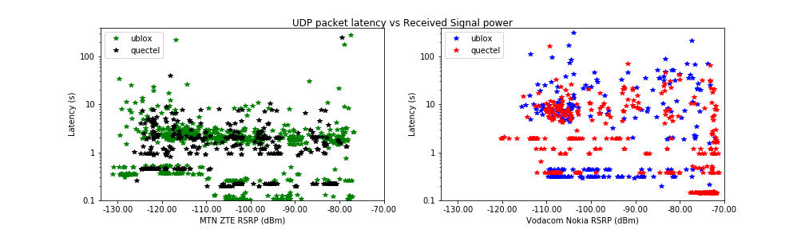
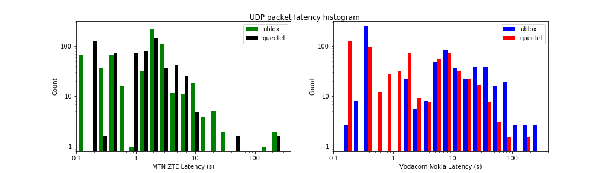

# Objective

Application developers and cellular service providers alike are interested in implementing NB-IoT (LTE Cat-NB) as an alternative to LoRaWAN, SigFox and other LPWANs. Application developers require network coverage, and cellular service providers require consumer and enterprise demand or reasonable motivation before rolling it out nationally. Although there is a great deal of theoretical analysis and simulations in research, the lack of empirical evidence may be contributing to the impasse of growth in the network technology. This thesis aims to bridge that divide.

## Approach

The goal is to test four UE manufacturers against four network vendors with a set of RF metrics.

| NW Vendors | UE Manufacturers | RF Metrics         |
| ---------- | ---------------- | ------------------ |
| ZTE        | Ublox            | Energy Consumption |
| Nokia      | Quectel          | Latency            |
| Ericsson   | Nordic           | Behavior           |
| Huawei     | SimCom           | Cost               |

A unit testing framework has been carefully prepared in Python in combination with a Hewlett Packard rotary RF attenuator in 10dBm steps.

The UE devices are specifically the:
   * Ublox Sara N200
* Quectel BC95
* Nordic nRF9160
* SimCom SIM7020E

# Results

Ublox and Quectel data has been captured for Nokia networks at Vodacom head office in Century City, Cape Town and for ZTE at the MTN Mobile Intelligence Lab, Stellenbosch inside an RF enclosure with the door slightly open before being sealed.

## UE/NW Behavior

RSRP (Reference Signal Received Power) is a measurement of the received signal power from a reference signal in an NB-IoT cell.

TX

RSSI

## Energy

## Latency

# Remaining work and plan

The current data is in the process of being processed and visualised, with results expected next week.

\begin{itemize}
    \item Addition of Nordic and SimCom to testing framework in progress
    \item Capture data from Huawei and Ericsson from Vodacom and MTN in Johannesburg early September.
    \item Write up thesis and complete end of September
\end{itemize}

<!---->

<!---->

<!--\begin{figure}[h!]
  \caption{Packet energy plotted against received signal power of the primary cell tower. Due to the large variation, there is no clear correlation between energy and RSRP}
  \includegraphics[width=1.0\textwidth]{../../code/tests/img/Vodacom_vs_MTN_ZTE_Nokia_Ublox_Quectel_log__UDP_packet_energy_vs_Received_Signal_power.pdf}
\end{figure}-->

<!--\begin{figure}[h!]
  \caption{Packet energy histogram of the primary cell tower. MTN has a majority latency under 10 seconds, whilst Vodacom is between 10 and 100 seconds}
  \includegraphics[width=1.0\textwidth]{../../code/tests/img/Vodacom_vs_MTN_ZTE_Nokia_Ublox_Quectel_log__hist_UDP_packet_energy_vs_Received_Signal_power.pdf}
\end{figure}-->