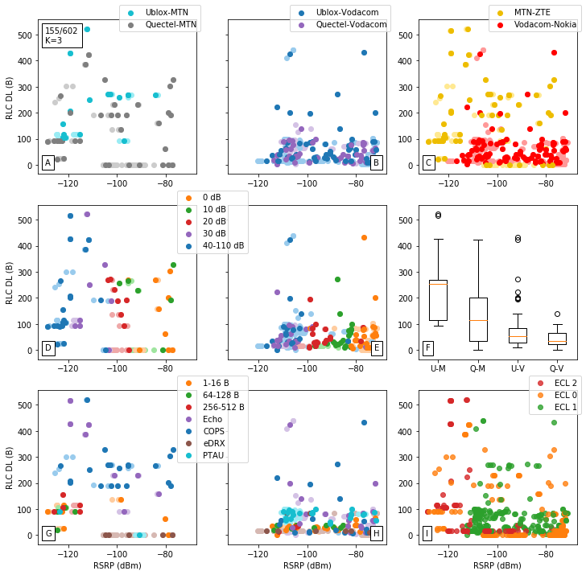
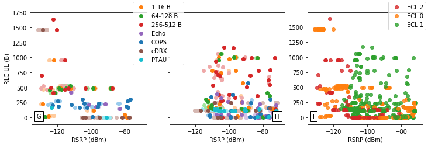

\pagestyle{fancy}
\fancyfoot[CE,CO]{Page \thepage \hspace{1pt} of \pageref{LastPage}}

\newpage

# Results {#results}

This chapter visualizes and analyzes the results from the datasets obtained in Chapter \ref{design}, with comparisons drawn against LTE vendors, UE and MNOs. Metrics are analyzed using UE reports from the modem and measurements using the external energy capture device in \S\ref{energy_capture_device}. The datasets are created using telemetry tests which are performed in various network conditions using RF attenuation, and in some cases an example is shown in ECL Class 1 due to its higher likelihood of being used. Analysis is performed in a two-pronged approach, with the entire dataset which is visualized (format in \S\ref{plots}) in Appendix \ref{appendix_plots}, and mean distributions in Appendix \ref{appendix_measured} and \ref{appendix_ue_reported}.

## Primary Metrics

This section looks at primary metrics as mentioned in \S\ref{proj_descr}. Power efficiency and Latency are primary metrics due to the fact that they can be compared between external measurements and UE reports.

### Latency and Delay

This section presents measured and reported latencies versus signal strength to see the effect of different attenuation zones and telemetry test types for multiple UE and MNOs. Fig. \ref{fig:latency_boxplot} shows us latency values for the entire dataset, and Fig. \ref{fig:latencyECL_boxplot} shows an example in ECL Class 1 network conditions.

\begin{figure}[ht]
  \subfloat[The figure shows latency measurements from Appendix \ref{appendix_measured_latency} with the 25th percentile above 1 second. ZTE, Ericsson and Huawei have a central tendency at 2 seconds, with 95\% of values under 10 seconds. Nokia has a median at 8 seconds and 95th percentile at 60 seconds. Both Ublox and Quectel modems share similar distributions.]{
	\begin{minipage}[c][0.6\width]{
	   0.48\textwidth}
	   \centering
	   \includegraphics[width=1\textwidth]{../../code/tests/box/latency.pdf}
	\end{minipage}}
 \hfill 	
  \subfloat[The figure shows UE reported latency from Appendix \ref{appendix_tx_latency} and \ref{appendix_rx_latency} with the 25th percentile above 200 ms. ZTE, Ericsson and Huawei have a central tendency between 600 and 700 ms, with 95\% or more values under 7 seconds. Nokia has a median at 2 seconds and 95th percentile over 100 seconds. The latency distribution of Quectel modems are slightly better than Ublox, but outliers extend further.]{
	\begin{minipage}[c][0.6\width]{
	   0.48\textwidth}
	   \centering
	   \includegraphics[width=1\textwidth]{../../code/tests/box/latencyEst.pdf}
	\end{minipage}}
\caption{Measured and UE reported latency using telemetry tests from Appendix \ref{appendix_plots} with outliers extending up to 300 seconds. LTE vendors exhibit satisfactory latencies under 10 seconds in 95\% of cases, except for Nokia achieving the target in only 50\% of measurements. Nokia's poor performance results in MTN leading Vodacom in datagram latency in both cases. Looking at the 25th percentile as a baseline, it appears that UE reported latencies are smaller than measured values by a factor up to 5.}
\label{fig:latency_boxplot}
\end{figure}


There is a large discrepancy in the datagram latency between MTN and Vodacom in both Figure \ref{fig:latency_boxplot} and \ref{fig:latencyECL_boxplot} due to Nokia's poor performance. Although LTE vendors show satisfactory latency performance under 10 seconds, Nokia needs to be reconfigured for Vodacom. Ublox modem reports and measurements show similar characteristics to Quectel modem measurements, but the Quectel modem reports characteristics worse than expected in ECL Class 1 measurements. Latency impacts energy consumption and the ability of the UE to update cloud-based applications timeously.


\begin{figure}[ht]
  \subfloat[The figure shows latency measurements from Appendix \ref{appendix_latency_MT}. Ericsson and Huawei show similar distributions with a median at 3 seconds. ZTE too shows a similar distribution, yet with a median extending to just above 1 second. On the other hand, Nokia has a median latency of 20 seconds and the entire distribution is above 10 seconds. With a median around 6 seconds, Quectel is performing slightly better than Ublox modems.]{
	\begin{minipage}[c][0.6\width]{
	   0.48\textwidth}
	   \centering
	   \includegraphics[width=1\textwidth]{../../code/tests/box/latencyECL1.pdf}
	\end{minipage}}
 \hfill 	
  \subfloat[The figure shows mean UE reported latency from Appendix \ref{appendix_tx_latency_RT} and \ref{appendix_rx_latency_RT}. ZTE, Ericsson and Huawei share similar mean latency distributions between 1 and 3 seconds, yet Nokia reports just under 100 seconds. Ublox is performing much better with a mean latency distribution at 5 seconds than Quectel at 40 seconds.]{
	\begin{minipage}[c][0.6\width]{
	   0.48\textwidth}
	   \centering
	   \includegraphics[width=1\textwidth]{../../code/tests/box/latencyEstECL1.pdf}
	\end{minipage}}
\caption{Latency in sending 16-512 byte packet payloads in ECL Class 1 network conditions with a mean distribution baseline around 1 second and ranging up to 100 seconds. MTN shows a better mean latency distribution than Vodacom due to Nokia.}
\label{fig:latencyECL_boxplot}
\end{figure}

### Power Efficiency

\begin{figure}[ht]
  \subfloat[The figure shows measured average power from Appendix \ref{appendix_energy_MP}. Ericsson and Huawei have central tendencies under 100 $\mu{W}{h}$, unlike ZTE and Nokia with 250 and 4000 $\mu{W}{h}$ respectively. Ublox and Quectel modems share similar average power measurement distributions, with Quectel slightly better.]{
	\begin{minipage}[c][0.6\width]{
	   0.48\textwidth}
	   \centering
	   \includegraphics[width=1\textwidth]{../../code/tests/box/avgpower.pdf}
	\end{minipage}}
 \hfill 	
  \subfloat[The figure shows UE reported average power estimation from Appendix \ref{appendix_tx_latency} and \ref{appendix_rx_latency}. ZTE, Ericsson and Huawei show similar central tendencies under 100 $\mu{W}{h}$, yet Nokia is at 400 $\mu{W}{h}$ average power. Ublox and Quectel show similar reported average power distributions, with Quectel slightly better.]{
	\begin{minipage}[c][0.6\width]{
	   0.48\textwidth}
	   \centering
	   \includegraphics[width=1\textwidth]{../../code/tests/box/avgpowerEst.pdf}
	\end{minipage}}
\caption{Average power of telemetry test datagrams with a 25th percentile baseline around 30 $\mu{W}{h}$. LTE vendors show varying results between 30 $\mu{W}{h}$ and 10,000 $\mu{W}{h}$, yet Nokia shows average power consumption worse than ZTE, Ericsson and Huawei by a factor of 20 or more. Quectel shows slightly better values than Ublox modems, and MTN remains the leader for datagram power efficiency for various telemetry tests due to Nokia's poor performance..}
\label{fig:res_avg}
\end{figure}

There is a large discrepancy in the energy consumption between MTN and Vodacom in Figure \ref{fig:res_avg} and \ref{fig:res_avgECL}. Average power measurements and reports from UE modems show that Nokia is consuming more energy than ZTE, Ericsson and Nokia by a factor of 20 or more. Ublox and Quectel show similar average power distributions when considering the entire dataset, yet vary in the mean average power distributions for ECL Class 1. Power consumption impacts battery longevity as in \S\ref{res_battery}.

\begin{figure}[ht]
  \subfloat[Average power measurements from Appendix \ref{appendix_measured}]{
	\begin{minipage}[c][0.6\width]{
	   0.48\textwidth}
	   \centering
	   \includegraphics[width=1\textwidth]{../../code/tests/box/avgpowerECL1.pdf}
	\end{minipage}}
 \hfill 	
  \subfloat[UE reported average power estimation from Appendix \ref{appendix_ue_reported}]{
	\begin{minipage}[c][0.6\width]{
	   0.48\textwidth}
	   \centering
	   \includegraphics[width=1\textwidth]{../../code/tests/box/avgpowerEstECL1.pdf}
	\end{minipage}}
\caption{Average power in sending 16-512 byte packet payloads in ECL Class 1 network conditions}
\label{fig:res_avgECL}
\end{figure}

\newpage

## Secondary Metrics

This section looks at secondary metrics as mentioned in \S\ref{proj_descr}.

### Signal Strength Metrics

It is important to know the signal strength behavior between UE devices and LTE vendors due to varying network conditions in terms of MCL, RSRP, SINR and transmit power. RSSI showed similar characteristics to RSRP, and RSRQ to SINR, and therefore omitted.

#### Maximum Coupling Link

The RF link characteristics between the module and base station are useful in determining the range or indoor penetration the UE device can sustain.

Table: MCL between LTE vendor-MNO pairs and UE using process defined in \S\ref{des_mcl}. {#tbl:mcl_results}

|                | SINR     | MCL        |
| -------------- | -------- | ---------- |
| ZTE-MTN        | -6.95 dB | 165.95 dBm |
| Nokia-Vodacom  | -7.10 dB | 166.10 dBm |
| Ericsson-MTN   | -6.10 dB | 165.10 dBm |
| Huawei-Vodacom | -6.00 dB | 165.00 dBm |
| Ublox          | -7.10 dB | 166.10 dBm |
| Quectel        | -7.60 dB | 166.60 dBm |

In terms of MCL, LTE vendors and UE devices are all performing satisfactorily by meeting the 164 dBm requirement. It should be noted that SINR is a proprietary measurement.

#### Transmit Power

Observing the results in Appendix \ref{appendix_transmit_power_RP}, UE devices decrease their output power at roughly 10 dBm per decade of RSRP amplification from -100 dBm onwards except for Vodacom-Nokia which maintains maximum output power.

#### RSRP and SINR

Since RSSI combines RSRP and transmit power, they are shown separately instead with RSSI omitted. Similarly, since SINR and RSRQ (which is a ratio between RSRP and RSRQ) show similar characteristics, SINR is also sufficient to show.

Table: Minimum RSRP values for LTE vendors and UE. {#tbl:min_rsrp}

|                | Minimum RSRP |
| -------------- | ------------ |
| ZTE-MTN        | -129.6 dBm   |
| Nokia-Vodacom  | -120.0 dBm   |
| Ericsson-MTN   | -131.0 dBm   |
| Huawei-Vodacom | -132.0 dBm   |
| Ublox          | -132.0 dBm   |
| Quectel        | -129.4 dBm   |

\begin{figure}[ht]
  \subfloat[The figure shows UE reported RSRP. Although Ericsson's RSRP extended up to -20 dBm due to laboratory conditions, it is limited to -70 dBm. LTE vendors have similar values at -130 dBm, except for Nokia at -120 dBm, with approximate minimum values shown in Table \ref{tbl:min_rsrp}.]{
	\begin{minipage}[c][0.6\width]{
	   0.48\textwidth}
	   \centering
	   \includegraphics[width=1\textwidth]{../../code/tests/box/RSRPperceived.pdf}
	\end{minipage}}
 \hfill 	
  \subfloat[With respect to LTE vendors, SINR is reported to be approximately from -7 dB to 15 dB, with approximate minimum values shown in Table \ref{tbl:mcl_results}. SINR values are more evenly distributed than RSRP, yet with more outliers.]{
	\begin{minipage}[c][0.6\width]{
	   0.48\textwidth}
	   \centering
	   \includegraphics[width=1\textwidth]{../../code/tests/box/SINRperceived.pdf}
	\end{minipage}}
\caption{UE reported RSRP and SINR for LTE vendors, UE and MNOs. The maximum values depend on where the test took place, before signals are attenuated until disconnection. Ublox and Quectel show similar values, unlike the defined disparity stated in \S\ref{design_sinr}. MTN and Vodacom also show similar values, except for the 10 dBm deterioration in the Vodacom-Nokia RSRP. This deterioration could be as a result of NB-IoT being configured for in-band or guard-band instead of stand-alone. Overall, signal strength in terms of RSRP and SINR shows satisfactory performance, except for Vodacom-Nokia.}
\end{figure}

#### Enhanced Coverage Levels

ECL Classes (in \S\ref{ECLs} and \S\ref{des_ECLs}) increase repetition depending on signal strength between UE device and eNodeB. The section looks at the percentage distribution of ECL Classes in the different datasets and against RSRP. It was not considered to use SINR as it showed similar results.

\begin{figure}[ht]
  \subfloat[The figure shows the percentage distribution of ECL Classes for different datasets. Notably, about 90\% of Nokia's dataset lies within ECL Class 1, as opposed to roughly 50\% of ZTE, Ericsson and Huawei's distribution in ECL Class 0, which means Nokia will impact battery usage more for UE devices. It can be seen that 25\% of Quectel's distribution exists in ECL Class 2, with Ublox showing only half as much. This is significant because it means that Ublox devices fare better in deeper coverage situations than Quectel.]{
	\begin{minipage}[c][0.6\width]{
	   0.48\textwidth}
	   \centering
	   \includegraphics[width=1\textwidth]{../../code/tests/box/ecl_bar.pdf}
	\end{minipage}}
 \hfill 	
  \subfloat[The figure shows the distribution of ECL Classes against RSRP. Transitions between ECL Classes vary between LTE vendors depending on their network configuration and possibly another factor, as there is significant overlap between ECL Class 0 and 1. ECL Class 2 is more well defined, existing from roughly -110 dBm to -130 dBm, except for Nokia which shows values up to -80 dBm.]{
	\begin{minipage}[c][0.6\width]{
	   0.48\textwidth}
	   \centering
	   \includegraphics[width=1\textwidth]{../../code/tests/box/ecl_rsrp.pdf}
	\end{minipage}}
\captionof{figure}[UE reported ECL]{UE reported ECL in percentage distributions and against RSRP. The SINR distribution was considered as it may have been alternative factor influencing ECL, but due to similarities it is not shown henceforth. ECL Classes impact energy consumption, latency and battery longevity depending on location with respect to cell towers for static devices, and it is important that networks don't transition UE devices into higher ECL Classes too early as signal strength decreases.}
\end{figure}

It is also visible in Appendix \ref{appendix_plots} how an RF connection will be treated as ECL Class 0 until approximately -90 dBm. From thence until -110 dBm it will be in ECL Class 1 and any last bit of link budget can be accessed in ECL Class 2 until disconnection at most at -130 dBm. Unfortunately, due to the overlap between ECL Classes, there is only a partial correlation with signal strength, and LTE vendors should work with UE manufacturers to ensure a smoother transition between classes.

Table: The table shows the highest RSRP level at which ECL Classes transition for LTE vendors, as well as when assuming a base RSRP of -70 dBm for a typical device, the indoor penetration is measured before ECL 2 is reached, which results in deep penetration until disconnection. {#tbl:ecl_transitions}

|                | ECL Class 1 | ECL Class 2 | Indoor Penetration | Deep Penetration |
| -------------- | ----------- | ----------- | ------------------ | ---------------- |
| ZTE-MTN        | -85 dBm     | -110 dBm    | 40 dB              | 20 dB            |
| Nokia-Vodacom  | -70 dBm     | -75 dBm     | 5 dB               | 45 dB            |
| Ericsson-MTN   | -90 dbm     | -100 dBm    | 30 dB              | 20 dB            |
| Huawei-Vodacom | -80 dBm     | -120 dBm    | 50 dB              | 10 dB            |

In Table \ref{tbl:ecl_transitions}, ECL Class transitions and signal penetration is observed. Interestingly, ECL Class 1 transitions are quite high which show the overlap with ECL Class 0. In indoor penetration the device will still use relatively low power until deep penetration in ECL Class 2. Application developers will generally want to avoid using deep penetration unless absolutely necessary, due to the high number of repetitions and energy consumption.

### Throughput

This section displays the throughput measurement for the combined RLC and MAC physical layers. These values provide an indication of the efficiency of the radio link. With bad block error rate (BLER > 10\%), these values will be low. With a very good BLER ( < 1\%), these values will be near the theoretical throughput of NB-IoT. It is only over the protocol stack itself and does not take into account the time to wake up, scan for base stations and so forth. As stated in \S\ref{lpwan_comparison}, NB-IoT has a theoretical uplink and downlink throughput of ~250kbps.

\begin{figure}[ht]
  \subfloat[The figure shows RLC and MAC uplink throughput, with 95\% of values under 10 kbps. ZTE is performing best with a central tendency at 4 kbps, and Huawei the least at 1 kbps. It is shown that Nokia, Ericsson, Ublox, Quectel and Vodacom have similar central tendency distributions at 2 kbps, while MTN leads with 3 kbps.]{
	\begin{minipage}[c][0.6\width]{
	   0.48\textwidth}
	   \centering
	   \includegraphics[width=1\textwidth]{../../code/tests/box/mac_rlc_ul.pdf}
	\end{minipage}}
 \hfill 	
  \subfloat[The figure shows RLC and MAC downlink throughput, with 95\% of values under 10 kbps, except for Huawei with 50\% of values just over 10 kbps. Nokia, Ericsson, Ublox, Quectel, MTN and Vodacom all share similar distributions with a central tendency at 500 bps, and with ZTE at just over 1 kbps. Quectel and MTN have 95\% of values at 3 kbps as opposed to Ublox and Vodacom at 10 kbps.]{
	\begin{minipage}[c][0.6\width]{
	   0.48\textwidth}
	   \centering
	   \includegraphics[width=1\textwidth]{../../code/tests/box/mac_rlc_dl.pdf}
	\end{minipage}}
\caption{The figure shows RLC and MAC layer throughput for LTE vendors, UE and MNOs. 95\% of values under 10 kbps, and although Huawei performs the least in uplink at a 1 kbps central tendency, Huawei surprisingly takes the lead in downlink throughput at just over 10 kbps. Quectel and Ublox exhibit similar characteristics and MTN leads Vodacom marginally by a difference of roughly 1 kbps.}
\end{figure}

UE reported throughput values under 10 kbps are well under the 250 kbps speeds claimed by NB-IoT manufacturers in general. However, it is more in line with the Quectel modem claiming single tone uplink and downlink of 21.25 and 15.625 kbps, respectively. On the other hand, although Ublox and Quectel show similar distributions, Ublox claims uplink and downlink of 62.5 and 27.2 kbps, respectively, which shows that Ublox is underperforming. Throughput is necessary to take into account for large data transfers such as captured data, images and FoTA updates, and with low values it would affect energy consumption and latency.

### Data Overhead

\begin{figure}[ht]
  \subfloat[Transmission bytes of all manufacturers and operators, with at least 50\% of values centered between 100 and 1000 bytes except for Nokia which extends further, having a 95th percentile at 10,000 bytes or more in outliers.]{
	\begin{minipage}[c][0.6\width]{
	   0.48\textwidth}
	   \centering
	   \includegraphics[width=1\textwidth]{../../code/tests/box/txBytes.pdf}
	\end{minipage}}
 \hfill 	
  \subfloat[Receive bytes of all manufacturers and operators, with at least 50\% of values centered between 50 and 200 bytes except for Nokia which extends up to a 95th percentile at 2000 bytes, or more in outliers.]{
	\begin{minipage}[c][0.6\width]{
	   0.48\textwidth}
	   \centering
	   \includegraphics[width=1\textwidth]{../../code/tests/box/rxBytes.pdf}
	\end{minipage}}
\caption{Byte size distribution of telemetry test set across different MNOs, LTE Vendors and UE devices with 512 byte limit line (purple). Ublox and Quectel show equal distribution characteristics, while MTN leads Vodacom marginally. In general, 25\% of uplink datagrams extend above 512 byte line and 25\% of downlink datagrams extend past 200 bytes. Nokia extends well past the 512 byte limit to a few thousand bytes in both cases due to repetition caused by the ECL mechanism.}
\end{figure}

Considering the variance in figure \ref{fig:udpsize}, taking the mean would make for a simpler representation per UDP size as in Appendix \ref{appendix_ue_reported}. However, a boxplot representation shows the characteristics of the data more fully with respect to LTE vendors, UE and MNOs. Since the largest UDP packets are 512 bytes in size, a line is drawn at this value for comparison. Data overhead is observed for all telemetry tests at once.

\newpage

## Estimations

### Telemetry Interval {#res_telem_int}

[](../../code/tests/box/intervalECL1.png)

[](../../code/tests/box/intervalEstECL1.png)

\begin{figure}[ht]
  \subfloat[The figure shows estimated telemetry interval using energy measurements from Appendix \ref{appendix_measured}. ZTE, Ericsson and Huawei require messages to be sent within every 5 minutes to an hour to last a year on a 9.36 Wh battery (AA-sized), while Nokia requires a telemetry interval around 10 hours. In these measuremed estimations, Quectel shows better values than Ublox.]{
	\begin{minipage}[c][0.6\width]{
	   0.48\textwidth}
	   \centering
	   \includegraphics[width=1\textwidth]{../../code/tests/box/intervalECL1.pdf}
	\end{minipage}}
 \hfill 	
  \subfloat[The figure shows telemetry interval estimations for UE reported RF time from Appendix \ref{appendix_ue_reported}. ZTE, Ericsson and Huawei require messages to be sent within every 5 to 30 minutes, while Nokia expects a telemetry interval every 6 hours. In these estimations from UE reports, the Ublox modem is shown to be better than the Quectel modem.]{
	\begin{minipage}[c][0.6\width]{
	   0.48\textwidth}
	   \centering
	   \includegraphics[width=1\textwidth]{../../code/tests/box/intervalEstECL1.pdf}
	\end{minipage}}
\caption{Telemetry interval estimation sending 16-512 byte packet payloads in ECL Class 1 network conditions.  Quectel is measured to be better than Ublox, yet Ublox reports better values than Quectel. MTN leads Vodacom due to Nokia's poor performance.}
\end{figure}

### Battery longevity {#res_battery}

[](../../code/tests/box/longevityECL1.png)

[](../../code/tests/box/longevityEstECL1.png)


\begin{figure}[ht]
  \subfloat[The figure shows battery longevity estimations using energy measurements from Appendix \ref{appendix_measured} up to 10 years. ZTE, Ericsson and Huawei show results distributed roughly between 1 to 10 years, while Nokia sits between 2 to 8 weeks. In these measured estimations, the Quectel  modem shows better values than the Ublox modem.]{
	\begin{minipage}[c][0.6\width]{
	   0.48\textwidth}
	   \centering
	   \includegraphics[width=1\textwidth]{../../code/tests/box/longevityECL1.pdf}
	\end{minipage}}
 \hfill 	
  \subfloat[The figure shows UE reported RF time from Appendix \ref{appendix_ue_reported} up to 10 years. ZTE, Ericsson and Huawei show results distributed roughly between 2 to 10 years, while Nokia sits at around 8 weeks. In these estimations from UE reports, the Ublox modem is shown to be better than the Quectel modem.]{
	\begin{minipage}[c][0.6\width]{
	   0.48\textwidth}
	   \centering
	   \includegraphics[width=1\textwidth]{../../code/tests/box/longevityEstECL1.pdf}
	\end{minipage}}
\caption{Battery longevity estimation sending 16-512 byte packet payloads in ECL Class 1 network conditions. According to LTE vendor results, UE devices will last a couple of years up to 10, except for Nokia which will only last a few months. Measurements show Quectel is better than Ublox, yet Ublox reports better results than Quectel. MTN leads Vodacom due to Nokia's dismal performance. Estimation results from UE reports tend to underestimate measured values, and this should be taken into account when a developer uses UE reports in their application.}
\end{figure}

\newpage

## Summary

The study investigated the following metrics and estimations using a set of telemetry tests performed on LTE vendors by UE devices: power efficiency, latency, signal strength, throughput, data overhead, telemetry interval and battery longevity with significant variation observed on all of these. Most clearly visible is how MTN leads Vodacom in results due to Nokia's poor performance. Even so, there still exists a significant degree of variation among LTE vendors which supports the notion that the complexities of network configuration itself do affect quality of service as it is mandatory for LTE vendors to meet 3GPP requirements. More than one UE device was chosen to determine if variation is further exacerbated by type of UE, namely Ublox and Quectel, although these devices return relatively similar results. This shows that the cause of variation lies most likely with the LTE vendors and how MNOs have them configured. 

With regard to the main metrics in this study, power efficiency tests show that UE devices connected to Vodacom-Nokia are using up to 20 times more energy than other LTE vendors. ZTE, Ericsson, and Huawei perform satisfactorily in latency tests, with 95\% of datagrams under the 10 seconds standard by 3GPP, while Nokia results in a 95th percentile at 100 seconds. 

In terms of signal strength, LTE vendors and UE perform satisfactorily by meeting the 164 dBm MCL requirement, yet Vodacom-Nokia shows a minimum RSRP at -120 dBm as opposed to the others at -130 dBm. 90% of Nokia’s dataset lies within ECL Class 1, as opposed to roughly 50% of ZTE, Ericsson and Huawei's distribution in ECL Class 0, which means Nokia will impact battery usage more for UE devices. Due to the overlap in ECL Classes according to RSRP[^sinr_overlap], it suggests only a partial correlation, which means there is another unknown factor[^hysteresis] which influences the dynamic ECL Class provisioning by the network. Nevertheless, looking at the highest RSRP before an ECL Class transitions, it is observed that Nokia can potentially be in ECL Class 2 after 5 dB of attenuation in a typical environment of -70 dBm RSRP, while Huawei is looking at 50 dB of attenuation before requiring deep penetration in ECL Class 2 until -130 dBm RSRP. In terms of transmit power, UE devices generally transmit at max 23 dBm power from -130 dBm to -100 dBm RSRP, whereby they decrease their output power by 10 dB per decade of RSRP amplification from -100 dBm RSRP upwards except for Vodacom-Nokia which maintains maximum output power.

In terms of throughput, UE devices and LTE vendors report a central uplink and downlink averaging 2 kbps and 500 bps, respectively, and extending up to 10 kbps. Surprisingly, although Huawei averages the least at 1 kbps in uplink, it averages 10 kbps in the downlink. Throughput needs to be considered for real-time applications when limited by uplink and downlink speed, and it also affects latency. In observing the data overhead in the telemetry test set, 25% of uplink datagrams extend above 512 byte line and 25% of downlink datagrams extend past 200 bytes. Nokia is shown to be the exception, extending well past a few thousand bytes in both transmission and receive bytes. This has a significant effect on airtime data cost.

The telemetry interval estimate, which indicates the periodicity of telemetry messages to last a year on a 9.36 Wh AA battery, shows that ZTE, Ericsson and Huawei can have UE devices transmit a 16-512 byte message every 5 to 60 minutes. Nokia, on the other hand, requires devices to send a message every 10 hours. Finally, battery longevity estimates which indicate how long a UE device can survive transmitting 16-512 bytes hourly, show that devices connected to a network via ZTE, Ericsson and Huawei can last up to 10 years on a 9.36 Wh AA battery, however, devices on Vodacom-Nokia will only last 2-8 weeks.

[^sinr_overlap]: SINR showed similar values to RSRP.
[^hysteresis]: The test captures did show a degree of hysteresis (a few seconds) in RSRP values when changing attenuations, and this could potentially be a factor.

\newpage

# Conclusion and Recommendations {#conclusion}

This empirical study investigated NB-IoT through metrics and estimations by comparing datasets of telemetry tests performed on long-term-evolution (LTE) vendors, using user-equipment (UE) devices, for mobile-network-operators (MNOs) in South Africa. Research shows that most literature on NB-IoT is based on mathematical models, analysis or simulations. Thus, this study proposes an investigation comparing LTE vendors including ZTE and Ericsson on MTN's network, Nokia and Huawei on Vodacom's network and similar UE devices, Ublox and Quectel, to be used as a control to observe network changes via RF attenuation. The study theorizes that networks are responsible for the variation found in metrics and estimations, due to the high underlying complexity of LTE architecture on which NB-IoT is based. Metrics include power efficiency, latency, signal strength, throughput, data overhead and estimations include telemetry interval and battery longevity. 

Most clearly visible in the tests is how MTN leads Vodacom in results due to Nokia’s subpar performance. Power efficiency and latency shows that when connected to Vodacom-Nokia, results can factor up 20 and 10 times worse, respectively. Otherwise, ZTE, Ericsson and Huawei show satisfactory latency under the 10 second 3GPP standard. Although LTE vendors meet the 164 dBm MCL requirement, Vodacom-Nokia has 10 dB less receive sensitivity, with the rest at -130 dBm. Transmit power increases at 10 dBm per RSRP decade until its maximum at 23 dBm, except for Nokia which remains at full power. ECL Classes overlap with respect to RSRP, yet partially correlate, which suggests an unknown network factor or hysteresis in the test captures. Nevertheless, Nokia is mostly in ECL Class 1, while others are a mix of ECL Class 0 and 1. This has an impact on the number of dynamic repetitions of messages between UE devices and cell-tower eNodeBs. Throughput is under 10 kbps, which is half or less than UE device claims by manufacturers. A quarter of datagrams in the telemetry test set show protocol overhead by extending over 512 bytes in uplink and 200 bytes in downlink, except for Nokia extending up to 10,000 bytes. Telemetry interval and battery longevity estimates on a 9.36 Wh AA battery suggest that ZTE, Ericsson and Huawei can transmit 16-512 bytes every 5 to 30 minutes to last a year, or hourly to last up to 10 years, however, a device that transmits hourly on the Vodacom-Nokia network will only last 2 months.

With these results in mind, it is visible how NB-IoT can certainly be a competitor to other LPWANs such as SigFox and LoRaWAN. Unfortunately the variation induced by network changes, such as from deeper coverage and penetration requirements, are a cause for concern. It is suggested that LTE vendors and UE device manufacturers work together to create an optimum solution, considering that much of the equipment is not open to the public. Nevertheless.. (write-up about what application developers can do already for each metric.)

South Africa is ready for MNOs to deploy national NB-IoT coverage using ZTE, Ericsson and Huawei, but not Nokia. With a satisfactory inter-cell tower distance, UE devices avoid having to use dynamic repetitions in higher ECL Classes, thus keeping the variation that affects many of the metrics and estimates in the study to a minimum.

\newpage

# References {-#references}

<div id="refs"></div>
\newpage

# Appendices {-#appendix}

\appendix

# Measured Metric and Estimation Tables {#appendix_measured}

## Latency {#appendix_latency_MT}


Table: Latency Measurement (s) {#tbl:txTime}

|                  | 16 B | 64 B | 128 B | 256 B | 512 B | Echo | COPS | eDRX | PTAU |
| ---------------- | ---- | ---- | ----- | ----- | ----- | ---- | ---- | ---- | ---- |
| Ublox-ZTE        | 15.5 | 3.54 | 3.60  | 15.3  | 4.97  | 5.04 | 23.3 | 0.39 | 1.87 |
| Quectel-ZTE      | 2.77 | 2.70 | 2.85  | 3.18  | 3.56  | 2.20 | 3.26 | 0.58 | 18.1 |
| Ublox-Nokia      | 21.0 | 15.4 | 32.8  | 72.6  | 13.5  | 26.9 | 97.5 | 5.89 | 13.1 |
| Quectel-Nokia    | 19.0 | 8.84 | 9.22  | 10.6  | 14.0  | 13.3 | 1.88 | 3.67 | 9.38 |
| Ublox-Ericsson   | 2.21 | 2.18 | 2.25  | 2.61  | 2.89  | 27.6 | 8.15 | 0.35 | 1.85 |
| Quectel-Ericsson | 2.56 | 2.14 | 2.20  | 2.14  | 2.46  | 6.85 | 3.93 | 0.39 | 1.64 |
| Ublox-Huawei     | 2.62 | 2.04 | 2.14  | 2.22  | 2.49  | 9.08 | 6.22 | 0.76 | 6.01 |
| Quectel-Huawei   | 30.9 | 6.58 | 12.8  | 16.9  | 10.4  | 11.2 | 7.70 | 0.52 | 11.2 |
| ZTE              | 9.15 | 3.12 | 3.23  | 9.27  | 4.26  | 3.62 | 13.2 | 0.49 | 10.0 |
| Nokia            | 20.0 | 12.1 | 21.0  | 41.6  | 13.8  | 20.1 | 49.7 | 4.78 | 11.2 |
| Ericsson         | 2.39 | 2.16 | 2.22  | 2.37  | 2.67  | 17.2 | 6.04 | 0.37 | 1.74 |
| Huawei           | 16.7 | 4.31 | 7.49  | 9.57  | 6.46  | 10.1 | 6.96 | 0.64 | 8.61 |
| *Ublox*          | 10.3 | 5.80 | 10.2  | 23.2  | 5.98  | 17.1 | 33.8 | 1.85 | 5.72 |
| *Quectel*        | 13.8 | 5.06 | 6.78  | 8.23  | 7.62  | 8.40 | 4.19 | 1.29 | 10.1 |
| MTN              | 5.77 | 2.64 | 2.72  | 5.82  | 3.47  | 10.4 | 9.66 | 0.43 | 5.89 |
| Vodacom          | 18.4 | 8.23 | 14.2  | 25.6  | 10.1  | 15.1 | 28.3 | 2.71 | 9.94 |
| **ECL Class 0**        |      |      |       |       |       |      |      |      |      |
| ZTE              | 8.97 | 1.77 | 2.81  | 9.52  | 2.40  | 2.52 | 11.6 | 0.19 | 43.4 |
| Nokia            |      | 1.17 | 2.75  | 1.38  |       | 19.8 |      | 33.1 | 3.39 |
| Ericsson         | 2.03 | 1.76 | 1.82  | 1.90  | 1.89  | 3.20 | 5.89 | 0.35 | 1.36 |
| Huawei           | 0.71 | 0.51 | 0.55  | 0.51  | 0.80  | 13.4 | 4.38 | 0.21 | 2.05 |
| *Ublox*          | 4.68 | 1.58 | 1.62  | 4.68  | 1.60  | 9.51 | 8.98 | 0.18 | 1.96 |
| *Quectel*        | 1.17 | 1.02 | 2.34  | 1.98  | 0.94  | 9.99 | 1.98 | 16.7 | 23.1 |
| MTN              | 5.50 | 1.76 | 2.31  | 5.71  | 2.14  | 2.86 | 8.77 | 0.27 | 22.4 |
| Vodacom          | 0.35 | 0.84 | 1.65  | 0.95  | 0.40  | 16.6 | 2.19 | 16.7 | 2.72 |
| **ECL Class 1**        |      |      |       |       |       |      |      |      |      |
| ZTE              | 1.18 | 1.30 | 1.23  | 5.50  | 2.93  | 1.21 | 2.02 | 0.12 | 1.45 |
| Nokia            | 20.5 | 12.4 | 21.1  | 41.7  | 13.7  | 19.3 | 26.0 | 0.42 | 9.71 |
| Ericsson         | 2.84 | 2.54 | 2.81  | 3.08  | 3.76  | 19.0 | 2.26 | 0.27 | 2.25 |
| Huawei           | 2.04 | 2.47 | 2.91  | 6.96  | 3.37  | 2.72 | 8.59 | 0.60 | 2.03 |
| *Ublox*          | 6.51 | 5.08 | 9.43  | 21.8  | 6.16  | 14.4 | 14.8 | 0.27 | 3.78 |
| *Quectel*        | 6.79 | 4.29 | 4.64  | 6.82  | 5.76  | 6.71 | 4.63 | 0.44 | 3.94 |
| MTN              | 2.01 | 1.92 | 2.02  | 4.29  | 3.34  | 10.1 | 2.14 | 0.20 | 1.85 |
| Vodacom          | 11.2 | 7.45 | 12.0  | 24.3  | 8.57  | 11.0 | 17.3 | 0.51 | 5.87 |
| **ECL Class 2**        |      |      |       |       |       |      |      |      |      |
| ZTE              | 1.67 | 1.42 | 1.76  | 2.14  | 13.6  | 0.93 | 1.23 | 0.48 | 3.44 |
| Nokia            | 3.88 |      | 4.66  | 8.49  | 7.42  | 23.5 | 55.4 | 3.32 | 45.0 |
| Ericsson         | 1.73 | 1.67 | 1.58  | 1.58  | 2.18  | 15.4 |      |      | 1.31 |
| Huawei           | 31.6 | 7.59 | 10.5  | 12.7  | 10.1  | 25.5 | 10.5 | 0.76 | 19.4 |
| *Ublox*          | 1.00 | 1.06 | 1.03  | 1.12  | 6.50  | 25.3 | 30.0 | 1.51 | 25.9 |
| *Quectel*        | 18.4 | 4.27 | 8.25  | 11.3  | 10.2  | 7.32 | 3.61 | 0.77 | 8.61 |
| MTN              | 1.70 | 1.54 | 1.67  | 1.86  | 7.93  | 8.17 | 0.61 | 0.24 | 2.38 |
| Vodacom          | 17.7 | 3.79 | 7.61  | 10.6  | 8.79  | 24.5 | 33.0 | 2.04 | 32.2 |
|                  |      |      |       |       |       |      |      |      |      |


\newpage
## Average Power


Table: Average Power ($\mu{W}{h}$) {#tbl:energy}

|                  | 16 B   | 64 B   | 128 B   | 256 B   | 512 B   | Echo   | COPS   | eDRX   | PTAU   |
|------------------|--------|--------|---------|---------|---------|--------|--------|--------|--------|
| Ublox-ZTE        | 8306.7 | 1409.9 | 828.29  | 12242.  | 1309.3  | 2719.9 | 11596. | 41.817 | 298.77 |
| Quectel-ZTE      | 739.98 | 500.84 | 554.34  | 897.32  | 1128.5  | 779.02 | 1816.9 | 52.334 | 13778. |
| Ublox-Nokia      | 13718. | 10161. | 11472.  | 31622.  | 6955.6  | 21088. | 47927. | 3778.2 | 11189. |
| Quectel-Nokia    | 7590.8 | 3618.9 | 4420.9  | 6020.0  | 10139.  | 6467.9 | 515.02 | 2083.1 | 5664.0 |
| Ublox-Ericsson   | 273.28 | 234.07 | 291.53  | 453.77  | 730.29  | 9864.6 | 3133.5 | 61.501 | 167.12 |
| Quectel-Ericsson | 205.01 | 149.33 | 178.99  | 143.03  | 345.02  | 2377.7 | 348.18 | 91.928 | 63.772 |
| Ublox-Huawei     | 504.79 | 375.92 | 424.11  | 396.78  | 404.39  | 4635.4 | 3107.1 | 3.7946 | 2005.7 |
| Quectel-Huawei   | 17197. | 1308.5 | 5684.3  | 3126.9  | 2849.1  | 6123.5 | 2292.9 | 0.8597 | 7937.3 |
|                  |        |        |         |         |         |        |        |        |        |
| ZTE              | 4523.3 | 955.41 | 691.31  | 6569.8  | 1218.9  | 1749.4 | 6706.8 | 47.075 | 7038.4 |
| Nokia            | 10654. | 6890.4 | 7946.6  | 18821.  | 8547.5  | 13778. | 24221. | 2930.6 | 8426.8 |
| Ericsson         | 239.14 | 191.70 | 235.26  | 298.40  | 537.66  | 6121.1 | 1740.8 | 76.715 | 115.45 |
| Huawei           | 8851.3 | 842.24 | 3054.2  | 1761.8  | 1626.7  | 5379.4 | 2700.0 | 2.3272 | 4971.5 |
| *Ublox*          | 5700.7 | 3045.4 | 3254.0  | 11178.  | 2349.9  | 9577.0 | 16441. | 971.34 | 3415.3 |
| *Quectel*        | 6433.4 | 1394.4 | 2709.6  | 2546.8  | 3615.5  | 3937.0 | 1243.2 | 557.06 | 6860.8 |
| MTN              | 2381.2 | 573.55 | 463.29  | 3434.1  | 878.30  | 3935.3 | 4223.8 | 61.895 | 3576.9 |
| Vodacom          | 9752.9 | 3866.3 | 5500.4  | 10291.  | 5087.1  | 9578.8 | 13460. | 1466.5 | 6699.2 |
|                  |        |        |         |         |         |        |        |        |        |
| **ECL Class 0**        |        |        |         |         |         |        |        |        |        |
| ZTE              | 4321   | 704.   | 484.    | 6634    | 434.    | 1359   | 5798   | 20.9   | 3543   |
| Nokia            |        | 93.6   | 680.    | 153.    |         | 2118   |        | 1164   | 1110   |
| Ericsson         | 83.3   | 64.6   | 75.9    | 85.0    | 93.3    | 794.   | 1659   | 100.   | 40.4   |
| Huawei           | 14.4   | 6.31   | 5.33    | 69.0    | 36.0    | 3967   | 536.   | 0.07   | 82.0   |
| *Ublox*          | 2109   | 377.   | 235.    | 3185    | 217.    | 9054   | 3892   | 25.8   | 191.   |
| *Quectel*        | 100.   | 57.4   | 387.    | 285.    | 64.9    | 4600   | 104.   | 5856   | 1814   |
| MTN              | 2202   | 384.   | 280.    | 3359    | 264.    | 1077   | 3728   | 60.7   | 1773   |
| Vodacom          | 7.20   | 50.0   | 342.    | 111.    | 18.0    | 1257   | 268.   | 5821   | 596.   |
|                  |        |        |         |         |         |        |        |        |        |
| **ECL Class 1**        |        |        |         |         |         |        |        |        |        |
| ZTE              | 162.   | 217.   | 161.    | 3201    | 581.    | 305.   | 1254   | 0.95   | 228.   |
| Nokia            | 1090   | 7046   | 7968    | 1919    | 8949    | 1199   | 2395   | 23.7   | 6469   |
| Ericsson         | 428.   | 354.   | 465.    | 735.    | 1275    | 7568   | 337.   | 2.03   | 253.   |
| Huawei           | 194.   | 89.5   | 147.    | 1042    | 537.    | 439.   | 4051   | 1.77   | 83.0   |
| *Ublox*          | 3637   | 2722   | 3099    | 9823    | 2629    | 7404   | 1342   | 3.37   | 1898   |
| *Quectel*        | 2209   | 1131   | 1272    | 2263    | 3042    | 2750   | 1375   | 10.9   | 1618   |
| MTN              | 295.   | 285.   | 313.    | 1968    | 928.    | 3937   | 796.   | 1.49   | 240.   |
| Vodacom          | 5551   | 3567   | 4057    | 1011    | 4743    | 6217   | 1400   | 12.7   | 3276   |
|                  |        |        |         |         |         |        |        |        |        |
| **ECL Class 2**        |        |        |         |         |         |        |        |        |        |
| ZTE              | 678.   | 300.   | 461.    | 878.    | 7359    | 521.   | 562.   | 51.3   | 2073   |
| Nokia            | 2022   |        | 3527    | 1753    | 648.    | 1583   | 2017   | 168.   | 5076   |
| Ericsson         | 311.   | 238.   | 276.    | 223.    | 620.    | 6184   |        |        | 98.4   |
| Huawei           | 1337   | 2117   | 4817    | 2832    | 2661    | 1618   | 7596   | 5.60   | 1278   |
| *Ublox*          | 279.   | 318.   | 305.    | 280.    | 3370    | 1459   | 1228   | 12.3   | 2684   |
| *Quectel*        | 7912   | 1009   | 4235    | 2563    | 2275    | 4766   | 1880   | 100.   | 6021   |
| MTN              | 494.   | 269.   | 368.    | 550.    | 3990    | 3353   | 281.   | 25.6   | 1085   |
| Vodacom          | 7697   | 1058   | 4172    | 2293    | 1655    | 1601   | 1388   | 87.2   | 3177   |
|                  |        |        |         |         |         |        |        |        |        |

\newpage
## Telemetry Interval {#appendix_telemetry_MT}


Table: Interval Estimate (hours) using measured energy values for 9.36Wh AA battery (Lithium Thionyl Chloride) to last 1 year. {#tbl:energy_interval}

|                  | 16 B   | 64 B   | 128 B   | 256 B   | 512 B   | Echo   | COPS   | eDRX   | PTAU   |
|------------------|--------|--------|---------|---------|---------|--------|--------|--------|--------|
| Ublox-ZTE        | 7.7742 | 1.3195 | 0.7751  | 11.457  | 1.2197  | 2.5455 | 10.853 | 0.0391 | 0.2796 |
| Quectel-ZTE      | 0.6925 | 0.4687 | 0.5188  | 0.8398  | 1.0562  | 0.7290 | 1.7004 | 0.0489 | 12.894 |
| Ublox-Nokia      | 12.838 | 9.5105 | 10.736  | 29.595  | 6.5097  | 19.736 | 44.855 | 3.5361 | 10.472 |
| Quectel-Nokia    | 7.1042 | 3.3869 | 4.1375  | 5.6341  | 9.4894  | 6.0533 | 0.4820 | 1.9495 | 5.3010 |
| Ublox-Ericsson   | 0.2557 | 0.2190 | 0.2728  | 0.4246  | 0.6834  | 9.2322 | 2.9327 | 0.0575 | 0.1564 |
| Quectel-Ericsson | 0.1918 | 0.1397 | 0.1675  | 0.1338  | 0.3229  | 2.2253 | 0.3258 | 0.0860 | 0.0596 |
| Ublox-Huawei     | 0.4724 | 0.3518 | 0.3969  | 0.3713  | 0.3784  | 4.3382 | 2.9079 | 0.0035 | 1.8771 |
| Quectel-Huawei   | 16.095 | 1.2246 | 5.3199  | 2.9265  | 2.6665  | 5.7310 | 2.1459 | 0.0008 | 7.4285 |
|                  |        |        |         |         |         |        |        |        |        |
| ZTE              | 4.2334 | 0.8941 | 0.6470  | 6.1486  | 1.1379  | 1.6373 | 6.2769 | 0.0440 | 6.5872 |
| Nokia            | 9.9715 | 6.4487 | 7.4372  | 17.614  | 7.9995  | 12.894 | 22.668 | 2.7428 | 7.8866 |
| Ericsson         | 0.2238 | 0.1794 | 0.2201  | 0.2792  | 0.5031  | 5.7287 | 1.6292 | 0.0717 | 0.1080 |
| Huawei           | 8.2839 | 0.7882 | 2.8584  | 1.6489  | 1.5225  | 5.0346 | 2.5269 | 0.0021 | 4.6528 |
| *Ublox*          | 5.3353 | 2.8502 | 3.0454  | 10.462  | 2.1978  | 8.9631 | 15.387 | 0.9090 | 3.1963 |
| *Quectel*        | 6.0210 | 1.3050 | 2.5359  | 2.3835  | 3.3837  | 3.6846 | 1.1635 | 0.5213 | 6.4210 |
| MTN              | 2.2286 | 0.5367 | 0.4335  | 3.2139  | 0.8205  | 3.6830 | 3.9531 | 0.0579 | 3.3476 |
| Vodacom          | 9.1277 | 3.6184 | 5.1478  | 9.6317  | 4.7610  | 8.9647 | 12.597 | 1.3725 | 6.2697 |
|                  |        |        |         |         |         |        |        |        |        |
| **ECL Class 0**        |        |        |         |         |         |        |        |        |        |
| ZTE              | 4.04   | 0.65   | 0.45    | 6.20    | 0.40    | 1.27   | 5.42   | 0.01   | 33.1   |
| Nokia            |        | 0.08   | 0.63    | 0.14    |         | 19.8   |        | 10.8   | 1.03   |
| Ericsson         | 0.07   | 0.06   | 0.07    | 0.07    | 0.08    | 0.74   | 1.55   | 0.09   | 0.03   |
| Huawei           | 0.01   |        |         | 0.06    | 0.03    | 3.71   | 0.50   | 6.70   | 0.07   |
| *Ublox*          | 1.97   | 0.35   | 0.22    | 2.98    | 0.20    | 8.47   | 3.64   | 0.02   | 0.17   |
| *Quectel*        | 0.09   | 0.05   | 0.36    | 0.26    | 0.06    | 4.30   | 0.09   | 5.48   | 16.9   |
| MTN              | 2.06   | 0.36   | 0.26    | 3.14    | 0.24    | 1.00   | 3.48   | 0.05   | 16.6   |
| Vodacom          |        | 0.04   | 0.32    | 0.10    | 0.01    | 11.7   | 0.25   | 5.44   | 0.55   |
|                  |        |        |         |         |         |        |        |        |        |
| **ECL Class 1**        |        |        |         |         |         |        |        |        |        |
| ZTE              | 0.15   | 0.20   | 0.15    | 2.99    | 0.54    | 0.28   | 1.17   |        | 0.21   |
| Nokia            | 10.2   | 6.59   | 7.45    | 17.9    | 8.37    | 11.2   | 22.4   | 0.02   | 6.05   |
| Ericsson         | 0.40   | 0.33   | 0.43    | 0.68    | 1.19    | 7.08   | 0.31   |        | 0.23   |
| Huawei           | 0.18   | 0.08   | 0.13    | 0.97    | 0.50    | 0.41   | 3.79   |        | 0.07   |
| *Ublox*          | 3.40   | 2.54   | 2.90    | 9.19    | 2.46    | 6.92   | 12.5   |        | 1.77   |
| *Quectel*        | 2.06   | 1.05   | 1.19    | 2.11    | 2.84    | 2.57   | 1.28   | 0.01   | 1.51   |
| MTN              | 0.27   | 0.26   | 0.29    | 1.84    | 0.86    | 3.68   | 0.74   |        | 0.22   |
| Vodacom          | 5.19   | 3.33   | 3.79    | 9.47    | 4.43    | 5.81   | 13.1   | 0.01   | 3.06   |
|                  |        |        |         |         |         |        |        |        |        |
| **ECL Class 2**        |        |        |         |         |         |        |        |        |        |
| ZTE              | 0.63   | 0.28   | 0.43    | 0.82    | 6.88    | 0.48   | 0.52   | 0.04   | 1.94   |
| Nokia            | 1.89   |        | 3.30    | 1.64    | 0.60    | 14.8   | 18.8   | 0.16   | 47.5   |
| Ericsson         | 0.29   | 0.22   | 0.25    | 0.20    | 0.58    | 5.78   |        |        | 0.09   |
| Huawei           | 12.5   | 1.98   | 4.50    | 2.65    | 2.49    | 15.1   | 7.10   |        | 11.9   |
| *Ublox*          | 0.26   | 0.29   | 0.28    | 0.26    | 3.15    | 13.6   | 11.5   | 0.01   | 25.1   |
| *Quectel*        | 7.40   | 0.94   | 3.96    | 2.39    | 2.12    | 4.46   | 1.75   | 0.09   | 5.63   |
| MTN              | 0.46   | 0.25   | 0.34    | 0.51    | 3.73    | 3.13   | 0.26   | 0.02   | 1.01   |
| Vodacom          | 7.20   | 0.99   | 3.90    | 2.14    | 1.54    | 14.9   | 12.9   | 0.08   | 29.7   |
|                  |        |        |         |         |         |        |        |        |        |

\newpage
## Battery Longevity {#appendix_battery_MT}


Table: Longevity Estimate (years) for 9.36Wh AA battery (Lithium Thionyl Chloride) with hourly uses. {#tbl:energy_longevity}

|                  | 16 B   | 64 B   | 128 B   | 256 B   | 512 B   | Echo   | COPS   | eDRX   | PTAU   |
|------------------|--------|--------|---------|---------|---------|--------|--------|--------|--------|
| Ublox-ZTE        | 0.128  | 0.757  | 1.289   | 0.087   | 0.816   | 0.392  | 0.092  | 25.55  | 3.576  |
| Quectel-ZTE      | 1.443  | 2.133  | 1.927   | 1.190   | 0.946   | 1.371  | 0.588  | 20.41  | 0.077  |
| Ublox-Nokia      | 0.077  | 0.105  | 0.093   | 0.033   | 0.153   | 0.050  | 0.022  | 0.282  | 0.095  |
| Quectel-Nokia    | 0.140  | 0.295  | 0.241   | 0.177   | 0.105   | 0.165  | 2.074  | 0.512  | 0.188  |
| Ublox-Ericsson   | 3.909  | 4.564  | 3.665   | 2.354   | 1.463   | 0.108  | 0.340  | 17.37  | 6.393  |
| Quectel-Ericsson | 5.211  | 7.154  | 5.969   | 7.470   | 3.096   | 0.449  | 3.068  | 11.62  | 16.75  |
| Ublox-Huawei     | 2.116  | 2.842  | 2.519   | 2.692   | 2.642   | 0.230  | 0.343  | 281.5  | 0.532  |
| Quectel-Huawei   | 0.062  | 0.816  | 0.187   | 0.341   | 0.375   | 0.174  | 0.465  | 1242.  | 0.134  |
|                  |        |        |         |         |         |        |        |        |        |
| ZTE              | 0.236  | 1.118  | 1.545   | 0.162   | 0.876   | 0.610  | 0.159  | 22.69  | 0.151  |
| Nokia            | 0.100  | 0.155  | 0.134   | 0.056   | 0.125   | 0.077  | 0.044  | 0.364  | 0.126  |
| Ericsson         | 4.467  | 5.573  | 4.541   | 3.580   | 1.987   | 0.174  | 0.613  | 13.92  | 9.255  |
| Huawei           | 0.120  | 1.268  | 0.349   | 0.606   | 0.656   | 0.198  | 0.395  | 459.1  | 0.214  |
| *Ublox*          | 0.187  | 0.350  | 0.328   | 0.095   | 0.454   | 0.111  | 0.064  | 1.100  | 0.312  |
| *Quectel*        | 0.166  | 0.766  | 0.394   | 0.419   | 0.295   | 0.271  | 0.859  | 1.918  | 0.155  |
| MTN              | 0.448  | 1.862  | 2.306   | 0.311   | 1.216   | 0.271  | 0.252  | 17.26  | 0.298  |
| Vodacom          | 0.109  | 0.276  | 0.194   | 0.103   | 0.210   | 0.111  | 0.079  | 0.728  | 0.159  |
|                  |        |        |         |         |         |        |        |        |        |
| **ECL Class 0**        |        |        |         |         |         |        |        |        |        |
| ZTE              | 0.24   | 1.51   | 2.20    | 0.16    | 2.45    | 0.78   | 0.18   | 51.1   | 0.03   |
| Nokia            |        | 11.4   | 1.57    | 6.97    |         | 0.05   |        | 0.09   | 0.96   |
| Ericsson         | 12.8   | 16.5   | 14.0    | 12.5    | 11.4    | 1.34   | 0.64   | 10.6   | 26.4   |
| Huawei           | 74.1   | 169.   | 200.    | 15.4    | 29.6    | 0.26   | 1.99   | 1492   | 13.0   |
| *Ublox*          | 0.50   | 2.83   | 4.53    | 0.33    | 4.91    | 0.11   | 0.27   | 41.3   | 5.58   |
| *Quectel*        | 10.6   | 18.5   | 2.75    | 3.74    | 16.4    | 0.23   | 10.1   | 0.18   | 0.05   |
| MTN              | 0.48   | 2.77   | 3.81    | 0.31    | 4.04    | 0.99   | 0.28   | 17.5   | 0.06   |
| Vodacom          | 148.   | 21.3   | 3.11    | 9.61    | 59.2    | 0.08   | 3.98   | 0.18   | 1.79   |
|                  |        |        |         |         |         |        |        |        |        |
| **ECL Class 1**        |        |        |         |         |         |        |        |        |        |
| ZTE              | 6.58   | 4.92   | 6.59    | 0.33    | 1.83    | 3.50   | 0.85   | 1116   | 4.67   |
| Nokia            | 0.09   | 0.15   | 0.13    | 0.05    | 0.11    | 0.08   | 0.04   | 44.8   | 0.16   |
| Ericsson         | 2.49   | 3.01   | 2.29    | 1.45    | 0.83    | 0.14   | 3.16   | 523.   | 4.22   |
| Huawei           | 5.49   | 11.9   | 7.26    | 1.02    | 1.98    | 2.43   | 0.26   | 600.   | 12.8   |
| *Ublox*          | 0.29   | 0.39   | 0.34    | 0.10    | 0.40    | 0.14   | 0.07   | 316.   | 0.56   |
| *Quectel*        | 0.48   | 0.94   | 0.83    | 0.47    | 0.35    | 0.38   | 0.77   | 97.8   | 0.66   |
| MTN              | 3.61   | 3.73   | 3.40    | 0.54    | 1.15    | 0.27   | 1.34   | 713.   | 4.43   |
| Vodacom          | 0.19   | 0.29   | 0.26    | 0.10    | 0.22    | 0.17   | 0.07   | 83.5   | 0.32   |
|                  |        |        |         |         |         |        |        |        |        |
| **ECL Class 2**        |        |        |         |         |         |        |        |        |        |
| ZTE              | 1.57   | 3.55   | 2.31    | 1.21    | 0.14    | 2.04   | 1.90   | 20.7   | 0.51   |
| Nokia            | 0.52   |        | 0.30    | 0.60    | 1.64    | 0.06   | 0.05   | 6.32   | 0.02   |
| Ericsson         | 3.43   | 4.48   | 3.86    | 4.79    | 1.72    | 0.17   |        |        | 10.8   |
| Huawei           | 0.07   | 0.50   | 0.22    | 0.37    | 0.40    | 0.06   | 0.14   | 190.   | 0.08   |
| *Ublox*          | 3.81   | 3.35   | 3.49    | 3.80    | 0.31    | 0.07   | 0.08   | 86.6   | 0.03   |
| *Quectel*        | 0.13   | 1.05   | 0.25    | 0.41    | 0.46    | 0.22   | 0.56   | 10.6   | 0.17   |
| MTN              | 2.15   | 3.96   | 2.89    | 1.93    | 0.26    | 0.31   | 3.80   | 41.5   | 0.98   |
| Vodacom          | 0.13   | 1.00   | 0.25    | 0.46    | 0.64    | 0.06   | 0.07   | 12.2   | 0.03   |
|                  |        |        |         |         |         |        |        |        |        |

\newpage

# UE Reported Metric and Estimation Tables {#appendix_ue_reported}

## RF Transmit Time {#appendix_tx_latency_RT}

Table: TX Time (s) {#tbl:txTimeNW}

|                  | 16 B | 64 B | 128 B | 256 B | 512 B | Echo | COPS | eDRX | PTAU |
| ---------------- | ---- | ---- | ----- | ----- | ----- | ---- | ---- | ---- | ---- |
| Ublox-ZTE        | 1.26 | 0.65 | 0.87  | 1.20  | 0.56  | 0.43 | 0.26 |      | 0.14 |
| Quectel-ZTE      | 0.34 | 0.49 | 0.62  | 0.87  | 1.28  | 0.33 | 0.19 | 0.88 | 0.33 |
| Ublox-Nokia      | 1.38 | 1.74 | 2.13  | 2.74  | 3.77  | 1.65 | 4.19 | 2.56 | 1.55 |
| Quectel-Nokia    | 2.76 |      |       |       |       | 1.01 | 1.90 | 0.22 | 1.52 |
| Ublox-Ericsson   | 0.43 | 0.49 | 0.58  | 0.81  | 1.16  | 1.57 | 0.07 |      | 0.38 |
| Quectel-Ericsson | 0.21 | 0.20 | 0.24  | 0.28  | 0.38  | 0.40 | 0.49 |      | 0.17 |
| Ublox-Huawei     | 0.65 | 0.56 | 0.92  | 0.75  | 0.70  | 2.72 |      |      | 1.06 |
| Quectel-Huawei   | 0.67 | 0.49 | 0.88  | 0.79  | 0.86  | 0.84 | 0.15 |      | 1.05 |
| ZTE              | 0.80 | 0.57 | 0.74  | 1.04  | 0.92  | 0.38 | 0.23 | 0.44 | 0.23 |
| Nokia            | 2.07 | 0.87 | 1.06  | 1.37  | 1.88  | 1.33 | 3.05 | 1.39 | 1.54 |
| Ericsson         | 0.32 | 0.34 | 0.41  | 0.55  | 0.77  | 0.99 | 0.28 |      | 0.28 |
| Huawei           | 0.66 | 0.52 | 0.90  | 0.77  | 0.78  | 1.78 | 0.07 |      | 1.06 |
| *Ublox*          | 0.93 | 0.86 | 1.12  | 1.38  | 1.55  | 1.59 | 1.13 | 0.64 | 0.78 |
| *Quectel*        | 0.99 | 0.29 | 0.43  | 0.48  | 0.63  | 0.65 | 0.69 | 0.27 | 0.77 |
| MTN              | 0.56 | 0.46 | 0.58  | 0.79  | 0.85  | 0.69 | 0.25 | 0.22 | 0.26 |
| Vodacom          | 1.37 | 0.70 | 0.98  | 1.07  | 1.33  | 1.56 | 1.56 | 0.69 | 1.30 |
|                  |      |      |       |       |       |      |      |      |      |
| **ECL Class 0**        |      |      |       |       |       |      |      |      |      |
| ZTE              | 0.64 | 0.32 | 0.54  | 0.64  | 0.45  | 0.21 | 0.13 |      | 0.12 |
| Nokia            |      |      |       |       |       | 2.70 |      | 0.11 | 0.38 |
| Ericsson         | 0.17 | 0.18 | 0.20  | 0.25  | 0.33  | 0.20 | 0.12 |      | 0.14 |
| Huawei           | 0.15 | 0.08 | 0.16  | 0.10  | 0.17  | 0.77 |      |      | 0.11 |
| *Ublox*          | 0.35 | 0.26 | 0.32  | 0.37  | 0.36  | 1.04 | 0.08 |      | 0.15 |
| *Quectel*        | 0.12 | 0.03 | 0.12  | 0.13  | 0.11  | 0.90 | 0.04 | 0.05 | 0.23 |
| MTN              | 0.40 | 0.25 | 0.37  | 0.45  | 0.39  | 0.21 | 0.12 |      | 0.13 |
| Vodacom          | 0.07 | 0.04 | 0.08  | 0.05  | 0.08  | 1.74 |      | 0.05 | 0.25 |
|                  |      |      |       |       |       |      |      |      |      |
| **ECL Class 1**        |      |      |       |       |       |      |      |      |      |
| ZTE              | 1.08 | 0.12 | 0.17  | 0.15  | 0.27  | 0.04 | 0.07 |      | 0.06 |
| Nokia            | 2.07 | 0.87 | 1.06  | 1.37  | 1.88  | 0.78 | 0.49 | 1.28 | 1.71 |
| Ericsson         | 0.55 | 0.61 | 0.75  | 1.08  | 1.57  | 0.29 | 0.56 |      | 0.48 |
| Huawei           | 0.28 | 0.24 | 0.42  | 0.32  | 0.66  | 0.96 | 0.07 |      | 0.32 |
| *Ublox*          | 1.13 | 0.77 | 0.95  | 1.28  | 1.83  | 0.57 |      | 0.64 | 0.78 |
| *Quectel*        | 0.87 | 0.15 | 0.25  | 0.18  | 0.35  | 0.46 | 0.60 |      | 0.50 |
| MTN              | 0.82 | 0.36 | 0.46  | 0.62  | 0.92  | 0.16 | 0.31 |      | 0.27 |
| Vodacom          | 1.18 | 0.55 | 0.74  | 0.84  | 1.27  | 0.87 | 0.28 | 0.64 | 1.01 |
|                  |      |      |       |       |       |      |      |      |      |
| **ECL Class 2**        |      |      |       |       |       |      |      |      |      |
| ZTE              | 2.88 | 0.40 | 0.53  | 4.34  | 1.25  | 0.21 | 0.12 | 0.44 | 0.28 |
| Nokia            |      |      |       |       |       | 2.51 | 4.90 |      |      |
| Ericsson         | 0.22 | 0.22 | 0.27  | 0.37  | 0.52  | 2.27 |      |      | 0.18 |
| Huawei           | 1.29 | 1.56 | 1.52  | 1.55  | 1.17  | 3.54 |      |      | 2.19 |
| *Ublox*          | 1.71 | 0.48 | 0.44  | 2.08  | 0.34  | 3.95 | 1.04 |      | 0.53 |
| *Quectel*        | 0.48 | 0.61 | 0.71  | 1.05  | 1.13  | 0.31 | 1.46 | 0.22 | 0.79 |
| MTN              | 1.55 | 0.31 | 0.40  | 2.35  | 0.88  | 1.24 | 0.06 | 0.22 | 0.23 |
| Vodacom          | 0.64 | 0.78 | 0.76  | 0.77  | 0.58  | 3.03 | 2.45 |      | 1.09 |
|                  |      |      |       |       |       |      |      |      |      |

\newpage

## RF Receive Time {#appendix_rx_latency_RT}

Table: RX Time (s) {#tbl:rxTimeNW}

|                  | 16 B | 64 B | 128 B | 256 B | 512 B | Echo | COPS | eDRX | PTAU |
| ---------------- | ---- | ---- | ----- | ----- | ----- | ---- | ---- | ---- | ---- |
| Ublox-ZTE        | 5.43 | 5.37 | 5.88  | 4.57  | 6.56  | 1.73 | 1.50 | 0.18 | 1.23 |
| Quectel-ZTE      | 1.77 | 1.68 | 1.69  | 1.66  | 1.82  | 0.16 | 1.21 | 0.37 | 1.17 |
| Ublox-Nokia      | 47.8 | 14.2 | 16.7  | 3.80  | 6.23  | 3.10 | 1.02 | 1.77 | 9.50 |
| Quectel-Nokia    | 139. | 162. | 168.  | 159.  | 170.  | 1.78 | 6.39 | 18.6 | 6.13 |
| Ublox-Ericsson   | 1.36 | 1.27 | 1.26  | 1.30  | 1.32  | 9.43 |      | 0.29 | 1.12 |
| Quectel-Ericsson | 1.42 | 1.26 | 1.26  | 1.24  | 1.35  | 10.3 | 1.76 | 0.30 | 0.93 |
| Ublox-Huawei     | 0.99 | 0.81 | 0.85  | 0.86  | 0.98  | 74.4 |      | 0.64 | 4.49 |
| Quectel-Huawei   | 26.2 | 3.41 | 3.39  | 7.17  | 5.06  | 29.8 | 5.59 | 0.37 | 6.50 |
|                  |      |      |       |       |       |      |      |      |      |
| ZTE              | 3.60 | 3.52 | 3.79  | 3.11  | 4.19  | 0.95 | 1.36 | 0.28 | 1.20 |
| Nokia            | 93.6 | 88.1 | 92.5  | 81.6  | 88.1  | 2.44 | 3.70 | 10.2 | 7.82 |
| Ericsson         | 1.39 | 1.27 | 1.26  | 1.27  | 1.33  | 9.91 | 0.88 | 0.29 | 1.02 |
| Huawei           | 13.6 | 2.11 | 2.12  | 4.01  | 3.02  | 52.1 | 2.79 | 0.50 | 5.50 |
| *Ublox*          | 13.9 | 5.42 | 6.20  | 2.63  | 3.77  | 22.1 | 0.63 | 0.72 | 4.09 |
| *Quectel*        | 42.1 | 42.1 | 43.6  | 42.3  | 44.5  | 10.5 | 3.74 | 4.92 | 3.68 |
| MTN              | 2.49 | 2.40 | 2.53  | 2.19  | 2.76  | 5.43 | 1.12 | 0.28 | 1.11 |
| Vodacom          | 53.6 | 45.1 | 47.3  | 42.8  | 45.5  | 27.3 | 3.25 | 5.35 | 6.66 |
|                  |      |      |       |       |       |      |      |      |      |
| **ECL Class 0**        |      |      |       |       |       |      |      |      |      |
| ZTE              | 3.60 | 2.68 | 3.69  | 3.22  | 3.01  | 0.86 | 0.75 | 0.09 | 1.16 |
| Nokia            | 13.7 |      |       |       |       | 3.29 |      |      | 1.92 |
| Ericsson         | 1.16 | 1.10 | 1.06  | 1.13  | 1.09  | 5.19 | 0.45 | 0.27 | 0.84 |
| Huawei           | 0.28 | 0.17 | 0.86  | 0.18  | 0.32  | 39.4 |      | 0.11 | 1.27 |
| *Ublox*          | 8.65 | 1.70 | 1.82  | 1.50  | 1.63  | 0.48 | 0.37 | 0.12 | 1.31 |
| *Quectel*        | 0.74 | 0.27 | 0.98  | 0.77  | 0.57  | 23.9 | 0.22 | 0.12 | 1.28 |
| MTN              | 2.38 | 1.89 | 2.38  | 2.18  | 2.05  | 3.03 | 0.60 | 0.18 | 1.00 |
| Vodacom          | 7.00 | 0.08 | 0.43  | 0.09  | 0.16  | 21.3 |      | 0.05 | 1.59 |
|                  |      |      |       |       |       |      |      |      |      |
| **ECL Class 1**        |      |      |       |       |       |      |      |      |      |
| ZTE              | 0.84 | 0.87 | 0.88  | 0.69  | 0.90  | 0.07 | 0.71 | 0.07 | 0.75 |
| Nokia            | 102. | 88.1 | 92.5  | 81.6  | 88.1  | 2.65 | 2.99 | 17.7 | 6.90 |
| Ericsson         | 1.65 | 1.36 | 1.45  | 1.34  | 1.61  | 4.52 | 2.16 | 0.22 | 1.26 |
| Huawei           | 0.94 | 1.02 | 1.30  | 1.09  | 1.32  | 46.7 | 2.79 | 0.48 | 1.20 |
| *Ublox*          | 13.8 | 4.14 | 4.81  | 1.53  | 2.22  | 20.5 |      | 0.75 | 2.60 |
| *Quectel*        | 39.0 | 41.5 | 43.2  | 40.8  | 43.7  | 6.51 | 4.33 | 8.52 | 2.45 |
| MTN              | 1.25 | 1.11 | 1.16  | 1.01  | 1.26  | 2.30 | 1.44 | 0.14 | 1.00 |
| Vodacom          | 51.6 | 44.5 | 46.9  | 41.3  | 44.7  | 24.7 | 2.89 | 9.13 | 4.05 |
|                  |      |      |       |       |       |      |      |      |      |
| **ECL Class 2**        |      |      |       |       |       |      |      |      |      |
| ZTE              | 0.93 | 0.79 | 0.87  | 4.21  | 11.5  | 0.09 | 0.49 | 0.26 | 0.59 |
| Nokia            | 20.4 |      |       |       |       | 0.93 | 3.60 | 1.08 | 28.7 |
| Ericsson         | 1.04 | 0.92 | 0.95  | 0.88  | 1.02  | 5.48 |      |      | 0.73 |
| Huawei           | 20.2 | 3.92 | 3.12  | 7.23  | 4.11  | 46.2 |      | 0.65 | 12.6 |
| *Ublox*          | 0.47 | 0.42 | 0.43  | 2.07  | 5.65  | 24.5 |      | 0.36 | 17.1 |
| *Quectel*        | 20.8 | 2.39 | 2.04  | 4.09  | 2.66  | 1.83 | 2.05 | 0.63 | 4.27 |
| MTN              | 0.98 | 0.86 | 0.91  | 2.54  | 6.26  | 2.79 | 0.24 | 0.13 | 0.66 |
| Vodacom          | 20.3 | 1.96 | 1.56  | 3.61  | 2.05  | 23.6 | 1.80 | 0.86 | 20.7 |
|                  |      |      |       |       |       |      |      |      |      |

\newpage

## Average Power Estimate

Table: Average Power ($\mu{W}{h}$) {#tbl:energyE}

|                  | 16 B    | 64 B    | 128 B    | 256 B   | 512 B    | Echo    | COPS    | eDRX    | PTAU    |
| ---------------- | ------- | ------- | -------- | ------- | -------- | ------- | ------- | ------- | ------- |
| Ublox-ZTE        | 640.80  | 484.70  | 570.30   | 574.20  | 533.60   | 211.30  | 155.00  | 10.80   | 108.80  |
| Quectel-ZTE      | 191.20  | 223.30  | 256.40   | 317.10  | 429.20   | 92.10   | 120.10  | 22.20   | 152.70  |
| Ublox-Nokia      | 3213.00 | 1287.00 | 1534.50  | 913.00  | 1316.30  | 598.50  | 1108.70 | 106.20  | 957.50  |
| Quectel-Nokia    | 9030.00 | 9720.00 | 10080.00 | 9540.00 | 10200.00 | 359.30  | 858.40  | 1116.00 | 747.80  |
| Ublox-Ericsson   | 189.10  | 198.70  | 220.60   | 280.50  | 369.20   | 958.30  | 17.50   | 17.40   | 162.20  |
| Quectel-Ericsson | 137.70  | 125.60  | 135.60   | 144.40  | 176.00   | 718.00  | 228.10  | 18.00   | 98.30   |
| Ublox-Huawei     | 221.90  | 188.60  | 281.00   | 239.10  | 233.80   | 5144.00 |         | 38.40   | 534.40  |
| Quectel-Huawei   | 1739.50 | 327.10  | 423.40   | 627.70  | 518.60   | 1998.00 | 372.90  | 22.20   | 652.50  |
|                  |         |         |          |         |          |         |         |         |         |
| ZTE              | 416.00  | 353.70  | 412.40   | 446.60  | 481.40   | 152.00  | 139.10  | 16.80   | 129.50  |
| Nokia            | 6133.50 | 5503.50 | 5815.00  | 5238.50 | 5756.00  | 478.90  | 984.50  | 612.00  | 854.20  |
| Ericsson         | 163.40  | 161.20  | 178.10   | 213.70  | 272.30   | 842.10  | 122.80  | 17.40   | 131.20  |
| Huawei           | 981.00  | 256.60  | 352.20   | 433.10  | 376.20   | 3571.00 | 184.90  | 30.00   | 595.00  |
| Ublox            | 1066.50 | 540.20  | 652.00   | 502.80  | 613.70   | 1723.50 | 320.30  | 43.20   | 440.40  |
| Quectel          | 2773.50 | 2598.50 | 2723.50  | 2658.00 | 2827.50  | 792.50  | 396.90  | 295.20  | 413.30  |
| MTN              | 289.40  | 259.00  | 296.80   | 328.90  | 378.10   | 498.30  | 129.70  | 16.80   | 131.60  |
| Vodacom          | 3558.50 | 2881.00 | 3083.00  | 2835.50 | 3062.50  | 2028.00 | 585.00  | 321.00  | 724.60  |
|                  |         |         |          |         |          |         |         |         |         |
| **ECL Class 0**      |         |         |          |         |          |         |         |         |         |
| ZTE              | 376.00  | 240.80  | 356.40   | 353.20  | 293.10   | 104.10  | 77.50   | 5.40    | 99.60   |
| Nokia            | 822.00  |         |          |         |          | 872.40  |         |         | 210.20  |
| Ericsson         | 112.10  | 111.00  | 113.60   | 130.30  | 147.90   | 361.40  | 57.00   | 16.20   | 85.40   |
| Huawei           | 54.30   | 30.20   | 91.60    | 35.80   | 61.70    | 2556.50 |         | 6.60    | 103.70  |
| Ublox            | 606.50  | 167.00  | 189.20   | 182.50  | 187.80   | 288.80  | 42.20   | 7.20    | 116.10  |
| Quectel          | 74.40   | 23.70   | 88.80    | 78.70   | 61.70    | 1659.00 | 23.20   | 7.20    | 134.30  |
| MTN              | 242.80  | 175.90  | 235.30   | 243.30  | 220.50   | 234.30  | 66.00   | 10.80   | 92.50   |
| Vodacom          | 437.50  | 14.80   | 45.80    | 17.90   | 29.60    | 1713.00 |         | 3.00    | 157.90  |
|                  |         |         |          |         |          |         |         |         |         |
| **ECL Class 1**      |         |         |          |         |          |         |         |         |         |
| ZTE              | 320.40  | 82.20   | 95.30    | 78.90   | 121.50   | 14.20   | 60.10   | 4.20    | 60.00   |
| Nokia            | 6637.50 | 5503.50 | 5815.00  | 5238.50 | 5756.00  | 354.00  | 301.90  | 1062.00 | 841.50  |
| Ericsson         | 236.50  | 234.10  | 274.50   | 350.40  | 489.10   | 343.70  | 269.60  | 13.20   | 195.60  |
| Huawei           | 126.40  | 121.20  | 183.00   | 145.40  | 244.20   | 3042.00 | 184.90  | 28.80   | 152.00  |
| Ublox            | 1110.50 | 440.90  | 526.10   | 411.80  | 590.70   | 1372.50 |         | 45.00   | 351.00  |
| Quectel          | 2557.50 | 2527.50 | 2654.50  | 2493.00 | 2709.50  | 505.60  | 409.80  | 511.20  | 272.00  |
| MTN              | 280.00  | 156.60  | 184.60   | 215.60  | 305.60   | 178.00  | 163.90  | 8.40    | 127.50  |
| Vodacom          | 3391.00 | 2807.50 | 2999.00  | 2688.00 | 2999.50  | 1699.50 | 243.40  | 547.80  | 495.50  |
|                  |         |         |          |         |          |         |         |         |         |
| **ECL Class 2**      |         |         |          |         |          |         |         |         |         |
| ZTE              | 775.80  | 147.40  | 184.70   | 1337.60 | 1002.50  | 57.90   | 59.40   | 15.60   | 105.40  |
| Nokia            | 1224.00 |         |          |         |          | 683.30  | 1441.00 | 64.80   | 1722.00 |
| Ericsson         | 117.40  | 110.20  | 124.50   | 145.30  | 191.20   | 896.30  |         |         | 88.80   |
| Huawei           | 1534.50 | 625.20  | 567.20   | 821.30  | 539.10   | 3657.00 |         | 39.00   | 1303.50 |
| Ublox            | 455.70  | 145.20  | 135.80   | 644.20  | 424.00   | 2457.50 | 260.00  | 21.60   | 1158.50 |
| Quectel          | 1368.00 | 295.90  | 299.90   | 507.90  | 442.10   | 187.30  | 488.00  | 37.80   | 453.70  |
| MTN              | 446.30  | 129.10  | 154.60   | 739.90  | 595.60   | 477.40  | 29.40   | 7.80    | 97.10   |
| Vodacom          | 1378.00 | 312.60  | 283.60   | 409.10  | 268.00   | 2173.50 | 720.50  | 51.60   | 1514.50 |

\newpage

## Telemetry Interval {#appendix_telemetry_RT}

Table: Interval Estimate in minutes using reported RX, TX Time for 9.36Wh AA battery (Lithium Thionyl Chloride) to last 1 year. {#tbl:energy_interval}

|                  | 16 B   | 64 B   | 128 B  | 256 B  | 512 B  | Echo   | COPS  | eDRX  | PTAU  |
| ---------------- | ------ | ------ | ------ | ------ | ------ | ------ | ----- | ----- | ----- |
| Ublox-ZTE        | 35.98  | 27.22  | 32.02  | 32.24  | 29.96  | 11.87  | 8.70  | 0.61  | 6.11  |
| Quectel-ZTE      | 10.74  | 12.54  | 14.40  | 17.81  | 24.10  | 5.17   | 6.74  | 1.25  | 8.57  |
| Ublox-Nokia      | 180.42 | 72.27  | 86.17  | 51.27  | 73.92  | 33.61  | 62.26 | 5.96  | 53.77 |
| Quectel-Nokia    | 507.07 | 545.82 | 566.03 | 535.71 | 572.77 | 20.18  | 48.20 | 62.67 | 41.99 |
| Ublox-Ericsson   | 10.62  | 11.16  | 12.39  | 15.75  | 20.73  | 53.81  | 0.98  | 0.98  | 9.11  |
| Quectel-Ericsson | 7.73   | 7.05   | 7.61   | 8.11   | 9.88   | 40.32  | 12.81 | 1.01  | 5.52  |
| Ublox-Huawei     | 12.46  | 10.59  | 15.78  | 13.43  | 13.13  | 288.86 |       | 2.16  | 30.01 |
| Quectel-Huawei   | 97.68  | 18.37  | 23.78  | 35.25  | 29.12  | 112.20 | 20.94 | 1.25  | 36.64 |
|                  |        |        |        |        |        |        |       |       |       |
| ZTE              | 23.36  | 19.86  | 23.16  | 25.08  | 27.03  | 8.54   | 7.81  | 0.94  | 7.27  |
| Nokia            | 344.42 | 309.04 | 326.53 | 294.16 | 323.22 | 26.89  | 55.28 | 34.37 | 47.97 |
| Ericsson         | 9.18   | 9.05   | 10.00  | 12.00  | 15.29  | 47.29  | 6.90  | 0.98  | 7.37  |
| Huawei           | 55.09  | 14.41  | 19.78  | 24.32  | 21.13  | 200.53 | 10.38 | 1.68  | 33.41 |
| Ublox            | 59.89  | 30.33  | 36.61  | 28.23  | 34.46  | 96.78  | 17.99 | 2.43  | 24.73 |
| Quectel          | 155.74 | 145.92 | 152.94 | 149.26 | 158.78 | 44.50  | 22.29 | 16.58 | 23.21 |
| MTN              | 16.25  | 14.54  | 16.67  | 18.47  | 21.23  | 27.98  | 7.28  | 0.94  | 7.39  |
| Vodacom          | 199.82 | 161.78 | 173.12 | 159.22 | 171.97 | 113.88 | 32.85 | 18.03 | 40.69 |
|                  |        |        |        |        |        |        |       |       |       |
| **ECL Class 0**        |        |        |        |        |        |        |       |       |       |
| ZTE              | 21.11  | 13.52  | 20.01  | 19.83  | 16.46  | 5.85   | 4.35  | 0.30  | 5.59  |
| Nokia            | 46.16  |        |        |        |        | 48.99  |       |       | 11.80 |
| Ericsson         | 6.29   | 6.23   | 6.38   | 7.32   | 8.31   | 20.29  | 3.20  | 0.91  | 4.80  |
| Huawei           | 3.05   | 1.70   | 5.14   | 2.01   | 3.46   | 143.56 |       | 0.37  | 5.82  |
| Ublox            | 34.06  | 9.38   | 10.62  | 10.25  | 10.55  | 16.22  | 2.37  | 0.40  | 6.52  |
| Quectel          | 4.18   | 1.33   | 4.99   | 4.42   | 3.46   | 93.16  | 1.30  | 0.40  | 7.54  |
| MTN              | 13.63  | 9.88   | 13.21  | 13.66  | 12.38  | 13.16  | 3.71  | 0.61  | 5.19  |
| Vodacom          | 24.57  | 0.83   | 2.57   | 1.01   | 1.66   | 96.19  |       | 0.17  | 8.87  |
|                  |        |        |        |        |        |        |       |       |       |
| **ECL Class 1**        |        |        |        |        |        |        |       |       |       |
| ZTE              | 17.99  | 4.62   | 5.35   | 4.43   | 6.82   | 0.80   | 3.37  | 0.24  | 3.37  |
| Nokia            | 372.72 | 309.04 | 326.53 | 294.16 | 323.22 | 19.88  | 16.95 | 59.64 | 47.25 |
| Ericsson         | 13.28  | 13.15  | 15.41  | 19.68  | 27.46  | 19.30  | 15.14 | 0.74  | 10.98 |
| Huawei           | 7.10   | 6.81   | 10.28  | 8.16   | 13.71  | 170.82 | 10.38 | 1.62  | 8.54  |
| Ublox            | 62.36  | 24.76  | 29.54  | 23.12  | 33.17  | 77.07  |       | 2.53  | 19.71 |
| Quectel          | 143.61 | 141.93 | 149.06 | 139.99 | 152.15 | 28.39  | 23.01 | 28.71 | 15.27 |
| MTN              | 15.72  | 8.79   | 10.37  | 12.11  | 17.16  | 10.00  | 9.20  | 0.47  | 7.16  |
| Vodacom          | 190.42 | 157.65 | 168.41 | 150.94 | 168.43 | 95.43  | 13.67 | 30.76 | 27.82 |
|                  |        |        |        |        |        |        |       |       |       |
| **ECL Class 2**        |        |        |        |        |        |        |       |       |       |
| ZTE              | 43.56  | 8.28   | 10.37  | 75.11  | 56.29  | 3.25   | 3.34  | 0.88  | 5.92  |
| Nokia            | 68.73  |        |        |        |        | 38.37  | 80.92 | 3.64  | 96.70 |
| Ericsson         | 6.59   | 6.19   | 6.99   | 8.16   | 10.74  | 50.33  |       |       | 4.99  |
| Huawei           | 86.17  | 35.11  | 31.85  | 46.12  | 30.27  | 205.35 |       | 2.19  | 73.20 |
| Ublox            | 25.59  | 8.15   | 7.63   | 36.17  | 23.81  | 138.00 | 14.60 | 1.21  | 65.05 |
| Quectel          | 76.82  | 16.62  | 16.84  | 28.52  | 24.83  | 10.52  | 27.40 | 2.12  | 25.48 |
| MTN              | 25.06  | 7.25   | 8.68   | 41.55  | 33.45  | 26.81  | 1.65  | 0.44  | 5.45  |
| Vodacom          | 77.38  | 17.55  | 15.93  | 22.97  | 15.05  | 122.05 | 40.46 | 2.90  | 85.05 |

\newpage

## Battery Longevity {#appendix_battery_RT}

Table: Longevity Estimate in years using Reported RX, TX Time for 9.36Wh AA battery (Lithium Thionyl Chloride) with hourly uses. {#tbl:energy_longevity}

|                  | 16 B  | 64 B  | 128 B | 256 B | 512 B | Echo  | COPS  | eDRX   | PTAU  |
| ---------------- | ----- | ----- | ----- | ----- | ----- | ----- | ----- | ------ | ----- |
| Ublox-ZTE        | 1.67  | 2.20  | 1.87  | 1.86  | 2.00  | 5.06  | 6.89  | 98.93  | 9.82  |
| Quectel-ZTE      | 5.59  | 4.79  | 4.17  | 3.37  | 2.49  | 11.60 | 8.90  | 48.13  | 7.00  |
| Ublox-Nokia      | 0.33  | 0.83  | 0.70  | 1.17  | 0.81  | 1.79  | 0.96  | 10.06  | 1.12  |
| Quectel-Nokia    | 0.12  | 0.11  | 0.11  | 0.11  | 0.10  | 2.97  | 1.24  | 0.96   | 1.43  |
| Ublox-Ericsson   | 5.65  | 5.38  | 4.84  | 3.81  | 2.89  | 1.11  | 61.06 | 61.41  | 6.59  |
| Quectel-Ericsson | 7.76  | 8.51  | 7.88  | 7.40  | 6.07  | 1.49  | 4.68  | 59.36  | 10.87 |
| Ublox-Huawei     | 4.82  | 5.67  | 3.80  | 4.47  | 4.57  | 0.21  |       | 27.83  | 2.00  |
| Quectel-Huawei   | 0.61  | 3.27  | 2.52  | 1.70  | 2.06  | 0.53  | 2.87  | 48.13  | 1.64  |
|                  |       |       |       |       |       |       |       |        |       |
| ZTE              | 2.57  | 3.02  | 2.59  | 2.39  | 2.22  | 7.03  | 7.68  | 63.60  | 8.25  |
| Nokia            | 0.17  | 0.19  | 0.18  | 0.20  | 0.19  | 2.23  | 1.09  | 1.75   | 1.25  |
| Ericsson         | 6.54  | 6.63  | 6.00  | 5.00  | 3.92  | 1.27  | 8.70  | 61.41  | 8.14  |
| Huawei           | 1.09  | 4.16  | 3.03  | 2.47  | 2.84  | 0.30  | 5.78  | 35.62  | 1.80  |
| Ublox            | 1.00  | 1.98  | 1.64  | 2.13  | 1.74  | 0.62  | 3.34  | 24.73  | 2.43  |
| Quectel          | 0.39  | 0.41  | 0.39  | 0.40  | 0.38  | 1.35  | 2.69  | 3.62   | 2.59  |
| MTN              | 3.69  | 4.13  | 3.60  | 3.25  | 2.83  | 2.14  | 8.24  | 63.60  | 8.12  |
| Vodacom          | 0.30  | 0.37  | 0.35  | 0.38  | 0.35  | 0.53  | 1.83  | 3.33   | 1.47  |
|                  |       |       |       |       |       |       |       |        |       |
| **ECL Class 0**      |       |       |       |       |       |       |       |        |       |
| ZTE              | 2.84  | 4.44  | 3.00  | 3.03  | 3.65  | 10.26 | 13.79 | 197.87 | 10.73 |
| Nokia            | 1.30  |       |       |       |       | 1.22  |       |        | 5.08  |
| Ericsson         | 9.53  | 9.63  | 9.41  | 8.20  | 7.22  | 2.96  | 18.75 | 65.96  | 12.51 |
| Huawei           | 19.68 | 35.38 | 11.66 | 29.85 | 17.32 | 0.42  |       | 161.89 | 10.30 |
| Ublox            | 1.76  | 6.40  | 5.65  | 5.85  | 5.69  | 3.70  | 25.32 | 148.40 | 9.20  |
| Quectel          | 14.36 | 45.08 | 12.03 | 13.58 | 17.32 | 0.64  | 46.06 | 148.40 | 7.96  |
| MTN              | 4.40  | 6.07  | 4.54  | 4.39  | 4.85  | 4.56  | 16.19 | 98.93  | 11.55 |
| Vodacom          | 2.44  | 72.20 | 23.33 | 59.69 | 36.10 | 0.62  |       | 356.16 | 6.77  |
|                  |       |       |       |       |       |       |       |        |       |
| **ECL Class 1**      |       |       |       |       |       |       |       |        |       |
| ZTE              | 3.33  | 13.00 | 11.21 | 13.54 | 8.79  | 75.25 | 17.78 | 254.40 | 17.81 |
| Nokia            | 0.16  | 0.19  | 0.18  | 0.20  | 0.19  | 3.02  | 3.54  | 1.01   | 1.27  |
| Ericsson         | 4.52  | 4.56  | 3.89  | 3.05  | 2.18  | 3.11  | 3.96  | 80.95  | 5.46  |
| Huawei           | 8.45  | 8.82  | 5.84  | 7.35  | 4.38  | 0.35  | 5.78  | 37.10  | 7.03  |
| Ublox            | 0.96  | 2.42  | 2.03  | 2.59  | 1.81  | 0.78  |       | 23.74  | 3.04  |
| Quectel          | 0.42  | 0.42  | 0.40  | 0.43  | 0.39  | 2.11  | 2.61  | 2.09   | 3.93  |
| MTN              | 3.82  | 6.82  | 5.79  | 4.96  | 3.50  | 6.00  | 6.52  | 127.20 | 8.38  |
| Vodacom          | 0.32  | 0.38  | 0.36  | 0.40  | 0.36  | 0.63  | 4.39  | 1.95   | 2.16  |
|                  |       |       |       |       |       |       |       |        |       |
| **ECL Class 2**      |       |       |       |       |       |       |       |        |       |
| ZTE              | 1.38  | 7.25  | 5.79  | 0.80  | 1.07  | 18.45 | 17.99 | 68.49  | 10.14 |
| Nokia            | 0.87  |       |       |       |       | 1.56  | 0.74  | 16.49  | 0.62  |
| Ericsson         | 9.10  | 9.70  | 8.58  | 7.35  | 5.59  | 1.19  |       |        | 12.03 |
| Huawei           | 0.70  | 1.71  | 1.88  | 1.30  | 1.98  | 0.29  |       | 27.40  | 0.82  |
| Ublox            | 2.34  | 7.36  | 7.87  | 1.66  | 2.52  | 0.43  | 4.11  | 49.47  | 0.92  |
| Quectel          | 0.78  | 3.61  | 3.56  | 2.10  | 2.42  | 5.70  | 2.19  | 28.27  | 2.36  |
| MTN              | 2.39  | 8.28  | 6.91  | 1.44  | 1.79  | 2.24  | 36.34 | 136.99 | 11.00 |
| Vodacom          | 0.78  | 3.42  | 3.77  | 2.61  | 3.99  | 0.49  | 1.48  | 20.71  | 0.71  |

\newpage
## Signal to Noise Ratio


Table: SINR (dB) {#tbl:SINR}

|                  | 16 B   | 64 B   | 128 B  | 256 B  | 512 B  | Echo   | COPS   | eDRX   | PTAU   |
| ---------------- | ------ | ------ | ------ | ------ | ------ | ------ | ------ | ------ | ------ |
| Ublox-ZTE        | 4.9157 | 4.8879 | 4.4467 | 5.1152 | 3.8929 | 1.7888 | 3.9665 | 1.8265 | 2.7666 |
| Quectel-ZTE      | 3.9372 | 3.1366 | 3.1214 | 3.3533 | 3.5933 | 1.8872 | 1.5103 | 0.6386 | 3.1138 |
| Ublox-Nokia      | 2.0557 | 0.4166 | -1.070 | 4.3916 | 5.0888 | 6.0039 | 2.2833 | 2.5903 | 5.0884 |
| Quectel-Nokia    | 3.5555 | 4.4083 | 4.7166 | 4.6615 | 5.1000 | 6.4396 | -0.216 | 1.2780 | 6.5623 |
| Ublox-Ericsson   | 24.300 | 24.270 | 24.499 | 24.460 | 24.467 | 3.2116 | 26.650 | 21.463 | 24.172 |
| Quectel-Ericsson | 21.869 | 22.157 | 21.783 | 21.762 | 21.815 | 20.293 | 19.882 | 21.600 | 22.061 |
| Ublox-Huawei     | 4.8695 | 5.1962 | 5.1842 | 4.3222 | 5.0370 | 4.7015 | 9.9333 | 4.1742 | 8.9391 |
| Quectel-Huawei   | -0.113 | -0.236 | -0.695 | 0.6055 | -0.561 | 2.4851 | 3.5799 | 6.9740 | 6.5452 |
|                  |        |        |        |        |        |        |        |        |        |
| ZTE              | 4.4264 | 4.0123 | 3.7840 | 4.2343 | 3.7431 | 1.8380 | 2.7384 | 1.2325 | 2.9402 |
| Nokia            | 2.8056 | 2.4124 | 1.8233 | 4.5266 | 5.0944 | 6.2217 | 1.0333 | 1.9341 | 5.8254 |
| Ericsson         | 23.085 | 23.213 | 23.141 | 23.111 | 23.141 | 11.752 | 23.266 | 21.531 | 23.116 |
| Huawei           | 2.3780 | 2.4800 | 2.2442 | 2.4638 | 2.2379 | 3.5933 | 6.7566 | 5.5741 | 7.7421 |
| *Ublox*          | 9.0353 | 8.6928 | 8.2650 | 9.5724 | 9.6215 | 3.9265 | 10.708 | 7.5137 | 10.241 |
| *Quectel*        | 7.3122 | 7.3665 | 7.2315 | 7.5958 | 7.4868 | 7.7763 | 6.1890 | 7.6226 | 9.5706 |
| MTN              | 13.755 | 13.613 | 13.462 | 13.673 | 13.442 | 6.7953 | 13.002 | 11.382 | 13.028 |
| Vodacom          | 2.5918 | 2.4462 | 2.0337 | 3.4952 | 3.6662 | 4.9075 | 3.8950 | 3.7541 | 6.7838 |
|                  |        |        |        |        |        |        |        |        |        |
| **ECL Class 0**        |        |        |        |        |        |        |        |        |        |
| ZTE              | 7.21   | 2.44   | 5.77   | 7.07   | 7.48   | 0.89   | 1.98   | 0.91   | 6.92   |
| Nokia            | 3.47   | 4.05   | 3.75   | 3.70   |        | 8.59   |        | 9.49   | 6.73   |
| Ericsson         | 28.1   | 28.2   | 28.0   | 28.0   | 27.9   | 12.7   | 26.2   | 23.1   | 28.1   |
| Huawei           | 7.51   | 3.83   | 7.55   | 7.52   | 4.07   | 7.94   | 11.4   | 5.46   | 11.7   |
| *Ublox*          | 12.3   | 10.2   | 10.4   | 10.5   | 10.6   | 5.03   | 10.9   | 5.82   | 12.4   |
| *Quectel*        | 10.8   | 8.99   | 12.1   | 12.6   | 9.09   | 10.0   | 8.93   | 13.6   | 14.2   |
| MTN              | 17.6   | 15.3   | 16.8   | 17.5   | 17.7   | 6.83   | 14.1   | 12.0   | 17.5   |
| Vodacom          | 5.49   | 3.94   | 5.65   | 5.61   | 2.03   | 8.27   | 5.74   | 7.48   | 9.23   |
|                  |        |        |        |        |        |        |        |        |        |
| **ECL Class 1**        |        |        |        |        |        |        |        |        |        |
| ZTE              | 3.14   | 2.56   | 2.46   | 0.31   | 2.90   | 1.17   | 0.64   | 1.13   | 3.43   |
| Nokia            | 3.03   | 2.24   | 2.10   | 4.65   | 5.58   | 6.36   | 2.10   | 4.34   | 5.70   |
| Ericsson         | 17.1   | 17.9   | 17.7   | 17.9   | 18.0   | 7.06   | 7.26   | 4.65   | 17.5   |
| Huawei           | 4.03   | 4.44   | 3.31   | 2.46   | 2.97   | 4.08   | 4.88   | 6.66   | 10.4   |
| *Ublox*          | 4.58   | 4.44   | 3.80   | 3.80   | 5.03   | 3.77   | 2.20   | 2.16   | 7.88   |
| *Quectel*        | 9.10   | 9.13   | 9.02   | 8.90   | 9.74   | 5.56   | 5.24   | 6.23   | 10.6   |
| MTN              | 10.1   | 10.2   | 10.1   | 9.15   | 10.5   | 4.12   | 3.95   | 2.89   | 10.4   |
| Vodacom          | 3.53   | 3.34   | 2.70   | 3.56   | 4.27   | 5.22   | 3.49   | 5.50   | 8.09   |
|                  |        |        |        |        |        |        |        |        |        |
| **ECL Class 2**        |        |        |        |        |        |        |        |        |        |
| ZTE              | -0.6   | 0.07   | -0.0   | 0.16   | -4.8   | 0.61   | 0.86   | -0.4   | -0.0   |
| Nokia            | -1.1   |        | -1.8   | -0.4   | -2.8   | -3.4   | -1.5   | -1.4   | 3.87   |
| Ericsson         | 3.46   | 3.58   | 3.79   | 3.53   | 3.71   | 2.43   | 3.44   |        | 3.41   |
| Huawei           | -1.3   | -1.8   | -0.9   | -0.4   | -0.5   | -3.1   | -1.4   | 1.41   | 1.44   |
| *Ublox*          | -0.1   | 0.14   | 0.13   | 0.08   | -1.7   | -1.8   | 0.57   | 1.11   | 2.22   |
| *Quectel*        | 0.36   | 0.73   | 0.36   | 1.30   | -0.4   | 0.10   | 0.10   | -1.4   | 2.10   |
| MTN              | 1.43   | 1.82   | 1.89   | 1.85   | -0.5   | 1.52   | 2.15   | -0.2   | 1.66   |
| Vodacom          | -1.2   | -0.9   | -1.3   | -0.4   | -1.6   | -3.3   | -1.4   | -0.0   | 2.65   |

\newpage

# Metric and Estimation Plots {#appendix_plots}

## Latency

### Measured latency {#appendix_measured_latency}

This is the time spent consuming current and is measured externally.

\begin{minipage}{\linewidth}
\begin{center}
\includegraphics[width=1.0\linewidth]{../../../masters/code/tests/plotterk/Signal_power_txTime_plot.pdf}
\captionof{figure}[Measured Latency points (484/1619) against RSRP for ZTE, Nokia.]{Latency points (484/1619) in comparison (AB) of UE, (C) MNOs, (DE) attenuation zones, (F) UE-MNO boxplots, (GH) test types, (I) and ECLs against RSRP for ZTE, Nokia.}
\label{fig:latency_rsrp}
\end{center}
\end{minipage}

[](../../../masters/code/tests/plotterk/Signal_power_txTime_plot.png)

[](../../../masters/code/tests/plotterk/txTime_histogram.png)

(A) Attenuation per decade is evident. (B) Vodacom latency is up to 5 times greater, excluding outliers. (C) All tests show variation in latency except eDRX. (D) ECL is influenced by RSRP on MTN networks, but does not affect latency. Vodacom's increased latency shows from ECL Class 1 onwards.

As opposed to Figure \ref{fig:sinr_latency}, in Figure \ref{fig:latency_rsrp} (ABCF) the characteristics of each MNO is distributed more evenly. RSRP measurements are across a 50dBm range for MTN-ZTE and 40dBm for Vodacom-Nokia with the weakest signals around -130dBm and -110dBm respectively. (DE) Attenuation per decade is evident according to RSRP. This RF metric is most beneficial to compare against when measuring the outcome of attenuations. (GH) Tests are varied across RSRP. (G) eDRX paging cycles and PTAU have the quickest latencies under a few seconds whilst COPS has the longest up to 10 seconds. (H) Echo tests have outlier network (de)registrations at Vodacom-Nokia. UDP packet byte size has high variance, yet only has an effect on latency in the fastest transmissions. (I) Most of Vodacom-Nokia's dataset is on ECL Class 1, yet MTN-ZTE's ECL Class 1 has much lower latency and variance. Increased ECL classes do not necessarily correlate with latency. Closer inspection is needed per test.

Extended Coverage Levels (ECL) are determined by the network. The eNB (base station) sets the number of transmission repetitions (ECL) according to received signal strength reported by the UE.

[](../../../masters/code/tests/plotterk/Signal_power_txTime_outliers.png)

Since the only difference between the outliers of latency versus SINR (Figure \ref{fig:sinr_latency}) and latency versus RSRP is the fact that the attenuation zones are evident per decade, it is not necessary to show here. What can also be said is that extreme outliers are not cased by attenuation, but is rather network controlled.

\begin{minipage}{\linewidth}
\begin{center}
\includegraphics[width=1.0\linewidth]{../../../masters/code/tests/joplotterk/Signal_power_txTime_plot.pdf}
\captionof{figure}[Measured Latency points (1082/2169) against RSRP for Huawei, Ericsson.]{Latency points (1082/2169) in comparison (AB) of UE, (C) MNOs, (DE) attenuation zones, (F) UE-MNO boxplots, (GH) test types, (I) and ECLs against RSRP for Huawei, Ericsson.}
\label{fig:latency_rsrp_joburg}
\end{center}
\end{minipage}

[](../../../masters/code/tests/joplotterk/Signal_power_txTime_plot.png)

In Figure \ref{fig:latency_rsrp_joburg}, variance between Quectel Ublox differs slightly, else they share similar traits. Ericsson shows slightly less latency on the MTN network.

### UE Reported Transmit Latency {#appendix_tx_latency}

The UE reports TX and RX time via the `AT+NUESTATS="RADIO"` command. It is the transmit and receive time spent on air (using its allocated bandwidth in the RF spectrum).

\begin{minipage}{1.0\linewidth}
\begin{center}
\includegraphics[width=1.0\linewidth]{../../../masters/code/tests/plotterk/Signal_power_txTimeNW_plot.pdf}
\captionof{figure}[TX time points (353/503) against RSRP for ZTE, Nokia.]{TX time points (353/503) in comparison (AB) of UE, (C) MNOs, (DE) attenuation zones, (F) UE-MNO boxplots, (GH) test types, (I) and ECLs against RSRP for ZTE, Nokia.}
\label{fig:txTimeNW}
\end{center}
\end{minipage}

[](../../../masters/code/tests/plotterk/Signal_power_txTimeNW_plot.png)

In Figure \ref{fig:txTimeNW}, (AF) the effect of K-means clustering can be seen as it simplifies the variance around -110 to -130dBm as more tests had been take than necessary. Nevertheless, this coincides with (I) higher ECL Class 2 values. However, ECL is not the only metric that affects latency as there are ECL Class 0 values in that range as well. As a whole, the UE have low latency and means under 1 second with MTN-ZTE. (BF) Ublox shows poorer performance than Quectel here, yet both have means around 2-3 seconds. (C) The data is almost mutually exclusive and only shares a boundary with TX times under 2 seconds. (DE) Attenuation zones are clearly defined per decade. (GH) UDP packet transmissions are reported greater than 5 seconds, and the rest of the tests as less. (I) ECL might affect latency according to reported TX time.

Although the UE reports satisfactory TX time according to 3GPP standards (under 10 seconds) it is not indicative of the measured latency and it is likely necessary to look at RX time as well. Data for both MNOs falls within the first 5 seconds, unlike what was measured. It is possible that actual on-air time is less than when measuring latency from external energy measurements because the signals are modulated in the time domain (duty cycle, pulse width).

[](../../../masters/code/tests/plotterk/Signal_power_txTimeNW_outliers.png)

[](../../../masters/code/tests/plotterk/txTimeNW_histogram.png)

In Figure \ref{fig:txTimeNW_otl}, (ADFG) MTN-ZTE shows no outliers, but (BC) Vodacom-Nokia shows outliers for both Ublox and Quectel. (E) Attenuation does not affect TX time. (H) If not a lengthy UDP packet transmission, both eDRX and PTAU have a single outlier which could be a result of an RRC connection with a long inactivity timer, synchronization error or else.

\begin{minipage}{1.0\linewidth}
\begin{center}
\includegraphics[width=1.0\linewidth]{../../../masters/code/tests/joplotterk/Signal_power_txTimeNW_plot.pdf}
\captionof{figure}[TX time points (455/1276) against RSRP for Ericsson, Huawei.]{TX time points (455/1276) in comparison (AB) of UE, (C) MNOs, (DE) attenuation zones, (F) UE-MNO boxplots, (GH) test types, (I) and ECLs against RSRP for Ericsson, Huawei.}
\label{fig:txTimeNW}
\end{center}
\end{minipage}

[](../../../masters/code/tests/joplotterk/Signal_power_txTimeNW_plot.png)

### UE Reported Receive Latency {#appendix_rx_latency}

\begin{minipage}{1.0\linewidth}
\begin{center}
\includegraphics[width=1.0\linewidth]{../../../masters/code/tests/plotterk/Signal_power_rxTimeNW_plot.pdf}
\captionof{figure}[RX time packets (388/1116) against RSRP for ZTE, Nokia.]{RX time packets (388/1116) in comparison (AB) of UE, (C) MNOs, (DE) attenuation zones, (F) UE-MNO boxplots, (GH) test types, (I) and ECLs against RSRP for ZTE, Nokia.}
\label{fig:}
\end{center}
\end{minipage}

[](../../../masters/code/tests/plotterk/Signal_power_rxTimeNW_plot.png)

(A) Attenuation zones clearly defined per decade. (B) MTN RX and TX time mainly within 2.5 seconds. Vodacom mainly up to 10 seconds. (C) All tests show variation in RX time except eDRX. (D) ECL does not affect RX time on MTN, however most of the tests at Vodacom show ECL Class 1 and above.

The on-air time for receiving from the network is at least twice as much as the TX time metric. It is more comparable to the external energy-latency measurements and suggests that more energy is spent on receiving than necessary.

[](../../../masters/code/tests/plotterk/Signal_power_rxTimeNW_outliers.png)

[](../../../masters/code/tests/plotterk/rxTimeNW_histogram.png)

Outliers show RX time up to almost 400 seconds and majority when connected to Vodacom towers. It includes mostly the UDP packet tests and at ECL Class 1.

\begin{minipage}{1.0\linewidth}
\begin{center}
\includegraphics[width=1.0\linewidth]{../../../masters/code/tests/joplotterk/Signal_power_rxTimeNW_plot.pdf}
\captionof{figure}[RX time packets (588/1677) against RSRP for Ericsson, Huawei.]{RX time packets (588/1677) in comparison (AB) of UE, (C) MNOs, (DE) attenuation zones, (F) UE-MNO boxplots, (GH) test types, (I) and ECLs against RSRP for Ericsson, Huawei.}
\label{fig:}
\end{center}
\end{minipage}

[](../../../masters/code/tests/joplotterk/Signal_power_rxTimeNW_plot.png)

## Power Efficiency

### Measured Energy Consumption {#appendix_energy_MP}

\begin{minipage}{\linewidth}
\begin{center}
\includegraphics[width=1.0\linewidth]{../../../masters/code/tests/plotterk/Signal_power_energy_plot.pdf}
\captionof{figure}[Energy packets (487/1619) against RSRP for ZTE, Nokia.]{Energy packets (487/1619) in comparison (AB) of UE, (C) MNOs, (DE) attenuation zones, (F) UE-MNO boxplots, (GH) test types, (I) and ECLs against RSRP for ZTE, Nokia.}
\label{fig:}
\end{center}
\end{minipage}

[](../../../masters/code/tests/plotterk/Signal_power_energy_plot.png)

(A) Attenuation zones per decade evident. (B) Vodacom energy consumption up to 10 times greater, excluding outliers. (C) All tests show variation in energy consumption except eDRX. (D) Vodacom at mostly ECL Class 1, yet MTN has varied ECL.


[](../../../masters/code/tests/plotterk/Signal_power_energy_outliers.png)

Energy outliers mainly from Vodacom at ECL Class 1 and the COPS, PTAU or UDP packet test.

All in all, Vodacom uses up to 40 times (200 Joules) more than MTN (up to 5 Joules).

On a generic 3.7V lithium battery with 4Ah of storage, it has 14800$mWh$ in total. In worst case scenarios, at 14$mWh$ it will last for 1057 transmissions, and at the outlying 200$mWh$ it will last for 74 transmissions. In terms of MTN, at 5 Joules (1.4$mWh$) there are 10570 transmissions available, and with Vodacom at 200 Joules (56$mWh$) it will last for 266 transmissions.

With daily transmissions, one can hope for a year when connected to Vodacom, and with MTN it far exceeds the 10 year 3GPP standard with 28 years. This leaves enough room for scheduled downlink transmissions using eDRX.

[](../../../masters/code/tests/plotterk/energy_histogram.png)

\begin{minipage}{\linewidth}
\begin{center}
\includegraphics[width=1.0\linewidth]{../../../masters/code/tests/joplotterk/Signal_power_energy_plot.pdf}
\captionof{figure}[Energy packets (1216/2169) against RSRP for Ericsson, Huawei.]{Energy packets (1216/2169) in comparison (AB) of UE, (C) MNOs, (DE) attenuation zones, (F) UE-MNO boxplots, (GH) test types, (I) and ECLs against RSRP for Ericsson, Huawei.}
\label{fig:}
\end{center}
\end{minipage}

[](../../../masters/code/tests/joplotterk/Signal_power_energy_plot.png)


### Energy vs Latency

\begin{minipage}{\linewidth}
\begin{center}
\includegraphics[width=1.0\linewidth]{../../../masters/code/tests/plotterk/txTime_energy_plot.pdf}
\captionof{figure}[Energy versus latency packets (503/1811) for ZTE, Nokia.]{Energy versus latency packets (503/1811) in comparison (AB) of UE, (C) MNOs, (DE) attenuation zones, (F) UE-MNO boxplots, (GH) test types, (I) and ECLs against RSRP for ZTE, Nokia.}
\label{fig:}
\end{center}
\end{minipage}

[](../../../masters/code/tests/plotterk/txTime_energy_plot.png)

(A) Attenuation zones show variation. (B) UE-MNO pairings show similar trends, yet is possible (more in Vodacom's case) for latency to increase and energy levels to remain the same. (C) Tests show variation. (D) Increased ECL indicated higher latency and energy consumption.

After 5 seconds UEs consume 1 Joule per second when connected to a tower and after 15 seconds 3 Joules per second at most. However, it is possible to use energy more efficiently and increase latency.

[](../../../masters/code/tests/plotterk/txTime_energy_outliers.png)

 exist from 25 seconds onwards, and it follows the same structure as the above. The majority of outliers are Vodacom's.

It is evident that on all attenuation levels there is a high degree of variation in latency and energy, and thus correlation with attenuation is unlikely. Considering the discrepancy between MTN and Vodacom is up to a ten-fold difference, the latter's Nokia towers are vastly inefficient. Lastly, most of the test data falls within the first 10 seconds, with eDRX power saving being the most efficient, and network registration or sending large UDP packets being the least.

\begin{minipage}{\linewidth}
\begin{center}
\includegraphics[width=1.0\linewidth]{../../../masters/code/tests/joplotterk/txTime_energy_plot.pdf}
\captionof{figure}[Energy versus latency packets (661/2201) for Ericsson, Huawei.]{Energy versus latency packets (661/2201) in comparison (AB) of UE, (C) MNOs, (DE) attenuation zones, (F) UE-MNO boxplots, (GH) test types, (I) and ECLs against RSRP for Ericsson, Huawei.}
\label{fig:}
\end{center}
\end{minipage}

[](../../../masters/code/tests/joplotterk/txTime_energy_plot.png)

* Importance of low latency communications.

## Secondary Metrics

### Signal Strength

#### SINR

\begin{minipage}{\linewidth}
\begin{center}
\includegraphics[width=1.0\linewidth]{../../../masters/code/tests/plotterk/Signal_power_SNR_plot.pdf}
\captionof{figure}{SINR versus RSRP packets (389/1619) in comparison (AB) of UE, (C) MNOs, (DE) attenuation zones, (F) UE-MNO boxplots, (GH) test types, (I) and ECLs.}
\label{fig:}
\end{center}
\end{minipage}

[](../../../masters/code/tests/plotterk/Signal_power_SNR_plot.png)

(A) Attenuation zones evident in RSRP and skewed by SINR axis. (B) Vodacom shows poorer SINR than MTN. (CD) Significant variation in tests and ECL across both axes.

SNR is spread relatively evenly for the different attenuation zones.

\begin{minipage}{\linewidth}
\begin{center}
\includegraphics[width=1.0\linewidth]{../../../masters/code/tests/plotterk/SNR_histogram.pdf}
\captionof{figure}{Histogram distribution of SINR.}
\label{fig:}
\end{center}
\end{minipage}

[](../../../masters/code/tests/plotterk/SNR_histogram.png)

#### Transmit Power {#appendix_transmit_power_RP}

\begin{minipage}{\linewidth}
\begin{center}
\includegraphics[width=1.0\linewidth]{../../../masters/code/tests/plotterk/Signal_power_TX_power_plot.pdf}
\captionof{figure}[Transmit powers of packets (204/1597) up to 23dBm against RSRP for ZTE, Nokia.]{Transmit powers of packets (204/1597) from -10 to 23 dBm in comparison (AB) of UE, (C) MNOs, (DE) attenuation zones, (F) UE-MNO boxplots, (GH) test types, (I) and ECLs against RSRP for ZTE, Nokia.}
\label{fig:}
\end{center}
\end{minipage}

\begin{minipage}{\linewidth}
\begin{center}
\includegraphics[width=1.0\linewidth]{../../../masters/code/tests/joplotterk/Signal_power_TX_power_plot.pdf}
\captionof{figure}[Transmit powers of packets (340/2148) up to 23dBm against RSRP for Ericsson, Huawei.]{Transmit powers of packets (340/2148) from -60 to 23 dBm in comparison (AB) of UE, (C) MNOs, (DE) attenuation zones, (F) UE-MNO boxplots, (GH) test types, (I) and ECLs against RSRP Ericsson, Huawei.}
\label{fig:}
\end{center}
\end{minipage}

[](../../../masters/code/tests/joplotterk/Signal_power_TX_power_plot.png)

(A) Transmit power decreases proportional to RSRP from around -100 dBm and stronger. (B) Attenuation/RSRP affects transmit power on MTN, and Vodacom remains at the 23 dBm max. (C) Variation in all tests. (D) ECL Class 0 and 1 uses less power but ECL Class 2 remains at max power.

The UE maintains a max output power of 23 dBm when connected to Vodacom towers, and decreases proportional to RSRP/RSSI on MTN towers. When comparing energy and latency to transmit power, both show variation at 23 dBm and decrease at lower powers which indicates that although it is a contributing factor it is definitely more affected by time on air.

[](../../../masters/code/tests/plotterk/TX_power_histogram.png)

Around -100 dBm devices decrease their output power at roughly 10 dBm per decade of RSRP amplification when connected to MTN towers. This might be attributable to the ECL classes that the eNodeB sets for the UE. If the tests are repeated for RSRP signals greater than -70 dBm, it can be assumed that the transmit power will eventually decrease to -56 dBm according to the AT+UTEST command in the Ublox N2 datasheet. If the transmit power decreases linearly according to RSRP, minimum output power would be achieved at -20 dBm or greater.

### Throughput



[](../../code/tests/plotterk/Signal_power_RLC_UL_plot.png)




[](../../code/tests/plotterk/Signal_power_MAC_DL_plot.png)


[](../../code/tests/plotterk/Signal_power_MAC_UL_plot.png)


### Data Overhead

#### TX, RX bytes

It displays the BLER and total number of bytes transmitted and received by the RLC Layer and
Physical Layer.

Using this statistic it is possible to see if the module is having difficulty in communicating with the
base station. Even if the module is in good coverage, ECL Class 0, there still might be issues causing the
messages not to be sent or received.

**TX bytes**

\begin{minipage}{\linewidth}
\begin{center}
\includegraphics[width=1.0\linewidth]{../../../masters/code/tests/plotterk/Signal_power_txBytes_plot.pdf}
\captionof{figure}[TX packet sizes (174/457) up to 1kB against RSRP.]{TX packet sizes (174/457) up to 1kB in comparison (AB) of UE, (C) MNOs, (DE) attenuation zones, (F) UE-MNO boxplots, (GH) test types, (I) and ECLs against RSRP.}
\label{fig:}
\end{center}
\end{minipage}

[](../../../masters/code/tests/plotterk/Signal_power_txBytes_plot.png)

(A) Attenuation zones evident and potentially affect packet size. (B) UE-MNO pairs share similar characteristics. (C) Different tests are grouped with similar sizes with UDP packets being the largest, and COPS the smallest. (D) ECL does not seem to affect packet size.

In general packets are around 100-300 bytes in size and all UE-MNO pairings share similar sizes. There are a few subtle trend lines which suggest that packet size increases proportionally to decreased RSRP. 


[](../../../masters/code/tests/plotterk/Signal_power_txBytes_outliers.png)

[txBytes_histogram](../../../masters/code/tests/plotterk/txBytes_histogram.png)

Attenuation zones do not affect packet size. Vodacom has outliers above 10kB. All outliers are as a result of UDP packet tests and ECL does not seem to affect packet size.

There is a large degree of variation in packet sizes expected to be up to 512 bytes, with sizes up to 10kB or more recorded. That's a 20-fold difference which certainly means on can run out of budget on data costs sooner than expected. The prices of packet-switched data in South Africa is high due to ICASA regulations and is the cause of much competition for remaining spectrum when most is still being used for analogue television broadcast by the SABC.


**RX bytes**

\begin{minipage}{\linewidth}
\begin{center}
\includegraphics[width=1.0\linewidth]{../../../masters/code/tests/plotterk/Signal_power_rxBytes_plot.pdf}
\captionof{figure}[RX packet sizes (166/504) up to 1kB against RSRP.]{RX packet sizes (166/504) up to 1kB in comparison (AB) of UE, (C) MNOs, (DE) attenuation zones, (F) UE-MNO boxplots, (GH) test types, (I) and ECLs against RSRP.}
\label{fig:}
\end{center}
\end{minipage}

[](../../../masters/code/tests/plotterk/Signal_power_rxBytes_plot.png)

(A) Attenuation zones evident and do not affect packet size. (B) UE-MNO pairs share similar characteristics. (C) Different tests are grouped with similar sizes with UDP packets being the largest, and COPS the smallest. (D) ECL does not seem to affect packet size.

In general packet sizes are up to 200 bytes.

[](../../../masters/code/tests/plotterk/Signal_power_rxBytes_outliers.png)

[](../../../masters/code/tests/plotterk/rxBytes_histogram.png)

Attenuation zones do not affect packet size Quectel-MTN and Ublox-Vodacom pairs are essentially the only outliers above 300 bytes already. All outliers are as a result of UDP packet tests and ECL does not seem to affect packet size.

#### ACK to NACK Ratio

Check the Ack/Nak ratio to see a general view of the link
quality.

\begin{minipage}{\linewidth}
\begin{center}
\includegraphics[width=1.0\linewidth]{../../../masters/code/tests/plotterk/Signal_power_Total_ACK_NACK_RX_plot.pdf}
\captionof{figure}[ACK/NACK packet count (83/385) up to 30, outlier at 80]{ACK/NACK packets count (83/385), outlier at 80 in comparison (AB) of UE, (C) MNOs, (DE) attenuation zones, (F) UE-MNO boxplots, (GH) test types, (I) and ECLs against RSRP.}
\label{fig:}
\end{center}
\end{minipage}

[](../../../masters/code/tests/plotterk/Signal_power_Total_ACK_NACK_RX_plot.png)

[](../../../masters/code/tests/plotterk/Total_ACK_NACK_RX_histogram.png)

up to 30 required, and one outlier at 80. 

(A) Attenuation zones evident and do not affect number of ACK/NACKs. (B) Vodacom requires more ACK/NACK responses than MTN. They share similar characteristics at a difference of 40dBm RSRP. (C) Significant variation in tests, although eDRX tests show the greatest number. (D) ECL does not seem to affect ACK/NACK count


<!-- \newpage -->

<!-- # UE Reported Metric and Estimation Plots {#appendix_reported_plots} -->


\newpage

# Example Application Board and Schematic {#appendix_SCH_BRD}


[](../images/image-20191106140222681.png)


{width=100%}

\newpage

# System Information Block (SIB) Examples {#appendix_sibs}

These are examples of some of the information accessible in UEMonitor of SIB blocks and RRC signalling communications.

\newline

```c
RRC_DEBUG_ASN
header.message_id=190840832
header.src=LAYER_RRC
header.dest=LAYER_RRC
header.length=8
len=5
channel_type=RRC_ASN_BCCH_BCH_Message_NB_PDU
data=44
Additional Info=BCCH-BCH-Message-NB:
{
  message 
  {
    systemFrameNumber-MSB-r13 '0010'B,
    hyperSFN-LSB-r13 '11'B,
    schedulingInfoSIB1-r13 2,
    systemInfoValueTag-r13 19,
    ab-Enabled-r13 FALSE,
    operationModeInfo-r13 standalone-r13 : 
    {
      spare '00000'B
    },
    spare '00000000 000'B
  }
}
```

```c
RRC_DEBUG_ASN
header.message_id=190840832
header.src=LAYER_RRC
header.dest=LAYER_RRC
header.length=29
len=26
channel_type=RRC_ASN_BCCH_DL_SCH_Message_NB_PDU
data=64
Additional Info=BCCH-DL-SCH-Message-NB:
{
  message c1 : systemInformationBlockType1-r13 : 
  {
    hyperSFN-MSB-r13 '00110001'B,
    cellAccessRelatedInfo-r13 
    {
      plmn-IdentityList-r13 
      {
        {
          plmn-Identity-r13 
          {
            mcc 
            {
              6,
              5,
              5
            },
            mnc 
            {
              0,
              1
            }
          },
          cellReservedForOperatorUse-r13 notReserved
        }
      },
      trackingAreaCode-r13 '10011100 01000000'B,
      cellIdentity-r13 '00000000 00000000 00000000 0000'B,
      cellBarred-r13 notBarred,
      intraFreqReselection-r13 allowed
    },
    cellSelectionInfo-r13 
    {
      q-RxLevMin-r13 -60,
      q-QualMin-r13 -23
    },
    freqBandIndicator-r13 8,
    schedulingInfoList-r13 
    {
      {
        si-Periodicity-r13 rf512,
        si-RepetitionPattern-r13 every4thRF,
        sib-MappingInfo-r13 
        {
        },
        si-TB-r13 b256
      },
      {
        si-Periodicity-r13 rf2048,
        si-RepetitionPattern-r13 every4thRF,
        sib-MappingInfo-r13 
        {
          sibType3-NB-r13
        },
        si-TB-r13 b56
      }
    },
    si-WindowLength-r13 ms960,
    systemInfoValueTagList-r13 
    {
      2,
      2
    }
  }
}
```

```c
RRC_DEBUG_ASN
header.message_id=190840832
header.src=LAYER_RRC
header.dest=LAYER_RRC
header.length=35
len=32
channel_type=RRC_ASN_BCCH_DL_SCH_Message_NB_PDU
data=0
Additional Info=BCCH-DL-SCH-Message-NB:
{
  message c1 : systemInformation-r13 : 
  {
    criticalExtensions systemInformation-r13 : 
    {
      sib-TypeAndInfo-r13 
      {
        sib2-r13 : 
        {
          radioResourceConfigCommon-r13 
          {
            rach-ConfigCommon-r13 
            {
              preambleTransMax-CE-r13 n10,
              powerRampingParameters-r13 
              {
                powerRampingStep dB2,
                preambleInitialReceivedTargetPower dBm-104
              },
              rach-InfoList-r13 
              {
                {
                  ra-ResponseWindowSize-r13 pp5,
                  mac-ContentionResolutionTimer-r13 pp8
                },
                {
                  ra-ResponseWindowSize-r13 pp5,
                  mac-ContentionResolutionTimer-r13 pp8
                },
                {
                  ra-ResponseWindowSize-r13 pp5,
                  mac-ContentionResolutionTimer-r13 pp8
                }
              }
            },
            bcch-Config-r13 
            {
              modificationPeriodCoeff-r13 n32
            },
            pcch-Config-r13 
            {
              defaultPagingCycle-r13 rf256,
              nB-r13 one64thT,
              npdcch-NumRepetitionPaging-r13 r32
            },
            nprach-Config-r13 
            {
              nprach-CP-Length-r13 us66dot7,
              rsrp-ThresholdsPrachInfoList-r13 
              {
                31,
                21
              },
              nprach-ParametersList-r13 
              {
                {
                  nprach-Periodicity-r13 ms640,
                  nprach-StartTime-r13 ms8,
                  nprach-SubcarrierOffset-r13 n36,
                  nprach-NumSubcarriers-r13 n12,
                  nprach-SubcarrierMSG3-RangeStart-r13 one,
                  maxNumPreambleAttemptCE-r13 n4,
                  numRepetitionsPerPreambleAttempt-r13 n2,
                  npdcch-NumRepetitions-RA-r13 r8,
                  npdcch-StartSF-CSS-RA-r13 v2,
                  npdcch-Offset-RA-r13 zero
                },
                {
                  nprach-Periodicity-r13 ms640,
                  nprach-StartTime-r13 ms64,
                  nprach-SubcarrierOffset-r13 n36,
                  nprach-NumSubcarriers-r13 n12,
                  nprach-SubcarrierMSG3-RangeStart-r13 one,
                  maxNumPreambleAttemptCE-r13 n4,
                  numRepetitionsPerPreambleAttempt-r13 n8,
                  npdcch-NumRepetitions-RA-r13 r16,
                  npdcch-StartSF-CSS-RA-r13 v2,
                  npdcch-Offset-RA-r13 zero
                },
                {
                  nprach-Periodicity-r13 ms640,
                  nprach-StartTime-r13 ms128,
                  nprach-SubcarrierOffset-r13 n36,
                  nprach-NumSubcarriers-r13 n12,
                  nprach-SubcarrierMSG3-RangeStart-r13 one,
                  maxNumPreambleAttemptCE-r13 n4,
                  numRepetitionsPerPreambleAttempt-r13 n32,
                  npdcch-NumRepetitions-RA-r13 r32,
                  npdcch-StartSF-CSS-RA-r13 v2,
                  npdcch-Offset-RA-r13 zero
                }
              }
            },
            npdsch-ConfigCommon-r13 
            {
              nrs-Power-r13 24
            },
            npusch-ConfigCommon-r13 
            {
              ack-NACK-NumRepetitions-Msg4-r13 
              {
                r4,
                r8,
                r64
              },
              ul-ReferenceSignalsNPUSCH-r13 
              {
                groupHoppingEnabled-r13 FALSE,
                groupAssignmentNPUSCH-r13 0
              }
            },
            uplinkPowerControlCommon-r13 
            {
              p0-NominalNPUSCH-r13 -80,
              alpha-r13 al08,
              deltaPreambleMsg3-r13 4
            }
          },
          ue-TimersAndConstants-r13 
          {
            t300-r13 ms10000,
            t301-r13 ms25000,
            t310-r13 ms2000,
            n310-r13 n10,
            t311-r13 ms30000,
            n311-r13 n1
          },
          freqInfo-r13 
          {
            additionalSpectrumEmission-r13 1
          },
          timeAlignmentTimerCommon-r13 infinity
        }
      }
    }
  }
}

```

```c
RRC_DEBUG_ASN
Additional Info=UL-CCCH-Message-NB:
{
  message c1 : rrcConnectionRequest-r13 : 
  {
    criticalExtensions rrcConnectionRequest-r13 : 
    {
      ue-Identity-r13 s-TMSI : 
      {
        mmec '11110100'B,
        m-TMSI '11110101 00011001 01111010 00000011'B
      },
      establishmentCause-r13 mo-Signalling,
      spare '00000000 00000000 000000'B
    }
  }
}
```

```c
Additional Info=DL-CCCH-Message-NB:
{
  message c1 : rrcConnectionSetup-r13 : 
  {
    rrc-TransactionIdentifier 1,
    criticalExtensions c1 : rrcConnectionSetup-r13 : 
    {
      radioResourceConfigDedicated-r13 
      {
        srb-ToAddModList-r13 
        {
          {
            rlc-Config-r13 explicitValue : am : 
            {
              ul-AM-RLC-r13 
              {
                t-PollRetransmit-r13 ms10000,
                maxRetxThreshold-r13 t32
              },
              dl-AM-RLC-r13 
              {
              }
            },
            logicalChannelConfig-r13 explicitValue : 
            {
              priority-r13 1,
              logicalChannelSR-Prohibit-r13 FALSE
            }
          }
        },
        mac-MainConfig-r13 explicitValue-r13 : 
        {
          ul-SCH-Config-r13 
          {
            retxBSR-Timer-r13 pp16
          },
          timeAlignmentTimerDedicated-r13 infinity
        },
        physicalConfigDedicated-r13 
        {
          npdcch-ConfigDedicated-r13 
          {
            npdcch-NumRepetitions-r13 r8,
            npdcch-StartSF-USS-r13 v2,
            npdcch-Offset-USS-r13 zero
          },
          npusch-ConfigDedicated-r13 
          {
            ack-NACK-NumRepetitions-r13 r2,
            npusch-AllSymbols-r13 TRUE,
            groupHoppingDisabled-r13 true
          },
          uplinkPowerControlDedicated-r13 
          {
            p0-UE-NPUSCH-r13 0
          }
        }
      }
    }
  }
}
```

\newpage

# Sierra Wireless WP7702 Test Anomaly {#appendix_Sierra}

From 9-20 April 2018, the Sierra Wireless WP7702 modem was tested independently at MTN's Test Plant on 14th Avenue, Johannesburg.

The board is quite impressive. It boasts EC-GSM, LTE Cat M1 and NB1. It uses a Qualcomm MDM 9206 chipset, and a Yocto Linux embedded environment. Because of the Qualcomm chipset, the board (including RF packets) can be thoroughly debugged using the proprietary QXDM tool from Qualcomm via the debug port.

[](C:\Users\d7rob\AppData\Local\Temp\1526328911091.png)


Although it works as in Fig. \ref{fig:overflow180}, this device seems to have incomplete error handling especially when received signals are very low. On one instance, when connected to EC-GSM, it released from the network at around -90 dBm RSRP, but also threw a +CME sim failure error upon reattaching. Similarly it has happened a few times with NB1 and M1.

If a network registration error (i.e. `+CME sim failure`) is thrown for M1 or NB1 when manually registering with `AT+COPS=1,2,"65510"`, it automatically changes the `at!selrat` from `lte only` to `gsm only`. This problem did happen with the sim card provisioned for M1 and NB1 for the test plant, but intermittently. Apparently it seems to be an issue on the Ericsson base stations. Nevertheless, it would be preferable that the board not have to be rebooted to clear the `+CME sim failure` error.

Furthermore, and working around the supposed eNodeB bug, if `+CME sim failure` occurs for NB1, then one needs to register M1 first, sometimes needing to rearrange `at!selacq`. If M1 doesn't work (which also throws `+CME sim failure`, then one needs to register GSM, M1, then NB1 before NB1 finally registers. 

Perhaps one way to induce the problems is to reboot the Ericsson test eNB with `acc 000100 restartunit y 000`, and try to register directly with NB-IoT. It will fail, and `at!selrat` will switch to `gsm only` instead of `lte only`(even though `at!band=0` / all bands is selected).

Best is also to let the device register by itself in `at+cops=0` mode. Manually has some strange side effects, like the `+CME sim failure` one, and changing the `at!selrat` to `gsm only`.

Perhaps the reason why these errors never showed up when connecting to Vodacom is due to the Idle Mode Mobility cell-selection having a certain rxLevel threshold in the SIB (System Information Block) radio packets which signal for the UE when it is advisable to switch to a tower/cell with better signal strength. This may have been confirmed by Thomas Durand who tested in Gauteng a few weeks later, and who couldn't hold a connection in Pretoria at -115dBm, and at less than -90 dBm the UE (in this case the Ublox modem mentioned later) supposedly tries to re-register with a tower stronger in strength, but GSM towers which then reject it. 

\newpage

# PyTest Setup Fixtures {#appendix_pytest}

PyTest setup fixtures for Ublox and Quectel.

```python
@pytest.fixture(autouse=True)
def _config(request):
    pytest.test = 'setup/'
    
@pytest.mark.setup
def test_AT(request):
    pytest.subtest = request.node.name.split('_')[-1] + '/'
    print(pytest.vendor)
    OK('AT')

@pytest.mark.setup
def test_NCONFIG(request):
    pytest.subtest = request.node.name.split('_')[-1] + '/'
    if pytest.vendor in ['ublox', 'quectel']:
        OK('AT+NCONFIG="AUTOCONNECT","FALSE"')
        OK('AT+NCONFIG="CR_0859_SI_AVOID","TRUE"')
        OK('AT+NCONFIG="CR_0354_0338_SCRAMBLING","TRUE"')

@pytest.mark.setup
def test_URC(request):
    pytest.subtest = request.node.name.split('_')[-1] + '/'
    if pytest.vendor in ['ublox', 'quectel']:
        OK('AT+CMEE=1')
        OK('AT+NPSMR=1')
        OK('AT+CSCON=1')
    if pytest.vendor in ['ublox', 'simcom']:
        OK('AT+CEREG=5')
    if pytest.vendor == 'quectel':
        OK('AT+CEREG=3')
    if pytest.vendor == 'simcom':
        OK('AT+CGEREP=1')
        OK('AT+CGREG=2')
        OK('AT+CREG=2')
        OK('AT+CTZR=1')
        OK('AT+CCIOTOPT=1')
        OK('AT+CLTS=1')
        OK('AT+CSMINS=1')
        OK('AT+CPSMSTATUS=1')
        OK('ATE0')
    # todo: at+natspeed=115200,30,1

@pytest.mark.apn
def test_APN(request):
    pytest.subtest = request.node.name.split('_')[-1] + '/'
    apn = 'rflab'
    # apn = 'nbiot.vodacom.za'
    if pytest.vendor in ['ublox', 'quectel']:
        OK('AT+CGDCONT=0,"IP","' + apn + '"')
    elif pytest.vendor == 'simcom':
        OK('AT*MCGDEFCONT="IP","' + apn + '"')

@pytest.mark.setup
def test_CFUN(request):
    pytest.subtest = request.node.name.split('_')[-1] + '/'
    OK('AT+CFUN=0', 3)
    receiveAT(1)
    expect('at+cfun?', '+CFUN:', 1)
    receiveAT(1)
    expect('AT+CFUN=1', '+CEREG:', 2)
    receiveAT(1)

@pytest.mark.setup
def test_COPS(request):
    pytest.subtest = request.node.name.split('_')[-1] + '/'
    if pytest.vendor in ['ublox', 'quectel']:
        receiveAT(3)
    if pytest.vendor == 'simcom':
        expect('AT+COPS=0', '+CEREG: 1', 10)
        return
    expect('AT+COPS=0', ['+CEREG: 1', '+CEREG:1'], 10)

@pytest.mark.setup
def test_CEREG(request):
    pytest.subtest = request.node.name.split('_')[-1] + '/'
    expect('AT+CEREG?', ['+CEREG: 5,1', '+CEREG:3,1'])

@pytest.mark.setup
def test_ping(request):
    pytest.subtest = request.node.name.split('_')[-1] + '/'
    if pytest.vendor in ['ublox', 'quectel']:
        expect('at+nping="8.8.8.8"', ['+NPING: "8.8.8.8"', '+NPING:8.8.8.8', '+NPINGERR:'], 20)
    if pytest.vendor == 'simcom':
        expect('AT+CIPPING="8.8.8.8"', '+CIPPING:', 20)
        receiveAT(10, '+CIPPING:')
        receiveAT(10, '+CIPPING:')
        receiveAT(10, '+CIPPING:')
    print(nuestats())
    capture(1)

@pytest.mark.reboot
def test_reboot(request):
    pytest.subtest = request.node.name.split('_')[-1] + '/'
    expect('at+nrb', '')
```

\newpage

# Ericsson eNodeB Managed Objects Snippet {#appendix_eNB}

```bash
=== TPMME1 sysadm@eqm01s0fp2 ANCB ~ # get .

180420-22:33:45 10.45.254.73 18.0a MSRBS_NODE_MODEL_17.Q3_330.27706.45_27e4
	stopfile=/tmp/12068
$ssh_pid = 2914
Connected to 10.45.254.73 (SubNetwork=ONRM_ROOT_MO_R,SubNetwork=LTE_TEST,
	MeContext=B06009-TESTPLANT,ManagedElement=B06009-TESTPLANT)
=============================================================================
0                                    ManagedElement=B06009-TESTPLANT
=============================================================================
                                     SubNetwork=ONRM_ROOT_MO_R,SubNetwork=LTE_TEST,
dnPrefix                             MeContext=B06009-TESTPLANT
managedElementId                     B06009-TESTPLANT
managedElementType                   RadioNode
networkManagedElementId              B06009-TESTPLANT
release                              17.Q3
siteLocation                         
userLabel                            
=============================================================================
1                                    ENodeBFunction=1
=============================================================================
alignTtiBundWUlTrigSinr              0 (OFF)
altNasBackTo                         0 (DEFAULT_DCN)
biasThpWifiMobility                  10
caAwareMfbiIntraCellHo               false
checkEmergencySoftLock               false
combCellSectorSelectThreshRx         300
combCellSectorSelectThreshTx         300
csfbMeasFromIdleMode                 true
csfbUseRegisteredLai                 false
csmMinHighHitThreshold               70
dlBbCapacityMaxLimit                 3000
dlBbCapacityNet                      300
dlMaxWaitingTimeGlobal               0
dnsLookupOnTai                       1 (ON)
dnsLookupTimer                       0
dnsSelectionS1X2Ref                  
dscpLabel                            56
eNBId                                6009
eNodeBFunctionId                     1
eNodeBPlmnId                         Struct{3}
 >>> 1.mcc = 655
 >>> 2.mnc = 10
 >>> 3.mncLength = 2
enabledUlTrigMeas                    false
eranVlanPortRef                      
extendedWaitTimeNb                   0
forcedSiTunnelingActive              false
gtpuErrorIndicationDscp              40
inactivitySupervisionTimerNb         i[3] = 100 150 200 
initPreschedulingEnable              true
...
```
