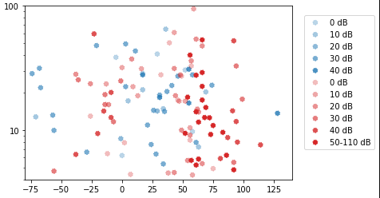
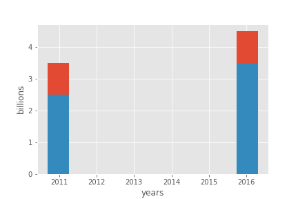
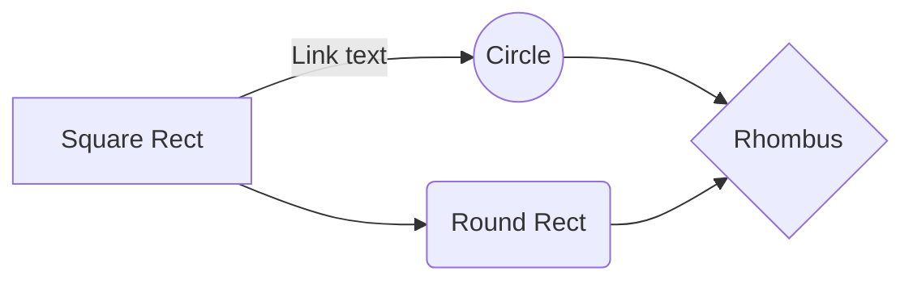

LTE Cat-NB (Narrowband) characterization of user equipment (UE) and mobile network operators (MNOs)

|      |      |      |
| ---- | ---- | ---- |
| Total free memory    | 11929.1 | 11947.7 |
| Max free memory      | 10985.3 | 10984.9 |
| Num Allocs memory    | 1910.4  | 1292.8  |
| Num Frees memory     | 1770.3  | 1147.1  |

|      |      |      |      |      |
| ---- | ---- | ---- | ---- | ---- |
| Currently allocated   | 26195.4   | 16282.4     | 26157.7       | 16282.8         |
| Total free memory    | 17140.6   | 6717.6    | 17178.3       | 6717.2         |
| Max free memory      | 15264     | 6706.7    | 15264         | 6705.7         |
| Num Allocs memory    | 1930      | 1891.3     | 936.3       | 1649.7        |
| Num Frees memory     | 1715.3   | 1825.1    | 723.1      | 1583.6        |

# Memory allocation

Memory can be considered a reasonable UE health metric in terms of monitoring code stability.

\begin{minipage}{1.0\linewidth}
\begin{center}
\includegraphics[width=1.0\linewidth]{../../../masters/code/tests/plotterk/Current_Allocated_histogram.pdf}
\captionof{figure}[Currently allocated memory.]{Currently allocated memory. Equal distribution of attenuation zones and tests. Quectel uses about 16kB of memory and Ublox about 26kB.}
\label{fig:}
\end{center}
\end{minipage}

\begin{minipage}{1.0\linewidth}
\begin{center}
\includegraphics[width=1.0\linewidth]{../../../masters/code/tests/plotterk/Total_Free_histogram.pdf}
\captionof{figure}[Free memory available.]{Free memory available. Equal distribution of attenuation zones and tests. Quectel has about 7kB of memory free and Ublox about 17kB.}
\label{fig:}
\end{center}
\end{minipage}

\begin{minipage}{1.0\linewidth}
\begin{center}
\includegraphics[width=1.0\linewidth]{../../../masters/code/tests/plotterk/Signal_power_Num_Allocs_plot.pdf}
\captionof{figure}[Accumulated memory allocations per packet (390/1619) up to 4000.]{Accumulated memory allocations per packet (390/1619) up to 4000. (ABCD) Attenuation zones evident per decade, Quectel has slightly more allocations per MNO, tests show majority linear increases and ECL does not have a notable effect on the number of allocations.}
\label{fig:}
\end{center}
\end{minipage}

The number of allocations and frees are very similar, hence the latter is not shown here as well. The code can be considered running stable for both Ublox and Quectel, with memory usages of 60% and 70%, respectively.

# tables

<!--\begin{tabular}{l|lll|lll|l|l|l|l|l}-->

\begin{table}[]
\begin{tabular}{l|lll|lll|l|l|l|l|l}
    \\ \hline
​        & \multicolumn{3}{c|}{16} & \multicolumn{3}{c|}{128} & 512 & COPS & Echo & PTAU & eDRX \\ \hline
​        & 5      & M     & 95     & 5      & M      & 95     &     &      &      &      &      \\ \hline
Quectel &        &       &        &        &        &        &     &      &      &      &      \\
Ublox   &        &       &        &        &        &        &     &      &      &      &      \\
MTN     &        &       &        &        &        &        &     &      &      &      &      \\
Vodacom &        &       &        &        &        &        &     &      &      &      &     

\end{tabular}
\end{table}

\begin{table}[]
\begin{tabular}{cccccccccccccccccccccc}
        & \multicolumn{3}{c}{\textbf{16}} & \multicolumn{3}{c}{128} & \multicolumn{3}{c}{512} & \multicolumn{3}{c}{COPS} & \multicolumn{3}{c}{Echo} & \multicolumn{3}{c}{PTAU} & \multicolumn{3}{c}{eDRX} \\
        & 5        & M        & 95        & 5      & M     & 95     & 5      & M     & 95     & 5      & M      & 95     & 5      & M      & 95     & 5      & M      & 95     & 5      & M      & 95     \\
Quectel &          &          &           &        &       &        &        &       &        &        &        &        &        &        &        &        &        &        &        &        &        \\
Ublox   &          &          &           &        &       &        &        &       &        &        &        &        &        &        &        &        &        &        &        &        &        \\
MTN     &          &          &           &        &       &        &        &       &        &        &        &        &        &        &        &        &        &        &        &        &        \\
Vodacom &          &          &           &        &       &        &        &       &        &        &        &        &        &        &        &        &        &        &        &        &       
\end{tabular}
\end{table}

# UE-MNO Comparison

Table: Comparing means of UE-MNO pairs

|                      | Ublox-MTN | Quectel-MTN | Ublox-Vodacom | Quectel-Vodacom |
| -------------------- | --------- | ----------- | ------------- | --------------- |
| **Metrics**          |           |             |               |                 |
| Latency (s)          | 5.52      | 10.73       | 12.5608       | 27.7113         |
| Transmit time (s)    | 0.52      | 1.34        | 14.4993       | 4.19134         |
| Receive time (s)     | 1.28      | 3.31        | 60.4745       | 10.5279         |
| Energy (J)           | 11.4      | 21.9        | 21.9968       | 57.7098         |
| Max current (mA)     | 102.7     | 104.1       | 106.4         | 108.7           |
| Transmit power (dBm) | 16.96     | 14.80       | 16.16         | 18.64           |
| RSSI (dBm)           | -93.31    | -89.50      | -83.30        | -82.28          |
| TX Bytes (B)         | 345.8     | 852.7       | 3113          | 446.5           |
| RX Bytes (B)         | 109.2     | 386.7       | 769.3         | 147.7           |
| ACK/NACK RX Packet   | 20.1      | 7.5         | 13.2          | 12.3            |
| RLC UL (B)           | 468.8     | 336.9       | 343.8         | 201.3           |
| RLC DL (B)           | 240.2     | 144.2       | 77.1          | 43.3            |
| MAC UL (B)           | 568.2     | 554.0       | 357.3         | 292.3           |
| MAC UL (B)           | 321.1     | 181.2       | 87.1          | 55.2            |
|                      |           |             |               |                 |
| **Estimates**        |           |             |               |                 |
| Battery Lifetime     |           |             |               |                 |
|                      |           |             |               |                 |

Table: Comparing means of MNOs

|                               | MTN     | Vodacom |
| ----------------------------- | ------- | ------- |
| Latency (s)                   | 8.14    | 20.1    |
| Transmit Latency (s)          | 0.93    | 9.35    |
| Receive Latency (s)           | 2.30    | 35.5    |
| Energy (J)                    | 16.7    | 39.9    |
| Max current (mA)              | 103.5   | 107.6   |
| Transmit power (dBm)          | 15.9    | 17.4    |
| RSSI (dBm)                    | -91.4   | -82.8   |
| SINR (dB)                     | 3.43    | 3.36    |
| RSRQ (dB)                     | -13.0   | -13.1   |
| TX Bytes (B)                  | 599.2   | 1779.7  |
| RX Bytes (B)                  | 247.9   | 458.5   |
| ACK/NACK RX Packet            | 13.8    | 12.7    |
| Currently allocated           | 21238.9 | 21220.3 |
| RLC UL (B)                    | 402.9   | 273.2   |
| RLC DL (B)                    | 192.2   | 60.2    |
| MAC UL (B)                    | 561.2   | 324.8   |
| MAC UL (B)                    | 251.2   | 71.3    |
|                               |         |         |
| **Estimates**                 |         |         |
| Battery Lifetime              | 1500    | 800     |
| Data Billing (how many 512 B) | 5000    | 2000    |

# SINR

\begin{minipage}{1.0\linewidth}
\begin{center}
\includegraphics[width=1.0\linewidth]{../../../masters/code/tests/plotterk/SNR_txTime_plot.pdf}
\captionof{figure}[Measured latency points (526/1558) under 25 seconds against SINR.]{Measured latency points (526/1558) under 25 seconds in comparison (AB) of UE, (C) MNOs, (DE) attenuation zones, (F) UE-MNO boxplots, (GH) test types, (I) and ECLs against SINR.}
\label{fig:sinr_latency}
\end{center}
\end{minipage}

In Figure \ref{fig:sinr_latency}, (ABCF) UE devices share similar characteristics and differ according to MNO vendor. UE has a mean of 2 seconds on MTN-ZTE, and 6-7 seconds on Vodacom-Nokia. (DE) Attenuation per decade is not evident according to SNR. It can be suggested that using SNR as a metric for other tests is not beneficial if the attenuation zones cannot be distinguished. This also suggests that transmit power is a result of RSRP/RSSI variation instead. (GH) Tests are varied across SNR. eDRX paging cycles and COPS maintain similar latencies, however the rest increase three-fold or more. (H) Echo tests have outlier registrations and deregistrations at Vodacom-Nokia. UDP packet byte size does not seem to have an effect on latency. (I) Most of Vodacom-Nokia's dataset is on ECL 1. Increased ECL levels do not seem correlated with latency. (Note) The tail at 200 dB is cleared up as a single K-means cluster point due to excess repetition of one of the tests. At K=5, K-means points are a third of the maximum filtered values, which therefore minimizes the low latency kurtosis and retains the unique features.

Extended Coverage Levels (ECL) are determined by the network. The eNB (base station) sets the number of transmission repetitions (ECL) according to received signal strength reported by the UE.

\begin{minipage}{1.0\linewidth}
\begin{center}
\includegraphics[width=1.0\linewidth]{../../../masters/code/tests/plotterk/SNR_txTime_outliers.pdf}
\captionof{figure}[Measured latency outliers (51/61) up to 300 seconds against SINR.]{Measured latency outliers (51/61) up to 300 seconds in comparison (AB) of UE-Vendors, (C) MNO-Vendors, (DE) attenuation zones, (F) UE-MNO boxplots, (GH) test types, (I) and ECLs against SINR.}
\label{fig:sinr_latency_otl}
\end{center}
\end{minipage}

Furthermore, in Figure \label{fig:sinr_latency_otl} latency outliers are (ABC) mostly as a result of Vodacom-Nokia. Both MNOs have outliers up to 300 seconds, but that is for cases where the inactivity timer is active. Since the inactivity timer cannot be controlled by the UE, the next step is to deregister from the network with `AT+COPS=2`. On MTN-ZTE, this is a quick action taking at most a few seconds, however on the Vodacom-Nokia network it can take 40 seconds or more. This is the real latency caveat which makes the Vodacom-Nokia network unusable.

# background intro

+Application developers are always on the lookout for viable technologies, and tend to use the most prolific ones.

+Network operators are looking to enter the LPWAN sphere. 3GPP have made this possible by adapting LTE into Cat-M and NB-IoT.

 +GSM had been a cost-effective way to keep in touch with people around world, as well as the poorer communities in Africa. Due to the proliferation of WhatsApp, Facebook, Telegram and other social media platforms, there is a shift away from calls and sms. 

{ width=50% }

<!---Facebook, penetration
Africa
World Bank-->

+Due to high user demand in bandwidth-hungry applications such as voice, video and file sharing, it evolved into 3G and 4G LTE which is currently in use today in the form of VoIP and IMS. Since the more affordable packet switched networks can handle more bandwidth than circuit switched networks, the transition is sensible.

The technology is robust in certain test cases and scenarios, but additional work is required from the 3GPP to enhance the technology.

Hype yields investment, especially when the underlying innovation holds value, such as connecting billions of 'things' to the internet.

IoT shows great potential for exponential growth, and unless a technology disruption occurs which means we do not require connections or our devices, then there is undoubtedly an [uptrend](https://amarketresearchgazette.com/global-narrowband-iot-nb-iot-market-2019-2025-vodafone-china-unicom-china-telecom-att-etisalat-telstra-orange-telefonica-sk-telecom-deutsche-telekom/).

# Performance Evaluation

It would be useful for the application developer to know the boundaries resulting from this approach. Drawbacks and optimizations targeting IoT can be discussed. The application developer is a potential adopter of the technology and focuses on parameters that fall within end-user control.

Cellular operators would also benefit by knowing where they can improve upon their configurations and equipment.

To this end it would be beneficial to:

- Analyze critical metrics at the core of NB-IoT, such as energy consumption, coverage, cost and latency.
- Create a testing framework to characterize NB-IoT devices in actual operation and using various networks.
- Set optimal operating boundaries based on the obtained results. This should also re-evaluate suitability in certain use cases.

There are over 50 MNOs in the world that are using NB-IoT, yet most draw from a subset of the [top 5 LTE vendors](https://www.rcrwireless.com/20160531/network-infrastructure/top-5-wireless-infrastructure-makers-tag4-tag99):

1. Huawei
2. Ericsson
3. Nokia
4. ZTE
5. Samsung

# cellular control

Table: Cellular control {#tbl:cellular_control}

|                             | Cellular operators | Users       |
| --------------------------- | ------------------ | ----------- |
| NB-IoT Base stations (BTS)  | **X**              |             |
| NB-IoT User Equipment (UE)  |                    | **X**       |
| LoRaWAN Gateways            |                    | **X**       |
| LoRaWAN Devices             |                    | **X**       |
| NB-IoT licensed spectrum    |                    | billed      |
| LoRaWAN unlicensed spectrum |                    | duty-cycled |

# Design

More than one UE is used to improve the accuracy of the result, namely Ublox and Quectel. There is an open possibility to test SimCom and Nordic as well.

However, due to the aforementioned energy variability of NB-IoT, an estimate of the energy per message EMSG must be chosen in accordance with the application requirements, ranging from very optimistic (best case) to the most pessimistic (worst case). For that purpose, we use the data recorded as a probabilistic
model, taking the 5th/95th-percentiles for the best/worst case scenarios, and the mean values as an estimate for the long- term behavior.

Includes some preliminary results to analyze UE device and LTE network behavior.

Physical Cell ID (PCI) is the serving cell tower's unique identifier.

On the MTN network, the UE connected to three different towers.

Table: EARFCN for serving cell {#tbl:earfcn}

| EARFCN                | 3564 | 3712 |
| --------------------- | ---- | ---- |
| Ublox-MTN-ZTE         |      | 48   |
| Quectel-MTN-ZTE       |      | 59   |
| Ublox-Vodacom-Nokia   | 34   |      |
| Quectel-Vodacom-Nokia | 32   |      |

The E-UTRA Absolute Radio Frequency Channel Number (EARFCN) designates the carrier frequency in the uplink and downlink, and ranges between 0-65535.

Since the frequency of the three towers was the same on all three MTN towers, this shows that intra-cell reselection does indeed work.

\begin{minipage}{1.0\linewidth}
\begin{center}
\includegraphics[width=1.0\linewidth]{../../../masters/code/tests/plotterk/Signal_power_txTimeNW_outliers.pdf}
\captionof{figure}[TX time outliers (11/11) up to 100 seconds]{TX time outliers (11/11) exist up to 100 seconds in comparison (AB) of UE, (C) MNOs, (DE) attenuation zones, (F) UE-MNO boxplots, (GH) test types, (I) and ECLs against RSRP.}
\label{fig:txTimeNW_otl}
\end{center}
\end{minipage}

\begin{minipage}{1.0\linewidth}
\begin{center}
\includegraphics[width=1.0\linewidth]{../../../masters/code/tests/plotterk/Signal_power_rxTimeNW_outliers.pdf}
\captionof{figure}[RX time outliers (36/47) up to 400 seconds against RSRP.]{RX time outliers (36/47) up to 400 seconds in comparison (AB) of UE, (C) MNOs, (DE) attenuation zones, (F) UE-MNO boxplots, (GH) test types, (I) and ECLs against RSRP.}
\label{fig:}
\end{center}
\end{minipage}

\begin{minipage}{\linewidth}
\begin{center}
\includegraphics[width=1.0\linewidth]{../../../masters/code/tests/plotterk/Signal_power_energy_outliers.pdf}
\captionof{figure}[Energy outliers (46/79) up to 750 Joules against RSRP.]{Energy outliers (46/79) up to 750 Joules or 200mWh in comparison (AB) of UE, (C) MNOs, (DE) attenuation zones, (F) UE-MNO boxplots, (GH) test types, (I) and ECLs against RSRP.}
\label{fig:}
\end{center}
\end{minipage}

\begin{minipage}{\linewidth}
\begin{center}
\includegraphics[width=1.0\linewidth]{../../../masters/code/tests/plotterk/txTime_energy_outliers.pdf}
\captionof{figure}[Energy versus latency outliers (47/74) against RSRP.]{Energy vs latency outliers (47/74) in comparison (AB) of UE, (C) MNOs, (DE) attenuation zones, (F) UE-MNO boxplots, (GH) test types, (I) and ECLs against RSRP.}
\label{fig:}
\end{center}
\end{minipage}

# C-DRX

\begin{figure}[ht]
  \subfloat[C-DRX current measurement on MTN-Ublox]{
	\begin{minipage}[c][1\width]{
	   0.5\textwidth}
	   \centering
	   \includegraphics[width=1.0\linewidth]{../../code/tests/logs/zte_mtn/rf_shield/ublox/scope/cdrx73_6mA_110dB.jpg}
	\end{minipage}}
 \hfill 	
  \subfloat[C-DRX current measurement on MTN-Quectel]{
	\begin{minipage}[c][1\width]{
	   0.5\textwidth}
	   \centering
	   \includegraphics[width=1.0\linewidth]{../../code/tests/logs/zte_mtn/rf_shield/quectel/scope/70.4mA_ant_0dB.jpg}
	\end{minipage}}
\captionof{figure}[C-DRX current measurement]{Current measurement of MTN-Ublox during connected DRX mode (C-DRX). The UE uses 73.6mA at 110dB attenuation with the RF shield enclosure door slightly open}
\end{figure}

\begin{minipage}{\linewidth}
\begin{center}
\includegraphics[width=1.0\linewidth]{../../code/tests/logs/zte_mtn/rf_shield/ublox/scope/cdrx73_6mA_110dB.jpg}
\captionof{figure}[C-DRX MTN-Ublox current measurement]{Current measurement of MTN-Ublox during connected DRX mode (C-DRX). The UE uses 73.6mA at 110dB attenuation with the RF shield enclosure door slightly open}
\label{fig:}
\end{center}
\end{minipage}

\begin{minipage}{\linewidth}
\begin{center}
\includegraphics[width=1.0\linewidth]{../../code/tests/logs/zte_mtn/rf_shield/quectel/scope/70.4mA_ant_0dB.jpg}
\captionof{figure}[C-DRX MTN-Quectel current measurement]{Current measurement of MTN-Ublox during connected DRX mode (C-DRX). The UE uses 70.4mA at 110dB attenuation with the RF shield enclosure door slightly open}
\label{fig:}
\end{center}
\end{minipage}

# Lit study

* GSM RF equipment testing and performance analysis [@Kasbah2005]
* Analysis of NB-IoT Deployment in LTE Guard-Band [@Ratasuk2017c]

*The empirical results of NB-IoT depend on the device used (UE) and underlying LTE vendor architecture of the MNO providing coverage. Thus?*

* eDRX and PSM
* Debugging
  * QXDM, UEMonitor etc
  * [@ubloxAppNote2018]

# Ping tests

Adding the previous test data together we see the following shape and form.

\begin{figure}
  \begin{subfigure}[t]{0.475\textwidth}
    \includegraphics[width=\textwidth]{../images/1568090001158.png}
    \caption{Modello compartimentale mammellare (o mammillare).}
    \label{fig-a}
  \end{subfigure}\hfill
  \begin{subfigure}[t]{0.475\textwidth}
    \includegraphics[width=\textwidth]{../images/1568090070185.png}
    \caption{Modello compartimentale catenario.}
    \label{fig-b}
  \end{subfigure}
  \caption{Principali topologie dei modelli compartimentali.} 
  \label{fig:main}
\end{figure}

# prob est

\begin{minipage}{\linewidth}
\begin{center}
\includegraphics[width=.6\linewidth]{../../code/tests/old/img2/histogram_counts.pdf}
\captionof{figure}{Example python histogram of a univariate latency distribution showing counts}
\label{fig:}
\end{center}
\end{minipage}

\begin{minipage}{\linewidth}
\begin{center}
\includegraphics[width=.6\linewidth]{../../code/tests/old/img2/probability_density_function_seaborn.pdf}
\captionof{figure}{Example python histogram of a univariate latency distribution with a normalized density and a gaussian kernel density estimate}
\label{fig:}
\end{center}
\end{minipage}

\begin{minipage}{\linewidth}
\begin{center}
\includegraphics[width=.6\linewidth]{../../code/tests/old/img2/probability_density_function.pdf}
\captionof{figure}{Various types of kernel density estimation (KDE)}
\label{fig:}
\end{center}
\end{minipage}

\begin{minipage}{\linewidth}
\begin{center}
\includegraphics[width=.6\linewidth]{../../code/tests/old/img2/probability_mass_function.pdf}
\captionof{figure}{Various types of kernel density estimation (KDE) with histogram and KDE normalized in attempted probability mass function}
\label{fig:}
\end{center}
\end{minipage}

# Cell ID, EARFCN

  (35, 35) -> ()

# mermaid

# power saving mechanism

(These tests should continue until an eDRX value of 2621,44s, or 43.69 minutes and repeated for Quectel, Nordic, SimCom and on Nokia, Ericsson and Huawei basestations)

Also, what is the current usage of running a specific command? Is it negligible or is, for example, polling AT+CSQ constantly detrimental on battery life?

# telemetry tests

The SARA-N2 series modules are able to send raw data through UDP sockets to an IP address. The
data sent over the socket AT commands is not wrapped in any other layer, and the data provided is
the data that is sent.

The Constrained Application Protocol (CoAP) is a datagram-based client/server application protocol
for devices on the constrained network (e.g. low overhead, low-power), designed to easily translate
to HTTP for simplified integration with the web. CoAP clients can use the GET, PUT, POST and
DELETE methods using requests and responses with a CoAP server.

The usage of the Non-IP method during the sending or receiving of messages saves the overhead of
needing to send a UDP IP header.

For a more advanced check on sending data to an external server, send data to the u-blox echo
server at echo.u-blox.com. Because there is no DNS lookup function in the SARA-N2 module series, use the IP address server which is 195.34.89.241.

Command Response Description
AT+NSOCR="DGRAM",17,10000 0
OK
Create a UDP socket.
AT+NSOST=0,"195.34.89.241",7,5,"0102
030405"
0,5
OK
Send data on socket 0.
+NSONMI: 0,5
Receive data on socket 0.
AT+NSORF=0,5 +NSORF: 0,"195.34.89.241",7,5
,"0102030405",0
OK
Request data from socket 0.
Echo’d data received

# max current

\begin{minipage}{\linewidth}
\begin{center}
\includegraphics[width=1.0\linewidth]{../../../masters/code/tests/plotterk/Signal_power_energy_outliers.pdf}
\captionof{figure}[Max current of packets (372/1619) up to 128mA against RSRP.]{Max current of packets (372/1619) up to 128mA in comparison (AB) of UE, (C) MNOs, (DE) attenuation zones, (F) UE-MNO boxplots, (GH) test types, (I) and ECLs against RSRP.}
\label{fig:}
\end{center}
\end{minipage}

# tx, rx bytes

\begin{minipage}{\linewidth}
\begin{center}
\includegraphics[width=1.0\linewidth]{../../../masters/code/tests/plotterk/Signal_power_txBytes_outliers.pdf}
\captionof{figure}[TX packet size outliers (37/65) up to 20kB against RSRP.]{TX packet size outliers (37/65) up to 20kB in comparison (AB) of UE, (C) MNOs, (DE) attenuation zones, (F) UE-MNO boxplots, (GH) test types, (I) and ECLs against RSRP.}
\label{fig:}
\end{center}
\end{minipage}

\begin{minipage}{\linewidth}
\begin{center}
\includegraphics[width=1.0\linewidth]{../../../masters/code/tests/plotterk/Signal_power_rxBytes_outliers.pdf}
\captionof{figure}[RX packet size outliers (12/18) up to 6kB against RSRP.]{RX packet size outliers (12/18) up to 6kB in comparison (AB) of UE, (C) MNOs, (DE) attenuation zones, (F) UE-MNO boxplots, (GH) test types, (I) and ECLs against RSRP.}
\label{fig:}
\end{center}
\end{minipage}