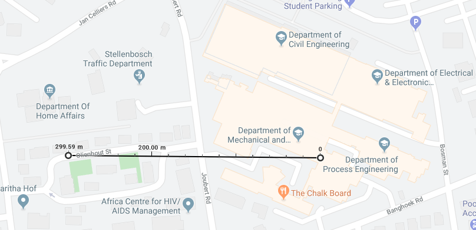

Thesis_Narrowband_IoT_Performance_Evaluation_of_Variability_by_Daniel_Leonard_Robinson.pdf

# Plots

- what aspect is the plot trying to cover, what is it telling me on that topic, shows? observances?
- purpose
- data in the plot saying / deduce / narrative / story
  - Example, Quectel, Vodacom is worse
- 4 sentences
- 4 sentences when comparing nw, and tehn again ues
- What is the take home?

\-    This is what I am showing you (“The figure shows the latency distributions when running under….”)

\-    Tell them what it is showing or what you are observing in the results (“ It can be seen that the the performance of the quectel modem is better….”). This you do for everything you want to highlight, everything tht is worth mentioning.

\-    State the natural conclusion of what you are observing. (“ The impact of the higher throughput rate is that for the same duration of radio time, and therefore battery energy, more data can be pushed through” – just a hypothetical example).


# turnitititin


Durand's results show that LoRaWAN SF7 is the most power-efficient, due to the short transmission burst, and with NB-IoT the worst power-consumption due to the length RRC-idle mode [@Thomas2018]. This can be reduced using Release Assistance as in \S\ref{release_a}.

Measured MCL correlates with theoretical values.


#### Dash7

Since Dash7 was a curiosity at the time, a Dash7 field test was performed using a Murata CMWX1ZZABZ-091, but due to 10dBm transmit power it limited range to about 300m.

{width=65%}

Although Dash7 is considered a viable alternative, it fell short on range expectations.

Haystack Technologies has developed a Dash7-over-LoRa implementation that expects ranges of over a few kilometers and can be considered in future research.


(A) Attenuation per decade is evident. (B) Vodacom latency is up to 5 times greater, excluding outliers. (C) All tests show variation in latency except eDRX. (D) ECL is influenced by RSRP on MTN networks, but does not affect latency. Vodacom's increased latency shows from ECL class 1 onwards.


Since the only difference between the outliers of latency versus SINR (Figure \ref{fig:sinr_latency}) and latency versus RSRP is the fact that the attenuation zones are evident per decade, it is not necessary to show here.


In Figure \ref{fig:txTimeNW_otl}, (ADFG) MTN-ZTE shows no outliers, but (BC) Vodacom-Nokia shows outliers for both Ublox and Quectel. (E) Attenuation does not affect TX time. (H) If not a lengthy UDP packet transmission, both eDRX and PTAU have a single outlier which could be a result of an RRC connection with a long inactivity timer, synchronization error or else.


# Conclusion

comparing multiple LTE vendors, UE devices and MNOs.

Attenuation does not affect performance as much as the ECL classes do, and includes
degradation to latency, energy consumption and packet size.

The telemetry interval estimate, which indicates the periodicity of telemetry messages to last a year on an AA battery, can be used to extend battery life prediction depending on the use case. A strong and overlooked use case is a push/pull model which incorporates edge computing. By pushing data only when complex queries arrive, much battery life is saved due to downlink energy being much less than uplink. This is furthered aided by the configurable eDRX interval which allows UE devices to be paged by the network serving cell(s) it is registered to.

especially in strong signal conditions, yet variation increases in higher ECL Classes due to the dynamic number of repetitions, which calls into question the ability of the UE device to reach the targeted lifespan. Thus, application developers must take into account the longevity estimate of devices depending on their installation with respect to the nearest serving cell. 

The inefficiency between the two South African MNOs can either be attributed to poor
system configuration, or hardware fault. That is, if the network vendor meets the 3GPP's
standards. Vodacom’s Nokia infrastructure has failed one of the most important
requirements for NB-IoT being under 10 seconds latency for all network conditions.
Secondly it is 10dBm RSRP less sensitive than MTN’s ZTE infrastructure, which has
satisfactory performance overall. Since the findings are reflected similarly across the
Ublox and Quectel UE, it implies that the discrepancies are as a result of the MNO
vendor.

* how well NB-IoT performs and facilitates these connections for IoT?

2G/GSM is a sunsetting technology with great coverage and market penetration in SA. It certainly gathers a large share of revenue by calls and SMS.

When looking at SigFox, we see a technology with far range, but data rates that could be considered too low for our application. LoRa has higher data rates, but is still subject to duty cycle limitations. Dash7 is a full-stack medium range wireless technology that overcomes many of the limitations, including the duty cycle by having listen-before-talk and adaptive data rates.

NB-IoT is a very promising technology. It can coexist with 2G/GSM and LTE networks. When comparing to 2G it has 7 times greater range, and in power saving modes time to transmission is a few seconds, compared to about a minute for 2G. There are a few successful use cases for NB-IoT in South Africa, such as smart metering, asset tracking etc.

There are also a couple of hurdles in the way. Although lauded as a mere software upgrade, it does require the latest basestations and licensing fees. There needs to be a substantial revenue model which ties in with demand.

Since it appears that ECL is the ultimate factor that should influence latency and energy usage, it is the metric used for battery life estimation as well.


Seeing that LTE Cat-M is on a par with NB-IoT, if not better in \S\ref{lit_standing}, it would be wise to consider LTE Cat-M for national coverage in South Africa in future.

## Optimal Network Configuration and Setup

Avoid -120 dBm - -130 dBm region

* AT+COPS
* Release / eDRX setup

## Use Cases

Use cases suitable for NB-IoT considering results

## Future Work

Compare NB-IoT to Dash7, which can be considered a prominent bi-directional contender. It has the capability of using LoRa's physical layer (RF frontend) so has the added benefit of long range.


LTE Cat-NB (Narrowband) characterization of user equipment (UE) and mobile network operators (MNOs)


|      |      |      |
| ---- | ---- | ---- |
| Total free memory    | 11929.1 | 11947.7 |
| Max free memory      | 10985.3 | 10984.9 |
| Num Allocs memory    | 1910.4  | 1292.8  |
| Num Frees memory     | 1770.3  | 1147.1  |


|      |      |      |      |      |
| ---- | ---- | ---- | ---- | ---- |
| Currently allocated   | 26195.4   | 16282.4     | 26157.7       | 16282.8         |
| Total free memory    | 17140.6   | 6717.6    | 17178.3       | 6717.2         |
| Max free memory      | 15264     | 6706.7    | 15264         | 6705.7         |
| Num Allocs memory    | 1930      | 1891.3     | 936.3       | 1649.7        |
| Num Frees memory     | 1715.3   | 1825.1    | 723.1      | 1583.6        |


# Memory allocation

Memory can be considered a reasonable UE health metric in terms of monitoring code stability.

\begin{minipage}{1.0\linewidth}
\begin{center}
\includegraphics[width=1.0\linewidth]{../../../masters/code/tests/plotterk/Current_Allocated_histogram.pdf}
\captionof{figure}[Currently allocated memory.]{Currently allocated memory. Equal distribution of attenuation zones and tests. Quectel uses about 16kB of memory and Ublox about 26kB.}
\label{fig:}
\end{center}
\end{minipage}


\begin{minipage}{1.0\linewidth}
\begin{center}
\includegraphics[width=1.0\linewidth]{../../../masters/code/tests/plotterk/Total_Free_histogram.pdf}
\captionof{figure}[Free memory available.]{Free memory available. Equal distribution of attenuation zones and tests. Quectel has about 7kB of memory free and Ublox about 17kB.}
\label{fig:}
\end{center}
\end{minipage}


\begin{minipage}{1.0\linewidth}
\begin{center}
\includegraphics[width=1.0\linewidth]{../../../masters/code/tests/plotterk/Signal_power_Num_Allocs_plot.pdf}
\captionof{figure}[Accumulated memory allocations per packet (390/1619) up to 4000.]{Accumulated memory allocations per packet (390/1619) up to 4000. (ABCD) Attenuation zones evident per decade, Quectel has slightly more allocations per MNO, tests show majority linear increases and ECL does not have a notable effect on the number of allocations.}
\label{fig:}
\end{center}
\end{minipage}


The number of allocations and frees are very similar, hence the latter is not shown here as well. The code can be considered running stable for both Ublox and Quectel, with memory usages of 60% and 70%, respectively.

# tables

<!--\begin{tabular}{l|lll|lll|l|l|l|l|l}-->

\begin{table}[]
\begin{tabular}{l|lll|lll|l|l|l|l|l}
    \\ \hline
​        & \multicolumn{3}{c|}{16} & \multicolumn{3}{c|}{128} & 512 & COPS & Echo & PTAU & eDRX \\ \hline
​        & 5      & M     & 95     & 5      & M      & 95     &     &      &      &      &      \\ \hline
Quectel &        &       &        &        &        &        &     &      &      &      &      \\
Ublox   &        &       &        &        &        &        &     &      &      &      &      \\
MTN     &        &       &        &        &        &        &     &      &      &      &      \\
Vodacom &        &       &        &        &        &        &     &      &      &      &     

\end{tabular}
\end{table}


\begin{table}[]
\begin{tabular}{cccccccccccccccccccccc}
        & \multicolumn{3}{c}{\textbf{16}} & \multicolumn{3}{c}{128} & \multicolumn{3}{c}{512} & \multicolumn{3}{c}{COPS} & \multicolumn{3}{c}{Echo} & \multicolumn{3}{c}{PTAU} & \multicolumn{3}{c}{eDRX} \\
        & 5        & M        & 95        & 5      & M     & 95     & 5      & M     & 95     & 5      & M      & 95     & 5      & M      & 95     & 5      & M      & 95     & 5      & M      & 95     \\
Quectel &          &          &           &        &       &        &        &       &        &        &        &        &        &        &        &        &        &        &        &        &        \\
Ublox   &          &          &           &        &       &        &        &       &        &        &        &        &        &        &        &        &        &        &        &        &        \\
MTN     &          &          &           &        &       &        &        &       &        &        &        &        &        &        &        &        &        &        &        &        &        \\
Vodacom &          &          &           &        &       &        &        &       &        &        &        &        &        &        &        &        &        &        &        &        &       
\end{tabular}
\end{table}


# UE-MNO Comparison

Table: Comparing means of UE-MNO pairs

|                      | Ublox-MTN | Quectel-MTN | Ublox-Vodacom | Quectel-Vodacom |
| -------------------- | --------- | ----------- | ------------- | --------------- |
| **Metrics**          |           |             |               |                 |
| Latency (s)          | 5.52      | 10.73       | 12.5608       | 27.7113         |
| Transmit time (s)    | 0.52      | 1.34        | 14.4993       | 4.19134         |
| Receive time (s)     | 1.28      | 3.31        | 60.4745       | 10.5279         |
| Energy (J)           | 11.4      | 21.9        | 21.9968       | 57.7098         |
| Max current (mA)     | 102.7     | 104.1       | 106.4         | 108.7           |
| Transmit power (dBm) | 16.96     | 14.80       | 16.16         | 18.64           |
| RSSI (dBm)           | -93.31    | -89.50      | -83.30        | -82.28          |
| TX Bytes (B)         | 345.8     | 852.7       | 3113          | 446.5           |
| RX Bytes (B)         | 109.2     | 386.7       | 769.3         | 147.7           |
| ACK/NACK RX Packet   | 20.1      | 7.5         | 13.2          | 12.3            |
| RLC UL (B)           | 468.8     | 336.9       | 343.8         | 201.3           |
| RLC DL (B)           | 240.2     | 144.2       | 77.1          | 43.3            |
| MAC UL (B)           | 568.2     | 554.0       | 357.3         | 292.3           |
| MAC UL (B)           | 321.1     | 181.2       | 87.1          | 55.2            |
|                      |           |             |               |                 |
| **Estimates**        |           |             |               |                 |
| Battery Lifetime     |           |             |               |                 |
|                      |           |             |               |                 |

Table: Comparing means of MNOs

|                               | MTN     | Vodacom |
| ----------------------------- | ------- | ------- |
| Latency (s)                   | 8.14    | 20.1    |
| Transmit Latency (s)          | 0.93    | 9.35    |
| Receive Latency (s)           | 2.30    | 35.5    |
| Energy (J)                    | 16.7    | 39.9    |
| Max current (mA)              | 103.5   | 107.6   |
| Transmit power (dBm)          | 15.9    | 17.4    |
| RSSI (dBm)                    | -91.4   | -82.8   |
| SINR (dB)                     | 3.43    | 3.36    |
| RSRQ (dB)                     | -13.0   | -13.1   |
| TX Bytes (B)                  | 599.2   | 1779.7  |
| RX Bytes (B)                  | 247.9   | 458.5   |
| ACK/NACK RX Packet            | 13.8    | 12.7    |
| Currently allocated           | 21238.9 | 21220.3 |
| RLC UL (B)                    | 402.9   | 273.2   |
| RLC DL (B)                    | 192.2   | 60.2    |
| MAC UL (B)                    | 561.2   | 324.8   |
| MAC UL (B)                    | 251.2   | 71.3    |
|                               |         |         |
| **Estimates**                 |         |         |
| Battery Lifetime              | 1500    | 800     |
| Data Billing (how many 512 B) | 5000    | 2000    |


# SINR

 3GPP TR 45.820 


Results are presented at SNRs ranging from -6.3 dB to 3.7 dB, corresponding (see [6.2-5]) to coupling losses ranging from 164 dB (MCL) to 154 dB (GPRS reference level + 10 dB). 


\begin{minipage}{1.0\linewidth}
\begin{center}
\includegraphics[width=1.0\linewidth]{../../../masters/code/tests/plotterk/SNR_txTime_plot.pdf}
\captionof{figure}[Measured latency points (526/1558) under 25 seconds against SINR.]{Measured latency points (526/1558) under 25 seconds in comparison (AB) of UE, (C) MNOs, (DE) attenuation zones, (F) UE-MNO boxplots, (GH) test types, (I) and ECLs against SINR.}
\label{fig:sinr_latency}
\end{center}
\end{minipage}


In Figure \ref{fig:sinr_latency}, (ABCF) UE devices share similar characteristics and differ according to MNO vendor. UE has a mean of 2 seconds on MTN-ZTE, and 6-7 seconds on Vodacom-Nokia. (DE) Attenuation per decade is not evident according to SNR. It can be suggested that using SNR as a metric for other tests is not beneficial if the attenuation zones cannot be distinguished. This also suggests that transmit power is a result of RSRP/RSSI variation instead. (GH) Tests are varied across SNR. eDRX paging cycles and COPS maintain similar latencies, however the rest increase three-fold or more. (H) Echo tests have outlier registrations and deregistrations at Vodacom-Nokia. UDP packet byte size does not seem to have an effect on latency. (I) Most of Vodacom-Nokia's dataset is on ECL 1. Increased ECL levels do not seem correlated with latency. (Note) The tail at 200 dB is cleared up as a single K-means cluster point due to excess repetition of one of the tests. At K=5, K-means points are a third of the maximum filtered values, which therefore minimizes the low latency kurtosis and retains the unique features.

Extended Coverage Levels (ECL) are determined by the network. The eNB (base station) sets the number of transmission repetitions (ECL) according to received signal strength reported by the UE.

\begin{minipage}{1.0\linewidth}
\begin{center}
\includegraphics[width=1.0\linewidth]{../../../masters/code/tests/plotterk/SNR_txTime_outliers.pdf}
\captionof{figure}[Measured latency outliers (51/61) up to 300 seconds against SINR.]{Measured latency outliers (51/61) up to 300 seconds in comparison (AB) of UE-Vendors, (C) MNO-Vendors, (DE) attenuation zones, (F) UE-MNO boxplots, (GH) test types, (I) and ECLs against SINR.}
\label{fig:sinr_latency_otl}
\end{center}
\end{minipage}


Furthermore, in Figure \label{fig:sinr_latency_otl} latency outliers are (ABC) mostly as a result of Vodacom-Nokia. Both MNOs have outliers up to 300 seconds, but that is for cases where the inactivity timer is active. Since the inactivity timer cannot be controlled by the UE, the next step is to deregister from the network with `AT+COPS=2`. On MTN-ZTE, this is a quick action taking at most a few seconds, however on the Vodacom-Nokia network it can take 40 seconds or more. This is the real latency caveat which makes the Vodacom-Nokia network unusable.


# background intro

+Application developers are always on the lookout for viable technologies, and tend to use the most prolific ones.

+Network operators are looking to enter the LPWAN sphere. 3GPP have made this possible by adapting LTE into Cat-M and NB-IoT.

 +GSM had been a cost-effective way to keep in touch with people around world, as well as the poorer communities in Africa. Due to the proliferation of WhatsApp, Facebook, Telegram and other social media platforms, there is a shift away from calls and sms. 

{ width=50% }

<!---Facebook, penetration
Africa
World Bank-->

+Due to high user demand in bandwidth-hungry applications such as voice, video and file sharing, it evolved into 3G and 4G LTE which is currently in use today in the form of VoIP and IMS. Since the more affordable packet switched networks can handle more bandwidth than circuit switched networks, the transition is sensible.

The technology is robust in certain test cases and scenarios, but additional work is required from the 3GPP to enhance the technology.


Hype yields investment, especially when the underlying innovation holds value, such as connecting billions of 'things' to the internet.


IoT shows great potential for exponential growth, and unless a technology disruption occurs which means we do not require connections or our devices, then there is undoubtedly an [uptrend](https://amarketresearchgazette.com/global-narrowband-iot-nb-iot-market-2019-2025-vodafone-china-unicom-china-telecom-att-etisalat-telstra-orange-telefonica-sk-telecom-deutsche-telekom/).


# Performance Evaluation

It would be useful for the application developer to know the boundaries resulting from this approach. Drawbacks and optimizations targeting IoT can be discussed. The application developer is a potential adopter of the technology and focuses on parameters that fall within end-user control.

Cellular operators would also benefit by knowing where they can improve upon their configurations and equipment.

To this end it would be beneficial to:

- Analyze critical metrics at the core of NB-IoT, such as energy consumption, coverage, cost and latency.
- Create a testing framework to characterize NB-IoT devices in actual operation and using various networks.
- Set optimal operating boundaries based on the obtained results. This should also re-evaluate suitability in certain use cases.

There are over 50 MNOs in the world that are using NB-IoT, yet most draw from a subset of the [top 5 LTE vendors](https://www.rcrwireless.com/20160531/network-infrastructure/top-5-wireless-infrastructure-makers-tag4-tag99):

1. Huawei
2. Ericsson
3. Nokia
4. ZTE
5. Samsung

# cellular control

Table: Cellular control {#tbl:cellular_control}

|                             | Cellular operators | Users       |
| --------------------------- | ------------------ | ----------- |
| NB-IoT Base stations (BTS)  | **X**              |             |
| NB-IoT User Equipment (UE)  |                    | **X**       |
| LoRaWAN Gateways            |                    | **X**       |
| LoRaWAN Devices             |                    | **X**       |
| NB-IoT licensed spectrum    |                    | billed      |
| LoRaWAN unlicensed spectrum |                    | duty-cycled |


# Design

More than one UE is used to improve the accuracy of the result, namely Ublox and Quectel. There is an open possibility to test SimCom and Nordic as well.

However, due to the aforementioned energy variability of NB-IoT, an estimate of the energy per message EMSG must be chosen in accordance with the application requirements, ranging from very optimistic (best case) to the most pessimistic (worst case). For that purpose, we use the data recorded as a probabilistic
model, taking the 5th/95th-percentiles for the best/worst case scenarios, and the mean values as an estimate for the long- term behavior.

Includes some preliminary results to analyze UE device and LTE network behavior.

Physical Cell ID (PCI) is the serving cell tower's unique identifier.

On the MTN network, the UE connected to three different towers.

Table: EARFCN for serving cell {#tbl:earfcn}

| EARFCN                | 3564 | 3712 |
| --------------------- | ---- | ---- |
| Ublox-MTN-ZTE         |      | 48   |
| Quectel-MTN-ZTE       |      | 59   |
| Ublox-Vodacom-Nokia   | 34   |      |
| Quectel-Vodacom-Nokia | 32   |      |

[](../../../masters/code/tests/plotterk/Signal_power_EARFCN_plot.png)

[](../../../masters/code/tests/plotterk/EARFCN_histogram.png)

The E-UTRA Absolute Radio Frequency Channel Number (EARFCN) designates the carrier frequency in the uplink and downlink, and ranges between 0-65535.

Since the frequency of the three towers was the same on all three MTN towers, this shows that intra-cell reselection does indeed work.


\begin{minipage}{1.0\linewidth}
\begin{center}
\includegraphics[width=1.0\linewidth]{../../../masters/code/tests/plotterk/Signal_power_txTimeNW_outliers.pdf}
\captionof{figure}[TX time outliers (11/11) up to 100 seconds]{TX time outliers (11/11) exist up to 100 seconds in comparison (AB) of UE, (C) MNOs, (DE) attenuation zones, (F) UE-MNO boxplots, (GH) test types, (I) and ECLs against RSRP.}
\label{fig:txTimeNW_otl}
\end{center}
\end{minipage}

\begin{minipage}{1.0\linewidth}
\begin{center}
\includegraphics[width=1.0\linewidth]{../../../masters/code/tests/plotterk/Signal_power_rxTimeNW_outliers.pdf}
\captionof{figure}[RX time outliers (36/47) up to 400 seconds against RSRP.]{RX time outliers (36/47) up to 400 seconds in comparison (AB) of UE, (C) MNOs, (DE) attenuation zones, (F) UE-MNO boxplots, (GH) test types, (I) and ECLs against RSRP.}
\label{fig:}
\end{center}
\end{minipage}


\begin{minipage}{\linewidth}
\begin{center}
\includegraphics[width=1.0\linewidth]{../../../masters/code/tests/plotterk/Signal_power_energy_outliers.pdf}
\captionof{figure}[Energy outliers (46/79) up to 750 Joules against RSRP.]{Energy outliers (46/79) up to 750 Joules or 200mWh in comparison (AB) of UE, (C) MNOs, (DE) attenuation zones, (F) UE-MNO boxplots, (GH) test types, (I) and ECLs against RSRP.}
\label{fig:}
\end{center}
\end{minipage}


\begin{minipage}{\linewidth}
\begin{center}
\includegraphics[width=1.0\linewidth]{../../../masters/code/tests/plotterk/txTime_energy_outliers.pdf}
\captionof{figure}[Energy versus latency outliers (47/74) against RSRP.]{Energy vs latency outliers (47/74) in comparison (AB) of UE, (C) MNOs, (DE) attenuation zones, (F) UE-MNO boxplots, (GH) test types, (I) and ECLs against RSRP.}
\label{fig:}
\end{center}
\end{minipage}


# C-DRX

\begin{figure}[ht]
  \subfloat[C-DRX current measurement on MTN-Ublox]{
	\begin{minipage}[c][1\width]{
	   0.5\textwidth}
	   \centering
	   \includegraphics[width=1.0\linewidth]{../../code/tests/logs/zte_mtn/rf_shield/ublox/scope/cdrx73_6mA_110dB.jpg}
	\end{minipage}}
 \hfill 	
  \subfloat[C-DRX current measurement on MTN-Quectel]{
	\begin{minipage}[c][1\width]{
	   0.5\textwidth}
	   \centering
	   \includegraphics[width=1.0\linewidth]{../../code/tests/logs/zte_mtn/rf_shield/quectel/scope/70.4mA_ant_0dB.jpg}
	\end{minipage}}
\captionof{figure}[C-DRX current measurement]{Current measurement of MTN-Ublox during connected DRX mode (C-DRX). The UE uses 73.6mA at 110dB attenuation with the RF shield enclosure door slightly open}
\end{figure}

\begin{minipage}{\linewidth}
\begin{center}
\includegraphics[width=1.0\linewidth]{../../code/tests/logs/zte_mtn/rf_shield/ublox/scope/cdrx73_6mA_110dB.jpg}
\captionof{figure}[C-DRX MTN-Ublox current measurement]{Current measurement of MTN-Ublox during connected DRX mode (C-DRX). The UE uses 73.6mA at 110dB attenuation with the RF shield enclosure door slightly open}
\label{fig:}
\end{center}
\end{minipage}

\begin{minipage}{\linewidth}
\begin{center}
\includegraphics[width=1.0\linewidth]{../../code/tests/logs/zte_mtn/rf_shield/quectel/scope/70.4mA_ant_0dB.jpg}
\captionof{figure}[C-DRX MTN-Quectel current measurement]{Current measurement of MTN-Ublox during connected DRX mode (C-DRX). The UE uses 70.4mA at 110dB attenuation with the RF shield enclosure door slightly open}
\label{fig:}
\end{center}
\end{minipage}


# Lit study


* GSM RF equipment testing and performance analysis [@Kasbah2005]
* Analysis of NB-IoT Deployment in LTE Guard-Band [@Ratasuk2017c]


*The empirical results of NB-IoT depend on the device used (UE) and underlying LTE vendor architecture of the MNO providing coverage. Thus?*


* eDRX and PSM
* Debugging
  * QXDM, UEMonitor etc
  * [@ubloxAppNote2018]


# Ping tests

Adding the previous test data together we see the following shape and form.


\begin{figure}
  \begin{subfigure}[t]{0.475\textwidth}
    \includegraphics[width=\textwidth]{../images/1568090001158.png}
    \caption{Modello compartimentale mammellare (o mammillare).}
    \label{fig-a}
  \end{subfigure}\hfill
  \begin{subfigure}[t]{0.475\textwidth}
    \includegraphics[width=\textwidth]{../images/1568090070185.png}
    \caption{Modello compartimentale catenario.}
    \label{fig-b}
  \end{subfigure}
  \caption{Principali topologie dei modelli compartimentali.} 
  \label{fig:main}
\end{figure}


# prob est

\begin{minipage}{\linewidth}
\begin{center}
\includegraphics[width=.6\linewidth]{../../code/tests/old/img2/histogram_counts.pdf}
\captionof{figure}{Example python histogram of a univariate latency distribution showing counts}
\label{fig:}
\end{center}
\end{minipage}

\begin{minipage}{\linewidth}
\begin{center}
\includegraphics[width=.6\linewidth]{../../code/tests/old/img2/probability_density_function_seaborn.pdf}
\captionof{figure}{Example python histogram of a univariate latency distribution with a normalized density and a gaussian kernel density estimate}
\label{fig:}
\end{center}
\end{minipage}

\begin{minipage}{\linewidth}
\begin{center}
\includegraphics[width=.6\linewidth]{../../code/tests/old/img2/probability_density_function.pdf}
\captionof{figure}{Various types of kernel density estimation (KDE)}
\label{fig:}
\end{center}
\end{minipage}

\begin{minipage}{\linewidth}
\begin{center}
\includegraphics[width=.6\linewidth]{../../code/tests/old/img2/probability_mass_function.pdf}
\captionof{figure}{Various types of kernel density estimation (KDE) with histogram and KDE normalized in attempted probability mass function}
\label{fig:}
\end{center}
\end{minipage}

# Cell ID, EARFCN

  (35, 35) -> ()

# mermaid


# power saving mechanism

(These tests should continue until an eDRX value of 2621,44s, or 43.69 minutes and repeated for Quectel, Nordic, SimCom and on Nokia, Ericsson and Huawei basestations)

Also, what is the current usage of running a specific command? Is it negligible or is, for example, polling AT+CSQ constantly detrimental on battery life?


# telemetry tests

The SARA-N2 series modules are able to send raw data through UDP sockets to an IP address. The
data sent over the socket AT commands is not wrapped in any other layer, and the data provided is
the data that is sent.

The Constrained Application Protocol (CoAP) is a datagram-based client/server application protocol
for devices on the constrained network (e.g. low overhead, low-power), designed to easily translate
to HTTP for simplified integration with the web. CoAP clients can use the GET, PUT, POST and
DELETE methods using requests and responses with a CoAP server.

The usage of the Non-IP method during the sending or receiving of messages saves the overhead of
needing to send a UDP IP header.

For a more advanced check on sending data to an external server, send data to the u-blox echo
server at echo.u-blox.com. Because there is no DNS lookup function in the SARA-N2 module series, use the IP address server which is 195.34.89.241.


Command Response Description
AT+NSOCR="DGRAM",17,10000 0
OK
Create a UDP socket.
AT+NSOST=0,"195.34.89.241",7,5,"0102
030405"
0,5
OK
Send data on socket 0.
+NSONMI: 0,5
Receive data on socket 0.
AT+NSORF=0,5 +NSORF: 0,"195.34.89.241",7,5
,"0102030405",0
OK
Request data from socket 0.
Echo’d data received

# max current

\begin{minipage}{\linewidth}
\begin{center}
\includegraphics[width=1.0\linewidth]{../../../masters/code/tests/plotterk/Signal_power_energy_outliers.pdf}
\captionof{figure}[Max current of packets (372/1619) up to 128mA against RSRP.]{Max current of packets (372/1619) up to 128mA in comparison (AB) of UE, (C) MNOs, (DE) attenuation zones, (F) UE-MNO boxplots, (GH) test types, (I) and ECLs against RSRP.}
\label{fig:}
\end{center}
\end{minipage}

# tx, rx bytes

\begin{minipage}{\linewidth}
\begin{center}
\includegraphics[width=1.0\linewidth]{../../../masters/code/tests/plotterk/Signal_power_txBytes_outliers.pdf}
\captionof{figure}[TX packet size outliers (37/65) up to 20kB against RSRP.]{TX packet size outliers (37/65) up to 20kB in comparison (AB) of UE, (C) MNOs, (DE) attenuation zones, (F) UE-MNO boxplots, (GH) test types, (I) and ECLs against RSRP.}
\label{fig:}
\end{center}
\end{minipage}

\begin{minipage}{\linewidth}
\begin{center}
\includegraphics[width=1.0\linewidth]{../../../masters/code/tests/plotterk/Signal_power_rxBytes_outliers.pdf}
\captionof{figure}[RX packet size outliers (12/18) up to 6kB against RSRP.]{RX packet size outliers (12/18) up to 6kB in comparison (AB) of UE, (C) MNOs, (DE) attenuation zones, (F) UE-MNO boxplots, (GH) test types, (I) and ECLs against RSRP.}
\label{fig:}
\end{center}
\end{minipage}

# eNB

```bash
interEnbCaTunnelDscp                 14
interEnbUlCompTunnelDscp             14
intraRanIpAddressRef                 
ipsecEpAddressRef                    
licCapDistrMethod                    0 (SYSTEM)
licConnectedUsersPercentileConf      90
licDlBbPercentileConf                90
licDlPrbPercentileConf               90
licUlBbPercentileConf                90
licUlPrbPercentileConf               90
maxNrOfInterEnbUlCompLbm             6
maxRandc                             255
measuringEcgiWithAgActive            false
mfbiSupport                          false
mfbiSupportPolicy                    false
minRandc                             1
mtRreWithoutNeighborActive           true
nnsfMode                             1 (RPLMN_IF_SAME_AS_SPLMN)
prioritizeAdditionalBands            false
pwsPersistentStorage                 0 (OFF)
randUpdateInterval                   200
release                              not applicable
releaseInactiveUesInactTime          1
releaseInactiveUesMpLoadLevel        2 (VERY_HIGH_LOAD)
rpUpIpAddressRef                     
rrcConnReestActive                   true
s1GtpuEchoDscp                       14
s1GtpuEchoEnable                     0 (DISABLED)
s1GtpuEchoFailureAction              0 (NONE)
s1HODirDataPathAvail                 false
s1RetryTimer                         30
sctpRef                              SctpEndpoint=1
sctpX2Ref                            
softLockRwRWaitTimerInternal         60
softLockRwRWaitTimerOperator         60
tOutgoingHoExecCdma1xRtt             5
tRelocOverall                        10
tS1HoCancelTimer                     3
tddVoipDrxProfileId                  -1
timeAndPhaseSynchAlignment           false
timeAndPhaseSynchCritical            false
timePhaseMaxDevIeNBUlComp            30
timePhaseMaxDeviation                100
timePhaseMaxDeviationCdma2000        100
timePhaseMaxDeviationEdrx            10
timePhaseMaxDeviationIeNbCa          30
timePhaseMaxDeviationMbms            50
timePhaseMaxDeviationOtdoa           9
timePhaseMaxDeviationSib16           100
timePhaseMaxDeviationTdd             15
timePhaseMaxDeviationTdd1            15
...
...
timePhaseMaxDeviationTdd7            15
timePhaseSyncStateEdrx               false
timePhaseSyncStateIeNBUlComp         true
timePhaseSynchStateCdma2000          true
timePhaseSynchStateMbms              true
timePhaseSynchStateOtdoa             true
timePhaseSynchStateSib16             true
ulBbCapacityMaxLimit                 1500
ulBbCapacityNet                      150
ulMaxWaitingTimeGlobal               0
ulSchedulerDynamicBWAllocationEnabled  true
upIpAddressRef                       Router=LRAT,InterfaceIPv4=1,AddressIPv4=1
upX2IpAddressRef                     
useBandPrioritiesInSCellEval         false
useBandPrioritiesInSib1              false
userLabel                            
x2BlackList                          t[0] = 
x2GtpuEchoDscp                       14
x2GtpuEchoEnable                     0 (DISABLED)
x2IpAddrViaS1Active                  true
x2SetupTwoWayRelations               true
x2WhiteList                          t[0] = 
x2retryTimerMaxAuto                  1440
x2retryTimerStart                    30
zzzTemporary1                        
zzzTemporary10                       -2000000000
...
```

# signal strength

#### RSSI

\begin{minipage}{\linewidth}
\begin{center}
\includegraphics[width=1.0\linewidth]{../../../masters/code/tests/plotterk/Signal_power_Total_power_plot.pdf}
\captionof{figure}[RSSI versus RSRP packets (389/1619).]{RSSI versus RSRP packets (389/1619) in comparison (AB) of UE, (C) MNOs, (DE) attenuation zones, (F) UE-MNO boxplots, (GH) test types, (I) and ECLs.}
\label{fig:}
\end{center}
\end{minipage}


(A) Attenuation zones evident in both RSSI/RSRP. (B) Vodacom within a range of 40dBm and MTN within 50dBm. MTN is also 20dBm more sensitive in terms of RSRP. (C) Significant variation in tests across both axes. (D) ECL 2 mainly from -110dB RSRP or less and ECL 1 more. ECL 0 spread throughout.


#### RSRQ

\begin{minipage}{\linewidth}
\begin{center}
\includegraphics[width=1.0\linewidth]{../../../masters/code/tests/plotterk/Signal_power_RSRQ_plot.pdf}
\captionof{figure}[RSRQ vs RSRP packets (389/1619).]{RSRQ vs RSRP packets (389/1619) in comparison (AB) of UE, (C) MNOs, (DE) attenuation zones, (F) UE-MNO boxplots, (GH) test types, (I) and ECLs.}
\label{fig:}
\end{center}
\end{minipage}

[](../../../masters/code/tests/plotterk/Signal_power_RSRQ_plot.png)

(A) Attenuation zones evident in RSRP and skewed by RSRQ axis. (B) Vodacom shows poorer RSRQ than MTN. (CD) Significant variation in tests and ECL across both axes.

\begin{minipage}{\linewidth}
\begin{center}
\includegraphics[width=1.0\linewidth]{../../../masters/code/tests/plotterk/RSRQ_histogram.pdf}
\captionof{figure}{Histogram distribution of RSRQ.}
\label{fig:}
\end{center}
\end{minipage}

[](../../../masters/code/tests/plotterk/RSRQ_histogram.png)


# dump

\begin{minipage}{\linewidth}
\begin{center}
\includegraphics[width=0.6\linewidth]{../../code/tests/box/avgpower.pdf}
\captionof{figure}{Average power measurements}
\label{fig:}
\end{center}
\end{minipage}


Once the module has an RRC connection, then the MCL, RSRP, RSRQ values allow to understand t


LTE UEs typically use SINR to calculate the CQI (Channel Quality Indicator) they report to the network.


# Park {-#park}

* Novice and seasoned adopters of new technology may struggle to find where NB-IoT stands

* https://www.gsma.com/iot/rollout-vodafone/

  * The NB-IoT coverage gain versus GSM is in line with Vodafone’s target, while recent testing activities have also demonstrated excellent network performance, exceeding Vodafone’s expectations: the uplink first transmission success rate is greater than 97%, reaching 99.9% with retransmissions.

    Vodafone is working with multiple chipset and module suppliers to enable testing and trial opportunities, as well as device interoperability testing. It has tested devices from Neul and Qualcomm against Huawei, Ericsson and Nokia systems in multiple regions. All of these vendors’ NB-IoT Radio Access Network technology has been successfully interconnected with Vodafone’s core Internet of Things network.

  * Neul and Qualcomm against Huawei, Ericsson and Nokia systems

  * 1000 BS, Spain

* https://www.vodafone.com/business/news-and-insights/blog/gigabit-thinking/the-art-of-the-possible-5-innovations-at-iot-solutions-world-congress-2018

  * **1. Agriculture: Making sense of farming conditions**
  * **2. Mobility: Bringing an end to parking pain**
  * **3. Buildings: Remote surveillance gives peace of mind**
  * **4. Retail: Digital tags improve product traceability**
  * **5. Consumer: Connecting people and devices**

* Features

  * MCPTT
    * Normalized platform for PS [https://www.mcopenplatform.org](https://www.mcopenplatform.org/)
  * D2D
  * MBMS
  * RAN-sharing

* https://enterpriseiotinsights.com/20190506/nb-iot/samsung-kt-launch-nbiot-service-through-ps-lte-network-korea

  * In addition to LTE radio base stations that support 700 MHz, Samsung is providing KT with a virtualized core and the latest features of PS-LTE based on the 3GPP standard. Some of the key features include MCPTT solutions, Radio Access Network sharing, evolved Multimedia Broadcast Multicast Service, Public Network IoT based on NB-IoT, Isolated eUTRAN Operation for Public Safety (IOPS), and device-to-device (D2D) network solutions.

    Samsung highlighted that D2D and NB-IoT play crucial roles in creating public safety network by ensuring stable, seamless, and reliable network in unfavorable environments. For instance, D2D allows direct and undisrupted communications between any two devices without traversing radio base stations or core network even in areas where bases stations are not provided.

* 


## Notes

> at+natspeed=115200,30,1

> disables LPM. cannot do RSSI triangulation

https://www.etsi.org/deliver/etsi_TS/125100_125199/125133/13.00.00_60/ts_125133v130000p.pdf

> In idle mode, UE shall support DRX cycles lengths 0.64, 1.28, 2.56 and 5.12 s, according to [16] and UE shall, if it
> supports eDRX_IDLE, support eDRX_IDLE cycle lengths 10.24, 20.48, 40.96, 81.92, 163.84, 327.68, 55.36,1310.72,
> 1966.08 and 2621.44 seconds, according to TS 24.008 [32]. 

It would be a good idea to use Martinez' work and complement it.


## Notes

**MTN Lab / 14th Ave Phase 3: Test Plant**

NB-IoT PoC MTN South Africa (Ericsson RAN Connectivity Tests only) [@Ssengonzi2017]

Industrial north Drive Test Requirements [@NorthDrive2017]

**Stellenbosch**

Evaluation of next-generation low-power communication technologies to replace GSM in IoT-applications [@Thomas2018]

**Manufacturers**

Ublox has an NB-IoT Application Development Guide [@ubloxAppNote2018] which details many of the capabilities of the UE.


[^background]

[^background]: **history** - from GSM in 90s to 5G NB-IoT. **SA and coverage** - how it "fits" in South Africa and LPWAN sphere. **IoT** - how relevent. **coverage** - ICASA. 3GPP - why they designed it. future. Uncertainty about NB-IoT. standing. uptake. optimal use


### Setup Procedure {#lit_setup}

* There exist application development manuals.
* AT+NCONFIG
  * AUTOCONNECT
  * CR_0859_SI_AVOID
  * CR_0354_0338_SCRAMBLING
* URCs
* APN


SARA-N2 series modules implement a FOTA solution based on CoAP. It is possible to configure the
module’s poll timer for when the module checks the FOTA CoAP server for new firmware. When the
feature is enabled and a new package is available, the module will automatically download the FOTA
update and provide URCs about its progress. The module’s firmware is not updated automatically
when the download has completed and so the application must start the upgrade process step.


The +UTEST AT command allows the user to set the module in non-signaling (or test) mode, or
returns to the signaling (or normal) mode. In test/non-signaling mode, the module switches off the
protocol stack for performing single tests which could not be performed during the signaling mode.


* 
* MO Datagrams sent and received by IoT platform has these commands wrapped internally in a Constrained Application Protocol (CoAP) message and sent over UDP sockets. Once the module accepted a datagram it cannot be removed and will be transmitted to the network as soon as radio conditions permit. The only way to clear the module’s transmit queue is to reboot it. In good radio conditions, the transmission might take a few seconds. In bad radio conditions a transmission opportunity may not occur for minutes, days or weeks but the datagram will be transmitted once radio conditions are good enough. When a MO message is queued, the module will try to send the message to the base station. It will only send the next message once the previous message has been sent. If there is a radio link failure (RLF), the device will re-scan the channel ranges and try to reconnect to a base station. There may be a back off time where the device goes into deep-sleep mode before trying again.


Unfortunately UE chipset and RF scanner manufacturers have implemented SINR measurement in various different ways which are not always easily comparable. While at first it may seem that defining SINR should be unambiguous, in case of LTE downlink this is not the case. This is because different REs within a radio frame carry different physical signals and channels each of which, in turn, see different interference power depending on inter-cell radio frame synchronization.

For example, in a frame-synchronized network, **SINR estimation based on synchronization signals**(PSS/SSS) results in different SINR than SINR estimation based on Reference Signals, since in the latter case the frequency shift of the RS depends on the PCI plan.

#### RSRQ


**Throughput**: As throughput differs greatly between the four technologies, comparisons should rather be made in either the licensed (NB-IoT and GPRS) or unlicensed (Sigfox and LoRaWAN) spectrum categories. Applications that require huge amounts of data to be transmitted, such as real-time vehicle fleet monitoring, we recommend GPRS and NB-IoT as they are not duty cycle limited. The choice of GPRS or NB-IoT will be based on the battery life requirements of the IoT device, with NB-IoT having the advantage. In the case of extremely low-throughput applications, such as water meters, power meters, and weather stations, we recommend Sigfox, as it offers a scalable solution with no base station costs involved. Although it limits the 12 byte throughput per 24 h to 140 messages, this is more than the 20 messages offered by LoRaWAN SF12 (TTN).

* As NB-IoT operates in the licensed spectrum, there are no
  throughput restrictions, other than the data-rate restriction. We measured the uplink and downlink data rates in different signal quality environments (distances from the gateway) by querying the modem. The measured downlink rate varied from 2250 to 14,193 bps. We could find no clear correlation between the downlink data rate and the signal quality environment.


### Dataset {#dataset}

Every UE device and MNO pair (8 total) has 7 main tests and each has its own attenuation zone (5 total). 424 files create a dataset with 1811 trace entries, 40 possible metrics and 79921 values.

Looking at the dataset as a whole this makes 140 unique outcomes (7x4x5). There are 15 subtest types which can be delved into, too.

The dataset is also heavily skewed towards lower latency entries. Tests were repeated with the intent of increasing reliability, especially when it takes a couple of seconds, but when a test took up to 300 seconds it had a much lower chance of being repeated. Also considering that dataset capture may be repeated in different locations, one does not necessarily want to spend more than a day on-site.

To solve for the skewness, each test can be normalized by taking a single mean of each of the associated trace entries and files. Now with a dataset of 140/1811 traces, it makes a minimum of 5600/79921 possible values.

Unfortunately this created problems especially where only a few discrete values are concerned, such as in ECL, as multiple means exist. To solve this, k-means clustering is applied.


#### Probability estimation

Due to the large dataset and requiring a reasonable means of visualization, we can consider a histogram.

\begin{figure}[ht]
  \subfloat[Example python histogram of a univariate latency distribution showing counts]{
	\begin{minipage}[c][1\width]{
	   0.48\textwidth}
	   \centering
	   \includegraphics[width=1.0\linewidth]{../../code/tests/old/img2/histogram_counts.pdf}
	\end{minipage}}
 \hfill 	
  \subfloat[Histogram counts vary among various datasets when their sizes differ, so it would be a good idea to normalize it such that the area under the graph makes 1.0. The probability of the discrete data can also be estimated in a continuous probability density function (PDF) with the kernel density estimation.]{
	\begin{minipage}[c][1\width]{
	   0.48\textwidth}
	   \centering
	   \includegraphics[width=\linewidth]{../../code/tests/old/img2/probability_density_function_seaborn.pdf}
	\end{minipage}}
\captionof{figure}[Probability estimation on histogram latency sample]{Probability estimation on histogram latency sample}
\end{figure}

[](../../code/tests/old/img2/histogram_counts.png)

[](../../code/tests/old/img2/probability_density_function_seaborn.png)

\begin{figure}[ht]
  \subfloat[Various types of kernel density estimation (KDE)]{
	\begin{minipage}[c][1\width]{
	   0.48\textwidth}
	   \centering
	   \includegraphics[width=\linewidth]{../../code/tests/old/img2/probability_density_function.pdf}
	\end{minipage}}
 \hfill 	
  \subfloat[Various types of kernel density estimation (KDE) with histogram and KDE normalized in attempted probability mass function]{
	\begin{minipage}[c][1\width]{
	   0.48\textwidth}
	   \centering
	   \includegraphics[width=\linewidth]{../../code/tests/old/img2/probability_mass_function.pdf}
	\end{minipage}}
\captionof{figure}[Probability estimation on histogram latency sample]{Probability estimation on histogram latency sample}
\end{figure}

[](../../code/tests/old/img2/probability_density_function.png)

If the histogram bin values are normalized by dividing by the bin count, adding the values makes 1 instead of integrating along the x-axis. Similarly, multiplying the PDF by its x-axis gives the following result. Although all the plotted values are now truly under 1, the KDE is shifted and doesn't seem usable.  The integration to 1 visualization typical in statistics has to be used.

[](../../code/tests/old/img2/probability_mass_function.png)

In fact, good practice would be viewing the data as is and not trying to analyze it from what is essentially an entirely new perspective. Thus, the data will be viewed as 2D plotted points and histograms. Colour will be used to group the data according to attenuation and packet size.


 \hfill 	
  \subfloat[Box plot showing ECL distribution is not as informative.]{
	\begin{minipage}[t][0.65\width]{
	   0.48\textwidth}
	   \centering
	   \includegraphics[width=1\textwidth]{../../code/tests/box/ecl.pdf}
	\end{minipage}}