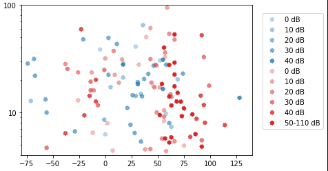
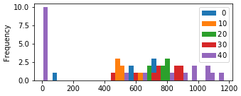
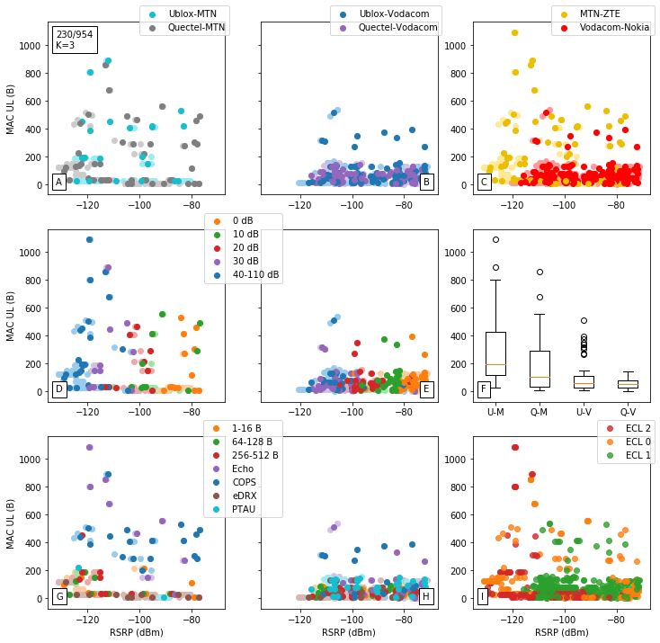

# Declaration {-#declaration}

# Abstract {-#abstract}

# Uittreksel {-#uittreksel}

# Acknowledgements {-#acknowledgements}

# Acronyms {-#acronyms}

- **3GPP** Third Generation Partnership Project
- **LTE Cat-NB1/2** Long Term Evolution Narrow-Band Category 1/2
- **NB-IoT** Narrow Band Internet of Things
- **OTDOA** - Observed Time Difference Of Arrival
- **eDRX** - Extended Discontinuous Receive X
- **PTAU** - Periodic Tracking Area Update
- **COPS** - Cellular Operator Selection
- **NW** - Network
- **EARFCN** - E-UTRA Absolute Radio Frequency Channel Number
- **PCI** - Physical Channel ID
- **ECL**
- **eNB** - **eNodeB** - 
- **USSD**
- **SMS**
- **WAP**
- **IP** - Internet Protocol
- **RRC**
- **PS**
- **UE** - User Equipment
- **MNO**
- **MQTT**
- **CoAP**
- **UDP**
- **TCP**
- **QXDM**
- **PTAU** - Periodic Tracking Area Update
- **MTN** - Mobile Telephone Network
- **LPWAN**
- **BPSK** - Binary Phase-Shift Keying
- **BTS** - Base Transceiver Station
- **D2D** - Device to Device
- **AMQP** - Advanced Message Queue Protocol
-  **AT** - Attention
-  **CDP**- Connected Device Platform
-  **DC**- Data Channel
-  **DCE** - Data Communications Equipment
-  **DL** - Downlink
-  **DTE ** - Data Terminal Equipment
-  **EARFCN ** - Extended Absolute Radio-Frequency Channel Number
-  **GPRS** - General Packet Radio Service
-  **IMEI** - International Mobile Equipment Identity
-  **IMSI** - International Mobile Station Identity
-  **MCS** - Message Coding Scheme
-  **MO** - Mobile Originated
-  **MT** - Mobile Terminated
-  **SIM** - Subscriber Identity Module
-  **SMS** - Short Message Se/rvice
-  **SNR** - Signal to Noise Ratio
-  **TE** - Terminal Equipment
-  **UL** - Uplink
-  **URC** - Unsolicited Result Code
-  **UUID** - Unique User Identification

## SI Units {-#siunits}

- **kB, MB** - kilobyte, megabyte
- **kbps** - kilobits per second
- **mJ or J** - millijoules or joules
- **s, ms, us** - second, millisecond, microsecond

# Introduction {#intro}

This study evaluates the performance of NB-IoT.

A number of tests have been developed, performed and analyzed for multiple UEs (Ublox and Quectel) and MNOs (MTN and Vodacom) via ZTE and Nokia vendors. Power saving, latency, RF, packet and network metrics are evaluated using UDP, Echo, COPS (network registration), eDRX and PTAU tests.

---

NB-IoT is a promising contender to fill the role that 2G/GPRS leaves behind as countries around the world schedule its retirement. There are many alternative LPWANs, however.

## Why NB-IoT?

NB-IoT shows performance benefits over alternatives in terms of uplink and downlink throughput, range. 

* ~ 10 years
* < 10 seconds
* \+ 20 dB improvement over 2G/GPRS
* 

Energy consumption remains a problem [@Durand2019], [@Martinez2019].

## Problem statement {#probstat}

To evaluate the performance of NB-IoT using multiple user equipment (UE) and (MNOs).

There exists an interest in implementing NB-IoT (LTE Cat-NB) as an alternative to LoRaWAN, SigFox and other LPWANs. Application developers require network coverage, and cellular service providers require consumer and enterprise demand or reasonable motivation before rolling it out nationally. Although there is a great deal of theoretical analysis and simulations in research, the lack of empirical evidence may be contributing to a general uncertainty in the standing of the technology with respect to alternatives and a thus a slower adoption. This thesis aims to bridge that divide by evaluating NB-IoT's performance empirically using a set of metrics and to make certain estimations.

Whilst theoretical models provide value in showing how factors affect an approximation, an empirical approach shows the variability induced due to network conditions.

## Research Objectives {#resobj}

Evaluate:

* Latency
* Energy
* Packet size

Estimate:

* Battery life
* Data billing

Aim:

* Evaluate robustness, stability, capabilities, claimed vs actual. 
* Core features/metrics.
* Investigate sources of variability

## Scope of work {#scopework}

Energy, latency, data billing. Durand: THP, MCL, Scalability. Martinez ~

Ericsson, Nokia, ZTE, Huawei. Top 5 LTE vendors.

Not MQTT, CoAP. Not UEMonitor, QXDM etc.

Method should be easily repeatable.

Aware of MTN internal documentation. Independent study.

## Terminology {#terminology}

This section briefly introduces various IoT, LPWAN, LTE and metric related topics and is expanded upon in Section \ref{background}.

The Internet of Things (IoT in Section \ref{iot}) is a blanket term for smart devices that connect to the internet. These devices are typically found in remote or urban areas where it would be more efficient for a device to control and monitor the status of the surrounding environment than human intervention. 

Wired devices usually connect using ethernet, although it is not uncommon to use industry grade protocols such as RS232, CAN, ModBus, ProffiBus, and so on before data reaches a network hub and the internet. On the other hand, wireless connections have the benefit of easy installation and really shine in inaccessible areas. It is quite effective to connect Bluetooth and WiFi for short range applications, or using Low Powered Wide Area Networks (LPWANs in Section \ref{lpwans}) such as LoRaWAN, SigFox and NB-IoT for ranges exceeding a few kilometers and especially for limited sources of power.

Long-Range Radio (LoRa or LoRaWAN in Section \ref{lorawan}) uses chirp-spread-spectrum (CSS) modulation to make it quite immune to doppler effect motion and SigFox (Section \ref{sigfox}) uses binary phase-shift keying (BPSK) which increases noise immunity.

LPWANs enable many use cases (Section \ref{usecases}) in sensors, actuator control and location tracking to name a few.

GSM and GPRS fall under 2G and 2.5G which started development in the early 90s. Data transmission (such as USSD, SMS, WAP, IP) is circuit-switched over GSM, and packet-switched over GPRS. Circuit switched data is billed per time interval such as seconds or minutes, and packet-switched is charged per number of bytes (kB, MB, etcetra). It evolved into 3G in Release 99 at the turn of the millenium and LTE in Release 8 (Q4 2008).

Long Term Evolution (LTE) is a cellular architecture which is a subset of an even more complex 3GPP body that guides its development. In LTE, the narrowband category is known as LTE Cat-NB or NB-IoT. For their M2M applications, LTE Cat-M is similar, yet it features VoIP, faster throughput and _. There are two different versions of NB-IoT, with LTE Cat-NB1 being release 13 and LTE Cat-NB2 being release 14. Their specifications have been frozen in Q1 2016 and mid-2017, respectively.

## Background {#background}

Uncertainty about NB-IoT.

If NB-IoT worked with the mobile network operators to reduce its RRC-idle phase, it could develop a minimal power consumption to compare with that of LoRaWAN and Sigfox.

---

Although NB-IoT joined LPWANs circa 2016-2017, demand uptake among consumer and industry in South Africa is still slow as well as national coverage rollout. Worldwide it has 30% (rough estimate?) population coverage with most in Europe, China and lately America (mid-2019).

In South Africa, NB-IoT has most of its coverage in the Gauteng province as well as a few sites in other towns and cities. Although Gauteng only covers 1.49% of the land mass in South Africa, it holds ~22% of its ~57 million people so it is great as a live trial run before pushing for national coverage.

It is based off of LTE, making integration and upgrading of existing infrastructure more seamless than an entirely separate technology, although it also brings with the drawbacks of legacy LTE. This includes the benefit of low power, and the low bandwidth trade off which is suitable for smart devices and IoT.

An application developer in IoT is interested in a hands-on approach with the technology they will use, with the aim of scaling up production such that volumes of 1000 devices or more can be reached. Thus an empirical evaluation of the technology is focused on in this thesis, especially when considering that much of the research is analytical or simulation bound.

Martinez [@Martinez2019] has explored NB-IoT from the perspective of the application developer. It is well thought out, and follows a similar path to this thesis. When evaluating performance, it would do well to find the limits of the technology as well as find the optimum 'sweet spot' or range for efficient operation.

A user would consider critical characteristics such as energy consumption, coverage, cost, network latency and behavior. Martinez looks at these except for cost, which is better looked at by Ali [@Ali2015]. A set of tests were devised and results showed that in some cases its energy consumption performed better than an LPWAN referenced technology such as LoRa, with the added benefit of guaranteeing delivery. However, the high variability in energy consumption and network latency call into question its reliability especially for mission-critical applications.

Network operators are looking to enter the LPWAN sphere. 3GPP have made this possible by adapting LTE into Cat-M and NB-IoT.

Application developers are always on the lookout for viable technologies, and tend to use the most prolific ones

## Internet of Things{#iot}

In 2014, Gartner estimated that Internet of Things (IoT) had reached the height of inflated expectations, and the hype it generated has resulted in a rich ecosystem of technologies.

Hype yields investment, regardless whether the underlying innovation holds value. IoT holds value in connecting things to the internet, as in its namesake. This can be seen in the venture capital injection into companies and start-ups and the number of connected devices over time.

![Number of connected devices [@Ali2015]](../images/Expected-number-of-connected-devices-to-the-Internet-This-chart-is-obtained-from-recent.png)

IoT shows great potential for exponential growth, and unless a technology disruption occurs which means we do not require connections or our devices, then there is undoubtedly an [uptrend](https://amarketresearchgazette.com/global-narrowband-iot-nb-iot-market-2019-2025-vodafone-china-unicom-china-telecom-att-etisalat-telstra-orange-telefonica-sk-telecom-deutsche-telekom/). As Gartner predicts, we should be in the plateau of productivity now, and this can be observed by looking at the current news regarding the technology.

A few months before publishing, [AT&T announces](https://blog.nordicsemi.com/getconnected/att-launches-nb-iot-network-in-usa) nation-wide coverage of NB-IoT in the USA, alongside its existing LTE Cat-M coverage. Deutsche Telekom and Vodafone cover Europe (news?) and China enables millions more IoT devices [@china2019].

* Matching emerging applications with existing technologies has become one of the
  main challenges for IoT initiatives, especially when a new technology appears in the landscape and the map must be redrawn.

Although there are many ways to connect IoT to the internet, NB-IoT is an LPWAN which is the focus of this study.

## Low-Powered Wide-Area Networks {#lpwans}

There are many wireless technologies out there, with some standardized (including Bluetooth, 6LowPan, RPMA, Weightless, IETF 6TiSCH, SigFox, LoRaWAN, Dash7 amongst others). Many are proprietary to retain company value and they try to meet application specific requirements also limited by technological constraints. Matching custom applications with a wireless technology is non-trivial as there is no silver bullet that matches all use-cases. On the contrary, many technologies overlap in their capabilities.

Table: Brief comparison of wireless LPWANs

|                       |             | LoRaWAN           | SigFox   |      |      |
| --------------------- | ----------- | ----------------- | -------- | ---- | ---- |
| Frequency             |             | 433, 868, 915 MHz | ~868 MHz |      |      |
| Bandwidth             |             |                   | 200 kHz  |      |      |
| Throughput            | 56–114 kbps | 27 kbps           | 0.1 kbps |      |      |
| Duty cycle limitation |             | 1-10%             | 1%       |      |      |
| Messages per day      |             |                   | 140      |      |      |
| Bytes per message     |             |                   | 12       |      |      |

Table: Brief comparison of cellular technologies

|                   | 2G/GSM/GPRS | EC-GSM-IoT | LTE Cat-M | NB-IoT     |
| ----------------- | ----------- | ---------- | --------- | ---------- |
| Frequencies       |             |            |           | 0.8-2.6GHz |
| Bandwidth         |             |            |           | 200kHz     |
| Throughput        |             |            |           | 250 kbps   |
| Bytes per message |             |            |           | 512        |

LPWANs enable a vast array of use cases.

|              | MCL    | Scalability | Battery life | Throughput |
| ------------ | ------ | ----------- | ------------ | ---------- |
| NB-IoT       | 164dBm | >50k        |              |            |
| GPRS         | 148dBm |             |              |            |
| LoRaWAN SF12 | 157dBm |             |              |            |
| SigFox       | `dBm   | >50k        |              |            |

| Technology   | MCL  | Scalability | Battery life | Throughput |
| ------------ | ---- | ----------- | ------------ | ---------- |
| NB-IoT       | X    | X           |              | X          |
| GPRS         |      | X           |              | X          |
| LoRaWAN SF7  |      |             | X            |            |
| LoRaWAN SF12 | X    |             |              |            |
| SigFox       | X    | X           |              |            |

* Competition in the LPWAN space and regional momentum will ensure that the various technologies will continue to develop and improve to support more features and expand the network coverage. 
* We expect selected uptake of each technology in specific application areas and our results show that each technology is better suited to specific applications and their concomitant requirements. Sigfox, NB-IoT, and LoraWAN SF12 performed equally well for applications where MCL (range) is paramount, with LoraWAN SF7 doing slightly worse. In applcitions where the main consideration is scalability, Sigfox, and NB-IoT substantially outperformed the LoraWAN varieties. However, if battery life is the most important consideration, LoraWAN SF7 seems to have the edge, with NB-IoT (the default setup we tested) performing worse. NB-IoT performed the best for uplink throughput, with LoraWAN SF7 coming in second. For all the other two-related metrics evaluated, namely downlink throughput and firmware upgradability, NB-IoT performs substantially better than the other technologies.
* Poor for asset tracking and utility metering.
* Average for smart bicyles, parking, garbage bins, agriculture and intelligent buildings.
* Good for pet tracking, POS, healthcare.
* NB-IoT outperforms SigFox and LoRaWAN in UL/DL throughput, scalability, MCL range and FoTA updates. It is superseded by LoRaWAN in battery life for SF7.

## Metrics {#metrics_intro}

* **MCL**: For IoT devices used in extended coverage situations,
  such as deep-indoor devices or remote locations, we recommend either Sigfox or NB-IoT, as they offer a maximum MCL of more than 158 dB. IoT devices for general use would benefit from the large-scale deployment of the GPRS network, which provides excellent coverage because of its legacy infrastructure. It is clear that the extra overhead available in Sigfox, LoRaWAN, and NB-IoT allows for better indoor coverage than GPRS, which means that the LPWAN devices can be used in less than optimal operating conditions. Measured MCL correlates with theoretical values.
* **Power consumption**: In applications where device battery life is
  a crucial factor we recommend, either LoRaWAN or Sigfox, because they are completely asynchronous. We found that the battery life of LoRaWAN SF 7 was five times that of LoRaWAN SF 12 and nearly 25 times that of Sigfox. This is mainly due to the extremely long time-on-air of LoRaWAN SF 12 and Sigfox. If NB- IoT worked with the mobile network operators to reduce its RRC- idle phase, it could develop a minimal power consumption to compare with that of LoRaWAN and Sigfox.
  * It is clear that LoRaWAN SF7 is the most power-efficient, due to the short transmission burst. NB-IoT displays the worst power-consumption, due to the extended RRC-idle state. This can be reduced using Release Assistance as in Section \ref{release_a}.
* **Throughput**: As throughput differs greatly between the four technologies, comparisons should rather be made in either the licensed (NB-IoT and GPRS) or unlicensed (Sigfox and LoRaWAN) spectrum categories. Applications that require huge amounts of data to be transmitted, such as real-time vehicle fleet monitoring, we recommend GPRS and NB-IoT as they are not duty cycle limited. The choice of GPRS or NB-IoT will be based on the battery life requirements of the IoT device, with NB-IoT having the advantage. In the case of extremely low-throughput applications, such as water meters, power meters, and weather stations, we recommend Sigfox, as it offers a scalable solution with no base station costs involved. Although it limits the 12 byte throughput per 24 h to 140 messages, this is more than the 20 messages offered by LoRaWAN SF12 (TTN).
  * As NB-IoT operates in the licensed spectrum, there are no
    throughput restrictions, other than the data-rate restriction. We measured the uplink and downlink data rates in different signal quality environments (distances from the gateway) by querying the modem. The measured downlink rate varied from 2250 to 14,193 bps. We could find no clear correlation between the downlink data rate and the signal quality environment.
* **Scalability**: 
  * Lower (sub-500 devices per gateway) scalability of LoRaWAN per base station compared to NB-IoT and GPRS. This low scalability is due to the limited number of channels and the lack of any scheduling between devices. To compensate for the low scalability, an increase in spatially diverse base stations would allow packets to be received by multiple base stations at varying received power levels.
  * This simulation showed that with 55,000 devices transmitting the base station would reach the 270 simultaneously transmitting devices that Sigfox claims is possible while still ensuring a 99.9% PDR.
* **Down link latency**: In applications where downlink latency is a
  critical component, only GPRS will suffice, as it is the only technology in this study that requires constant paging between the base station and the end device. 
* **Down link throughput**: Any applications requiring bi-directional communication of more than 120 bytes per 24 h, should use NB- IoT or GPRS, as Sigfox and LoRaWAN are limited by the duty- cycle limitations of the base station. 
* **FoTa**: GPRS and NB-IoT are able to offer FOTA upgrades to IoT devices, as Sigfox ha s limited bandwidth. This feature is supported by LoRaWAN, through the fragmentation of large payloads [22].

## Use cases {#usecases_intro}

- Public Safety
- Agriculture
- Smart Metering
- Actuator Control
- Real-time Monitoring
- Asset Tracking

IoT has use case requirements in UL/DL throughput, battery longevity and scalability.

The most popular use case in IoT is smart metering.

## Smart metering {#smartmetering}

One of the simplest use cases in IoT is smart metering. Periodically sending uplink data at regular intervals from a static location has the advantage of remote monitoring and reducing the need for physical readings. It also opened up new features for users (such as dynamic pricing and usage pattern analysis) and operators (such as load balancing a large number of clients). The clear value proposition and success is partially due to the belief that IoT should be low powered and low data transmissions which still exists today.

**Smart metering can be considered as defeating the purpose of NB-IoT when considering its downlink capabilities.**

Smart metering can be considered the traditional IoT model.

## Push-pull model

Traditionally, IoT devices push data to the internet at regular intervals. This push model can be considered quite energy inefficient, especially when the data is only occasionally actionable. For example, in asset tracking or remote monitoring.

A pull model is ideal for dynamic rule engines, pulling data only when necessary and ultimately edge computing, where building an application around this idea can greatly enhance battery life.

## Edge computing

Edge computing is the practice of offloading cloud processes to the endpoint. It saves on data overhead, especially when there are data charges involved and battery longevity is desired.

Since NB-IoT is optimized for downlink communications, it can be the ideal candidate.

## NB-IoT {#nbiot}

Formed by the 3GPP from LTE, NB-IoT was developed within that framework and its capabilities are particularly well suited to smart metering.

![IoT Market representation [@Martinez2019]](../images/1559246290186.png)

Taking it one step further, the 3GPP defined two device categories, namely Cat NB1 and NB2, with the latter adding support for:

- Support of Positioning of Device using OTDOA
  - seamless cell re-selection
- Push to talk voice messaging
- New Device Power Class (14 dBm)
- Multicast transmission

 OTDOA positioning, 

Compared to LTE

- devices are stationary

- intermittent burst transmissions

- low data bandwidth

- delay-tolerant applications

- support for huge number of devices

- deals with poor coverage (indoor penetration)

- battery lifetime of a few years

  

* eDRX and PSM
* Debugging
  * QXDM, UEMonitor etc
  * [@ubloxAppNote2018]

* NB-IoT devices are seen as stationary, only small chunks of data are intermittently transmitted and applications are envisaged as delay-tolerant.
* NB-IoT technology is designed such that it can be used in areas beyond the radio coverage of current
  cellular standards and in devices which must run from battery power for many years. The devices
  will generally send small amounts of data infrequently; a typical usage scenario might be 100 to
  200 bytes sent twice per day for battery powered devices. For mains powered devices the limit is not
  based on battery size, but cost and network bandwidth/resources.
* The system operation is analogous to SMS in that it is a datagram-oriented, stored-and-forward
  system, rather than a GPRS-like IP pipe. This is because NB-IoT devices spend most of their time
  asleep, making possible the required long battery life. The system implements extended DRX cycles
  for paging, but as this window will be limited to save battery life, the delivery of downlink messages
  occurs mainly when the system detects that uplink messages have been received from a device
  (indicating that it is awake). Here a store-and-forward system, an “IoT Platform”, is useful.

Although most users interact only with the UE which runs its own proprietary firmware stack, NB-IoT also has a complex backend architecture.

## LTE Architecture

The complexities of LTE architecture further increases the chance of performance degradation with respect to 3GPP specifications due to the vast array of setup parameters. It would be beneficial to analyze the performance of multiple UE against various MNO vendors. It is important to note that MNOs may use various vendors in their architecture, and thus this study is mainly focused on the eNodeB vendor which is also UE facing and has the greatest chance of performance degradation due network quality, RF interference and so forth.

* Both UDP socket commands and datagram commands use the IP data transport through the SGi.

## Performance evaluation

It would be useful for the application developer to know the boundaries resulting from this approach. Drawbacks and optimizations targeting IoT can be discussed. The application developer is a potential adopter of the technology and focuses on parameters that fall within end-user control.

Cellular operators would also benefit by knowing where they can improve upon their configurations and equipment.

To this end it would be beneficial to:

- Analyze critical metrics at the core of NB-IoT, such as energy consumption, coverage, cost and latency.
- Create a testing framework to characterize NB-IoT devices in actual operation and using various networks.
- Set optimal operating boundaries based on the obtained results. This should also re-evaluate suitability in certain use cases.
- Compare NB-IoT to Dash7, which can be considered a prominent bi-directional contender. It has the capability of using LoRa's physical layer (RF frontend) so has the added benefit of long range.

There are over 50 MNOs in the world that are using NB-IoT, yet most draw from a subset of the [top 5 LTE vendors](https://www.rcrwireless.com/20160531/network-infrastructure/top-5-wireless-infrastructure-makers-tag4-tag99):

1. Huawei
2. Ericsson
3. Nokia
4. ZTE
5. Samsung

## MNO Vendors

In South Africa, there are two mobile network operators trialing NB-IoT and combined they use four of the top LTE vendors. Samsung has started using NB-IoT only as recently as May 2019, [announcing a partnership with KT to create a Public Safety (PS-LTE) network](https://enterpriseiotinsights.com/20190506/nb-iot/samsung-kt-launch-nbiot-service-through-ps-lte-network-korea). They're also implementing device-to-device (D2D) communications to increase connectivity in unfavourable conditions.

Table: MNOs and their BTS Vendors

| BTS Vendors | Cellular operator (MNO) |
| ----------- | ----------------------- |
| Nokia       | Vodacom                 |
| ZTE         | MTN                     |
| Huawei      | Vodacom                 |
| Ericsson    | MTN                     |

Theoretically, one can assume that these manufacturers meet 3GPP's specifications and that they have set up an optimal environment.

With a testing framework, one can evaluate these capabilities in a transparent manner for both developers and cellular operators alike and work towards improving the quality thereof.

Cellular operators are in control of some things, and users of others.

|                             | Cellular operators | Users       |
| --------------------------- | ------------------ | ----------- |
| NB-IoT Base stations (BTS)  | **X**              |             |
| NB-IoT User Equipment (UE)  |                    | **X**       |
| LoRaWAN Gateways            |                    | **X**       |
| LoRaWAN Devices             |                    | **X**       |
| NB-IoT licensed spectrum    |                    | billed      |
| LoRaWAN unlicensed spectrum |                    | duty-cycled |
|                             |                    |             |
|                             |                    |             |

MNO/BTS Vendors are open to all UE manufacturers.

## UE Manufacturers

UE devices specifically used:

- Ublox Sara N200
- Quectel BC95

and the following recommended in future:

- Nordic nRF9160
- SimCom SIM7020E

### Ublox

### Quectel

### Nordic

### SimCom

These UEs all share AT commands as the API to control their capabilities.

## AT Commands {#atcommands}

This section outlines the capabilities of the UEs.

Table: Summary AT Command set for Ublox

|                      | Command    | Description                                                  |
| -------------------- | ---------- | ------------------------------------------------------------ |
| Set configuration    | AT+NCONFIG | Change configuration for SI_AVOID, Scrambling etc.           |
| Network Registration | AT+COPS    | This command initiates search for cell towers to connect to depending on MNO-related SIM-card and registers/deregisters accordingly. |
| Set APN              | AT+CGDCONT | Sets the relevant APN for the MNO.                           |
|                      |            |                                                              |

* SARA-N2 series modules implement a FOTA solution based on CoAP. It is possible to configure the
  module’s poll timer for when the module checks the FOTA CoAP server for new firmware. When the
  feature is enabled and a new package is available, the module will automatically download the FOTA
  update and provide URCs about its progress. The module’s firmware is not updated automatically
  when the download has completed and so the application must start the upgrade process step.
* The +UTEST AT command allows the user to set the module in non-signaling (or test) mode, or
  returns to the signaling (or normal) mode. In test/non-signaling mode, the module switches off the
  protocol stack for performing single tests which could not be performed during the signaling mode.
* MO Datagrams sent and received by IoT platform has these commands wrapped internally in a Constrained Application Protocol (CoAP) message and sent over UDP sockets. Once the module accepted a datagram it cannot be removed and will be transmitted to the network as soon as radio conditions permit. The only way to clear the module’s transmit queue is to reboot it. In good radio conditions, the transmission might take a few seconds. In bad radio conditions a transmission opportunity may not occur for minutes, days or weeks but the datagram will be transmitted once radio conditions are good enough. When a MO message is queued, the module will try to send the message to the base station. It will only send the next message once the previous message has been sent. If there is a radio link failure (RLF), the device will re-scan the channel ranges and try to reconnect to a base station. There may be a back off time where the device goes into deep-sleep mode before trying again.
* An unsolicited result code (URC) is a string message (provided by the DCE) that is not a response to
  a previous AT command. It can be output, when enabled, at any time to inform the DTE of a specific
  event or status change.

When it comes to base stations, the user does not have control over the inactivity timer. Release assistance can request the eNB/network to disconnect the modem from Radio Resource Control (RRC) connected mode.

## Thesis structure {#thesis-struct}

NB-IoT is introduced to the reader in Chapter \ref{intro}. A literature study reviews the current empirical research in Chapter \ref{litstudy}. Design and methodology shows the steps taken to capture different metrics and process the resulting dataset in Chapter \ref{design}. Results are analyzed in Chapter \ref{results} and discussed with recommendations in Chapter \ref{#discussion}. Lastly, a conclusion is made in Chapter \ref{conclusion}.

# Literature Study {#litstudy}

Several studies provide theoretical models not only for the energy consumption of NB-IoT networks [@Andres-Maldonado2017], but also for their latency and delay bounds [@Feltrin2019], impact of coverage extensions [@Andres-Maldonado2018b], coverage performance [@Adhikary2016], battery lifetimes [@Yeoh2018d],[@Lauridsen2018], (theoretically) optimal configuration strategies [@Feltrin2018] and overall performance for particular verticals [@Soussi2018],[@Beyene2017b].

Only Martinez [@Martinez2019] focuses effort on the adopter and presents an operational and empirical analysis of the technology when it is deployed in a real network (such as Vodafone in the Metropolitan area of Barcelona). Durand [@Thomas2018] compares different LPWANs empirically including NB-IoT.

Despite the unquestionable value of the theoretical models (for example, to understand orders of magnitude or to guess the theoretical upper and lower bounds), an empirical approach provides real insights into the variability that a UE experiences when deployed in real conditions. This work therefore complements Martinez and related works, and it further provides empirical measurements for UEs that are deployed using a real-world NB-IoT network always while taking the perspective of an application developer.

* GSM RF equipment testing and performance analysis [@Kasbah2005]
* Analysis of NB-IoT Deployment in LTE Guard-Band [@Ratasuk2017c]

The empirical results of NB-IoT depend on the device used (UE) and underlying vendor architecture of the MNO providing coverage. Thus, 

## LoRaWAN {#lorawan}

LoRaWAN is a contender for NB-IoT. It lacks bidirectionality and datarate.

* LoRaWAN performs better for short messages, but it is subjected to a very high penalty when
  more than one message per data block is required.
* Second, the LoRaWAN reliability mechanism must be ensured at the
  upper layers, and thus may incur higher energy costs.
* 

## SigFox {#sigfox}

SigFox is a contender for NB-IoT. It lacks bidirectionality and datarate.

## NB-IoT {#nbiot_lit}

- This section describes NB-IoT in more detail and the setup procedures involved.
- 3GPP
- the UE is to a large extent/entirely controlled by the network/eNodeB.
  - UE must follow NW settings broadcast inside the SIB and allocations for UL/DL data.
- 

## Standing/Positioning

[@Martinez2019]

NB-IoT has proven to be competitive in terms of energy consumption,

* Decent study on the operational trade-offs of NB-IoT over LTE.

Complexities

- signalling, dynamic adjustments triggered by network conditions, timing
- competitive in terms of NB-IoT consumption due to 3GPP efforts to be similar to LPWANs

Proprietary spectrum vs ISM bands?

- ISM external interference and share
- otherwise high unpredictability in device behavior

Reliability?

- Delivery guarantee

Delay Tolerance

- high variability in delivery time. Deal-breaker for some applications.

Data rate

- sporadic high bandwidth

Ownership model

- connectivity service, contract, charged per byte
- coverage depends on deployed infrastructure

## Hardware

* Modem
* Antenna
* RX/TX lines

## Setup

* AT+NCONFIG
  * AUTOCONNECT
  * CR_0859_SI_AVOID
  * CR_0354_0338_SCRAMBLING
* URCs
* APN

## Network Registration

- By default the SARA-N2 series modules will automatically try and connect to the network. This
  feature will read the SIM for the PLMN and attempt to register with the network. The device will use
  the default APN from the network. The auto-connect feature can be enabled by the +NCONFIG AT
  command. Reset the module to save these settings to the non-volatile memory.
- If the application requires more control over the registration process set the SARA-N2 series
  modules into the manual registration mode. With the auto-connect feature turned off the module is
  able to manually connect to a specific PLMN and specify an APN.
- After a RRC connection is made to the base station the module will try and register with the
  network. If the module IMEI or IMSI is not allowed on the network, the module will disconnect from
  that base station and continue scanning for other base stations. This can be seen if the <mode>
  parameter of the +CSCON AT command shows the “1” and then “0” response without +CEREG
  changing to 1 or 5 means that the module was not able to register on that network.
  In case the module is registered to the network, the <status> parameter of the +CEREG AT
  command will be 1 (registered) or 5 (registered & roaming).
- See [@ubloxAppNote2018]] for a connection status compatibility matrix.

## RRC Connection and Inactivity Timer

After network registration or transmitting a data packet, the device usually enters RRC connected (C-DRX) mode for a specified inactivity timeout specified by the network.

- When the module is in RRC connected mode it will be receiving all the base station signaling. The
  average power consumed in this mode is about 48 mA. If the RRC connection is left for 20 s of
  inactivity before the RRC is released, then this will consume about 1 mWh @ 3.6V.
- 48 mA in this mode
- 20 seconds is about 1mWh @ 3.6V
- AT+CSCON
- After a short period, if no messages are being sent from the module, the +CSCON response will be
  “0” to show the RRC connection has been released by the eNodeB.
- At the first registration or when the module wakes from the power save mode (PSM), it performs a
  Random Access CHannel (RACH) procedure to attach to the base station. This establishes a Radio
  Resource Control (RRC) connection to the base station. Once established only the base station can
  release this connection. The module cannot drop the RRC connection other than turning off the
  radio using the AT+CFUN=0 command.
- The base station has an “inactivity” timer for each module and if there is no activity the base station
  will send a RRC release message to the module. The module should respond back to the base station
  with an acknowledgment. The inactivity timer is nominally 20 s.
- The module will be able to receive and send messages immediately when in connected mode.
- During a RRC connection, the +CSCON AT command provide the signalling connection status. It is
  also possible to enable the +CSCON URC.
- When a MO message is sent from the module, the module must first create a RRC connection if
  there is not already established with the base station. This status can be checked using the
  AT+CSCON command.
  To check the signalling connection status issue the +CSCON read command. The second parameter
  of the information text response (+CSCON: <n>,<state>) provides the interested information:
  * 0: idle mode (no RRC connection)
  * 1: connected mode (RRC connection)
- To configure a URC for this command, issue the AT+CSCON=1 command. A URC will be issued at
  each RRC connection status change. 

## Release Assistance {#release_a}

Release assistance requests the eNodeB to release the RRC connection immediately. By avoiding 20 seconds of idle RRC in C-DRX mode, there is a 93% improvement in power consumption for a 200 byte transmission in ECL 1.

[@ubloxAppNote2018]

An example of sending a 200 byte message in ECL 2 with good SNR can include 5 RACH transmission bursts, a Transmission Block Size ~43 bytes, one repetition and taking just over 1 second, consuming 200uWh.

For the same example in bad SNR, the TBS allocated 32 bytes per chunk, with a repetition of 8 and 4. It took 5.5 seconds and consumed 1.07mWh -- fives times as much as before.

- Some applications may not want to wait for the base station’s inactivity timer to expire after 20 s as
  this wastes power from the battery. In Release-13 the “Release Assistance” feature allows the
  module to request for the RRC connection to be dropped as soon as the message has been received
  by the network.
- The flag is noticed by the MME on the network and sends a message back to the eNodeB base
  station to drop the RRC connection. The network must support Release Assistance for this feature.
- After the RRC connection has been released the module then goes in to a period where it could be
  paging the base station. The timer for this period is called T3324. After T3324 has expired the
  module goes into Power Save Mode (PSM). See section 11 for further information

## eDRX, PSM, Active and PTAU

The NB-IoT protocol allows for power save mode (PSM), and the SARA-N2 series modules also
support a Deep Sleep mode where the module is running at very low current, ~3 $uA$. The module
automatically enters various states depending on the device activity. Here below are listed the
common activities and the various states it will be in after registration.

* T3324 / T3412 timer values

### T3412 PTAU Timer

* (GPRS timer 3)
*  3GPP TS 24.008 [4], figure 10.5.147a and table 10.5.163a.

* Bits 5 to 1 represent the binary coded timer value. Bits 6 to 8 define the timer value unit for the GPRS
  timer as follows
* 8 7 6
  0 0 0 value is incremented in multiples of 10 minutes
  0 0 1 value is incremented in multiples of 1 hour
  0 1 0 value is incremented in multiples of 10 hours
  0 1 1 value is incremented in multiples of 2 seconds
  1 0 0 value is incremented in multiples of 30 seconds
  1 0 1 value is incremented in multiples of 1 minute
  1 1 0 value is incremented in multiples of 320 hours (Note 1)
  1 1 1 value indicates that the timer is deactivated (Note 2)
* Example: "01000111" = 7 x10 hours = 70 hours
* NOTE 1: This timer value unit is only applicable to the T3312 extended value IE and the T3412
  extended value IE (see 3GPP TS 24.301 [5]). If it is received in an integrity protected message, the
  value shall be interpreted as multiples of 320 hours. Otherwise the value shall be interpreted as
  multiples of 1 hour.
* NOTE 2: This timer value unit is not applicable to the T3412 extended value IE. If this timer value
  is received, the T3412 extended value IE shall be considered as not included in the message (see
  3GPP TS 24.301 [5]).

### T3324 Active Timer

* The T3324 Timer is reset after a downlink message is received. The negative impact on energy savings should be taken into account if downlink data is fragmented.
* the Active Timer (T3324) controls the time lapse during which the UE is reachable by the network in RRC Idle, i.e., the number of eDRX cycles.

* Bits 5 to 1 represent the binary coded timer value. Bits 6 to 8 define the timer value unit for the GPRS
  timer as follows
* 8 7 6
  0 0 0 value is incremented in multiples of 2 seconds
  0 0 1 value is incremented in multiples of 1 minute
  0 1 0 value is incremented in multiples of deci-hours
  1 1 1 value indicates that the timer is deactivated
* Example: "00100100" = 4 x1 minute = 4 minutes

### eDRX Cycle

* An eDRX cycle is composed of an active phase, controlled by a Paging Time Window (PTW) timer, which ranges from 2.56 s to 40.96 s followed by a sleep phase until the end of the eDRX cycle. Within the PTW, the standard LTE paging is observed.

### PTW

## System Information Blocks (SIB) {#sib}

The SIB describes the method of attachment and what repetitions the UE must use to first transmit
to the base station. Once a RRC connection is made, the base station then uses the perceived SNR
to configure the uplink allocations the UE will use to transmit the messages.
Because allocations for each uplink/downlink are dynamically set by the base station it is difficult to
calculate the power consumption of a single message deployed in the field.

* example SIB

## Repetitions (ECL)

* ECL
* Module interference increases the number of repetitions
* Minimize ECL 2.
* Network operators should provide enough coverage to allow devices to be mostly in coverage class 0
  or 1. Depending on the NB-IoT deployment, the network could have large areas, or devices located in
  deep locations which unfortunately mean they operate in Coverage Class 2.
* Coverage Class 2 uses high repetitions for the RACH process and also higher coding schemes when
  transmitting data and therefore fundamentally consumes more power than it would in the other
  coverage classes.

* 

## Behavior

* The application can monitor the status of the module’s connection, registration and PSM state by
  polling or configuring URCs. By monitoring the module status the application can behave more
  efficiently, depending on the application type. For example, the application may want to know when
  the module goes into Power Save Mode (PSM).

Register the module to the NB-IoT network before to send or receive any messages. Without being
registered the module will not be able to send or receive any messages.
To check the network registration status issue the +CEREG read command. The second parameter
of the information text response (+CEREG: <mode>,<state>) provides the interested information
* 0: not registered, not registering
* 1: registered
* 2: not registered, but currently in the process to
* 3: registration denied. The application should have a re-try mechanism which does not simply try registration immediately, but has some back-off process
* 4: unknown
* 5: registered, roaming

When the module has started the network search process, poll the +NUESTATS AT command and
view the Rx and Tx Time:

* If Rx Time is increasing then the module is trying to scan for a base station.
* If Tx Time is increasing then the module has found a base station and is trying to communicate
  with it.
* If the Total Power and Signal Power values are different than -32767 (invalid) then the module has
  read the MIB and SIB signals from the base station.
* Once an RRC connection is made, the +CSCON read command will return 1. Turn on the +CSCON
  URC which will be output at each RRC connection change.

If the SIM used is an international SIM (roaming SIM) then the registration process can take many
minutes for the first time. Once the module is registered on that network the PLMN should be
stored in the SIM so that registration is quicker next time. The application can tell if it is using
roaming SIM by the state being “5”.

* The +CEREG URC can be enabled to provide the network registration status. Depending on the
  <mode> parameter it is possible to configure the interested URC parameters (i.e. <mode>=4 or 5 to
  see the provided network timers). See SARA-N2 AT Commands Manual [2] for more details.
* Properly setting the +CEREG AT command (<modem>=3, 4 or 5) it is possible to see the
  registration EMM cause value. These values are described in the 3GPP TS 24.008 [4]. Typical
  causes:
  * #5 IMEI not accepted
  * #11 PLMN not allowed
  * #12 Location Area not allowed
  * #13 Roaming not allowed in this location area
  * #22 Congestion

## Data transmission

The SARA-N2 series modules are able to send raw data through UDP sockets to an IP address. The
data sent over the socket AT commands is not wrapped in any other layer, and the data provided is
the data that is sent.

The Constrained Application Protocol (CoAP) is a datagram-based client/server application protocol
for devices on the constrained network (e.g. low overhead, low-power), designed to easily translate
to HTTP for simplified integration with the web. CoAP clients can use the GET, PUT, POST and
DELETE methods using requests and responses with a CoAP server.

The usage of the Non-IP method during the sending or receiving of messages saves the overhead of
needing to send a UDP IP header.

See [@ubloxAppNote2018] for an Application example.

### Ping

Issue the +NPING AT command to check if the module is able to send and receive data.
Check to see if the network can communicate to the internet, or it is needed another accessible
server’s IP address to ping.
To ping Google’s DNS server:
AT+NPING="8.8.8.8"
To ping OpenDNS DNS server:
AT+NPING="208.67.222.222"
The information text response to the +NPING AT command will be issued after a few seconds. If the
information text response is +NPINGERR: 1, the ping has timed out.

* The first ping might fail because it can take a few seconds to connect to the base station. Use
  the +CSCON URC to show when the module is connected.

### Echo

For a more advanced check on sending data to an external server, send data to the u-blox echo
server at echo.u-blox.com.
* Because there is no DNS lookup function in the SARA-N2 module series, use the IP address
server which is 195.34.89.241.

Command Response Description
AT+NSOCR="DGRAM",17,10000 0
OK
Create a UDP socket.
AT+NSOST=0,"195.34.89.241",7,5,"0102
030405"
0,5
OK
Send data on socket 0.
+NSONMI: 0,5
Receive data on socket 0.
AT+NSORF=0,5 +NSORF: 0,"195.34.89.241",7,5
,"0102030405",0
OK
Request data from socket 0.
Echo’d data received

## Available Metrics

When the module is synchronized to the base station and is receiving the signaling the +NUESTATS AT command is able to describe the radio, cell, BLER and throughput statistics.
The most useful statistic is the "RADIO" type.

### RSRP

It is the power of the wanted part of the receive signal, the NB-IoT part.

### Total power

It is the radio signal strength within the receive bandwidth (both expressed in 10ths
of a decibel). From this the signal to noise ratio can be calculated.

### Transmit power

* It is the RF power output from the module. It may be a low number if the
  received signal strength is good (and hence the module assumes that the base station is close
  by).

*  Ideally the module
  should consume 230 mA for +23 dBm.

### TX, RX Time

TX Time is the duration for which the module’s transmitter has been switched on.

RX Time is the duration for which the module’s receiver has been monitored for downlink
activity (both expressed in milliseconds since the last reboot). Together these can be used to
assess the time the module spends in each state and hence estimate the power consumed by
the module.

When the module first tries to register with the network, the Tx time will be zero as it will not have
instantly found a base station. The Rx time will increase to show it is scanning for a base station.
Once a base station is found it is possible to see that it is attempting to transmit to the base station
as the Tx time will start to increase. If the base station does not respond to the module’s Tx, then
the +CSCON: 1 URC will not be issued.

### ECL 

It is equivalent to "PRACH coverage enhancement level" defined in 3GPP 36.321 [3] sub
clause 5.1

* As observed, the ECL has an impact on energy consumption, but not on the delay.

### SNR

Last SNR value.

## Latency {#latency}

* < 10 seconds
* 

## Power Consumption {#power}

* ~ 10 years battery life

Low power consumption is vital for battery longevity.

* PCB layout, antenna matching and location will have an effect to the overall interference received by the module.
* PSM and eDRX
* On the other hand, although the average power is comparable, peaks in transmission of LoRaWAN’s radio are around 40 mA, while in NB-IoT they reach 220 mA. This causes additional stress on the battery, which has to be managed with care.
* As can be observed, mean values for NB-IoT are similar to the energy that a LoRaWAN device requires to transmit while using the SF12 configuration. The 5th percentile results for NB-IoT (best observed performance) are comparable to the best case performance of LoRaWAN when operating at SF8. This is in our opinion a relevant result, as NB-IoT guarantees packet delivery with similar power consumption.
* The expected achievable lifespan (on average) for a NB-IoT is on the order 2-3 years, depending on the datagram size.
* However, adopters may take into consideration some differences. First, sending larger messages (up to 512 bytes) has almost no impact on NB-IoT.
* In a simple periodic-reporting application with very limited computing requirements5, the average power can be modeled approximately by Eq. \ref{eq:avgpower}, as detailed in [21]:

$$P = \frac{E_{msg}}{T_{msg}}$$ {#eq:avgpower}

* 

## Data Usage

* The module has a limited dynamic message queue size. For IoT applications, the message size should be of the order of tens of bytes. UDP socket commands limit their payload size to 512 bytes.
* There is no indication when the UDP data has been sent.
* Downlink data from the cloud server must also be 512 bytes or less, because otherwise the messages will be lost.
* The module has an internal message buffer. If the module is unable to send the messages to the network before this buffer is full, because the application is queueing quicker than it can send them, then the UE will return ERROR for the +NSOST/+NSOSTF commands.
* If a message cannot be sent because of communication issues between the module and eNB, the module will attempt to send the message a second time. If this fails, the message will be dropped. As +NSOST/+NSOSTF messages are UDP, there is no indication the message has been dropped.
* The UDP header is about 48-60 bytes in length, and so an application sending 100 bytes will actually send about 160 bytes. For devices in the extreme coverage class 2, this can be quite costly.
* The UE may later resume the RRC Connected state with that context, thus avoiding the AS setup and saving considerable signaling overhead for the transmission of infrequent small data packets.

## Application Architecture

* 
* At the far left the customer’s device contains a u-blox NB-IoT module that communicates over the radio network with a cell tower that supports the NB-IoT network. The cellular network links the cell tower with an IoT platform. This IoT platform stores uplink datagrams from the NB-IoT module. The customer server communicates with the IoT platform to retrieve uplink datagrams and to send downlink datagrams to the NB-IoT. The IoT platform holds downlink datagrams until the NB-IoT module is awake to receive them.
* The SARA-N2 series modules implement basic UDP socket commands for directly communicating with an external service. With these commands the customer can build a simple IoT platform. With an external processor other IoT layers could be implemented to aid this system design. SARA-N2 series modules support AT commands for general CoAP messaging. This allows the customer to not require CoAP in their external processor.
* Many developers coming from a GPRS type background may expect an always on type connection, normally using TCP. NB-IoT is not session oriented, latencies are much higher and the device will enter a power save mode. This is very different to always-on modems with “chatty” protocols like TCP.
* UDP sockets do not create connections to servers; UDP is a connection-less datagram protocol. Because of this MO messages may not be received by the server and lost. The application should take this in to consideration and provide its own acknowledgements between the UE and server. CoAP is one protocol which can be used on top of UDP to provide this.
* For resolving the issue of sending MT messages to a very sleepy module, when a MO message is sent to the cloud server, the cloud server will know the module is active and connected to the network. As seen in section 7 the connection is alive until the RRC connection is released by the network and then still contactable when paging inside the T3324 period. If there are MT messages to be sent to the module, the cloud server should send this message in this time.

## Use cases

Use cases suitable for NB-IoT

## Martinez

Martinez et al. [@Martinez2019] did empirical tests within the Vodafone Network in Barcelona. They observed UE and NW behavior, measured current traces, and did various tests in different modes.

| Mode       | NW Configuration                                             |
| ---------- | ------------------------------------------------------------ |
| **Mode 1** | Inactivity timer = 20s (network default) T3324 = 0s (disabled) C-DRX = 2.048s (network default) |
| **Mode 2** | Inactivity timer = Immediate Release T3324 = 8s I-DRX = 2.56s eDRX/PTW = Disabled |
| **Mode 3** | Inactivity timer = Immediate Release T3324 = 0s (disabled) |

* performance bounds
* empirical

## Notes

**MTN Lab / 14th Ave Phase 3: Test Plant**

NB-IoT PoC MTN South Africa (Ericsson RAN Connectivity Tests only) [@Ssengonzi2017]

Industrial north Drive Test Requirements [@NorthDrive2017]

**Stellenbosch**

Evaluation of next-generation low-power communication technologies to replace GSM in IoT-applications [@Thomas2018]

**Manufacturers**

Ublox has an NB-IoT Application Development Guide [@ubloxAppNote2018] which details many of the capabilities of the UE.

# Design and Methodology {#design}

## Approach

The aim is to compare user equipment (UE) against mobile network operators (MNOs) with a set of tests that evaluate NB-IoT's performance according to a set of metrics which highlight striking differences due to the underlying complexities of LTE architecture.

Four mobile network operators (MNOs) are compared in South Africa according to the underlying vendor
infrastructure used, namely Nokia and ZTE in the Cape/coastal regions and Ericsson and Huawei based in Gauteng/inland regions.

More than one UE is used to improve the accuracy of the result, namely Ublox and Quectel. There is an open possibility to test SimCom and Nordic as well.

A unit testing framework has been carefully prepared in Python in combination with a Hewlett Packard rotary RF attenuator in 10dBm steps. 

Table: UE, NW and main metric comparisons

| NW Vendors | UE Manufacturers | Main Metrics     | Secondary Metrics | Estimates    |
| ---------- | ---------------- | ---------------- | ----------------- | ------------ |
| ZTE        | Ublox            | Power Efficiency | Signal Strength   | Battery Life |
| Nokia      | Quectel          | Latency          | Throughput        | Data Billing |
| Ericsson   | Nordic           | Data usage       |                   |              |
| Huawei     | SimCom           |                  |                   |              |

However, due to the demonstrated energy variability of NB-IoT, an estimate of the energy per message EMSG must be chosen in accordance with the application requirements, rang- ing from very optimistic (best case) to the most pessimistic (worst case). For that purpose, we use the data recorded as a probabilistic
model, taking the 5th/95th-percentiles for the best/worst case scenarios, and the mean values as an estimate for the long- term behavior.

This information can be applied to multiple application use cases.

## Optimized Setup

* AT+COPS
* Release / eDRX setup

## Measured Metrics

## Tests

### UDP {#udp}

To test the capability of sending to the internet for multiple UEs, a simple protocol is necessary. TCP, MQTT, CoAP and other protocols are all based on the same IP infrastructure that UDP uses, yet not all UEs have this capability. UDP will be used and other protocols can be tested against it.

This test sends a UDP packet to an internet accessible IP address. The IP is 1.1.1.1 and it belongs to Warp which claims to be the fastest DNS resolver in the world, with OpenDNS, Google and Verisign taking the next respective rankings.

### PTAU

### eDRX

### COPS

### Echo

## PyTest Framework

PyTest is a unit testing framework used to setup the UE for each test using AT commands.

## Field Test Captures

Ublox and Quectel data has been captured for:

* Nokia networks at Vodacom head office in Century City, Cape Town
* ZTE at the MTN Mobile Intelligence Lab, Stellenbosch inside an RF enclosure with the door slightly open before being sealed.
* Ericsson at MTN headquarters on 14th Avenue, Johannesburg
* Huawei in Randburg, JHB

## Post-processing

### Plots

- what aspect is the plot trying to cover, what is it telling me on that topic, shows? observances?
- purpose
- data in the plot saying / deduce / narrative / story
  - Example, Quectel, Vodacom is worse
- 4 sentences
- 4 sentences when comparing nw, and tehn again ues
- What is the take home?

### Probability estimation

Due to the large dataset and requiring a reasonable means of visualization, we can consider a histogram.

\begin{minipage}{\linewidth}
\begin{center}
\includegraphics[width=.6\linewidth]{../../code/tests/.old/img2/histogram_counts.pdf}
\captionof{figure}{Example python histogram of a univariate latency distribution showing counts}
\label{fig:}
\end{center}
\end{minipage}

Histogram counts vary among various datasets when their sizes differ, so it would be a good idea to normalize it such that the area under the graph makes 1.0. The probability of the discrete data can also be estimated in a continuous probability density function (PDF) with the kernel density estimation.

\begin{minipage}{\linewidth}
\begin{center}
\includegraphics[width=.6\linewidth]{../../code/tests/.old/img2/probability_density_function_seaborn.pdf}
\captionof{figure}{Example python histogram of a univariate latency distribution with a normalized density and a gaussian kernel density estimate}
\label{fig:}
\end{center}
\end{minipage}

There are also various types of kernel density estimation, as can be seen here.

\begin{minipage}{\linewidth}
\begin{center}
\includegraphics[width=.6\linewidth]{../../code/tests/.old/img2/probability_density_function.pdf}
\captionof{figure}{Various types of kernel density estimation (KDE)}
\label{fig:}
\end{center}
\end{minipage}

If the histogram bin values are normalized by dividing by the bin count, adding the values makes 1 instead of integrating along the x-axis. Similarly, multiplying the PDF by its x-axis gives the following result. Although all the plotted values are now truly under 1, the KDE is shifted and doesn't seem usable.  The integration to 1 visualization typical in statistics has to be used.

\begin{minipage}{\linewidth}
\begin{center}
\includegraphics[width=.6\linewidth]{../../code/tests/.old/img2/probability_mass_function.pdf}
\captionof{figure}{Various types of kernel density estimation (KDE) with histogram and KDE normalized in attempted probability mass function}
\label{fig:}
\end{center}
\end{minipage}

In fact, good practice would be viewing the data as is and not trying to analyze it from what is essentially an entirely new perspective. Thus, the data will be viewed as 2D plotted points and histograms. Colour will be used to group the data according to attenuation and packet size.

## Dataset

Every UE device and MNO pair (4 total) has 7 main tests and each has its own attenuation zone (5 total). 424 files create a dataset with 1811 trace entries, 40 possible metrics and 79921 values.

Looking at the dataset as a whole this makes 140 unique outcomes (7x4x5). There are 15 subtest types which can be delved into, too.

The dataset is also heavily skewed towards lower latency entries. Tests were repeated with the intent of increasing reliability, especially when it takes a couple of seconds, but when a test took up to 300 seconds it had a much lower chance of being repeated. Also considering that dataset capture may be repeated in different locations, one does not necessarily want to spend more than a day on-site.

To solve for the skewness, each test can be normalized by taking a single mean of each of the associated trace entries and files. Now with a dataset of 140/1811 traces, it makes a minimum of 5600/79921 possible values.

Unfortunately this created problems especially where only a few discrete values are concerned, such as in ECL, as multiple means exist. To solve this, k-means clustering is applied.

### K-Means Clustering

Instead of finding a single mean for all the entries and associated files, at least two means are specified (K=2) to take into account the outliers that some tests produce or more if discrete values are involved or isolated regions (K=3+).

\begin{minipage}{\linewidth}
\begin{center}
\includegraphics[width=1.0\linewidth]{../../../masters/code/tests/plots/dpoints.pdf}
\captionof{figure}[K-means clustering]{Trace entries per test. Absolute maximum of 1811 traces has been reduced by removing duplicates and applying thresholds. K-means clustering achieves the desired effect of reducing dimensionality and skewness induced from low latency sampling on the dataset for different tests, yet keeps most of the features of the thresholded max.}
\label{fig:}
\end{center}
\end{minipage}

## Visualization

Since it appears that ECL is the ultimate factor that should influence latency and energy usage, it is the metric used for battery life estimation as well.

## Network metrics

### ECL, Cell ID, EARFCN, PCI

The Cell ID in this response is the physical network cell ID.

\begin{minipage}{\linewidth}
\begin{center}
\includegraphics[width=1.0\linewidth]{../../../masters/code/tests/plotterk/Signal_power_ECL_plot.pdf}
\captionof{figure}[ECL vs RSRP.]{ECL not determined by attenuation.}
\label{fig:}
\end{center}
\end{minipage}

Table: PCI, Cell ID count and EARFCN after K-means cluster filtering with tuples in (Ublox, Quectel) format.

| PCI  | Cell ID   |      | ZTE      | Nokia    |
| ---- | --------- | ---- | -------- | -------- |
| 123  | 239882509 |      | (34, 26) |          |
| 14   | 2671716   |      | (13, 29) |          |
| 11   | 2672484   |      | (1, 4)   |          |
| 2    | 484196    |      |          | (34, 32) |
|      |           |      |          |          |
|      | EARFCN    |      |          |          |
|      | 3712      |      | (35, 35) |          |
|      | 3564      |      |          | (34, 32) |

More than one tower proves that Intra-Frequency Cellular Reselection works as expected.

Physical Cell ID (PCI) is the serving cell tower's unique identifier.

On the MTN network, the UE connected to three different towers.

Table: EARFCN for serving cell

| EARFCN          | 3564 | 3712 |
| --------------- | ---- | ---- |
| Ublox-MTN       |      | 35   |
| Quectel-MTN     |      | 35   |
| Ublox-Vodacom   | 34   |      |
| Quectel-Vodacom | 32   |      |

The E-UTRA Absolute Radio Frequency Channel Number (EARFCN) designates the carrier frequency in the uplink and downlink, and ranges between 0-65535.

Since the frequency of the three towers was the same on all three MTN towers, this shows that intra-cell reselection does indeed work.

## RF receive metrics

Tests were completed in good, mid cell and cell edge RF conditions.

### MCL

Once the module has an RRC connection, then the ECL, RSRP, RSRQ values allow to understand the
RF link budget between the module and base station.

|                | MCL     |
| -------------- | ------- |
| MTN-ZTE        | 157 dBm |
| Vodacom-Nokia  | 137 dBm |
| MTN-Ericsson   |         |
| Vodacom-Huawei |         |

### RSSI vs RSRP

\begin{minipage}{\linewidth}
\begin{center}
\includegraphics[width=1.0\linewidth]{../../../masters/code/tests/plotterk/Signal_power_Total_power_plot.pdf}
\captionof{figure}[RSSI versus RSRP packets (389/1619).]{RSSI versus RSRP packets (389/1619) in comparison (AB) of UE, (C) MNOs, (DE) attenuation zones, (F) UE-MNO boxplots, (GH) test types, (I) and ECLs.}
\label{fig:}
\end{center}
\end{minipage}

(A) Attenuation zones evident in both RSSI/RSRP. (B) Vodacom within a range of 40dBm and MTN within 50dBm. MTN is also 20dBm more sensitive in terms of RSRP. (C) Significant variation in tests across both axes. (D) ECL 2 mainly from -110dB RSRP or less and ECL 1 more. ECL 0 spread throughout.

### RSRQ

**RSRQ = N x RSRP / RSSI**

- N is the number of Physical Resource Blocks (PRBs) over which the RSSI is measured, typically equal to system bandwidth
- RSSI is pure wide band power measurement, including intracell power, interference and noise
- The reporting range of RSRQ is defined from -3…-19.5dB

\begin{minipage}{\linewidth}
\begin{center}
\includegraphics[width=1.0\linewidth]{../../../masters/code/tests/plotterk/Signal_power_RSRQ_plot.pdf}
\captionof{figure}[RSRQ vs RSRP packets (389/1619).]{RSRQ vs RSRP packets (389/1619) in comparison (AB) of UE, (C) MNOs, (DE) attenuation zones, (F) UE-MNO boxplots, (GH) test types, (I) and ECLs.}
\label{fig:}
\end{center}
\end{minipage}

(A) Attenuation zones evident in RSRP and skewed by RSRQ axis. (B) Vodacom shows poorer RSRQ than MTN. (CD) Significant variation in tests and ECL across both axes.

\begin{minipage}{\linewidth}
\begin{center}
\includegraphics[width=1.0\linewidth]{../../../masters/code/tests/plotterk/RSRQ_histogram.pdf}
\captionof{figure}{Histogram distribution of RSRQ.}
\label{fig:}
\end{center}
\end{minipage}

### SINR

https://www.cablefree.net/wirelesstechnology/4glte/lte-rsrq-sinr/

SINR is a measure of signal quality as well but it is not defined in the 3GPP specs but defined by the UE vendor.

It is not reported to the network. SINR is used a lot by operators, and the LTE industry in general, as it better quantifies the **relationship between RF conditions and Throughput**. LTE UEs typically use SINR to calculate the CQI (Channel Quality Indicator) they report to the network.

It is a common practice to use Signal-to-Interference Ratio (SINR) as an indicator for network quality. It should be however noted that 3GPP specifications do not define SINR and  therefore UE does not report SINR to the network. SINR is still internally measured by most UEs and recorded by drive test tools.

Unfortunately UE chipset and RF scanner manufacturers have implemented SINR measurement in various different ways which are not always easily comparable. While at first it may seem that defining SINR should be unambiguous, in case of LTE downlink this is not the case. This is because different REs within a radio frame carry different physical signals and channels each of which, in turn, see different interference power depending on inter-cell radio frame synchronization.

For example, in a frame-synchronized network, **SINR estimation based on synchronization signals**(PSS/SSS) results in different SINR than SINR estimation based on Reference Signals, since in the latter case the frequency shift of the RS depends on the PCI plan.

\begin{minipage}{\linewidth}
\begin{center}
\includegraphics[width=1.0\linewidth]{../../../masters/code/tests/plotterk/Signal_power_RSRQ_plot.pdf}
\captionof{figure}{SINR versus RSRP packets (389/1619) in comparison (AB) of UE, (C) MNOs, (DE) attenuation zones, (F) UE-MNO boxplots, (GH) test types, (I) and ECLs.}
\label{fig:}
\end{center}
\end{minipage}

(A) Attenuation zones evident in RSRP and skewed by SINR axis. (B) Vodacom shows poorer SINR than MTN. (CD) Significant variation in tests and ECL across both axes.

SNR is spread relatively evenly for the different attenuation zones.

\begin{minipage}{\linewidth}
\begin{center}
\includegraphics[width=1.0\linewidth]{../../../masters/code/tests/plotterk/SNR_histogram.pdf}
\captionof{figure}{Histogram distribution of SINR.}
\label{fig:}
\end{center}
\end{minipage}

## Notes

> at+natspeed=115200,30,1

> disables LPM. cannot do RSSI triangulation

https://www.etsi.org/deliver/etsi_TS/125100_125199/125133/13.00.00_60/ts_125133v130000p.pdf

> In idle mode, UE shall support DRX cycles lengths 0.64, 1.28, 2.56 and 5.12 s, according to [16] and UE shall, if it
> supports eDRX_IDLE, support eDRX_IDLE cycle lengths 10.24, 20.48, 40.96, 81.92, 163.84, 327.68, 55.36,1310.72,
> 1966.08 and 2621.44 seconds, according to TS 24.008 [32]. 

It would be a good idea to use Martinez' work and complement it.

# Results {#results}

This section visualizes and analyses the results from the dataset obtained.

## Latency and timing

This sections handles measured and reported latencies and timings versus signal strength to see the effect of different attenuation zones and test types for multiple UE and MNOs.

### Measured latency

This is the time spent consuming current and is measured externally.

#### Latency vs SINR

\begin{minipage}{1.0\linewidth}
\begin{center}
\includegraphics[width=1.0\linewidth]{../../../masters/code/tests/plotterk/SNR_txTime_plot.pdf}
\captionof{figure}[Measured latency points (526/1558) under 25 seconds against SINR.]{Measured latency points (526/1558) under 25 seconds in comparison (AB) of UE, (C) MNOs, (DE) attenuation zones, (F) UE-MNO boxplots, (GH) test types, (I) and ECLs against SINR.}
\label{fig:sinr_latency}
\end{center}
\end{minipage}

In Figure \ref{fig:sinr_latency}, (ABCF) Ublox and Quectel share similar characteristics and differ according to MNO. UE has a mean of 2 seconds on MTN-ZTE, and 6-7 seconds on Vodacom-Nokia. (DE) Attenuation per decade is not evident according to SNR. It can be suggested that using SNR as a metric for other tests is not beneficial if the attenuation zones cannot be distinguished. This also suggests that transmit power is a result of RSRP/RSSI variation instead. (GH) Tests are varied across SNR. eDRX paging cycles and COPS maintain similar latencies, however the rest increase three-fold or more. (H) Echo tests have outlier registrations and deregistrations at Vodacom-Nokia. UDP packet byte size does not seem to have an effect on latency. (I) Most of Vodacom-Nokia's dataset is on ECL 1. Increased ECL levels do not seem correlated with latency. (Note) The tail at 200 dB is cleared up as a single K-means cluster point due to excess repetition of one of the tests. At K=5, K-means points are a third of the maximum filtered values, which therefore minimizes the low latency kurtosis and retains the unique features.

Extended Coverage Levels (ECL) are determined by the network. The eNB (base station) sets the number of transmission repetitions (ECL) according to received signal strength reported by the UE.

\begin{minipage}{1.0\linewidth}
\begin{center}
\includegraphics[width=1.0\linewidth]{../../../masters/code/tests/plotterk/SNR_txTime_outliers.pdf}
\captionof{figure}[Measured latency outliers (51/61) up to 300 seconds against SINR.]{Measured latency outliers (51/61) up to 300 seconds in comparison (AB) of UE, (C) MNOs, (DE) attenuation zones, (F) UE-MNO boxplots, (GH) test types, (I) and ECLs against SINR.}
\label{fig:sinr_latency_otl}
\end{center}
\end{minipage}

Furthermore, in Figure \label{fig:sinr_latency_otl} latency outliers are (ABC) mostly as a result of Vodacom-Nokia. Both MNOs have outliers up to 300 seconds, but that is for cases where the inactivity timer is active. Since the inactivity timer cannot be controlled by the UE, the next step is to deregister from the network with `AT+COPS=2`. On MTN-ZTE, this is a quick action taking at most a few seconds, however on the Vodacom-Nokia network it can take 40 seconds or more. This is the real latency caveat which makes the Vodacom-Nokia network unusable.

#### Latency vs RSRP

\begin{minipage}{\linewidth}
\begin{center}
\includegraphics[width=1.0\linewidth]{../../../masters/code/tests/plotterk/Signal_power_txTime_plot.pdf}
\captionof{figure}[Measured Latency points (342/1558) under 25 seconds against RSRP.]{Latency points (342/1558) under 25 seconds in comparison (AB) of UE, (C) MNOs, (DE) attenuation zones, (F) UE-MNO boxplots, (GH) test types, (I) and ECLs against RSRP.}
\label{fig:latency_rsrp}
\end{center}
\end{minipage}

(A) Attenuation per decade is evident. (B) Vodacom latency is up to 5 times greater, excluding outliers. (C) All tests show variation in latency except eDRX. (D) ECL is influenced by RSRP on MTN networks, but does not affect latency. Vodacom's increased latency shows from ECL 1 onwards.

As opposed to Figure \ref{fig:sinr_latency}, in Figure \ref{fig:latency_rsrp} (ABCF) the characteristics of each MNO is distributed more evenly. RSRP measurements are across a 50dBm range for MTN-ZTE and 40dBm for Vodacom-Nokia with the weakest signals around -130dBm and -110dBm respectively. (DE) Attenuation per decade is evident according to RSRP. This RF metric is most beneficial to compare against when measuring the outcome of attenuations. (GH) Tests are varied across RSRP. (G) eDRX paging cycles and PTAU have the quickest latencies under a few seconds whilst COPS has the longest up to 10 seconds. (H) Echo tests have outlier network (de)registrations at Vodacom-Nokia. UDP packet byte size has high variance, yet only has an effect on latency in the fastest transmissions. (I) Most of Vodacom-Nokia's dataset is on ECL 1, yet MTN-ZTE's ECL 1 has much lower latency and variance. Increased ECL levels do not necessarily correlate with latency. Closer inspection is needed per test.

Extended Coverage Levels (ECL) are determined by the network. The eNB (base station) sets the number of transmission repetitions (ECL) according to received signal strength reported by the UE.

<!--\begin{minipage}{\linewidth}
\begin{center}
\includegraphics[width=1.0\linewidth]{../../../masters/code/tests/plotterk/Signal_power_txTime_outliers.pdf}
\captionof{figure}[Measured latency outliers (42/61) up to 300 seconds against RSRP.]{Measured latency outliers (42/61) up to 300 seconds in comparison (AB) of UE, (C) MNOs, (DE) attenuation zones, (F) UE-MNO boxplots, (GH) test types, (I) and ECLs against RSRP.}
\label{fig:latency_rsrp_otl}
\end{center}
\end{minipage}-->

<!--Furthermore, in Figure \label{fig:latency_rsrp_otl} latency outliers are-->

Since the only difference between the outliers of latency versus SINR (Figure \ref{fig:sinr_latency}) and latency versus RSRP is the fact that the attenuation zones are evident per decade, it is not necessary to show here. What can also be said is that extreme outliers are not cased by attenuation, but is rather network controlled.

### Reported latency

The UE reports TX and RX time via the `AT+NUESTATS="RADIO"` command. It is the transmit and receive time spent on air (using its allocated bandwidth in the RF spectrum).

#### TX time

\begin{minipage}{1.0\linewidth}
\begin{center}
\includegraphics[width=1.0\linewidth]{../../../masters/code/tests/plotterk/Signal_power_txTimeNW_plot.pdf}
\captionof{figure}[TX time points (325/539) under 20 seconds against RSRP.]{TX time points (325/539) under 20 seconds in comparison (AB) of UE, (C) MNOs, (DE) attenuation zones, (F) UE-MNO boxplots, (GH) test types, (I) and ECLs against RSRP.}
\label{fig:txTimeNW}
\end{center}
\end{minipage}

In Figure \ref{fig:txTimeNW}, (AF) the effect of K-means clustering can be seen as it simplifies the variance around -110 to -130dBm as more tests had been take than necessary. Nevertheless, this coincides with (I) higher ECL 2 values. However, ECL is not the only metric that affects latency as there are ECL 0 values in that range as well. As a whole, the UE have low latency and means under 1 second with MTN-ZTE. (BF) Ublox shows poorer performance than Quectel here, yet both have means around 2-3 seconds. (C) The data is almost mutually exclusive and only shares a boundary with TX times under 2 seconds. (DE) Attenuation zones are clearly defined per decade. (GH) UDP packet transmissions are reported greater than 5 seconds, and the rest of the tests as less. (I) ECL might affect latency according to reported TX time.

Although the UE reports satisfactory TX time according to 3GPP standards (under 10 seconds) it is not indicative of the measured latency and it is likely necessary to look at RX time as well. Data for both MNOs falls within the first 5 seconds, unlike what was measured. It is possible that actual on-air time is less than when measuring latency from external energy measurements because the signals are modulated in the time domain (duty cycle, pulse width).

\begin{minipage}{1.0\linewidth}
\begin{center}
\includegraphics[width=1.0\linewidth]{../../../masters/code/tests/plotterk/Signal_power_txTimeNW_outliers.pdf}
\captionof{figure}[TX time outliers (11/11) up to 100 seconds]{TX time outliers (11/11) exist up to 100 seconds in comparison (AB) of UE, (C) MNOs, (DE) attenuation zones, (F) UE-MNO boxplots, (GH) test types, (I) and ECLs against RSRP.}
\label{fig:txTimeNW_otl}
\end{center}
\end{minipage}

In Figure \ref{fig:txTimeNW_otl}, (ADFG) MTN-ZTE shows no outliers, but (BC) Vodacom-Nokia shows outliers for both Ublox and Quectel. (E) Attenuation does not affect TX time. (H) If not a lengthy UDP packet transmission, both eDRX and PTAU have a single outlier which could be a result of an RRC connection with a long inactivity timer, synchronization error or else.

#### RX Time

\begin{minipage}{1.0\linewidth}
\begin{center}
\includegraphics[width=1.0\linewidth]{../../../masters/code/tests/plotterk/Signal_power_rxTimeNW_plot.pdf}
\captionof{figure}[RX time packets (283/1069) under 20 seconds against RSRP.]{RX time packets (283/1069) under 20 seconds in comparison (AB) of UE, (C) MNOs, (DE) attenuation zones, (F) UE-MNO boxplots, (GH) test types, (I) and ECLs against RSRP.}
\label{fig:}
\end{center}
\end{minipage}

(A) Attenuation zones clearly defined per decade. (B) MTN RX and TX time mainly within 2.5 seconds. Vodacom mainly up to 10 seconds. (C) All tests show variation in RX time except eDRX. (D) ECL does not affect RX time on MTN, however most of the tests at Vodacom show ECL 1 and above.

The on-air time for receiving from the network is at least twice as much as the TX time metric. It is more comparable to the external energy-latency measurements and suggests that more energy is spent on receiving than necessary.

\begin{minipage}{1.0\linewidth}
\begin{center}
\includegraphics[width=1.0\linewidth]{../../../masters/code/tests/plotterk/Signal_power_rxTimeNW_outliers.pdf}
\captionof{figure}[RX time outliers (36/47) up to 400 seconds against RSRP.]{RX time outliers (36/47) up to 400 seconds in comparison (AB) of UE, (C) MNOs, (DE) attenuation zones, (F) UE-MNO boxplots, (GH) test types, (I) and ECLs against RSRP.}
\label{fig:}
\end{center}
\end{minipage}

show RX time up to almost 400 seconds and majority when connected to Vodacom towers. It includes mostly the UDP packet tests and at ECL 1.

### C-DRX duty cycle

On the Vodafone network in connected-DRX (C-DRX) mode, the UE is observed to show peaks spaced at regular 2.048s intervals [@Martinez2019]. On both Vodacom and MTN networks, these peaks are not visible and instead a steady stream of peaks can be seen as on the following images. The peaks indicate an on time of roughly 12ms and idle of 4 seconds. With a cycle of 16ms, it fits the LTE requirements of between 10ms and 2560ms in terms of 1ms subframes. However, NB-IoT has a minimum requirement of 256ms to 9216ms for the interval length between C-DRX transmissions. This means that NB-IoT is utilizing vastly more time on air than permitted by the 3GPP and it is having a detrimental effect on the estimated battery life. Lastly, this does not bode well for the scaling up of devices due to the interference, especially on the shared uplink (NPUSCH) channel.

\begin{minipage}{1.0\linewidth}
\begin{center}
\includegraphics[width=1.0\linewidth]{../../code/tests/logs/zte_mtn/rf_shield/ublox/scope/12_8ms.jpg}
\captionof{figure}[C-DRX MTN-Ublox]{Timing measurement of MTN-Ublox during C-DRX. Although the duty cycles vary in C-DRX mode, it can be estimated that pulses are roughly 12.8ms in length with 4ms idle between. This means that 75\% of the time the UE device is drawing current.}
\label{fig:}
\end{center}
\end{minipage}

\begin{minipage}{1.0\linewidth}
\begin{center}
\includegraphics[width=1.0\linewidth]{../../code/tests/logs/zte_mtn/rf_shield/quectel/scope/12ms.jpg}
\captionof{figure}[C-DRX MTN-Quectel]{Timing measurent of C-DRX mode for MTN-Quectel. Although the duty cycles vary in C-DRX mode, it can be estimated that pulses are roughly 12ms in length with 4ms idle between. This means that 75\% of the time the UE device is drawing current.}
\label{fig:}
\end{center}
\end{minipage}

### Summary

There is a large discrepancy in the measured latency between MTN-ZTE and Vodacom-Nokia.

## Power efficiency

There is a large discrepancy in the energy consumption between MTN and Vodacom.

The inefficiency between the two South African MNOs can either be attributed to poor system configuration, or hardware fault. That is, if the network vendor meets the 3GPP's standards.

### Measured Energy Consumption

#### SINR

#### RSRP

\begin{minipage}{\linewidth}
\begin{center}
\includegraphics[width=1.0\linewidth]{../../../masters/code/tests/plotterk/Signal_power_energy_plot.pdf}
\captionof{figure}[Energy packets (340/1540) up to 50 Joules against RSRP.]{Energy packets (340/1540) up to 50 Joules or 14mWh in comparison (AB) of UE, (C) MNOs, (DE) attenuation zones, (F) UE-MNO boxplots, (GH) test types, (I) and ECLs against RSRP.}
\label{fig:}
\end{center}
\end{minipage}

(A) Attenuation zones per decade evident. (B) Vodacom energy consumption up to 10 times greater, excluding outliers. (C) All tests show variation in energy consumption except eDRX. (D) Vodacom at mostly ECL 1, yet MTN has varied ECL.

\begin{minipage}{\linewidth}
\begin{center}
\includegraphics[width=1.0\linewidth]{../../../masters/code/tests/plotterk/Signal_power_energy_outliers.pdf}
\captionof{figure}[Energy outliers (46/79) up to 750 Joules against RSRP.]{Energy outliers (46/79) up to 750 Joules or 200mWh in comparison (AB) of UE, (C) MNOs, (DE) attenuation zones, (F) UE-MNO boxplots, (GH) test types, (I) and ECLs against RSRP.}
\label{fig:}
\end{center}
\end{minipage}

Energy outliers mainly from Vodacom at ECL 1 and the COPS, PTAU or UDP packet test.

All in all, Vodacom uses up to 40 times (200 Joules) more than MTN (up to 5 Joules).

On a generic 3.7V lithium battery with 4Ah of storage, it has 14800mWh in total. In worst case scenarios, at 14mWh it will last for 1057 transmissions, and at the outlying 200mWh it will last for 74 transmissions. In terms of MTN, at 5 Joules (1.4mWh) there are 10570 transmissions available, and with Vodacom at 200 Joules (56mWh) it will last for 266 transmissions.

With daily transmissions, one can hope for a year when connected to Vodacom, and with MTN it far exceeds the 10 year 3GPP standard with 28 years. This leaves enough room for scheduled downlink transmissions using eDRX.

### Measured Max Current

\begin{minipage}{\linewidth}
\begin{center}
\includegraphics[width=1.0\linewidth]{../../../masters/code/tests/plotterk/Signal_power_energy_outliers.pdf}
\captionof{figure}[Max current of packets (372/1619) up to 128mA against RSRP.]{Max current of packets (372/1619) up to 128mA in comparison (AB) of UE, (C) MNOs, (DE) attenuation zones, (F) UE-MNO boxplots, (GH) test types, (I) and ECLs against RSRP.}
\label{fig:}
\end{center}
\end{minipage}

roughly between 70 and 120mA, and skewed towards higher consumption. It is also clamped at 128mA due to measurement limitations. 

(A) Attenuation zones evident. (B) Both MTN and Vodacom share similar distributions of max current usage. (C) Tests are varied, yet UDP packet transmission tend to use more current. (D) ECL does not affect current usage.

\begin{minipage}{\linewidth}
\begin{center}
\includegraphics[width=1.0\linewidth]{../../../masters/code/tests/plotterk/maxCurrent_histogram.pdf}
\captionof{figure}[Max current of packets histogram]{The latency-energy measurement hardware is limited to 128mA, and therefore we can see some clamping here. It shouldn't affect the energy readings much however, as maximum current occurs only during the first few microseconds of the random access preamble.}
\label{fig:}
\end{center}
\end{minipage}

### Transmit Power

\begin{minipage}{\linewidth}
\begin{center}
\includegraphics[width=1.0\linewidth]{../../../masters/code/tests/plotterk/Signal_power_TX_power_plot.pdf}
\captionof{figure}[Transmit powers of packets (204/1597) up to 23dBm against RSRP.]{Transmit powers of packets (204/1597) from -10 to 23 dBm in comparison (AB) of UE, (C) MNOs, (DE) attenuation zones, (F) UE-MNO boxplots, (GH) test types, (I) and ECLs against RSRP.}
\label{fig:}
\end{center}
\end{minipage}

(A) Transmit power decreases proportional to RSRP from around -100 dBm and stronger. (B) Attenuation/RSRP affects transmit power on MTN, and Vodacom remains at the 23 dBm max. (C) Variation in all tests. (D) ECL 0 and 1 uses less power but ECL 2 remains at max power.

The UE maintains a max output power of 23 dBm when connected to Vodacom towers, and decreases proportional to RSRP/RSSI on MTN towers. When comparing energy and latency to transmit power, both show variation at 23 dBm and decrease at lower powers which indicates that although it is a contributing factor it is definitely more affected by time on air.

Around -100 dBm devices decrease their output power at roughly 10 dBm per decade of RSRP amplification when connected to MTN towers. This might be attributable to the ECL level that the eNodeB sets for the UE. If the tests are repeated for RSRP signals greater than -70 dBm, it can be assumed that the transmit power will eventually decrease to -56 dBm according to the AT+UTEST command in the Ublox N2 datasheet. If the transmit power decreases linearly according to RSRP, minimum output power would be achieved at -20 dBm or greater.

### Joules per second

\begin{minipage}{\linewidth}
\begin{center}
\includegraphics[width=1.0\linewidth]{../../../masters/code/tests/plotterk/txTime_energy_plot.pdf}
\captionof{figure}[Energy versus latency packets (322/1640)]{Energy versus latency packets (322/1640) in comparison (AB) of UE, (C) MNOs, (DE) attenuation zones, (F) UE-MNO boxplots, (GH) test types, (I) and ECLs against RSRP.}
\label{fig:}
\end{center}
\end{minipage}

(A) Attenuation zones show variation. (B) UE-MNO pairings show similar trends, yet is possible (more in Vodacom's case) for latency to increase and energy levels to remain the same. (C) Tests show variation. (D) Increased ECL indicated higher latency and energy consumption.

After 5 seconds UEs consume 1 Joule per second when connected to a tower and after 15 seconds 3 Joules per second at most. However, it is possible to use energy more efficiently and increase latency.

\begin{minipage}{\linewidth}
\begin{center}
\includegraphics[width=1.0\linewidth]{../../../masters/code/tests/plotterk/txTime_energy_outliers.pdf}
\captionof{figure}[Energy versus latency outliers (47/74) against RSRP.]{Energy vs latency outliers (47/74) in comparison (AB) of UE, (C) MNOs, (DE) attenuation zones, (F) UE-MNO boxplots, (GH) test types, (I) and ECLs against RSRP.}
\label{fig:}
\end{center}
\end{minipage}

 exist from 25 seconds onwards, and it follows the same structure as the above. The majority of outliers are Vodacom's.

It is evident that on all attenuation levels there is a high degree of variation in latency and energy, and thus correlation with attenuation is unlikely. Considering the discrepancy between MTN and Vodacom is up to a ten-fold difference, the latter's Nokia towers are vastly inefficient. Lastly, most of the test data falls within the first 10 seconds, with eDRX power saving being the most efficient, and network registration or sending large UDP packets being the least.

### Test Modes

#### UDP size

\begin{minipage}{\linewidth}
\begin{center}
\includegraphics[width=1.0\linewidth]{../../code/tests/datagrams/mtn_ublox_energy.pdf}
\captionof{figure}[UDP Datagram energy-sizes]{Datagram sizes of MTN-Ublox pair up to 1500mJ. Note the steady increase in Energy consumption on the baseline, and the high variation.}
\label{fig:udpsize}
\end{center}
\end{minipage}

#### eDRX

#### PTAU

#### COPS

#### Echo

### C-DRX current usage

\begin{minipage}{\linewidth}
\begin{center}
\includegraphics[width=1.0\linewidth]{../../code/tests/logs/zte_mtn/rf_shield/ublox/scope/cdrx73_6mA_110dB.jpg}
\captionof{figure}[C-DRX MTN-Ublox current measurement]{Current measurement of MTN-Ublox during connected DRX mode (C-DRX). The UE uses 73.6mA at 110dB attenuation with the RF shield enclosure door slightly open}
\label{fig:}
\end{center}
\end{minipage}

\begin{minipage}{\linewidth}
\begin{center}
\includegraphics[width=1.0\linewidth]{../../code/tests/logs/zte_mtn/rf_shield/quectel/scope/70.4mA_ant_0dB.jpg}
\captionof{figure}[C-DRX MTN-Quectel current measurement]{Current measurement of MTN-Ublox during connected DRX mode (C-DRX). The UE uses 73.6mA at 110dB attenuation with the RF shield enclosure door slightly open}
\label{fig:}
\end{center}
\end{minipage}

## Data usage

Considering the variance in figure \ref{fig:udpsize}, taking the mean will make for a simpler representation per UDP size.

### TX, RX bytes

It displays the BLER and total number of bytes transmitted and received by the RLC Layer and
Physical Layer.

Using this statistic it is possible to see if the module is having difficulty in communicating with the
base station. Even if the module is in good coverage, ECL 0, there still might be issues causing the
messages not to be sent or received.

**TX bytes**

\begin{minipage}{\linewidth}
\begin{center}
\includegraphics[width=1.0\linewidth]{../../../masters/code/tests/plotterk/Signal_power_txBytes_plot.pdf}
\captionof{figure}[TX packet sizes (174/457) up to 1kB against RSRP.]{TX packet sizes (174/457) up to 1kB in comparison (AB) of UE, (C) MNOs, (DE) attenuation zones, (F) UE-MNO boxplots, (GH) test types, (I) and ECLs against RSRP.}
\label{fig:}
\end{center}
\end{minipage}

(A) Attenuation zones evident and potentially affect packet size. (B) UE-MNO pairs share similar characteristics. (C) Different tests are grouped with similar sizes with UDP packets being the largest, and COPS the smallest. (D) ECL does not seem to affect packet size.

In general packets are around 100-300 bytes in size and all UE-MNO pairings share similar sizes. There are a few subtle trend lines which suggest that packet size increases proportionally to decreased RSRP. 

\begin{minipage}{\linewidth}
\begin{center}
\includegraphics[width=1.0\linewidth]{../../../masters/code/tests/plotterk/Signal_power_txBytes_outliers.pdf}
\captionof{figure}[TX packet size outliers (37/65) up to 20kB against RSRP.]{TX packet size outliers (37/65) up to 20kB in comparison (AB) of UE, (C) MNOs, (DE) attenuation zones, (F) UE-MNO boxplots, (GH) test types, (I) and ECLs against RSRP.}
\label{fig:}
\end{center}
\end{minipage}

[txBytes_histogram](../../../masters/code/tests/plotterk/txBytes_histogram.png)

Attenuation zones do not affect packet size. Vodacom has outliers above 10kB. All outliers are as a result of UDP packet tests and ECL does not seem to affect packet size.

There is a large degree of variation in packet sizes expected to be up to 512 bytes, with sizes up to 10kB or more recorded. That's a 20-fold difference which certainly means on can run out of budget on data costs sooner than expected. The prices of packet-switched data in South Africa is high due to ICASA regulations and is the cause of much competition for remaining spectrum when most is still being used for analogue television broadcast by the SABC.

**RX bytes**

\begin{minipage}{\linewidth}
\begin{center}
\includegraphics[width=1.0\linewidth]{../../../masters/code/tests/plotterk/Signal_power_rxBytes_plot.pdf}
\captionof{figure}[RX packet sizes (166/504) up to 1kB against RSRP.]{RX packet sizes (166/504) up to 1kB in comparison (AB) of UE, (C) MNOs, (DE) attenuation zones, (F) UE-MNO boxplots, (GH) test types, (I) and ECLs against RSRP.}
\label{fig:}
\end{center}
\end{minipage}

(A) Attenuation zones evident and do not affect packet size. (B) UE-MNO pairs share similar characteristics. (C) Different tests are grouped with similar sizes with UDP packets being the largest, and COPS the smallest. (D) ECL does not seem to affect packet size.

In general packet sizes are up to 200 bytes.

\begin{minipage}{\linewidth}
\begin{center}
\includegraphics[width=1.0\linewidth]{../../../masters/code/tests/plotterk/Signal_power_rxBytes_outliers.pdf}
\captionof{figure}[RX packet size outliers (12/18) up to 6kB against RSRP.]{RX packet size outliers (12/18) up to 6kB in comparison (AB) of UE, (C) MNOs, (DE) attenuation zones, (F) UE-MNO boxplots, (GH) test types, (I) and ECLs against RSRP.}
\label{fig:}
\end{center}
\end{minipage}

Attenuation zones do not affect packet size Quectel-MTN and Ublox-Vodacom pairs are essentially the only outliers above 300 bytes already. All outliers are as a result of UDP packet tests and ECL does not seem to affect packet size.

### ACK to NACK Ratio

Check the Ack/Nak ratio to see a general view of the link
quality.

\begin{minipage}{\linewidth}
\begin{center}
\includegraphics[width=1.0\linewidth]{../../../masters/code/tests/plotterk/Signal_power_Total_ACK_NACK_RX_plot.pdf}
\captionof{figure}[ACK/NACK packet count (83/385) up to 30, outlier at 80]{ACK/NACK packets count (83/385), outlier at 80 in comparison (AB) of UE, (C) MNOs, (DE) attenuation zones, (F) UE-MNO boxplots, (GH) test types, (I) and ECLs against RSRP.}
\label{fig:}
\end{center}
\end{minipage}

up to 30 required, and one outlier at 80. 

(A) Attenuation zones evident and do not affect number of ACK/NACKs. (B) Vodacom requires more ACK/NACK responses than MTN. They share similar characteristics at a difference of 40dBm RSRP. (C) Significant variation in tests, although eDRX tests show the greatest number. (D) ECL does not seem to affect ACK/NACK count

### Throughput

It displays the throughput measurement for the RLC and physical layers.

These values provide an indication of the efficiency of the radio link. With bad BLER, these values will
be low. With very good BLER, these values will be near the theoretical throughput of NB-IoT – and
because of this, may not change over time, as it does not take into account the time to wake up,
scan for base station, etc. This is simply over the protocol stack itself.

## Battery life Estimation

### 

\newpage

## UE-MNO Comparison

Table: Comparing means of UE-MNO pairs

|                      | Ublox-MTN | Quectel-MTN | Ublox-Vodacom | Quectel-Vodacom |
| -------------------- | --------- | ----------- | ------------- | --------------- |
| **Metrics** |  |  |  |  |
| Latency (s)          | 5.52   | 10.73     | 12.5608       | 27.7113         |
| Transmit time (s) | 0.52 | 1.34    | 14.4993       | 4.19134         |
| Receive time (s) | 1.28   | 3.31     | 60.4745       | 10.5279         |
| Energy (J)           | 11.4  | 21.9     | 21.9968       | 57.7098         |
| Max current (mA)     | 102.7   | 104.1     | 106.4     | 108.7        |
| Transmit power (dBm)   | 16.96 | 14.80      | 16.16       | 18.64        |
| RSSI (dBm)           | -93.31  | -89.50  | -83.30    | -82.28        |
| TX Bytes (B)         | 345.8  | 852.7     | 3113          | 446.5        |
| RX Bytes (B)         | 109.2  | 386.7    | 769.3       | 147.7         |
| ACK/NACK RX Packet   | 20.1      | 7.5         | 13.2       | 12.3        |
| RLC UL (B)           | 468.8   | 336.9    | 343.8       | 201.3        |
| RLC DL (B)           | 240.2   | 144.2    | 77.1       | 43.3        |
| MAC UL (B)           | 568.2   | 554.0     | 357.3      | 292.3        |
| MAC UL (B)           | 321.1   | 181.2    | 87.1      | 55.2        |
|  |  |  |  |  |
| **Estimates** |  |  |  |  |
| Battery Lifetime |  |  |  |  |
|  |  |  |  |  |

Table: Comparing means of MNOs

|                      | MTN     | Vodacom |
| -------------------- | ------- | ------- |
| Latency (s)          | 8.14    | 20.1    |
| Transmit Latency (s) | 0.93    | 9.35    |
| Receive Latency (s)  | 2.30    | 35.5    |
| Energy (J)           | 16.7    | 39.9    |
| Max current (mA)     | 103.5   | 107.6   |
| Transmit power (dBm) | 15.9    | 17.4    |
| RSSI (dBm)           | -91.4   | -82.8   |
| SINR (dB)            | 3.43    | 3.36    |
| RSRQ (dB)            | -13.0   | -13.1   |
| TX Bytes (B)         | 599.2   | 1779.7  |
| RX Bytes (B)         | 247.9   | 458.5   |
| ACK/NACK RX Packet   | 13.8    | 12.7    |
| Currently allocated  | 21238.9 | 21220.3 |
| RLC UL (B)           | 402.9   | 273.2   |
| RLC DL (B)           | 192.2   | 60.2    |
| MAC UL (B)           | 561.2   | 324.8   |
| MAC UL (B)           | 251.2   | 71.3    |
|  |  |  |
| **Estimates** |  |  |
| Battery Lifetime | 1500 | 800 |
| Data Billing (how many 512 B) | 5000 | 2000 |

# Discussion and Recommendations {#discussion}

Fix NW config.

## Optimal network configuration

Avoid -120 dBm - -130 dBm region

## Use Cases

Use cases suitable for NB-IoT considering results

# Conclusion {#conclusion}

Attenuation does not affect performance as much as the ECL level does, and includes
degradation to latency, energy consumption and packet size.

The inefficiency between the two South African MNOs can either be attributed to poor
system configuration, or hardware fault. That is, if the network vendor meets the 3GPP's
standards. Vodacom’s Nokia infrastructure has failed one of the most important
requirements for NB-IoT being under 10 seconds latency for all network conditions.
Secondly it is 20dBm RSRP less sensitive than MTN’s ZTE infrastructure, which has
satisfactory performance overall. Since the findings are reflected similarly across the
Ublox and Quectel UE, it implies that the discrepancies are as a result of the MNO
vendor.

# Park

* Novice and seasoned adopters of new technology may struggle to find where NB-IoT stands

* https://www.gsma.com/iot/rollout-vodafone/

  * The NB-IoT coverage gain versus GSM is in line with Vodafone’s target, while recent testing activities have also demonstrated excellent network performance, exceeding Vodafone’s expectations: the uplink first transmission success rate is greater than 97%, reaching 99.9% with retransmissions.

    Vodafone is working with multiple chipset and module suppliers to enable testing and trial opportunities, as well as device interoperability testing. It has tested devices from Neul and Qualcomm against Huawei, Ericsson and Nokia systems in multiple regions. All of these vendors’ NB-IoT Radio Access Network technology has been successfully interconnected with Vodafone’s core Internet of Things network.

  * Neul and Qualcomm against Huawei, Ericsson and Nokia systems

  * 1000 BS, Spain

* https://www.vodafone.com/business/news-and-insights/blog/gigabit-thinking/the-art-of-the-possible-5-innovations-at-iot-solutions-world-congress-2018

  * **1. Agriculture: Making sense of farming conditions**
  * **2. Mobility: Bringing an end to parking pain**
  * **3. Buildings: Remote surveillance gives peace of mind**
  * **4. Retail: Digital tags improve product traceability**
  * **5. Consumer: Connecting people and devices**

* Features

  * MCPTT
    * Normalized platform for PS [https://www.mcopenplatform.org](https://www.mcopenplatform.org/)
  * D2D
  * MBMS
  * RAN-sharing

* https://enterpriseiotinsights.com/20190506/nb-iot/samsung-kt-launch-nbiot-service-through-ps-lte-network-korea

  * In addition to LTE radio base stations that support 700 MHz, Samsung is providing KT with a virtualized core and the latest features of PS-LTE based on the 3GPP standard. Some of the key features include MCPTT solutions, Radio Access Network sharing, evolved Multimedia Broadcast Multicast Service, Public Network IoT based on NB-IoT, Isolated eUTRAN Operation for Public Safety (IOPS), and device-to-device (D2D) network solutions.

    Samsung highlighted that D2D and NB-IoT play crucial roles in creating public safety network by ensuring stable, seamless, and reliable network in unfavorable environments. For instance, D2D allows direct and undisrupted communications between any two devices without traversing radio base stations or core network even in areas where bases stations are not provided.

* 

* 

* 

## Why is NB-IoT chosen?

Due to the complexities of integrating 3GPP, LTE architecture, large MNOs and vendors, radio access networks and customers.

There is a great deal of uncertainty

promising

throughput

only caveat is battery life

\newpage

# Appendix A {-#appendixA}

Table: Latency Measurement 5th Percentile {#tbl:txTime_5}

|                  | 1 B  | 16 B | 64 B | 128 B | 256 B | 512 B | Echo | COPS | eDRX | PTAU |
| ---------------- | ---- | ---- | ---- | ----- | ----- | ----- | ---- | ---- | ---- | ---- |
| Ublox-ZTE        | 1.82 | 1.51 | 1.80 | 1.78  | 1.71  | 1.94  | 0.18 | 2.13 | 0.10 | 0.38 |
| Quectel-ZTE      | 1.42 | 1.06 | 1.29 | 1.90  | 1.87  | 1.94  | 0.21 | 0.00 | 0.22 | 0.56 |
| Ublox-Nokia      | 3.97 | 5.13 | 8.77 | 6.43  | 6.30  | 8.54  | 0.32 | 37.9 | 0.31 | 2.37 |
| Quectel-Nokia    | 4.60 | 3.55 | 3.38 | 5.40  | 5.33  | 9.40  | 0.37 | 0.19 | 0.04 | 4.88 |
| Ublox-Ericsson   | 1.29 | 1.35 | 1.43 | 1.48  | 1.54  | 1.73  | 0.00 | 8.08 | 0.05 | 1.26 |
| Quectel-Ericsson | 1.30 | 1.16 | 1.17 | 1.26  | 1.23  | 1.24  | 0.00 | 2.37 | 0.13 | 0.71 |
| Ublox-Huawei     | 0.76 | 0.73 | 0.81 | 0.90  | 0.78  | 0.89  | 0.00 | 4.25 | 0.53 | 1.64 |
| Quectel-Huawei   | 1.88 | 1.82 | 1.94 | 2.15  | 2.13  | 2.46  | 0.00 | 4.61 | 0.37 | 1.77 |
|                  |      |      |      |       |       |       |      |      |      |      |
| ZTE              | 1.62 | 1.29 | 1.54 | 1.84  | 1.79  | 1.94  | 0.20 | 1.06 | 0.16 | 0.47 |
| Nokia            | 4.28 | 4.34 | 6.08 | 5.91  | 5.81  | 8.97  | 0.35 | 19.0 | 0.17 | 3.63 |
| Ericsson         | 1.29 | 1.26 | 1.30 | 1.37  | 1.38  | 1.49  | 0.00 | 5.23 | 0.09 | 0.99 |
| Huawei           | 1.32 | 1.28 | 1.38 | 1.52  | 1.46  | 1.68  | 0.00 | 4.43 | 0.45 | 1.70 |
|                  |      |      |      |       |       |       |      |      |      |      |
| Ublox            | 1.96 | 2.18 | 3.21 | 2.65  | 2.58  | 3.28  | 0.12 | 13.1 | 0.25 | 1.41 |
| Quectel          | 2.30 | 1.90 | 1.95 | 2.68  | 2.64  | 3.76  | 0.14 | 1.79 | 0.19 | 1.98 |
|                  |      |      |      |       |       |       |      |      |      |      |
| MTN              | 1.46 | 1.27 | 1.42 | 1.61  | 1.59  | 1.71  | 0.10 | 3.14 | 0.12 | 0.73 |
| Vodacom          | 2.80 | 2.81 | 3.73 | 3.72  | 3.63  | 5.32  | 0.17 | 11.7 | 0.31 | 2.67 |

Table: Latency Measurement Means {#tbl:txTime_m}

|                  | 1 B  | 16 B | 64 B | 128 B | 256 B | 512 B | Echo | COPS | eDRX | PTAU |
| ---------------- | ---- | ---- | ---- | ----- | ----- | ----- | ---- | ---- | ---- | ---- |
| Ublox-ZTE        | 15.4 | 2.88 | 3.54 | 3.60  | 15.3  | 4.97  | 5.04 | 23.3 | 0.39 | 1.87 |
| Quectel-ZTE      | 2.46 | 2.58 | 2.70 | 2.85  | 3.18  | 3.56  | 2.20 | 3.26 | 0.58 | 18.1 |
| Ublox-Nokia      | 20.8 | 13.4 | 15.4 | 32.8  | 72.6  | 13.5  | 26.9 | 97.5 | 5.89 | 13.1 |
| Quectel-Nokia    | 21.2 | 7.93 | 8.84 | 9.22  | 10.6  | 14.0  | 13.3 | 1.88 | 3.67 | 9.38 |
| Ublox-Ericsson   | 1.93 | 2.11 | 2.18 | 2.25  | 2.61  | 2.89  | 0.00 | 8.15 | 0.35 | 1.85 |
| Quectel-Ericsson | 2.25 | 2.09 | 2.14 | 2.20  | 2.14  | 2.46  | 0.00 | 3.93 | 0.39 | 1.64 |
| Ublox-Huawei     | 2.49 | 2.15 | 2.04 | 2.14  | 2.22  | 2.49  | 0.00 | 6.22 | 0.76 | 6.01 |
| Quectel-Huawei   | 11.6 | 26.5 | 6.58 | 12.8  | 16.9  | 10.4  | 0.00 | 7.70 | 0.52 | 11.8 |
|                  |      |      |      |       |       |       |      |      |      |      |
| ZTE              | 8.96 | 2.73 | 3.12 | 3.23  | 9.27  | 4.26  | 3.62 | 13.2 | 0.49 | 10.0 |
| Nokia            | 21.0 | 10.7 | 12.1 | 21.0  | 41.6  | 13.8  | 20.1 | 49.7 | 4.78 | 11.2 |
| Ericsson         | 2.09 | 2.10 | 2.16 | 2.22  | 2.37  | 2.67  | 0.00 | 6.04 | 0.37 | 1.74 |
| Huawei           | 7.07 | 14.3 | 4.31 | 7.49  | 9.57  | 6.46  | 0.00 | 6.96 | 0.64 | 8.93 |
|                  |      |      |      |       |       |       |      |      |      |      |
| Ublox            | 10.1 | 5.16 | 5.80 | 10.2  | 23.2  | 5.98  | 8.00 | 33.8 | 1.85 | 5.72 |
| Quectel          | 9.41 | 9.77 | 5.06 | 6.78  | 8.23  | 7.62  | 3.88 | 4.19 | 1.29 | 10.2 |
|                  |      |      |      |       |       |       |      |      |      |      |
| MTN              | 5.53 | 2.41 | 2.64 | 2.72  | 5.82  | 3.47  | 1.81 | 9.66 | 0.43 | 5.89 |
| Vodacom          | 14.0 | 12.5 | 8.23 | 14.2  | 25.6  | 10.1  | 10.0 | 28.3 | 2.71 | 10.1 |

\newpage

Table: Latency Measurement 95th Percentile {#tbl:txTime_95}

|                  | 1 B  | 16 B | 64 B | 128 B | 256 B | 512 B | Echo | COPS | eDRX | PTAU |
| ---------------- | ---- | ---- | ---- | ----- | ----- | ----- | ---- | ---- | ---- | ---- |
| Ublox-ZTE        | 46.1 | 7.39 | 6.68 | 8.75  | 41.2  | 14.6  | 14.7 | 73.5 | 0.88 | 2.93 |
| Quectel-ZTE      | 5.05 | 5.17 | 5.33 | 4.58  | 5.70  | 6.59  | 5.43 | 9.13 | 1.53 | 71.1 |
| Ublox-Nokia      | 77.7 | 32.3 | 22.5 | 93.1  | 256.  | 20.3  | 61.3 | 203. | 34.6 | 32.6 |
| Quectel-Nokia    | 75.7 | 15.9 | 20.5 | 18.8  | 19.4  | 23.3  | 34.8 | 6.25 | 2.73 | 21.9 |
| Ublox-Ericsson   | 2.99 | 3.70 | 3.41 | 3.77  | 4.95  | 5.71  | 0.00 | 8.23 | 0.99 | 3.36 |
| Quectel-Ericsson | 3.74 | 3.75 | 3.87 | 4.04  | 3.71  | 5.67  | 0.00 | 6.57 | 0.72 | 3.20 |
| Ublox-Huawei     | 5.20 | 4.63 | 4.45 | 4.46  | 6.12  | 4.30  | 0.00 | 9.89 | 1.38 | 21.8 |
| Quectel-Huawei   | 53.5 | 123. | 21.9 | 48.4  | 51.5  | 41.1  | 0.00 | 10.9 | 0.71 | 56.9 |
|                  |      |      |      |       |       |       |      |      |      |      |
| ZTE              | 25.6 | 6.28 | 6.00 | 6.66  | 23.4  | 10.6  | 10.0 | 41.3 | 1.20 | 37.0 |
| Nokia            | 76.7 | 24.1 | 21.5 | 56.0  | 138.  | 21.8  | 48.0 | 104. | 18.6 | 27.3 |
| Ericsson         | 3.37 | 3.72 | 3.64 | 3.90  | 4.33  | 5.69  | 0.00 | 7.40 | 0.85 | 3.28 |
| Huawei           | 29.3 | 64.1 | 13.2 | 26.4  | 28.8  | 22.7  | 0.00 | 10.4 | 1.05 | 39.3 |
|                  |      |      |      |       |       |       |      |      |      |      |
| Ublox            | 33.0 | 12.0 | 9.28 | 27.5  | 77.2  | 11.2  | 19.0 | 73.8 | 9.47 | 15.2 |
| Quectel          | 34.5 | 37.1 | 12.9 | 18.9  | 20.1  | 19.1  | 10.0 | 8.23 | 1.42 | 38.2 |
|                  |      |      |      |       |       |       |      |      |      |      |
| MTN              | 14.4 | 5.00 | 4.82 | 5.28  | 13.8  | 8.16  | 5.03 | 24.3 | 1.03 | 20.1 |
| Vodacom          | 53.0 | 44.1 | 17.4 | 41.2  | 83.4  | 22.2  | 24.0 | 57.6 | 9.86 | 33.3 |

---

Table: TX Time 5th Percentile {#tbl:txTimeNW_5}

|                  | 1 B  | 16 B | 64 B | 128 B | 256 B | 512 B | Echo | COPS | eDRX | PTAU |
| ---------------- | ---- | ---- | ---- | ----- | ----- | ----- | ---- | ---- | ---- | ---- |
| Ublox-ZTE        | 0.09 | 0.10 | 0.12 | 0.15  | 0.21  | 0.32  | 0.20 | 0.01 | 0.00 | 0.09 |
| Quectel-ZTE      | 0.09 | 0.10 | 0.12 | 0.21  | 0.22  | 0.33  | 0.06 | 0.01 | 0.88 | 0.09 |
| Ublox-Nokia      | 1.34 | 1.38 | 1.73 | 2.08  | 2.64  | 3.73  | 0.21 | 4.19 | 1.78 | 0.18 |
| Quectel-Nokia    | 2.69 | 0.00 | 0.00 | 0.00  | 0.00  | 0.00  | 0.11 | 0.73 | 0.08 | 0.28 |
| Ublox-Ericsson   | 0.15 | 0.14 | 0.17 | 0.24  | 0.29  | 0.44  | 0.00 | 0.07 | 0.00 | 0.15 |
| Quectel-Ericsson | 0.06 | 0.06 | 0.06 | 0.07  | 0.08  | 0.09  | 0.00 | 0.10 | 0.00 | 0.05 |
| Ublox-Huawei     | 0.09 | 0.10 | 0.12 | 0.14  | 0.19  | 0.30  | 0.00 | 0.00 | 0.00 | 0.09 |
| Quectel-Huawei   | 0.18 | 0.15 | 0.20 | 0.15  | 0.25  | 0.43  | 0.00 | 0.15 | 0.00 | 0.10 |
|                  |      |      |      |       |       |       |      |      |      |      |
| ZTE              | 0.09 | 0.10 | 0.12 | 0.18  | 0.21  | 0.33  | 0.13 | 0.01 | 0.44 | 0.09 |
| Nokia            | 2.01 | 0.69 | 0.86 | 1.04  | 1.32  | 1.86  | 0.16 | 2.46 | 0.93 | 0.23 |
| Ericsson         | 0.10 | 0.10 | 0.12 | 0.15  | 0.18  | 0.27  | 0.00 | 0.09 | 0.00 | 0.10 |
| Huawei           | 0.14 | 0.12 | 0.16 | 0.15  | 0.22  | 0.36  | 0.00 | 0.07 | 0.00 | 0.09 |
|                  |      |      |      |       |       |       |      |      |      |      |
| Ublox            | 0.42 | 0.43 | 0.53 | 0.65  | 0.83  | 1.20  | 0.10 | 1.07 | 0.44 | 0.12 |
| Quectel          | 0.76 | 0.08 | 0.10 | 0.11  | 0.14  | 0.21  | 0.04 | 0.25 | 0.24 | 0.13 |
|                  |      |      |      |       |       |       |      |      |      |      |
| MTN              | 0.10 | 0.10 | 0.12 | 0.16  | 0.20  | 0.30  | 0.06 | 0.05 | 0.22 | 0.09 |
| Vodacom          | 1.07 | 0.41 | 0.51 | 0.59  | 0.77  | 1.11  | 0.08 | 1.27 | 0.46 | 0.16 |

\newpage

Table: TX Time Means {#tbl:txTimeNW_m}

|                  | 1 B  | 16 B | 64 B | 128 B | 256 B | 512 B | Echo | COPS | eDRX | PTAU |
| ---------------- | ---- | ---- | ---- | ----- | ----- | ----- | ---- | ---- | ---- | ---- |
| Ublox-ZTE        | 1.22 | 0.73 | 0.65 | 0.87  | 1.20  | 0.56  | 0.43 | 0.26 | 0.00 | 0.14 |
| Quectel-ZTE      | 0.25 | 0.40 | 0.49 | 0.62  | 0.87  | 1.28  | 0.33 | 0.19 | 0.88 | 0.33 |
| Ublox-Nokia      | 1.35 | 1.40 | 1.74 | 2.13  | 2.74  | 3.77  | 1.65 | 4.19 | 2.56 | 1.55 |
| Quectel-Nokia    | 2.76 | 0.00 | 0.00 | 0.00  | 0.00  | 0.00  | 1.01 | 1.90 | 0.22 | 1.52 |
| Ublox-Ericsson   | 0.42 | 0.47 | 0.49 | 0.58  | 0.81  | 1.16  | 0.00 | 0.07 | 0.00 | 0.38 |
| Quectel-Ericsson | 0.20 | 0.20 | 0.20 | 0.24  | 0.28  | 0.38  | 0.00 | 0.49 | 0.00 | 0.17 |
| Ublox-Huawei     | 0.58 | 0.78 | 0.56 | 0.92  | 0.75  | 0.70  | 0.00 | 0.00 | 0.00 | 1.06 |
| Quectel-Huawei   | 0.51 | 0.58 | 0.49 | 0.88  | 0.79  | 0.86  | 0.00 | 0.15 | 0.00 | 1.05 |
|                  |      |      |      |       |       |       |      |      |      |      |
| ZTE              | 0.73 | 0.57 | 0.57 | 0.74  | 1.04  | 0.92  | 0.38 | 0.23 | 0.44 | 0.23 |
| Nokia            | 2.06 | 0.70 | 0.87 | 1.06  | 1.37  | 1.88  | 1.33 | 3.05 | 1.39 | 1.54 |
| Ericsson         | 0.31 | 0.34 | 0.34 | 0.41  | 0.55  | 0.77  | 0.00 | 0.28 | 0.00 | 0.28 |
| Huawei           | 0.54 | 0.68 | 0.52 | 0.90  | 0.77  | 0.78  | 0.00 | 0.07 | 0.00 | 1.06 |
|                  |      |      |      |       |       |       |      |      |      |      |
| Ublox            | 0.89 | 0.85 | 0.86 | 1.12  | 1.38  | 1.55  | 0.52 | 1.13 | 0.64 | 0.78 |
| Quectel          | 0.93 | 0.29 | 0.29 | 0.43  | 0.48  | 0.63  | 0.33 | 0.69 | 0.27 | 0.77 |
|                  |      |      |      |       |       |       |      |      |      |      |
| MTN              | 0.52 | 0.45 | 0.46 | 0.58  | 0.79  | 0.85  | 0.19 | 0.25 | 0.22 | 0.26 |
| Vodacom          | 1.30 | 0.69 | 0.70 | 0.98  | 1.07  | 1.33  | 0.66 | 1.56 | 0.69 | 1.30 |

Table: TX Time 95th Percentile {#tbl:txTimeNW_95}

|                  | 1 B  | 16 B | 64 B | 128 B | 256 B | 512 B | Echo | COPS | eDRX | PTAU |
| ---------------- | ---- | ---- | ---- | ----- | ----- | ----- | ---- | ---- | ---- | ---- |
| Ublox-ZTE        | 4.96 | 3.89 | 1.67 | 1.98  | 6.88  | 1.10  | 0.64 | 0.79 | 0.00 | 0.28 |
| Quectel-ZTE      | 0.63 | 0.97 | 1.16 | 1.40  | 3.07  | 4.04  | 0.88 | 0.51 | 0.88 | 0.65 |
| Ublox-Nokia      | 1.37 | 1.41 | 1.74 | 2.16  | 2.89  | 3.80  | 4.34 | 4.19 | 3.34 | 3.13 |
| Quectel-Nokia    | 2.84 | 0.00 | 0.00 | 0.00  | 0.00  | 0.00  | 3.24 | 4.75 | 0.35 | 2.11 |
| Ublox-Ericsson   | 0.78 | 1.23 | 1.21 | 1.50  | 2.32  | 3.11  | 0.00 | 0.07 | 0.00 | 1.01 |
| Quectel-Ericsson | 0.50 | 0.51 | 0.57 | 0.70  | 0.95  | 1.36  | 0.00 | 1.04 | 0.00 | 0.49 |
| Ublox-Huawei     | 1.57 | 1.62 | 1.65 | 1.83  | 3.01  | 1.83  | 0.00 | 0.00 | 0.00 | 2.91 |
| Quectel-Huawei   | 1.54 | 2.09 | 1.67 | 2.41  | 2.94  | 2.22  | 0.00 | 0.15 | 0.00 | 4.46 |
|                  |      |      |      |       |       |       |      |      |      |      |
| ZTE              | 2.79 | 2.43 | 1.42 | 1.69  | 4.98  | 2.57  | 0.76 | 0.65 | 0.44 | 0.47 |
| Nokia            | 2.10 | 0.70 | 0.87 | 1.08  | 1.44  | 1.90  | 3.79 | 4.47 | 1.85 | 2.62 |
| Ericsson         | 0.64 | 0.87 | 0.89 | 1.10  | 1.63  | 2.24  | 0.00 | 0.55 | 0.00 | 0.75 |
| Huawei           | 1.56 | 1.86 | 1.66 | 2.12  | 2.98  | 2.03  | 0.00 | 0.07 | 0.00 | 3.69 |
|                  |      |      |      |       |       |       |      |      |      |      |
| Ublox            | 2.17 | 2.04 | 1.57 | 1.87  | 3.78  | 2.46  | 1.24 | 1.26 | 0.83 | 1.83 |
| Quectel          | 1.38 | 0.89 | 0.85 | 1.13  | 1.74  | 1.90  | 1.03 | 1.61 | 0.31 | 1.93 |
|                  |      |      |      |       |       |       |      |      |      |      |
| MTN              | 1.72 | 1.65 | 1.15 | 1.40  | 3.31  | 2.40  | 0.38 | 0.60 | 0.22 | 0.61 |
| Vodacom          | 1.83 | 1.28 | 1.26 | 1.60  | 2.21  | 1.96  | 1.89 | 2.27 | 0.92 | 3.15 |

---

\newpage

Table: RX Time 5th Percentile {#tbl:rxTimeNW_5}

|                  | 1 B  | 16 B | 64 B | 128 B | 256 B | 512 B | Echo | COPS | eDRX | PTAU |
| ---------------- | ---- | ---- | ---- | ----- | ----- | ----- | ---- | ---- | ---- | ---- |
| Ublox-ZTE        | 1.09 | 1.12 | 1.16 | 1.26  | 1.12  | 1.13  | 0.05 | 0.45 | 0.11 | 0.36 |
| Quectel-ZTE      | 1.00 | 1.00 | 0.91 | 1.13  | 1.21  | 1.25  | 0.05 | 0.26 | 0.14 | 0.23 |
| Ublox-Nokia      | 3.14 | 3.19 | 6.39 | 7.33  | 2.81  | 4.19  | 0.14 | 1.02 | 0.29 | 1.64 |
| Quectel-Nokia    | 25.7 | 111. | 107. | 115.  | 111.  | 116.  | 0.24 | 0.97 | 0.29 | 2.72 |
| Ublox-Ericsson   | 0.93 | 0.98 | 0.96 | 0.93  | 1.01  | 0.99  | 0.00 | 0.00 | 0.06 | 0.91 |
| Quectel-Ericsson | 0.89 | 0.90 | 0.89 | 0.83  | 0.85  | 0.90  | 0.00 | 0.08 | 0.06 | 0.37 |
| Ublox-Huawei     | 0.27 | 0.23 | 0.26 | 0.26  | 0.29  | 0.32  | 0.00 | 0.00 | 0.50 | 1.15 |
| Quectel-Huawei   | 1.28 | 1.24 | 0.37 | 1.36  | 1.43  | 1.36  | 0.00 | 5.59 | 0.22 | 1.05 |
|                  |      |      |      |       |       |       |      |      |      |      |
| ZTE              | 1.05 | 1.06 | 1.04 | 1.20  | 1.16  | 1.19  | 0.05 | 0.36 | 0.12 | 0.29 |
| Nokia            | 14.4 | 57.4 | 57.0 | 61.4  | 56.9  | 60.2  | 0.19 | 0.99 | 0.29 | 2.18 |
| Ericsson         | 0.91 | 0.94 | 0.92 | 0.88  | 0.93  | 0.95  | 0.00 | 0.04 | 0.06 | 0.64 |
| Huawei           | 0.78 | 0.73 | 0.32 | 0.81  | 0.86  | 0.84  | 0.00 | 2.79 | 0.36 | 1.10 |
|                  |      |      |      |       |       |       |      |      |      |      |
| Ublox            | 1.36 | 1.38 | 2.19 | 2.44  | 1.31  | 1.66  | 0.04 | 0.36 | 0.24 | 1.01 |
| Quectel          | 7.22 | 28.6 | 27.4 | 29.7  | 28.6  | 29.9  | 0.07 | 1.72 | 0.18 | 1.10 |
|                  |      |      |      |       |       |       |      |      |      |      |
| MTN              | 0.98 | 1.00 | 0.98 | 1.04  | 1.05  | 1.07  | 0.02 | 0.20 | 0.09 | 0.47 |
| Vodacom          | 7.60 | 29.0 | 28.6 | 31.1  | 28.8  | 30.5  | 0.09 | 1.89 | 0.33 | 1.64 |

Table: RX Time Means {#tbl:rxTimeNW_m}

|                  | 1 B  | 16 B | 64 B | 128 B | 256 B | 512 B | Echo | COPS | eDRX | PTAU |
| ---------------- | ---- | ---- | ---- | ----- | ----- | ----- | ---- | ---- | ---- | ---- |
| Ublox-ZTE        | 5.27 | 5.24 | 5.37 | 5.88  | 4.57  | 6.56  | 1.73 | 1.50 | 0.18 | 1.23 |
| Quectel-ZTE      | 1.59 | 1.55 | 1.68 | 1.69  | 1.66  | 1.82  | 0.16 | 1.21 | 0.37 | 1.17 |
| Ublox-Nokia      | 41.7 | 14.3 | 14.2 | 16.7  | 3.80  | 6.23  | 3.10 | 1.02 | 1.77 | 9.50 |
| Quectel-Nokia    | 114. | 165. | 162. | 168.  | 159.  | 170.  | 1.78 | 6.39 | 18.6 | 6.13 |
| Ublox-Ericsson   | 1.20 | 1.30 | 1.27 | 1.26  | 1.30  | 1.32  | 0.00 | 0.00 | 0.29 | 1.12 |
| Quectel-Ericsson | 1.22 | 1.30 | 1.26 | 1.26  | 1.24  | 1.35  | 0.00 | 1.76 | 0.30 | 0.93 |
| Ublox-Huawei     | 0.92 | 0.96 | 0.81 | 0.85  | 0.86  | 0.98  | 0.00 | 0.00 | 0.64 | 4.49 |
| Quectel-Huawei   | 5.29 | 24.3 | 3.41 | 3.39  | 7.17  | 5.06  | 0.00 | 5.59 | 0.37 | 6.50 |
|                  |      |      |      |       |       |       |      |      |      |      |
| ZTE              | 3.43 | 3.39 | 3.52 | 3.79  | 3.11  | 4.19  | 0.95 | 1.36 | 0.28 | 1.20 |
| Nokia            | 78.3 | 89.6 | 88.1 | 92.5  | 81.6  | 88.1  | 2.44 | 3.70 | 10.2 | 7.82 |
| Ericsson         | 1.21 | 1.30 | 1.27 | 1.26  | 1.27  | 1.33  | 0.00 | 0.88 | 0.29 | 1.02 |
| Huawei           | 3.10 | 12.6 | 2.11 | 2.12  | 4.01  | 3.02  | 0.00 | 2.79 | 0.50 | 5.50 |
|                  |      |      |      |       |       |       |      |      |      |      |
| Ublox            | 12.2 | 5.46 | 5.42 | 6.20  | 2.63  | 3.77  | 1.21 | 0.63 | 0.72 | 4.09 |
| Quectel          | 30.7 | 48.0 | 42.1 | 43.6  | 42.3  | 44.5  | 0.48 | 3.74 | 4.92 | 3.68 |
|                  |      |      |      |       |       |       |      |      |      |      |
| MTN              | 2.32 | 2.34 | 2.40 | 2.53  | 2.19  | 2.76  | 0.47 | 1.12 | 0.28 | 1.11 |
| Vodacom          | 40.7 | 51.1 | 45.1 | 47.3  | 42.8  | 45.5  | 1.22 | 3.25 | 5.35 | 6.66 |

\newpage

Table: RX Time 95th Percentile {#tbl:rxTimeNW_95}

|                  | 1 B  | 16 B | 64 B | 128 B | 256 B | 512 B | Echo | COPS | eDRX | PTAU |
| ---------------- | ---- | ---- | ---- | ----- | ----- | ----- | ---- | ---- | ---- | ---- |
| Ublox-ZTE        | 16.7 | 20.4 | 24.0 | 27.8  | 17.0  | 34.7  | 6.23 | 2.41 | 0.37 | 1.76 |
| Quectel-ZTE      | 2.87 | 2.51 | 3.23 | 2.85  | 3.11  | 3.11  | 0.36 | 2.99 | 0.81 | 1.68 |
| Ublox-Nokia      | 140. | 30.8 | 20.3 | 23.2  | 4.62  | 7.73  | 11.3 | 1.02 | 6.76 | 27.9 |
| Quectel-Nokia    | 258. | 246. | 245. | 244.  | 232.  | 264.  | 7.54 | 12.8 | 52.6 | 14.4 |
| Ublox-Ericsson   | 1.71 | 1.94 | 1.70 | 1.89  | 1.84  | 1.95  | 0.00 | 0.00 | 0.94 | 1.69 |
| Quectel-Ericsson | 2.18 | 2.23 | 2.18 | 2.20  | 2.15  | 2.13  | 0.00 | 4.06 | 0.58 | 1.77 |
| Ublox-Huawei     | 1.92 | 2.15 | 2.00 | 2.00  | 1.91  | 1.65  | 0.00 | 0.00 | 1.20 | 19.2 |
| Quectel-Huawei   | 22.5 | 118. | 13.0 | 9.76  | 32.1  | 20.3  | 0.00 | 5.59 | 0.61 | 30.5 |
|                  |      |      |      |       |       |       |      |      |      |      |
| ZTE              | 9.80 | 11.4 | 13.6 | 15.3  | 10.0  | 18.9  | 3.29 | 2.70 | 0.59 | 1.72 |
| Nokia            | 199. | 138. | 132. | 133.  | 118.  | 136.  | 9.43 | 6.92 | 29.7 | 21.2 |
| Ericsson         | 1.95 | 2.09 | 1.94 | 2.04  | 1.99  | 2.04  | 0.00 | 2.03 | 0.76 | 1.73 |
| Huawei           | 12.2 | 60.2 | 7.52 | 5.88  | 17.0  | 10.9  | 0.00 | 2.79 | 0.90 | 24.9 |
|                  |      |      |      |       |       |       |      |      |      |      |
| Ublox            | 40.2 | 13.8 | 12.0 | 13.7  | 6.34  | 11.5  | 4.38 | 0.85 | 2.32 | 12.6 |
| Quectel          | 71.5 | 92.4 | 65.9 | 64.8  | 67.5  | 72.5  | 1.97 | 6.36 | 13.6 | 12.1 |
|                  |      |      |      |       |       |       |      |      |      |      |
| MTN              | 5.87 | 6.78 | 7.78 | 8.70  | 6.03  | 10.4  | 1.64 | 2.36 | 0.67 | 1.73 |
| Vodacom          | 105. | 99.5 | 70.2 | 69.9  | 67.8  | 73.5  | 4.71 | 4.86 | 15.3 | 23.0 |

---

Table: Energy 5th Percentile {#tbl:energy_5}

|                  | 1 B    | 16 B   | 64 B   | 128 B  | 256 B  | 512 B  | Echo   | COPS   | eDRX   | PTAU   |
| ---------------- | ------ | ------ | ------ | ------ | ------ | ------ | ------ | ------ | ------ | ------ |
| Ublox-ZTE        | 669.77 | 519.64 | 631.85 | 689.27 | 592.12 | 817.29 | 21.242 | 825.04 | 2.9492 | 23.757 |
| Quectel-ZTE      | 334.68 | 317.34 | 275.30 | 506.58 | 532.38 | 670.70 | 8.1317 | 30.295 | 5.3670 | 243.65 |
| Ublox-Nokia      | 5254.5 | 6506.5 | 14493. | 5737.8 | 10038. | 4025.2 | 44.605 | 100319 | 33.169 | 1061.2 |
| Quectel-Nokia    | 5439.0 | 2967.4 | 2723.6 | 4724.1 | 1440.7 | 5549.4 | 32.197 | 16.855 | 2.0578 | 5751.2 |
| Ublox-Ericsson   | 199.13 | 201.36 | 226.33 | 246.01 | 298.73 | 387.58 | 0.000  | 11163. | 0.1600 | 205.14 |
| Quectel-Ericsson | 92.463 | 75.042 | 94.762 | 89.943 | 96.662 | 94.215 | 0.000  | 169.42 | 0.0300 | 15.657 |
| Ublox-Huawei     | 21.569 | 21.510 | 27.491 | 25.538 | 43.223 | 80.923 | 0.000  | 2942.1 | 7.2205 | 258.07 |
| Quectel-Huawei   | 351.02 | 287.91 | 350.86 | 385.39 | 418.91 | 467.35 | 0.000  | 1048.4 | 0.4770 | 192.74 |
|                  |        |        |        |        |        |        |        |        |        |        |
| ZTE              | 502.23 | 418.49 | 453.57 | 597.92 | 562.25 | 743.99 | 14.687 | 427.66 | 4.1581 | 133.70 |
| Nokia            | 5346.7 | 4736.9 | 8608.5 | 5231.0 | 5739.6 | 4787.3 | 38.401 | 50168. | 17.613 | 3406.2 |
| Ericsson         | 145.79 | 138.20 | 160.54 | 167.97 | 197.69 | 240.89 | 0.000  | 5666.6 | 0.0950 | 110.40 |
| Huawei           | 186.29 | 154.71 | 189.17 | 205.46 | 231.06 | 274.14 | 0.000  | 1995.3 | 3.8487 | 225.41 |
|                  |        |        |        |        |        |        |        |        |        |        |
| Ublox            | 1536.2 | 1812.2 | 3844.7 | 1674.6 | 2743.1 | 1327.7 | 16.461 | 28812. | 10.874 | 387.06 |
| Quectel          | 1554.3 | 911.92 | 861.13 | 1426.5 | 622.17 | 1695.4 | 10.082 | 316.26 | 1.9829 | 1550.8 |
|                  |        |        |        |        |        |        |        |        |        |        |
| MTN              | 324.01 | 278.35 | 307.06 | 382.95 | 379.97 | 492.44 | 7.3436 | 3047.1 | 2.1265 | 122.05 |
| Vodacom          | 2766.5 | 2445.8 | 4398.8 | 2718.2 | 2985.3 | 2530.7 | 19.200 | 26081. | 10.731 | 1815.8 |

\newpage

Table: Energy Means {#tbl:energy_m}

|                  | 1 B    | 16 B   | 64 B   | 128 B  | 256 B  | 512 B  | Echo   | COPS   | eDRX   | PTAU   |
| ---------------- | ------ | ------ | ------ | ------ | ------ | ------ | ------ | ------ | ------ | ------ |
| Ublox-ZTE        | 28432. | 3281.4 | 5075.9 | 2981.8 | 44072. | 4691.9 | 9839.0 | 41748. | 150.54 | 1075.5 |
| Quectel-ZTE      | 1329.8 | 2713.0 | 1803.0 | 1995.6 | 3230.3 | 4062.7 | 2804.4 | 6540.8 | 188.40 | 49601. |
| Ublox-Nokia      | 46715. | 34876. | 36582. | 41300. | 113839 | 25040. | 75918. | 172539 | 13602. | 40282. |
| Quectel-Nokia    | 27091. | 16279. | 13028. | 15915. | 21672. | 36501. | 23284. | 1854.0 | 7499.2 | 20390. |
| Ublox-Ericsson   | 629.63 | 829.19 | 842.66 | 1049.5 | 1633.5 | 2629.0 | 0.000  | 11280. | 221.40 | 601.66 |
| Quectel-Ericsson | 488.36 | 530.78 | 537.60 | 644.37 | 514.90 | 1242.0 | 0.000  | 1253.4 | 330.94 | 229.57 |
| Ublox-Huawei     | 1450.3 | 1514.7 | 1353.3 | 1526.8 | 1428.4 | 1455.8 | 0.000  | 11185. | 13.660 | 7220.5 |
| Quectel-Huawei   | 12538. | 58219. | 4710.8 | 20463. | 11257. | 10257. | 0.000  | 8254.6 | 3.0950 | 28574. |
|                  |        |        |        |        |        |        |        |        |        |        |
| ZTE              | 14880. | 2997.2 | 3439.4 | 2488.7 | 23651. | 4377.3 | 6321.7 | 24144. | 169.47 | 25338. |
| Nokia            | 36903. | 25577. | 24805. | 28607. | 67755. | 30771. | 49601. | 87196. | 10550. | 30336. |
| Ericsson         | 558.99 | 679.99 | 690.13 | 846.94 | 1074.2 | 1935.5 | 0.000  | 6267.1 | 276.17 | 415.62 |
| Huawei           | 6994.2 | 29867. | 3032.0 | 10995. | 6342.8 | 5856.4 | 0.000  | 9720.1 | 8.3779 | 17897. |
|                  |        |        |        |        |        |        |        |        |        |        |
| Ublox            | 19306. | 10125. | 10963. | 11714. | 40243. | 8454.2 | 21439. | 59188. | 3496.9 | 12295. |
| Quectel          | 10361. | 19435. | 5019.9 | 9754.7 | 9168.6 | 13015. | 6522.2 | 4475.7 | 2005.4 | 24699. |
|                  |        |        |        |        |        |        |        |        |        |        |
| MTN              | 7719.9 | 1838.6 | 2064.8 | 1667.8 | 12362. | 3156.4 | 3160.8 | 15206. | 222.82 | 12877. |
| Vodacom          | 21948. | 27722. | 13918. | 19801. | 37049. | 18313. | 24800. | 48458. | 5279.5 | 24117. |

Table: Energy 95th Percentile {#tbl:energy_95}

|                  | 1 B    | 16 B   | 64 B   | 128 B  | 256 B  | 512 B  | Echo   | COPS   | eDRX   | PTAU   |
| ---------------- | ------ | ------ | ------ | ------ | ------ | ------ | ------ | ------ | ------ | ------ |
| Ublox-ZTE        | 115881 | 12865. | 13075. | 12641. | 129539 | 19151. | 38255. | 128155 | 408.83 | 2357.6 |
| Quectel-ZTE      | 4771.7 | 11587. | 6239.3 | 5138.2 | 10562. | 13847. | 8496.7 | 22131. | 492.80 | 203115 |
| Ublox-Nokia      | 175767 | 110737 | 60709. | 114810 | 411534 | 47306. | 229193 | 256760 | 67074. | 75253. |
| Quectel-Nokia    | 110238 | 39836. | 31249. | 31566. | 45701. | 71379. | 78546. | 10035. | 1751.6 | 41524. |
| Ublox-Ericsson   | 1391.6 | 2781.5 | 2007.9 | 3071.7 | 6426.2 | 11377. | 0.000  | 11398. | 188.15 | 2069.7 |
| Quectel-Ericsson | 1017.0 | 1348.4 | 1400.3 | 1617.0 | 2153.2 | 5712.5 | 0.000  | 4389.8 | 1132.4 | 997.62 |
| Ublox-Huawei     | 4877.5 | 4764.2 | 5259.0 | 5196.5 | 5509.6 | 4615.4 | 0.000  | 29609. | 32.783 | 32212. |
| Quectel-Huawei   | 66078. | 302737 | 22550. | 103422 | 44703. | 46951. | 0.000  | 20860. | 7.0342 | 181524 |
|                  |        |        |        |        |        |        |        |        |        |        |
| ZTE              | 60326. | 12226. | 9657.3 | 8889.9 | 70050. | 16499. | 23376. | 75143. | 450.81 | 102736 |
| Nokia            | 143002 | 75287. | 45979. | 73188. | 228618 | 59343. | 153869 | 133397 | 34413. | 58388. |
| Ericsson         | 1204.3 | 2064.9 | 1704.1 | 2344.4 | 4289.7 | 8545.1 | 0.000  | 7893.9 | 660.32 | 1533.6 |
| Huawei           | 35478. | 153751 | 13904. | 54309. | 25106. | 25783. | 0.000  | 25234. | 19.909 | 106868 |
|                  |        |        |        |        |        |        |        |        |        |        |
| Ublox            | 74479. | 32787. | 20262. | 33930. | 138252 | 20612. | 66862. | 106480 | 16926. | 27973. |
| Quectel          | 45526. | 88877. | 15360. | 35436. | 25780. | 34472. | 21760. | 14354. | 845.99 | 106790 |
|                  |        |        |        |        |        |        |        |        |        |        |
| MTN              | 30765. | 7145.8 | 5680.7 | 5617.2 | 37170. | 12522. | 11688. | 41518. | 555.57 | 52135. |
| Vodacom          | 89240. | 114519 | 29942. | 63749. | 126862 | 42563. | 76934. | 79316. | 17216. | 82628. |

\newpage

# References

