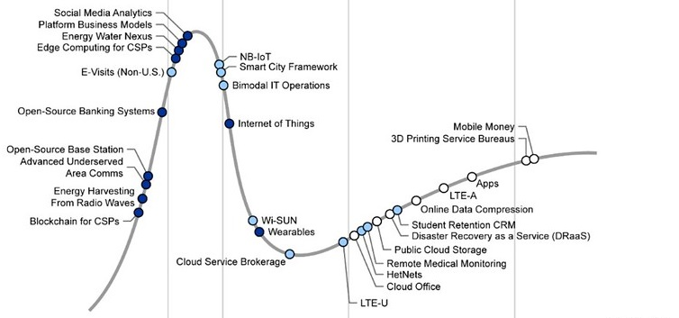
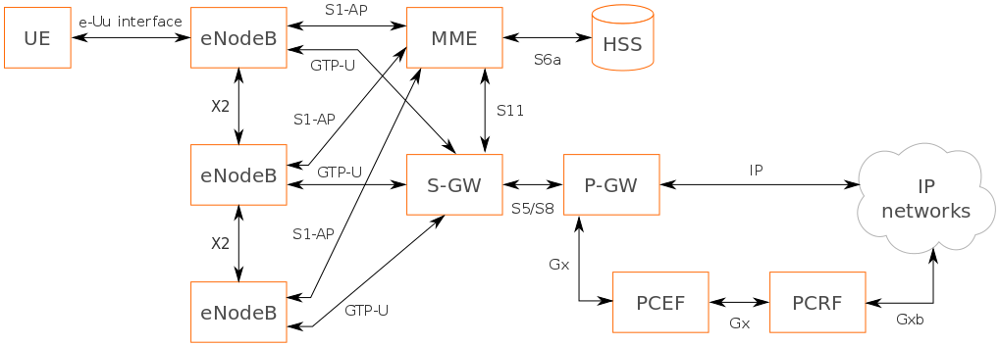
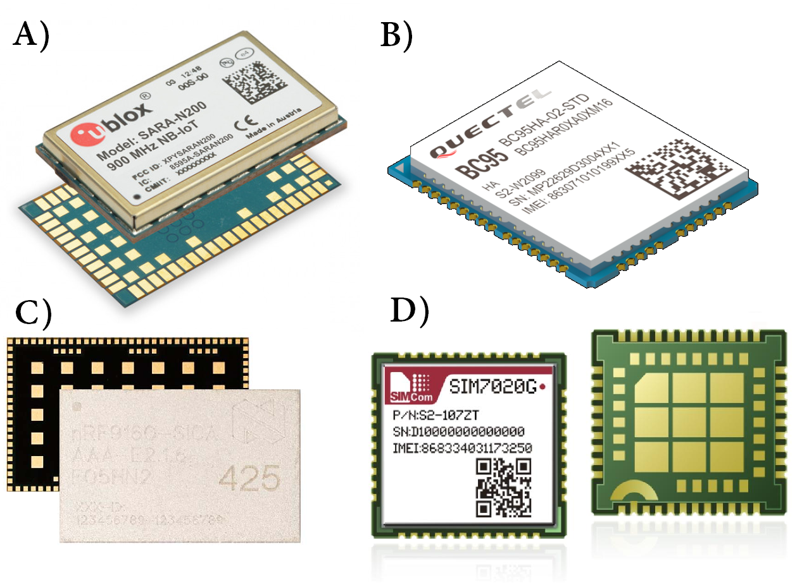
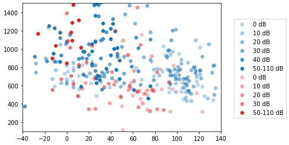
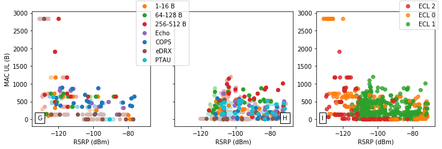
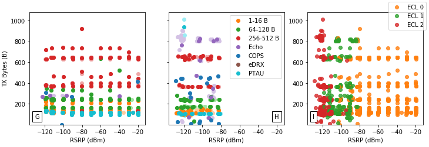
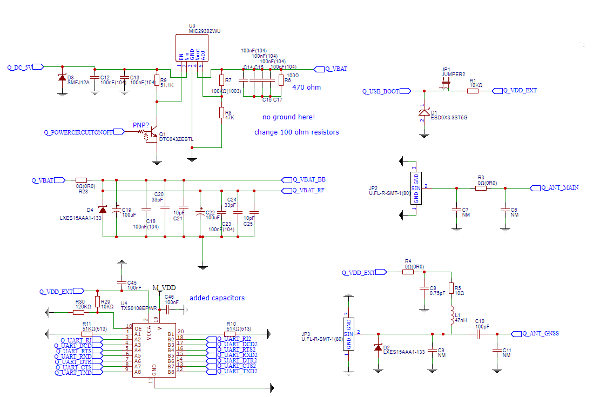
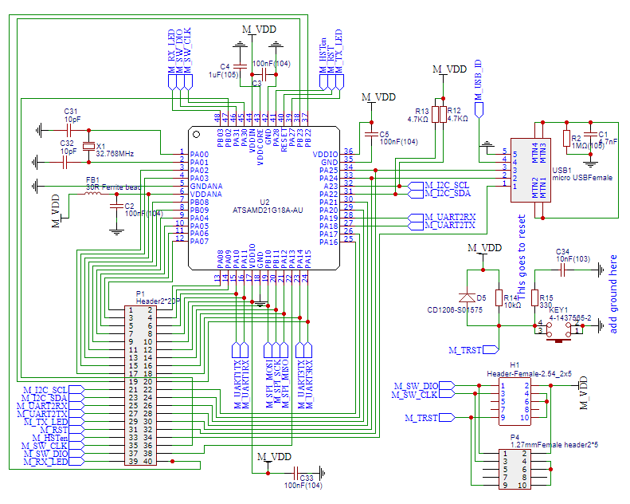
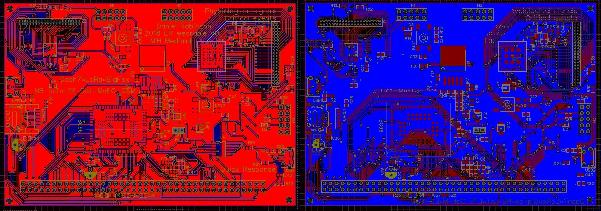

[](../images/whitespace.png)

[](../images/UScrest-WM.jpg){width=25%}

 \pagenumbering{gobble}

\begin{minipage}{\linewidth}
\begin{center}
\includegraphics[width=10cm]{../images/USlogo-top.pdf}
\end{center}
\end{minipage}

\begin{center}
\vspace{1cm}
\huge{LTE Cat-NB (Narrowband) Performance Evaluation}\\
\vspace{0.5cm}
\Large{by}\\
\vspace{0.5cm}
\LARGE{Daniel Robinson}\\18361137
\vspace{1cm}

\begin{minipage}{\linewidth}
\begin{center}
\includegraphics[width=0.25\linewidth]{../images/UScrest.pdf}
\end{center}
\end{minipage}

\vspace{2cm}
\Large{Thesis presented in partial fulfillment of the requirements for the degree of Masters of Engineering (Research) in the Department of Electrical and Electronic Engineering at Stellenbosch University}\\
\vspace{1cm}
\Large{November 2019}\\
\end{center}

\normalsize
\newpage

\pagenumbering{roman}

# Declaration {-#declaration}

By submitting this report electronically, I declare that the entirety of the work contained therein is my own, original work, that I am the sole author thereof (save to the extent explicitly otherwise stated), that reproduction and publication thereof by Stellenbosch University will not infringe any third party rights and that I have not previously in its entirety or in part submitted it for obtaining any qualification.

\vspace{1cm}

Date: .......................................................


\vspace{15cm}

Copyright © 2020 Stellenbosch University 

All rights reserved.

\newpage

# Abstract {-#abstract}

2G/GPRS is a sun-setting technology leaving behind a void for LPWANs such as LoRaWAN and SigFox to fill. The viability of NB-IoT being such a technology for South Africa is investigated. A number of telemetry tests have been performed for multiple UEs (Ublox and Quectel), LTE vendors (ZTE, Nokia, Ericsson and Huawei) and MNOs (MTN and Vodacom) at different RF attenuation decades. This has resulted in analysis for metrics such as latency and power efficiency, as well as estimates for telemetry periodicity and battery longevity.

\vspace{5cm}

# Uittreksel {-#uittreksel}

\vspace{10cm}


\newpage

# Acknowledgements {-#acknowledgements}

* **Prof Thinus Booysen** - for unrelenting care, innovative passion, inspiring belief in people and charming charisma.

* **Family** - for love and dedication.

* **Friends** - for wisdoms, experiencing the journey together and sharing moments in highs and lows.

* **MTN Mobile Intelligence Lab** - for providing funding, expertise and laboratory working environment.

* **Ryan van den Bergh** - for driving innovative ideas at MTN.

* **Michael Beetge** - for his expertise in the MTN Phase 3: Test Plant and extensive knowledge of LTE

* **Collin Mamdoo** - for his knowledge on IoT and helpful assistance at Vodacom

* **Helene  Lambrechts** - for her aid in coherence and cohesion.

* **RF Design** - for providing samples and development kits.

* **You, the reader** - for reading this thesis. Hopefully it may be of benefit to you, the research community, science, technology, society and beyond!

\newpage

\tableofcontents

\listoftables  

\listoffigures

# Nomenclature {-#acronyms}

|      |      |
| ---- | ---- |
| **3GPP** |    Third Generation Partnership Project |
| **AMQP** |    Advanced Message Queue Protocol |
| **AMOS** | Advanced Managed Object Script |
| **AT** |      Attention |
| **BPSK** | Binary Phase-Shift Keying |
| **BTS** | Base Transceiver Station |
| **CDP** | Connected Device Platform |
| **COPS** | Cellular Operator Selection |
| **CoAP** | Constrained Application Protocol |
| **D2D** | Device to Device |
| **DCE** | Data Communications Equipment |
| **DL** | Downlink |
| **DTE** | Data Terminal Equipment |
| **E-UTRAN** | Evolved-UMTS Terrestrial Radio Access Network) |
| **EARFCN** | E-UTRA Absolute Radio Frequency Channel Number |
| **EARFCN** | Extended Absolute Radio-Frequency Channel Number |
| **ECL** | Enhanced Coverage Level |
| **eDRX** | Extended Discontinuous Receive |
| **eNB - eNodeB** | E-UTRAN Node B |
| **GPRS** | General Packet Radio Service |
| **ICT** | Information and Communications Technology |
| **IoT** | Internet of Things |
| **ITS** | Intelligent Transportation Systems |
| **IMEI** | International Mobile Equipment Identity |
| **IMSI** | International Mobile Station Identity |
| **IP** | Internet Protocol |
| **LBT** | Listen Before Talk |
| **LPWAN** | Low-Power Wide-Area-Network |
| **LTE** | Long Term Evolution |
| **LTE Cat-NB1/2** | Long Term Evolution Narrow-Band Category 1/2 |
| **MCL** | Maximum Coupling Link |
| **MCS** | Message Coding Scheme |
| **MNO** | Mobile Network Operator |
| **MO** | Mobile Originated |
| **MO** | Managed Object |
| **MQTT** | Message Queuing Telemetry Transport |
| **MT** | Mobile Terminated |
| **MTC** | Machine Type Communications |
| **MTN** | Mobile Telephone Network |
| **NLOS** | Non-Line-of-Sight |
| **NW** | Network |
| **OTDOA** | Observed Time Difference Of Arrival |
| **PCI** | Physical Channel ID |
| **PDR** | Packet Delivery Ratio |
| **PS** | Packet Switched |
| **PTAU** | Periodic Tracking Area Update |
| **PTAU** | Periodic Tracking Area Update |
| **QXDM** | QUALCOMM eXtensible Diagnostic Monitor |
| **RAN** | Radio Access Network |
| **RRC** | Radio Resource Control |
| **SIM** | Subscriber Identity Module |
| **SMS** | Short Message Service |
| **SNR** | Signal to Noise Ratio |
| **TCP** | Transmission Control Protocol |
| **TE** | Terminal Equipment |
| **UDP** | User Datagram Protocol |
| **UE** | User Equipment |
| **UL** | Uplink |
| **UMTS** | Universal Mobile Telecommunications System |
| **URC** | Unsolicited Result Code |
| **USSD** | Unstructured Supplementary Service Data |
| **UUID** | Unique User Identification |
| **WAP** | Wireless Application Protocol |


## SI Units {-#siunits}

- **kB, MB** - kilobyte, megabyte
- **kbps** - kilobits per second
- **mJ or J** - millijoules or joules
- **s, ms, us** - second, millisecond, microsecond
- **mWh** - average power in milliwatt-hours

\newpage

\pagenumbering{arabic}

\pagestyle{fancy}
\fancyhead[LE,LO]{\large\leftmark}
\fancyhead[RE,RO]{\normalsize\rightmark}
\fancyfoot[CE,CO]{Page \thepage \hspace{1pt} of \pageref{LastPage}}

# Introduction {#intro}

Narrowing the spectrum bandwidth for cellular Long Term Evolution (LTE) used in everyday life results in a low data-throughput and low energy technology which matches the requirements for wireless Internet of Things (IoT), hence Narrowband-IoT (or NB-IoT).

This chapter introduces the reader to various concepts relating to NB-IoT and the performance characteristics thereof. It begins with the question "Why NB-IoT?" before developing the research question, objectives, scope, terminology, background and other various related concepts to fully orient the reader with regards to NB-IoT.

## Background {#background}

In recent years, 3GPP have developed new LPWANs for the cellular industry on the roadmap towards 5G, namely LTE Cat-M, EC-GSM-IoT and NB-IoT to supersede the sun-setting 2G/GSM/GPRS networks.

### Why NB-IoT? {#why}

Narrowband-IoT is an LTE technology developed by the 3GPP as a response to the growing need for an LPWAN to fill the role 2G/GPRS leaves behind as countries around the world schedule its departure. The technology shows performance benefits over alternative LPWANS in terms of up and downlink throughput, range and longevity, yet current research shows that variation in energy consumption leaves battery longevity in question. Nevertheless, according to 3GPP specifications and manufacturer claims, highlights include:

* ~ 10 year battery-lifetime.
* Under 10 second transmission acknowledgement for latency-tolerant applications
* \+ 20 dB improvement over 2G/GPRS via enhanced coverage levels (ECL).

Despite these highlights, it would nevertheless be significant to further investigate variation in energy consumption of the technology to solidify the robustness of these claims.

### History and Development

The beginnings of these new cellular LPWANs started when GSM was first deployed in 1991 and offered calls and SMS as circuit switched data. In 2000, 2G/GPRS added internet at speeds comparable to dialup as packet switched data. Circuit switched data is ideal for real-time connections and means that links have bandwidth pre-allocated. This also increases the QoS guarantee of information transferred timeously. Packet switched data is connectionless on the other hand, with higher bandwidths possible in shared channels. In Fig. \ref{fig:2G_LTE_transition}, we see how technologies using 2G/GSM/GPRS transitioned to LTE. With regard to 'internet', we used emails, WAP and other 'web-based' forms of messaging to keep in touch. Over time, we moved to a plethora of IMS platforms such as WhatsApp, Telegram and WeChat to name a few. Machine-to-machine (M2M) communications started off with SMS, USSD and 2G/GPRS but now with the advent of LPWANs we have many to choose from including LoRaWAN, SigFox and cellular-based forms such as NB-IoT.

{ width=50% }

In South Africa, there is a push by cellular service providers to adopt a cellular LPWAN to fill the void that 2G/GPRS leaves behind now and in the future. NB-IoT is being investigated by MTN South Africa, and since they are also funding this research, have also provided network coverage for testing to Stellenbosch University. Ideally, the technology can be rolled out to existing base stations as a software upgrade for national coverage, but it is limited by factors such as use case demand, expensive licensing and general uncertainty about the technology.

2G/GPRS has served as the gateway for smart devices and sensors in the M2M sphere for many years, but due to its high-powered nature it is not sustainable for applications which require battery longevity of up to 10 years or more. In lieu of its absence, although the spectrum it held can be re-farmed for cellular LPWANs, it also opens up opportunities for market entrants of unlicensed frequencies such as LoRaWAN and SigFox. Each LPWAN technology has its own unique flaws and benefits and there is yet to be a clear winner when it comes to connecting 'things' to the internet.

When considering rolling out more coverage, since NB-IoT is based off LTE, it makes integration and upgrading of existing infrastructure more seamless than an entirely separate technology. Although NB-IoT still retains the drawbacks and complexities of legacy LTE such as the vast array of sub-protocols and communication overhead, this still includes the low power, low bandwidth benefits and others which match the requirements for smart devices and IoT. It should be mentioned that much of the RF spectrum which can be used for digital communications is still used by analogue television broadcast by the SABC. ICASA, who controls the spectrum, can solve this issue but over the years they have been a strong limiting factor in the slow release of new spectrum to large MNOs. This has been the case for approximately 16 years to date, and ICASA has instead released spectrum to smaller players such as Rain Ltd, Liquid Telecom and Telkom. To increase demand for application developers in IoT, because they will be interested in a hands-on approach with the technology they will use, more network coverage is necessary to scale up production such that volumes of 1000 devices or more can be connected. [^background]

[^background]: **history** - from GSM in 90s to 5G NB-IoT. **SA and coverage** - how it "fits" in South Africa and LPWAN sphere. **IoT** - how relevent. **coverage** - ICASA. 3GPP - why they designed it. future. Uncertainty about NB-IoT. standing. uptake. optimal use

### Terminology {#terminology}

Because the nature of this thesis provides many broad concepts and complex terms, this section briefly introduces to the reader various IoT, LPWAN and LTE related topics expanded upon in the rest of the thesis. The background of NB-IoT is discussed in \S\ref{background}.

The Internet of Things (IoT in \S\ref{iot}) is a blanket term for smart devices that connect to the internet. These devices are typically found in remote or urban areas where it would be more efficient for a device to control and monitor the status of the surrounding environment than human intervention. 

Smart devices or 'things' can connect to the internet by wire or wirelessly. Wired devices usually connect using ethernet, although it is not uncommon to use industry grade protocols such as RS232, CAN, ModBus, ProffiBus, and so on before data reaches a network hub and the internet. Wireless connections, on the other hand, have the benefit of easy installation and really shine in inaccessible areas. It is quite effective to connect Bluetooth and WiFi for short range applications, or using Low Powered Wide Area Networks (LPWANs in \S\ref{lpwans}) such as LoRaWAN, SigFox and NB-IoT for ranges exceeding a few kilometers and especially for limited sources of power.

Considering how LPWANs usually fill niche applications and just looking in terms of modulation differences, Long-Range Radio (LoRa or LoRaWAN in \S\ref{unidirectional_lpwans}) uses chirp-spread-spectrum (CSS) modulation to make it quite immune to doppler effect motion and SigFox (\S\ref{unidirectional_lpwans}) uses binary phase-shift keying (BPSK) in an ultra-narrow band which increases noise immunity, but devices cannot move more than 6 km/h. LPWANs enable many use cases (\S\ref{usecases}) such as remote sensing, actuator control and asset/location tracking.

GSM and GPRS fall under 2G and 2.5G which started development in the early 90s. Data transmission (such as USSD, SMS, WAP, IP) is circuit-switched over GSM, and packet-switched over GPRS. Circuit switched data is billed per time interval such as seconds or minutes, and packet-switched is charged per number of bytes (kB, MB, etcetra). It evolved into 3G in Release 99 at the turn of the millenium and 4G/LTE in Release 8 (Q4 2008).

Long Term Evolution (LTE) is a cellular architecture which is a subset of an even more complex 3GPP governing body that guides its development. In LTE, the narrowband category is known as LTE Cat-NB or NB-IoT. LTE Cat-M is designated for M2M applications, and although it is quite similar to NB-IoT, it features VoIP, faster throughput and is more similar to the LTE protocol. Unfortunatly it is not considered in South Africa. There are two different versions of NB-IoT, with LTE Cat-NB1 being release 13 and LTE Cat-NB2 being release 14. Their specifications have been frozen in Q1 2016 and mid-2017, respectively. [^group_terms]

[^group_terms]: note: group terms

## Project Description

### Problem Statement {#probstat}

NB-IoT has unique features which hold a competitive advantage over alternatives such as LoRaWAN, SigFox and other LPWANs, however it does not have a strong uptake in South Africa yet. Most notably, NB-IoT offers energy efficient bidirectionality (as opposed to the uplink-centric norm) using extended discrete periodic reception (eDRX), yet variation in transmission energy and latency can affect battery lifetime drastically. Application developers require network coverage before they are interested in developing business cases, and cellular service providers require consumer and enterprise demand or business cases before rolling out national network coverage. This creates a paradoxical situation where neither party gives in unless they are both willing to come to a compromise. Such efforts can be limited by a lack of understanding in the technology, and this is not helped by the fact that although there is a great deal of theoretical analysis and simulations in research, the lack of empirical evidence may be contributing to a general uncertainty in the standing of the technology with respect to alternatives and thus a slower adoption. This thesis aims to bridge that divide in South Africa by evaluating NB-IoT's performance empirically using a set of metrics and estimate optimal use.

### Research Objectives {#resobj}

This study has the following aims:[^bullets]

* Latency, power efficiency and other metrics of NB-IoT are to be evaluated using a set of telemetry tests.

  

* User equipment (UE) devices will be compared against multiple LTE vendors used by mobile network operators (MNOs) exposing the change in variability due to proprietary LTE complexities.

  

* Battery longevity and recommended telemetry intervals are estimated, and other secondary metrics such as signal strength, throughput and data overhead are investigated.

  

In turn, the above objectives evaluate the robustness, stability, capabilities, sources of variability and claimed versus actual core features of NB-IoT.

This thesis aims to highlight the advantages, disadvantages and challenges of NB-IoT. By doing endpoint tests between UE devices and multiple LTE base station vendors, one can paint an accurate picture of the capabilities of the technology.

[^bullets]: Thinus are you happy with objectives like so in sentences and bulleted?

### Scope of Work {#scopework}

Although there exists a multitude of UE devices, LTE vendors, estimations and metrics, the study will be limited to the following as seen in Table \ref{tbl:metric_summary} and \ref{tbl:telemetry_ue_lte}.

Whilst theoretical models provide value in showing how factors affect an approximation, the boundless underlying complexities of LTE architecture make it hard to predict the variability induced by unpredictable network conditions. Thus, an empirical approach is proposed. Since the energy efficiency of a single network is already questionable in Durand [@Durand2019], Martinez [@Martinez2019] and affected by latency, these will form the main metrics investigated in this study.

Table: Metrics and Estimations {#tbl:metric_summary}

| Main Metrics     | Secondary Metrics | Estimations         |
| ---------------- | ----------------- | ------------------- |
| Power Efficiency | Signal Strength   | Battery Longevity   |
| Latency          | Throughput        | Telemetry Intervals |
|                  | Data Overhead     |                     |
|                  | ECL               |                     |

Table: Telemetry Types, UE devices and LTE vendors {#tbl:telemetry_ue_lte}

| Telemetry Types | LTE Vendors | UE Manufacturers |
| --------------- | ----------- | ---------------- |
| UDP Packets     | ZTE         | Ublox            |
| eDRX and PTAU   | Nokia       | Quectel          |
| COPS            | Ericsson    | Nordic           |
| Data Echo       | Huawei      | SimCom           |

The capture method should be easily repeatable and expandable for new UE devices. On the basis that the AT command API is familiar to all UE devices, a framework will be built to extract data via this method. Although all UE devices are usually accessible through AT commands, there are alternative diagnostic methods such as Qualcomm QXDM, UEMonitor and an opensource decoder by LanternD which monitors the debug stream provided over UART at 921600 baud. QXDM is a proprietary diagnostic program built for UE devices with Qualcomm chipsets, yet it costs in excess of a few thousand USD. UEMonitor is free and can capture debug traces from both Ublox and Quectel. LanternD's decoder is still in beta and thus unstable. Since both Ublox and Quectel's debug messages can be accessed by UEMonitor and LanternD, these UE devices will be used to compare LTE Vendors. There is no support or alternative for Nordic or SimCom devices, however.

## Project Overview {#overview}

This section looks at how user equipment (UE devices in \S\ref{ue_devices}) is compared against multiple LTE vendors (\S\ref{lte-vendors}) operated by mobile network operators (MNOs in \S\ref{MNOs}) which expose the change in variability due to proprietary LTE complexities. These comparisons are made according to a set of metrics, estimations (\S\ref{metrics_est}) and telemetry tests (\S\ref{telemetry_tests}).

### MNOs: MTN and Vodacom {#MNOs}

The following MNOs have NB-IoT coverage in South Africa which will be expanded upon in \S\ref{coverage}, namely MTN and Vodacom. NB-IoT uses their LTE infrastructure, and this will be expanded upon in \S\ref{lte-vendors}.

MTN Group Limited, formerly M-Cell, is a South African multinational mobile telecommunications company, operating in many African, European and Asian countries. Its head office is in Johannesburg. 

Vodacom Group Limited is a South African mobile communications company, providing voice, messaging, data and converged services to over 55 million customers. 

### LTE Vendors: ZTE, Nokia, Ericsson, Huawei {#lte-vendors}

Table \ref{tbl:telemetry_ue_lte} gives us the following LTE vendors which are among the top 5 in the world: Huawei, Ericsson, Nokia and ZTE. Since there are over a hundred MNOs across the world which also use these LTE vendors, performing this study on the main LTE vendors will also benefit the MNOs. With regard to NB-IoT connectivity on MNOs in South Africa, MTN will be used for ZTE and Ericsson, and Vodacom will be used for Nokia and Huawei.

In South Africa, there are two mobile network operators trialing NB-IoT and combined they use four of these top LTE vendors. Samsung has started using NB-IoT only as recently as May 2019, announcing a partnership with [KT to create a Public Safety](https://enterpriseiotinsights.com/20190506/nb-iot/samsung-kt-launch-nbiot-service-through-ps-lte-network-korea) (PS-LTE) network. They're also implementing device-to-device (D2D) communications to increase connectivity in unfavourable conditions.

Table: MNOs and their BTS Vendors {#tbl:mno_bts}

| BTS Vendors | Cellular operator (MNO) |
| ----------- | ----------------------- |
| Nokia       | Vodacom                 |
| ZTE         | MTN                     |
| Huawei      | Vodacom                 |
| Ericsson    | MTN                     |

* ZTE Corporation is a Chinese multinational telecommunications equipment and systems company headquartered in Shenzhen, Guangdong, China. It is one of China's leading telecom equipment manufacturers.
* Nokia Corporation is a Finnish multinational telecommunications, information technology, and consumer electronics company, founded in 1865. Nokia's headquarters are in Espoo, in the greater Helsinki metropolitan area.
* Telefonaktiebolaget LM Ericsson, doing business as Ericsson, is a Swedish multinational networking and telecommunications company headquartered in Stockholm.
* Huawei Technologies Co., Ltd. is a Chinese multinational technology company that provides telecommunications equipment and sells consumer electronics, including smartphones and is headquartered in Shenzhen, Guangdong province. The company was founded in 1987 by Ren Zhengfei. 

Theoretically, one can assume that these manufacturers meet 3GPP's specifications and that they have set up an optimal environment.

With a testing framework, one can evaluate these capabilities in a transparent manner for both developers and cellular operators alike and work towards improving the quality thereof.

Other Vendors include: Broadcom Corporation, Cisco Systems, Gemalto NV, Intel Corporation, KDDI Corporation, LG Electronics, MediaTek, Oberthur Technologies, Ooredoo, Orange, Samsung Electronics, Saudi Telecom Company, Sierra Wireless, Telit Communications and VimpelCom.

 {width=80%}


### UE Device Manufacturers: Ublox, Quectel, Nordic, SimCom {#ue_devices}

Finally, with regard to the UE devices in \ref{tbl:telemetry_ue_lte}, application developers are likely to use more popular NB-IoT module manufacturers such as Ublox, Quectel, Nordic and SimCom, besides lesser known ones such as Telit, Serra Wireless, Gemalto, and akorIoT. 

UE devices specifically used:

- Ublox Sara N200
- Quectel BC95

and the following recommended in future:

- Nordic nRF9160
- SimCom SIM7020E
- Mediatek MT2625
- Sierra Wireless 7702

Although LTE vendors are open to all UE manufacturers, mobile network operators (MNOs) are still in control of LTE vendor equipment and some aspects of UE devices via RF signalling. Thus it is important for MNOs to recognize the effect they have on the technologies they use, especially when it differs from theory.

These UEs all share AT commands as the API to control their capabilities.

* u-blox is a Swiss company that creates wireless semiconductors and modules for consumer, automotive and industrial markets. They operate as a fabless IC and design house. 
* Quectel is the leading global supplier of cellular and GNSS modules, with a broad product portfolio covering the most recent wireless technologies of 5G, LTE/LTE-A, NB-IoT/LTE-M, UMTS/HSPA(+), GSM/GPRS and GNSS. As a professional IoT technology developer and cellular module supplier, Quectel is able to provide one-stop services for IoT cellular modules. Quectel products have been widely applied in IoT/M2M fields including smart payment, telematics and transport, smart energy, smart cities, security, wireless gateways, industry, healthcare, agriculture, and environment monitoring. 
* Nordic Semiconductor is a fabless semiconductor company. The company specializes in ultra-low power performance wireless system on a chip and connectivity devices for the 2.4 GHz ISM band, with power consumption and cost being the main focus areas.
* **SIMCom Wireless Solutions** is a subsidiary of SIM Technology Group Ltd. It is a fast-growing wireless M2M company, designing and offering a variety of wireless modules based on GSM/GPRS/EDGE,WCDMA/HSDPA and TD-SCDMA technical platforms.

### Metrics and Estimations: Power, Latency, Secondary and Interval, Longevity {#metrics_est}

Considering metrics and estimations in Table  \ref{tbl:metric_summary} above, a more comprehensive study has been performed on throughput, packet delivery ratio (PDR), maximum coupling link (MCL) and scalability by Durand [@Durand2019]. Martinez has investigated the performance boundaries of NB-IoT for a Vodafone network in Barcelona, Spain [@Martinez2019] including metrics such as energy consumption, transmission delay, enhanced coverage levels (ECLs) and different data sizes. Because power efficiency and latency is significantly affected by variability, important considerations have to be made in application development and thus it is of the main metrics this study is focused on. Between UE devices and LTE basestations (BTS) both signal strength (RSRP) and coverage enhancement levels (ECL) can be causes of variability. 

In terms of estimations, variability affects battery lifetime and telemetry interval amongst others. Battery lifetime is defined as the length of time a device will last on an AA battery in years. Telemetry interval is defined as the periodicity time between different types of messages to last a year on an AA battery. These two estimations are necessary for developers to consider in battery-powered applications and form an important basis for this study.

### Telemetry Tests: UDP, Echo, COPS, eDRX, PTAU {#telemetry_tests}

The different types of telemetry messages in Table \ref{tbl:telemetry_ue_lte} include UDP datagram transmission, cellular operator selection (COPS), UDP Echo, extended discontinuous reception (eDRX) and periodic tracking area updates (PTAU). UE devices usually give the option of using the following main data transmission protocols: UDP, TCP, CoAP and MQTT. UDP is a connectionless protocol used for low latency applications and TCP is used to stream data orderly, reliably, but at a cost to data overhead.  CoAP and MQTT are lightweight message transfer protocols based off of UDP and TCP respectively. To measure the data overhead secondary metric caused by network repetitions and other mechanisms, it would be preferable to avoid overhead from other protocols and thus the simplest option is chosen, namely UDP. 

## Network Coverage Worldwide {#coverage}

Although NB-IoT joined LPWANs circa 2016-2017, world-wide coverage is still growing. This can be seen in Fig. \ref{fig:worldwide_coverage}.  [AT&T announced](https://blog.nordicsemi.com/getconnected/att-launches-nb-iot-network-in-usa) nation-wide coverage of NB-IoT in the USA, alongside its existing LTE Cat-M coverage. Deutsche Telekom and Vodafone cover Europe and China enables millions more IoT devices [@china2019].

 { width=90% } 

### Connectivity in South Africa {#connectivity}

In South Africa, NB-IoT has most of its coverage in the Gauteng province as well as a few sites in other towns and cities. Although Gauteng only covers 1.49% of the land mass in South Africa, it holds ~22% of its ~57 million people so understandably it is great as a live trial run before pushing for national coverage.

 { width=50% }

Table: NB-IoT connectivity in South Africa with regard to MNO, LTE vendor and location. {#tbl:nbiot_connectivity}

| MNO     | LTE Vendor | Location                       |
| ------- | ---------- | ------------------------------ |
| MTN     | ZTE        | Stellenbosch                   |
| Vodacom | Nokia      | Vodacom Head Office, Cape Town |
| MTN     | Ericsson   | MTN Phase 3: Test Plant        |
| Vodacom | Huawei     | Gauteng Province               |

To connect via NB-IoT on the Vodacom network, sim cards must be purchased with a M2M contract over 24 months at 5.00 ZAR/month. At the time of registering in this study, data bundles range from 5 Mb for 7.50 ZAR to 30 Mb for 29.00 ZAR.

MTN NB-IoT sim cards can currently be obtained only for testing purposes, and it would be best to speak directly to MTN.

 {width=30%} 

 [](../images/MTN-Sim-card.jpg) 

## Thesis structure {#thesis-struct}

NB-IoT is introduced to the reader in Chapter \ref{intro}. A literature study reviews the current empirical research in Chapter \ref{litstudy}. Design and methodology shows the steps taken to capture different metrics and process the resulting dataset in Chapter \ref{design}. Results are analyzed in Chapter \ref{results} and discussed with recommendations in Chapter \ref{#discussion}. Lastly, a conclusion is made in Chapter \ref{conclusion}.

\newpage

# Literature Study {#litstudy}

This chapter will look at NB-IoT performance-related literature, IoT, LPWANs, use cases, and a deeper look into NB-IoT itself.

## Related Literature

Considering current literature, several studies provide theoretical models not only for the energy consumption of NB-IoT networks [@Andres-Maldonado2017], but also for their latency and delay bounds [@Feltrin2019], impact of coverage extensions [@Andres-Maldonado2018b], coverage performance [@Adhikary2016], battery lifetimes [@Yeoh2018d],[@Lauridsen2018], theoretically optimal configuration strategies [@Feltrin2018] and overall performance for particular verticals [@Soussi2018],[@Beyene2017b].

Only Martinez [@Martinez2019] focuses effort on the adopter and presents an operational and empirical analysis of the technology when it is deployed in a real network (such as Vodafone in the Metropolitan area of Barcelona). Durand [@Thomas2018] compares different LPWANs empirically including NB-IoT. Despite the unquestionable value of the theoretical models (for example, to understand orders of magnitude or to guess the theoretical upper and lower bounds), an empirical approach provides real insights into the variability that a UE device experiences when deployed in real conditions. This work therefore complements Martinez and related works, and it further provides empirical measurements for UEs that are deployed using a real-world NB-IoT network always while taking the perspective of an application developer.

Whilst this research is funded by MTN and being aware of internal documentation, this is an independent study which should aid any potential adopters of the technology.

## Internet of Things{#iot}

The Internet of Things (IoT), as briefly outlined in \S\ref{terminology}, is an ecosystem of smart devices that connect to the internet/cloud in various ways. Although IoT's requirements (\S\ref{iot_requirements}) are loosely defined due to the large variety of use cases (\S\ref{usecases}), it is still important to see how well NB-IoT performs and facilitates these connections for IoT (discussion in \S\ref{discussion}). This section looks at these requirements and other facets of IoT relevant to NB-IoT.

Since IoT is advancing in popularity (\S\ref{iot_requirements}), stakeholders in NB-IoT can be rest assured that the technology will be useful for years to come.

Although the simplest type of use case is smart metering (\S\ref{smartmetering}), useful for LPWANs which send data unidirectionally, NB-IoT shows its bidirectional strength in Push-Pull models (\S\ref{pushpull}). In fact, this makes NB-IoT well suited for edge computing (\S\ref{pushpull}) too.

Finally, although satellite IoT has the benefit of worldwide coverage, by rolling out national NB-IoT coverage in South Africa, for example, it defeats the purpose of satellite IoT by being affordable and energy efficient (see \S\ref{satellite_iot}).

### Requirements and Advancement {#iot_requirements}

IoT requires scalable smart devices to collect data and interact with the physical world using wireless connectivity. Thus, wireless communication must be energy efficient, have low latency, low data overhead and long range for optimal cloud processing. To be sure that LPWANs can be well scaled, they require a cloud platform well suited to the large number of connections such as Cisco-Jasper and ThingsBoard [@Hejazi2018a].

---

<!-- ### Advancement {#iot_advancement} -->

IoT has surged in popularity over recent years as an interconnected system of devices that transfer data over a network without requiring human interaction.

Looking at Gartner's analysis of technology expectations with regards to NB-IoT and related technologies, in 2014 Gartner estimated that Internet of Things (IoT) had reached the height of inflated expectations, and the hype it generated lives on in a rich ecosystem of emerging technologies. As of July 2018, NB-IoT and IoT has falling interest (and hype) in Fig. \ref{fig:gartner_ictAfrica}, yet it will reach productivity in 2-10 years time. Since new coverage has not been rolled out for almost two years to date, we believe there is a strong chance for renewed NB-IoT interest in Africa. Gartner predicts that there will be more than 20.8 billions of smart things that will be connected to Internet by 2020, whereas the worldwide number of devices was 6.4 billions in 2016 [@Ayoub2018c].

[](../images/hype-cycle-2014-100371840-large.idge.jpeg)

{ width=90% }

As of August 2019, Gartner has high expectations for 5G and other emerging technologies which can make use of what [IoT has to offer](https://blogs.sas.com/content/hiddeninsights/2016/07/06/long-live-the-iot-hype/). This can be seen in Fig. \ref{fig:gartner_emergingTech}.

{ width=85% }

On the other hand, this does not slow the growth in number of devices connected as in Fig. \ref{fig:iot_growth}. IoT merely manifests itself in other uses and forms such as we have already seen in Fig. \ref{fig:gartner_emergingTech}. NB-IoT can be integral to aid this growth.

![Exponential growth of IoT is estimated [@Ali2015]. \label{fig:iot_growth}](../images/Expected-number-of-connected-devices-to-the-Internet-This-chart-is-obtained-from-recent.png){ width=80% }

Matching emerging applications with existing technologies has become one of the
main challenges for IoT initiatives, especially when a new technology appears in the landscape and the map must be redrawn. Massive IoT is the deployment of an immense number of low-powered devices with infrequent reporting and both NB-IoT and LTE Cat-M fulfill the requirements of 5G massive MTC/IoT.

### Push-Pull Model and Edge/Fog Computing {#pushpull}

Traditionally, IoT devices push data to the internet at regular intervals. This push model can be considered quite energy inefficient, especially when the data is only occasionally actionable. For example, in asset tracking or remote monitoring.

A pull model is ideal for dynamic rule engines, pulling data only when necessary and ultimately edge computing, where building an application around this idea can greatly enhance battery life.

Most LPWANs are unidirectional, meaning they transmit data in one direction only. This is especially true in the case of LoRaWAN and SigFox and means they use a push model. A push model is bad for the battery when periodically sending data. It does help to make the data transmissions event-based, however. NB-IoT and Dash7 for example, are bidirectional which means they can stay quiet for longer and only send data on-demand ~ when it is needed. This would make it a pull model and is useful for critical use cases as well [@Mekki2018a].

Most importantly when looking at bidirectionality vs unidirectionality is that transmit current is usually much more than the receive current required. By limiting TX transmissions such that the user only requests data on-demand when it is required, battery savings ensue.

There are many LPWANs out there, but we can split them up into two groups as in Table \ref{tbl:unibidirectional_lpwans}.

\newline\newpage

Table: Unidirectional and bidirectional LPWANs {#tbl:unibidirectional_lpwans}

| Unidirectional | Bidirectional  |
| -------------- | -------------- |
| SigFox         | NB-IoT         |
| LoRaWAN        | EC-GSM-IoT     |
| NB-Fi          | RPMA           |
|                | Weightless SIG |
|                | Dash7          |
|                | WiFi HaLow     |

Later, we look at a few of these directional LPWANs in \S\ref{unidirectional_lpwans}-\ref{bidirectional_lpwans} and draw comparisons in \S\ref{lpwan_comparison}.

<!-- ###  Edge/Fog Computing {#edge_computing} -->

---

Edge computing is the practice of offloading cloud processes to the endpoint. It saves on data overhead, especially when there are data charges involved and battery longevity is desired.

Since NB-IoT is optimized for downlink communications, it can be the ideal candidate. Downlink communications use much less energy than uplink, and at higher throughput too. Usually data has to be periodically sent to the cloud in unidirectional networks and processing done thereafter, but with the push-pull model, one can send a specialized request and devices can send back processed data, saving energy and lowering data costs, hence edge computing.

Fog computing is considered a good solution to address the demand for massive connections and low-latency applications by pushing some computing or processing tasks from the cloud servers to the Fog nodes, or close to the mobile edge. A Fog node can be viewed as a reduced capability of a cloud server and/or integrated with a small cell for handling the telecommunication services. There are several potential applications of the Fog computing node technology associated with NB-IoT small cell and the cloud services for smart parking, smart home, and smart retail and delivery services [@Chang2017].

### Satellite IoT {#satellite_iot}

The potential use of constellations of satellites for IoT applications is of growing interest. With booming development in the IoT sector and as a powerful supplement to terrestrial systems, LEO constellation-based IoT is worth being focused and studied. To make this topic become a reliable cost-benefit solution, further research is required in transmission scheme, system security and low power consumption design. [@Qu2017c]

Compared to LPWANs, Satellite IoT has global coverage. In terms of packet payload size, a typical system such as the Iridium 9602/9603 will transmit up to 270 bytes or receive 340 bytes via AT commands. A supercapacitor is necessary for the initial 7.5W burst for 10ms which opens a session, and with an open sky messages can be sent every 10 seconds. It even features a 'Ring Alert' feature, similar to eDRX in NB-IoT in that modems listen for when incoming messages are available, for satellites to page a modem when a mobile terminated (MT) message is available from an internet-facing endpoint. Although Ring Alerts are sent to the position of the last known transmission, an Iridium satellite spot beam is about 400km in diameter meaning devices would have to travel quite far before requiring a simple re-registration transmission. The greatest drawback is the upfront, rental and per byte costs looking at \pounds159, \pounds12/month and \pounds0.14 per 50 byte credit respectively on Rock Seven Mobile Services Ltd, and the high power draw compared to NB-IoT.

NB-IoT is not the only network that can replace satellite IoT or 2G/GPRS with coverage in broad areas (ideally nationally), and this will be explored further in \ref{lpwans}.

## Low-Powered Wide-Area Networks {#lpwans}

A low-power wide-area network is a type of wireless telecommunication designed to allow long-range communications at a low bit rate among things, such as sensors operated on a battery. This section will compare a few prominent cellular and unlicensed frequency LPWANs against NB-IoT besides the following alternatives:

* EC-GSM-IoT is a form of eGPRS optimized for the IoT. It is still in the trial stages of development, however [@Bergman2017].
* RPMA by Ingenu is a 2.4GHz technology for M2M communications. It is primarily used in North America for the oil & gas industry, amongst others [@Ingenu2016]. It is equivalent to cellular standard but expensive.
* Weightless SIG reuses TV whitespace, and NB-IoT is actually formed off this protocol [@Weightless2015], [@Raza2017].
* NB-Fi Protocol is an open LPWAN protocol, which operates in unlicensed ISM radio band. Using the NB-Fi Protocol in devices ensures stable data transmission range of up to 10 km in dense urban conditions, and up to 30 km in rural areas with up to 10 years on battery power [@Ikpehai2018b].
* HaLow (pronounced halo) is a low-power, long-range version of the IEEE 802.11 Wi-Fi standard. HaLow is based on the Wi-Fi Alliance 802.11ah specification and is expected to play an important part in IoT. At this stage it has low market traction.

### Unidirectional: LoRaWAN and SigFox {#unidirectional_lpwans}

<!-- #### LoRaWAN {#lorawan} -->

LoRa is a low-power wide-area network technology. It is based on spread spectrum modulation techniques derived from chirp spread spectrum technology. It was developed by Cycleo of Grenoble, France and acquired by Semtech the founding member of the LoRa Alliance. 

LoRaWAN is a contender for NB-IoT. It lacks bidirectionality and data rate.

* LoRaWAN performs better for short messages, but it is subjected to a very high penalty when
  more than one message per data block is required.
* Second, the LoRaWAN reliability mechanism must be ensured at the
  upper layers, and thus may incur higher energy costs.
* Lower (sub-500 devices per gateway) scalability of LoRaWAN per base station compared to NB-IoT and GPRS. This low scalability is due to the limited number of channels and the lack of any scheduling between devices. To compensate for the low scalability, an increase in spatially diverse base stations would allow packets to be received by multiple base stations at varying received power levels.

LoRaWAN uses chirp-spread-spectrum (CSS) and is publically accessible from networks such as The Things Network (TTN). Unfortunately, although that has the best coverage, it only uses class A which means it cannot listen for asynchronous downlink messages except after an uplink (which defeats the purpose of avoid unnecessary uplink transmissions which draw large current) [@Adelantado2017].

<!-- #### SigFox {#sigfox} -->

---

Sigfox is a French global network operator founded in 2009 that builds wireless networks to connect low-power objects such as electricity meters and smartwatches, which need to be continuously on and emitting small amounts of data. Sigfox is based in Labège near Toulouse, France, and has over 375 employees.

Briefly, SigFox is an ultra-narrow-band wireless technology that one can send 140 12-byte messages per day due to the duty cycle limitation of unlicensed frequencies. One can also receive 4 downlink ack messages, but this is not good enough when looking to optimize the sending of GPS/GNSS updates [@SigFox2016]. SigFox is a contender for NB-IoT, but it lacks bidirectionality and datarate.

Simulations show that with 55,000 devices transmitting the base station would reach the 270 simultaneously transmitting devices that Sigfox claims is possible while still ensuring a 99.9% PDR [@Thomas2018].

### Bidirectional: NB-IoT and Dash7 {#bidirectional_lpwans}

<!-- #### NB-IoT {#nbiot_lit} -->

Narrowband Internet of Things is a Low Power Wide Area Network radio technology standard developed by 3GPP to enable a wide range of cellular devices and services. The specification was frozen in 3GPP Release 13, in June 2016. Other 3GPP IoT technologies include eMTC and EC-GSM-IoT. 

NB-IoT is LTE's replacement for the power hungry GSM that some IoT devices still use. GSM is an aging technology which is being turned off in some parts of the world. It has 7 times better range and coverage, and power saving which can let a device last 10+ years on a single charge [@Wang2017c].

<!-- #### Dash7 {#dash7_lit} -->

---

DASH7 Alliance Protocol is an open source Wireless Sensor and Actuator Network protocol, which operates in the 433 MHz, 868 MHz and 915 MHz unlicensed ISM band/SRD band. 

* Bidirectional

Dash7 is a military RFID standard that has also grown into a medium range LPWAN [@noraird7].

Dash7 is considered a medium range LPWAN and is made for the full networking stack. It delivers an open standard for ultra low power mid-range sensor and actuator communication known as DASH7 Alliance Protocol (D7AP). D7AP is based on active RFID standards ISO 18000-7 for 433 MHz communication, however it has been significantly extended. It was originally intended by the US Department of Defense for container inventory and grew to become a medium range bidirectional wireless network system [@Weyn2015] useful in the indoor-outdoor realm. D7AP is modelled after a BLAST (Burst, Light, Asynchronous, Stealth, and Transitional) communication system which enables it to be a LPWAN competitor. D7AP is a full-stack protocol defining the complete OSI model, with support for three sub-GHz ISM bands, and three data rates (9.6 kbps, 55.55 kbps, and 166.67 kbps), as discussed above. D7AP uses 2-GFSK, the modulation schemes. D7AP can also re-use the PHY layer (radio frontend) of other LPWANs. Also, according to Cortus it should be possible to reuse the RF PHY layer (MSK downlink, OFDM uplink) of NB-IoT for Dash7's OSI stack, and in asset tracking, for example, it results in a compressed tracking solution that works well both indoors and outdoors. Dash7 claims 1m indoor accuracy by using vertex data from reference nodes for RSSI & RF fingerprinting.

Wizzilab is one of three main developers of Dash7. It offers the only full-kit open to development (at least in the form of an application processor). Haystack is another Dash7 developer with [https://github.com/jpnorair/OpenTag](https://github.com/jpnorair/OpenTag). Finally, the developer community with [https://github.com/MOSAIC-LoPoW/dash7-ap-open-source-stack](https://github.com/MOSAIC-LoPoW/dash7-ap-open-source-stack).

### LPWAN Comparison {#lpwan_comparison}

There are many wireless technologies out there, with some standardized, including but not limited to SigFox, LoRaWAN, Dash7, Bluetooth, 6LowPan, RPMA, Weightless, and IETF 6TiSCH. A brief comparison is drawn on NB-IoT against prominent unlicensed frequency LPWANs in Table \ref{tbl:lpwan_comparison}, and cellular LPWANs in Table \ref{tbl:cellular_comparison}.

Table: Brief comparison of NB-IoT against wireless LPWANs {#tbl:lpwan_comparison}

|                         | NB-IoT       | LoRaWAN           | SigFox   | Dash7             |
| ----------------------- | ------------ | ----------------- | -------- | ----------------- |
| Frequency               | 450-2200 MHz | 433, 868, 915 MHz | 868 MHz  | 433, 868, 915 MHz |
| Bandwidth               | 200 kHz      | 125-500 kHz       | 200 kHz  | 25, 200 kHz       |
| Throughput              | 250 kbps     | 27 kbps           | 0.1 kbps | 167 kbps          |
| Duty cycle limitation   | 0%           | 90-99%            | 99%      | LBT ~ 0-99%       |
| Messages per day (12 B) | 14 million   | 10-243            | 140      | 86400+            |
| Bytes per message       | 512          | 255               | 12       | 256               |
| Uplink Latency          | 0.1 - 10 s   | < 3 s             | ~ 6 s    | < 0.015 s         |
| Battery Lifetime        | 10 years     | 10 years          | 16 years | 3-5 years         |
| MCL                     | 164 dBm      | 157 dBm           | 160 dBm  | -                 |
| Scalability             | 55,000       | ~500              | > 50,000 | -                 |
| Outage                  | 1%           | > 2%              | 1%       | -                 |
| Average Power           | 550 uWh      | 15-66 uWh         | 144 uWh  | -                 |
| Range                   | 2.5 - 5 km   | 5km (85% PDR)     | 3-10 km  | 2 km              |

Table: Brief comparison of NB-IoT against cellular technologies {#tbl:cellular_comparison}

|                  | NB-IoT       | 2G/GSM/GPRS  | EC-GSM-IoT[^ec_gsm_available] | LTE Cat-M    |
| ---------------- | ------------ | ------------ | ----------------------------- | ------------ |
| Frequencies      | 450-2200 MHz | 850-1900 MHz | 850 - 1900 MHz                | 450-2600 MHz |
| Bandwidth        | 180 kHz      | 200 kHz      | 200 kHz                       | 1.4MHz       |
| Throughput       | 250 kbps     | 56–114 kbps  | 70-240 kpbs                   | 375 kbps     |
| Packet size      | 512          | ~ 1400       | -                             | ~ 1024       |
| Uplink Latency   | 0.1 - 10 s   | 0.3 - 1 s    | 0.7 - 2 s                     | 0.1 - 10 s   |
| Battery Lifetime | 10 years     | 3 months     | 10 years                      | 10 years     |
| MCL              | 164 dBm      | 148 dBm      | 154 - 164 dBm                 | 164 dBm      |
| Scalability      | 55,000       | 52,000       | 50,000                        | 55,000       |
| Range (urban)    | 2.5 - 5 km   | 1 - 2 km     | -                             | 2.5 - 5 km   |

[^ec_gsm_available]: eGPRS/EDGE-based EC-GSM-IoT is not available anywhere in the world yet.

To meet application specific requirements, the uniqueness of each technology gives each its advantages and disadvantages. Matching custom applications with a wireless technology is non-trivial as there is no silver bullet that matches all use-cases. In terms of a few metric capabilities, a best-and-worst case matrix is shown in Table \ref{tbl:lpwan_strengths}. NB-IoT is shown to be closest to being an all-round winner, with battery life the exception. This is another reason why battery life is investigated in this study.

Table: LPWAN strengths with \checkmark,  $\times$  denoting best and worst case respectively. {#tbl:lpwan_strengths}

| Technology   | MCL                             | Scalability | Battery life                    | Throughput |
| ------------ | ------------------------------- | ----------- | ------------------------------- | ---------- |
| NB-IoT       | \checkmark                      | \checkmark  |                                 | \checkmark |
| GPRS         | $\times$ | \checkmark  | $\times$ | \checkmark |
| LoRaWAN SF7  |                                 |             | \checkmark                      |            |
| LoRaWAN SF12 | \checkmark                      | $\times$ |                                 | $\times$ |
| SigFox       | \checkmark                      | \checkmark  |                                 |            |

Competition in the LPWAN space, regional momentum and IoT demand will ensure that the various technologies will continue to develop and improve to support more features and expand the network coverage.

Selected uptake of LPWANs is expected in specific use cases and results show that each technology is better suited to specific applications and their accompanying requirements. Sigfox, NB-IoT, and LoraWAN SF12 performed equally well for applications where MCL (range) is paramount, with LoraWAN SF7 doing slightly worse. In applications where the main consideration is scalability, Sigfox, and NB-IoT substantially outperformed the LoraWAN varieties. However, if battery life is the most important consideration, LoraWAN SF7 seems to have the edge, with NB-IoT performing worse. NB-IoT performed the best for uplink throughput, with LoraWAN SF7 coming in second. For the downlink throughput and firmware upgradability metric, NB-IoT performs substantially better than the other technologies. All in all, NB-IoT outperforms SigFox and LoRaWAN in UL/DL throughput, scalability, MCL range and FoTA updates. It is superseded by LoRaWAN in battery life for SF7. If NB-IoT worked with the mobile network operators to reduce its RRC-idle phase, it could develop a minimal power consumption to compare with that of LoRaWAN and Sigfox [@Thomas2018]. By finding ways to increase battery life, it may just be the 'silver bullet' for all IoT use cases.

*Todo: add 'A Comparative Survey of LPWA Networking' [@Finnegan2018]*

[^catm_nbiot]: Todo: find the reference.


## Use Cases {#usecases}

IoT has use case requirements in uplink and downlink transmission, throughput, battery longevity and scalability. Two types of use cases are looked at here for their unidirectional and bidirectional behaviors, namely smart metering and actuator control, and a novel way of using downlink control in asset tracking is presented before a list of use cases.

### Smart Metering {#smartmetering}

One of the simplest and most popular use cases in IoT is smart metering. Periodically sending uplink data at regular intervals from a static location has the advantage of remote monitoring and reducing the need for physical readings. It also opened up new features for users (such as dynamic pricing and usage pattern analysis) and operators (such as load balancing a large number of clients). The clear value proposition and success is partially due to the belief that IoT should be low powered and low data transmissions which still exists today and has made it the traditional IoT model.

Smart metering can be easily applied to most LPWANs, but only a few have synchronous downlink capabilities, and NB-IoT can be considered well suited for bidirectional uses cases such as actuator control.

### Actuator Control

An *actuator* is a component of a machine that is responsible for moving and *controlling* a mechanism or system, for example by opening a valve. In this use case, actuator control requires bidirectionality for its downlink controllability.

### Asset tracking {#asset_tracking}

Many use cases in the Internet of Things (IoT) require or benefit from location information, making positioning a vital dimension in the IoT. The 3GPP has dedicated a significant effort during its Release 14 to enhance positioning support for its IoT technologies. There are still design challenges with regard to positioning support in LTE-M and NB-IoT that need to be taken into consideration. Nevertheless, the 3GPP is working on enhancing position support such as OTDOA, which is a downlink based positioning method. The OTDOA positioning reference signals can also be simulated to illustrate the positioning performance [@Lin2017],[@Miao2018].

TDoA, ToF, Aoa, RSSI, are all land-based techniques for pinpointing the location of an endpoint. They require real-time clocks accurate to the millionth of a second as well as expensive gateway hardware. Depending on the frequencies, wireless network and modulation, one can get different ranges. This is useful for the indoors. Unfortunately, range is sacrificed for accuracy.

Satellites, on the other hand are in stable LEO or geostationary orbits and a constellation of satellites can keep in constant synchronization using atom clocks . One retains accuracy, even over long distances due to the ultra high precision of the clocks. This is useful for the outdoors.

Besides having the ability to measure RSSI which seems quite standard in wireless networks, NB-IoT is also lucky to have the benefits re-using the Timing-Advance (TDoA) hardware when upgrading cellphone towers with the capability. This means that one can reasonably approximate the position of an endpoint to within a 1000m.

Consider a unidirectional wireless network that, although it has many kilometers of range, has limited capability in receiving downlink messages from gateways. Adding a GPS/GNSS module is increasingly trivial and inexpensive these days [@Allan2013], although one still has to deal with the occasional cold start and periodic receive windows to determine the whereabouts of the device in question [@Bulusu2000]. To avoid using the receive windows unless necessary, one can easily know when a device is static by observing movement via an accelerometer or similar [@Bujari2012], but purposefully locomotive devices require more computationally expensive means such as dead reckoning to determine if the endpoint has moved significantly to require another GPS/GNSS location update [@Goyal2011]. 

One of the benefits of bidirectional LPWANs over satellite localization is the fact that towers have the capability of beaconing a positioning reference signal [@Lin2017]. A more effective alternative to determining location besides satellite localization can be periodically observing the receive signal strength indicator (RSSI) for changes which directly translate to movement in meters which warrant a GPS/GNSS location update. RSSI has been used in fingerprinting localization for GSM-based devices [@Ibrahim2012]. Listening for a terrestrial tower certainly doesn't require a lower receive sensitivity than for a satellite a few hundred kilometers in the sky, and with a much higher throughput than the typical 50 bit/s of GPS/GNSS. GPS/GNSS signals can also be relayed indoors using an outdoor and indoor antenna [@Haddrell2001].

Durand [@Thomas2018] suggests NB-IoT is poor for asset tracking and utility metering due to its high energy transmissions. By using the push-pull model as in \ref{pushpull} and only pulling data when a device's data/location is desired or pushing data when out of a geofence, one can save energy so much so that it can be considered better than LoRaWAN or SigFox, even though they may use less energy per transmission.

### List of Use Cases

|      |      |
| ---- | ---- |
| Public Safety & Security | Smart bicycles  |
| Agriculture | Parking |
| Smart Metering | Garbage bins |
| Actuator Control | Intelligent buildings |
| Real-time Monitoring | Pet tracking, Smart Lost and Found |
| Asset Tracking | Point-of-sale terminals |
| ITS, Automotive & Logistics | predictive maintenance |
| Health Care | Mobile Advertising |
| Industrial Production | Environmental Control Systems |
| Energy, Utilities | Industrial Automation Systems |
| Retail | Wearables |


## A Deeper Look into NB-IoT {#nbiot}

This section describes NB-IoT in more detail and the setup procedures involved.

### Development and Present Standing {#lit_standing}

Formed by the 3GPP from LTE, NB-IoT was developed within that framework and its capabilities are particularly well suited to smart metering.

Compared to LTE, NB-IoT devices are usually stationary with intermittent burst transmissions, low data bandwidth, delay-tolerant applications, support for huge number of devices, dealing with poor coverage (indoor penetration) and having a battery lifetime of at least a few years.

Taking it one step further, the 3GPP defined two device categories, namely Cat NB1 and NB2, with the latter adding support for:

- Device positioning/location using OTDOA
- Seamless intra-and-inter-cellular cell-reselection for improved mobility.
- Push-to-talk voice messaging
- Multicast transmission to multiple devices simultaneously.

NB-IoT devices are seen as stationary, only small chunks of data are intermittently transmitted and applications are envisaged as delay-tolerant. NB-IoT technology is designed such that it can be used in areas beyond the radio coverage of current cellular standards and in devices which must run from battery power for many years. The devices will generally send small amounts of data infrequently; a typical usage scenario might be 100 to 200 bytes sent twice per day for battery powered devices. For mains powered devices the limit is not based on battery size, but cost and network bandwidth/resources.

The system operation is analogous to SMS in that it is a datagram-oriented, stored-and-forward
system, rather than a GPRS-like IP pipe. This is because NB-IoT devices spend most of their time
asleep, making possible the required long battery life. The system implements extended DRX cycles
for paging, but as this window will be limited to save battery life, the delivery of downlink messages
occurs mainly when the system detects that uplink messages have been received from a device
(indicating that it is awake). Here a store-and-forward system, an “IoT Platform”, is useful.

NB-IoT has a certain standing in IoT and LPWANs, and this can be seen in Fig. \ref{fig:nbiot_positioning}.

![IoT Wireless Technology Representation [@Martinez2019] \label{fig:nbiot_positioning}](../images/1559246290186.png){width=85%}

Low Power Wide Area Networks (LPWANs) include SigFox, LoRaWAN, NB-IoT, Dash7, Weightless, N-Wave, NB-Fi, Thread and others. Some of these, like SigFox and LoRaWAN are unidirectional, which make them unsuitable for critical applications which require downlink acknowledgement or more. These have ranges from 2 - 20 km and can be considered outdoor technologies along with cellular IoT [@Ikpehai2018b].

Low Power Local Area Networks (LPLANs) include BLE, 6LoPAN, Thread, ZigBee, WiFi and others. 
Unfortunately, due to country regulations the output power is limited especially for unlicensed frequencies. They may not even be suited for long range on the PHY layer, but they can essentially be considered indoor technologies with ranges of 10-100m [@Lee2007].

Cellular-IoT includes LTE Cat-M, LTE Cat-NB or NB-IoT and EC-GSM-IoT. GSM has high battery usage due to constant synchronization in active mode, and un-optimized transmission of data. It is generally not considered in this thesis because it is a sunsetting technology. LTE-M is also considered a high-power technology and is not as suited for IoT as NB-IoT is [@EricssonAB2016a], although there is evidence that it is quite similar [^catm_nbiot].

Martinez [@Martinez2019] has explored NB-IoT from the perspective of the application developer. When evaluating performance, it would do well to find the limits of the technology as well as find the optimum 'sweet spot' or range for efficient operation. This decent study on the operational trade-offs of NB-IoT over LTE proves NB-IoT to be competitive in terms of energy consumption amongst other LPWANs. Although there are many complexities such as signalling, dynamic adjustments triggered by network conditions and  timings, its competitive energy consumption is due to 3GPP efforts to match LPWANs. By using proprietary spectrum over unlicensed ISM bands, NB-IoT avoids external interference and mandatory duty cycling. Even though employing increased repeatability due to the ECL mechanism increases unpredictability in device behavior, it ensures reliability by guaranteeing delivery unless outside the maximum range or signal strength bounds that a device can communicate with a tower. This variability in delivery time can be a deal-breaker for some critical applications, but on the whole it is suitable for delay-tolerant applications, and under 10 seconds will cater for most use cases. The ownership model is a connectivity service or contract, and is charged per byte. Coverage depends on deployed infrastructure.

A user would consider critical characteristics such as energy consumption, coverage, cost, network latency and behavior. Martinez looks at these except for cost, which is better looked at by Ali [@Ali2015]. A set of tests were devised and results showed that in some cases its energy consumption performed better than an LPWAN referenced technology such as LoRa, with the added benefit of guaranteeing delivery. However, the high variability in energy consumption and network latency call into question its reliability especially for mission-critical applications.

In future NB-IoT will have the capability of D2D communications as outlined in 3GPP future release specifications.

### LTE Architecture

Although most users interact only with the UE device which runs its own proprietary firmware stack, NB-IoT also has a complex backend architecture.



The complexities of LTE architecture further increases the chance of performance degradation with respect to 3GPP specifications due to the vast array of setup parameters. It would be beneficial to analyze the performance of multiple UE devices against various MNO vendors. It is important to note that MNOs may use various vendors in their architecture, and thus this study is mainly focused on the eNodeB vendor which is also UE device facing and has the greatest chance of performance degradation due network quality, RF interference and so forth.

Both UDP socket commands and datagram commands use the IP data transport through the SGi.

### UE Device Hardware {#lit_hardware}

This subsection looks at hardware specific to the UE device.

{width=55%} 

[](../images/image-20191105225743913.png)

{width=60%}

{width=100%}


### Setup Procedure {#lit_setup}

* There exist application development manuals.
* AT+NCONFIG
  * AUTOCONNECT
  * CR_0859_SI_AVOID
  * CR_0354_0338_SCRAMBLING
* URCs
* APN

### Network Registration and Info {#nw_reg_info}

- By default the SARA-N2 series modules will automatically try and connect to the network. This
  feature will read the SIM for the PLMN and attempt to register with the network. The device will use
  the default APN from the network. The auto-connect feature can be enabled by the +NCONFIG AT
  command. Reset the module to save these settings to the non-volatile memory.
- If the application requires more control over the registration process set the SARA-N2 series
  modules into the manual registration mode. With the auto-connect feature turned off the module is
  able to manually connect to a specific PLMN and specify an APN.
- After a RRC connection is made to the base station the module will try and register with the
  network. If the module IMEI or IMSI is not allowed on the network, the module will disconnect from
  that base station and continue scanning for other base stations. This can be seen if the <mode>
  parameter of the +CSCON AT command shows the “1” and then “0” response without +CEREG
  changing to 1 or 5 means that the module was not able to register on that network.
  In case the module is registered to the network, the <status> parameter of the +CEREG AT
  command will be 1 (registered) or 5 (registered & roaming).
- See [@ubloxAppNote2018]] for a connection status compatibility matrix.

* PCI value is assigned.

The **PCI** value is created from two components - PSS and SSS. The PSS, Primary Synchronization Signal, has the value 0, 1, or 2. The SSS, Secondary Synchronization Signal, can have a value between 0 and 167.

### RRC Connection and Inactivity Timer {#rrc_inactivity}

After network registration or transmitting a data packet, the device usually enters RRC connected (C-DRX) mode for a specified inactivity timeout specified by the network.

- When the module is in RRC connected mode it will be receiving all the base station signaling. The
  average power consumed in this mode is about 48 mA. If the RRC connection is left for 20 s of
  inactivity before the RRC is released, then this will consume about 1 mWh @ 3.6V.
- 48 mA in this mode
- 20 seconds is about 1mWh @ 3.6V
- AT+CSCON
- After a short period, if no messages are being sent from the module, the +CSCON response will be
  “0” to show the RRC connection has been released by the eNodeB.
- At the first registration or when the module wakes from the power save mode (PSM), it performs a
  Random Access CHannel (RACH) procedure to attach to the base station. This establishes a Radio
  Resource Control (RRC) connection to the base station. Once established only the base station can
  release this connection. The module cannot drop the RRC connection other than turning off the
  radio using the AT+CFUN=0 command.
- The base station has an “inactivity” timer for each module and if there is no activity the base station
  will send a RRC release message to the module. The module should respond back to the base station
  with an acknowledgment. The inactivity timer is nominally 20 s.
- The module will be able to receive and send messages immediately when in connected mode.
- During a RRC connection, the +CSCON AT command provide the signalling connection status. It is
  also possible to enable the +CSCON URC.
- When a MO message is sent from the module, the module must first create a RRC connection if
  there is not already established with the base station. This status can be checked using the
  AT+CSCON command.
  To check the signalling connection status issue the +CSCON read command. The second parameter
  of the information text response (+CSCON: <n>,<state>) provides the interested information:
  * 0: idle mode (no RRC connection)
  * 1: connected mode (RRC connection)
- To configure a URC for this command, issue the AT+CSCON=1 command. A URC will be issued at
  each RRC connection status change. 

### Release Assistance {#release_a}

Release assistance requests the eNodeB to release the RRC connection immediately. By avoiding 20 seconds of idle RRC in C-DRX mode, there is a 93% improvement in power consumption for a 200 byte transmission in ECL 1.

[@ubloxAppNote2018]

An example of sending a 200 byte message in ECL 2 with good SNR can include 5 RACH transmission bursts, a Transmission Block Size ~43 bytes, one repetition and taking just over 1 second, consuming 200uWh.

For the same example in bad SNR, the TBS allocated 32 bytes per chunk, with a repetition of 8 and 4. It took 5.5 seconds and consumed 1.07mWh -- fives times as much as before.

- Some applications may not want to wait for the base station’s inactivity timer to expire after 20 s as
  this wastes power from the battery. In Release-13 the “Release Assistance” feature allows the
  module to request for the RRC connection to be dropped as soon as the message has been received
  by the network.
- The flag is noticed by the MME on the network and sends a message back to the eNodeB base
  station to drop the RRC connection. The network must support Release Assistance for this feature.
- After the RRC connection has been released the module then goes in to a period where it could be
  paging the base station. The timer for this period is called T3324. After T3324 has expired the
  module goes into Power Save Mode (PSM). See section 11 for further information


### Power Saving Mechanisms

The NB-IoT protocol allows for power save mode (PSM), and the SARA-N2 series modules also
support a Deep Sleep mode where the module is running at very low current, ~3 $uA$. The module
automatically enters various states depending on the device activity. Here below are listed the
common activities and the various states it will be in after registration.

* T3324 / T3412 timer values

#### T3412 PTAU Timer

* (GPRS timer 3)
*  3GPP TS 24.008 [4], figure 10.5.147a and table 10.5.163a.

* Bits 5 to 1 represent the binary coded timer value. Bits 6 to 8 define the timer value unit for the GPRS
  timer as follows
* 8 7 6
  0 0 0 value is incremented in multiples of 10 minutes
  0 0 1 value is incremented in multiples of 1 hour
  0 1 0 value is incremented in multiples of 10 hours
  0 1 1 value is incremented in multiples of 2 seconds
  1 0 0 value is incremented in multiples of 30 seconds
  1 0 1 value is incremented in multiples of 1 minute
  1 1 0 value is incremented in multiples of 320 hours (Note 1)
  1 1 1 value indicates that the timer is deactivated (Note 2)
* Example: "01000111" = 7 x10 hours = 70 hours
* NOTE 1: This timer value unit is only applicable to the T3312 extended value IE and the T3412
  extended value IE (see 3GPP TS 24.301 [5]). If it is received in an integrity protected message, the
  value shall be interpreted as multiples of 320 hours. Otherwise the value shall be interpreted as
  multiples of 1 hour.
* NOTE 2: This timer value unit is not applicable to the T3412 extended value IE. If this timer value
  is received, the T3412 extended value IE shall be considered as not included in the message (see
  3GPP TS 24.301 [5]).

#### T3324 Active Timer

* The T3324 Timer is reset after a downlink message is received. The negative impact on energy savings should be taken into account if downlink data is fragmented.
* the Active Timer (T3324) controls the time lapse during which the UE device is reachable by the network in RRC Idle, i.e., the number of eDRX cycles.

* Bits 5 to 1 represent the binary coded timer value. Bits 6 to 8 define the timer value unit for the GPRS
  timer as follows
* 8 7 6
  0 0 0 value is incremented in multiples of 2 seconds
  0 0 1 value is incremented in multiples of 1 minute
  0 1 0 value is incremented in multiples of deci-hours
  1 1 1 value indicates that the timer is deactivated
* Example: "00100100" = 4 x1 minute = 4 minutes

#### eDRX Cycles and PTW

* An eDRX cycle is composed of an active phase, controlled by a Paging Time Window (PTW) timer, which ranges from 2.56 s to 40.96 s followed by a sleep phase until the end of the eDRX cycle. Within the PTW, the standard LTE paging is observed.

Extended Discontinuous Reception (eDRX) mode means that paging windows can be scheduled such that the modem can be contacted by the server.

{width=80%}


### System Information Blocks (SIB) {#sib}

The SIB describes the method of attachment and what repetitions the UE device must use to first transmit
to the base station. Once a RRC connection is made, the base station then uses the perceived SNR
to configure the uplink allocations the UE device will use to transmit the messages.
Because allocations for each uplink/downlink are dynamically set by the base station it is difficult to
calculate the power consumption of a single message deployed in the field.

* example SIB

The UE device is to a large extent/entirely controlled by the network/eNodeB. UE devices must follow NW settings broadcast inside the SIB and allocations for UL/DL data.

### Repetitions and Extended Coverage Level (ECL)

* ECL
* Module interference increases the number of repetitions
* Minimize ECL 2.
* Network operators should provide enough coverage to allow devices to be mostly in coverage class 0
  or 1. Depending on the NB-IoT deployment, the network could have large areas, or devices located in
  deep locations which unfortunately mean they operate in Coverage Class 2.
* Coverage Class 2 uses high repetitions for the RACH process and also higher coding schemes when
  transmitting data and therefore fundamentally consumes more power than it would in the other
  coverage classes.

* 

### UE Device and Network Behavior

* The application can monitor the status of the module’s connection, registration and PSM state by
  polling or configuring URCs. By monitoring the module status the application can behave more
  efficiently, depending on the application type. For example, the application may want to know when
  the module goes into Power Save Mode (PSM).

Register the module to the NB-IoT network before to send or receive any messages. Without being
registered the module will not be able to send or receive any messages.
To check the network registration status issue the +CEREG read command. The second parameter
of the information text response (+CEREG: <mode>,<state>) provides the interested information
* 0: not registered, not registering
* 1: registered
* 2: not registered, but currently in the process to
* 3: registration denied. The application should have a re-try mechanism which does not simply try registration immediately, but has some back-off process
* 4: unknown
* 5: registered, roaming

When the module has started the network search process, poll the +NUESTATS AT command and
view the Rx and Tx Time:

* If Rx Time is increasing then the module is trying to scan for a base station.
* If Tx Time is increasing then the module has found a base station and is trying to communicate
  with it.
* If the Total Power and Signal Power values are different than -32767 (invalid) then the module has
  read the MIB and SIB signals from the base station.
* Once an RRC connection is made, the +CSCON read command will return 1. Turn on the +CSCON
  URC which will be output at each RRC connection change.


If the SIM used is an international SIM (roaming SIM) then the registration process can take many
minutes for the first time. Once the module is registered on that network the PLMN should be
stored in the SIM so that registration is quicker next time. The application can tell if it is using
roaming SIM by the state being “5”.

* The +CEREG URC can be enabled to provide the network registration status. Depending on the
  <mode> parameter it is possible to configure the interested URC parameters (i.e. <mode>=4 or 5 to
  see the provided network timers). See SARA-N2 AT Commands Manual [2] for more details.
* Properly setting the +CEREG AT command (<modem>=3, 4 or 5) it is possible to see the
  registration EMM cause value. These values are described in the 3GPP TS 24.008 [4]. Typical
  causes:
  * #5 IMEI not accepted
  * #11 PLMN not allowed
  * #12 Location Area not allowed
  * #13 Roaming not allowed in this location area
  * #22 Congestion

### AT Commands {#atcommands}

This section outlines the capabilities of the UEs.

Table: Summary AT Command set for Ublox {#tbl:atcommands}

|                      | Command    | Description                                                  |
| -------------------- | ---------- | ------------------------------------------------------------ |
| Set configuration    | AT+NCONFIG | Change configuration for SI_AVOID, Scrambling etc.           |
| Network Registration | AT+COPS    | This command initiates search for cell towers to connect to depending on MNO-related SIM-card and registers/deregisters accordingly. |
| Set APN              | AT+CGDCONT | Sets the relevant APN for the MNO.                           |
|                      |            |                                                              |

* SARA-N2 series modules implement a FOTA solution based on CoAP. It is possible to configure the
  module’s poll timer for when the module checks the FOTA CoAP server for new firmware. When the
  feature is enabled and a new package is available, the module will automatically download the FOTA
  update and provide URCs about its progress. The module’s firmware is not updated automatically
  when the download has completed and so the application must start the upgrade process step.
* The +UTEST AT command allows the user to set the module in non-signaling (or test) mode, or
  returns to the signaling (or normal) mode. In test/non-signaling mode, the module switches off the
  protocol stack for performing single tests which could not be performed during the signaling mode.
* MO Datagrams sent and received by IoT platform has these commands wrapped internally in a Constrained Application Protocol (CoAP) message and sent over UDP sockets. Once the module accepted a datagram it cannot be removed and will be transmitted to the network as soon as radio conditions permit. The only way to clear the module’s transmit queue is to reboot it. In good radio conditions, the transmission might take a few seconds. In bad radio conditions a transmission opportunity may not occur for minutes, days or weeks but the datagram will be transmitted once radio conditions are good enough. When a MO message is queued, the module will try to send the message to the base station. It will only send the next message once the previous message has been sent. If there is a radio link failure (RLF), the device will re-scan the channel ranges and try to reconnect to a base station. There may be a back off time where the device goes into deep-sleep mode before trying again.
* An unsolicited result code (URC) is a string message (provided by the DCE) that is not a response to
  a previous AT command. It can be output, when enabled, at any time to inform the DTE of a specific
  event or status change.

When it comes to base stations, the user does not have control over the inactivity timer. Release assistance can request the eNB/network to disconnect the modem from Radio Resource Control (RRC) connected mode.

When the module is synchronized to the base station, the +NUESTATS AT command is able to describe the radio, cell, BLER, throughput statistics and other signaling info received.
The most useful statistic is the "RADIO" type.

See [@ubloxAppNote2018] for application examples.

### Application Architecture

* 
* At the far left the customer’s device contains a u-blox NB-IoT module that communicates over the radio network with a cell tower that supports the NB-IoT network. The cellular network links the cell tower with an IoT platform. This IoT platform stores uplink datagrams from the NB-IoT module. The customer server communicates with the IoT platform to retrieve uplink datagrams and to send downlink datagrams to the NB-IoT. The IoT platform holds downlink datagrams until the NB-IoT module is awake to receive them.
* The SARA-N2 series modules implement basic UDP socket commands for directly communicating with an external service. With these commands the customer can build a simple IoT platform. With an external processor other IoT layers could be implemented to aid this system design. SARA-N2 series modules support AT commands for general CoAP messaging. This allows the customer to not require CoAP in their external processor.
* Many developers coming from a GPRS type background may expect an always on type connection, normally using TCP. NB-IoT is not session oriented, latencies are much higher and the device will enter a power save mode. This is very different to always-on modems with “chatty” protocols like TCP.
* UDP sockets do not create connections to servers; UDP is a connection-less datagram protocol. Because of this MO messages may not be received by the server and lost. The application should take this in to consideration and provide its own acknowledgements between the UE device and server. CoAP is one protocol which can be used on top of UDP to provide this.
* For resolving the issue of sending MT messages to a very sleepy module, when a MO message is sent to the cloud server, the cloud server will know the module is active and connected to the network. As seen in section 7 the connection is alive until the RRC connection is released by the network and then still contactable when paging inside the T3324 period. If there are MT messages to be sent to the module, the cloud server should send this message in this time.

Martinez et al. [@Martinez2019] did empirical tests within the Vodafone Network in Barcelona. They observed UE device and NW behavior, measured current traces, and did various tests in different modes.

Table: NW Config {#tbl:nw_config}

| Mode       | NW Configuration                                             |
| ---------- | ------------------------------------------------------------ |
| **Mode 1** | Inactivity timer = 20s (network default)<br/>T3324 = 0s (disabled)<br/>C-DRX = 2.048s (network default) |
| **Mode 2** | Inactivity timer = Immediate Release<br/>T3324 = 8s<br/>I-DRX = 2.56s<br/>eDRX/PTW = Disabled |
| **Mode 3** | Inactivity timer = Immediate Release<br/>T3324 = 0s (disabled) |

### RF Characteristics {#rf_characteristics}

When only a fraction of the existing LTE cell sites support NB-IoT, devices cannot attach to the best cell if that cell does not support NB-IoT. As a result, the path loss can be very high. In addition, they also suffer from high interference from non-NB-IoT cells [@Mangalvedhe2016a].

In the uplink, there are two physical layer channels. The random access channel connects to the base station and the uplink channel contains the data and control information. In downlink there are four channels. Synchronization is used by the endpoint to estimate symbol timing and carrier frequency and obtain the cell identity and frame boundary. The broadcast channel contains the master information block (MIB). The control channel carries downlink control information and can be repeated 2048 times, as well as the data channel which contains the payload, paging, system information and the random access response. [@Adhikary2016].

NB-IoT operation requires a minimum bandwidth of 180 kHz, which is equal to the size of the smallest LTE Physical Resource Block (PRB). Depending on the availability of spectrum, NB-IoT can be either deployed on its own (“standalone operation”), in the guard carriers of existing LTE/UMTS spectrum (“guardband operation”) or within an existing LTE carrier by replacing one or more PRBs (“inband operation”). In order to support such flexible deployment scenarios, NB- IoT reuses the LTE design extensively, such as the OFDM (Orthogonal Frequency Division Multiplexing) type of modulation in downlink, SC-FDMA (Single Carrier Frequency Division Multiple Access) in uplink, channel coding, rate matching and interleaving. In addition, a host of new features are added to ensure the demands of IoT based applications. Key design changes from LTE include the synchronization sequences, the random access preamble, the broadcast channel and the control channel. These changes are primarily motivated by the fact that NB-IoT is required to operate on a minimum bandwidth of 180 kHz (1 PRB), whereas many channels in LTE were designed to span multiple PRBs occupying greater bandwidth compared to 180 kHz. These design changes achieve the IoT requirements while ensuring best co-existence performance with the existing LTE system [@Adhikary2016].

## Summary

With a deeper understanding of NB-IoT in this chapter, we can see how it exhibits variable characteristics as opposed to what theoretical analysis or simulations can provide due to the complexities of the underlying legacy LTE architecture and most notably in the energy consumption of datagram packets, besides other metrics. NB-IoT has a strong footprint in IoT due to its low-power bidirectionality which gives it an edge over other LPWANs, and this enables a broad variety of use cases. Since we can now better understand the different facets of NB-IoT, related concepts and literature as stated above, we can further investigate the change in variability across different UE devices and LTE vendors in Chapter \ref{design}.

## Notes

**MTN Lab / 14th Ave Phase 3: Test Plant**

NB-IoT PoC MTN South Africa (Ericsson RAN Connectivity Tests only) [@Ssengonzi2017]

Industrial north Drive Test Requirements [@NorthDrive2017]

**Stellenbosch**

Evaluation of next-generation low-power communication technologies to replace GSM in IoT-applications [@Thomas2018]

**Manufacturers**

Ublox has an NB-IoT Application Development Guide [@ubloxAppNote2018] which details many of the capabilities of the UE.

\newpage

# Design and Methodology {#design}

As stated in \S\ref{resobj}, the aim of this study is to compare user equipment (UE) against mobile network operators (MNOs) with a set of tests that evaluate NB-IoT's performance according to a set of metrics which highlight striking differences due to the underlying complexities of LTE architecture.

Four mobile network operators (MNOs) are compared in South Africa according to the underlying vendor
infrastructure used, namely Nokia and ZTE in the Cape/coastal regions and Ericsson and Huawei based in Gauteng/inland regions.

More than one UE is used to improve the accuracy of the result, namely Ublox and Quectel. A unit testing framework has been carefully prepared in Python in combination with a Hewlett Packard rotary RF attenuator in 10dBm steps. The results can be applied to multiple application use cases.

## Preliminary Tests

These tests better orient the reader to the behavior of UE devices and LTE network.

### Network Info

This section looks at certain aspects of LTE networks.

#### System Information Blocks (SIB)

SIBs carry relevant information for the UE, which helps UE to access a cell, perform cell re-selection, information related to INTRA-frequency, INTER-frequency and INTER-RAT cell selections. In LTE there are 13 types of SIBs as can be seen in Table \ref{tbl:sib_descr}.

See Appendix \ref{appendix_sibs} for examples of NB-IoT SIB blocks.

* Downlink systemInformationBlockType1
* Downlink systemInformation
* Uplink rrcConnectionRequest
* Downlink rrcConnectionSetup

Table: System Information Blocks description {#tbl:sib_descr}

| SIB    | Description                                                  |
| ------ | ------------------------------------------------------------ |
| SIB-1  | Cell access related parameters and scheduling of other SIBs  |
| SIB-2  | Common and shared channel configuration, RACH related configuration are present |
| SIB-3  | Parameters required for intra-frequency, inter-frequency and I-RAT cell re-selections |
| SIB-4  | Information regarding INTRA-frequency neighboring cells (E-UTRA) |
| SIB-5  | Information regarding INTER-frequency neighboring cells (E-UTRA) |
| SIB-6  | Information for re-selection to INTER-RAT (UTRAN cells)      |
| SIB-7  | Information for re-selection to INTER-RAT (GERAN cells)      |
| SIB-8  | Information for re-selection to INTER-RAT (CDMA2000)         |
| SIB-9  | Information related to Home eNodeB (FEMTOCELL)               |
| SIB-10 | ETWS (Earthquake and Tsunami Warning System) information (Primary notification) |
| SIB-11 | ETWS (Earthquake and Tsunami Warning System) information (Secondary notification) |
| SIB-12 | Commercial Mobile Alert Service (CMAS) information.          |
| SIB-13 | Contains the information required to acquire the MBMS control information associated with one or more MBSFN areas. |

It is important to realize how intricate the underlying architecture of LTE is. For example, considering the singalling between UE and eNodeB using SIBs, we see this in action. This complexity hints that the probably cause of variation is due to the LTE network configuration.

#### Extended Coverage Level (ECL)

Extended Coverage Levels increase the amount of repetitions between UE and eNodeB to increase range. Henceforth, this should mean that a weaker signal strength increases the ECL level. There are 3 levels, with level 0 being the least repetitions, and 2 being the most.

\begin{minipage}{\linewidth}
\begin{center}
\includegraphics[width=1.0\linewidth]{../../../masters/code/tests/plotterk/Signal_power_ECL_plot.pdf}
\captionof{figure}[ECL vs RSRP.]{ECL levels shown against RSRP for Ubloxa and Quectel on ZTE-MTN and Nokia-Vodacom networks.}
\label{fig:ecl_example}
\end{center}
\end{minipage}

In this Fig. \ref{fig:ecl_example}, ECL is shown as an example against two networks and it seems apparent that it is not determined by attenuation. Further investigation is necessary.

[](../../../masters/code/tests/plotterk/Signal_power_ECL_plot.png)

[](../../../masters/code/tests/plotterk/ECL_histogram.png)

#### Cell ID, EARFCN, PCI

These identifiers are related to the specific cell towers the UE is connected to.

The Cell ID is the physical network cell ID. EARFCN uniquely identifies the LTE band and carrier frequency. PCIs, or Physical Cell Identifiers provide a psuedo-unique value for identifying eNodeBs and is a unique identifier for serving cells.

Table: PCI, Cell ID count and EARFCN after K-means cluster filtering with tuples in (Ublox, Quectel) format. {#tbl:nw_parameters}

| PCI  | Cell ID   |      | ZTE      | Nokia    |
| ---- | --------- | ---- | -------- | -------- |
| 123  | 239882509 |      | (34, 26) |          |
| 14   | 2671716   |      | (13, 29) |          |
| 11   | 2672484   |      | (1, 4)   |          |
| 2    | 484196    |      |          | (34, 32) |
|      |           |      |          |          |
|      | EARFCN    |      |          |          |
|      | 3712      |      | (48, 59) |          |
|      | 3564      |      |          | (34, 32) |

In Table \ref{tbl:nw_parameters} we see three towers on the MTN-ZTE network. More than one tower at the same frequency or EARFCN proves that Intra-Frequency Cellular Reselection works as expected.

[](../../../masters/code/tests/plotterk/Signal_power_Cell_ID_plot.png)

[](../../../masters/code/tests/plotterk/Cell_ID_histogram.png)

[](../../../masters/code/tests/plotterk/Signal_power_PCI_plot.png)

[](../../../masters/code/tests/plotterk/PCI_histogram.png)

#### C-DRX mode

On the Vodafone network in connected-DRX (C-DRX) mode, the UE is observed to show peaks spaced at regular 2.048s intervals [@Martinez2019]. On both Vodacom and MTN networks, these peaks are not visible and instead a steady stream of peaks can be seen as on the following images.

\begin{figure}[ht]
  \subfloat[C-DRX timing on MTN-ZTE-Ublox]{
	\begin{minipage}[c][1\width]{
	   0.5\textwidth}
	   \centering
	   \includegraphics[width=1.0\linewidth]{../../code/tests/logs/zte_mtn/rf_shield/ublox/scope/12_8ms.jpg}
	\label{fig:cdrx1}
	\end{minipage}}
 \hfill 	
  \subfloat[C-DRX timing on MTN-ZTE-Quectel]{
	\begin{minipage}[c][1\width]{
	   0.5\textwidth}
	   \centering
	   \includegraphics[width=1.0\linewidth]{../../code/tests/logs/zte_mtn/rf_shield/quectel/scope/12ms.jpg}
	\label{fig:cdrx2}
	\end{minipage}}
\captionof{figure}[C-DRX timing measurement]{Timing measurement of two UEs on MTN-ZTE during C-DRX. Although the duty cycles vary in C-DRX mode, it can be estimated that pulses are roughly 12ms in length with 4ms idle between. This means that ~75\% of the time the UE device is drawing current.}
\end{figure}

[](../../code/tests/logs/zte_mtn/rf_shield/ublox/scope/12_8ms.jpg)

[](../../code/tests/logs/zte_mtn/rf_shield/quectel/scope/12ms.jpg)

[](../../code/tests/logs/zte_mtn/rf_shield/ublox/scope/73.6mA.jpg_110dB_slightly_open.jpg)

[](../../code/tests/logs/zte_mtn/rf_shield/ublox/scope/cdrx73_6mA_110dB.jpg)

[](../../code/tests/logs/zte_mtn/rf_shield/quectel/scope/70.4mA_ant_0dB.jpg)

In Fig. \ref{fig:cdrx1}, the Ublox UE uses 73.6mA at 110dB attenuation with the RF shield enclosure door slightly open and in Fig. \ref{fig:cdrx2}, with the same environment the Quectel UE uses 73.6mA. Observing C-DRX on the Nokia-Vodacom network, we have slightly different results as can be seen summarized in Table \ref{tbl:cdrx_vals}. It seems that on ZTE-MTN and Nokia-Vodacom that cycles are of length 16ms and 256ms respectively.

Table: C-DRX values {#tbl:cdrx_vals}

|               | MTN-ZTE | Nokia-Vodacom |
| ------------- | ------- | ------------- |
| **Ublox**     |         |               |
| Peak current  | 73.6 mA | 72 mA         |
| Transmit time | 12.8 ms | 56 ms         |
| Idle time     | 4 ms    | 200 ms        |
|               |         |               |
| **Quectel**   |         |               |
| Peak current  | 70.4 mA | 66.4 mA       |
| Transmit time | 12 ms   | 80 ms         |
| Idle time     | 4 ms    | 180 ms        |

[](../../code/tests/logs/nokia_vodacom/centurycity/ublox/cops/scope/cops_idle_56ms.jpg)

[](../../code/tests/logs/nokia_vodacom/centurycity/ublox/cops/scope/cops_tx_200ms.jpg)

[](../../code/tests/logs/nokia_vodacom/centurycity/ublox/cops/scope/cops_72mA.jpg)

[](../../code/tests/logs/nokia_vodacom/centurycity/quectel/cops/scope/cops_80ms_idle.jpg)

[](../../code/tests/logs/nokia_vodacom/centurycity/quectel/cops/scope/cops_66.4mA.jpg)

[](../../code/tests/logs/nokia_vodacom/centurycity/quectel/cops/scope/cops_180ms_tx.jpg)

On the MTN-ZTE network the peaks indicate an on time of roughly 12ms and idle of 4 seconds. With a cycle of 16ms, it fits the LTE requirements of between 10ms and 2560ms in terms of 1ms subframes. However, NB-IoT has a minimum requirement of 256ms to 9216ms for the interval length between C-DRX transmissions and Vodacom-Nokia is using this minimum value. MTN-ZTE is utilizing vastly more time on air than permitted by the 3GPP and it is having a detrimental effect on the estimated battery life. Vodacom-Nokia is using the minimum, but it is recommended to increase this value. Lastly, this does not bode well for the scaling up of devices due to the interference, especially on the shared uplink (NPUSCH) channel.

####  E-UTRAN Node B (eNB/eNodeB)

Ericsson eNodeBs run Linux and their commands are accessible via MOShell, or the scripting language AMOS.

To get an idea of the complexity of a node (eNodeB) in a base station (BTS), running `$ get .` in the terminal of B06009-TESTPLANT returned 7037 `Managed Objects` (MOs) with 27989 parameters. See Appendix \ref{appendix_eNB} for an example code snippet of the first two `Managed Objects`. This highlights how easy it is for a BTS to produce different results in this study depending on the network configuration and environment.

### Range Field Test

This gives a good idea as to the range expected according to RSRP.

#### NB-IoT

Using a Quectel BG96, the following tests were taken on the rooftop described in Fig. \ref{fig:rooftop}.

{width=50%}

The tests involve sending a set of 10 pings multiple times at a certain attenuation and resulting RSSI measurement using a Quectel BG96 modem.

\begin{figure}[ht]
  \subfloat[With an antenna and the attenuator set to 0dB, we find most of the values around the mean of 185.2ms, except for the tail at around 500ms which is the time of the first ping in a set of 10. ECL 0, RSRP -51 dBm.]{
	\begin{minipage}[c][1\width]{
	   0.48\textwidth}
	   \centering
	   \includegraphics[width=1.0\linewidth]{../images/rooftest1.png}
	\label{fig:ping1}
	\end{minipage}}
 \hfill 	
  \subfloat[Setting the attenuator to the max of 110dB, we see no change in the ping measurements which have a mean of 185.9ms. The tail has increased to a max of just over 600ms. ECL 0, RSRP -85 dBm.]{
	\begin{minipage}[c][1\width]{
	   0.48\textwidth}
	   \centering
	   \includegraphics[width=1.0\linewidth]{../images/rooftest2.png}
	\label{fig:ping2}
	\end{minipage}}
\captionof{figure}[Ping tests]{Ping tests on Engineering rooftop}
\end{figure}

[](C:\GIT\masters\thesis\images\rooftest1.png)

[](C:\GIT\masters\thesis\images\rooftest2.png)

\begin{figure}[ht]
  \subfloat[Removing the antenna from the attenuator, we find that the data has a slightly thicker tail, and averages around 207.1ms. ECL 0, RSRP -91 dBm.]{
	\begin{minipage}[c][1\width]{
	   0.48\textwidth}
	   \centering
	   \includegraphics[width=1.0\linewidth]{../images/rooftest3.png}
	\label{fig:ping3}
	\end{minipage}}
 \hfill 	
  \subfloat[Lastly, having no attenuator nor antenna we still have a connection at -107dBm with a mean of 190.6ms. ECL 1, RSRP -107 dBm.]{
	\begin{minipage}[c][1\width]{
	   0.48\textwidth}
	   \centering
	   \includegraphics[width=1.0\linewidth]{../images/rooftest4.png}
	\label{fig:ping4}
	\end{minipage}}
\captionof{figure}[Ping tests]{Ping tests on Engineering rooftop}
\end{figure}

[](C:\GIT\masters\thesis\images\rooftest3.png)

[](C:\GIT\masters\thesis\images\rooftest4.png)

To be able to attenuate the signal until disconnection, one must increase the range from the base station such that leakage transmission from traces, soldering and attenuator connectors do not interfere with the test. As such, there must not be a connection to the base station at all if the antenna or attenuator is disconnected or connected at maximum attenuation.

\begin{figure}[ht]
  \subfloat[A test was performed from 10pm onwards at Technopark on 14 March 2019. A connection was made at a range of 4.8 km at -93dBm and an altitude of 132m. This is a relative elevation of -6m to the base station.]{
	\begin{minipage}[c][1\width]{
	   0.48\textwidth}
	   \centering
	   \includegraphics[width=1.0\linewidth]{../images/techno_map.PNG}
	\label{fig:map_techno}
	\end{minipage}}
 \hfill 	
  \subfloat[The greatest distance measured was 5.5km from the intersection of the R44 and the turn-off to Stellenbosch Square or Jamestown at an altitude of 106m. This is a relative elevation of -32m to the base station and at an RSRP of -89dBm.]{
	\begin{minipage}[c][1\width]{
	   0.48\textwidth}
	   \centering
	   \includegraphics[width=1.0\linewidth]{../images/jamestown_map.PNG}
	\label{fig:map_jamestown}
	\end{minipage}}
\captionof{figure}[Long-range tests map]{Long-range tests map}
\end{figure}

[](C:\GIT\masters\thesis\images\techno_map4.8km.JPG){width=50%}

\begin{figure}[ht]
  \subfloat[In Technopark, at 0dB attenuation the data has a mean of 196.7ms and a tail just above 500ms in ECL 0, RSRP -93 dBm.]{
	\begin{minipage}[c][1\width]{
	   0.48\textwidth}
	   \centering
	   \includegraphics[width=1.0\linewidth]{../images/techno1.png}
	\label{fig:ping5}
	\end{minipage}}
 \hfill 	
  \subfloat[In Technopark, at 10dB the data is more spread out from 200 - 500ms with a mean of 396.4ms and a tail at just under 1000ms in ECL 1, RSRP -101 dBm.]{
	\begin{minipage}[c][1\width]{
	   0.48\textwidth}
	   \centering
	   \includegraphics[width=1.0\linewidth]{../images/techno2.png}
	\label{fig:ping6}
	\end{minipage}}
\captionof{figure}[Long-range ping tests]{Long-range ping tests}
\end{figure}


[](C:\GIT\masters\thesis\images\techno1.png)

[](C:\GIT\masters\thesis\images\techno2.png)

\begin{figure}[ht]
  \subfloat[In Technopark, at 20dB attenuation, the data is more spread across 350 - 1000ms with a mean of 793.4ms and a tail that extends to over 4500ms in ECL 2, RSRP -107 dBm. Any more attenuation and the signal is lost.]{
	\begin{minipage}[c][1\width]{
	   0.48\textwidth}
	   \centering
	   \includegraphics[width=1.0\linewidth]{../images/techno3.png}
	\label{fig:ping7}
	\end{minipage}}
 \hfill 	
  \subfloat[At the furthest point in Fig. \ref{fig:map_jamestown}, the signal strength increased to -89dBm and resumed a mean of around 209.6ms with a tail around 500ms. ECL 0]{
	\begin{minipage}[c][1\width]{
	   0.48\textwidth}
	   \centering
	   \includegraphics[width=1.0\linewidth]{../images/stelliesquare.png}
	\label{fig:ping8}
	\end{minipage}}
\captionof{figure}[Long-range ping tests]{Long-range ping tests}
\end{figure}

[](C:\GIT\masters\thesis\images\techno3.png)

[](C:\GIT\masters\thesis\images\jamestownmap.JPG)

[](C:\GIT\masters\thesis\images\stelliesquare.png)

\begin{figure}[ht]
  \subfloat[A similar pattern was seen 3.0 km away at Parmalat, although driving closer there were a few spots where connection was lost or many retries were needed such that the tail extended up to almost 3000ms for the ICMP ping time.]{
	\begin{minipage}[c][1\width]{
	   0.48\textwidth}
	   \centering
	   \includegraphics[width=1.0\linewidth]{../images/parmalat.png}
	\label{fig:ping9}
	\end{minipage}}
 \hfill 	
  \subfloat[Lastly, all the test data (including on the way to Technopark and back), we see a similar form except with a tail extending to almost 10 seconds, which is within 3GPP specifications.]{
	\begin{minipage}[c][1\width]{
	   0.48\textwidth}
	   \centering
	   \includegraphics[width=1.0\linewidth]{../images/alltests2.png}
	\label{fig:ping10}
	\end{minipage}}
\captionof{figure}[Long-range ping tests]{Long-range ping tests}
\end{figure}

[](C:\GIT\masters\thesis\images\parmalat.png)

[](C:\GIT\masters\thesis\images\alltests2.png)

{width=50%}

This means that in an urban area, NB-IoT satisfies the 2-5 km range specification.

#### Dash7

Since Dash7 was a curiosity at the time, a Dash7 field test was performed using a Murata CMWX1ZZABZ-091, but due to 10dBm transmit power it limited range to about 300m.

{width=65%}

Although Dash7 is considered a viable alternative, it fell short on range expectations.

Haystack Technologies has developed a Dash7-over-LoRa implementation that expects ranges of over a few kilometers and can be considered in future research.

### RF Spectrum Tests

Using an RTL2832 SDR dongle, we can capture RF signals. At the very least we can visualise how the signal propogates through the airspace.


{width=30%}

Each technology has their own modulation scheme and unique features, and with that their own set of advantages and disadvantages. More can be found in \S\ref{lpwans}.

### Terrestrial Localization

Localization can be useful for asset tracking as discussed in \S\ref{asset_tracking}. Of the prominent LPWANs, SigFox is the only one that offers a simple localization service. NB-IoT will offer one when upgraded to 3GPP Release 14. Unfortunately SigFox has poor accuracy as can be seen in Fig. \ref{fig:sigfox_map}.

{width=80%}

### Power Saving Mechanisms

This section shows a brief investigation into the power saving mechanisms of NB-IoT.

With a paging time window interval of 2.54s and 4 hyper-frames making up 40.96s, the following output is obtained.

```c
AT+NPTWEDRXS=2,5,"0001","0011"
+CEREG: 5,1,"8CA7","28C464",7,,,"00011000","00101010"
```

AT+CEREG says that the T3324 active time is 48 seconds, or 2 seconds * 24 binary coded timer value. This is not the expected outcome, even according to `Table 10.5.5.32/3GPP
TS 24.008: Extended DRX parameters information` as referenced in Ublox documentation, which expects 40.96s. Besides, the paging time interval is also not working as expected.

{width=50%}

[](C:\Users\d7rob\AppData\Roaming\Typora\typora-user-images\1555570254042.png){width=50%}

The T3324 active timer value is modified to 5.12s.

```c
AT+NPTWEDRXS=2,5,"0001","0000"
```

AT+CEREG says that the timer is 32s, or 2 seconds * 16 binary coded timer value.

```c
+CEREG: 5,1,"8CA7","28C465",7,,,"00010000","00101010"
```

In the debug logs we see the timer expires after exactly 30 seconds.

```c
1400,00:07.952393,NAS_DBG_TIMER
	action=TIMER_START
	prim_id=USIM_STATUS_TIMER_EXPIRY
	duration=30
2092,00:37.952728,USIM_STATUS_TIMER_EXPIRY
	timer_handle=16871576
```

[](C:\Users\d7rob\AppData\Roaming\Typora\typora-user-images\1555568148322.png){width=50%}

{width=50%}

Increasing the T3324 active timer value to 10.24s, the following results are obtained. It is exactly the same as before.

```c
AT+NPTWEDRXS=2,5,"0001","0001"
```

AT+CEREG says that the timer is 32s, or 2 seconds * 16 binary coded timer value.

```c
+CEREG: 5,1,"8CA7","28C465",7,,,"00010000","00101010"
```

In the debug logs we see the timer expires after exactly 32 seconds.

```c
2409,+00:00.400757,NAS_DBG_TIMER
	action=TIMER_START
	prim_id=USIM_STATUS_TIMER_EXPIRY
	duration=30
5981,+00:33.283905,USIM_STATUS_TIMER_EXPIRY
	timer_handle=16871576
```

[](C:\Users\d7rob\AppData\Roaming\Typora\typora-user-images\1555569718434.png){width=50%}


It is important to note that if eDRX time is not configured properly, then the outcome does not show as expected as in Fig. \ref{fig:irregular_edrx}.

{width=65%}

Finally, an eDRX event has a typical current profile as shown in Fig. \ref{fig:edrx_pattern}. This shows how for the first few microseconds there is a large current spike.

*Todo: add Debug trace of eDRX*

*Todo: add Debug trace of PTAU*

### Ultra-low Current Sleep Measurements

Using an MX 58HD DMM, one can measure the microamp sleep currents of UE devices.

Testing the accuracy, 4.501 mA is measured through a 4615 ohm resistor at 21.15V. Theoretically it should be 4.582 mA so that gives an error tolerance of 1.82% or ~2%.

*Todo: measure sleep current of UE devices*

### Mobility Tests

The Sierra Wireless 7702 has a Qualcomm 9206 modem which supports LTE Cat M1, NB1 and EC-GSM.

Using a Sierra Wireless WP7702 on Ericsson Test BTS 'L06009A3' and EARFCN 3734/3752, the UE had to periodically ping an internet-facing server and the dead time was measured before it reconnected and received a response. The RSRP was in the range -50 to -80 dBm and in ECL 0.

The tests took place within a faraday cage to isolate the test network from the live RAN, else by opening the door of the faraday cage it deregistered from the network and MME.

Table: NB-IoT and LTE Cat-M handover. {#tbl:mobility}

| Mobility test         | Time   |
| --------------------- | ------ |
| Standalone to In-band | ~ 11 s |
| In-band to Standalone | ~ 11 s |

### Throughput

NB-IoT downloading was tested on the Sierra Wireless 7702 using the following script.

```bash
while [ 1 ]; do	
    # wget --retry-connrefused --waitretry=1 
    # 	--read-timeout=20 --timeout=15 -t 0 --continue
    wget -t 0 -c http://speedtest.ftp.otenet.gr/files/test100k.db
    # check return value, break if not successful (0)
    if [ $? != 0 ]; then break; fi;
    sleep 1s;
done;
```

A 100 kb file is downloaded at a rate of around 3kB/s. The script continues download if stalled or other errors occur. Since it is a `Yocto` installation[^yocto], the other `wget` arguments were not available.

[^yocto]: It's not an embedded solution. Rather, it creates a custom one for you, regardless of hardware architecture [@yocto1].

|        | Uplink              | Downlink            |
| ------ | ------------------- | ------------------- |
| GPRS   | 158 kbps or 20 kB/s | 254 kpbs or 31 kB/s |
| NB-IoT |                     | 24 kbps or 3kB/s    |
| LTE-M1 |                     |                     |


## Example Application

An example application was built to test and understand NB-IoT. See schematic and board layout in Appendix \ref{appendix_SCH_BRD}. The board includes not just NB-IoT but also LTE Cat-M, GPRS/EDGE, SigFox, LoRa, and Dash7. Initally designed to compare LPWANs, it was decided to focus more purely on NB-IoT as there is a great deal of variance among UEs and LTE vendors already.

Notable components include:

* Quectel BG96 cellular modem
* Murata CMWX1ZZABZ-078 which includes STM32L072CZ microcontroller and SX1276 transceiver 
* Atmel SAMD21G18a microcontroller
* Microchip MIC29302WU 3A LDO Regulator @3.8V

[](../images/image-20191105153024907.png){width=75%}

 {width=75%} 

By adding a DHT22 temperature and humidity sensor, button and buzzer for and example application, we see the following dashboard result in Fig. \ref{fig:dashboard_thingsboard}.

{width=65%}

Luckily UE manufacturers usually provide a development kit with open source schemetics and board layouts. This study will use development kits so that tests are easily reproduceable.

## Setup Procedure

Each field test will make use of various UE hardware and telemetry tests and this section outlines the steps taken to perform these field tests.

### Hardware

This section outlines some of the hardware configurations required for field test captures.

#### Attenuator

Two of these will be used in series: the HP8494B and the HP8496A. One has a range of 11dB in 1dB steps, and the other has a range of 110dB in 10dB steps, so it is possible to get a full range of 110dB in 1dB steps.

 

The 1 dB attenuator is useful to attenuate the signal strength until the RSRP is on a decade multiple of 10. This way variation around the decade is more visible. 

#### Current Measurements {#current_measurements}

By measuring current, the field tests can measure the energy usage of each datagram packet.

{width=65%}


The digital multimeter in Fig. \ref{fig:current_setup} is replaced with a ZXCT1008 high-side current monitor in series with the modem. 

{width=25%}

Rs is set to a 1 ohm resistor and Rg is set as a 1k ohm resistor such that 100mA supplied to the modem makes 1V.

$$V_{out} = I_{load} [mA] * 10 [\frac{V}{mA}]$$ {#eq:iload_vout}


#### Energy Capture Device {#energy_capture_device}

The energy capture device measures the energy of each packet, and also returns the duration timings of each datagram packet for latency measurements.

`PlatformIO` compiles code for the microcontroller, and in this case it is a simple Atmel ATmega328P 8-bit microcontroller.

Code can be found on [https://github.com/daniel-leonard-robinson/masters/tree/master/code/edge/src](https://github.com/daniel-leonard-robinson/masters/tree/master/code/edge/src). It connects to the ZXCT1008 mentioned in \S\ref{current_measurements} and converts the results to energy measurements. It also returns via serial to the PyTest framework the timings of each datagram packet.

```c
void energyLoop(boolean pause) {
    uint8_t reading = analogRead(A0);
    if (reading > 60) {
        if (reading > maxReading) maxReading = reading;
        if (!readCount++) {
            tStart = millis();
            idleTime = tStart - tEnd;
        }
        tEnd = millis();
        zeroM = tEnd;
        zeroCounter = 0;
        sum += reading;
        tStepCount += micros() - tStep;
    }
    else if (pause) zeroM = millis();
    else if (millis() - zeroM < 1000);
    else if (readCount) {
        txTime = tEnd - tStart;
        tStepCount /= 1000;
        energy = sum * 500 / 1023.0 * tStepCount / 1000 / 1000;
        
        buf.flush(); tx[0] = '\0'; // energyFlush();
        buf.print(idleTime); buf.print(",");
        buf.print(txTime); buf.print(",");
        buf.print(tStepCount); buf.print(",");
        buf.print(energy); buf.print(",");
        buf.println(maxReading/2);
        Serial.print(buf); // energyPrint();
        
        sum=idleTime=txTime=readCount=maxReading=energy=tStepCount= 0; // energySetup();
    }
    tStep = micros();
}
```

### Network Registration

As mentioned in \S\ref{connectivity}, the right SIM cards are necessary. It may even be possible to use e-SIMs as in Fig. \ref{fig:hologram_esim}.

{width=40%}

Finally, the right APNs are necessary. To use MTN's test network, the APN `rflab` is used. On Vodacom's network, the APN `nbiot.vodacom.za` is used.

### PyTest Framework

PyTest is a unit testing framework used to setup the UE for each test using AT commands and can be found on  [https://github.com/daniel-leonard-robinson/masters/tree/master/code/tests](https://github.com/daniel-leonard-robinson/masters/tree/master/code/tests). Although the testing framework is quite extensive, a few snippets of code will be discussed in this section to at least give an idea to the reader how this was developed.


Every test fixture includes the following setup and teardown code to open a serial connection to the UE. It automatically detects the COM port based on the USB vid.

```python
def serialOpen():
    # setup for each test fixture
    global serAT, serTIM, serGPS, AT_PORT, uC_PORT
    ATcount = 0
    ports = serial.tools.list_ports.comports()
    for port, desc, hwid in sorted(ports):
        vid_pid = hwid.split('=')[1].split()[0]
        if vid_pid == '2341:8036':
            uC_PORT = port
        if vid_pid == '0403:6010' and not ATcount:
            AT_PORT = port
            ATcount += 1
            pytest.vendor = 'ublox'
        if vid_pid == '04E2:1414' and ATcount < 3:
            AT_PORT = port
            ATcount += 1
            pytest.vendor = 'quectel'
        if vid_pid == '0403:6001':
            AT_PORT = port
            pytest.vendor = 'simcom'
    try:
        serAT = serial.Serial(AT_PORT, 115200, timeout=1)
        serTIM = serial.Serial(uC_PORT, 115200, timeout=1)
        serGPS = serial.Serial(GPS_PORT, 9600, timeout=1)
    except serial.serialutil.SerialException as e:
        print(e)

def serialClose():
    # tear down for each test fixture
    global serAT, serTIM, serGPS
    serAT.close()
    serTIM.close()
    serGPS.close()
```

The setup and teardown functions are defined in a global file that is imported into each file of test fixtures. The location for new data in the database depends on chosen manufacturer (LTE vendor), location, file description and connected UE. The file description is the current RF attenuation and ranges from 0 to 110.

```python
def setup_module(module):
    serialOpen()
    pytest.manufacturer = 'huawei' # 'ericsson', 'nokia', 'zte'
    pytest.loc = 'mtn/testplant_14th/'
    pytest.descr = '110'
    # pytest.lock = threading.Lock()
 
def teardown_module(module):
    serialClose()
```

See Appendix \ref{appendix_pytest} to see how a Quectel or Ublox modem is set up. Running the following commands in Table \ref{tbl:pytest_setup} will set the device up.

Table: PyTest setup commands to be run in terminal {#tbl:pytest_setup}

|                      |                             |
| -------------------- | --------------------------- |
| `pytest -svm apn`    | Runs set APN fixture        |
| `pytest -svm setup`  | Runs all the setup fixtures |
| `pytest -svm reboot` | Reboots device if necessary |

The following commands are wrappers for sending and receiving AT commands:

```python
def OK(cmd, t=0):
    reply = sendAT(cmd, t)
    assert 'OK' in reply
    return reply

def expect(cmd, reply, t=1, output=True):
    replies = reply
    if str(type(reply)) == "<class 'str'>":
        replies = [reply]
    data = sendAT(cmd, t, replies, output)
    if not len(replies[0]):
        return data
    check = False
    for r in replies:
        if len(r):
            if True in [r in i for i in data]:
                check = True
                break
    if not check:
        print(magenta + str(replies), data)
    assert check
    return data

def sendAT(cmd, t=0, expect=['OK'], output=True):
    if output:
        print(yellow + cmd)
    serAT.write(bytes(cmd + '\r', 'utf-8'))
    return receiveAT(t, expect, output)

def receiveAT(t=0, expect=['OK'], output=True):
    if str(type(expect)) == "<class 'str'>":
        expect = [expect]
    c = 0
    data = []
    exp = expect[:]
    exp.append('ERROR')
    exp.append('FAILED')
    while True:
        d = serAT.readline().decode('utf-8')
        if not len(d):
            c += 1
        d = d.strip()
        if len(d) > 0:
            if output:
                print(cyan + d)
            out = converter(d)
            if out:
                print(magenta + out)
            data.append(d)
        if t > 0:
            if c >= t:
                data.append('timeout')
                return data
        for e in exp:
            if e in d:
                return data
```

Finally, the testing framework has a `capture` command which is blocking until an energy capture event. In this event the energy is sent via serial from the energy capture device (\S\ref{energy_capture_device}) and triggers the testing framework to extract information from the `AT+NUESTATS="RADIO"` command.

```python
def receiveTIM():
    data = {}
    serTIM.flush()
    d = serTIM.readline().decode('utf-8') # d = '2300,260,2560,10.0,100,'
    if len(d):
        try:
            d = d.strip() # print(magenta + d)
            data['idleTime'] = int(d.split(',')[0])
            data['txTime'] = int(d.split(',')[1])
            data['totalTime'] = int(d.split(',')[2])
            data['energy'] = float(d.split(',')[3])
            data['maxCurrent'] = float(d.split(',')[4])
        except (ValueError, IndexError) as e:
            print(red + d)
            raise e
    return data
```

### Telemetry Tests

Telemetry tests measure various aspects of the required metrics. Running the following commands in Table \ref{tbl:pytest_run} will run through the desired telemetry test.

Table: PyTest telemetry test commands to be run in terminal {#tbl:pytest_run}

|                     |                                     |
| ------------------- | ----------------------------------- |
| pytest -svm release | UDP test for multiple payload sizes |
| pytest -svk ptau    | Run PTAU test                       |
| pytest -svk drx     | Run eDRX test                       |
| pytest -svm reg     | Run COPS test                       |
| pytest -svk echo    | Runs echo test                      |


#### UDP {#udp}

UDP is used primarily for establishing low-latency and loss-tolerating connections between applications on the internet.

To test the capability of sending to the internet for multiple UEs, a simple protocol is necessary. TCP, MQTT, CoAP and other protocols are all based on the same IP infrastructure that UDP uses, yet not all UEs have this capability. UDP will be used and other protocols can be tested against it.

This test sends a UDP packet to an internet accessible IP address. The IP is 1.1.1.1 and it belongs to Warp which claims to be the fastest DNS resolver in the world, with OpenDNS, Google and Verisign taking the next respective rankings.

As an alternative, data can be sent to the u-blox echo server at echo.u-blox.com. Because there is no DNS lookup function in the SARA-N2 module series, the server IP address that must be used is 195.34.89.241.

UDP datagrams are sent with payloads of size 1, 16, 64, 128, 256 and 512 bytes.

Here is a snippet of one of the test fixtures for Ublox sending a 16 byte UDP payload with Release Assistance flags set.

```python
@pytest.fixture(autouse=True)
def _config(request):
    pytest.test = 'release/'

...
@pytest.mark.release
def test_release_release16(request):
    pytest.subtest = request.node.name.split('_')[-1] + '/'
    if pytest.vendor == 'ublox':
        expect('at+nsocl=0', '')
        receiveAT(1)
        for i in range(5):
            OK('AT+NSOCR="DGRAM",17,14000,1')
            expect('AT+NSOSTF=0,"1.1.1.1",7,0x200,16,"FFFFFFFFFFFFFFFFFFFFFFFFFFFFFFFF"',
                   '+CSCON: 0', 300)
            OK('at+nsocl=0')
            capture(1)
    ...
```

#### Periodic Tracking Area Update (PTAU)

This snippet sets up the eNodeB to schedule a PTAU event every 4 seconds (roughly ~5.5 seconds actual).

```python
...
@pytest.fixture(autouse=True)
def _config(request):
    pytest.test = 'ptau/'

def test_ptau_set(request):
    pytest.subtest = request.node.name.split('_')[-1] + '/'
    setEDRX(4, 1, 0, 0, 3, 2) # 5.5 sec ptau
    capture(1)

def test_ptau_capture(request):
    pytest.subtest = request.node.name.split('_')[-1] + '/'
    capture(10)
```

#### Extended Discrete Reception (eDRX)

This snippet sets up the eNodeB to schedule a DRX event every 2.56 seconds.

```python
...
@pytest.fixture(autouse=True)
def _config(request):
    pytest.test = 'drx/'

def test_drx_set(request):
    pytest.subtest = request.node.name.split('_')[-1] + '/'
    setEDRX(4, 1, 2, 5, 6, 2) # 2.56 continuous
    capture(1)

def test_drx_cap(request):
    pytest.subtest = request.node.name.split('_')[-1] + '/'
    capture(10000)
```

#### Cellular Operator Selection (COPS)

Network Registration is necessary when the device is not yet connected. In Figure \ref{fig:lengthy_inactive}, An initial test was performed with AT+COPS=0 network registration until T3412 timeout of 270 seconds and peak current approximately 70mA.

[](C:\GIT\masters\thesis\images\active_time.JPG)


{width=50%}

This snippet registers the UE device on the network and as a workaround to shorten a long C-DRX inactivity timer of 10, 20 seconds or more (even up to ~265 seconds) it sends a UDP packet with a flag which tells the eNodeB that it would like to release the connection immediately, hence Release Assistance.

```python
...
@pytest.fixture(autouse=True)
def _config(request):
    pytest.test = 'cops/'

############## reg release ##############
@pytest.mark.reg
def test_cops_register2(request):
    pytest.subtest = request.node.name.split('_')[-1] + '/'
    flushTIM()
    expect('AT+CFUN=1', 'OK', 3)
    expect('AT+COPS=0', ['+CEREG: 1', '+CSCON: 0', '+CEREG:1', '+CSCON:0'], 300)

@pytest.mark.reg
def test_cops_release(request):
    pytest.subtest = request.node.name.split('_')[-1] + '/'
    fetchTIM()
    if pytest.vendor == 'ublox':
        expect('at+nsocl=0', '')
        receiveAT(1)
        OK('AT+NSOCR="DGRAM",17,14000,1')
        receiveAT(1)
        expect('AT+NSOSTF=0,"1.1.1.1",7,0x200,1,"FF"', '+CSCON: 0', 100)
        OK('at+nsocl=0')
    elif pytest.vendor == 'quectel':
        ...
        ...
    receiveAT(1)
    receiveAT(1)
    fetchTIM()
    capture(1, 3)

############## dereg release ##############
@pytest.mark.reg
def test_cops_deregister(request):
    pytest.subtest = request.node.name.split('_')[-1] + '/'
    OK('AT+COPS=2', 5)
    receiveAT(300, ['+NPSMR:'])
    flushTIM()
    capture(1, 20)
...
```

#### Echo

This test is designed to measure client and server initiated echo requests.

[](../../code/tests/logs/huawei_vodacom/quellerina/ublox/echo/3.bmp)

{width=50%}

The following snippet shows how the framework sends to a custom echo server which responds immediately and then the echo server responds again after a ten second delay.

```python
...
def test_echo_send(request):
    pytest.subtest = request.node.name.split('_')[-1] + ('512/' if big else '/')
    if pytest.vendor == 'ublox':
        expect('at+nsocl=0', '')
        receiveAT(1)
        OK('AT+NSOCR="DGRAM",17,4444')
        if big:
            expect('AT+NSOSTF=0,"34.74.25.60",5555,0x400,512,"33333333333333333333...
                   ... ... ... 3333333333333333333 ... ... ...
                   ...3333333"', '+NSONMI: 0', 300)
        else:
            expect('AT+NSOSTF=0,"34.74.25.60",5555,0x400,3,"313232"', '+NSONMI: 0', 300)
        receiveAT(1, '+CSCON: ')
        OK('AT+NSORF=0,512', 3)
    ...
    capture(1, 8)
...
```

The custom echo server has a static IP (34.74.25.60) and is open on port 5555.


```python
...
def receive_next(sock):
    "Repeatedly tries receiving on the given socket until some data comes in."
    logger.debug("Waiting to receive data...")
    while True:
        try:
            BUFFER_SIZE = 4096 # the buffer for receiving incoming messages
            return sock.recvfrom(BUFFER_SIZE)
        except socket.timeout:
            logger.debug("No data received yet: retrying.")
            pass

def receive_and_send_one(sock):
    "Waits for a single datagram over the socket and echoes it back."
    input_data, addr = receive_next(sock)
    message = input_data.decode()
    output_len = sock.sendto(input_data, addr)
    sleep(10) # 10 second delay before echoing back again
    output_len = sock.sendto(input_data, addr)

def start(args):
    "Runs the server."
    sock = socket.socket(socket.AF_INET, socket.SOCK_DGRAM)
    sock.settimeout(5) # seconds
    sock.bind((args.host, args.port))
    logger.info("Listening on %s:%s.", args.host, args.port)
    try:
        for i in itertools.count(1):
            receive_and_send_one(sock)
    ...
```


#### Ping 

The +NPING AT command can be issued to check if the module is able to send and receive data via the internet, or an internal network location.
To ping Google’s DNS server:
AT+NPING="8.8.8.8"

The information text response to the +NPING AT command will be issued after a few seconds. If the
information text response is +NPINGERR: 1, the ping has timed out (usually within 10 seconds). The first ping might fail because it can take a few seconds to connect to the base station. Use
the +CSCON URC to show when the module is connected.

Whilst the simple `Ping` command is useful to measure connectivity and latency, it unfortunately has no way to release the inactivity timer by itself, which means the modem continues to consume current in receive-mode/C-DRX. That is why the `Echo` telemetry test was designed.

## Primary Metrics

### Power Efficiency

Power efficiency is one of the main metrics focused on in this study. This section outlines a few preliminary tests and the design for the final field tests comparing UEs and MNOs.

* ~ 10 years battery life

Low power consumption is vital for battery longevity.

* PCB layout, antenna matching and location will have an effect to the overall interference received by the module.
* PSM and eDRX
* On the other hand, although the average power is comparable, peaks in transmission of LoRaWAN’s radio are around 40 mA, while in NB-IoT they reach 220 mA. This causes additional stress on the battery, which has to be managed with care.
* As can be observed, mean values for NB-IoT are similar to the energy that a LoRaWAN device requires to transmit while using the SF12 configuration. The 5th percentile results for NB-IoT (best observed performance) are comparable to the best case performance of LoRaWAN when operating at SF8. This is in our opinion a relevant result, as NB-IoT guarantees packet delivery with similar power consumption.
* The expected achievable lifespan (on average) for a NB-IoT is on the order 2-3 years, depending on the datagram size.
* However, adopters may take into consideration some differences. First, sending larger messages (up to 512 bytes) has almost no impact on NB-IoT.
* In a simple periodic-reporting application with very limited computing requirements5, the average power can be modeled approximately by Eq. \ref{eq:avgpower}, as detailed in [21]:

$$P = \frac{E_{msg}}{T_{msg}}$$ {#eq:avgpower}

* **Power consumption**: In applications where device battery life is
  a crucial factor we recommend, either LoRaWAN or Sigfox, because they are completely asynchronous. We found that the battery life of LoRaWAN SF 7 was five times that of LoRaWAN SF 12 and nearly 25 times that of Sigfox. This is mainly due to the extremely long time-on-air of LoRaWAN SF 12 and Sigfox. If NB- IoT worked with the mobile network operators to reduce its RRC- idle phase, it could develop a minimal power consumption to compare with that of LoRaWAN and Sigfox.
  * It is clear that LoRaWAN SF7 is the most power-efficient, due to the short transmission burst. NB-IoT displays the worst power-consumption, due to the extended RRC-idle state. This can be reduced using Release Assistance as in \S\ref{release_a}.

#### Energy versus SINR

{width=65%}

With the fading colour scheme and range just as in Martinez [@Martinez2019], Fig. \ref{fig:energy_sinr1400} shows the impact of SNR on energy consumption. As observed in the figure, there is a trend of increasing energy with respect to lower SNR levels and high variability. Unfortunately, the effect of different ECLs is unclear.

{width=65%}

Increasing the range fully and using logarithms in Fig. \ref{fig:energy_sinr_log}, one can see that there is significant overshoot on the MTN-ZTE network. The trend mentioned in Fig. \ref{fig:energy_sinr1400} continues.

[](../images/1571785381395.png)

#### Energy versus Datagram Size

[](../../code/tests/datagrams/mtn_ublox_energy.png)

[](../../code/tests/datagrams/quectel_sizes.png){width=65%}

\begin{figure}[ht]
  \subfloat[Datagram sizes of MTN-Ublox pair up to 1500 mJ. Note the steady increase in Energy consumption on the baseline, and the high variation.]{
	\begin{minipage}[c][1\width]{
	   0.48\textwidth}
	   \centering
	   \includegraphics[width=1.0\linewidth]{../../code/tests/datagrams/mtn_ublox_energy.pdf}
	\label{fig:udpsize1}
	\end{minipage}}
 \hfill 	
  \subfloat[Datagram sizes of MTN-Quectel pair up to 10 J]{
	\begin{minipage}[c][1\width]{
	   0.48\textwidth}
	   \centering
	   \includegraphics[width=1.0\linewidth]{../../code/tests/datagrams/quectel_sizes.png}
	\label{fig:udpsize2}
	\end{minipage}}
\captionof{figure}[UDP Datagram energy-sizes]{UDP Datagram energy-sizes}
\end{figure}

Fig. \ref{fig:udpsize1} shows 

#### eDRX Energy

\begin{figure}[ht]
  \subfloat[MTN-ZTE Ublox]{
	\begin{minipage}[c][1\width]{
	   0.48\textwidth}
	   \centering
	   \includegraphics[width=1.0\linewidth]{../images/1568090120083.png}
	\end{minipage}}
 \hfill 	
  \subfloat[MTN-ZTE Quectel]{
	\begin{minipage}[c][1\width]{
	   0.48\textwidth}
	   \centering
	   \includegraphics[width=1.0\linewidth]{../images/1568090147760.png}
	\end{minipage}}
\captionof{figure}[eDRX Energy]{eDRX Energy}
\end{figure}

[](../images/1568090120083.png){width=45%}

[](../images/1568090147760.png){width=50%}

\begin{figure}[ht]
  \subfloat[Vodacom-Nokia Ublox]{
	\begin{minipage}[c][1\width]{
	   0.48\textwidth}
	   \centering
	   \includegraphics[width=1.0\linewidth]{../images/1568090173885.png}
	\end{minipage}}
 \hfill 	
  \subfloat[Vodacom-Nokia Quectel]{
	\begin{minipage}[c][1\width]{
	   0.48\textwidth}
	   \centering
	   \includegraphics[width=1.0\linewidth]{../images/1568090209468.png}
	\end{minipage}}
\captionof{figure}[eDRX Energy]{eDRX Energy}
\end{figure}

[](../images/1568090173885.png){width=65%}

[](../images/1568090209468.png){width=65%}

#### PTAU Energy

\begin{figure}[ht]
  \subfloat[MTN-ZTE Ublox (mJ)]{
	\begin{minipage}[c][1\width]{
	   0.48\textwidth}
	   \centering
	   \includegraphics[width=1.0\linewidth]{../images/1568089886942.png}
	\end{minipage}}
 \hfill 	
  \subfloat[MTN-ZTE Quectel (mJ)]{
	\begin{minipage}[c][1\width]{
	   0.48\textwidth}
	   \centering
	   \includegraphics[width=1.0\linewidth]{../images/1568089931848.png}
	\end{minipage}}
\captionof{figure}[PTAU Energy]{PTAU Energy}
\end{figure}

[](../images/1568089886942.png){width=65%}

[](../images/1568089931848.png){width=65%}

\begin{figure}[ht]
  \subfloat[Vodacom-Nokia Ublox (J)]{
	\begin{minipage}[c][1\width]{
	   0.48\textwidth}
	   \centering
	   \includegraphics[width=1.0\linewidth]{../images/1568090001158.png}
	\end{minipage}}
 \hfill 	
  \subfloat[Vodacom-Nokia Quectel (J)]{
	\begin{minipage}[c][1\width]{
	   0.48\textwidth}
	   \centering
	   \includegraphics[width=1.0\linewidth]{../images/1568090070185.png}
	\end{minipage}}
\captionof{figure}[PTAU Energy]{PTAU Energy}
\end{figure}

[](../images/1568090001158.png){width=65%}

[](../images/1568090070185.png){width=65%}

#### Measured Max Current

[](../../../masters/code/tests/plotterk/Signal_power_maxCurrent_plot.png)

roughly between 70 and 120mA, and skewed towards higher consumption. It is also clamped at 128mA due to measurement limitations. 

(A) Attenuation zones evident. (B) Both MTN and Vodacom share similar distributions of max current usage. (C) Tests are varied, yet UDP packet transmission tend to use more current. (D) ECL does not affect current usage.

\begin{minipage}{\linewidth}
\begin{center}
\includegraphics[width=1.0\linewidth]{../../../masters/code/tests/plotterk/maxCurrent_histogram.pdf}
\captionof{figure}[Max current of packets histogram]{The latency-energy measurement hardware is limited to 128mA, and therefore we can see some clamping here. It shouldn't affect the energy readings much however, as maximum current occurs only during the first few microseconds of the random access preamble.}
\label{fig:}
\end{center}
\end{minipage}

[](../../../masters/code/tests/plotterk/maxCurrent_histogram.png)

### Latency and Timing

Latency and timing is also one of the main metrics focused on in this study. This section outlines a few preliminary tests and the final design of field tests.

* **Down link latency**: In applications where downlink latency is a
  critical component, only GPRS will suffice, as it is the only technology in this study that requires constant paging between the base station and the end device. 
* **Down link throughput**: Any applications requiring bi-directional communication of more than 120 bytes per 24 h, should use NB- IoT or GPRS, as Sigfox and LoRaWAN are limited by the duty- cycle limitations of the base station. 

#### TX, RX Time

TX Time is the duration for which the module’s transmitter has been switched on.

RX Time is the duration for which the module’s receiver has been monitored for downlink
activity (both expressed in milliseconds since the last reboot). Together these can be used to
assess the time the module spends in each state and hence estimate the power consumed by
the module.

When the module first tries to register with the network, the Tx time will be zero as it will not have
instantly found a base station. The Rx time will increase to show it is scanning for a base station.
Once a base station is found it is possible to see that it is attempting to transmit to the base station
as the Tx time will start to increase. If the base station does not respond to the module’s Tx, then
the +CSCON: 1 URC will not be issued.

#### Latency vs SINR

{width=50%}

In Fig. \ref{fig:latency_sinr_comp}, there is a poor distinction between attenuation zones as the SINR varies throughout the reported RSRP range. Grouping the data according to attenuation decade is important to see the effect of network conditions clearly.

## Secondary Metrics


Tests were completed in good, mid cell and cell edge RF conditions.

### Signal Strength

Signal strength can be measured using the following metrics:

* MCL
* RSRP
* RSSI
* RSRQ
* SNR
* TX Power

#### MCL

For IoT devices used in extended coverage situations,
such as deep-indoor devices or remote locations, we recommend either Sigfox or NB-IoT, as they offer a maximum MCL of more than 158 dB. IoT devices for general use would benefit from the large-scale deployment of the GPRS network, which provides excellent coverage because of its legacy infrastructure. It is clear that the extra overhead available in Sigfox, LoRaWAN, and NB-IoT allows for better indoor coverage than GPRS, which means that the LPWAN devices can be used in less than optimal operating conditions. Measured MCL correlates with theoretical values.

#### RSRP

RSRP or "Signal Power" is the power of the wanted part of the receive signal, the NB-IoT part.


#### RSSI

RSSI or "Total Power" in terms of UE reports, is the radio signal strength within the receive bandwidth (both expressed in 10ths of a decibel). From this the signal to noise ratio can be calculated.

{width=50%}

#### SINR {#design_sinr}

Last SNR value.

#### RSRQ

**RSRQ = N x RSRP / RSSI**


- N is the number of Physical Resource Blocks (PRBs) over which the RSSI is measured, typically equal to system bandwidth
- RSSI is pure wide band power measurement, including intracell power, interference and noise
- The reporting range of RSRQ is defined from -3…-19.5dB

[](../../../masters/code/tests/plotterk/RSRQ_histogram.png)


 https://www.cablefree.net/wirelesstechnology/4glte/lte-rsrq-sinr/

SINR is a measure of signal quality as well but it is not defined in the 3GPP specs but defined by the UE vendor. It is not reported to the network. SINR is used a lot by operators, and the LTE industry in general, as it better quantifies the relationship between RF conditions and throughput. 

It is a common practice to use Signal-to-Interference Ratio (SINR) as an indicator for network quality. It should be however noted that 3GPP specifications do not define SINR and  therefore UE does not report SINR to the network. SINR is still internally measured by most UEs and recorded by drive test tools.

Unfortunately UE chipset and RF scanner manufacturers have implemented SINR measurement in various different ways which are not always easily comparable. While at first it may seem that defining SINR should be unambiguous, in case of LTE downlink this is not the case. This is because different REs within a radio frame carry different physical signals and channels each of which, in turn, see different interference power depending on inter-cell radio frame synchronization.

For example, in a frame-synchronized network, **SINR estimation based on synchronization signals**(PSS/SSS) results in different SINR than SINR estimation based on Reference Signals, since in the latter case the frequency shift of the RS depends on the PCI plan.

#### Transmit power

* It is the RF power output from the module. It may be a low number if the
  received signal strength is good (and hence the module assumes that the base station is close
  by).
* Ideally the module
  should consume 230 mA for +23 dBm.

#### ECL

  It is equivalent to "PRACH coverage enhancement level" defined in 3GPP 36.321 [3] sub
  clause 5.1

  * As observed, the ECL has an impact on energy consumption, but not on the delay.

### Throughput

Data can be extracted from UDP packet transmissions using latency and data size

$THP = \frac{Datagram\ Size}{Latency}$

It also comes from RLC and MAC reporting.


**Throughput**: As throughput differs greatly between the four technologies, comparisons should rather be made in either the licensed (NB-IoT and GPRS) or unlicensed (Sigfox and LoRaWAN) spectrum categories. Applications that require huge amounts of data to be transmitted, such as real-time vehicle fleet monitoring, we recommend GPRS and NB-IoT as they are not duty cycle limited. The choice of GPRS or NB-IoT will be based on the battery life requirements of the IoT device, with NB-IoT having the advantage. In the case of extremely low-throughput applications, such as water meters, power meters, and weather stations, we recommend Sigfox, as it offers a scalable solution with no base station costs involved. Although it limits the 12 byte throughput per 24 h to 140 messages, this is more than the 20 messages offered by LoRaWAN SF12 (TTN).

* As NB-IoT operates in the licensed spectrum, there are no
  throughput restrictions, other than the data-rate restriction. We measured the uplink and downlink data rates in different signal quality environments (distances from the gateway) by querying the modem. The measured downlink rate varied from 2250 to 14,193 bps. We could find no clear correlation between the downlink data rate and the signal quality environment.

#### FOTA Upgrades

GPRS and NB-IoT are able to offer FOTA upgrades to IoT devices, as Sigfox has limited bandwidth. This feature is supported by LoRaWAN, through the fragmentation of large payloads [22].

### Data Overhead

Variation in data overhead can be measured using TX, and RX byte counters.

* The module has a limited dynamic message queue size. For IoT applications, the message size should be of the order of tens of bytes. UDP socket commands limit their payload size to 512 bytes.
* There is no indication when the UDP data has been sent.
* Downlink data from the cloud server must also be 512 bytes or less, because otherwise the messages will be lost.
* The module has an internal message buffer. If the module is unable to send the messages to the network before this buffer is full, because the application is queueing quicker than it can send them, then the UE device will return ERROR for the +NSOST/+NSOSTF commands.
* If a message cannot be sent because of communication issues between the module and eNB, the module will attempt to send the message a second time. If this fails, the message will be dropped. As +NSOST/+NSOSTF messages are UDP, there is no indication the message has been dropped.
* The UDP header is about 48-60 bytes in length, and so an application sending 100 bytes will actually send about 160 bytes. For devices in the extreme coverage class 2, this can be quite costly.
* The UE device may later resume the RRC Connected state with that context, thus avoiding the AS setup and saving considerable signaling overhead for the transmission of infrequent small data packets.

## Estimations

A few metrics are estimated in this study.

### Telemetry Interval

The recommended telemetry interval can be estimated for a subtest.

* Telemetry interval periodicity.

### Battery longevity

The battery longevity can be estimated for each subtest.

## Field Test Captures

Ublox and Quectel data has been captured for:

* Nokia networks at Vodacom head office in Century City, Cape Town
* ZTE at the MTN Mobile Intelligence Lab, Stellenbosch inside an RF enclosure with the door slightly open before being sealed.
* Ericsson at MTN headquarters on 14th Avenue, Johannesburg
* Huawei in Fairlands, JHB

### Dataset

Every UE device and MNO pair (4 total) has 7 main tests and each has its own attenuation zone (5 total). 424 files create a dataset with 1811 trace entries, 40 possible metrics and 79921 values.

Looking at the dataset as a whole this makes 140 unique outcomes (7x4x5). There are 15 subtest types which can be delved into, too.

The dataset is also heavily skewed towards lower latency entries. Tests were repeated with the intent of increasing reliability, especially when it takes a couple of seconds, but when a test took up to 300 seconds it had a much lower chance of being repeated. Also considering that dataset capture may be repeated in different locations, one does not necessarily want to spend more than a day on-site.

To solve for the skewness, each test can be normalized by taking a single mean of each of the associated trace entries and files. Now with a dataset of 140/1811 traces, it makes a minimum of 5600/79921 possible values.

Unfortunately this created problems especially where only a few discrete values are concerned, such as in ECL, as multiple means exist. To solve this, k-means clustering is applied.

### Post-processing

#### Probability estimation

Due to the large dataset and requiring a reasonable means of visualization, we can consider a histogram.

\begin{figure}[ht]
  \subfloat[Example python histogram of a univariate latency distribution showing counts]{
	\begin{minipage}[c][1\width]{
	   0.48\textwidth}
	   \centering
	   \includegraphics[width=1.0\linewidth]{../../code/tests/old/img2/histogram_counts.pdf}
	\end{minipage}}
 \hfill 	
  \subfloat[Histogram counts vary among various datasets when their sizes differ, so it would be a good idea to normalize it such that the area under the graph makes 1.0. The probability of the discrete data can also be estimated in a continuous probability density function (PDF) with the kernel density estimation.]{
	\begin{minipage}[c][1\width]{
	   0.48\textwidth}
	   \centering
	   \includegraphics[width=\linewidth]{../../code/tests/old/img2/probability_density_function_seaborn.pdf}
	\end{minipage}}
\captionof{figure}[Probability estimation on histogram latency sample]{Probability estimation on histogram latency sample}
\end{figure}

[](../../code/tests/old/img2/histogram_counts.png)

[](../../code/tests/old/img2/probability_density_function_seaborn.png)

\begin{figure}[ht]
  \subfloat[Various types of kernel density estimation (KDE)]{
	\begin{minipage}[c][1\width]{
	   0.48\textwidth}
	   \centering
	   \includegraphics[width=\linewidth]{../../code/tests/old/img2/probability_density_function.pdf}
	\end{minipage}}
 \hfill 	
  \subfloat[Various types of kernel density estimation (KDE) with histogram and KDE normalized in attempted probability mass function]{
	\begin{minipage}[c][1\width]{
	   0.48\textwidth}
	   \centering
	   \includegraphics[width=\linewidth]{../../code/tests/old/img2/probability_mass_function.pdf}
	\end{minipage}}
\captionof{figure}[Probability estimation on histogram latency sample]{Probability estimation on histogram latency sample}
\end{figure}

[](../../code/tests/old/img2/probability_density_function.png)

If the histogram bin values are normalized by dividing by the bin count, adding the values makes 1 instead of integrating along the x-axis. Similarly, multiplying the PDF by its x-axis gives the following result. Although all the plotted values are now truly under 1, the KDE is shifted and doesn't seem usable.  The integration to 1 visualization typical in statistics has to be used.

[](../../code/tests/old/img2/probability_mass_function.png)

In fact, good practice would be viewing the data as is and not trying to analyze it from what is essentially an entirely new perspective. Thus, the data will be viewed as 2D plotted points and histograms. Colour will be used to group the data according to attenuation and packet size.

#### K-Means Clustering

Instead of finding a single mean for all the entries and associated files, at least two means are specified (K=2) to take into account the outliers that some tests produce or more if discrete values are involved or isolated regions (K=3+).

\begin{minipage}{\linewidth}
\begin{center}
\includegraphics[width=0.8\linewidth]{../../../masters/code/tests/plots/dpoints.pdf}
\captionof{figure}[K-means clustering]{Trace entries per test. Absolute maximum of 1811 traces has been reduced by removing duplicates and applying thresholds. K-means clustering achieves the desired effect of reducing dimensionality and skewness induced from low latency sampling on the dataset for different tests, yet keeps most of the features of the thresholded max.}
\label{fig:}
\end{center}
\end{minipage}

[](../../../masters/code/tests/plots/dpoints.png)

#### Plot Visualization {#plots}

- what aspect is the plot trying to cover, what is it telling me on that topic, shows? observances?
- purpose
- data in the plot saying / deduce / narrative / story
  - Example, Quectel, Vodacom is worse
- 4 sentences
- 4 sentences when comparing nw, and tehn again ues
- What is the take home?


* what aspect is the plot trying to cover
* what is it telling me on that topic
* purpose
* data in the plot saying / deduce / narrative / story
* 4 sentences
* 4 sentences when comparing nw, and tehn again ues


Jupyter is a python framework which is used for post-processing, and the following code snippet shows an example of the `9-plot` format used in the results (Chapter \ref{results}):

```python
import jupyterlib as j
import plotter as p
import plotter4 as p4

import numpy as np
import matplotlib.pyplot as plt
import matplotlib.ticker as ticker

import importlib

def plot(*args, **kwargs):
    importlib.reload(j)
    importlib.reload(p)
    importlib.reload(p4)
    testl = ['1-16 B', '64-128 B', '256-512 B', 'Echo', 'COPS', 'eDRX', 'PTAU']
    K = kwargs.pop('K') if 'K' in kwargs else None
    p4.plot(db(), *args, **kwargs, K=K if K else 3, folder='plotterk', joburg=True,
    	testl=testl)
    
...
...
    
plot('SNR', 'txTime', 'SNR (dB)', 'Latency (s)', scale=[10,1000], K=5)
plot('Signal power', 'energy', 'RSRP (dBm)', 'Power (uWh)', [10,3.6], K=6, log=True)
```

As there are numerous Jupyter files, most code resides in custom libraries which can be imported into each file to maintain consistency in case of duplication errors, and this can also be found on  [https://github.com/daniel-leonard-robinson/masters/tree/master/code/tests](https://github.com/daniel-leonard-robinson/masters/tree/master/code/tests). During development on the custom libraries, Jupyter requires `importlib` to `reload` each library when a master function such as `plot(*args, **kwargs)` is called.

Table: Custom libraries imported by Jupyter and a description of their purpose {#tbl:jupyter_libs}

| Library    | Purpose                                                     |
| ---------- | ----------------------------------------------------------- |
| jupyterlib | processing CSV files, directories, tests, thresholds        |
| plotter    | gathering data into single dictionary database for plotting |
| plotter4   | plotting data in 9-plot format, K-means clustering          |

Other plots were more specialized and code was kept within the Jupyter file it was developed in.

---

Since it appears that ECL is the ultimate factor that should influence latency and energy usage, it is the metric used for battery life estimation as well.

\newpage

# Results {#results}

This chapter visualizes and analyses the results from the datasets obtained in Chapter \ref{design}. The visualization format can be found in \S\ref{plots}.

## Primary Metrics

This section looks at primary metrics as mentioned in \S\ref{proj_descr}.

### Latency and Delay

This section handles measured and reported latencies versus signal strength to see the effect of different attenuation zones and telemetry test types for multiple UE and MNOs. Fig. \ref{fig:latency_boxplot} shows us latency values for the entire dataset, and Fig. \ref{fig:latencyECL_boxplot} shows an example in ECL 1 network conditions.

\begin{figure}[ht]
  \subfloat[Latency measurements from Appendix \ref{appendix_measured_latency} with a baseline just over 1 second. Ublox and Quectel performing similarily.]{
	\begin{minipage}[c][0.6\width]{
	   0.48\textwidth}
	   \centering
	   \includegraphics[width=1\textwidth]{../../code/tests/box/latency.pdf}
	\end{minipage}}
 \hfill 	
  \subfloat[UE reported latency from Appendix \ref{appendix_tx_latency} and \ref{appendix_rx_latency} with a baseline at 200 ms. Quectel slightly better than Ublox, but outliers extend further.]{
	\begin{minipage}[c][0.6\width]{
	   0.48\textwidth}
	   \centering
	   \includegraphics[width=1\textwidth]{../../code/tests/box/latencyEst.pdf}
	\end{minipage}}
\caption{Measured and UE reported latency from Appendix \ref{appendix_plots} with outliers extending up to 300 seconds. LTE vendors exhibit latencies under 10 seconds in 90\% of cases, except for Nokia achieving the target in only 50\% of cases. Nokia's poor performance results in MTN leading Vodacom in datagram latency.}
\label{fig:latency_boxplot}
\end{figure}


\begin{figure}[ht]
  \subfloat[Latency measurements from Appendix \ref{appendix_latency_MT}. Nokia has around 20 seconds latency. At around 6 seconds, Quectel is performing slightly better than Ublox around 8 seconds.]{
	\begin{minipage}[c][0.6\width]{
	   0.48\textwidth}
	   \centering
	   \includegraphics[width=1\textwidth]{../../code/tests/box/latencyECL1.pdf}
	\end{minipage}}
 \hfill 	
  \subfloat[UE reported latency from Appendix \ref{appendix_tx_latency_RT} and \ref{appendix_rx_latency_RT}. Nokia has around 100 seconds latency. Ublox is performing much better at 5 seconds than Quectel at 40 seconds.]{
	\begin{minipage}[c][0.6\width]{
	   0.48\textwidth}
	   \centering
	   \includegraphics[width=1\textwidth]{../../code/tests/box/latencyEstECL1.pdf}
	\end{minipage}}
\caption{Latency in sending 16-512 byte packet payloads in ECL 1 network conditions with a baseline around 1 second.}
\label{fig:latencyECL_boxplot}
\end{figure}

There is a large discrepancy in the datagram latency between MTN and Vodacom due to Nokia's poor performance. Ublox and Quectel show similar characteristics in measurements but differ in reported values with Quectel showing greater differentiation.

### Power Efficiency

\begin{figure}[ht]
  \subfloat[Measured average power from Appendix \ref{appendix_energy_MP}. Huawei has a lower 25\% baseline at 10 uWh.]{
	\begin{minipage}[c][0.6\width]{
	   0.48\textwidth}
	   \centering
	   \includegraphics[width=1\textwidth]{../../code/tests/box/avgpower.pdf}
	\end{minipage}}
 \hfill 	
  \subfloat[UE reported average power estimation from Appendix \ref{appendix_tx_latency} and \ref{appendix_rx_latency}. ]{
	\begin{minipage}[c][0.6\width]{
	   0.48\textwidth}
	   \centering
	   \includegraphics[width=1\textwidth]{../../code/tests/box/avgpowerEst.pdf}
	\end{minipage}}
\caption{Average power of telemetry test datagrams with a 25\% baseline around 30 uWh. At least 50\% of values centered at median range from 30 uWh to 1000 uWh, except for Nokia extending up to 10 000 uWh in measurements. Quectel shows slightly better values than Ublox. MTN remains the leader for datagram power efficiency for various telemetry tests.}
\end{figure}


\begin{figure}[ht]
  \subfloat[Average power measurements from Appendix \ref{appendix_measured}]{
	\begin{minipage}[c][0.6\width]{
	   0.48\textwidth}
	   \centering
	   \includegraphics[width=1\textwidth]{../../code/tests/box/avgpowerECL1.pdf}
	\end{minipage}}
 \hfill 	
  \subfloat[UE reported average power estimation from Appendix \ref{appendix_ue_reported}]{
	\begin{minipage}[c][0.6\width]{
	   0.48\textwidth}
	   \centering
	   \includegraphics[width=1\textwidth]{../../code/tests/box/avgpowerEstECL1.pdf}
	\end{minipage}}
\caption{Average power in sending 16-512 byte packet payloads in ECL 1 network conditions}
\end{figure}

There is a large discrepancy in the energy consumption between MTN and Vodacom.

The inefficiency between the two South African MNOs can either be attributed to poor system configuration, or hardware fault. That is, if the network vendor meets the 3GPP's standards.

## Secondary Metrics

This section looks at secondary metrics as mentioned in \S\ref{proj_descr}.

### Signal Strength Metrics

It is important to know the signal strength behavior between UE devices and LTE vendors due to varying network conditions in terms of MCL, SINR and transmit power.

#### MCL

The RF link characteristics between the module and base station are useful in determining the range or indoor penetration the UE device can sustain.

Table: MCL between MNO-LTE vendor pairs. {#tbl:mcl_results}

|                | MCL     |
| -------------- | ------- |
| MTN-ZTE        | 157 dBm |
| Vodacom-Nokia  | 137 dBm |
| MTN-Ericsson   | 145 dBm |
| Vodacom-Huawei | 151 dBm |

MTN-ZTE performed best, with Vodacom-Nokia performing the worst.

#### SINR

SINR was considered over RSSI and RSRQ. RSSI is RSRP with transmit power included, and RSRQ is a formula between RSRP and RSSI which includes the number of PRBs measured. SINR is satisfactory in showing network RF characteristics.

\begin{minipage}{\linewidth}
\begin{center}
\includegraphics[width=0.6\linewidth]{../../code/tests/box/SINRperceived.pdf}
\captionof{figure}{UE reported SINR. With respect to LTE vendors, SINR is reported to be approximately from -5 dB to 15 dB, except for Ericsson which extends up to 30 dB. This is not an indicator of superior signal strength, as Ericsson tests were performed in laboratory conditions which allowed an RSRP of up to -20 dBm, unlike the others around -70 to -80 dBm. Ublox and Quectel show similar values, unlike the defined disparity stated in \S\ref{design_sinr}.}
\label{fig:}
\end{center}
\end{minipage}


#### Transmit Power

Observing the results in Appendix \ref{appendix_transmit_power_RP}, UE devices decrease their output power at roughly 10 dBm per decade of RSRP amplification from -100 dBm onwards except for Vodacom-Nokia which maintains maximum output power.

### Throughput

It displays the throughput measurement for the RLC and MAC physical layers.

These values provide an indication of the efficiency of the radio link. With bad BLER, these values will
be low. With very good BLER, these values will be near the theoretical throughput of NB-IoT – and
because of this, may not change over time, as it does not take into account the time to wake up,
scan for base station, etc. This is simply over the protocol stack itself. As stated in \S\ref{lpwan_comparison}, NB-IoT has an uplink and downlink throughput of ~250kbps.

\begin{figure}[ht]
  \subfloat[RLC and MAC uplink throughput]{
	\begin{minipage}[c][0.6\width]{
	   0.48\textwidth}
	   \centering
	   \includegraphics[width=1\textwidth]{../../code/tests/box/mac_rlc_ul.pdf}
	\end{minipage}}
 \hfill 	
  \subfloat[RLC and MAC downlink throughput]{
	\begin{minipage}[c][0.6\width]{
	   0.48\textwidth}
	   \centering
	   \includegraphics[width=1\textwidth]{../../code/tests/box/mac_rlc_dl.pdf}
	\end{minipage}}
\caption{RLC and MAC layer throughput. 90\% of values under 10 kbps, except for Huawei taking the lead in downlink throughput. Quectel and Ublox exhibit similar characteristics and MTN leads Vodacom marginally.}
\end{figure}

UE reported throughput values under 10 kbps are well under the 250 kbps speeds claimed by NB-IoT manufacturers.

### Data Overhead

Considering the variance in figure \ref{fig:udpsize}, taking the mean would make for a simpler representation per UDP size. However, a boxplot representation shows the characteristics of the data mroe fully.

\begin{figure}[ht]
  \subfloat[Transmission bytes with at least 50\% of values centered between 100 and 1000 bytes. Nokia extends up to 5000 bytes, or more in outliers.]{
	\begin{minipage}[c][0.6\width]{
	   0.48\textwidth}
	   \centering
	   \includegraphics[width=1\textwidth]{../../code/tests/box/txBytes.pdf}
	\end{minipage}}
 \hfill 	
  \subfloat[Receive bytes with at least 50\% of values centered between 50 and 200 bytes. Nokia extends up to 2000 bytes, or more in outliers.]{
	\begin{minipage}[c][0.6\width]{
	   0.48\textwidth}
	   \centering
	   \includegraphics[width=1\textwidth]{../../code/tests/box/rxBytes.pdf}
	\end{minipage}}
\caption{Byte size distribution of different telemetry tests across different MNOs, LTE Vendors and UE devices. Ublox and Quectel show equal characteristics. MTN leads Vodacom marginally.}
\end{figure}


## Estimations

### Telemetry Interval

[](../../code/tests/box/intervalECL1.png)

[](../../code/tests/box/intervalEstECL1.png)

\begin{figure}[ht]
  \subfloat[Energy measurements from Appendix A]{
	\begin{minipage}[c][0.6\width]{
	   0.48\textwidth}
	   \centering
	   \includegraphics[width=1\textwidth]{../../code/tests/box/intervalECL1.pdf}
	\end{minipage}}
 \hfill 	
  \subfloat[Reported RF time from Appendix B]{
	\begin{minipage}[c][0.6\width]{
	   0.48\textwidth}
	   \centering
	   \includegraphics[width=1\textwidth]{../../code/tests/box/intervalEstECL1.pdf}
	\end{minipage}}
\caption{Telemetry interval estimation sending 16-512 byte packet payloads in ECL 1 network conditions. LTE vendors require messages to be sent between 5 minutes to an hour to last a year on a 9.36 Wh battery (AA-sized), except for Nokia requiring a telemetry interval around 10 hours. Quectel is measured to be better than Ublox, yet Ublox reports better values than Quectel. MTN leads Vodacom due to Nokia's poor performance.}
\end{figure}

### Battery longevity

[](../../code/tests/box/longevityECL1.png)

[](../../code/tests/box/longevityEstECL1.png)


\begin{figure}[ht]
  \subfloat[Energy measurements from Appendix A]{
	\begin{minipage}[c][0.6\width]{
	   0.48\textwidth}
	   \centering
	   \includegraphics[width=1\textwidth]{../../code/tests/box/longevityECL1.pdf}
	\end{minipage}}
 \hfill 	
  \subfloat[Reported RF time from Appendix B]{
	\begin{minipage}[c][0.6\width]{
	   0.48\textwidth}
	   \centering
	   \includegraphics[width=1\textwidth]{../../code/tests/box/longevityEstECL1.pdf}
	\end{minipage}}
\caption{Battery longevity estimation sending 16-512 byte packet payloads in ECL 1 network conditions. According to LTE vendor results, UE devices will last a couple of years up to 10 except for Nokia which will only last a few months. Measurements show Quectel is better than Ublox, yet Ublox reports better results than Quectel. MTN leads Vodacom due to Nokia's dismal performance.}
\end{figure}


\newpage

# Discussion and Recommendations {#discussion}

Fix NW config.

* how well NB-IoT performs and facilitates these connections for IoT?

2G/GSM is a sunsetting technology with great coverage and market penetration in SA. It certainly gathers a large share of revenue by calls and SMS.

When looking at SigFox, we see a technology with far range, but data rates that could be considered too low for our application. LoRa has higher data rates, but is still subject to duty cycle limitations. Dash7 is a full-stack medium range wireless technology that overcomes many of the limitations, including the duty cycle by having listen-before-talk and adaptive data rates.

NB-IoT is a very promising technology. It can coexist with 2G/GSM and LTE networks. When comparing to 2G it has 7 times greater range, and in power saving modes time to transmission is a few seconds, compared to about a minute for 2G. There are a few successful use cases for NB-IoT in South Africa, such as smart metering, asset tracking etc.

There are also a couple of hurdles in the way. Although lauded as a mere software upgrade, it does require the latest basestations and licensing fees. There needs to be a substantial revenue model which ties in with demand.

## Optimal Network Configuration and Setup

Avoid -120 dBm - -130 dBm region

* AT+COPS
* Release / eDRX setup

## Use Cases

Use cases suitable for NB-IoT considering results


## Future Work

Compare NB-IoT to Dash7, which can be considered a prominent bi-directional contender. It has the capability of using LoRa's physical layer (RF frontend) so has the added benefit of long range.

# Conclusion {#conclusion}

Attenuation does not affect performance as much as the ECL level does, and includes
degradation to latency, energy consumption and packet size.

The inefficiency between the two South African MNOs can either be attributed to poor
system configuration, or hardware fault. That is, if the network vendor meets the 3GPP's
standards. Vodacom’s Nokia infrastructure has failed one of the most important
requirements for NB-IoT being under 10 seconds latency for all network conditions.
Secondly it is 20dBm RSRP less sensitive than MTN’s ZTE infrastructure, which has
satisfactory performance overall. Since the findings are reflected similarly across the
Ublox and Quectel UE, it implies that the discrepancies are as a result of the MNO
vendor.


# Park {-#park}

* Novice and seasoned adopters of new technology may struggle to find where NB-IoT stands

* https://www.gsma.com/iot/rollout-vodafone/

  * The NB-IoT coverage gain versus GSM is in line with Vodafone’s target, while recent testing activities have also demonstrated excellent network performance, exceeding Vodafone’s expectations: the uplink first transmission success rate is greater than 97%, reaching 99.9% with retransmissions.

    Vodafone is working with multiple chipset and module suppliers to enable testing and trial opportunities, as well as device interoperability testing. It has tested devices from Neul and Qualcomm against Huawei, Ericsson and Nokia systems in multiple regions. All of these vendors’ NB-IoT Radio Access Network technology has been successfully interconnected with Vodafone’s core Internet of Things network.

  * Neul and Qualcomm against Huawei, Ericsson and Nokia systems

  * 1000 BS, Spain

* https://www.vodafone.com/business/news-and-insights/blog/gigabit-thinking/the-art-of-the-possible-5-innovations-at-iot-solutions-world-congress-2018

  * **1. Agriculture: Making sense of farming conditions**
  * **2. Mobility: Bringing an end to parking pain**
  * **3. Buildings: Remote surveillance gives peace of mind**
  * **4. Retail: Digital tags improve product traceability**
  * **5. Consumer: Connecting people and devices**

* Features

  * MCPTT
    * Normalized platform for PS [https://www.mcopenplatform.org](https://www.mcopenplatform.org/)
  * D2D
  * MBMS
  * RAN-sharing

* https://enterpriseiotinsights.com/20190506/nb-iot/samsung-kt-launch-nbiot-service-through-ps-lte-network-korea

  * In addition to LTE radio base stations that support 700 MHz, Samsung is providing KT with a virtualized core and the latest features of PS-LTE based on the 3GPP standard. Some of the key features include MCPTT solutions, Radio Access Network sharing, evolved Multimedia Broadcast Multicast Service, Public Network IoT based on NB-IoT, Isolated eUTRAN Operation for Public Safety (IOPS), and device-to-device (D2D) network solutions.

    Samsung highlighted that D2D and NB-IoT play crucial roles in creating public safety network by ensuring stable, seamless, and reliable network in unfavorable environments. For instance, D2D allows direct and undisrupted communications between any two devices without traversing radio base stations or core network even in areas where bases stations are not provided.

* 

\newpage

# References

<div id="refs"></div>
\newpage

# Appendices {-#appendix}

\appendix

# Measured Metric and Estimation Tables {#appendix_measured}

## Latency {#appendix_latency_MT}


Table: Latency Measurement (s) {#tbl:txTime}

|                  | 16 B | 64 B | 128 B | 256 B | 512 B | Echo | COPS | eDRX | PTAU |
| ---------------- | ---- | ---- | ----- | ----- | ----- | ---- | ---- | ---- | ---- |
| Ublox-ZTE        | 15.5 | 3.54 | 3.60  | 15.3  | 4.97  | 5.04 | 23.3 | 0.39 | 1.87 |
| Quectel-ZTE      | 2.77 | 2.70 | 2.85  | 3.18  | 3.56  | 2.20 | 3.26 | 0.58 | 18.1 |
| Ublox-Nokia      | 21.0 | 15.4 | 32.8  | 72.6  | 13.5  | 26.9 | 97.5 | 5.89 | 13.1 |
| Quectel-Nokia    | 19.0 | 8.84 | 9.22  | 10.6  | 14.0  | 13.3 | 1.88 | 3.67 | 9.38 |
| Ublox-Ericsson   | 2.21 | 2.18 | 2.25  | 2.61  | 2.89  | 27.6 | 8.15 | 0.35 | 1.85 |
| Quectel-Ericsson | 2.56 | 2.14 | 2.20  | 2.14  | 2.46  | 6.85 | 3.93 | 0.39 | 1.64 |
| Ublox-Huawei     | 2.62 | 2.04 | 2.14  | 2.22  | 2.49  | 9.08 | 6.22 | 0.76 | 6.01 |
| Quectel-Huawei   | 30.9 | 6.58 | 12.8  | 16.9  | 10.4  | 11.2 | 7.70 | 0.52 | 11.2 |
| ZTE              | 9.15 | 3.12 | 3.23  | 9.27  | 4.26  | 3.62 | 13.2 | 0.49 | 10.0 |
| Nokia            | 20.0 | 12.1 | 21.0  | 41.6  | 13.8  | 20.1 | 49.7 | 4.78 | 11.2 |
| Ericsson         | 2.39 | 2.16 | 2.22  | 2.37  | 2.67  | 17.2 | 6.04 | 0.37 | 1.74 |
| Huawei           | 16.7 | 4.31 | 7.49  | 9.57  | 6.46  | 10.1 | 6.96 | 0.64 | 8.61 |
| *Ublox*          | 10.3 | 5.80 | 10.2  | 23.2  | 5.98  | 17.1 | 33.8 | 1.85 | 5.72 |
| *Quectel*        | 13.8 | 5.06 | 6.78  | 8.23  | 7.62  | 8.40 | 4.19 | 1.29 | 10.1 |
| MTN              | 5.77 | 2.64 | 2.72  | 5.82  | 3.47  | 10.4 | 9.66 | 0.43 | 5.89 |
| Vodacom          | 18.4 | 8.23 | 14.2  | 25.6  | 10.1  | 15.1 | 28.3 | 2.71 | 9.94 |
| **ECL 0**        |      |      |       |       |       |      |      |      |      |
| ZTE              | 8.97 | 1.77 | 2.81  | 9.52  | 2.40  | 2.52 | 11.6 | 0.19 | 43.4 |
| Nokia            |      | 1.17 | 2.75  | 1.38  |       | 19.8 |      | 33.1 | 3.39 |
| Ericsson         | 2.03 | 1.76 | 1.82  | 1.90  | 1.89  | 3.20 | 5.89 | 0.35 | 1.36 |
| Huawei           | 0.71 | 0.51 | 0.55  | 0.51  | 0.80  | 13.4 | 4.38 | 0.21 | 2.05 |
| *Ublox*          | 4.68 | 1.58 | 1.62  | 4.68  | 1.60  | 9.51 | 8.98 | 0.18 | 1.96 |
| *Quectel*        | 1.17 | 1.02 | 2.34  | 1.98  | 0.94  | 9.99 | 1.98 | 16.7 | 23.1 |
| MTN              | 5.50 | 1.76 | 2.31  | 5.71  | 2.14  | 2.86 | 8.77 | 0.27 | 22.4 |
| Vodacom          | 0.35 | 0.84 | 1.65  | 0.95  | 0.40  | 16.6 | 2.19 | 16.7 | 2.72 |
| **ECL 1**        |      |      |       |       |       |      |      |      |      |
| ZTE              | 1.18 | 1.30 | 1.23  | 5.50  | 2.93  | 1.21 | 2.02 | 0.12 | 1.45 |
| Nokia            | 20.5 | 12.4 | 21.1  | 41.7  | 13.7  | 19.3 | 26.0 | 0.42 | 9.71 |
| Ericsson         | 2.84 | 2.54 | 2.81  | 3.08  | 3.76  | 19.0 | 2.26 | 0.27 | 2.25 |
| Huawei           | 2.04 | 2.47 | 2.91  | 6.96  | 3.37  | 2.72 | 8.59 | 0.60 | 2.03 |
| *Ublox*          | 6.51 | 5.08 | 9.43  | 21.8  | 6.16  | 14.4 | 14.8 | 0.27 | 3.78 |
| *Quectel*        | 6.79 | 4.29 | 4.64  | 6.82  | 5.76  | 6.71 | 4.63 | 0.44 | 3.94 |
| MTN              | 2.01 | 1.92 | 2.02  | 4.29  | 3.34  | 10.1 | 2.14 | 0.20 | 1.85 |
| Vodacom          | 11.2 | 7.45 | 12.0  | 24.3  | 8.57  | 11.0 | 17.3 | 0.51 | 5.87 |
| **ECL 2**        |      |      |       |       |       |      |      |      |      |
| ZTE              | 1.67 | 1.42 | 1.76  | 2.14  | 13.6  | 0.93 | 1.23 | 0.48 | 3.44 |
| Nokia            | 3.88 |      | 4.66  | 8.49  | 7.42  | 23.5 | 55.4 | 3.32 | 45.0 |
| Ericsson         | 1.73 | 1.67 | 1.58  | 1.58  | 2.18  | 15.4 |      |      | 1.31 |
| Huawei           | 31.6 | 7.59 | 10.5  | 12.7  | 10.1  | 25.5 | 10.5 | 0.76 | 19.4 |
| *Ublox*          | 1.00 | 1.06 | 1.03  | 1.12  | 6.50  | 25.3 | 30.0 | 1.51 | 25.9 |
| *Quectel*        | 18.4 | 4.27 | 8.25  | 11.3  | 10.2  | 7.32 | 3.61 | 0.77 | 8.61 |
| MTN              | 1.70 | 1.54 | 1.67  | 1.86  | 7.93  | 8.17 | 0.61 | 0.24 | 2.38 |
| Vodacom          | 17.7 | 3.79 | 7.61  | 10.6  | 8.79  | 24.5 | 33.0 | 2.04 | 32.2 |
|                  |      |      |       |       |       |      |      |      |      |


\newpage
## Average Power


Table: Average Power (uWh) {#tbl:energy}

|                  | 16 B   | 64 B   | 128 B   | 256 B   | 512 B   | Echo   | COPS   | eDRX   | PTAU   |
|------------------|--------|--------|---------|---------|---------|--------|--------|--------|--------|
| Ublox-ZTE        | 8306.7 | 1409.9 | 828.29  | 12242.  | 1309.3  | 2719.9 | 11596. | 41.817 | 298.77 |
| Quectel-ZTE      | 739.98 | 500.84 | 554.34  | 897.32  | 1128.5  | 779.02 | 1816.9 | 52.334 | 13778. |
| Ublox-Nokia      | 13718. | 10161. | 11472.  | 31622.  | 6955.6  | 21088. | 47927. | 3778.2 | 11189. |
| Quectel-Nokia    | 7590.8 | 3618.9 | 4420.9  | 6020.0  | 10139.  | 6467.9 | 515.02 | 2083.1 | 5664.0 |
| Ublox-Ericsson   | 273.28 | 234.07 | 291.53  | 453.77  | 730.29  | 9864.6 | 3133.5 | 61.501 | 167.12 |
| Quectel-Ericsson | 205.01 | 149.33 | 178.99  | 143.03  | 345.02  | 2377.7 | 348.18 | 91.928 | 63.772 |
| Ublox-Huawei     | 504.79 | 375.92 | 424.11  | 396.78  | 404.39  | 4635.4 | 3107.1 | 3.7946 | 2005.7 |
| Quectel-Huawei   | 17197. | 1308.5 | 5684.3  | 3126.9  | 2849.1  | 6123.5 | 2292.9 | 0.8597 | 7937.3 |
|                  |        |        |         |         |         |        |        |        |        |
| ZTE              | 4523.3 | 955.41 | 691.31  | 6569.8  | 1218.9  | 1749.4 | 6706.8 | 47.075 | 7038.4 |
| Nokia            | 10654. | 6890.4 | 7946.6  | 18821.  | 8547.5  | 13778. | 24221. | 2930.6 | 8426.8 |
| Ericsson         | 239.14 | 191.70 | 235.26  | 298.40  | 537.66  | 6121.1 | 1740.8 | 76.715 | 115.45 |
| Huawei           | 8851.3 | 842.24 | 3054.2  | 1761.8  | 1626.7  | 5379.4 | 2700.0 | 2.3272 | 4971.5 |
| *Ublox*          | 5700.7 | 3045.4 | 3254.0  | 11178.  | 2349.9  | 9577.0 | 16441. | 971.34 | 3415.3 |
| *Quectel*        | 6433.4 | 1394.4 | 2709.6  | 2546.8  | 3615.5  | 3937.0 | 1243.2 | 557.06 | 6860.8 |
| MTN              | 2381.2 | 573.55 | 463.29  | 3434.1  | 878.30  | 3935.3 | 4223.8 | 61.895 | 3576.9 |
| Vodacom          | 9752.9 | 3866.3 | 5500.4  | 10291.  | 5087.1  | 9578.8 | 13460. | 1466.5 | 6699.2 |
|                  |        |        |         |         |         |        |        |        |        |
| **ECL 0**        |        |        |         |         |         |        |        |        |        |
| ZTE              | 4321   | 704.   | 484.    | 6634    | 434.    | 1359   | 5798   | 20.9   | 3543   |
| Nokia            |        | 93.6   | 680.    | 153.    |         | 2118   |        | 1164   | 1110   |
| Ericsson         | 83.3   | 64.6   | 75.9    | 85.0    | 93.3    | 794.   | 1659   | 100.   | 40.4   |
| Huawei           | 14.4   | 6.31   | 5.33    | 69.0    | 36.0    | 3967   | 536.   | 0.07   | 82.0   |
| *Ublox*          | 2109   | 377.   | 235.    | 3185    | 217.    | 9054   | 3892   | 25.8   | 191.   |
| *Quectel*        | 100.   | 57.4   | 387.    | 285.    | 64.9    | 4600   | 104.   | 5856   | 1814   |
| MTN              | 2202   | 384.   | 280.    | 3359    | 264.    | 1077   | 3728   | 60.7   | 1773   |
| Vodacom          | 7.20   | 50.0   | 342.    | 111.    | 18.0    | 1257   | 268.   | 5821   | 596.   |
|                  |        |        |         |         |         |        |        |        |        |
| **ECL 1**        |        |        |         |         |         |        |        |        |        |
| ZTE              | 162.   | 217.   | 161.    | 3201    | 581.    | 305.   | 1254   | 0.95   | 228.   |
| Nokia            | 1090   | 7046   | 7968    | 1919    | 8949    | 1199   | 2395   | 23.7   | 6469   |
| Ericsson         | 428.   | 354.   | 465.    | 735.    | 1275    | 7568   | 337.   | 2.03   | 253.   |
| Huawei           | 194.   | 89.5   | 147.    | 1042    | 537.    | 439.   | 4051   | 1.77   | 83.0   |
| *Ublox*          | 3637   | 2722   | 3099    | 9823    | 2629    | 7404   | 1342   | 3.37   | 1898   |
| *Quectel*        | 2209   | 1131   | 1272    | 2263    | 3042    | 2750   | 1375   | 10.9   | 1618   |
| MTN              | 295.   | 285.   | 313.    | 1968    | 928.    | 3937   | 796.   | 1.49   | 240.   |
| Vodacom          | 5551   | 3567   | 4057    | 1011    | 4743    | 6217   | 1400   | 12.7   | 3276   |
|                  |        |        |         |         |         |        |        |        |        |
| **ECL 2**        |        |        |         |         |         |        |        |        |        |
| ZTE              | 678.   | 300.   | 461.    | 878.    | 7359    | 521.   | 562.   | 51.3   | 2073   |
| Nokia            | 2022   |        | 3527    | 1753    | 648.    | 1583   | 2017   | 168.   | 5076   |
| Ericsson         | 311.   | 238.   | 276.    | 223.    | 620.    | 6184   |        |        | 98.4   |
| Huawei           | 1337   | 2117   | 4817    | 2832    | 2661    | 1618   | 7596   | 5.60   | 1278   |
| *Ublox*          | 279.   | 318.   | 305.    | 280.    | 3370    | 1459   | 1228   | 12.3   | 2684   |
| *Quectel*        | 7912   | 1009   | 4235    | 2563    | 2275    | 4766   | 1880   | 100.   | 6021   |
| MTN              | 494.   | 269.   | 368.    | 550.    | 3990    | 3353   | 281.   | 25.6   | 1085   |
| Vodacom          | 7697   | 1058   | 4172    | 2293    | 1655    | 1601   | 1388   | 87.2   | 3177   |
|                  |        |        |         |         |         |        |        |        |        |

\newpage
## Telemetry Interval


Table: Interval Estimate (hours) using measured energy values for 9.36Wh AA battery (Lithium Thionyl Chloride) to last 1 year. {#tbl:energy_interval}

|                  | 16 B   | 64 B   | 128 B   | 256 B   | 512 B   | Echo   | COPS   | eDRX   | PTAU   |
|------------------|--------|--------|---------|---------|---------|--------|--------|--------|--------|
| Ublox-ZTE        | 7.7742 | 1.3195 | 0.7751  | 11.457  | 1.2197  | 2.5455 | 10.853 | 0.0391 | 0.2796 |
| Quectel-ZTE      | 0.6925 | 0.4687 | 0.5188  | 0.8398  | 1.0562  | 0.7290 | 1.7004 | 0.0489 | 12.894 |
| Ublox-Nokia      | 12.838 | 9.5105 | 10.736  | 29.595  | 6.5097  | 19.736 | 44.855 | 3.5361 | 10.472 |
| Quectel-Nokia    | 7.1042 | 3.3869 | 4.1375  | 5.6341  | 9.4894  | 6.0533 | 0.4820 | 1.9495 | 5.3010 |
| Ublox-Ericsson   | 0.2557 | 0.2190 | 0.2728  | 0.4246  | 0.6834  | 9.2322 | 2.9327 | 0.0575 | 0.1564 |
| Quectel-Ericsson | 0.1918 | 0.1397 | 0.1675  | 0.1338  | 0.3229  | 2.2253 | 0.3258 | 0.0860 | 0.0596 |
| Ublox-Huawei     | 0.4724 | 0.3518 | 0.3969  | 0.3713  | 0.3784  | 4.3382 | 2.9079 | 0.0035 | 1.8771 |
| Quectel-Huawei   | 16.095 | 1.2246 | 5.3199  | 2.9265  | 2.6665  | 5.7310 | 2.1459 | 0.0008 | 7.4285 |
|                  |        |        |         |         |         |        |        |        |        |
| ZTE              | 4.2334 | 0.8941 | 0.6470  | 6.1486  | 1.1379  | 1.6373 | 6.2769 | 0.0440 | 6.5872 |
| Nokia            | 9.9715 | 6.4487 | 7.4372  | 17.614  | 7.9995  | 12.894 | 22.668 | 2.7428 | 7.8866 |
| Ericsson         | 0.2238 | 0.1794 | 0.2201  | 0.2792  | 0.5031  | 5.7287 | 1.6292 | 0.0717 | 0.1080 |
| Huawei           | 8.2839 | 0.7882 | 2.8584  | 1.6489  | 1.5225  | 5.0346 | 2.5269 | 0.0021 | 4.6528 |
| *Ublox*          | 5.3353 | 2.8502 | 3.0454  | 10.462  | 2.1978  | 8.9631 | 15.387 | 0.9090 | 3.1963 |
| *Quectel*        | 6.0210 | 1.3050 | 2.5359  | 2.3835  | 3.3837  | 3.6846 | 1.1635 | 0.5213 | 6.4210 |
| MTN              | 2.2286 | 0.5367 | 0.4335  | 3.2139  | 0.8205  | 3.6830 | 3.9531 | 0.0579 | 3.3476 |
| Vodacom          | 9.1277 | 3.6184 | 5.1478  | 9.6317  | 4.7610  | 8.9647 | 12.597 | 1.3725 | 6.2697 |
|                  |        |        |         |         |         |        |        |        |        |
| **ECL 0**        |        |        |         |         |         |        |        |        |        |
| ZTE              | 4.04   | 0.65   | 0.45    | 6.20    | 0.40    | 1.27   | 5.42   | 0.01   | 33.1   |
| Nokia            |        | 0.08   | 0.63    | 0.14    |         | 19.8   |        | 10.8   | 1.03   |
| Ericsson         | 0.07   | 0.06   | 0.07    | 0.07    | 0.08    | 0.74   | 1.55   | 0.09   | 0.03   |
| Huawei           | 0.01   |        |         | 0.06    | 0.03    | 3.71   | 0.50   | 6.70   | 0.07   |
| *Ublox*          | 1.97   | 0.35   | 0.22    | 2.98    | 0.20    | 8.47   | 3.64   | 0.02   | 0.17   |
| *Quectel*        | 0.09   | 0.05   | 0.36    | 0.26    | 0.06    | 4.30   | 0.09   | 5.48   | 16.9   |
| MTN              | 2.06   | 0.36   | 0.26    | 3.14    | 0.24    | 1.00   | 3.48   | 0.05   | 16.6   |
| Vodacom          |        | 0.04   | 0.32    | 0.10    | 0.01    | 11.7   | 0.25   | 5.44   | 0.55   |
|                  |        |        |         |         |         |        |        |        |        |
| **ECL 1**        |        |        |         |         |         |        |        |        |        |
| ZTE              | 0.15   | 0.20   | 0.15    | 2.99    | 0.54    | 0.28   | 1.17   |        | 0.21   |
| Nokia            | 10.2   | 6.59   | 7.45    | 17.9    | 8.37    | 11.2   | 22.4   | 0.02   | 6.05   |
| Ericsson         | 0.40   | 0.33   | 0.43    | 0.68    | 1.19    | 7.08   | 0.31   |        | 0.23   |
| Huawei           | 0.18   | 0.08   | 0.13    | 0.97    | 0.50    | 0.41   | 3.79   |        | 0.07   |
| *Ublox*          | 3.40   | 2.54   | 2.90    | 9.19    | 2.46    | 6.92   | 12.5   |        | 1.77   |
| *Quectel*        | 2.06   | 1.05   | 1.19    | 2.11    | 2.84    | 2.57   | 1.28   | 0.01   | 1.51   |
| MTN              | 0.27   | 0.26   | 0.29    | 1.84    | 0.86    | 3.68   | 0.74   |        | 0.22   |
| Vodacom          | 5.19   | 3.33   | 3.79    | 9.47    | 4.43    | 5.81   | 13.1   | 0.01   | 3.06   |
|                  |        |        |         |         |         |        |        |        |        |
| **ECL 2**        |        |        |         |         |         |        |        |        |        |
| ZTE              | 0.63   | 0.28   | 0.43    | 0.82    | 6.88    | 0.48   | 0.52   | 0.04   | 1.94   |
| Nokia            | 1.89   |        | 3.30    | 1.64    | 0.60    | 14.8   | 18.8   | 0.16   | 47.5   |
| Ericsson         | 0.29   | 0.22   | 0.25    | 0.20    | 0.58    | 5.78   |        |        | 0.09   |
| Huawei           | 12.5   | 1.98   | 4.50    | 2.65    | 2.49    | 15.1   | 7.10   |        | 11.9   |
| *Ublox*          | 0.26   | 0.29   | 0.28    | 0.26    | 3.15    | 13.6   | 11.5   | 0.01   | 25.1   |
| *Quectel*        | 7.40   | 0.94   | 3.96    | 2.39    | 2.12    | 4.46   | 1.75   | 0.09   | 5.63   |
| MTN              | 0.46   | 0.25   | 0.34    | 0.51    | 3.73    | 3.13   | 0.26   | 0.02   | 1.01   |
| Vodacom          | 7.20   | 0.99   | 3.90    | 2.14    | 1.54    | 14.9   | 12.9   | 0.08   | 29.7   |
|                  |        |        |         |         |         |        |        |        |        |

\newpage
## Battery Longevity


Table: Longevity Estimate (years) for 9.36Wh AA battery (Lithium Thionyl Chloride) with hourly uses. {#tbl:energy_longevity}

|                  | 16 B   | 64 B   | 128 B   | 256 B   | 512 B   | Echo   | COPS   | eDRX   | PTAU   |
|------------------|--------|--------|---------|---------|---------|--------|--------|--------|--------|
| Ublox-ZTE        | 0.128  | 0.757  | 1.289   | 0.087   | 0.816   | 0.392  | 0.092  | 25.55  | 3.576  |
| Quectel-ZTE      | 1.443  | 2.133  | 1.927   | 1.190   | 0.946   | 1.371  | 0.588  | 20.41  | 0.077  |
| Ublox-Nokia      | 0.077  | 0.105  | 0.093   | 0.033   | 0.153   | 0.050  | 0.022  | 0.282  | 0.095  |
| Quectel-Nokia    | 0.140  | 0.295  | 0.241   | 0.177   | 0.105   | 0.165  | 2.074  | 0.512  | 0.188  |
| Ublox-Ericsson   | 3.909  | 4.564  | 3.665   | 2.354   | 1.463   | 0.108  | 0.340  | 17.37  | 6.393  |
| Quectel-Ericsson | 5.211  | 7.154  | 5.969   | 7.470   | 3.096   | 0.449  | 3.068  | 11.62  | 16.75  |
| Ublox-Huawei     | 2.116  | 2.842  | 2.519   | 2.692   | 2.642   | 0.230  | 0.343  | 281.5  | 0.532  |
| Quectel-Huawei   | 0.062  | 0.816  | 0.187   | 0.341   | 0.375   | 0.174  | 0.465  | 1242.  | 0.134  |
|                  |        |        |         |         |         |        |        |        |        |
| ZTE              | 0.236  | 1.118  | 1.545   | 0.162   | 0.876   | 0.610  | 0.159  | 22.69  | 0.151  |
| Nokia            | 0.100  | 0.155  | 0.134   | 0.056   | 0.125   | 0.077  | 0.044  | 0.364  | 0.126  |
| Ericsson         | 4.467  | 5.573  | 4.541   | 3.580   | 1.987   | 0.174  | 0.613  | 13.92  | 9.255  |
| Huawei           | 0.120  | 1.268  | 0.349   | 0.606   | 0.656   | 0.198  | 0.395  | 459.1  | 0.214  |
| *Ublox*          | 0.187  | 0.350  | 0.328   | 0.095   | 0.454   | 0.111  | 0.064  | 1.100  | 0.312  |
| *Quectel*        | 0.166  | 0.766  | 0.394   | 0.419   | 0.295   | 0.271  | 0.859  | 1.918  | 0.155  |
| MTN              | 0.448  | 1.862  | 2.306   | 0.311   | 1.216   | 0.271  | 0.252  | 17.26  | 0.298  |
| Vodacom          | 0.109  | 0.276  | 0.194   | 0.103   | 0.210   | 0.111  | 0.079  | 0.728  | 0.159  |
|                  |        |        |         |         |         |        |        |        |        |
| **ECL 0**        |        |        |         |         |         |        |        |        |        |
| ZTE              | 0.24   | 1.51   | 2.20    | 0.16    | 2.45    | 0.78   | 0.18   | 51.1   | 0.03   |
| Nokia            |        | 11.4   | 1.57    | 6.97    |         | 0.05   |        | 0.09   | 0.96   |
| Ericsson         | 12.8   | 16.5   | 14.0    | 12.5    | 11.4    | 1.34   | 0.64   | 10.6   | 26.4   |
| Huawei           | 74.1   | 169.   | 200.    | 15.4    | 29.6    | 0.26   | 1.99   | 1492   | 13.0   |
| *Ublox*          | 0.50   | 2.83   | 4.53    | 0.33    | 4.91    | 0.11   | 0.27   | 41.3   | 5.58   |
| *Quectel*        | 10.6   | 18.5   | 2.75    | 3.74    | 16.4    | 0.23   | 10.1   | 0.18   | 0.05   |
| MTN              | 0.48   | 2.77   | 3.81    | 0.31    | 4.04    | 0.99   | 0.28   | 17.5   | 0.06   |
| Vodacom          | 148.   | 21.3   | 3.11    | 9.61    | 59.2    | 0.08   | 3.98   | 0.18   | 1.79   |
|                  |        |        |         |         |         |        |        |        |        |
| **ECL 1**        |        |        |         |         |         |        |        |        |        |
| ZTE              | 6.58   | 4.92   | 6.59    | 0.33    | 1.83    | 3.50   | 0.85   | 1116   | 4.67   |
| Nokia            | 0.09   | 0.15   | 0.13    | 0.05    | 0.11    | 0.08   | 0.04   | 44.8   | 0.16   |
| Ericsson         | 2.49   | 3.01   | 2.29    | 1.45    | 0.83    | 0.14   | 3.16   | 523.   | 4.22   |
| Huawei           | 5.49   | 11.9   | 7.26    | 1.02    | 1.98    | 2.43   | 0.26   | 600.   | 12.8   |
| *Ublox*          | 0.29   | 0.39   | 0.34    | 0.10    | 0.40    | 0.14   | 0.07   | 316.   | 0.56   |
| *Quectel*        | 0.48   | 0.94   | 0.83    | 0.47    | 0.35    | 0.38   | 0.77   | 97.8   | 0.66   |
| MTN              | 3.61   | 3.73   | 3.40    | 0.54    | 1.15    | 0.27   | 1.34   | 713.   | 4.43   |
| Vodacom          | 0.19   | 0.29   | 0.26    | 0.10    | 0.22    | 0.17   | 0.07   | 83.5   | 0.32   |
|                  |        |        |         |         |         |        |        |        |        |
| **ECL 2**        |        |        |         |         |         |        |        |        |        |
| ZTE              | 1.57   | 3.55   | 2.31    | 1.21    | 0.14    | 2.04   | 1.90   | 20.7   | 0.51   |
| Nokia            | 0.52   |        | 0.30    | 0.60    | 1.64    | 0.06   | 0.05   | 6.32   | 0.02   |
| Ericsson         | 3.43   | 4.48   | 3.86    | 4.79    | 1.72    | 0.17   |        |        | 10.8   |
| Huawei           | 0.07   | 0.50   | 0.22    | 0.37    | 0.40    | 0.06   | 0.14   | 190.   | 0.08   |
| *Ublox*          | 3.81   | 3.35   | 3.49    | 3.80    | 0.31    | 0.07   | 0.08   | 86.6   | 0.03   |
| *Quectel*        | 0.13   | 1.05   | 0.25    | 0.41    | 0.46    | 0.22   | 0.56   | 10.6   | 0.17   |
| MTN              | 2.15   | 3.96   | 2.89    | 1.93    | 0.26    | 0.31   | 3.80   | 41.5   | 0.98   |
| Vodacom          | 0.13   | 1.00   | 0.25    | 0.46    | 0.64    | 0.06   | 0.07   | 12.2   | 0.03   |
|                  |        |        |         |         |         |        |        |        |        |

\newpage

# UE Reported Metric and Estimation Tables {#appendix_ue_reported}

## RF Transmit Time {#appendix_tx_latency_RT}

Table: TX Time (s) {#tbl:txTimeNW}

|                  | 16 B | 64 B | 128 B | 256 B | 512 B | Echo | COPS | eDRX | PTAU |
| ---------------- | ---- | ---- | ----- | ----- | ----- | ---- | ---- | ---- | ---- |
| Ublox-ZTE        | 1.26 | 0.65 | 0.87  | 1.20  | 0.56  | 0.43 | 0.26 |      | 0.14 |
| Quectel-ZTE      | 0.34 | 0.49 | 0.62  | 0.87  | 1.28  | 0.33 | 0.19 | 0.88 | 0.33 |
| Ublox-Nokia      | 1.38 | 1.74 | 2.13  | 2.74  | 3.77  | 1.65 | 4.19 | 2.56 | 1.55 |
| Quectel-Nokia    | 2.76 |      |       |       |       | 1.01 | 1.90 | 0.22 | 1.52 |
| Ublox-Ericsson   | 0.43 | 0.49 | 0.58  | 0.81  | 1.16  | 1.57 | 0.07 |      | 0.38 |
| Quectel-Ericsson | 0.21 | 0.20 | 0.24  | 0.28  | 0.38  | 0.40 | 0.49 |      | 0.17 |
| Ublox-Huawei     | 0.65 | 0.56 | 0.92  | 0.75  | 0.70  | 2.72 |      |      | 1.06 |
| Quectel-Huawei   | 0.67 | 0.49 | 0.88  | 0.79  | 0.86  | 0.84 | 0.15 |      | 1.05 |
| ZTE              | 0.80 | 0.57 | 0.74  | 1.04  | 0.92  | 0.38 | 0.23 | 0.44 | 0.23 |
| Nokia            | 2.07 | 0.87 | 1.06  | 1.37  | 1.88  | 1.33 | 3.05 | 1.39 | 1.54 |
| Ericsson         | 0.32 | 0.34 | 0.41  | 0.55  | 0.77  | 0.99 | 0.28 |      | 0.28 |
| Huawei           | 0.66 | 0.52 | 0.90  | 0.77  | 0.78  | 1.78 | 0.07 |      | 1.06 |
| *Ublox*          | 0.93 | 0.86 | 1.12  | 1.38  | 1.55  | 1.59 | 1.13 | 0.64 | 0.78 |
| *Quectel*        | 0.99 | 0.29 | 0.43  | 0.48  | 0.63  | 0.65 | 0.69 | 0.27 | 0.77 |
| MTN              | 0.56 | 0.46 | 0.58  | 0.79  | 0.85  | 0.69 | 0.25 | 0.22 | 0.26 |
| Vodacom          | 1.37 | 0.70 | 0.98  | 1.07  | 1.33  | 1.56 | 1.56 | 0.69 | 1.30 |
|                  |      |      |       |       |       |      |      |      |      |
| **ECL 0**        |      |      |       |       |       |      |      |      |      |
| ZTE              | 0.64 | 0.32 | 0.54  | 0.64  | 0.45  | 0.21 | 0.13 |      | 0.12 |
| Nokia            |      |      |       |       |       | 2.70 |      | 0.11 | 0.38 |
| Ericsson         | 0.17 | 0.18 | 0.20  | 0.25  | 0.33  | 0.20 | 0.12 |      | 0.14 |
| Huawei           | 0.15 | 0.08 | 0.16  | 0.10  | 0.17  | 0.77 |      |      | 0.11 |
| *Ublox*          | 0.35 | 0.26 | 0.32  | 0.37  | 0.36  | 1.04 | 0.08 |      | 0.15 |
| *Quectel*        | 0.12 | 0.03 | 0.12  | 0.13  | 0.11  | 0.90 | 0.04 | 0.05 | 0.23 |
| MTN              | 0.40 | 0.25 | 0.37  | 0.45  | 0.39  | 0.21 | 0.12 |      | 0.13 |
| Vodacom          | 0.07 | 0.04 | 0.08  | 0.05  | 0.08  | 1.74 |      | 0.05 | 0.25 |
|                  |      |      |       |       |       |      |      |      |      |
| **ECL 1**        |      |      |       |       |       |      |      |      |      |
| ZTE              | 1.08 | 0.12 | 0.17  | 0.15  | 0.27  | 0.04 | 0.07 |      | 0.06 |
| Nokia            | 2.07 | 0.87 | 1.06  | 1.37  | 1.88  | 0.78 | 0.49 | 1.28 | 1.71 |
| Ericsson         | 0.55 | 0.61 | 0.75  | 1.08  | 1.57  | 0.29 | 0.56 |      | 0.48 |
| Huawei           | 0.28 | 0.24 | 0.42  | 0.32  | 0.66  | 0.96 | 0.07 |      | 0.32 |
| *Ublox*          | 1.13 | 0.77 | 0.95  | 1.28  | 1.83  | 0.57 |      | 0.64 | 0.78 |
| *Quectel*        | 0.87 | 0.15 | 0.25  | 0.18  | 0.35  | 0.46 | 0.60 |      | 0.50 |
| MTN              | 0.82 | 0.36 | 0.46  | 0.62  | 0.92  | 0.16 | 0.31 |      | 0.27 |
| Vodacom          | 1.18 | 0.55 | 0.74  | 0.84  | 1.27  | 0.87 | 0.28 | 0.64 | 1.01 |
|                  |      |      |       |       |       |      |      |      |      |
| **ECL 2**        |      |      |       |       |       |      |      |      |      |
| ZTE              | 2.88 | 0.40 | 0.53  | 4.34  | 1.25  | 0.21 | 0.12 | 0.44 | 0.28 |
| Nokia            |      |      |       |       |       | 2.51 | 4.90 |      |      |
| Ericsson         | 0.22 | 0.22 | 0.27  | 0.37  | 0.52  | 2.27 |      |      | 0.18 |
| Huawei           | 1.29 | 1.56 | 1.52  | 1.55  | 1.17  | 3.54 |      |      | 2.19 |
| *Ublox*          | 1.71 | 0.48 | 0.44  | 2.08  | 0.34  | 3.95 | 1.04 |      | 0.53 |
| *Quectel*        | 0.48 | 0.61 | 0.71  | 1.05  | 1.13  | 0.31 | 1.46 | 0.22 | 0.79 |
| MTN              | 1.55 | 0.31 | 0.40  | 2.35  | 0.88  | 1.24 | 0.06 | 0.22 | 0.23 |
| Vodacom          | 0.64 | 0.78 | 0.76  | 0.77  | 0.58  | 3.03 | 2.45 |      | 1.09 |
|                  |      |      |       |       |       |      |      |      |      |

\newpage

## RF Receive Time {#appendix_rx_latency_RT}

Table: RX Time (s) {#tbl:rxTimeNW}

|                  | 16 B | 64 B | 128 B | 256 B | 512 B | Echo | COPS | eDRX | PTAU |
| ---------------- | ---- | ---- | ----- | ----- | ----- | ---- | ---- | ---- | ---- |
| Ublox-ZTE        | 5.43 | 5.37 | 5.88  | 4.57  | 6.56  | 1.73 | 1.50 | 0.18 | 1.23 |
| Quectel-ZTE      | 1.77 | 1.68 | 1.69  | 1.66  | 1.82  | 0.16 | 1.21 | 0.37 | 1.17 |
| Ublox-Nokia      | 47.8 | 14.2 | 16.7  | 3.80  | 6.23  | 3.10 | 1.02 | 1.77 | 9.50 |
| Quectel-Nokia    | 139. | 162. | 168.  | 159.  | 170.  | 1.78 | 6.39 | 18.6 | 6.13 |
| Ublox-Ericsson   | 1.36 | 1.27 | 1.26  | 1.30  | 1.32  | 9.43 |      | 0.29 | 1.12 |
| Quectel-Ericsson | 1.42 | 1.26 | 1.26  | 1.24  | 1.35  | 10.3 | 1.76 | 0.30 | 0.93 |
| Ublox-Huawei     | 0.99 | 0.81 | 0.85  | 0.86  | 0.98  | 74.4 |      | 0.64 | 4.49 |
| Quectel-Huawei   | 26.2 | 3.41 | 3.39  | 7.17  | 5.06  | 29.8 | 5.59 | 0.37 | 6.50 |
|                  |      |      |       |       |       |      |      |      |      |
| ZTE              | 3.60 | 3.52 | 3.79  | 3.11  | 4.19  | 0.95 | 1.36 | 0.28 | 1.20 |
| Nokia            | 93.6 | 88.1 | 92.5  | 81.6  | 88.1  | 2.44 | 3.70 | 10.2 | 7.82 |
| Ericsson         | 1.39 | 1.27 | 1.26  | 1.27  | 1.33  | 9.91 | 0.88 | 0.29 | 1.02 |
| Huawei           | 13.6 | 2.11 | 2.12  | 4.01  | 3.02  | 52.1 | 2.79 | 0.50 | 5.50 |
| *Ublox*          | 13.9 | 5.42 | 6.20  | 2.63  | 3.77  | 22.1 | 0.63 | 0.72 | 4.09 |
| *Quectel*        | 42.1 | 42.1 | 43.6  | 42.3  | 44.5  | 10.5 | 3.74 | 4.92 | 3.68 |
| MTN              | 2.49 | 2.40 | 2.53  | 2.19  | 2.76  | 5.43 | 1.12 | 0.28 | 1.11 |
| Vodacom          | 53.6 | 45.1 | 47.3  | 42.8  | 45.5  | 27.3 | 3.25 | 5.35 | 6.66 |
|                  |      |      |       |       |       |      |      |      |      |
| **ECL 0**        |      |      |       |       |       |      |      |      |      |
| ZTE              | 3.60 | 2.68 | 3.69  | 3.22  | 3.01  | 0.86 | 0.75 | 0.09 | 1.16 |
| Nokia            | 13.7 |      |       |       |       | 3.29 |      |      | 1.92 |
| Ericsson         | 1.16 | 1.10 | 1.06  | 1.13  | 1.09  | 5.19 | 0.45 | 0.27 | 0.84 |
| Huawei           | 0.28 | 0.17 | 0.86  | 0.18  | 0.32  | 39.4 |      | 0.11 | 1.27 |
| *Ublox*          | 8.65 | 1.70 | 1.82  | 1.50  | 1.63  | 0.48 | 0.37 | 0.12 | 1.31 |
| *Quectel*        | 0.74 | 0.27 | 0.98  | 0.77  | 0.57  | 23.9 | 0.22 | 0.12 | 1.28 |
| MTN              | 2.38 | 1.89 | 2.38  | 2.18  | 2.05  | 3.03 | 0.60 | 0.18 | 1.00 |
| Vodacom          | 7.00 | 0.08 | 0.43  | 0.09  | 0.16  | 21.3 |      | 0.05 | 1.59 |
|                  |      |      |       |       |       |      |      |      |      |
| **ECL 1**        |      |      |       |       |       |      |      |      |      |
| ZTE              | 0.84 | 0.87 | 0.88  | 0.69  | 0.90  | 0.07 | 0.71 | 0.07 | 0.75 |
| Nokia            | 102. | 88.1 | 92.5  | 81.6  | 88.1  | 2.65 | 2.99 | 17.7 | 6.90 |
| Ericsson         | 1.65 | 1.36 | 1.45  | 1.34  | 1.61  | 4.52 | 2.16 | 0.22 | 1.26 |
| Huawei           | 0.94 | 1.02 | 1.30  | 1.09  | 1.32  | 46.7 | 2.79 | 0.48 | 1.20 |
| *Ublox*          | 13.8 | 4.14 | 4.81  | 1.53  | 2.22  | 20.5 |      | 0.75 | 2.60 |
| *Quectel*        | 39.0 | 41.5 | 43.2  | 40.8  | 43.7  | 6.51 | 4.33 | 8.52 | 2.45 |
| MTN              | 1.25 | 1.11 | 1.16  | 1.01  | 1.26  | 2.30 | 1.44 | 0.14 | 1.00 |
| Vodacom          | 51.6 | 44.5 | 46.9  | 41.3  | 44.7  | 24.7 | 2.89 | 9.13 | 4.05 |
|                  |      |      |       |       |       |      |      |      |      |
| **ECL 2**        |      |      |       |       |       |      |      |      |      |
| ZTE              | 0.93 | 0.79 | 0.87  | 4.21  | 11.5  | 0.09 | 0.49 | 0.26 | 0.59 |
| Nokia            | 20.4 |      |       |       |       | 0.93 | 3.60 | 1.08 | 28.7 |
| Ericsson         | 1.04 | 0.92 | 0.95  | 0.88  | 1.02  | 5.48 |      |      | 0.73 |
| Huawei           | 20.2 | 3.92 | 3.12  | 7.23  | 4.11  | 46.2 |      | 0.65 | 12.6 |
| *Ublox*          | 0.47 | 0.42 | 0.43  | 2.07  | 5.65  | 24.5 |      | 0.36 | 17.1 |
| *Quectel*        | 20.8 | 2.39 | 2.04  | 4.09  | 2.66  | 1.83 | 2.05 | 0.63 | 4.27 |
| MTN              | 0.98 | 0.86 | 0.91  | 2.54  | 6.26  | 2.79 | 0.24 | 0.13 | 0.66 |
| Vodacom          | 20.3 | 1.96 | 1.56  | 3.61  | 2.05  | 23.6 | 1.80 | 0.86 | 20.7 |
|                  |      |      |       |       |       |      |      |      |      |

\newpage

## Average Power Estimate

Table: Average Power (uWh) {#tbl:energyE}

|                  | 16 B    | 64 B    | 128 B    | 256 B   | 512 B    | Echo    | COPS    | eDRX    | PTAU    |
| ---------------- | ------- | ------- | -------- | ------- | -------- | ------- | ------- | ------- | ------- |
| Ublox-ZTE        | 640.80  | 484.70  | 570.30   | 574.20  | 533.60   | 211.30  | 155.00  | 10.80   | 108.80  |
| Quectel-ZTE      | 191.20  | 223.30  | 256.40   | 317.10  | 429.20   | 92.10   | 120.10  | 22.20   | 152.70  |
| Ublox-Nokia      | 3213.00 | 1287.00 | 1534.50  | 913.00  | 1316.30  | 598.50  | 1108.70 | 106.20  | 957.50  |
| Quectel-Nokia    | 9030.00 | 9720.00 | 10080.00 | 9540.00 | 10200.00 | 359.30  | 858.40  | 1116.00 | 747.80  |
| Ublox-Ericsson   | 189.10  | 198.70  | 220.60   | 280.50  | 369.20   | 958.30  | 17.50   | 17.40   | 162.20  |
| Quectel-Ericsson | 137.70  | 125.60  | 135.60   | 144.40  | 176.00   | 718.00  | 228.10  | 18.00   | 98.30   |
| Ublox-Huawei     | 221.90  | 188.60  | 281.00   | 239.10  | 233.80   | 5144.00 |         | 38.40   | 534.40  |
| Quectel-Huawei   | 1739.50 | 327.10  | 423.40   | 627.70  | 518.60   | 1998.00 | 372.90  | 22.20   | 652.50  |
|                  |         |         |          |         |          |         |         |         |         |
| ZTE              | 416.00  | 353.70  | 412.40   | 446.60  | 481.40   | 152.00  | 139.10  | 16.80   | 129.50  |
| Nokia            | 6133.50 | 5503.50 | 5815.00  | 5238.50 | 5756.00  | 478.90  | 984.50  | 612.00  | 854.20  |
| Ericsson         | 163.40  | 161.20  | 178.10   | 213.70  | 272.30   | 842.10  | 122.80  | 17.40   | 131.20  |
| Huawei           | 981.00  | 256.60  | 352.20   | 433.10  | 376.20   | 3571.00 | 184.90  | 30.00   | 595.00  |
| Ublox            | 1066.50 | 540.20  | 652.00   | 502.80  | 613.70   | 1723.50 | 320.30  | 43.20   | 440.40  |
| Quectel          | 2773.50 | 2598.50 | 2723.50  | 2658.00 | 2827.50  | 792.50  | 396.90  | 295.20  | 413.30  |
| MTN              | 289.40  | 259.00  | 296.80   | 328.90  | 378.10   | 498.30  | 129.70  | 16.80   | 131.60  |
| Vodacom          | 3558.50 | 2881.00 | 3083.00  | 2835.50 | 3062.50  | 2028.00 | 585.00  | 321.00  | 724.60  |
|                  |         |         |          |         |          |         |         |         |         |
| **ECL   0**      |         |         |          |         |          |         |         |         |         |
| ZTE              | 376.00  | 240.80  | 356.40   | 353.20  | 293.10   | 104.10  | 77.50   | 5.40    | 99.60   |
| Nokia            | 822.00  |         |          |         |          | 872.40  |         |         | 210.20  |
| Ericsson         | 112.10  | 111.00  | 113.60   | 130.30  | 147.90   | 361.40  | 57.00   | 16.20   | 85.40   |
| Huawei           | 54.30   | 30.20   | 91.60    | 35.80   | 61.70    | 2556.50 |         | 6.60    | 103.70  |
| Ublox            | 606.50  | 167.00  | 189.20   | 182.50  | 187.80   | 288.80  | 42.20   | 7.20    | 116.10  |
| Quectel          | 74.40   | 23.70   | 88.80    | 78.70   | 61.70    | 1659.00 | 23.20   | 7.20    | 134.30  |
| MTN              | 242.80  | 175.90  | 235.30   | 243.30  | 220.50   | 234.30  | 66.00   | 10.80   | 92.50   |
| Vodacom          | 437.50  | 14.80   | 45.80    | 17.90   | 29.60    | 1713.00 |         | 3.00    | 157.90  |
|                  |         |         |          |         |          |         |         |         |         |
| **ECL   1**      |         |         |          |         |          |         |         |         |         |
| ZTE              | 320.40  | 82.20   | 95.30    | 78.90   | 121.50   | 14.20   | 60.10   | 4.20    | 60.00   |
| Nokia            | 6637.50 | 5503.50 | 5815.00  | 5238.50 | 5756.00  | 354.00  | 301.90  | 1062.00 | 841.50  |
| Ericsson         | 236.50  | 234.10  | 274.50   | 350.40  | 489.10   | 343.70  | 269.60  | 13.20   | 195.60  |
| Huawei           | 126.40  | 121.20  | 183.00   | 145.40  | 244.20   | 3042.00 | 184.90  | 28.80   | 152.00  |
| Ublox            | 1110.50 | 440.90  | 526.10   | 411.80  | 590.70   | 1372.50 |         | 45.00   | 351.00  |
| Quectel          | 2557.50 | 2527.50 | 2654.50  | 2493.00 | 2709.50  | 505.60  | 409.80  | 511.20  | 272.00  |
| MTN              | 280.00  | 156.60  | 184.60   | 215.60  | 305.60   | 178.00  | 163.90  | 8.40    | 127.50  |
| Vodacom          | 3391.00 | 2807.50 | 2999.00  | 2688.00 | 2999.50  | 1699.50 | 243.40  | 547.80  | 495.50  |
|                  |         |         |          |         |          |         |         |         |         |
| **ECL   2**      |         |         |          |         |          |         |         |         |         |
| ZTE              | 775.80  | 147.40  | 184.70   | 1337.60 | 1002.50  | 57.90   | 59.40   | 15.60   | 105.40  |
| Nokia            | 1224.00 |         |          |         |          | 683.30  | 1441.00 | 64.80   | 1722.00 |
| Ericsson         | 117.40  | 110.20  | 124.50   | 145.30  | 191.20   | 896.30  |         |         | 88.80   |
| Huawei           | 1534.50 | 625.20  | 567.20   | 821.30  | 539.10   | 3657.00 |         | 39.00   | 1303.50 |
| Ublox            | 455.70  | 145.20  | 135.80   | 644.20  | 424.00   | 2457.50 | 260.00  | 21.60   | 1158.50 |
| Quectel          | 1368.00 | 295.90  | 299.90   | 507.90  | 442.10   | 187.30  | 488.00  | 37.80   | 453.70  |
| MTN              | 446.30  | 129.10  | 154.60   | 739.90  | 595.60   | 477.40  | 29.40   | 7.80    | 97.10   |
| Vodacom          | 1378.00 | 312.60  | 283.60   | 409.10  | 268.00   | 2173.50 | 720.50  | 51.60   | 1514.50 |

\newpage

## Telemetry Interval

Table: Interval Estimate in minutes using reported RX, TX Time for 9.36Wh AA battery (Lithium Thionyl Chloride) to last 1 year. {#tbl:energy_interval}

|                  | 16 B   | 64 B   | 128 B  | 256 B  | 512 B  | Echo   | COPS  | eDRX  | PTAU  |
| ---------------- | ------ | ------ | ------ | ------ | ------ | ------ | ----- | ----- | ----- |
| Ublox-ZTE        | 35.98  | 27.22  | 32.02  | 32.24  | 29.96  | 11.87  | 8.70  | 0.61  | 6.11  |
| Quectel-ZTE      | 10.74  | 12.54  | 14.40  | 17.81  | 24.10  | 5.17   | 6.74  | 1.25  | 8.57  |
| Ublox-Nokia      | 180.42 | 72.27  | 86.17  | 51.27  | 73.92  | 33.61  | 62.26 | 5.96  | 53.77 |
| Quectel-Nokia    | 507.07 | 545.82 | 566.03 | 535.71 | 572.77 | 20.18  | 48.20 | 62.67 | 41.99 |
| Ublox-Ericsson   | 10.62  | 11.16  | 12.39  | 15.75  | 20.73  | 53.81  | 0.98  | 0.98  | 9.11  |
| Quectel-Ericsson | 7.73   | 7.05   | 7.61   | 8.11   | 9.88   | 40.32  | 12.81 | 1.01  | 5.52  |
| Ublox-Huawei     | 12.46  | 10.59  | 15.78  | 13.43  | 13.13  | 288.86 |       | 2.16  | 30.01 |
| Quectel-Huawei   | 97.68  | 18.37  | 23.78  | 35.25  | 29.12  | 112.20 | 20.94 | 1.25  | 36.64 |
|                  |        |        |        |        |        |        |       |       |       |
| ZTE              | 23.36  | 19.86  | 23.16  | 25.08  | 27.03  | 8.54   | 7.81  | 0.94  | 7.27  |
| Nokia            | 344.42 | 309.04 | 326.53 | 294.16 | 323.22 | 26.89  | 55.28 | 34.37 | 47.97 |
| Ericsson         | 9.18   | 9.05   | 10.00  | 12.00  | 15.29  | 47.29  | 6.90  | 0.98  | 7.37  |
| Huawei           | 55.09  | 14.41  | 19.78  | 24.32  | 21.13  | 200.53 | 10.38 | 1.68  | 33.41 |
| Ublox            | 59.89  | 30.33  | 36.61  | 28.23  | 34.46  | 96.78  | 17.99 | 2.43  | 24.73 |
| Quectel          | 155.74 | 145.92 | 152.94 | 149.26 | 158.78 | 44.50  | 22.29 | 16.58 | 23.21 |
| MTN              | 16.25  | 14.54  | 16.67  | 18.47  | 21.23  | 27.98  | 7.28  | 0.94  | 7.39  |
| Vodacom          | 199.82 | 161.78 | 173.12 | 159.22 | 171.97 | 113.88 | 32.85 | 18.03 | 40.69 |
|                  |        |        |        |        |        |        |       |       |       |
| **ECL 0**        |        |        |        |        |        |        |       |       |       |
| ZTE              | 21.11  | 13.52  | 20.01  | 19.83  | 16.46  | 5.85   | 4.35  | 0.30  | 5.59  |
| Nokia            | 46.16  |        |        |        |        | 48.99  |       |       | 11.80 |
| Ericsson         | 6.29   | 6.23   | 6.38   | 7.32   | 8.31   | 20.29  | 3.20  | 0.91  | 4.80  |
| Huawei           | 3.05   | 1.70   | 5.14   | 2.01   | 3.46   | 143.56 |       | 0.37  | 5.82  |
| Ublox            | 34.06  | 9.38   | 10.62  | 10.25  | 10.55  | 16.22  | 2.37  | 0.40  | 6.52  |
| Quectel          | 4.18   | 1.33   | 4.99   | 4.42   | 3.46   | 93.16  | 1.30  | 0.40  | 7.54  |
| MTN              | 13.63  | 9.88   | 13.21  | 13.66  | 12.38  | 13.16  | 3.71  | 0.61  | 5.19  |
| Vodacom          | 24.57  | 0.83   | 2.57   | 1.01   | 1.66   | 96.19  |       | 0.17  | 8.87  |
|                  |        |        |        |        |        |        |       |       |       |
| **ECL 1**        |        |        |        |        |        |        |       |       |       |
| ZTE              | 17.99  | 4.62   | 5.35   | 4.43   | 6.82   | 0.80   | 3.37  | 0.24  | 3.37  |
| Nokia            | 372.72 | 309.04 | 326.53 | 294.16 | 323.22 | 19.88  | 16.95 | 59.64 | 47.25 |
| Ericsson         | 13.28  | 13.15  | 15.41  | 19.68  | 27.46  | 19.30  | 15.14 | 0.74  | 10.98 |
| Huawei           | 7.10   | 6.81   | 10.28  | 8.16   | 13.71  | 170.82 | 10.38 | 1.62  | 8.54  |
| Ublox            | 62.36  | 24.76  | 29.54  | 23.12  | 33.17  | 77.07  |       | 2.53  | 19.71 |
| Quectel          | 143.61 | 141.93 | 149.06 | 139.99 | 152.15 | 28.39  | 23.01 | 28.71 | 15.27 |
| MTN              | 15.72  | 8.79   | 10.37  | 12.11  | 17.16  | 10.00  | 9.20  | 0.47  | 7.16  |
| Vodacom          | 190.42 | 157.65 | 168.41 | 150.94 | 168.43 | 95.43  | 13.67 | 30.76 | 27.82 |
|                  |        |        |        |        |        |        |       |       |       |
| **ECL 2**        |        |        |        |        |        |        |       |       |       |
| ZTE              | 43.56  | 8.28   | 10.37  | 75.11  | 56.29  | 3.25   | 3.34  | 0.88  | 5.92  |
| Nokia            | 68.73  |        |        |        |        | 38.37  | 80.92 | 3.64  | 96.70 |
| Ericsson         | 6.59   | 6.19   | 6.99   | 8.16   | 10.74  | 50.33  |       |       | 4.99  |
| Huawei           | 86.17  | 35.11  | 31.85  | 46.12  | 30.27  | 205.35 |       | 2.19  | 73.20 |
| Ublox            | 25.59  | 8.15   | 7.63   | 36.17  | 23.81  | 138.00 | 14.60 | 1.21  | 65.05 |
| Quectel          | 76.82  | 16.62  | 16.84  | 28.52  | 24.83  | 10.52  | 27.40 | 2.12  | 25.48 |
| MTN              | 25.06  | 7.25   | 8.68   | 41.55  | 33.45  | 26.81  | 1.65  | 0.44  | 5.45  |
| Vodacom          | 77.38  | 17.55  | 15.93  | 22.97  | 15.05  | 122.05 | 40.46 | 2.90  | 85.05 |

\newpage

## Battery Longevity

Table: Longevity Estimate in years using Reported RX, TX Time for 9.36Wh AA battery (Lithium Thionyl Chloride) with hourly uses. {#tbl:energy_longevity}

|                  | 16 B  | 64 B  | 128 B | 256 B | 512 B | Echo  | COPS  | eDRX   | PTAU  |
| ---------------- | ----- | ----- | ----- | ----- | ----- | ----- | ----- | ------ | ----- |
| Ublox-ZTE        | 1.67  | 2.20  | 1.87  | 1.86  | 2.00  | 5.06  | 6.89  | 98.93  | 9.82  |
| Quectel-ZTE      | 5.59  | 4.79  | 4.17  | 3.37  | 2.49  | 11.60 | 8.90  | 48.13  | 7.00  |
| Ublox-Nokia      | 0.33  | 0.83  | 0.70  | 1.17  | 0.81  | 1.79  | 0.96  | 10.06  | 1.12  |
| Quectel-Nokia    | 0.12  | 0.11  | 0.11  | 0.11  | 0.10  | 2.97  | 1.24  | 0.96   | 1.43  |
| Ublox-Ericsson   | 5.65  | 5.38  | 4.84  | 3.81  | 2.89  | 1.11  | 61.06 | 61.41  | 6.59  |
| Quectel-Ericsson | 7.76  | 8.51  | 7.88  | 7.40  | 6.07  | 1.49  | 4.68  | 59.36  | 10.87 |
| Ublox-Huawei     | 4.82  | 5.67  | 3.80  | 4.47  | 4.57  | 0.21  |       | 27.83  | 2.00  |
| Quectel-Huawei   | 0.61  | 3.27  | 2.52  | 1.70  | 2.06  | 0.53  | 2.87  | 48.13  | 1.64  |
|                  |       |       |       |       |       |       |       |        |       |
| ZTE              | 2.57  | 3.02  | 2.59  | 2.39  | 2.22  | 7.03  | 7.68  | 63.60  | 8.25  |
| Nokia            | 0.17  | 0.19  | 0.18  | 0.20  | 0.19  | 2.23  | 1.09  | 1.75   | 1.25  |
| Ericsson         | 6.54  | 6.63  | 6.00  | 5.00  | 3.92  | 1.27  | 8.70  | 61.41  | 8.14  |
| Huawei           | 1.09  | 4.16  | 3.03  | 2.47  | 2.84  | 0.30  | 5.78  | 35.62  | 1.80  |
| Ublox            | 1.00  | 1.98  | 1.64  | 2.13  | 1.74  | 0.62  | 3.34  | 24.73  | 2.43  |
| Quectel          | 0.39  | 0.41  | 0.39  | 0.40  | 0.38  | 1.35  | 2.69  | 3.62   | 2.59  |
| MTN              | 3.69  | 4.13  | 3.60  | 3.25  | 2.83  | 2.14  | 8.24  | 63.60  | 8.12  |
| Vodacom          | 0.30  | 0.37  | 0.35  | 0.38  | 0.35  | 0.53  | 1.83  | 3.33   | 1.47  |
|                  |       |       |       |       |       |       |       |        |       |
| **ECL   0**      |       |       |       |       |       |       |       |        |       |
| ZTE              | 2.84  | 4.44  | 3.00  | 3.03  | 3.65  | 10.26 | 13.79 | 197.87 | 10.73 |
| Nokia            | 1.30  |       |       |       |       | 1.22  |       |        | 5.08  |
| Ericsson         | 9.53  | 9.63  | 9.41  | 8.20  | 7.22  | 2.96  | 18.75 | 65.96  | 12.51 |
| Huawei           | 19.68 | 35.38 | 11.66 | 29.85 | 17.32 | 0.42  |       | 161.89 | 10.30 |
| Ublox            | 1.76  | 6.40  | 5.65  | 5.85  | 5.69  | 3.70  | 25.32 | 148.40 | 9.20  |
| Quectel          | 14.36 | 45.08 | 12.03 | 13.58 | 17.32 | 0.64  | 46.06 | 148.40 | 7.96  |
| MTN              | 4.40  | 6.07  | 4.54  | 4.39  | 4.85  | 4.56  | 16.19 | 98.93  | 11.55 |
| Vodacom          | 2.44  | 72.20 | 23.33 | 59.69 | 36.10 | 0.62  |       | 356.16 | 6.77  |
|                  |       |       |       |       |       |       |       |        |       |
| **ECL   1**      |       |       |       |       |       |       |       |        |       |
| ZTE              | 3.33  | 13.00 | 11.21 | 13.54 | 8.79  | 75.25 | 17.78 | 254.40 | 17.81 |
| Nokia            | 0.16  | 0.19  | 0.18  | 0.20  | 0.19  | 3.02  | 3.54  | 1.01   | 1.27  |
| Ericsson         | 4.52  | 4.56  | 3.89  | 3.05  | 2.18  | 3.11  | 3.96  | 80.95  | 5.46  |
| Huawei           | 8.45  | 8.82  | 5.84  | 7.35  | 4.38  | 0.35  | 5.78  | 37.10  | 7.03  |
| Ublox            | 0.96  | 2.42  | 2.03  | 2.59  | 1.81  | 0.78  |       | 23.74  | 3.04  |
| Quectel          | 0.42  | 0.42  | 0.40  | 0.43  | 0.39  | 2.11  | 2.61  | 2.09   | 3.93  |
| MTN              | 3.82  | 6.82  | 5.79  | 4.96  | 3.50  | 6.00  | 6.52  | 127.20 | 8.38  |
| Vodacom          | 0.32  | 0.38  | 0.36  | 0.40  | 0.36  | 0.63  | 4.39  | 1.95   | 2.16  |
|                  |       |       |       |       |       |       |       |        |       |
| **ECL   2**      |       |       |       |       |       |       |       |        |       |
| ZTE              | 1.38  | 7.25  | 5.79  | 0.80  | 1.07  | 18.45 | 17.99 | 68.49  | 10.14 |
| Nokia            | 0.87  |       |       |       |       | 1.56  | 0.74  | 16.49  | 0.62  |
| Ericsson         | 9.10  | 9.70  | 8.58  | 7.35  | 5.59  | 1.19  |       |        | 12.03 |
| Huawei           | 0.70  | 1.71  | 1.88  | 1.30  | 1.98  | 0.29  |       | 27.40  | 0.82  |
| Ublox            | 2.34  | 7.36  | 7.87  | 1.66  | 2.52  | 0.43  | 4.11  | 49.47  | 0.92  |
| Quectel          | 0.78  | 3.61  | 3.56  | 2.10  | 2.42  | 5.70  | 2.19  | 28.27  | 2.36  |
| MTN              | 2.39  | 8.28  | 6.91  | 1.44  | 1.79  | 2.24  | 36.34 | 136.99 | 11.00 |
| Vodacom          | 0.78  | 3.42  | 3.77  | 2.61  | 3.99  | 0.49  | 1.48  | 20.71  | 0.71  |

\newpage
## Signal to Noise Ratio


Table: SINR (dB) {#tbl:SINR}

|                  | 16 B   | 64 B   | 128 B  | 256 B  | 512 B  | Echo   | COPS   | eDRX   | PTAU   |
| ---------------- | ------ | ------ | ------ | ------ | ------ | ------ | ------ | ------ | ------ |
| Ublox-ZTE        | 4.9157 | 4.8879 | 4.4467 | 5.1152 | 3.8929 | 1.7888 | 3.9665 | 1.8265 | 2.7666 |
| Quectel-ZTE      | 3.9372 | 3.1366 | 3.1214 | 3.3533 | 3.5933 | 1.8872 | 1.5103 | 0.6386 | 3.1138 |
| Ublox-Nokia      | 2.0557 | 0.4166 | -1.070 | 4.3916 | 5.0888 | 6.0039 | 2.2833 | 2.5903 | 5.0884 |
| Quectel-Nokia    | 3.5555 | 4.4083 | 4.7166 | 4.6615 | 5.1000 | 6.4396 | -0.216 | 1.2780 | 6.5623 |
| Ublox-Ericsson   | 24.300 | 24.270 | 24.499 | 24.460 | 24.467 | 3.2116 | 26.650 | 21.463 | 24.172 |
| Quectel-Ericsson | 21.869 | 22.157 | 21.783 | 21.762 | 21.815 | 20.293 | 19.882 | 21.600 | 22.061 |
| Ublox-Huawei     | 4.8695 | 5.1962 | 5.1842 | 4.3222 | 5.0370 | 4.7015 | 9.9333 | 4.1742 | 8.9391 |
| Quectel-Huawei   | -0.113 | -0.236 | -0.695 | 0.6055 | -0.561 | 2.4851 | 3.5799 | 6.9740 | 6.5452 |
|                  |        |        |        |        |        |        |        |        |        |
| ZTE              | 4.4264 | 4.0123 | 3.7840 | 4.2343 | 3.7431 | 1.8380 | 2.7384 | 1.2325 | 2.9402 |
| Nokia            | 2.8056 | 2.4124 | 1.8233 | 4.5266 | 5.0944 | 6.2217 | 1.0333 | 1.9341 | 5.8254 |
| Ericsson         | 23.085 | 23.213 | 23.141 | 23.111 | 23.141 | 11.752 | 23.266 | 21.531 | 23.116 |
| Huawei           | 2.3780 | 2.4800 | 2.2442 | 2.4638 | 2.2379 | 3.5933 | 6.7566 | 5.5741 | 7.7421 |
| *Ublox*          | 9.0353 | 8.6928 | 8.2650 | 9.5724 | 9.6215 | 3.9265 | 10.708 | 7.5137 | 10.241 |
| *Quectel*        | 7.3122 | 7.3665 | 7.2315 | 7.5958 | 7.4868 | 7.7763 | 6.1890 | 7.6226 | 9.5706 |
| MTN              | 13.755 | 13.613 | 13.462 | 13.673 | 13.442 | 6.7953 | 13.002 | 11.382 | 13.028 |
| Vodacom          | 2.5918 | 2.4462 | 2.0337 | 3.4952 | 3.6662 | 4.9075 | 3.8950 | 3.7541 | 6.7838 |
|                  |        |        |        |        |        |        |        |        |        |
| **ECL 0**        |        |        |        |        |        |        |        |        |        |
| ZTE              | 7.21   | 2.44   | 5.77   | 7.07   | 7.48   | 0.89   | 1.98   | 0.91   | 6.92   |
| Nokia            | 3.47   | 4.05   | 3.75   | 3.70   |        | 8.59   |        | 9.49   | 6.73   |
| Ericsson         | 28.1   | 28.2   | 28.0   | 28.0   | 27.9   | 12.7   | 26.2   | 23.1   | 28.1   |
| Huawei           | 7.51   | 3.83   | 7.55   | 7.52   | 4.07   | 7.94   | 11.4   | 5.46   | 11.7   |
| *Ublox*          | 12.3   | 10.2   | 10.4   | 10.5   | 10.6   | 5.03   | 10.9   | 5.82   | 12.4   |
| *Quectel*        | 10.8   | 8.99   | 12.1   | 12.6   | 9.09   | 10.0   | 8.93   | 13.6   | 14.2   |
| MTN              | 17.6   | 15.3   | 16.8   | 17.5   | 17.7   | 6.83   | 14.1   | 12.0   | 17.5   |
| Vodacom          | 5.49   | 3.94   | 5.65   | 5.61   | 2.03   | 8.27   | 5.74   | 7.48   | 9.23   |
|                  |        |        |        |        |        |        |        |        |        |
| **ECL 1**        |        |        |        |        |        |        |        |        |        |
| ZTE              | 3.14   | 2.56   | 2.46   | 0.31   | 2.90   | 1.17   | 0.64   | 1.13   | 3.43   |
| Nokia            | 3.03   | 2.24   | 2.10   | 4.65   | 5.58   | 6.36   | 2.10   | 4.34   | 5.70   |
| Ericsson         | 17.1   | 17.9   | 17.7   | 17.9   | 18.0   | 7.06   | 7.26   | 4.65   | 17.5   |
| Huawei           | 4.03   | 4.44   | 3.31   | 2.46   | 2.97   | 4.08   | 4.88   | 6.66   | 10.4   |
| *Ublox*          | 4.58   | 4.44   | 3.80   | 3.80   | 5.03   | 3.77   | 2.20   | 2.16   | 7.88   |
| *Quectel*        | 9.10   | 9.13   | 9.02   | 8.90   | 9.74   | 5.56   | 5.24   | 6.23   | 10.6   |
| MTN              | 10.1   | 10.2   | 10.1   | 9.15   | 10.5   | 4.12   | 3.95   | 2.89   | 10.4   |
| Vodacom          | 3.53   | 3.34   | 2.70   | 3.56   | 4.27   | 5.22   | 3.49   | 5.50   | 8.09   |
|                  |        |        |        |        |        |        |        |        |        |
| **ECL 2**        |        |        |        |        |        |        |        |        |        |
| ZTE              | -0.6   | 0.07   | -0.0   | 0.16   | -4.8   | 0.61   | 0.86   | -0.4   | -0.0   |
| Nokia            | -1.1   |        | -1.8   | -0.4   | -2.8   | -3.4   | -1.5   | -1.4   | 3.87   |
| Ericsson         | 3.46   | 3.58   | 3.79   | 3.53   | 3.71   | 2.43   | 3.44   |        | 3.41   |
| Huawei           | -1.3   | -1.8   | -0.9   | -0.4   | -0.5   | -3.1   | -1.4   | 1.41   | 1.44   |
| *Ublox*          | -0.1   | 0.14   | 0.13   | 0.08   | -1.7   | -1.8   | 0.57   | 1.11   | 2.22   |
| *Quectel*        | 0.36   | 0.73   | 0.36   | 1.30   | -0.4   | 0.10   | 0.10   | -1.4   | 2.10   |
| MTN              | 1.43   | 1.82   | 1.89   | 1.85   | -0.5   | 1.52   | 2.15   | -0.2   | 1.66   |
| Vodacom          | -1.2   | -0.9   | -1.3   | -0.4   | -1.6   | -3.3   | -1.4   | -0.0   | 2.65   |

\newpage

# Metric and Estimation Plots {#appendix_plots}

## Latency

### Measured latency {#appendix_measured_latency}

This is the time spent consuming current and is measured externally.

\begin{minipage}{\linewidth}
\begin{center}
\includegraphics[width=1.0\linewidth]{../../../masters/code/tests/plotterk/Signal_power_txTime_plot.pdf}
\captionof{figure}[Measured Latency points (484/1619) against RSRP for ZTE, Nokia.]{Latency points (484/1619) in comparison (AB) of UE, (C) MNOs, (DE) attenuation zones, (F) UE-MNO boxplots, (GH) test types, (I) and ECLs against RSRP for ZTE, Nokia.}
\label{fig:latency_rsrp}
\end{center}
\end{minipage}

[](../../../masters/code/tests/plotterk/Signal_power_txTime_plot.png)

[](../../../masters/code/tests/plotterk/txTime_histogram.png)

(A) Attenuation per decade is evident. (B) Vodacom latency is up to 5 times greater, excluding outliers. (C) All tests show variation in latency except eDRX. (D) ECL is influenced by RSRP on MTN networks, but does not affect latency. Vodacom's increased latency shows from ECL 1 onwards.

As opposed to Figure \ref{fig:sinr_latency}, in Figure \ref{fig:latency_rsrp} (ABCF) the characteristics of each MNO is distributed more evenly. RSRP measurements are across a 50dBm range for MTN-ZTE and 40dBm for Vodacom-Nokia with the weakest signals around -130dBm and -110dBm respectively. (DE) Attenuation per decade is evident according to RSRP. This RF metric is most beneficial to compare against when measuring the outcome of attenuations. (GH) Tests are varied across RSRP. (G) eDRX paging cycles and PTAU have the quickest latencies under a few seconds whilst COPS has the longest up to 10 seconds. (H) Echo tests have outlier network (de)registrations at Vodacom-Nokia. UDP packet byte size has high variance, yet only has an effect on latency in the fastest transmissions. (I) Most of Vodacom-Nokia's dataset is on ECL 1, yet MTN-ZTE's ECL 1 has much lower latency and variance. Increased ECL levels do not necessarily correlate with latency. Closer inspection is needed per test.

Extended Coverage Levels (ECL) are determined by the network. The eNB (base station) sets the number of transmission repetitions (ECL) according to received signal strength reported by the UE.

[](../../../masters/code/tests/plotterk/Signal_power_txTime_outliers.png)

Since the only difference between the outliers of latency versus SINR (Figure \ref{fig:sinr_latency}) and latency versus RSRP is the fact that the attenuation zones are evident per decade, it is not necessary to show here. What can also be said is that extreme outliers are not cased by attenuation, but is rather network controlled.

\begin{minipage}{\linewidth}
\begin{center}
\includegraphics[width=1.0\linewidth]{../../../masters/code/tests/joplotterk/Signal_power_txTime_plot.pdf}
\captionof{figure}[Measured Latency points (1082/2169) against RSRP for Huawei, Ericsson.]{Latency points (1082/2169) in comparison (AB) of UE, (C) MNOs, (DE) attenuation zones, (F) UE-MNO boxplots, (GH) test types, (I) and ECLs against RSRP for Huawei, Ericsson.}
\label{fig:latency_rsrp_joburg}
\end{center}
\end{minipage}

[](../../../masters/code/tests/joplotterk/Signal_power_txTime_plot.png)

In Figure \ref{fig:latency_rsrp_joburg}, variance between Quectel Ublox differs slightly, else they share similar traits. Ericsson shows slightly less latency on the MTN network.

### UE Reported Transmit Latency {#appendix_tx_latency}

The UE reports TX and RX time via the `AT+NUESTATS="RADIO"` command. It is the transmit and receive time spent on air (using its allocated bandwidth in the RF spectrum).

\begin{minipage}{1.0\linewidth}
\begin{center}
\includegraphics[width=1.0\linewidth]{../../../masters/code/tests/plotterk/Signal_power_txTimeNW_plot.pdf}
\captionof{figure}[TX time points (353/503) against RSRP for ZTE, Nokia.]{TX time points (353/503) in comparison (AB) of UE, (C) MNOs, (DE) attenuation zones, (F) UE-MNO boxplots, (GH) test types, (I) and ECLs against RSRP for ZTE, Nokia.}
\label{fig:txTimeNW}
\end{center}
\end{minipage}

[](../../../masters/code/tests/plotterk/Signal_power_txTimeNW_plot.png)

In Figure \ref{fig:txTimeNW}, (AF) the effect of K-means clustering can be seen as it simplifies the variance around -110 to -130dBm as more tests had been take than necessary. Nevertheless, this coincides with (I) higher ECL 2 values. However, ECL is not the only metric that affects latency as there are ECL 0 values in that range as well. As a whole, the UE have low latency and means under 1 second with MTN-ZTE. (BF) Ublox shows poorer performance than Quectel here, yet both have means around 2-3 seconds. (C) The data is almost mutually exclusive and only shares a boundary with TX times under 2 seconds. (DE) Attenuation zones are clearly defined per decade. (GH) UDP packet transmissions are reported greater than 5 seconds, and the rest of the tests as less. (I) ECL might affect latency according to reported TX time.

Although the UE reports satisfactory TX time according to 3GPP standards (under 10 seconds) it is not indicative of the measured latency and it is likely necessary to look at RX time as well. Data for both MNOs falls within the first 5 seconds, unlike what was measured. It is possible that actual on-air time is less than when measuring latency from external energy measurements because the signals are modulated in the time domain (duty cycle, pulse width).

[](../../../masters/code/tests/plotterk/Signal_power_txTimeNW_outliers.png)

[](../../../masters/code/tests/plotterk/txTimeNW_histogram.png)

In Figure \ref{fig:txTimeNW_otl}, (ADFG) MTN-ZTE shows no outliers, but (BC) Vodacom-Nokia shows outliers for both Ublox and Quectel. (E) Attenuation does not affect TX time. (H) If not a lengthy UDP packet transmission, both eDRX and PTAU have a single outlier which could be a result of an RRC connection with a long inactivity timer, synchronization error or else.

\begin{minipage}{1.0\linewidth}
\begin{center}
\includegraphics[width=1.0\linewidth]{../../../masters/code/tests/joplotterk/Signal_power_txTimeNW_plot.pdf}
\captionof{figure}[TX time points (455/1276) against RSRP for Ericsson, Huawei.]{TX time points (455/1276) in comparison (AB) of UE, (C) MNOs, (DE) attenuation zones, (F) UE-MNO boxplots, (GH) test types, (I) and ECLs against RSRP for Ericsson, Huawei.}
\label{fig:txTimeNW}
\end{center}
\end{minipage}

[](../../../masters/code/tests/joplotterk/Signal_power_txTimeNW_plot.png)

### UE Reported Receive Latency {#appendix_rx_latency}

\begin{minipage}{1.0\linewidth}
\begin{center}
\includegraphics[width=1.0\linewidth]{../../../masters/code/tests/plotterk/Signal_power_rxTimeNW_plot.pdf}
\captionof{figure}[RX time packets (388/1116) against RSRP for ZTE, Nokia.]{RX time packets (388/1116) in comparison (AB) of UE, (C) MNOs, (DE) attenuation zones, (F) UE-MNO boxplots, (GH) test types, (I) and ECLs against RSRP for ZTE, Nokia.}
\label{fig:}
\end{center}
\end{minipage}

[](../../../masters/code/tests/plotterk/Signal_power_rxTimeNW_plot.png)

(A) Attenuation zones clearly defined per decade. (B) MTN RX and TX time mainly within 2.5 seconds. Vodacom mainly up to 10 seconds. (C) All tests show variation in RX time except eDRX. (D) ECL does not affect RX time on MTN, however most of the tests at Vodacom show ECL 1 and above.

The on-air time for receiving from the network is at least twice as much as the TX time metric. It is more comparable to the external energy-latency measurements and suggests that more energy is spent on receiving than necessary.

[](../../../masters/code/tests/plotterk/Signal_power_rxTimeNW_outliers.png)

[](../../../masters/code/tests/plotterk/rxTimeNW_histogram.png)

Outliers show RX time up to almost 400 seconds and majority when connected to Vodacom towers. It includes mostly the UDP packet tests and at ECL 1.

\begin{minipage}{1.0\linewidth}
\begin{center}
\includegraphics[width=1.0\linewidth]{../../../masters/code/tests/joplotterk/Signal_power_rxTimeNW_plot.pdf}
\captionof{figure}[RX time packets (588/1677) against RSRP for Ericsson, Huawei.]{RX time packets (588/1677) in comparison (AB) of UE, (C) MNOs, (DE) attenuation zones, (F) UE-MNO boxplots, (GH) test types, (I) and ECLs against RSRP for Ericsson, Huawei.}
\label{fig:}
\end{center}
\end{minipage}

[](../../../masters/code/tests/joplotterk/Signal_power_rxTimeNW_plot.png)

## Power Efficiency

### Measured Energy Consumption {#appendix_energy_MP}

\begin{minipage}{\linewidth}
\begin{center}
\includegraphics[width=1.0\linewidth]{../../../masters/code/tests/plotterk/Signal_power_energy_plot.pdf}
\captionof{figure}[Energy packets (487/1619) against RSRP for ZTE, Nokia.]{Energy packets (487/1619) in comparison (AB) of UE, (C) MNOs, (DE) attenuation zones, (F) UE-MNO boxplots, (GH) test types, (I) and ECLs against RSRP for ZTE, Nokia.}
\label{fig:}
\end{center}
\end{minipage}

[](../../../masters/code/tests/plotterk/Signal_power_energy_plot.png)

(A) Attenuation zones per decade evident. (B) Vodacom energy consumption up to 10 times greater, excluding outliers. (C) All tests show variation in energy consumption except eDRX. (D) Vodacom at mostly ECL 1, yet MTN has varied ECL.


[](../../../masters/code/tests/plotterk/Signal_power_energy_outliers.png)

Energy outliers mainly from Vodacom at ECL 1 and the COPS, PTAU or UDP packet test.

All in all, Vodacom uses up to 40 times (200 Joules) more than MTN (up to 5 Joules).

On a generic 3.7V lithium battery with 4Ah of storage, it has 14800mWh in total. In worst case scenarios, at 14mWh it will last for 1057 transmissions, and at the outlying 200mWh it will last for 74 transmissions. In terms of MTN, at 5 Joules (1.4mWh) there are 10570 transmissions available, and with Vodacom at 200 Joules (56mWh) it will last for 266 transmissions.

With daily transmissions, one can hope for a year when connected to Vodacom, and with MTN it far exceeds the 10 year 3GPP standard with 28 years. This leaves enough room for scheduled downlink transmissions using eDRX.

[](../../../masters/code/tests/plotterk/energy_histogram.png)

\begin{minipage}{\linewidth}
\begin{center}
\includegraphics[width=1.0\linewidth]{../../../masters/code/tests/joplotterk/Signal_power_energy_plot.pdf}
\captionof{figure}[Energy packets (1216/2169) against RSRP for Ericsson, Huawei.]{Energy packets (1216/2169) in comparison (AB) of UE, (C) MNOs, (DE) attenuation zones, (F) UE-MNO boxplots, (GH) test types, (I) and ECLs against RSRP for Ericsson, Huawei.}
\label{fig:}
\end{center}
\end{minipage}

[](../../../masters/code/tests/joplotterk/Signal_power_energy_plot.png)


### Energy vs Latency

\begin{minipage}{\linewidth}
\begin{center}
\includegraphics[width=1.0\linewidth]{../../../masters/code/tests/plotterk/txTime_energy_plot.pdf}
\captionof{figure}[Energy versus latency packets (503/1811) for ZTE, Nokia.]{Energy versus latency packets (503/1811) in comparison (AB) of UE, (C) MNOs, (DE) attenuation zones, (F) UE-MNO boxplots, (GH) test types, (I) and ECLs against RSRP for ZTE, Nokia.}
\label{fig:}
\end{center}
\end{minipage}

[](../../../masters/code/tests/plotterk/txTime_energy_plot.png)

(A) Attenuation zones show variation. (B) UE-MNO pairings show similar trends, yet is possible (more in Vodacom's case) for latency to increase and energy levels to remain the same. (C) Tests show variation. (D) Increased ECL indicated higher latency and energy consumption.

After 5 seconds UEs consume 1 Joule per second when connected to a tower and after 15 seconds 3 Joules per second at most. However, it is possible to use energy more efficiently and increase latency.

[](../../../masters/code/tests/plotterk/txTime_energy_outliers.png)

 exist from 25 seconds onwards, and it follows the same structure as the above. The majority of outliers are Vodacom's.

It is evident that on all attenuation levels there is a high degree of variation in latency and energy, and thus correlation with attenuation is unlikely. Considering the discrepancy between MTN and Vodacom is up to a ten-fold difference, the latter's Nokia towers are vastly inefficient. Lastly, most of the test data falls within the first 10 seconds, with eDRX power saving being the most efficient, and network registration or sending large UDP packets being the least.

\begin{minipage}{\linewidth}
\begin{center}
\includegraphics[width=1.0\linewidth]{../../../masters/code/tests/joplotterk/txTime_energy_plot.pdf}
\captionof{figure}[Energy versus latency packets (661/2201) for Ericsson, Huawei.]{Energy versus latency packets (661/2201) in comparison (AB) of UE, (C) MNOs, (DE) attenuation zones, (F) UE-MNO boxplots, (GH) test types, (I) and ECLs against RSRP for Ericsson, Huawei.}
\label{fig:}
\end{center}
\end{minipage}

[](../../../masters/code/tests/joplotterk/txTime_energy_plot.png)

* Importance of low latency communications.

## Secondary Metrics

### Signal Strength

#### SINR

\begin{minipage}{\linewidth}
\begin{center}
\includegraphics[width=1.0\linewidth]{../../../masters/code/tests/plotterk/Signal_power_SNR_plot.pdf}
\captionof{figure}{SINR versus RSRP packets (389/1619) in comparison (AB) of UE, (C) MNOs, (DE) attenuation zones, (F) UE-MNO boxplots, (GH) test types, (I) and ECLs.}
\label{fig:}
\end{center}
\end{minipage}

[](../../../masters/code/tests/plotterk/Signal_power_SNR_plot.png)

(A) Attenuation zones evident in RSRP and skewed by SINR axis. (B) Vodacom shows poorer SINR than MTN. (CD) Significant variation in tests and ECL across both axes.

SNR is spread relatively evenly for the different attenuation zones.

\begin{minipage}{\linewidth}
\begin{center}
\includegraphics[width=1.0\linewidth]{../../../masters/code/tests/plotterk/SNR_histogram.pdf}
\captionof{figure}{Histogram distribution of SINR.}
\label{fig:}
\end{center}
\end{minipage}

[](../../../masters/code/tests/plotterk/SNR_histogram.png)

#### Transmit Power {#appendix_transmit_power_RP}

\begin{minipage}{\linewidth}
\begin{center}
\includegraphics[width=1.0\linewidth]{../../../masters/code/tests/plotterk/Signal_power_TX_power_plot.pdf}
\captionof{figure}[Transmit powers of packets (204/1597) up to 23dBm against RSRP for ZTE, Nokia.]{Transmit powers of packets (204/1597) from -10 to 23 dBm in comparison (AB) of UE, (C) MNOs, (DE) attenuation zones, (F) UE-MNO boxplots, (GH) test types, (I) and ECLs against RSRP for ZTE, Nokia.}
\label{fig:}
\end{center}
\end{minipage}

\begin{minipage}{\linewidth}
\begin{center}
\includegraphics[width=1.0\linewidth]{../../../masters/code/tests/joplotterk/Signal_power_TX_power_plot.pdf}
\captionof{figure}[Transmit powers of packets (340/2148) up to 23dBm against RSRP for Ericsson, Huawei.]{Transmit powers of packets (340/2148) from -60 to 23 dBm in comparison (AB) of UE, (C) MNOs, (DE) attenuation zones, (F) UE-MNO boxplots, (GH) test types, (I) and ECLs against RSRP Ericsson, Huawei.}
\label{fig:}
\end{center}
\end{minipage}

[](../../../masters/code/tests/joplotterk/Signal_power_TX_power_plot.png)

(A) Transmit power decreases proportional to RSRP from around -100 dBm and stronger. (B) Attenuation/RSRP affects transmit power on MTN, and Vodacom remains at the 23 dBm max. (C) Variation in all tests. (D) ECL 0 and 1 uses less power but ECL 2 remains at max power.

The UE maintains a max output power of 23 dBm when connected to Vodacom towers, and decreases proportional to RSRP/RSSI on MTN towers. When comparing energy and latency to transmit power, both show variation at 23 dBm and decrease at lower powers which indicates that although it is a contributing factor it is definitely more affected by time on air.

[](../../../masters/code/tests/plotterk/TX_power_histogram.png)

Around -100 dBm devices decrease their output power at roughly 10 dBm per decade of RSRP amplification when connected to MTN towers. This might be attributable to the ECL level that the eNodeB sets for the UE. If the tests are repeated for RSRP signals greater than -70 dBm, it can be assumed that the transmit power will eventually decrease to -56 dBm according to the AT+UTEST command in the Ublox N2 datasheet. If the transmit power decreases linearly according to RSRP, minimum output power would be achieved at -20 dBm or greater.

### Throughput


[](../../code/tests/plotterk/Signal_power_RLC_UL_plot.png)


[](../../code/tests/plotterk/Signal_power_MAC_DL_plot.png)


[](../../code/tests/plotterk/Signal_power_MAC_UL_plot.png)



### Data Overhead

#### TX, RX bytes

It displays the BLER and total number of bytes transmitted and received by the RLC Layer and
Physical Layer.

Using this statistic it is possible to see if the module is having difficulty in communicating with the
base station. Even if the module is in good coverage, ECL 0, there still might be issues causing the
messages not to be sent or received.

**TX bytes**

\begin{minipage}{\linewidth}
\begin{center}
\includegraphics[width=1.0\linewidth]{../../../masters/code/tests/plotterk/Signal_power_txBytes_plot.pdf}
\captionof{figure}[TX packet sizes (174/457) up to 1kB against RSRP.]{TX packet sizes (174/457) up to 1kB in comparison (AB) of UE, (C) MNOs, (DE) attenuation zones, (F) UE-MNO boxplots, (GH) test types, (I) and ECLs against RSRP.}
\label{fig:}
\end{center}
\end{minipage}

[](../../../masters/code/tests/plotterk/Signal_power_txBytes_plot.png)

(A) Attenuation zones evident and potentially affect packet size. (B) UE-MNO pairs share similar characteristics. (C) Different tests are grouped with similar sizes with UDP packets being the largest, and COPS the smallest. (D) ECL does not seem to affect packet size.

In general packets are around 100-300 bytes in size and all UE-MNO pairings share similar sizes. There are a few subtle trend lines which suggest that packet size increases proportionally to decreased RSRP. 


[](../../../masters/code/tests/plotterk/Signal_power_txBytes_outliers.png)

[txBytes_histogram](../../../masters/code/tests/plotterk/txBytes_histogram.png)

Attenuation zones do not affect packet size. Vodacom has outliers above 10kB. All outliers are as a result of UDP packet tests and ECL does not seem to affect packet size.

There is a large degree of variation in packet sizes expected to be up to 512 bytes, with sizes up to 10kB or more recorded. That's a 20-fold difference which certainly means on can run out of budget on data costs sooner than expected. The prices of packet-switched data in South Africa is high due to ICASA regulations and is the cause of much competition for remaining spectrum when most is still being used for analogue television broadcast by the SABC.



**RX bytes**

\begin{minipage}{\linewidth}
\begin{center}
\includegraphics[width=1.0\linewidth]{../../../masters/code/tests/plotterk/Signal_power_rxBytes_plot.pdf}
\captionof{figure}[RX packet sizes (166/504) up to 1kB against RSRP.]{RX packet sizes (166/504) up to 1kB in comparison (AB) of UE, (C) MNOs, (DE) attenuation zones, (F) UE-MNO boxplots, (GH) test types, (I) and ECLs against RSRP.}
\label{fig:}
\end{center}
\end{minipage}

[](../../../masters/code/tests/plotterk/Signal_power_rxBytes_plot.png)

(A) Attenuation zones evident and do not affect packet size. (B) UE-MNO pairs share similar characteristics. (C) Different tests are grouped with similar sizes with UDP packets being the largest, and COPS the smallest. (D) ECL does not seem to affect packet size.

In general packet sizes are up to 200 bytes.

[](../../../masters/code/tests/plotterk/Signal_power_rxBytes_outliers.png)

[](../../../masters/code/tests/plotterk/rxBytes_histogram.png)

Attenuation zones do not affect packet size Quectel-MTN and Ublox-Vodacom pairs are essentially the only outliers above 300 bytes already. All outliers are as a result of UDP packet tests and ECL does not seem to affect packet size.

#### ACK to NACK Ratio

Check the Ack/Nak ratio to see a general view of the link
quality.

\begin{minipage}{\linewidth}
\begin{center}
\includegraphics[width=1.0\linewidth]{../../../masters/code/tests/plotterk/Signal_power_Total_ACK_NACK_RX_plot.pdf}
\captionof{figure}[ACK/NACK packet count (83/385) up to 30, outlier at 80]{ACK/NACK packets count (83/385), outlier at 80 in comparison (AB) of UE, (C) MNOs, (DE) attenuation zones, (F) UE-MNO boxplots, (GH) test types, (I) and ECLs against RSRP.}
\label{fig:}
\end{center}
\end{minipage}

[](../../../masters/code/tests/plotterk/Signal_power_Total_ACK_NACK_RX_plot.png)

[](../../../masters/code/tests/plotterk/Total_ACK_NACK_RX_histogram.png)

up to 30 required, and one outlier at 80. 

(A) Attenuation zones evident and do not affect number of ACK/NACKs. (B) Vodacom requires more ACK/NACK responses than MTN. They share similar characteristics at a difference of 40dBm RSRP. (C) Significant variation in tests, although eDRX tests show the greatest number. (D) ECL does not seem to affect ACK/NACK count


<!-- \newpage -->

<!-- # UE Reported Metric and Estimation Plots {#appendix_reported_plots} -->


\newpage

# Example Application Board and Schematic {#appendix_SCH_BRD}





[](../images/image-20191106140222681.png)



{width=100%}

\newpage

# System Information Block (SIB) Examples {#appendix_sibs}

These are examples of some of the information accessible in UEMonitor of SIB blocks and RRC signalling communications.

\newline

```c
RRC_DEBUG_ASN
header.message_id=190840832
header.src=LAYER_RRC
header.dest=LAYER_RRC
header.length=8
len=5
channel_type=RRC_ASN_BCCH_BCH_Message_NB_PDU
data=44
Additional Info=BCCH-BCH-Message-NB:
{
  message 
  {
    systemFrameNumber-MSB-r13 '0010'B,
    hyperSFN-LSB-r13 '11'B,
    schedulingInfoSIB1-r13 2,
    systemInfoValueTag-r13 19,
    ab-Enabled-r13 FALSE,
    operationModeInfo-r13 standalone-r13 : 
    {
      spare '00000'B
    },
    spare '00000000 000'B
  }
}
```

```c
RRC_DEBUG_ASN
header.message_id=190840832
header.src=LAYER_RRC
header.dest=LAYER_RRC
header.length=29
len=26
channel_type=RRC_ASN_BCCH_DL_SCH_Message_NB_PDU
data=64
Additional Info=BCCH-DL-SCH-Message-NB:
{
  message c1 : systemInformationBlockType1-r13 : 
  {
    hyperSFN-MSB-r13 '00110001'B,
    cellAccessRelatedInfo-r13 
    {
      plmn-IdentityList-r13 
      {
        {
          plmn-Identity-r13 
          {
            mcc 
            {
              6,
              5,
              5
            },
            mnc 
            {
              0,
              1
            }
          },
          cellReservedForOperatorUse-r13 notReserved
        }
      },
      trackingAreaCode-r13 '10011100 01000000'B,
      cellIdentity-r13 '00000000 00000000 00000000 0000'B,
      cellBarred-r13 notBarred,
      intraFreqReselection-r13 allowed
    },
    cellSelectionInfo-r13 
    {
      q-RxLevMin-r13 -60,
      q-QualMin-r13 -23
    },
    freqBandIndicator-r13 8,
    schedulingInfoList-r13 
    {
      {
        si-Periodicity-r13 rf512,
        si-RepetitionPattern-r13 every4thRF,
        sib-MappingInfo-r13 
        {
        },
        si-TB-r13 b256
      },
      {
        si-Periodicity-r13 rf2048,
        si-RepetitionPattern-r13 every4thRF,
        sib-MappingInfo-r13 
        {
          sibType3-NB-r13
        },
        si-TB-r13 b56
      }
    },
    si-WindowLength-r13 ms960,
    systemInfoValueTagList-r13 
    {
      2,
      2
    }
  }
}
```

```c
RRC_DEBUG_ASN
header.message_id=190840832
header.src=LAYER_RRC
header.dest=LAYER_RRC
header.length=35
len=32
channel_type=RRC_ASN_BCCH_DL_SCH_Message_NB_PDU
data=0
Additional Info=BCCH-DL-SCH-Message-NB:
{
  message c1 : systemInformation-r13 : 
  {
    criticalExtensions systemInformation-r13 : 
    {
      sib-TypeAndInfo-r13 
      {
        sib2-r13 : 
        {
          radioResourceConfigCommon-r13 
          {
            rach-ConfigCommon-r13 
            {
              preambleTransMax-CE-r13 n10,
              powerRampingParameters-r13 
              {
                powerRampingStep dB2,
                preambleInitialReceivedTargetPower dBm-104
              },
              rach-InfoList-r13 
              {
                {
                  ra-ResponseWindowSize-r13 pp5,
                  mac-ContentionResolutionTimer-r13 pp8
                },
                {
                  ra-ResponseWindowSize-r13 pp5,
                  mac-ContentionResolutionTimer-r13 pp8
                },
                {
                  ra-ResponseWindowSize-r13 pp5,
                  mac-ContentionResolutionTimer-r13 pp8
                }
              }
            },
            bcch-Config-r13 
            {
              modificationPeriodCoeff-r13 n32
            },
            pcch-Config-r13 
            {
              defaultPagingCycle-r13 rf256,
              nB-r13 one64thT,
              npdcch-NumRepetitionPaging-r13 r32
            },
            nprach-Config-r13 
            {
              nprach-CP-Length-r13 us66dot7,
              rsrp-ThresholdsPrachInfoList-r13 
              {
                31,
                21
              },
              nprach-ParametersList-r13 
              {
                {
                  nprach-Periodicity-r13 ms640,
                  nprach-StartTime-r13 ms8,
                  nprach-SubcarrierOffset-r13 n36,
                  nprach-NumSubcarriers-r13 n12,
                  nprach-SubcarrierMSG3-RangeStart-r13 one,
                  maxNumPreambleAttemptCE-r13 n4,
                  numRepetitionsPerPreambleAttempt-r13 n2,
                  npdcch-NumRepetitions-RA-r13 r8,
                  npdcch-StartSF-CSS-RA-r13 v2,
                  npdcch-Offset-RA-r13 zero
                },
                {
                  nprach-Periodicity-r13 ms640,
                  nprach-StartTime-r13 ms64,
                  nprach-SubcarrierOffset-r13 n36,
                  nprach-NumSubcarriers-r13 n12,
                  nprach-SubcarrierMSG3-RangeStart-r13 one,
                  maxNumPreambleAttemptCE-r13 n4,
                  numRepetitionsPerPreambleAttempt-r13 n8,
                  npdcch-NumRepetitions-RA-r13 r16,
                  npdcch-StartSF-CSS-RA-r13 v2,
                  npdcch-Offset-RA-r13 zero
                },
                {
                  nprach-Periodicity-r13 ms640,
                  nprach-StartTime-r13 ms128,
                  nprach-SubcarrierOffset-r13 n36,
                  nprach-NumSubcarriers-r13 n12,
                  nprach-SubcarrierMSG3-RangeStart-r13 one,
                  maxNumPreambleAttemptCE-r13 n4,
                  numRepetitionsPerPreambleAttempt-r13 n32,
                  npdcch-NumRepetitions-RA-r13 r32,
                  npdcch-StartSF-CSS-RA-r13 v2,
                  npdcch-Offset-RA-r13 zero
                }
              }
            },
            npdsch-ConfigCommon-r13 
            {
              nrs-Power-r13 24
            },
            npusch-ConfigCommon-r13 
            {
              ack-NACK-NumRepetitions-Msg4-r13 
              {
                r4,
                r8,
                r64
              },
              ul-ReferenceSignalsNPUSCH-r13 
              {
                groupHoppingEnabled-r13 FALSE,
                groupAssignmentNPUSCH-r13 0
              }
            },
            uplinkPowerControlCommon-r13 
            {
              p0-NominalNPUSCH-r13 -80,
              alpha-r13 al08,
              deltaPreambleMsg3-r13 4
            }
          },
          ue-TimersAndConstants-r13 
          {
            t300-r13 ms10000,
            t301-r13 ms25000,
            t310-r13 ms2000,
            n310-r13 n10,
            t311-r13 ms30000,
            n311-r13 n1
          },
          freqInfo-r13 
          {
            additionalSpectrumEmission-r13 1
          },
          timeAlignmentTimerCommon-r13 infinity
        }
      }
    }
  }
}

```

```c
RRC_DEBUG_ASN
Additional Info=UL-CCCH-Message-NB:
{
  message c1 : rrcConnectionRequest-r13 : 
  {
    criticalExtensions rrcConnectionRequest-r13 : 
    {
      ue-Identity-r13 s-TMSI : 
      {
        mmec '11110100'B,
        m-TMSI '11110101 00011001 01111010 00000011'B
      },
      establishmentCause-r13 mo-Signalling,
      spare '00000000 00000000 000000'B
    }
  }
}
```

```c
Additional Info=DL-CCCH-Message-NB:
{
  message c1 : rrcConnectionSetup-r13 : 
  {
    rrc-TransactionIdentifier 1,
    criticalExtensions c1 : rrcConnectionSetup-r13 : 
    {
      radioResourceConfigDedicated-r13 
      {
        srb-ToAddModList-r13 
        {
          {
            rlc-Config-r13 explicitValue : am : 
            {
              ul-AM-RLC-r13 
              {
                t-PollRetransmit-r13 ms10000,
                maxRetxThreshold-r13 t32
              },
              dl-AM-RLC-r13 
              {
              }
            },
            logicalChannelConfig-r13 explicitValue : 
            {
              priority-r13 1,
              logicalChannelSR-Prohibit-r13 FALSE
            }
          }
        },
        mac-MainConfig-r13 explicitValue-r13 : 
        {
          ul-SCH-Config-r13 
          {
            retxBSR-Timer-r13 pp16
          },
          timeAlignmentTimerDedicated-r13 infinity
        },
        physicalConfigDedicated-r13 
        {
          npdcch-ConfigDedicated-r13 
          {
            npdcch-NumRepetitions-r13 r8,
            npdcch-StartSF-USS-r13 v2,
            npdcch-Offset-USS-r13 zero
          },
          npusch-ConfigDedicated-r13 
          {
            ack-NACK-NumRepetitions-r13 r2,
            npusch-AllSymbols-r13 TRUE,
            groupHoppingDisabled-r13 true
          },
          uplinkPowerControlDedicated-r13 
          {
            p0-UE-NPUSCH-r13 0
          }
        }
      }
    }
  }
}
```

\newpage

# Sierra Wireless WP7702 Test Anomaly {#appendix_Sierra}

From 9-20 April 2018, the Sierra Wireless WP7702 modem was tested independently at MTN's Test Plant on 14th Avenue, Johannesburg.

The board is quite impressive. It boasts EC-GSM, LTE Cat M1 and NB1. It uses a Qualcomm MDM 9206 chipset, and a Yocto Linux embedded environment. Because of the Qualcomm chipset, the board (including RF packets) can be thoroughly debugged using the proprietary QXDM tool from Qualcomm via the debug port.

[](C:\Users\d7rob\AppData\Local\Temp\1526328911091.png)


Although it works as in Fig. \ref{fig:overflow180}, this device seems to have incomplete error handling especially when received signals are very low. On one instance, when connected to EC-GSM, it released from the network at around -90 dBm RSRP, but also threw a +CME sim failure error upon reattaching. Similarly it has happened a few times with NB1 and M1.

If a network registration error (i.e. `+CME sim failure`) is thrown for M1 or NB1 when manually registering with `AT+COPS=1,2,"65510"`, it automatically changes the `at!selrat` from `lte only` to `gsm only`. This problem did happen with the sim card provisioned for M1 and NB1 for the test plant, but intermittently. Apparently it seems to be an issue on the Ericsson base stations. Nevertheless, it would be preferable that the board not have to be rebooted to clear the `+CME sim failure` error.

Furthermore, and working around the supposed eNodeB bug, if `+CME sim failure` occurs for NB1, then one needs to register M1 first, sometimes needing to rearrange `at!selacq`. If M1 doesn't work (which also throws `+CME sim failure`, then one needs to register GSM, M1, then NB1 before NB1 finally registers. 

Perhaps one way to induce the problems is to reboot the Ericsson test eNB with `acc 000100 restartunit y 000`, and try to register directly with NB-IoT. It will fail, and `at!selrat` will switch to `gsm only` instead of `lte only`(even though `at!band=0` / all bands is selected).

Best is also to let the device register by itself in `at+cops=0` mode. Manually has some strange side effects, like the `+CME sim failure` one, and changing the `at!selrat` to `gsm only`.

Perhaps the reason why these errors never showed up when connecting to Vodacom is due to the Idle Mode Mobility cell-selection having a certain rxLevel threshold in the SIB (System Information Block) radio packets which signal for the UE when it is advisable to switch to a tower/cell with better signal strength. This may have been confirmed by Thomas Durand who tested in Gauteng a few weeks later, and who couldn't hold a connection in Pretoria at -115dBm, and at less than -90 dBm the UE (in this case the Ublox modem mentioned later) supposedly tries to re-register with a tower stronger in strength, but GSM towers which then reject it. 

\newpage

# PyTest Setup Fixtures {#appendix_pytest}

PyTest setup fixtures for Ublox and Quectel.

```python
@pytest.fixture(autouse=True)
def _config(request):
    pytest.test = 'setup/'
    
@pytest.mark.setup
def test_AT(request):
    pytest.subtest = request.node.name.split('_')[-1] + '/'
    print(pytest.vendor)
    OK('AT')

@pytest.mark.setup
def test_NCONFIG(request):
    pytest.subtest = request.node.name.split('_')[-1] + '/'
    if pytest.vendor in ['ublox', 'quectel']:
        OK('AT+NCONFIG="AUTOCONNECT","FALSE"')
        OK('AT+NCONFIG="CR_0859_SI_AVOID","TRUE"')
        OK('AT+NCONFIG="CR_0354_0338_SCRAMBLING","TRUE"')

@pytest.mark.setup
def test_URC(request):
    pytest.subtest = request.node.name.split('_')[-1] + '/'
    if pytest.vendor in ['ublox', 'quectel']:
        OK('AT+CMEE=1')
        OK('AT+NPSMR=1')
        OK('AT+CSCON=1')
    if pytest.vendor in ['ublox', 'simcom']:
        OK('AT+CEREG=5')
    if pytest.vendor == 'quectel':
        OK('AT+CEREG=3')
    if pytest.vendor == 'simcom':
        OK('AT+CGEREP=1')
        OK('AT+CGREG=2')
        OK('AT+CREG=2')
        OK('AT+CTZR=1')
        OK('AT+CCIOTOPT=1')
        OK('AT+CLTS=1')
        OK('AT+CSMINS=1')
        OK('AT+CPSMSTATUS=1')
        OK('ATE0')
    # todo: at+natspeed=115200,30,1

@pytest.mark.apn
def test_APN(request):
    pytest.subtest = request.node.name.split('_')[-1] + '/'
    apn = 'rflab'
    # apn = 'nbiot.vodacom.za'
    if pytest.vendor in ['ublox', 'quectel']:
        OK('AT+CGDCONT=0,"IP","' + apn + '"')
    elif pytest.vendor == 'simcom':
        OK('AT*MCGDEFCONT="IP","' + apn + '"')

@pytest.mark.setup
def test_CFUN(request):
    pytest.subtest = request.node.name.split('_')[-1] + '/'
    OK('AT+CFUN=0', 3)
    receiveAT(1)
    expect('at+cfun?', '+CFUN:', 1)
    receiveAT(1)
    expect('AT+CFUN=1', '+CEREG:', 2)
    receiveAT(1)

@pytest.mark.setup
def test_COPS(request):
    pytest.subtest = request.node.name.split('_')[-1] + '/'
    if pytest.vendor in ['ublox', 'quectel']:
        receiveAT(3)
    if pytest.vendor == 'simcom':
        expect('AT+COPS=0', '+CEREG: 1', 10)
        return
    expect('AT+COPS=0', ['+CEREG: 1', '+CEREG:1'], 10)

@pytest.mark.setup
def test_CEREG(request):
    pytest.subtest = request.node.name.split('_')[-1] + '/'
    expect('AT+CEREG?', ['+CEREG: 5,1', '+CEREG:3,1'])

@pytest.mark.setup
def test_ping(request):
    pytest.subtest = request.node.name.split('_')[-1] + '/'
    if pytest.vendor in ['ublox', 'quectel']:
        expect('at+nping="8.8.8.8"', ['+NPING: "8.8.8.8"', '+NPING:8.8.8.8', '+NPINGERR:'], 20)
    if pytest.vendor == 'simcom':
        expect('AT+CIPPING="8.8.8.8"', '+CIPPING:', 20)
        receiveAT(10, '+CIPPING:')
        receiveAT(10, '+CIPPING:')
        receiveAT(10, '+CIPPING:')
    print(nuestats())
    capture(1)

@pytest.mark.reboot
def test_reboot(request):
    pytest.subtest = request.node.name.split('_')[-1] + '/'
    expect('at+nrb', '')
```

\newpage

# Ericsson eNodeB Managed Objects Snippet {#appendix_eNB}

```bash
=== TPMME1 sysadm@eqm01s0fp2 ANCB ~ # get .

180420-22:33:45 10.45.254.73 18.0a MSRBS_NODE_MODEL_17.Q3_330.27706.45_27e4
	stopfile=/tmp/12068
$ssh_pid = 2914
Connected to 10.45.254.73 (SubNetwork=ONRM_ROOT_MO_R,SubNetwork=LTE_TEST,
	MeContext=B06009-TESTPLANT,ManagedElement=B06009-TESTPLANT)
=============================================================================
0                                    ManagedElement=B06009-TESTPLANT
=============================================================================
                                     SubNetwork=ONRM_ROOT_MO_R,SubNetwork=LTE_TEST,
dnPrefix                             MeContext=B06009-TESTPLANT
managedElementId                     B06009-TESTPLANT
managedElementType                   RadioNode
networkManagedElementId              B06009-TESTPLANT
release                              17.Q3
siteLocation                         
userLabel                            
=============================================================================
1                                    ENodeBFunction=1
=============================================================================
alignTtiBundWUlTrigSinr              0 (OFF)
altNasBackTo                         0 (DEFAULT_DCN)
biasThpWifiMobility                  10
caAwareMfbiIntraCellHo               false
checkEmergencySoftLock               false
combCellSectorSelectThreshRx         300
combCellSectorSelectThreshTx         300
csfbMeasFromIdleMode                 true
csfbUseRegisteredLai                 false
csmMinHighHitThreshold               70
dlBbCapacityMaxLimit                 3000
dlBbCapacityNet                      300
dlMaxWaitingTimeGlobal               0
dnsLookupOnTai                       1 (ON)
dnsLookupTimer                       0
dnsSelectionS1X2Ref                  
dscpLabel                            56
eNBId                                6009
eNodeBFunctionId                     1
eNodeBPlmnId                         Struct{3}
 >>> 1.mcc = 655
 >>> 2.mnc = 10
 >>> 3.mncLength = 2
enabledUlTrigMeas                    false
eranVlanPortRef                      
extendedWaitTimeNb                   0
forcedSiTunnelingActive              false
gtpuErrorIndicationDscp              40
inactivitySupervisionTimerNb         i[3] = 100 150 200 
initPreschedulingEnable              true
...
```