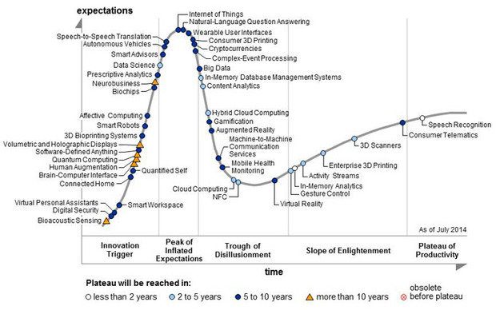
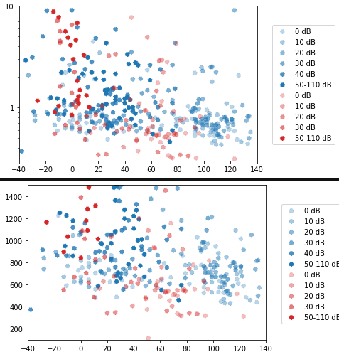
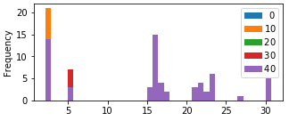
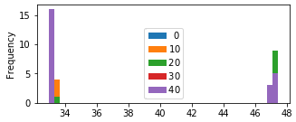
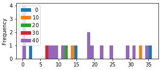
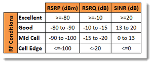

# Acronyms

- **3GPP** Third Generation Partnership Project
- **LTE Cat-NB1/2** Long Term Evolution Narrow-Band Category 1/2
- **NB-IoT** Narrowband Internet of Things
- **OTDOA** - Observed Time Difference Of Arrival
- **eDRX** - Extended Discontinuous Receive X
- **PTAU** - Periodic Tracking Area Update
- **COPS** - Cellular Operator Selection
- **NW** - Network
- **EARFCN** - E-UTRA Absolute Radio Frequency Channel Number
- **PCI**
- **ECL**
- **eNB** - **eNodeB** - 
- **USSD**
- **SMS**
- **WAP**
- **IP**
- **RRC**
## SI Units

- **kB, MB** - kilobyte, megabyte
- **kbps** - kilobits per second
- **mJ or J** - millijoules or joules
- **s, ms, us** - second, millisecond, microsecond

# Terminology

It's imperative to understand the terminology in LTE. First of all, LTE Cat-NB and NB-IoT have the same meaning. It is not the same as LTE Cat-M.

There are two different versions of NB-IoT, with LTE Cat-NB1 being release 13 (), and LTE Cat-NB2 being release 14.

GSM and GPRS fall under 2G and 2.5G. Data transmission (such as USSD, SMS, WAP, IP) is circuit-switched over GSM, and packet-switched over GPRS. Circuit switched data is billed per time interval such as seconds or minutes, and packet-switched is charged per number of bytes (kB, MB, etcetra).

Table: Brief comparison of wireless LPWANs

|                       |             | LoRaWAN           | SigFox   |      |      |
| --------------------- | ----------- | ----------------- | -------- | ---- | ---- |
| Frequency             |             | 433, 868, 915 MHz | ~868 MHz |      |      |
| Bandwidth             |             |                   | 200 kHz  |      |      |
| Throughput            | 56–114 kbps | 27 kbps           | 0.1 kbps |      |      |
| Duty cycle limitation |             | 1-10%             | 1%       |      |      |
| Messages per day      |             |                   | 140      |      |      |
| Bytes per message     |             |                   | 12       |      |      |

Table: Brief comparison of cellular technologies

|                   | 2G/GSM/GPRS | EC-GSM-IoT | LTE Cat-M | NB-IoT     |
| ----------------- | ----------- | ---------- | --------- | ---------- |
| Frequencies       |             |            |           | 0.8-2.6GHz |
| Bandwidth         |             |            |           | 200kHz     |
| Throughput        |             |            |           | 250 kbps   |
| Bytes per message |             |            |           | 512        |

# Intro

Application developers and cellular service providers alike are interested in implementing NB-IoT (LTE Cat-NB) as an alternative to LoRaWAN, SigFox and other LPWANs. Application developers require network coverage, and cellular service providers require consumer and enterprise demand or reasonable motivation before rolling it out nationally. Although there is a great deal of theoretical analysis and simulations in research, the lack of empirical evidence may be contributing to the impasse of growth in the network technology. This thesis aims to bridge that divide.

A number of tests have been developed, performed and analyzed for multiple UE (Ublox and Quectel) and MNOs (MTN and Vodacom) via ZTE and Nokia vendors. Power saving, latency, RF, packet and network metrics are evaluated using UDP, Echo, COPS (network registration), eDRX and PTAU tests.

Although NB-IoT joined LPWANs circa 2016-2017, demand uptake among consumer and industry in South Africa is still slow as well as national coverage rollout. Worldwide it has 30% (rough estimate?) population coverage with most in Europe, China and lately America (mid-2019).

In South Africa, NB-IoT has most of its coverage in the Gauteng province as well as a few sites in other towns and cities. Although Gauteng only covers 1.49% of the land mass in South Africa, it holds ~22% of its ~57 million people so it is great as a live trial run before pushing for national coverage.

It is based off of LTE, making integration and upgrading of existing infrastructure more seamless than an entirely separate technology, although it also brings with the drawbacks of legacy LTE. This includes the benefit of low power, and the low bandwidth trade off which is suitable for smart devices and IoT.

An application developer in IoT is interested in a hands-on approach with the technology they will use, with the aim of scaling up production such that volumes of 1000 devices or more can be reached. Thus an empirical evaluation of the technology is focused on in this thesis, especially when considering that much of the research is analytical or simulation bound.

Martinez [@Martinez2019] has explored NB-IoT from the perspective of the application developer. It is well thought out, and follows a similar path to this thesis. When evaluating performance, it would do well to find the limits of the technology as well as find the optimum 'sweet spot' or range for efficient operation.

A user would consider critical characteristics such as energy consumption, coverage, cost, network latency and behavior. Martinez looks at these except for cost, which is better looked at by Ali [@Ali2015]. A set of tests were devised and results showed that in some cases its energy consumption performed better than an LPWAN referenced technology such as LoRa, with the added benefit of guaranteeing delivery. However, the high variability in energy consumption and network latency call into question its reliability especially for mission-critical applications.

Network operators are looking to enter the LPWAN sphere. 3GPP have made this possible by adapting LTE into Cat-M and NB-IoT.

Application developers are always on the lookout for viable technologies, and tend to use the most prolific ones

## IoT

In 2014, Gartner estimated that IoT had reached the height of inflated expectations, and the hype it generated has resulted in a rich ecosystem of technologies.

Hype yields investment, regardless whether the underlying innovation holds value. Cryptocurrencies are merely a decentralized form of monetary exchange that exists world-wide wide where its value is mainly speculative. Speculation can be volatile, and it can be deemed more ideal for an innovation to have stable growth. IoT holds value in connecting things to the internet, as in its namesake. This can be seen in the venture capital injection into companies and start-ups and the number of connected devices over time.

![Number of connected devices [@Ali2015]](../images/Expected-number-of-connected-devices-to-the-Internet-This-chart-is-obtained-from-recent.png)

In general when forecasting time-series data it would be pragmatic to consider technical analysis, fundamental understanding and sentiment, besides many other factors. At the very least, IoT shows great potential for exponential growth, and unless a technology disruption occurs which means we do not require connections or our devices, then there is undoubtedly an [uptrend](https://amarketresearchgazette.com/global-narrowband-iot-nb-iot-market-2019-2025-vodafone-china-unicom-china-telecom-att-etisalat-telstra-orange-telefonica-sk-telecom-deutsche-telekom/). As Gartner predicts, we should be in the plateau of productivity now, and this can be observed by looking at the current news regarding the technology.

A few months before publishing, [AT&T announces](https://blog.nordicsemi.com/getconnected/att-launches-nb-iot-network-in-usa) nation-wide coverage of NB-IoT in the USA, alongside its existing LTE Cat-M coverage. Deutsche Telekom and Vodafone cover Europe (news?) and China enables millions more IoT devices [@china2019].

## LPWANs

There are many wireless technologies out there, with some standardized (including Bluetooth, 6LowPan, RPMA, Weightless, IETF 6TiSCH, SigFox, LoRaWAN, Dash7 amongst others). Many are proprietary to retain company value and they try to meet application specific requirements also limited by technological constraints. Matching custom applications with a wireless technology is non-trivial as there is no silver bullet that matches all use-cases. On the contrary, many technologies overlap in their capabilities.

## Smart metering

One of the simplest use cases in IoT is smart metering. Periodically sending uplink data at regular intervals from a static location has the advantage of remote monitoring and reducing the need for physical readings. It also opened up new features for users (such as dynamic pricing and usage pattern analysis) and operators (such as load balancing a large number of clients). The clear value proposition and success is partially due to the belief that IoT should be low powered and low data transmissions which still exists today.

## NB-IoT

Formed by the 3GPP from LTE, NB-IoT was developed within that framework and its capabilities are particularly well suited to smart metering.

![IoT Market representation [@Martinez2019]](../images/1559246290186.png)

Taking it one step further, the 3GPP defined two device categories, namely Cat NB1 and NB2, with the latter adding support for:

- Support of Positioning of Device using OTDOA
  - seamless cell re-selection
- Push to talk voice messaging
- New Device Power Class (14 dBm)
- Multicast transmission

 OTDOA positioning, 

Compared to LTE

- devices are stationary
- intermittent burst transmissions
- low data bandwidth
- delay-tolerant applications
- support for huge number of devices
- deals with poor coverage (indoor penetration)
- battery lifetime of a few years

## Performance limitations

It would be useful for the application developer to know the boundaries resulting from this approach. Drawbacks and optimizations targeting IoT can be discussed. The application developer is a potential adopter of the technology and focuses on parameters that fall within end-user control.

Cellular operators would also benefit by knowing where they can improve upon their configurations and equipment.

To this end it would be beneficial to:

- Analyze critical metrics at the core of NB-IoT, such as energy consumption, coverage, cost and latency.
- Create a testing framework to characterize NB-IoT devices in actual operation and using various networks.
- Set optimal operating boundaries based on the obtained results. This should also re-evaluate suitability in certain use cases.
- Compare NB-IoT to Dash7, which can be considered a prominent bi-directional contender. It has the capability of using LoRa's physical layer (RF frontend) so has the added benefit of long range.

## LTE Architecture

# Review of Related Literature

Several studies provide theoretical models not only for the energy consumption of NB-IoT networks [@Andres-Maldonado2017], but also for their latency and delay bounds [@Feltrin2019], impact of coverage extensions [@Andres-Maldonado2018b], coverage performance [@Adhikary2016], battery lifetimes [@Yeoh2018d],[@Lauridsen2018], (theoretically) optimal configuration strategies [@Feltrin2018] and overall performance for particular verticals [@Soussi2018],[@Beyene2017b].

Only Martinez [@Martinez2019] focuses effort on the adopter and presents an operational and empirical analysis of the technology when it is deployed in a real network (such as Vodafone in the Metropolitan area of Barcelona).

Despite the unquestionable value of the theoretical models (for example, to understand orders of magnitude or to guess the theoretical upper and lower bounds), an empirical approach provides real insights into the variability that a UE experiences when deployed in real conditions. This work therefore goes in this direction as a complement to Martinez and related works, and it further provides empirical measurements for UEs that are deployed using a real-world NB-IoT network always while taking the perspective of an application developer.

GSM RF equipment testing and performance analysis [@Kasbah2005]

Analysis of NB-IoT Deployment in LTE Guard-Band [@Ratasuk2017c]

## Martinez

Martinez et al. [@Martinez2019] did empirical tests within the Vodafone Network in Barcelona. They observed UE and NW behavior, measured current traces, and did various tests in different modes.

| Mode       | NW Configuration                                             |
| ---------- | ------------------------------------------------------------ |
| **Mode 1** | Inactivity timer = 20s (network default) T3324 = 0s (disabled) C-DRX = 2.048s (network default) |
| **Mode 2** | Inactivity timer = Immediate Release T3324 = 8s I-DRX = 2.56s eDRX/PTW = Disabled |
| **Mode 3** | Inactivity timer = Immediate Release T3324 = 0s (disabled) |

## Notes

**MTN Lab / 14th Ave Phase 3: Test Plant**

NB-IoT PoC MTN South Africa (Ericsson RAN Connectivity Tests only) [@Ssengonzi2017]

Industrial north Drive Test Requirements [@NorthDrive2017]

**Stellenbosch**

Evaluation of next-generation low-power communication technologies to replace GSM in IoT-applications [@Thomas2018]

**Manufacturers**

Ublox has an NB-IoT Application Development Guide [@ubloxAppNote2018] which details many of the capabilities of the UE.

# Design and Methodology

## Approach

The aim is to compare user equipment (UE) against mobile network operators (MNOs) with a set of tests that evaluate NB-IoT's performance according to a set of metrics which highlight striking differences due to the underlying complexities of LTE architecture.

Four mobile network operators (MNOs) are compared in South Africa according to the underlying vendor
infrastructure used, namely Nokia and ZTE in the Cape/coastal regions and Ericsson and Huawei based in Gauteng/inland regions.

More than one UE is used to improve the accuracy of the result, namely Ublox and Quectel. There is an open possibility to test SimCom and Nordic as well.

A unit testing framework has been carefully prepared in Python in combination with a Hewlett Packard rotary RF attenuator in 10dBm steps. 

Table: UE, NW and main metric comparisons

| NW Vendors | UE Manufacturers | Main Metrics     |
| ---------- | ---------------- | ---------------- |
| ZTE        | Ublox            | Power Efficiency |
| Nokia      | Quectel          | Latency          |
| Ericsson   | Nordic           | Data Charging    |
| Huawei     | SimCom           | Signal Strength  |

## MNO Vendors

In South Africa, there are two cellular operators trialing NB-IoT and combined they use a total of four different manufacturers.

| BSS Manufacturer | Cellular operator |
| ---------------- | ----------------- |
| Nokia            | Vodacom           |
| ZTE              | MTN               |
| Huawei           | Vodacom           |
| Ericsson         | MTN               |

Theoretically, one can assume that these manufacturers meet 3GPP's specifications and that they have set up an optimal environment.

With a testing framework, one can evaluate these capabilities in a transparent manner for both developers and cellular operators alike and work towards improving the quality thereof.

Cellular operators are in control of some things, and users of others.

|                             | Cellular operators | Users       |
| --------------------------- | ------------------ | ----------- |
| NB-IoT Base stations (BSS)  | **X**              |             |
| NB-IoT User Equipment (UE)  |                    | **X**       |
| LoRaWAN Gateways            |                    | **X**       |
| LoRaWAN Devices             |                    | **X**       |
| NB-IoT licensed spectrum    |                    | billed      |
| LoRaWAN unlicensed spectrum |                    | duty-cycled |
|                             |                    |             |
|                             |                    |             |

## UE Manufacturers

The UE devices used is specifically the:

- Ublox Sara N200
- Quectel BC95

and the following is recommended in future:

- Nordic nRF9160
- SimCom SIM7020E

## AT commands

When it comes to base stations, the user does not have control over the inactivity timer. Release assistance can request the eNB/network to disconnect the modem from Radio Resource Control (RRC) connected mode.

## Tests

## PyTest framework

PyTest is a unit testing framework used to setup the UE for each test using AT commands.

## Field test captures

Ublox and Quectel data has been captured for Nokia networks at Vodacom head office in Century City, Cape Town and for ZTE at the MTN Mobile Intelligence Lab, Stellenbosch inside an RF enclosure with the door slightly open before being sealed.

## Post-processing

- what aspect is the plot trying to cover
- what is it telling me on that topic
- purpose
- data in the plot saying / deduce / narrative / story
- 4 sentences
- 4 sentences when comparing nw, and tehn again ues

### Probability estimation

Due to the large dataset and requiring a reasonable means of visualization, we can consider a histogram.

\begin{minipage}{\linewidth}
\begin{center}
\includegraphics[width=.6\linewidth]{../../code/tests/img2/histogram_counts.pdf}
\captionof{figure}{Example python histogram of a univariate latency distribution showing counts}
\end{center}
\end{minipage}

Histogram counts vary among various datasets when their sizes differ, so it would be a good idea to normalize it such that the area under the graph makes 1.0. The probability of the discrete data can also be estimated in a continuous probability density function (PDF) with the kernel density estimation.

\begin{minipage}{\linewidth}
\begin{center}
\includegraphics[width=.6\linewidth]{../../code/tests/img2/probability_density_function_seaborn.pdf}
\captionof{figure}{Example python histogram of a univariate latency distribution with a normalized density and a gaussian kernel density estimate}
\end{center}
\end{minipage}

There are also various types of kernel density estimation, as can be seen here.

\begin{minipage}{\linewidth}
\begin{center}
\includegraphics[width=.6\linewidth]{../../code/tests/img2/probability_density_function.pdf}
\captionof{figure}{Various types of kernel density estimation (KDE)}
\end{center}
\end{minipage}

If the histogram bin values are normalized by dividing by the bin count, adding the values makes 1 instead of integrating along the x-axis. Similarly, multiplying the PDF by its x-axis gives the following result. Although all the plotted values are now truly under 1, the KDE is shifted and doesn't seem usable.  The integration to 1 visualization typical in statistics has to be used.

\begin{minipage}{\linewidth}
\begin{center}
\includegraphics[width=.6\linewidth]{../../code/tests/img2/probability_mass_function.pdf}
\captionof{figure}{Various types of kernel density estimation (KDE) with histogram and KDE normalized in attempted probability mass function}
\end{center}
\end{minipage}

In fact, good practice would be viewing the data as is and not trying to analyze it from what is essentially an entirely new perspective. Thus, the data will be viewed as 2D plotted points and histograms. Colour will be used to group the data according to attenuation and packet size.

## Dataset

Every UE device and MNO pair (4 total) has 7 main tests and each has its own attenuation zone (5 total). 424 files create a dataset with 1811 trace entries, 40 possible metrics and 79921 values.

Looking at the dataset as a whole this makes 140 unique outcomes (7x4x5). There are 15 subtest types which can be delved into, too.

The dataset is also heavily skewed towards lower latency entries. Tests were repeated with the intent of increasing reliability, especially when it takes a couple of seconds, but when a test took up to 300 seconds it had a much lower chance of being repeated. Also considering that dataset capture may be repeated in different locations, one does not necessarily want to spend more than a day on-site.

To solve for the skewness, each test can be normalized by taking a single mean of each of the associated trace entries and files. Now with a dataset of 140/1811 traces, it makes a minimum of 5600/79921 possible values.

Unfortunately this created problems especially where only a few discrete values are concerned, such as in ECL, as multiple means exist. To solve this, k-means clustering is applied.

### K-Means Clustering

Instead of finding a single mean for all the entries and associated files, at least two means are specified (K=2) to take into account the outliers that some tests produce or more if discrete values are involved or isolated regions (K=3+).

\begin{minipage}{\linewidth}
\begin{center}
\includegraphics[width=1.0\linewidth]{../../../masters/code/tests/plots/dpoints.pdf}
\captionof{figure}[K-means clustering]{Trace entries per test. Absolute maximum of 1811 traces has been reduced by removing duplicates and applying thresholds. K-means clustering achieves the desired effect of reducing dimensionality and skewness induced from low latency sampling on the dataset for different tests, yet keeps most of the features of the thresholded max.}
\end{center}
\end{minipage}

## Notes

> at+natspeed=115200,30,1

> disables LPM. cannot do RSSI triangulation

https://www.etsi.org/deliver/etsi_TS/125100_125199/125133/13.00.00_60/ts_125133v130000p.pdf

> In idle mode, UE shall support DRX cycles lengths 0.64, 1.28, 2.56 and 5.12 s, according to [16] and UE shall, if it
> supports eDRX_IDLE, support eDRX_IDLE cycle lengths 10.24, 20.48, 40.96, 81.92, 163.84, 327.68, 55.36,1310.72,
> 1966.08 and 2621.44 seconds, according to TS 24.008 [32]. 

It would be a good idea to use Martinez' work and complement it.

# Results

\newpage

## Latency and timing

### SINR

\begin{minipage}{1.0\linewidth}
\begin{center}
\includegraphics[width=1.0\linewidth]{../../../masters/code/tests/plotterk/SNR_txTime_plot.pdf}
\captionof{figure}[SINR Latency points (526/1558) under 25 seconds.]{Latency points (526/1558) under 25 seconds. (A) Attenuation per decade is not evident according to SNR. It can be suggested that using SNR as a metric for other tests is not beneficial if the attenuation zones cannot be distinguished. This also suggests that Transmit power is a result of RSRP/RSSI instead. (B) The data exists between -100 and 100 dB for both Vodacom and MTN. (C) Tests are varied across SNR. (D) Increased ECL levels seems to be strongly correlated with latency. (Note) The tail at 200 dB is cleared up as a single K-means cluster point due to excess repetition of one of the tests. At K=5, K-means points are a third of the maximum filtered values, which therefore minimizes the low latency kurtosis and retains the unique features.}
\end{center}
\end{minipage}

Extended Coverage Levels (ECL) are determined by the network. The eNB (base station) sets the number of transmission repetitions (ECL) according to received signal strength reported by the UE.

\begin{minipage}{1.0\linewidth}
\begin{center}
\includegraphics[width=1.0\linewidth]{../../../masters/code/tests/plotterk/SNR_txTime_outliers.pdf}
\captionof{figure}[SINR Latency outliers (51/61) up to 300 seconds]{Furthermore, Latency outliers (51/61) up to 300 seconds support the ongoing trend, except that Vodacom has the vast majority of points}
\end{center}
\end{minipage}

### Measured latency

\begin{minipage}{\linewidth}
\begin{center}
\includegraphics[width=1.0\linewidth]{../../../masters/code/tests/plotterk/Signal_power_txTime_outliers.pdf}
\captionof{figure}[Measured Latency outliers (42/61) up to 300 seconds]{Latency outliers (42/61) are up to 300 seconds, mainly from Vodacom and not affected by ECL. Prominent tests include COPS, PTAU and UDP packet tests.}
\end{center}
\end{minipage}

\begin{minipage}{\linewidth}
\begin{center}
\includegraphics[width=1.0\linewidth]{../../../masters/code/tests/plotterk/Signal_power_txTime_plot.pdf}
\captionof{figure}[Measured Latency points (342/1558) under 25 seconds.]{Latency points (342/1558) under 25 seconds. (A) Attenuation per decade is evident. (B) Vodacom latency is up to 5 times greater, excluding outliers. (C) All tests show variation in latency except eDRX. (D) ECL is influenced by RSRP on MTN networks, but does not affect latency. Vodacom's increased latency shows from ECL 1 onwards.}
\end{center}
\end{minipage}

There is a large discrepancy in the measured latency between MTN and Vodacom.

### TX, RX time

\begin{minipage}{1.0\linewidth}
\begin{center}
\includegraphics[width=1.0\linewidth]{../../../masters/code/tests/plotterk/Signal_power_txTimeNW_plot.pdf}
\captionof{figure}[TX time points (225/528) under 20 seconds.]{TX time points (225/528) under 20 seconds. (A) Attenuation zones clearly defined per decade. (B) UE reports satisfactory TX time according to 3GPP standards (under 10 seconds). (C) UDP packet transmissions are reported to be greater than 5 seconds, and the rest of the tests as less. (D) ECL does not affect latency according to reported TX time.}
\end{center}
\end{minipage}

The UE reported latency is not indicative of the measured latency. Data for both MNOs falls within the first 5 seconds, unlike what was measured. It is possible that actual on-air time is less than when measuring latency from external energy measurements because the signals are modulated in the time domain (duty cycle, pulse width). This is not a suitable substitute for latency metrics.

\begin{minipage}{1.0\linewidth}
\begin{center}
\includegraphics[width=1.0\linewidth]{../../../masters/code/tests/plotterk/Signal_power_txTimeNW_outliers.pdf}
\captionof{figure}[TX time outliers (11/11) up to 100 seconds]{TX time outliers (11/11) exist up to 100 seconds and only on the Vodacom network.}
\end{center}
\end{minipage}

\begin{minipage}{1.0\linewidth}
\begin{center}
\includegraphics[width=1.0\linewidth]{../../../masters/code/tests/plotterk/Signal_power_rxTimeNW_outliers.pdf}
\captionof{figure}[RX time outliers (36/47) up to 400 seconds]{RX time outliers (36/47) show RX time up to almost 400 seconds and majority when connected to Vodacom towers. It includes mostly the UDP packet tests and at ECL 1.}
\end{center}
\end{minipage}

\begin{minipage}{1.0\linewidth}
\begin{center}
\includegraphics[width=1.0\linewidth]{../../../masters/code/tests/plotterk/Signal_power_rxTimeNW_plot.pdf}
\captionof{figure}[RX time packets (283/1069) under 20 seconds.]{RX time packets (283/1069) under 20 seconds. (A) Attenuation zones clearly defined per decade. (B) MTN RX and TX time mainly within 2.5 seconds. Vodacom mainly up to 10 seconds. (C) All tests show variation in RX time except eDRX. (D) ECL does not affect RX time on MTN, however most of the tests at Vodacom show ECL 1 and above.}
\end{center}
\end{minipage}

The on-air time for receiving from the network is at least twice as much as the TX time metric. It is more comparable to the external energy-latency measurements and suggests that more energy is spent on receiving than necessary.

### C-DRX duty cycle

On the Vodafone network in connected-DRX (C-DRX) mode, the UE is observed to show peaks spaced at regular 2.048s intervals [@Martinez2019]. On both Vodacom and MTN networks, these peaks are not visible and instead a steady stream of peaks can be seen as on the following images. The peaks indicate an on time of roughly 12ms and idle of 4 seconds. With a cycle of 16ms, it fits the LTE requirements of between 10ms and 2560ms in terms of 1ms subframes. However, NB-IoT has a minimum requirement of 256ms to 9216ms for the interval length between C-DRX transmissions. This means that NB-IoT is utilizing vastly more time on air than permitted by the 3GPP and it is having a detrimental effect on the estimated battery life. Lastly, this does not bode well for the scaling up of devices due to the interference, especially on the shared uplink (NPUSCH) channel.

\begin{minipage}{1.0\linewidth}
\begin{center}
\includegraphics[width=1.0\linewidth]{../../code/tests/logs/zte_mtn/rf_shield/ublox/scope/12_8ms.jpg}
\captionof{figure}[C-DRX MTN-Ublox]{Timing measurement of MTN-Ublox during C-DRX. Although the duty cycles vary in C-DRX mode, it can be estimated that pulses are roughlly 12.8ms in length with 4ms idle between. This means that 75\% of the time the UE device is drawing current.}
\end{center}
\end{minipage}

\begin{minipage}{1.0\linewidth}
\begin{center}
\includegraphics[width=1.0\linewidth]{../../code/tests/logs/zte_mtn/rf_shield/quectel/scope/12ms.jpg}
\captionof{figure}[C-DRX MTN-Quectel]{Timing measurent of C-DRX mode for MTN-Quectel. Although the duty cycles vary in C-DRX mode, it can be estimated that pulses are roughly 12ms in length with 4ms idle between. This means that 75\% of the time the UE device is drawing current.}
\end{center}
\end{minipage}

## Power efficiency

There is a large discrepancy in the energy consumption between MTN and Vodacom.

The inefficiency between the two South African MNOs can either be attributed to poor system configuration, or hardware fault. That is, if the network vendor meets the 3GPP's standards.

### SINR

### Measured energy consumption

\begin{minipage}{\linewidth}
\begin{center}
\includegraphics[width=1.0\linewidth]{../../../masters/code/tests/plotterk/Signal_power_energy_plot.pdf}
\captionof{figure}[Energy packets (340/1540) up to 50 Joules]{Energy packets (340/1540) up to 50 Joules or 14mWh. (A) Attenuation zones per decade evident. (B) Vodacom energy consumption up to 10 times greater, excluding outliers. (C) All tests show variation in energy consumption except eDRX. (D) Vodacom at mostly ECL 1, yet MTN has varied ECL.}
\end{center}
\end{minipage}

\begin{minipage}{\linewidth}
\begin{center}
\includegraphics[width=1.0\linewidth]{../../../masters/code/tests/plotterk/Signal_power_energy_outliers.pdf}
\captionof{figure}[Energy outliers (46/79) up to 750 Joules]{Energy outliers (46/79) are up to 750 Joules or 200mWh, mainly from Vodacom at ECL 1 and the COPS, PTAU or UDP packet test.}
\end{center}
\end{minipage}

All in all, Vodacom uses up to 40 times (200 Joules) more than MTN (up to 5 Joules).

On a generic 3.7V lithium battery with 4Ah of storage, it has 14800mWh in total. In worst case scenarios, at 14mWh it will last for 1057 transmissions, and at the outlying 200mWh it will last for 74 transmissions. In terms of MTN, at 5 Joules (1.4mWh) there are 10570 transmissions available, and with Vodacom at 200 Joules (56mWh) it will last for 266 transmissions.

With daily transmissions, one can hope for a year when connected to Vodacom, and with MTN it far exceeds the 10 year 3GPP standard with 28 years. This leaves enough room for scheduled downlink transmissions using eDRX.

### Measured max current

\begin{minipage}{\linewidth}
\begin{center}
\includegraphics[width=1.0\linewidth]{../../../masters/code/tests/plotterk/Signal_power_energy_outliers.pdf}
\captionof{figure}[Max current of packets (372/1619) up to 128mA]{Max current of packets (372/1619) roughly between 70 and 120mA, and skewed towards higher consumption. It is also clamped at 128mA due to measurement limitations. (A) Attenuation zones evident. (B) Both MTN and Vodacom share similar distributions of max current usage. (C) Tests are varied, yet UDP packet transmission tend to use more current. (D) ECL does not affect current usage.}
\end{center}
\end{minipage}

\begin{minipage}{\linewidth}
\begin{center}
\includegraphics[width=1.0\linewidth]{../../../masters/code/tests/plotterk/maxCurrent_histogram.pdf}
\captionof{figure}[Max current of packets histogram]{The latency-energy measurement hardware is limited to 128mA, and therefore we can see some clamping here. It shouldn't affect the energy readings much however, as maximum current occurs only during the first few microseconds of the random access preamble.}
\end{center}
\end{minipage}

### Transmit power

\begin{minipage}{\linewidth}
\begin{center}
\includegraphics[width=1.0\linewidth]{../../../masters/code/tests/plotterk/Signal_power_TX_power_plot.pdf}
\captionof{figure}[Transmit powers of packets (204/1597) up to 23dBm]{Transmit powers of packets (204/1597) from -10 to 23 dBm. (A) Transmit power decreases proportional to RSRP from around -100 dBm and stronger. (B) Attenuation/RSRP affects transmit power on MTN, and Vodacom remains at the 23 dBm max. (C) Variation in all tests. (D) ECL 0 and 1 uses less power but ECL 2 remains at max power.}
\end{center}
\end{minipage}

The UE maintains a max output power of 23 dBm when connected to Vodacom towers, and decreases proportional to RSRP/RSSI on MTN towers. When comparing energy and latency to transmit power, both show variation at 23 dBm and decrease at lower powers which indicates that although it is a contributing factor it is definitely more affected by time on air.

Around -100 dBm devices decrease their output power at roughly 10 dBm per decade of RSRP amplification when connected to MTN towers. This might be attributable to the ECL level that the eNodeB sets for the UE. If the tests are repeated for RSRP signals greater than -70 dBm, it can be assumed that the transmit power will eventually decrease to -56 dBm according to the AT+UTEST command in the Ublox N2 datasheet. If the transmit power decreases linearly according to RSRP, minimum output power would be achieved at -20 dBm or greater.

### Joules per second

\begin{minipage}{\linewidth}
\begin{center}
\includegraphics[width=1.0\linewidth]{../../../masters/code/tests/plotterk/txTime_energy_plot.pdf}
\captionof{figure}[Energy-Latency packets (322/1640)]{Energy consumption versus Latency packets (322/1640). (A) Attenuation zones show variation. (B) UE-MNO pairings show similar trends, yet is possible (more in Vodacom's case) for latency to increase and energy levels to remain the same. (C) Tests show variation. (D) Increased ECL indicated higher latency and energy consumption.}
\end{center}
\end{minipage}

After 5 seconds UEs consume 1 Joule per second when connected to a tower and after 15 seconds 3 Joules per second at most. However, it is possible to use energy more efficiently and increase latency.

\begin{minipage}{\linewidth}
\begin{center}
\includegraphics[width=1.0\linewidth]{../../../masters/code/tests/plotterk/txTime_energy_outliers.pdf}
\captionof{figure}[Energy-Latency packet outliers (47/74).]{Energy vs Latency outliers (47/74) exist from 25 seconds onwards, and it follows the same structure as the above. The majority of outliers are Vodacom's.}
\end{center}
\end{minipage}

It is evident that on all attenuation levels there is a high degree of variation in latency and energy, and thus correlation with attenuation is unlikely. Considering the discrepancy between MTN and Vodacom is up to a ten-fold difference, the latter's Nokia towers are vastly inefficient. Lastly, most of the test data falls within the first 10 seconds, with eDRX power saving being the most efficient, and network registration or sending large UDP packets being the least.

### Test Modes

#### UDP size

\begin{minipage}{\linewidth}
\begin{center}
\includegraphics[width=1.0\linewidth]{../../code/tests/datagrams/mtn_ublox_energy.pdf}
\captionof{figure}[UDP Datagram energy-sizes]{Datagram sizes of MTN-Ublox pair up to 1500mJ. Note the steady increase in Energy consumption on the baseline, and the high variation.}
\end{center}
\end{minipage}

#### eDRX

#### PTAU

#### COPS

#### Echo

### C-DRX current usage

\begin{minipage}{\linewidth}
\begin{center}
\includegraphics[width=1.0\linewidth]{../../code/tests/logs/zte_mtn/rf_shield/ublox/scope/cdrx73_6mA_110dB.jpg}
\captionof{figure}[C-DRX MTN-Ublox current measurement]{Current measurement of MTN-Ublox during connected DRX mode (C-DRX). The UE uses 73.6mA at 110dB attenuation with the RF shield enclosure door slightly open}
\end{center}
\end{minipage}

\begin{minipage}{\linewidth}
\begin{center}
\includegraphics[width=1.0\linewidth]{../../code/tests/logs/zte_mtn/rf_shield/quectel/scope/70.4mA_ant_0dB.jpg}
\captionof{figure}[C-DRX MTN-Quectel current measurement]{Current measurement of MTN-Ublox during connected DRX mode (C-DRX). The UE uses 73.6mA at 110dB attenuation with the RF shield enclosure door slightly open}
\end{center}
\end{minipage}

## Packet metrics

### SINR

### TX, RX bytes

**TX bytes**

\begin{minipage}{\linewidth}
\begin{center}
\includegraphics[width=1.0\linewidth]{../../../masters/code/tests/plotterk/Signal_power_txBytes_plot.pdf}
\captionof{figure}[TX packet sizes (174/457) up to 1kB.]{TX packet sizes (174/457) up to 1kB. (A) Attenuation zones evident and potentially affect packet size. (B) UE-MNO pairs share similar characteristics. (C) Different tests are grouped with similar sizes with UDP packets being the largest, and COPS the smallest. (D) ECL does not seem to affect packet size.}
\end{center}
\end{minipage}

In general packets are around 100-300 bytes in size and all UE-MNO pairings share similar sizes. There are a few subtle trend lines which suggest that packet size increases proportionally to decreased RSRP. 

\begin{minipage}{\linewidth}
\begin{center}
\includegraphics[width=1.0\linewidth]{../../../masters/code/tests/plotterk/Signal_power_txBytes_outliers.pdf}
\captionof{figure}[TX packet size outliers (37/65) up to 20kB.]{TX packet size outliers (37/65) up to 20kB. Attenuation zones do not affect packet size. Vodacom has outliers above 10kB. All outliers are as a result of UDP packet tests and ECL does not seem to affect packet size.}
\end{center}
\end{minipage}

[txBytes_histogram](../../../masters/code/tests/plotterk/txBytes_histogram.png)

There is a large degree of variation in packet sizes expected to be up to 512 bytes, with sizes up to 10kB or more recorded. That's a 20-fold difference which certainly means on can run out of budget on data costs sooner than expected. The prices of packet-switched data in South Africa is high due to ICASA regulations and is the cause of much competition for remaining spectrum when most is still being used for analogue television broadcast by the SABC.

**RX bytes**

\begin{minipage}{\linewidth}
\begin{center}
\includegraphics[width=1.0\linewidth]{../../../masters/code/tests/plotterk/Signal_power_rxBytes_plot.pdf}
\captionof{figure}[RX packet sizes (166/504) up to 1kB.]{RX packet sizes (166/504) up to 1kB. (A) Attenuation zones evident and do not affect packet size. (B) UE-MNO pairs share similar characteristics. (C) Different tests are grouped with similar sizes with UDP packets being the largest, and COPS the smallest. (D) ECL does not seem to affect packet size.}
\end{center}
\end{minipage}

In general packet sizes are up to 200 bytes.

\begin{minipage}{\linewidth}
\begin{center}
\includegraphics[width=1.0\linewidth]{../../../masters/code/tests/plotterk/Signal_power_rxBytes_outliers.pdf}
\captionof{figure}[RX packet size outliers (12/18) up to 6kB.]{RX packet size outliers (12/18) up to 6kB. Attenuation zones do not affect packet size Quectel-MTN and Ublox-Vodacom pairs are essentially the only outliers above 300 bytes already. All outliers are as a result of UDP packet tests and ECL does not seem to affect packet size.}
\end{center}
\end{minipage}

### ACKs/NACKs

\begin{minipage}{\linewidth}
\begin{center}
\includegraphics[width=1.0\linewidth]{../../../masters/code/tests/plotterk/Signal_power_Total_ACK_NACK_RX_plot.pdf}
\captionof{figure}[ACK/NACK packets (83/385) mostly up to 30, 80 outlier]{ACK/NACK packets (83/385) mostly up to 30 required, and one outlier at 80. (A) Attenuation zones evident and do not affect number of ACK/NACKs. (B) Vodacom requires more ACK/NACK responses than MTN. They share similar characteristics at a difference of 40dBm RSRP. (C) Significant variation in tests, although eDRX tests show the greatest number. (D) ECL does not seem to affect ACK/NACK count}
\end{center}
\end{minipage}

## RF receive metrics

Tests were completed in good, mid cell and cell edge RF conditions.

### RSSI vs RSRP

\begin{minipage}{\linewidth}
\begin{center}
\includegraphics[width=1.0\linewidth]{../../../masters/code/tests/plotterk/Signal_power_Total_power_plot.pdf}
\captionof{figure}[RSSI vs RSRP packets (389/1619).]{RSSI vs RSRP packets (389/1619). (A) Attenuation zones evident in both RSSI/RSRP. (B) Vodacom within a range of 40dBm and MTN within 50dBm. MTN is also 20dBm more sensitive in terms of RSRP. (C) Significant variation in tests across both axes. (D) ECL 2 mainly from -110dB RSRP or less and ECL 1 more. ECL 0 spread throughout.}
\end{center}
\end{minipage}

### RSRQ

**RSRQ = N x RSRP / RSSI**

- N is the number of Physical Resource Blocks (PRBs) over which the RSSI is measured, typically equal to system bandwidth
- RSSI is pure wide band power measurement, including intracell power, interference and noise
- The reporting range of RSRQ is defined from -3…-19.5dB

\begin{minipage}{\linewidth}
\begin{center}
\includegraphics[width=1.0\linewidth]{../../../masters/code/tests/plotterk/Signal_power_RSRQ_plot.pdf}
\captionof{figure}[RSRQ vs RSRP packets (389/1619).]{RSRQ vs RSRP packets (389/1619). (A) Attenuation zones evident in RSRP and skewed by RSRQ axis. (B) Vodacom shows poorer RSRQ than MTN. (CD) Significant variation in tests and ECL across both axes.}
\end{center}
\end{minipage}

\begin{minipage}{\linewidth}
\begin{center}
\includegraphics[width=1.0\linewidth]{../../../masters/code/tests/plotterk/RSRQ_histogram.pdf}
\captionof{figure}{Histogram distribution of RSRQ.}
\end{center}
\end{minipage}

### SINR

https://www.cablefree.net/wirelesstechnology/4glte/lte-rsrq-sinr/

SINR is a measure of signal quality as well but it is not defined in the 3GPP specs but defined by the UE vendor.

It is not reported to the network. SINR is used a lot by operators, and the LTE industry in general, as it better quantifies the **relationship between RF conditions and Throughput**. LTE UEs typically use SINR to calculate the CQI (Channel Quality Indicator) they report to the network.

It is a common practice to use Signal-to-Interference Ratio (SINR) as an indicator for network quality. It should be however noted that 3GPP specifications do not define SINR and  therefore UE does not report SINR to the network. SINR is still internally measured by most UEs and recorded by drive test tools.

Unfortunately UE chipset and RF scanner manufacturers have implemented SINR measurement in various different ways which are not always easily comparable. While at first it may seem that defining SINR should be unambiguous, in case of LTE downlink this is not the case. This is because different REs within a radio frame carry different physical signals and channels each of which, in turn, see different interference power depending on inter-cell radio frame synchronization.

For example, in a frame-synchronized network, **SINR estimation based on synchronization signals**(PSS/SSS) results in different SINR than SINR estimation based on Reference Signals, since in the latter case the frequency shift of the RS depends on the PCI plan.

\begin{minipage}{\linewidth}
\begin{center}
\includegraphics[width=1.0\linewidth]{../../../masters/code/tests/plotterk/Signal_power_RSRQ_plot.pdf}
\captionof{figure}{SINR vs RSRP packets (389/1619). (A) Attenuation zones evident in RSRP and skewed by SINR axis. (B) Vodacom shows poorer SINR than MTN. (CD) Significant variation in tests and ECL across both axes.}
\end{center}
\end{minipage}

SNR is spread relatively evenly for the different attenuation zones.

\begin{minipage}{\linewidth}
\begin{center}
\includegraphics[width=1.0\linewidth]{../../../masters/code/tests/plotterk/SNR_histogram.pdf}
\captionof{figure}{Histogram distribution of SINR.}
\end{center}
\end{minipage}

## Network metrics

### ECL, Cell ID, EARFCN, PCI

\begin{minipage}{\linewidth}
\begin{center}
\includegraphics[width=1.0\linewidth]{../../../masters/code/tests/plotterk/Signal_power_ECL_plot.pdf}
\captionof{figure}[ECL vs RSRP.]{ECL not determined by attenuation.}
\end{center}
\end{minipage}

Table: Cell ID count after K-means cluster filtering.

| Cell ID         | 239882509 | 2671716 | 2672484 | 484196 |
| --------------- | --------- | ------- | ------- | ------ |
| Ublox-MTN       | 34        | 13      | 1       |        |
| Quectel-MTN     | 26        | 29      | 4       |        |
| Ublox-Vodacom   |           |         |         | 34     |
| Quectel-Vodacom |           |         |         | 32     |

Table: PCI for serving cell.

| PCI             | 123  | 14   | 11   | 2    |
| --------------- | ---- | ---- | ---- | ---- |
| Ublox-MTN       | 34   | 13   | 1    |      |
| Quectel-MTN     | 26   | 29   | 3    |      |
| Ublox-Vodacom   |      |      |      | 34   |
| Quectel-Vodacom |      |      |      | 32   |

Physical Cell ID (PCI) is the serving cell tower's unique identifier.

On the MTN network, the UE connected to three different towers.

Table: EARFCN for serving cell

| EARFCN          | 3564 | 3712 |
| --------------- | ---- | ---- |
| Ublox-MTN       |      | 35   |
| Quectel-MTN     |      | 35   |
| Ublox-Vodacom   | 34   |      |
| Quectel-Vodacom | 32   |      |

The E-UTRA Absolute Radio Frequency Channel Number (EARFCN) designates the carrier frequency in the uplink and downlink, and ranges between 0-65535.

Since the frequency of the three towers was the same on all three MTN towers, this shows that intra-cell reselection does indeed work.

## Memory allocation

Memory can be considered a reasonable UE health metric in terms of monitoring code stability.

\begin{minipage}{1.0\linewidth}
\begin{center}
\includegraphics[width=1.0\linewidth]{../../../masters/code/tests/plotterk/Current_Allocated_histogram.pdf}
\captionof{figure}[Currently allocated memory.]{Currently allocated memory. Equal distribution of attenuation zones and tests. Quectel uses about 16kB of memory and Ublox about 26kB.}
\end{center}
\end{minipage}

\begin{minipage}{1.0\linewidth}
\begin{center}
\includegraphics[width=1.0\linewidth]{../../../masters/code/tests/plotterk/Total_Free_histogram.pdf}
\captionof{figure}[Free memory available.]{Free memory available. Equal distribution of attenuation zones and tests. Quectel has about 7kB of memory free and Ublox about 17kB.}
\end{center}
\end{minipage}

\begin{minipage}{1.0\linewidth}
\begin{center}
\includegraphics[width=1.0\linewidth]{../../../masters/code/tests/plotterk/Signal_power_Num_Allocs_plot.pdf}
\captionof{figure}[Accumulated memory allocations per packet (390/1619) up to 4000.]{Accumulated memory allocations per packet (390/1619) up to 4000. (ABCD) Attenuation zones evident per decade, Quectel has slightly more allocations per MNO, tests show majority linear increases and ECL does not have a notable effect on the number of allocations.}
\end{center}
\end{minipage}

The number of allocations and frees are very similar, hence the latter is not shown here as well. The code can be considered running stable for both Ublox and Quectel, with memory usages of 60% and 70%, respectively.

## UE-MNO Comparison

# Discussion

# Conclusion

Attenuation does not affect performance as much as the ECL level does, and includes
degradation to latency, energy consumption and packet size.

The inefficiency between the two South African MNOs can either be attributed to poor
system configuration, or hardware fault. That is, if the network vendor meets the 3GPP's
standards. Vodacom’s Nokia infrastructure has failed one of the most important
requirements for NB-IoT being under 10 seconds latency for all network conditions.
Secondly it is 20dBm RSRP less sensitive than MTN’s ZTE infrastructure, which has
satisfactory performance overall. Since the findings are reflected similarly across the
Ublox and Quectel UE, it implies that the discrepancies are as a result of the MNO
vendor.

# References

