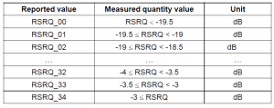

# Results

## Dataset

Every UE device and MNO pair (4 total) has 7 main tests and each has its own attenuation zone (5 total). 424 files create a dataset with 1811 trace entries, 40 possible metrics and 79921 values.

Looking at the dataset as a whole this makes 140 unique outcomes (7x4x5). There are 15 subtest types which can be delved into, too.

The dataset is also heavily skewed towards lower latency entries. Tests were repeated with the intent of increasing reliability, especially when it takes a couple of seconds, but when a test took up to 300 seconds it had a much lower chance of being repeated. Also considering that dataset capture may be repeated in different locations, one does not necessarily want to spend more than a day on-site.

To solve for the skewness, each test can be normalized by taking a single mean of each of the associated trace entries and files. Now with a dataset of 140/1811 traces, it makes a minimum of 5600/79921 possible values.

Unfortunately this created problems especially where only a few discrete values are concerned, such as in ECL, as multiple means exist. To solve this, k-means clustering is applied.

### K-Means Clustering

Instead of finding a single mean for all the entries and associated files, at least two means are specified (K=2) to take into account the outliers that some tests produce or more if discrete values are involved or isolated regions (K=3+).

\begin{minipage}{\linewidth}
\begin{center}
\includegraphics[width=1.0\linewidth]{../../../masters/code/tests/plots/dpoints.pdf}
\captionof{figure}{Trace entries per test. Absolute maximum of 1811 traces has been reduced by removing duplicates and applying thresholds. K-means clustering achieves the desired effect of reducing dimensionality and skewness induced from low latency sampling on the dataset for different tests, yet keeps most of the features of the thresholded max.}
\end{center}
\end{minipage}

\newpage

## Latency

### Measured latency

#### SNR

\begin{minipage}{1.0\linewidth}
\begin{center}
\includegraphics[width=1.0\linewidth]{../../../masters/code/tests/plotterk/SNR_txTime_plot.pdf}
\captionof{figure}{Latency points (526/1558) under 25 seconds. (A) Attenuation per decade is not evident according to SNR. It can be suggested that using SNR as a metric for other tests is not beneficial if the attenuation zones cannot be distinguished. This also suggests that Transmit power is a result of RSRP/RSSI instead. (B) The data exists between -100 and 100 dB for both Vodacom and MTN. (C) Tests are varied across SNR. (D) Increased ECL levels seems to be strongly correlated with latency. (Note) The tail at 200 dB is cleared up as a single K-means cluster point due to excess repetition of one of the tests. At K=5, K-means points are a third of the maximum filtered values, which therefore minimizes the low latency kurtosis and retains the unique features.}
\end{center}
\end{minipage}

Extended Coverage Levels (ECL) are determined by the network. The eNB (base station) sets the number of transmission repetitions (ECL) according to received signal strength reported by the UE.

\begin{minipage}{1.0\linewidth}
\begin{center}
\includegraphics[width=1.0\linewidth]{../../../masters/code/tests/plotterk/SNR_txTime_outliers.pdf}
\captionof{figure}{Furthermore, Latency outliers (51/61) support the ongoing trend, except that Vodacom has a vast number of points up to 100 seconds and more.}
\end{center}
\end{minipage}

#### RSRP

\begin{minipage}{\linewidth}
\begin{center}
\includegraphics[width=1.0\linewidth]{../../../masters/code/tests/plotterk/Signal_power_txTime_outliers.pdf}
\captionof{figure}{Latency outliers (42/61) are up to 300 seconds, mainly from Vodacom and not affected by ECL. Prominent tests include COPS, PTAU and UDP packet tests.}
\end{center}
\end{minipage}

\begin{minipage}{\linewidth}
\begin{center}
\includegraphics[width=1.0\linewidth]{../../../masters/code/tests/plotterk/Signal_power_txTime_plot.pdf}
\captionof{figure}{Latency points (342/1558) under 25 seconds. (A) Attenuation per decade is evident. (B) Vodacom latency is up to 5 times greater, excluding outliers. (C) All tests show variation in latency except eDRX. (D) ECL is influenced by RSRP on MTN networks, but does not affect latency. Vodacom's increased latency shows from ECL 1 onwards.}
\end{center}
\end{minipage}

There is a large discrepancy in the measured latency between MTN and Vodacom.

### TX time

\begin{minipage}{1.0\linewidth}
\begin{center}
\includegraphics[width=1.0\linewidth]{../../../masters/code/tests/plotterk/Signal_power_txTimeNW_plot.pdf}
\captionof{figure}{TX time points (225/528) under 20 seconds. (A) Attenuation zones clearly defined per decade. (B) UE reports satisfactory TX time according to 3GPP standards (under 10 seconds). (C) UDP packet transmissions are reported to be greater than 5 seconds, and the rest of the tests as less. (D) ECL does not affect latency according to reported TX time.}
\end{center}
\end{minipage}

The UE reported latency is not indicative of the measured latency. Data for both MNOs falls within the first 5 seconds, unlike what was measured. It is possible that actual on-air time is less than when measuring latency from external energy measurements because the signals are modulated in the time domain (duty cycle, pulse width). This is not a suitable substitute for latency metrics.

\begin{minipage}{1.0\linewidth}
\begin{center}
\includegraphics[width=1.0\linewidth]{../../../masters/code/tests/plotterk/Signal_power_txTimeNW_outliers.pdf}
\captionof{figure}{TX time outliers (11/11) exist up to 100 seconds and only on the Vodacom network.}
\end{center}
\end{minipage}

### RX time

\begin{minipage}{1.0\linewidth}
\begin{center}
\includegraphics[width=1.0\linewidth]{../../../masters/code/tests/plotterk/Signal_power_rxTimeNW_outliers.pdf}
\captionof{figure}{RX time outliers (36/47) show RX time up to almost 400 seconds and majority when connected to Vodacom towers. It includes mostly the UDP packet tests and at ECL 1.}
\end{center}
\end{minipage}

\begin{minipage}{1.0\linewidth}
\begin{center}
\includegraphics[width=1.0\linewidth]{../../../masters/code/tests/plotterk/Signal_power_rxTimeNW_plot.pdf}
\captionof{figure}{RX time packets (283/1069) under 20 seconds. (A) Attenuation zones clearly defined per decade. (B) MTN RX and TX time mainly within 2.5 seconds. Vodacom mainly up to 10 seconds. (C) All tests show variation in RX time except eDRX. (D) ECL does not affect RX time on MTN, however most of the tests at Vodacom show ECL 1 and above.}
\end{center}
\end{minipage}

The on-air time for receiving from the network is at least twice as much as the TX time metric. It is more comparable to the external energy-latency measurements and suggests that more energy is spent on receiving than necessary.

## Power saving

There is a large discrepancy in the energy consumption between MTN and Vodacom.

The inefficiency between the two South African MNOs can either be attributed to poor system configuration, or hardware fault. That is, if the network vendor meets the 3GPP's standards.

### SINR

### Measured energy consumption

\begin{minipage}{\linewidth}
\begin{center}
\includegraphics[width=1.0\linewidth]{../../../masters/code/tests/plotterk/Signal_power_energy_plot.pdf}
\captionof{figure}{Energy packets (340/1540) up to 50 Joules or 14mWh. (A) Attenuation zones per decade evident. (B) Vodacom energy consumption up to 10 times greater, excluding outliers. (C) All tests show variation in energy consumption except eDRX. (D) Vodacom at mostly ECL 1, yet MTN has varied ECL.}
\end{center}
\end{minipage}

\begin{minipage}{\linewidth}
\begin{center}
\includegraphics[width=1.0\linewidth]{../../../masters/code/tests/plotterk/Signal_power_energy_outliers.pdf}
\captionof{figure}{Energy outliers (46/79) are up to 750 Joules or 200mWh, mainly from Vodacom at ECL 1 and the COPS, PTAU or UDP packet test.}
\end{center}
\end{minipage}

All in all, Vodacom uses up to 40 times (200 Joules) more than MTN (up to 5 Joules).

On a generic 3.7V lithium battery with 4Ah of storage, it has 14800mWh in total. In worst case scenarios, at 14mWh it will last for 1057 transmissions, and at the outlying 200mWh it will last for 74 transmissions. In terms of MTN, at 5 Joules (1.4mWh) there are 10570 transmissions available, and with Vodacom at 200 Joules (56mWh) it will last for 266 transmissions.

With daily transmissions, one can hope for a year when connected to Vodacom, and with MTN it far exceeds the 10 year 3GPP standard with 28 years. This leaves enough room for scheduled downlink transmissions using eDRX.

### Measured max current

\begin{minipage}{\linewidth}
\begin{center}
\includegraphics[width=1.0\linewidth]{../../../masters/code/tests/plotterk/Signal_power_energy_outliers.pdf}
\captionof{figure}{Max current of packets (372/1619) roughly between 70 and 120mA, and skewed towards higher consumption. It is also clamped at 128mA due to measurement limitations. (A) Attenuation zones evident. (B) Both MTN and Vodacom share similar distributions of max current usage. (C) Tests are varied, yet UDP packet transmission tend to use more current. (D) ECL does not affect current usage.}
\end{center}
\end{minipage}

\begin{minipage}{\linewidth}
\begin{center}
\includegraphics[width=1.0\linewidth]{../../../masters/code/tests/plotterk/maxCurrent_histogram.pdf}
\captionof{figure}{The latency-energy measurement hardware is limited to 128mA, and therefore we can see some clamping here. It shouldn't affect the energy readings much however, as maximum current occurs only during the first few microseconds of the random access preamble.}
\end{center}
\end{minipage}

### Transmit power

\begin{minipage}{\linewidth}
\begin{center}
\includegraphics[width=1.0\linewidth]{../../../masters/code/tests/plotterk/Signal_power_TX_power_plot.pdf}
\captionof{figure}{Transmit powers of packets (204/1597) from -10 to 23 dBm. (A) Transmit power decreases proportional to RSRP from around -100 dBm and stronger. (B) Attenuation/RSRP affects transmit power on MTN, and Vodacom remains at the 23 dBm max. (C) Variation in all tests. (D) ECL 0 and 1 uses less power but ECL 2 remains at max power.}
\end{center}
\end{minipage}

The UE maintains a max output power of 23 dBm when connected to Vodacom towers, and decreases proportional to RSRP/RSSI on MTN towers. When comparing energy and latency to transmit power, both show variation at 23 dBm and decrease at lower powers which indicates that although it is a contributing factor it is definitely more affected by time on air.

Around -100 dBm devices decrease their output power at roughly 10 dBm per decade of RSRP amplification when connected to MTN towers. This might be attributable to the ECL level that the eNodeB sets for the UE. If the tests are repeated for RSRP signals greater than -70 dBm, it can be assumed that the transmit power will eventually decrease to -56 dBm according to the AT+UTEST command in the Ublox N2 datasheet. If the transmit power decreases linearly according to RSRP, minimum output power would be achieved at -20 dBm or greater.

### Joules per second

\begin{minipage}{\linewidth}
\begin{center}
\includegraphics[width=1.0\linewidth]{../../../masters/code/tests/plotterk/txTime_energy_plot.pdf}
\captionof{figure}{Energy consumption versus Latency packets (322/1640). (A) Attenuation zones show variation. (B) UE-MNO pairings show similar trends, yet is possible (more in Vodacom's case) for latency to increase and energy levels to remain the same. (C) Tests show variation. (D) Increased ECL indicated higher latency and energy consumption.}
\end{center}
\end{minipage}

After 5 seconds UEs consume 1 Joule per second when connected to a tower and after 15 seconds 3 Joules per second at most. However, it is possible to use energy more efficiently and increase latency.

\begin{minipage}{\linewidth}
\begin{center}
\includegraphics[width=1.0\linewidth]{../../../masters/code/tests/plotterk/txTime_energy_outliers.pdf}
\captionof{figure}{Energy vs Latency outliers (47/74) exist from 25 seconds onwards, and it follows the same structure as the above. The majority of outliers are Vodacom's.}
\end{center}
\end{minipage}

It is evident that on all attenuation levels there is a high degree of variation in latency and energy, and thus correlation with attenuation is unlikely. Considering the discrepancy between MTN and Vodacom is up to a ten-fold difference, the latter's Nokia towers are vastly inefficient. Lastly, most of the test data falls within the first 10 seconds, with eDRX power saving being the most efficient, and network registration or sending large UDP packets being the least.

### Tests

#### UDP size

\begin{minipage}{\linewidth}
\begin{center}
\includegraphics[width=1.0\linewidth]{../../code/tests/datagrams/mtn_ublox_energy.pdf}
\captionof{figure}{Datagram sizes of MTN-Ublox pair up to 1500mJ. Note the steady increase in Energy consumption on the baseline, and the high variation.}
\end{center}
\end{minipage}

#### eDRX

#### PTAU

#### COPS

#### Echo

## Packet metrics

### TX bytes

\begin{minipage}{\linewidth}
\begin{center}
\includegraphics[width=1.0\linewidth]{../../../masters/code/tests/plotterk/Signal_power_txBytes_plot.pdf}
\captionof{figure}{TX packet sizes (174/457) up to 1kB. (A) Attenuation zones evident and potentially affect packet size. (B) UE-MNO pairs share similar characteristics. (C) Different tests are grouped with similar sizes with UDP packets being the largest, and COPS the smallest. (D) ECL does not seem to affect packet size.}
\end{center}
\end{minipage}

In general packets are around 100-300 bytes in size and all UE-MNO pairings share similar sizes. There are a few subtle trend lines which suggest that packet size increases proportionally to decreased RSRP. 

\begin{minipage}{\linewidth}
\begin{center}
\includegraphics[width=1.0\linewidth]{../../../masters/code/tests/plotterk/Signal_power_txBytes_outliers.pdf}
\captionof{figure}{TX packet size outliers (37/65) up to 20kB. Attenuation zones do not affect packet size. Vodacom has outliers above 10kB. All outliers are as a result of UDP packet tests and ECL does not seem to affect packet size.}
\end{center}
\end{minipage}

[txBytes_histogram](../../../masters/code/tests/plotterk/txBytes_histogram.png)

There is a large degree of variation in packet sizes expected to be up to 512 bytes, with sizes up to 10kB or more recorded. That's a 20-fold difference which certainly means on can run out of budget on data costs sooner than expected. The prices of packet-switched data in South Africa is high due to ICASA regulations and is the cause of much competition for remaining spectrum when most is still being used for analogue television broadcast by the SABC.

### RX bytes

\begin{minipage}{\linewidth}
\begin{center}
\includegraphics[width=1.0\linewidth]{../../../masters/code/tests/plotterk/Signal_power_rxBytes_plot.pdf}
\captionof{figure}{RX packet sizes (166/504) up to 1kB. (A) Attenuation zones evident and do not affect packet size. (B) UE-MNO pairs share similar characteristics. (C) Different tests are grouped with similar sizes with UDP packets being the largest, and COPS the smallest. (D) ECL does not seem to affect packet size.}
\end{center}
\end{minipage}

In general packet sizes are up to 200 bytes.

\begin{minipage}{\linewidth}
\begin{center}
\includegraphics[width=1.0\linewidth]{../../../masters/code/tests/plotterk/Signal_power_rxBytes_outliers.pdf}
\captionof{figure}{RX packet size outliers (12/18) up to 6kB. Attenuation zones do not affect packet size Quectel-MTN and Ublox-Vodacom pairs are essentially the only outliers above 300 bytes already. All outliers are as a result of UDP packet tests and ECL does not seem to affect packet size.}
\end{center}
\end{minipage}

### ACKs/NACKs

\begin{minipage}{\linewidth}
\begin{center}
\includegraphics[width=1.0\linewidth]{../../../masters/code/tests/plotterk/Signal_power_Total_ACK_NACK_RX_plot.pdf}
\captionof{figure}{ACK/NACK packets (83/385) mostly up to 30 required, and one outlier at 80. (A) Attenuation zones evident and do not affect number of ACK/NACKs. (B) Vodacom requires more ACK/NACK responses than MTN. They share similar characteristics at a difference of 40dBm RSRP. (C) Significant variation in tests, although eDRX tests show the greatest number. (D) ECL does not seem to affect ACK/NACK count}
\end{center}
\end{minipage}

## RF receive metrics

Tests were completed in good, mid cell and cell edge RF conditions.

### RSSI vs RSRP

\begin{minipage}{\linewidth}
\begin{center}
\includegraphics[width=1.0\linewidth]{../../../masters/code/tests/plotterk/Signal_power_Total_power_plot.pdf}
\captionof{figure}{RSSI vs RSRP packets (389/1619). (A) Attenuation zones evident in both RSSI/RSRP. (B) Vodacom within a range of 40dBm and MTN within 50dBm. MTN is also 20dBm more sensitive in terms of RSRP. (C) Significant variation in tests across both axes. (D) ECL 2 mainly from -110dB RSRP or less and ECL 1 more. ECL 0 spread throughout.}
\end{center}
\end{minipage}

### RSRQ

**RSRQ = N x RSRP / RSSI**

- N is the number of Physical Resource Blocks (PRBs) over which the RSSI is measured, typically equal to system bandwidth
- RSSI is pure wide band power measurement, including intracell power, interference and noise
- The reporting range of RSRQ is defined from -3…-19.5dB

\begin{minipage}{\linewidth}
\begin{center}
\includegraphics[width=1.0\linewidth]{../../../masters/code/tests/plotterk/Signal_power_RSRQ_plot.pdf}
\captionof{figure}{RSRQ vs RSRP packets (389/1619). (A) Attenuation zones evident in RSRP and skewed by RSRQ axis. (B) Vodacom shows poorer RSRQ than MTN. (CD) Significant variation in tests and ECL across both axes.}
\end{center}
\end{minipage}

\begin{minipage}{\linewidth}
\begin{center}
\includegraphics[width=1.0\linewidth]{../../../masters/code/tests/plotterk/RSRQ_histogram.pdf}
\captionof{figure}{Histogram distribution of RSRQ.}
\end{center}
\end{minipage}

### SNR

https://www.cablefree.net/wirelesstechnology/4glte/lte-rsrq-sinr/

SINR is a measure of signal quality as well but it is not defined in the 3GPP specs but defined by the UE vendor.

It is not reported to the network. SINR is used a lot by operators, and the LTE industry in general, as it better quantifies the **relationship between RF conditions and Throughput**. LTE UEs typically use SINR to calculate the CQI (Channel Quality Indicator) they report to the network.

It is a common practice to use Signal-to-Interference Ratio (SINR) as an indicator for network quality. It should be however noted that 3GPP specifications do not define SINR and  therefore UE does not report SINR to the network. SINR is still internally measured by most UEs and recorded by drive test tools.

Unfortunately UE chipset and RF scanner manufacturers have implemented SINR measurement in various different ways which are not always easily comparable. While at first it may seem that defining SINR should be unambiguous, in case of LTE downlink this is not the case. This is because different REs within a radio frame carry different physical signals and channels each of which, in turn, see different interference power depending on inter-cell radio frame synchronization.

For example, in a frame-synchronized network, **SINR estimation based on synchronization signals**(PSS/SSS) results in different SINR than SINR estimation based on Reference Signals, since in the latter case the frequency shift of the RS depends on the PCI plan.

\begin{minipage}{\linewidth}
\begin{center}
\includegraphics[width=1.0\linewidth]{../../../masters/code/tests/plotterk/Signal_power_RSRQ_plot.pdf}
\captionof{figure}{SINR vs RSRP packets (389/1619). (A) Attenuation zones evident in RSRP and skewed by SINR axis. (B) Vodacom shows poorer SINR than MTN. (CD) Significant variation in tests and ECL across both axes.}
\end{center}
\end{minipage}

SNR is spread relatively evenly for the different attenuation zones.

\begin{minipage}{\linewidth}
\begin{center}
\includegraphics[width=1.0\linewidth]{../../../masters/code/tests/plotterk/SNR_histogram.pdf}
\captionof{figure}{Histogram distribution of SINR.}
\end{center}
\end{minipage}

## Network metrics

### ECL

\begin{minipage}{\linewidth}
\begin{center}
\includegraphics[width=1.0\linewidth]{../../../masters/code/tests/plotterk/Signal_power_ECL_plot.pdf}
\captionof{figure}{ECL not determined by attenuation.}
\end{center}
\end{minipage}

### Cell ID

### EARFCN

### PCI

## Memory

### Current Allocated

### Total Free

### Max Free

### Num allocs

### Num frees

## UE-MNO Comparison

### C-DRX Current usage and duty cycle

